# NestJS Module Dependencies

> Generated on 2025-12-01T13:36:26.072Z
> 
> This diagram shows the module dependencies in the NestJS application.
> - 🌐 indicates global modules
> - ⚡ indicates dynamic modules (forRoot/forRootAsync)
> - Arrows show import relationships (A → B means A imports B)

```mermaid
flowchart TB

  subgraph App["📦 App"]
    AppModule["AppModule"]
    CLIModule["CLIModule"]
  end

  subgraph Config["⚙️ Config"]
    EnvModule["🌐 EnvModule"]
  end

  subgraph Core["🔧 Core"]
    CoreModule["CoreModule"]
    ConstantsModule["🌐 ConstantsModule"]
    ProvidersModule["ProvidersModule"]
    StaticProviderModule["StaticProviderModule"]
    GitHubProviderModule["GitHubProviderModule"]
    DomainModule["DomainModule"]
    AuthModule["AuthModule ⚡"]
    DockerModule["🌐 DockerModule"]
    ContextModule["ContextModule"]
    DatabaseModule["🌐 DatabaseModule"]
    GitHubModule["GitHubModule"]
    TraefikCoreModule["TraefikCoreModule"]
    ProjectsModule["ProjectsModule"]
    GitModule["GitModule"]
    BuildersModule["BuildersModule"]
    NixpackBuilderModule["NixpackBuilderModule"]
    StaticBuilderModule["StaticBuilderModule"]
    BuildpackBuilderModule["BuildpackBuilderModule"]
    DockerComposeBuilderModule["DockerComposeBuilderModule"]
    DockerfileBuilderModule["DockerfileBuilderModule"]
    EventsModule["🌐 EventsModule"]
    JobsModule["🌐 JobsModule"]
    CoreDeploymentModule["CoreDeploymentModule"]
    IdentifierResolverModule["IdentifierResolverModule"]
    CoreStorageModule["CoreStorageModule"]
    OrchestrationModule["🌐 OrchestrationModule"]
  end

  subgraph Features["⭐ Features"]
    ServiceModule["ServiceModule"]
    FeaturesModule["FeaturesModule"]
    UserModule["UserModule"]
    CiCdModule["CiCdModule"]
    ProvidersSchemaModule["ProvidersSchemaModule"]
    WebSocketModule["WebSocketModule"]
    BootstrapModule["BootstrapModule"]
    CleanupModule["CleanupModule"]
    AnalyticsModule["AnalyticsModule"]
    ProjectModule["ProjectModule"]
    GitHubFeatureModule["GitHubFeatureModule"]
    TraefikModule["TraefikModule"]
    HealthMonitorModule["HealthMonitorModule"]
    DeploymentModule["DeploymentModule"]
    StaticFileModule["StaticFileModule"]
    StorageModule["StorageModule"]
    OrchestrationControllerModule["OrchestrationControllerModule"]
    SetupModule["SetupModule"]
    EnvironmentModule["EnvironmentModule"]
    HealthModule["HealthModule"]
  end

  subgraph External["📚 External/NestJS"]
    ORPCModule["ORPCModule"]
    forwardRef["forwardRef"]
    DiscoveryModule["DiscoveryModule"]
    ScheduleModule["ScheduleModule"]
    BullModule["BullModule"]
    ConfigModule["ConfigModule"]
  end

  %% Dependencies (A --> B means A imports B)
  AppModule --> EnvModule
  AppModule --> DatabaseModule
  AppModule --> AuthModule
  AppModule --> HealthModule
  AppModule --> UserModule
  AppModule --> ORPCModule
  CoreModule --> DatabaseModule
  CoreModule --> DockerModule
  CoreModule --> GitHubModule
  CoreModule --> ServiceModule
  CoreModule --> BuildersModule
  CoreModule --> CoreStorageModule
  CoreModule --> ContextModule
  CoreModule --> DomainModule
  CoreModule --> TraefikCoreModule
  CoreModule --> IdentifierResolverModule
  CoreModule --> ProjectsModule
  CoreModule --> OrchestrationModule
  CoreModule --> ProvidersModule
  CoreModule --> CoreDeploymentModule
  CoreModule --> ConstantsModule
  ConstantsModule --> EnvModule
  ProvidersModule --> GitHubProviderModule
  ProvidersModule --> StaticProviderModule
  StaticProviderModule --> DatabaseModule
  StaticProviderModule --> ProjectsModule
  StaticProviderModule --> OrchestrationModule
  GitHubProviderModule --> DatabaseModule
  DomainModule --> DatabaseModule
  ServiceModule --> forwardRef
  ServiceModule --> TraefikModule
  AuthModule --> DiscoveryModule
  ContextModule --> DomainModule
  DatabaseModule --> EnvModule
  TraefikCoreModule --> DatabaseModule
  ProjectsModule --> TraefikCoreModule
  BuildersModule --> DockerfileBuilderModule
  BuildersModule --> NixpackBuilderModule
  BuildersModule --> BuildpackBuilderModule
  BuildersModule --> StaticBuilderModule
  BuildersModule --> DockerComposeBuilderModule
  CoreDeploymentModule --> ScheduleModule
  CoreDeploymentModule --> GitHubProviderModule
  CoreDeploymentModule --> StaticProviderModule
  CoreDeploymentModule --> ProvidersModule
  CoreDeploymentModule --> BuildersModule
  CoreDeploymentModule --> TraefikCoreModule
  IdentifierResolverModule --> DatabaseModule
  OrchestrationModule --> DatabaseModule
  OrchestrationModule --> ServiceModule
  OrchestrationModule --> GitModule
  OrchestrationModule --> CoreStorageModule
  OrchestrationModule --> forwardRef
  OrchestrationModule --> BullModule
  OrchestrationModule --> ScheduleModule
  FeaturesModule --> HealthModule
  FeaturesModule --> HealthMonitorModule
  FeaturesModule --> UserModule
  FeaturesModule --> SetupModule
  FeaturesModule --> WebSocketModule
  FeaturesModule --> TraefikModule
  FeaturesModule --> ProjectModule
  FeaturesModule --> ProvidersSchemaModule
  FeaturesModule --> ServiceModule
  FeaturesModule --> EnvironmentModule
  FeaturesModule --> DeploymentModule
  FeaturesModule --> OrchestrationControllerModule
  FeaturesModule --> StorageModule
  FeaturesModule --> StaticFileModule
  FeaturesModule --> AnalyticsModule
  FeaturesModule --> CiCdModule
  FeaturesModule --> GitHubFeatureModule
  ProvidersSchemaModule --> forwardRef
  ProvidersSchemaModule --> GitHubProviderModule
  ProvidersSchemaModule --> StaticProviderModule
  ProvidersSchemaModule --> DockerfileBuilderModule
  ProvidersSchemaModule --> StaticBuilderModule
  WebSocketModule --> forwardRef
  BootstrapModule --> forwardRef
  CleanupModule --> ScheduleModule
  CleanupModule --> CoreDeploymentModule
  CleanupModule --> ProjectModule
  CleanupModule --> ServiceModule
  ProjectModule --> forwardRef
  GitHubFeatureModule --> forwardRef
  GitHubFeatureModule --> WebSocketModule
  TraefikModule --> TraefikCoreModule
  HealthMonitorModule --> forwardRef
  DeploymentModule --> forwardRef
  StaticFileModule --> forwardRef
  StorageModule --> forwardRef
  StorageModule --> ProvidersModule
  OrchestrationControllerModule --> forwardRef
  SetupModule --> forwardRef
  HealthModule --> DatabaseModule
  CLIModule --> EnvModule
  CLIModule --> DatabaseModule
  CLIModule --> AuthModule
  EnvModule --> ConfigModule

  %% Styling
  classDef global fill:#e1f5fe,stroke:#01579b,stroke-width:2px
  classDef dynamic fill:#fff3e0,stroke:#ff6f00,stroke-width:2px
  classDef external fill:#f5f5f5,stroke:#9e9e9e,stroke-dasharray:5 5
  class ConstantsModule,DockerModule,DatabaseModule,EventsModule,JobsModule,OrchestrationModule,EnvModule global
  class AuthModule dynamic
  class ORPCModule,forwardRef,DiscoveryModule,ScheduleModule,BullModule,ConfigModule external
```

## Statistics

| Metric | Count |
|--------|-------|
| Internal Modules | 49 |
| External Dependencies | 6 |
| Global Modules | 7 |
| Dynamic Modules | 1 |
| Total Dependencies | 99 |

## Module Details

### Internal Modules

| Module | Category | Global | Dynamic | Imports | Exports |
|--------|----------|--------|---------|---------|---------|
| AnalyticsModule | feature |  |  | 0 | 1 |
| AppModule | app |  |  | 6 | 0 |
| AuthModule | core |  | ✓ | 1 | 1 |
| BootstrapModule | feature |  |  | 1 | 0 |
| BuildersModule | core |  |  | 5 | 6 |
| BuildpackBuilderModule | core |  |  | 0 | 1 |
| CiCdModule | feature |  |  | 0 | 1 |
| CleanupModule | feature |  |  | 4 | 1 |
| CLIModule | app |  |  | 3 | 0 |
| ConstantsModule | core | ✓ |  | 1 | 1 |
| ContextModule | core |  |  | 1 | 1 |
| CoreDeploymentModule | core |  |  | 6 | 11 |
| CoreModule | core |  |  | 15 | 15 |
| CoreStorageModule | core |  |  | 0 | 2 |
| DatabaseModule | core | ✓ |  | 1 | 2 |
| DeploymentModule | feature |  |  | 1 | 0 |
| DockerComposeBuilderModule | core |  |  | 0 | 1 |
| DockerfileBuilderModule | core |  |  | 0 | 1 |
| DockerModule | core | ✓ |  | 0 | 1 |
| DomainModule | core |  |  | 1 | 7 |
| EnvironmentModule | feature |  |  | 0 | 2 |
| EnvModule | config | ✓ |  | 1 | 1 |
| EventsModule | core | ✓ |  | 0 | 0 |
| FeaturesModule | feature |  |  | 17 | 0 |
| GitHubFeatureModule | feature |  |  | 2 | 0 |
| GitHubModule | core |  |  | 0 | 1 |
| GitHubProviderModule | core |  |  | 1 | 10 |
| GitModule | core |  |  | 0 | 1 |
| HealthModule | feature |  |  | 1 | 2 |
| HealthMonitorModule | feature |  |  | 1 | 0 |
| IdentifierResolverModule | core |  |  | 1 | 3 |
| JobsModule | core | ✓ |  | 0 | 0 |
| NixpackBuilderModule | core |  |  | 0 | 1 |
| OrchestrationControllerModule | feature |  |  | 1 | 0 |
| OrchestrationModule | core | ✓ |  | 7 | 18 |
| ProjectModule | feature |  |  | 1 | 1 |
| ProjectsModule | core |  |  | 1 | 1 |
| ProvidersModule | core |  |  | 2 | 3 |
| ProvidersSchemaModule | feature |  |  | 5 | 2 |
| ServiceModule | feature |  |  | 2 | 1 |
| SetupModule | feature |  |  | 1 | 1 |
| StaticBuilderModule | core |  |  | 0 | 1 |
| StaticFileModule | feature |  |  | 1 | 0 |
| StaticProviderModule | core |  |  | 3 | 3 |
| StorageModule | feature |  |  | 2 | 0 |
| TraefikCoreModule | core |  |  | 1 | 10 |
| TraefikModule | feature |  |  | 1 | 0 |
| UserModule | feature |  |  | 0 | 2 |
| WebSocketModule | feature |  |  | 1 | 2 |

### External Dependencies

- ORPCModule
- forwardRef
- DiscoveryModule
- ScheduleModule
- BullModule
- ConfigModule
