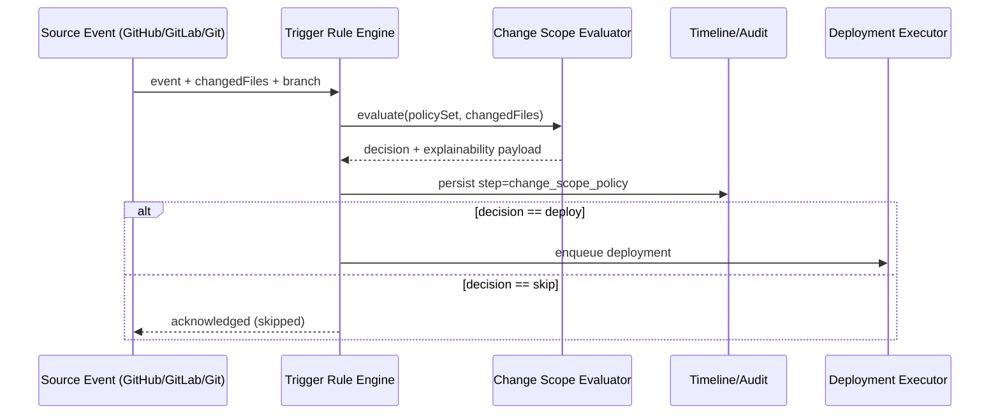

<DocMeta source="advanced feature adaptation (T229)" scope="canonical" />

## Goal

Prevent unnecessary redeploys by evaluating repository changes against explicit path policies, while giving operators a clear "why deploy / why skip" preview before execution.

---

## Why this feature exists

In multi-service and monorepo setups, naive trigger rules cause noisy deployments. Teams need:

- precise change impact detection,
- deterministic trigger outcomes,
- human-readable explainability.

---

## Scope (v1)

### In scope

- Path-diff based trigger evaluation (`include`, `exclude`, `glob`)
- Policy preview endpoint/UI card before deploy execution
- Deterministic match explanation (matched paths, ignored paths, applied rule IDs)
- Branch/event awareness integration (push/PR/tag + branch policy)

### Out of scope (v1)

- Semantic code ownership graph analysis
- AST-aware impact inference
- Cross-repository dependency impact

---

## Policy model

```ts
type ChangeScopePolicy = {
  id: string;
  enabled: boolean;
  includeGlobs: string[];    // e.g. ["services/api/**", "packages/contracts/**"]
  excludeGlobs?: string[];   // e.g. ["**/*.md", "docs/**"]
  precedenceMode?: "exclude_wins" | "include_wins"; // configurable per policy
  minChangedFiles?: number;  // optional coarse threshold
  applyToEvents?: Array<"push" | "pull_request" | "tag">;
  applyToBranches?: string[];
};

type ChangeScopeResult = {
  decision: "deploy" | "skip";
  matchedPaths: string[];
  excludedPaths: string[];
  unmatchedPaths: string[];
  appliedPolicyIds: string[];
  reasonCode: string;
};
```

---

## Evaluation semantics

For changed paths set $D$ and policy include/exclude predicates $I(x), E(x)$:

```latex
matches = \{x \in D \mid I(x) \land \neg E(x)\}
```

Decision:

```latex
decision =
\begin{cases}
deploy & |matches| > 0 \\
skip & |matches| = 0
\end{cases}
```

Default decision when no path matches is **`skip`**.

Include/exclude precedence is **policy-configurable** via `precedenceMode`.

Event/branch filters must pass before path evaluation is considered authoritative.

---

## Runtime flow



---

## Explainability contract

Every decision must include:

- applied policy IDs,
- matching summary,
- final reason code,
- normalized changed-file count.

This payload should be available in:

- API response for preview endpoint,
- deployment timeline step (`change_scope_policy`),
- optional PR status summary/comment for provider integrations.

---

## Reason taxonomy

- `change_scope_deploy_match`
- `change_scope_skip_no_match`
- `change_scope_skip_event_not_allowed`
- `change_scope_skip_branch_not_allowed`
- `change_scope_skip_all_excluded`
- `change_scope_policy_invalid`
- `change_scope_diff_unavailable`

---

## Operator UX expectations

- Trigger policy editor with include/exclude glob validation
- "Preview decision" panel showing:
  - deploy/skip result,
  - matched and ignored paths,
  - applied policy IDs,
  - reason code
- Dry-run endpoint usable from CI and CLI

---

## Test strategy

### Unit

- glob matching determinism
- include/exclude precedence
- reason-code mapping

### Integration

- event/branch gate interaction with path policy
- preview endpoint response shape and stability
- timeline step persistence for skip/deploy outcomes

### E2E

- monorepo change in unrelated path is skipped
- change in required path deploys
- mixed changed files with exclusions behaves deterministically

---

## Definition of done

- Trigger engine supports path-diff change scope evaluation
- Preview endpoint/UI explains deploy vs skip deterministically
- Reason codes are stable and queryable in timeline/log views
- tests cover deploy/skip/error paths for event + branch + path combinations
- migration task `T229` is complete

---

## Task mapping

- `T229` — change-scoped deploy policy preview
- `T191` — path-filter support in GitHub trigger evaluation

---

## Related docs

- [Benchmark Feature Adaptation Matrix](/docs/deployment/benchmark-feature-adaptation-matrix)
- [GitHub Provider — Complete Feature & Task Breakdown](/docs/deployment/github-provider-feature-breakdown)
- [Migration Task Breakdown](/docs/deployment/migration-task-breakdown)
