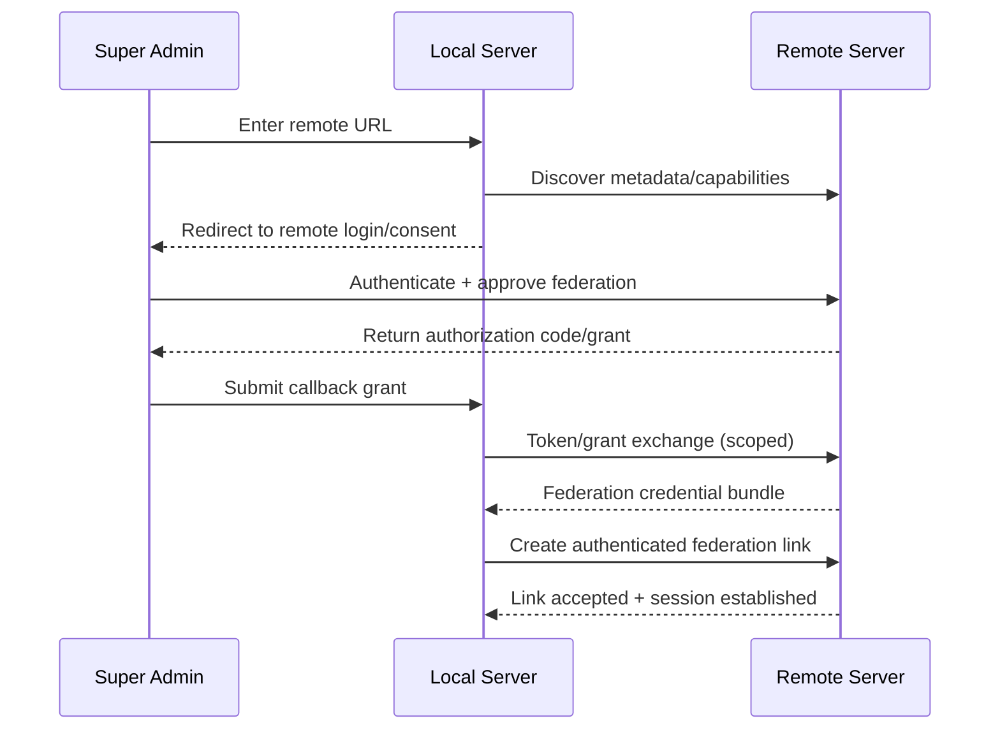

<DocMeta source="fleet architecture research synthesis (RFC 6749/7636/8414/8693/8705 + Consul/Nomad/Argo CD/Portainer operational patterns)" scope="canonical" />

## Why this exists

This document defines the target architecture for operating **many servers across many organizations** with one super-admin experience, while preserving a decentralized runtime model.

It is designed to support both:

- **Small users** (few servers, low ops overhead)
- **Large organizations** (many servers, strict security boundaries, high capacity growth and resilient recovery)

## Product model and roles

Core entities:

- **Server**: one deployer instance (self-hosted control + runtime plane)
- **Organization**: tenant boundary for projects, users, permissions, and audit scope
- **Fleet**: connected server set with trust + connectivity metadata
- **Federation link**: authenticated relationship between two servers

Primary actors:

- **Fleet Super Admin**: manages servers, trust links, and global policy boundaries
- **Org Admin**: manages organization resources and members
- **Org User**: scoped deployment/operator permissions inside org boundaries

## Recommended architecture (hybrid federation)

Use a **hybrid** model:

1. **Federated control-plane links** between servers (no global hard single source of truth)
2. **Local runtime autonomy** per server (server continues operating when peers are unreachable)
3. **Selective replication** for control data (memberships, capabilities, placement metadata), not full data mirroring

This combines practical operability (Hub/Spoke-like UX where needed) with decentralized failure tolerance.

## Mesh responsibility boundary (overhaul)

The mesh is a **control-plane search/index system**, not a user-traffic data-plane proxy.

### Mesh is responsible for

- resource ownership lookup across servers (where deployment/stream/log/queue ownership currently lives)
- topology and membership state
- control-envelope propagation and reconciliation metadata
- routing hints for direct requests (`ownerServerUrl`, endpoint path, protocol, priority)

### Mesh is **not** responsible for

- relaying end-user API calls between servers
- tunneling external SSE/stream subscriptions through mesh peer links
- acting as a long-lived reverse-proxy for user traffic

### Direct request policy

After lookup resolves an owner server, the receiving server must perform a **direct request** to the owner endpoint.

- Request path forwarding is direct-to-owner.
- Mesh link remains control-plane only.
- If ownership is unknown/stale, re-run lookup or fail with explicit retry guidance.

### Persistent subscription policy

Persistent operations (SSE/live stream subscriptions) must use a dedicated connection per subscription against the owner server.

- each subscription gets an independently trackable connection/session
- each subscription can be individually aborted/cancelled
- mesh links are never used to multiplex external subscriptions

### Responsibility matrix (T268 baseline)

For the current migration pack, mesh is treated as a transport/control substrate only.

#### Mesh responsibilities (distribution + cross-instance delivery)

- Propagate validated internal envelopes across instances.
- Maintain membership/liveness, fanout behavior, and partition-state handling.
- Enforce inter-node trust and replay-window protections.
- Provide owner-resolution/routing hints for direct server-to-owner handoff.

#### Mesh must not

- Define domain event meaning/taxonomy.
- Mutate business payload semantics in transit.
- Act as public data-plane proxy for end-user traffic.

#### Mesh transport invariants

- Delivery is at-least-once; consumers must be idempotent.
- Transport ordering is best-effort globally; domain ordering guarantees must be enforced per aggregate at the event application layer.
- Stale ownership or partition uncertainty must degrade to explicit retry/re-resolve behavior, never silent misrouting.

### Temporary scope note (org complexity deferral)

During the current execution pack, authorization and runtime execution gates prioritize platform roles + project roles. Org-scoped overlays/mesh partitions are intentionally deferred until the dedicated org-aware multi-instance phase.

```text
                    +------------------------------+
                    | Fleet Super Admin UI (local) |
                    +---------------+--------------+
                                    |
                             control operations
                                    |
      +-----------------------------+-----------------------------+
      |                                                           |
+-----v------------------+                          +-------------v-------------+
| Server A (local owner) |<====== federated ======>| Server B (remote owner)   |
| - orgs/users/projects  |      authenticated      | - orgs/users/projects      |
| - runtime + queue      |       link/session      | - runtime + queue          |
| - local source of truth|                          | - local source of truth    |
+------------------------+                          +----------------------------+
```

## Secure URL-first server connect flow

Target onboarding flow for connecting a remote server from local admin:

1. Admin enters **remote HTTP(S) URL**.
2. Local server performs discovery (`/.well-known` style metadata, capability checks).
3. Admin is redirected to remote server login/consent UI.
4. Remote server authenticates admin and issues a short-lived grant.
5. Local server exchanges grant for scoped federation credentials.
6. Mutual trust link is created with replay protection and audit trail.



## Security baseline (non-negotiable)

### Identity and delegated auth

- Use OAuth authorization-code style with PKCE for browser-mediated admin login/consent.
- Use metadata discovery for endpoint/capability validation before trust establishment.
- Use token exchange semantics for delegated cross-server actions (actor-aware delegation).

### Service-to-service trust

- Prefer mTLS for server-to-server channels where available.
- Bind sensitive access tokens/credentials to channel/client identity where possible.
- Enforce nonce + timestamp + replay window validation on control envelopes.

### Authorization model

- No implicit global superpowers from a single link.
- Cross-server actions must be explicitly scoped by:
  - target server
  - target org
  - operation class
  - TTL

### Audit and forensics

- Every cross-server action emits:
  - actor identity
  - delegation chain / source server
  - correlation id
  - operation result
  - policy decision trace

## Tenancy and placement strategy

Support tiered operations:

- **Tier S (small)**: shared server pool, simple quotas, minimal placement controls
- **Tier M**: mixed shared + dedicated workloads, org-level limits, noisy-neighbor controls
- **Tier L/XL**: dedicated cells/failure domains, residency-aware placement, strict org isolation and policy

Placement decision inputs:

- capacity + health
- region/residency constraints
- trust domain constraints
- org policy (shared vs dedicated)
- dependency locality

## Failure modes and edge cases

Minimum required behaviors:

1. **Network partition**: local operations continue; remote actions become deferred/retriable.
2. **Split-brain risk**: bounded conflict rules (last-writer for non-critical metadata, explicit reconciliation for critical links/leases).
3. **Credential/key rotation drift**: dual-key overlap windows and explicit rotation state.
4. **Remote server compromise suspicion**: link quarantine + scoped revocation + operator confirmation.
5. **Replay/duplicated control events**: idempotency keys + monotonic sequence/cursor checks.
6. **Cross-org shared-server contention**: quotas and admission controls to cap blast radius.
7. **Stale ownership lookup**: caller retries lookup and reconnects directly to the newly elected owner server.

## Simplicity vs. complexity adoption path

Progressive rollout (recommended):

1. **Phase 1**: URL connect + secure auth handshake + read-only remote visibility.
2. **Phase 2**: scoped cross-server operations + audit-complete eventing.
3. **Phase 3**: policy-aware placement + capacity expansion + advanced tenancy controls.
4. **Phase 4**: full federation governance (multi-domain trust, advanced policy packs, compliance exports).

This keeps the first user experience simple while leaving a clear enterprise growth path.

## Alignment with current migration track

This architecture maps directly to mesh/federation migration tasks:

- topology/membership/session resilience foundations: `T100`–`T103`, `T113`, `T114`
- pending distributed queue/replication/failover/security controls: `T104`–`T112`

## Reference standards and operational analogs

- OAuth 2.0 Authorization Framework (RFC 6749)
- PKCE (RFC 7636)
- Authorization Server Metadata Discovery (RFC 8414)
- OAuth Token Exchange (RFC 8693)
- OAuth mTLS + Certificate-Bound Tokens (RFC 8705)
- Consul federation/network-area patterns
- Nomad multi-region federation model
- Argo CD multi-cluster credential + RBAC management patterns
- Portainer Edge agent bootstrap/tunnel model

## Related docs

- [Multi-Server & Multi-Org Operations](/docs/deployment/multi-server-multi-org-operations)
- [Migration Task Breakdown](/docs/deployment/migration-task-breakdown)
- [Fleet Federation Handshake Protocol](/docs/deployment/fleet-federation-handshake-protocol)
- [Platform Feature Target](/docs/deployment/platform-feature-target)
- [Migration Master Plan](/docs/deployment/migration-master-plan)
- [Production Deployment](/docs/deployment/production-deployment)