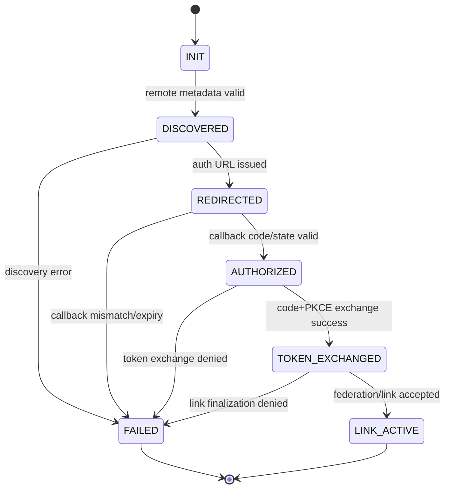

<DocMeta source="fleet federation secure connect protocol (RFC 6749/7636/8414/8693/8705 aligned)" scope="canonical" />

## Purpose

Define the exact handshake used when a local server connects to a remote server using a URL-first flow:

1. discover remote capabilities
2. redirect user to remote login/consent
3. receive callback grant
4. exchange grant for scoped federation credentials
5. establish authenticated server-to-server link

## Protocol goals

- **Secure-by-default** (PKCE, nonce/state validation, short-lived grants)
- **Explicit delegation** (actor and scope are auditable)
- **Replay-resistant** (idempotency key + nonce + timestamp windows)
- **Operator-friendly** (deterministic error categories and retry guidance)

## Mesh/data-plane boundary

Handshake creates trust and discovery capability; it does **not** authorize mesh to proxy user traffic.

- Federation/mesh links are control-plane channels.
- User API requests are routed directly to the owner server endpoint after lookup.
- Persistent streams (SSE/subscriptions) are opened directly to owner servers with dedicated, abortable connections.

## Endpoints (logical)

Remote server exposes:

- `GET /.well-known/oauth-authorization-server` (or equivalent metadata)
- `GET /federation/authorize` (interactive login + consent)
- `POST /federation/token` (grant/code exchange)
- `POST /federation/link` (finalize authenticated link)

Local server exposes:

- `POST /fleet/connect/start`
- `GET /fleet/connect/callback`
- `POST /fleet/connect/finalize`

## Message model

### 1) Connect start (local)

`POST /fleet/connect/start`

Request:

```json
{
  "remoteUrl": "https://remote.example.com",
  "displayName": "prod-eu-1",
  "requestedScopes": [
    "fleet:read",
    "fleet:link:create",
    "org:map:read"
  ]
}
```

Response:

```json
{
  "connectionId": "cnx_01J...",
  "authorizationUrl": "https://remote.example.com/federation/authorize?...",
  "codeChallengeMethod": "S256",
  "expiresAt": "2026-02-25T12:10:00.000Z"
}
```

### 2) Remote authorize (interactive)

`GET /federation/authorize`

Required query parameters:

- `client_id`
- `redirect_uri`
- `response_type=code`
- `code_challenge`
- `code_challenge_method=S256`
- `state`
- `nonce`
- `scope`
- `audience` (target local server identifier)

Behavior:

- remote server authenticates user
- verifies super-admin eligibility (or delegated admin policy)
- shows consent for scoped federation link
- returns `code` + `state` to local callback

### 3) Callback receive (local)

`GET /fleet/connect/callback?code=...&state=...`

Validation:

- `state` must match `connectionId` context
- pending session must be non-expired and non-used
- nonce and PKCE verifier must exist for this connection

On success: mark connection state `AUTHORIZED`.

### 4) Token/grant exchange (server-to-server)

Local calls remote `POST /federation/token`:

```json
{
  "grant_type": "authorization_code",
  "code": "auth_code",
  "redirect_uri": "https://local.example.com/fleet/connect/callback",
  "client_id": "local-server-id",
  "code_verifier": "pkce-verifier",
  "requested_token_type": "urn:ietf:params:oauth:token-type:access_token"
}
```

Remote response:

```json
{
  "access_token": "...",
  "issued_token_type": "urn:ietf:params:oauth:token-type:access_token",
  "token_type": "Bearer",
  "expires_in": 300,
  "scope": "fleet:read fleet:link:create org:map:read",
  "actor": {
    "sub": "admin@remote",
    "server_id": "srv_remote_01"
  }
}
```

### 5) Finalize federation link

Local calls remote `POST /federation/link` over authenticated channel:

```json
{
  "connectionId": "cnx_01J...",
  "localServer": {
    "serverId": "srv_local_01",
    "baseUrl": "https://local.example.com"
  },
  "proof": {
    "nonce": "n_...",
    "timestamp": "2026-02-25T12:03:01.000Z",
    "idempotencyKey": "idem_01J..."
  }
}
```

Response:

```json
{
  "linkId": "lnk_01J...",
  "status": "ACTIVE",
  "peerServerId": "srv_remote_01",
  "grantedScopes": ["fleet:read", "fleet:link:create", "org:map:read"]
}
```

## State machine



## Error model

All errors should be mapped into these stable categories:

- `DISCOVERY_FAILED`
- `METADATA_INVALID`
- `AUTHORIZATION_DENIED`
- `STATE_MISMATCH`
- `NONCE_MISMATCH`
- `CODE_EXPIRED_OR_USED`
- `PKCE_VERIFICATION_FAILED`
- `TOKEN_SCOPE_INSUFFICIENT`
- `LINK_ALREADY_EXISTS`
- `REPLAY_DETECTED`
- `REMOTE_UNAVAILABLE`
- `POLICY_BLOCKED`

Error envelope:

```json
{
  "error": "REPLAY_DETECTED",
  "message": "Nonce already consumed",
  "correlationId": "corr_01J...",
  "retryable": false,
  "retryAfterMs": null
}
```

## Token/session lifetime defaults

Recommended defaults:

- authorization code lifetime: **120s**
- connect session lifetime (`connectionId` context): **10m**
- exchanged access token lifetime: **300s**
- idempotency key dedupe window: **15m**
- replay nonce cache window: **15m**

## Retry policy

- Retry only if `retryable=true`.
- Exponential backoff with jitter: base 500ms, cap 15s, max 5 attempts.
- Never retry automatically on policy/auth/validation failures.
- Always keep same `idempotencyKey` when retrying finalization.

## Security checklist

- Enforce HTTPS-only endpoints.
- Enforce strict redirect URI matching.
- Enforce PKCE S256.
- Enforce one-time code usage.
- Log actor/delegation chain for every cross-server action.
- Support credential/key rotation with overlap windows.
- Deny ambiguous scope escalation during token exchange.

## Implementation notes for this repository

- Keep this protocol authoritative for URL-first peer connect flows.
- Contracts should define typed request/response/error schemas per step.
- Runtime should emit lifecycle events aligned to state transitions above.

## Related docs

- [Fleet Federation Architecture](/docs/deployment/fleet-federation-architecture)
- [Multi-Server & Multi-Org Operations](/docs/deployment/multi-server-multi-org-operations)
- [Migration Task Breakdown](/docs/deployment/migration-task-breakdown)
- [Platform Feature Target](/docs/deployment/platform-feature-target)