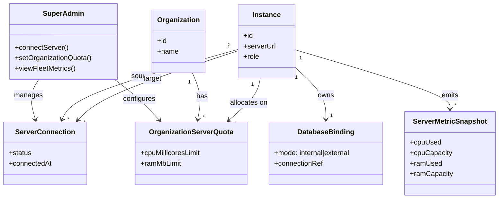
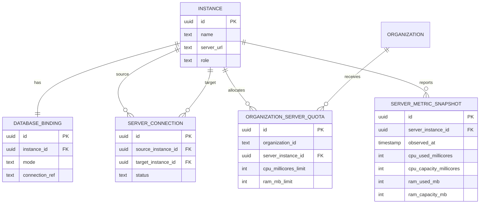

## Super admin model (v1 scope)

> **Added**: 2026-03-03  
> **Type**: Pattern  
> **Confidence**: Verified ✅  
> **Scope**: v3

### Summary
A super admin connects multiple servers and assigns per-organization CPU/RAM quotas per server; each instance uses exactly one database, and the load balancer uses the same database as its host instance.

### Context
To reduce complexity and avoid ambiguous data ownership, the current scope intentionally excludes multi-database merge/federation logic. The first deliverable is a clear super-admin manager for server connections and org resource allocations.

## Scope freeze (Phase 1 authoritative decisions)

This section is the source of truth for current implementation and product behavior.

- **One instance = one database** (internal or external, but exactly one active binding).
- **Load balancer uses the database of its own host instance**.
- **No database federation / merge across instances in Phase 1**.
- **No cross-instance shared application database in Phase 1**.
- **Super admin controls only**:
  - server connections,
  - organization-to-server assignment,
  - per-organization CPU/RAM capacity allocation by server,
  - fleet usage visibility (metrics).
- **Organization users can read** their allowed CPU/RAM by server.

### Deferred (explicitly out of scope)

- Shared database across multiple instances.
- Runtime database ownership transfer between instances.
- Multi-DB composition/merge strategies and conflict resolution.
- Cross-instance secret orchestration beyond current control-plane needs.

### Rules (explicit constraints)
- One instance = one database.
- A load balancer attached to an instance uses that instance database.
- No cross-instance database merge orchestration in this phase.
- Super admin is the only role that can manage:
  - server connections,
  - organization → server assignment,
  - organization quota limits (CPU, RAM).
- Organizations can read their allowed CPU/RAM by server.

## Conceptual schema

### Core entities
- **Instance**: a deployer control plane node.
- **DatabaseBinding**: selected database for the instance (internal/external).
- **ServerConnection**: trusted link between two instances.
- **OrganizationServerQuota**: allowed CPU/RAM for one organization on one server.
- **ServerMetricSnapshot**: latest observed usage/capacity metrics for server visibility.

### Logical DDL (conceptual)

```sql
-- One row per instance; each instance has exactly one DB binding.
instance(id PK, name, server_url, role, created_at)

database_binding(
  id PK,
  instance_id FK UNIQUE,         -- enforce 1:1 binding
  mode ENUM('internal','external'),
  connection_ref,
  updated_at
)

server_connection(
  id PK,
  source_instance_id FK,
  target_instance_id FK,
  status ENUM('connected','degraded','disconnected'),
  connected_at,
  updated_at,
  UNIQUE(source_instance_id, target_instance_id)
)

organization_server_quota(
  id PK,
  organization_id,
  server_instance_id FK,
  cpu_millicores_limit,
  ram_mb_limit,
  created_by_user_id,
  created_at,
  updated_at,
  UNIQUE(organization_id, server_instance_id)
)

server_metric_snapshot(
  id PK,
  server_instance_id FK,
  observed_at,
  cpu_used_millicores,
  cpu_capacity_millicores,
  ram_used_mb,
  ram_capacity_mb,
  active_streams,
  queue_depth
)
```

## UML (domain view)



## ER diagram (storage view)



## Sequence (runtime intent)

```mermaid
sequenceDiagram
  participant SA as Super Admin UI
  participant API as API (control plane)
  participant DB as Instance DB
  participant LB as Load Balancer

  SA->>API: connectServer(targetServerUrl)
  API->>DB: persist ServerConnection(status=connected)
  API-->>SA: connection result

  SA->>API: setQuota(orgId, serverId, cpu, ram)
  API->>DB: upsert OrganizationServerQuota
  API-->>SA: quota saved

  LB->>DB: read org/server quota context
  LB-->>API: resolve routing + policy checks
  API-->>SA: org-visible allowed CPU/RAM by server
```



## Implementation status
- ✅ Architecture constraints frozen for current scope.
- ✅ Diagram + schema documentation added.
- ✅ Contracts added under `packages/contracts/api/modules/fleet` and wired into `core.fleet`.
- ✅ API system module added under `apps/api/src/system/modules/fleet` with super-admin guarded allocation operations.
- ✅ Web domain layer added under `apps/web/src/domains/fleet`.
- ✅ Super-admin dashboard section added in `apps/web/src/app/dashboard/admin/system/page.tsx` for server listing and org CPU/RAM allocation management.

## Related execution tracking
- [Migration Task Breakdown](/docs/deployment/migration-task-breakdown)
