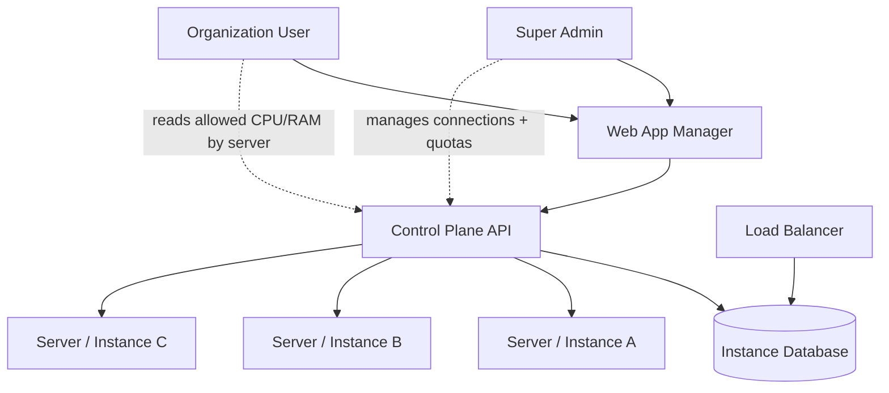
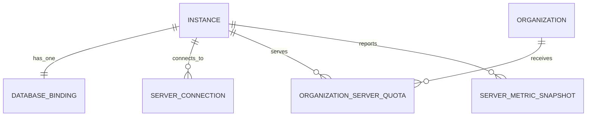

## Phase 1 decision snapshot

> **Added**: 2026-03-03  
> **Type**: Workflow  
> **Confidence**: Verified ✅  
> **Scope**: v3

### Summary
Phase 1 is intentionally simple: a super admin connects servers and allocates CPU/RAM per organization per server, while each instance keeps exactly one database.

### Context
This scope avoids combinatorial complexity from multi-database federation, cross-instance DB merge, and runtime database ownership transfer.

### Details / Implementation

#### Hard rules (authoritative)
- One instance = one active database binding (internal or external).
- Load balancer uses its own host instance database.
- No cross-instance shared DB / DB merge in Phase 1.
- Super admin manages:
  - server connections,
  - org → server assignment,
  - org CPU/RAM allocation by server,
  - fleet metrics visibility.
- Organization users can read their allowed CPU/RAM by server.

#### What this enables now
- Fast operational clarity.
- Clear ownership boundaries.
- Predictable control-plane behavior for quota decisions.

#### What is deferred
- Shared database across instances.
- Cross-instance DB composition/federation.
- Runtime database export/import ownership transfer workflows.

## Executive architecture diagram

## Core data model (Phase 1)

## Phase 1 acceptance and sign-off checklist

- [ ] Product confirms scope freeze for Phase 1 (no cross-instance DB merge/federation).
- [ ] Ops confirms load balancer DB boundary (LB uses host instance DB only).
- [ ] Product + Ops confirm super-admin responsibilities (connections, org/server allocation, CPU/RAM quotas, metrics visibility).
- [ ] Product + Ops confirm org visibility requirement (org can read allowed CPU/RAM by server).
- [ ] Approval recorded in migration checklist task `T138`.

## Sign-off log

| Date | Approver | Role | Decision | Notes |
|------|----------|------|----------|-------|
| _TBD_ | _TBD_ | Product | Pending | |
| _TBD_ | _TBD_ | Operations | Pending | |

## Affected Files / Locations
- `apps/doc/content/docs/deployment/super-admin-fleet-manager-architecture.mdx` — full technical architecture with schema/UML/sequence diagrams.

## Known Limitations / Caveats
- This page is intentionally simplified for product/ops alignment; use the technical architecture page for implementation details.

## Related Documentation
- [Super Admin Fleet Manager Architecture](/docs/deployment/super-admin-fleet-manager-architecture)
- [Multi-Server & Multi-Org Operations](/docs/deployment/multi-server-multi-org-operations)
- [Migration Task Breakdown](/docs/deployment/migration-task-breakdown)
