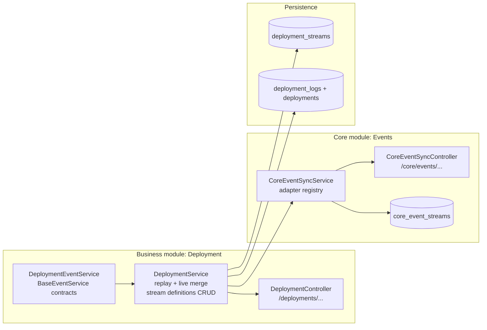
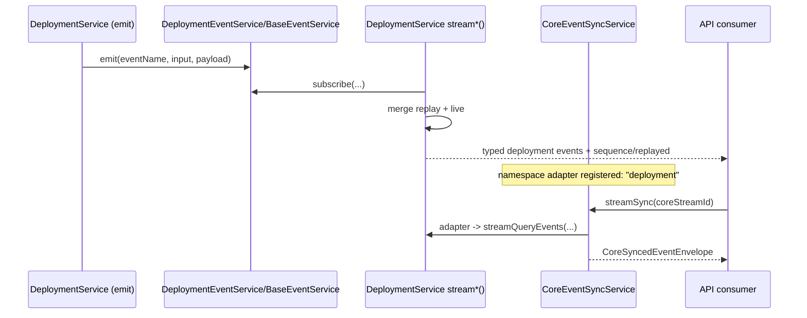

## Why this exists

The v3 event architecture is split into **two complementary systems**:

1. **Business/User stream API** (deployment module)
   - what product features consume directly (`/deployments/...` endpoints)
2. **Core sync stream API** (core events module)
   - business-agnostic sync layer (`/core/events/...` endpoints)
   - reusable across namespaces via adapters (`deployment`, later `project`, `service`, etc.)

This gives strong DX: business modules define stream intent once, and core sync handles normalized streaming envelopes.

Exposure rule: end users consume realtime data through dedicated domain routes (for example deployment, service, project, analytics routes). Internal raw stream identifiers/keys are resolved server-side and are never exposed as direct public stream routes.

## Responsibility matrix (T268 baseline)

This section is the canonical boundary for the realtime architecture in the current migration pack.

### Event system responsibilities (domain truth + replayability)

- Define typed domain event taxonomy and payload contracts.
- Emit events only from committed state transitions.
- Own replay/cursor semantics for domain-consumer streams.
- Enforce per-aggregate ordering and idempotent application invariants.

### Event system must not

- Encode mesh transport routing details in domain payload contracts.
- Depend on peer topology membership details to define business meaning.

### Event invariants

- Every event has stable identity (`eventId`) and event type versioning.
- Events are append-only facts; mutation happens in projections, not by rewriting history.
- Replay from DB-backed state must deterministically reconstruct equivalent read-model state.

### Database responsibilities for event correctness

- Remains the durable source of truth for state and replay base.
- Persists outbox/event records transactionally with state changes.
- Provides recovery path after process/node failure for replay/catch-up.

## High-level architecture

## Core building blocks

### 1) Base typed event bus (`BaseEventService`)

File: `apps/api/src/core/modules/events/base-event.service.ts`

- In-memory event channels keyed by `eventPrefix:eventName:firstInputValue`
- Type-safe `subscribe(...)` and `emit(...)` with Zod validation
- Supports processing strategies:
  - `parallel`
  - `queue`
  - `abort`
  - `ignore`

This is the low-level primitive used by feature event services like deployment.

### 2) Deployment event contracts

File: `apps/api/src/modules/deployment/services/deployment-event.service.ts`

Deployment defines strongly typed events (`deploymentTriggered`, `statusChanged`, `logAppended`, etc.) via `contractBuilder()` and extends `BaseEventService`.

So producers/consumers are validated at runtime and typed at compile-time.

### 3) Replay + live stream composition

File: `apps/api/src/modules/deployment/services/deployment.service.ts`

Each stream endpoint composes:

- **Replay** from DB (`deployments`, `deployment_logs`)
- **Live** from event subscriptions
- normalization with:
  - `sequence`
  - `replayed`
  - `emittedAt`

via `toSequencedAsyncIterable(...)`.

### 4) Core sync service (namespace adapters)

File: `apps/api/src/core/modules/events/services/core-event-sync.service.ts`

Core sync stores stream definitions in `core_event_streams`, then streams through a namespace adapter:

- `registerNamespaceAdapter(namespace, adapter)`
- `streamSync({ id, replay, replayLimit })`
- wraps emitted events in a generic envelope:
  - `streamId`
  - `namespace`
  - `eventName`
  - `payload`
  - `sequence`
  - `replayed`
  - `emittedAt`

### 5) Auto-mirroring from deployment stream definitions to core stream definitions

File: `apps/api/src/modules/deployment/services/deployment.service.ts`

When deployment stream definitions are managed:

- `createStreamDefinition` creates core stream (`namespace: "deployment"`) first, then stores `coreStreamId` in `deployment_streams`
- `updateStreamDefinition` updates linked core stream (if linked)
- `deleteStreamDefinition` deletes linked core stream (if linked)

This is the "define once, sync automatically" behavior.

## Typed schemas (source of truth)

### Deployment stream definition schema

File: `packages/contracts/api/common/deployment.ts`

Key fields:

- `id: uuid`
- `coreStreamId: uuid | null`
- `name: string`
- `isActive: boolean`
- `deploymentId | serviceId | projectId: uuid | null`
- `statusFilter`, `environmentFilter`
- `eventTypes: DeploymentStreamEventType[] | null`
- `replayDefault`, `replayLimitDefault`

### Core event stream definition schema

File: `packages/contracts/api/common/event-stream.ts`

Key fields:

- `id: uuid`
- `namespace: string`
- `scope: global | tenant | project | service | deployment`
- `scopeId: string | null`
- `filters: Record<string, unknown> | null`
- `replayDefault`, `replayLimitDefault`

### Core synced envelope schema

Also in `packages/contracts/api/common/event-stream.ts`:

- `streamId`
- `namespace`
- `eventName`
- `payload`
- `sequence?`
- `replayed?`
- `emittedAt?`

## API surface (two systems)

### A) User/business stream endpoints

Contracts file: `packages/contracts/api/modules/deployment/stream.ts`  
Controller: `apps/api/src/modules/deployment/controllers/deployment.controller.ts`

- `GET /deployments/{id}/stream`
- `GET /deployments/services/{serviceId}/stream`
- `GET /deployments/stream/query`
- CRUD/list of saved deployment stream definitions:
  - list, findById, create, update, delete

### B) Core sync endpoints

Contracts file: `packages/contracts/api/modules/events/index.ts`  
Controller: `apps/api/src/core/modules/events/controllers/core-event-sync.controller.ts`

Under `/core/events`:

- list/find/create/update/delete core stream definitions
- `GET /core/events/sync/{id}/stream`

All are auth-guarded with `requireAuth()` in controllers.

## Persistence model

### `deployment_streams`

File: `apps/api/src/config/drizzle/schema/deployment.ts`

Stores business-oriented stream definitions and references core with `core_stream_id`.

### `core_event_streams`

File: `apps/api/src/config/drizzle/schema/events.ts`

Stores generic sync definitions independent of any business module internals.

## Stream lifecycle (end-to-end)

## How to add a new namespace (quick recipe)

1. Define namespace-specific events (typed contracts) with `BaseEventService`.
2. Implement namespace replay + live composition function returning `AsyncIterable`.
3. Register adapter in your service constructor:
   - `coreEventSyncService.registerNamespaceAdapter("<namespace>", adapter)`
4. Optionally add business stream-definition CRUD and mirror into core stream definitions.

## Current limits / important notes

- This event bus is currently **in-process** (memory + DB replay), not yet a distributed broker.
- **Target**: all internal events will be distributed through the **Mesh** (ORPC EventIterator over HTTP/SSE, gossip-ring topology with K neighbors). This means the event system will become the backbone for multi-node sync, multi-DB replication, and cross-node coordination.
- Core sync is generic, but correctness depends on each namespace adapter's mapping logic.
- `filters` in core definitions are intentionally flexible (`Record<string, unknown>`), so namespace adapters must enforce semantics.

## Mesh distribution (target architecture)

When the mesh layer is complete, all events emitted through `BaseEventService` will be:

1. **Emitted locally** (current behavior)
2. **Propagated to K mesh neighbors** via ORPC EventIterator over HTTP/SSE
3. **Transitively forwarded** through the gossip ring until all nodes receive the event
4. **Used for DB sync** — if multiple PostgreSQL instances exist, mesh events drive replication

The mesh transport uses the same ORPC contract system as the public API. Internal mesh contracts are separate from public API contracts — mesh endpoints are not exposed externally.

## Relevant source files

- `apps/api/src/core/modules/events/base-event.service.ts`
- `apps/api/src/core/modules/events/event-contract.builder.ts`
- `apps/api/src/core/modules/events/services/core-event-sync.service.ts`
- `apps/api/src/core/modules/events/controllers/core-event-sync.controller.ts`
- `apps/api/src/core/modules/events/repositories/core-event-stream.repository.ts`
- `apps/api/src/modules/deployment/services/deployment-event.service.ts`
- `apps/api/src/modules/deployment/services/deployment.service.ts`
- `apps/api/src/modules/deployment/controllers/deployment.controller.ts`
- `packages/contracts/api/common/deployment.ts`
- `packages/contracts/api/common/event-stream.ts`
- `packages/contracts/api/modules/deployment/stream.ts`
- `packages/contracts/api/modules/events/index.ts`

## Related docs

- [Event Stream API Examples](/docs/dev/event-system-stream-examples)
- [ORPC Type-Safe API](/docs/dev/orpc)
