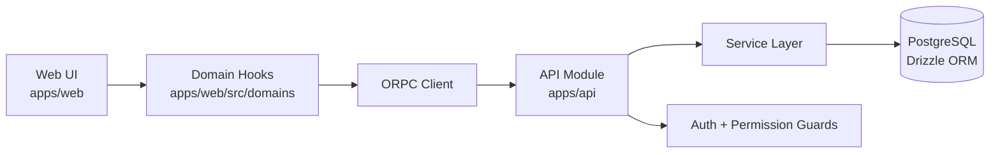
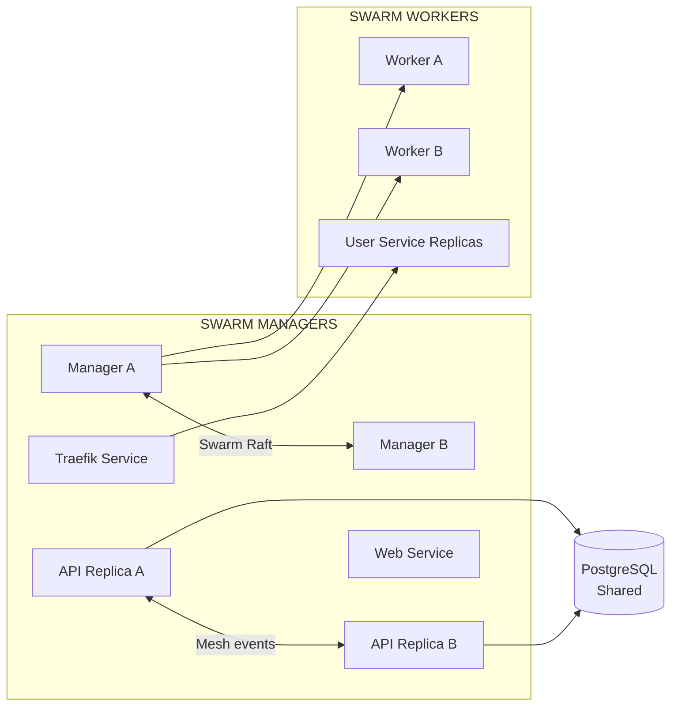

<DocMeta source=".docs/reference/ARCHITECTURE.md" scope="canonical" />

## Monorepo topology

- `apps/api`: NestJS runtime (ORPC implementation + auth + DB access)
- `apps/web`: Next.js App Router frontend
- `apps/doc`: Fumadocs-powered documentation app
- `packages/contracts/api`: shared ORPC contracts
- `packages/utils/*`: shared runtime/tooling utilities
- `packages/ui/base`: shared UI components
- `packages/configs/*`: linting/build/test configuration packages

## Data Flow

1. Client UI invokes typed ORPC query/mutation hooks.
2. ORPC client routes requests to API endpoints.
3. API controllers implement shared contracts using NestJS + ORPC.
4. Service layer coordinates authorization, business logic, and persistence.
5. Drizzle handles PostgreSQL query/mutation execution.

## Request path diagram

## Authentication flow

- Better Auth handles identity/session primitives.
- API applies auth-aware guards and permission checks.
- Web reads session state via auth client and domain hooks.
- Role/permission conditions gate route and UI access.

<DocCallout title="Boundary rule" tone="warning">
Keep contract definitions in shared packages, implementations in API, and UI data orchestration in web domain hooks.
</DocCallout>

## Docker topology — Swarm baseline

The canonical v3 target is a Docker Swarm cluster with manager/worker roles.

- **Manager node(s)**: orchestrator control plane (Raft), service scheduling, stack/service updates.
- **Control-plane services** (`traefik`, `api`, `web`): deployed as Swarm services and managed from managers.
- **Worker node(s)**: execute scheduled service tasks/replicas.
- **Shared PostgreSQL**: primary source of truth for platform state.
- **Mesh (ORPC EventIterator over HTTP/SSE)**: cross-node event/resource coordination between API nodes.

## Multi-node topology

In a multi-node Swarm cluster, nodes are connected by:

1. **Swarm control plane** — manager quorum + worker membership.
2. **Shared PostgreSQL** — users, orgs, projects, deployments, topology metadata.
3. **Mesh** — distributed event/resource coordination across API nodes.
4. **Traefik ingress** — Swarm-aware routing and balancing for platform and deployed HTTP services.
5. **Optional custom LB app** — only for advanced owner-aware routing/diagnostic scenarios.

See [Production Deployment](/docs/deployment/production-deployment) for the baseline rollout model.

## Implementation order (for architecture-impacting changes)

<DocStepFlow
	steps={[
		{
			title: 'Update contracts first',
			description: 'Keep shared API contracts as the source of type truth before implementation.',
		},
		{
			title: 'Implement API behavior',
			description: 'Apply business logic and authorization in API modules/services.',
		},
		{
			title: 'Regenerate and connect web hooks',
			description: 'Refresh generated artifacts, then wire usage through web domain hooks.',
		},
		{
			title: 'Validate system-wide',
			description: 'Run check scripts to ensure architecture contracts stay coherent end-to-end.',
		},
	]}
/>

## Related docs

- [Platform Product Specification](/docs/architecture/platform-product-spec)
- [Tech Stack](/docs/architecture/tech-stack)
- [Mesh-Consumer Boundary Pattern](/docs/architecture/mesh-consumer-boundary-pattern)
- [Mesh Peer Selection Algorithm](/docs/architecture/mesh-peer-selection-algorithm)
- [Development Workflow](/docs/dev/development-workflow)
- [ORPC Type-Safe API Workflow](/docs/dev/orpc)
- [Event System & Stream Sync](/docs/dev/event-system-streams)
- [Load Balancer Architecture](/docs/deployment/load-balancer) *(optional advanced pattern)*
- [Cluster Signing Keys & Shared Secrets](/docs/deployment/cluster-signing-keys)
- [Instance Port Conventions](/docs/deployment/instance-ports)
- [Multi-server Multi-org Operations](/docs/deployment/multi-server-multi-org-operations)
