> **Added**: 2026-04-16  
> **Type**: Reference  
> **Confidence**: Verified ✅  
> **Scope**: v3 architecture

This page documents the **actual model hierarchy** of the v3 platform from source-of-truth schema files, including:

- business entities (`project`, `service`, `deployment`, `user`)
- infrastructure entities (`docker/*`, `traefik`, `setup`)
- orchestration/control entities (`event-stream`, `mesh/*`)
- API contract and runtime wiring (`contracts/api` → `apps/api` → `apps/web`)

---

## 1) Source-of-truth layering

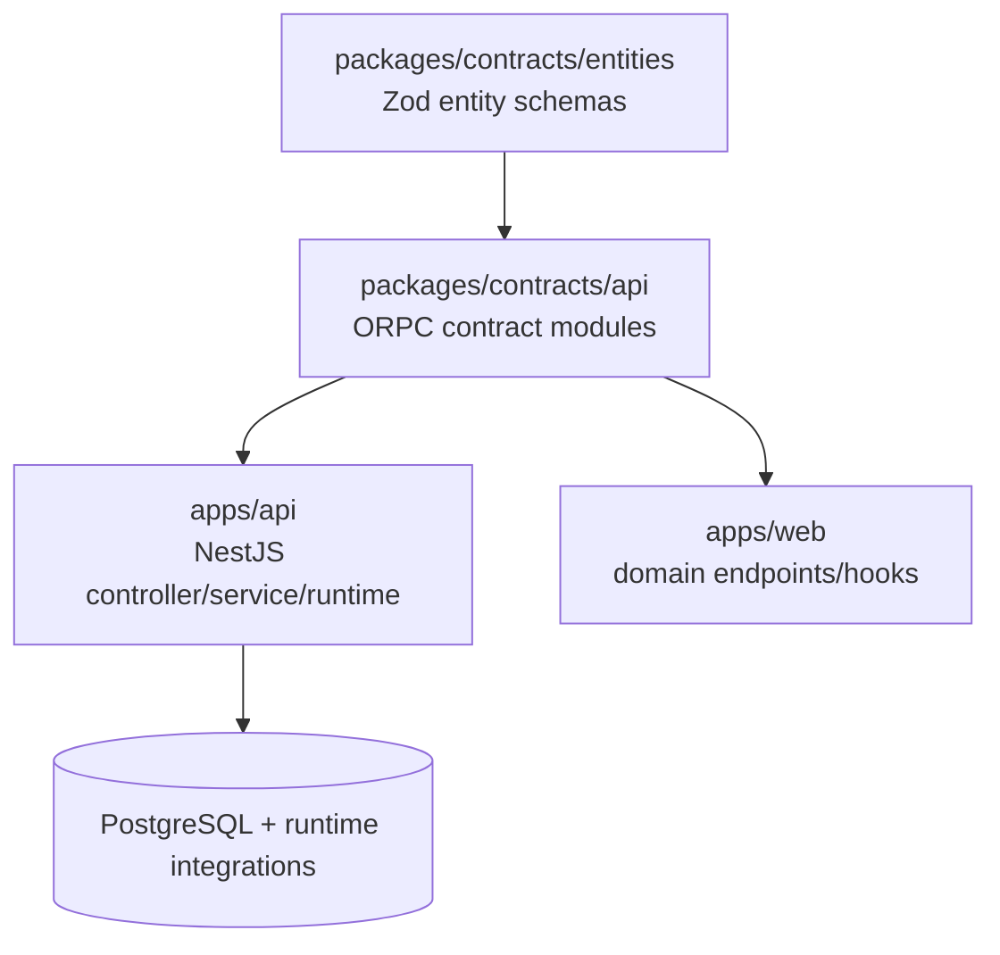

Interpretation:

1. `contracts/entities` defines model vocabulary.
2. `contracts/api` exposes typed operations over those models.
3. API/web consume the contracts as implementation and client entry points.

---

## 2) Global entity family hierarchy

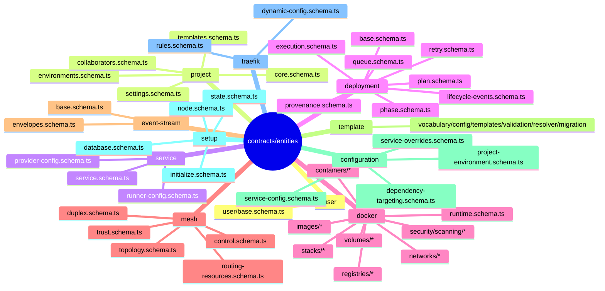

---

## 3) Core business model graph

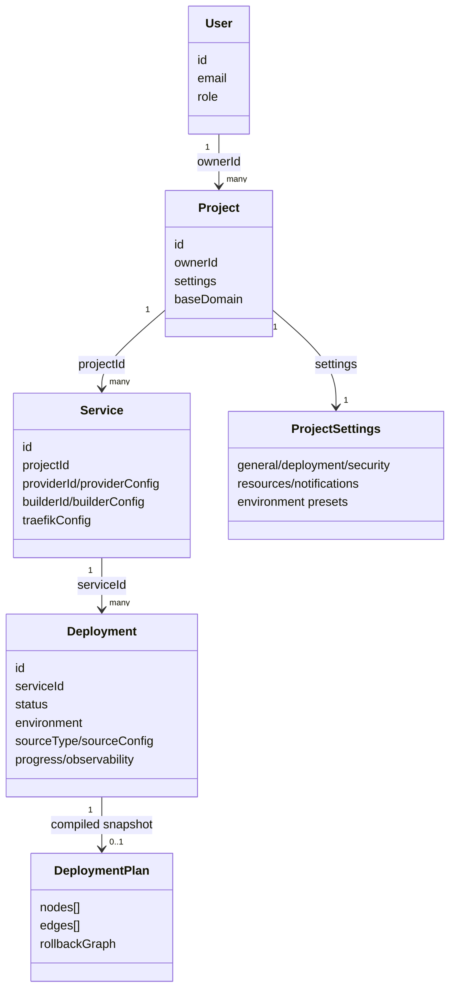

---

## 4) Docker entity relationship model (`z.lazy` graph)

`docker/*/relations.schema.ts` defines relation-bearing entity envelopes and uses `z.lazy(...)` extensively for linked graphs.

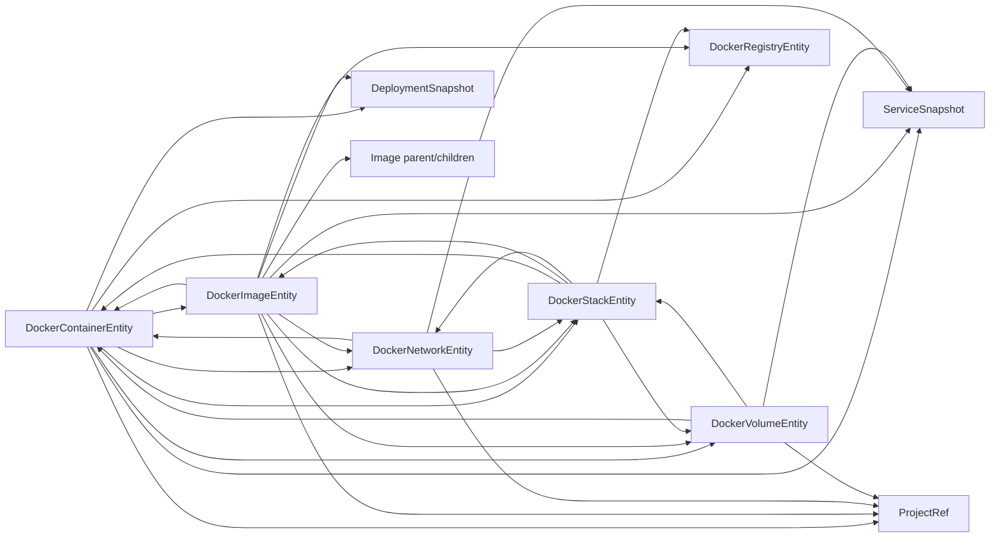

And the runtime aggregate is explicitly modeled by `dockerRuntimeCatalogSchema`:

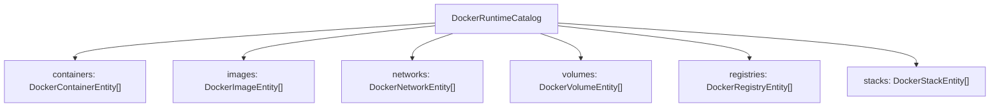

---

## 5) Mesh model hierarchy (entities)

The mesh model is split into five cohesive layers:

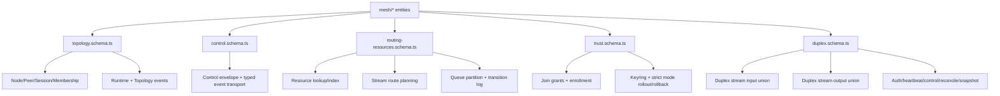

---

## 6) Mesh contract hierarchy (`core.mesh`)

`packages/contracts/api/modules/core/index.ts` mounts `meshContract` under `core.mesh`.

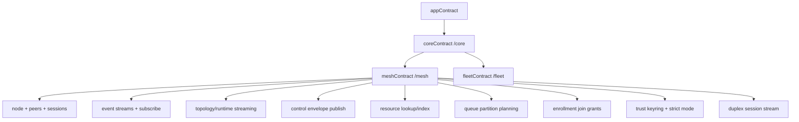

---

## 7) Mesh runtime wiring in API

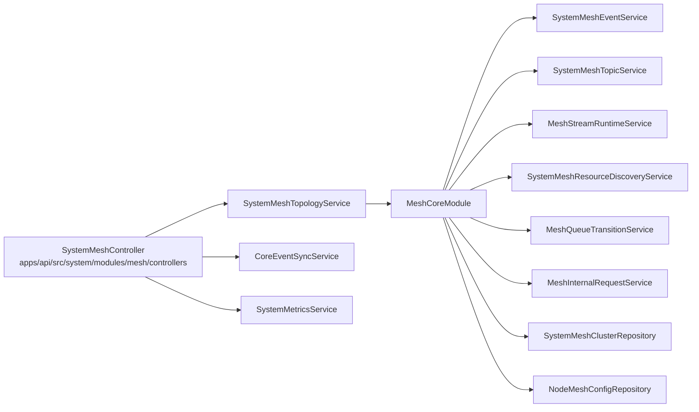

### Internal domain-mesh service pattern

`BaseMeshService` provides internal event-contract based call/observe semantics:

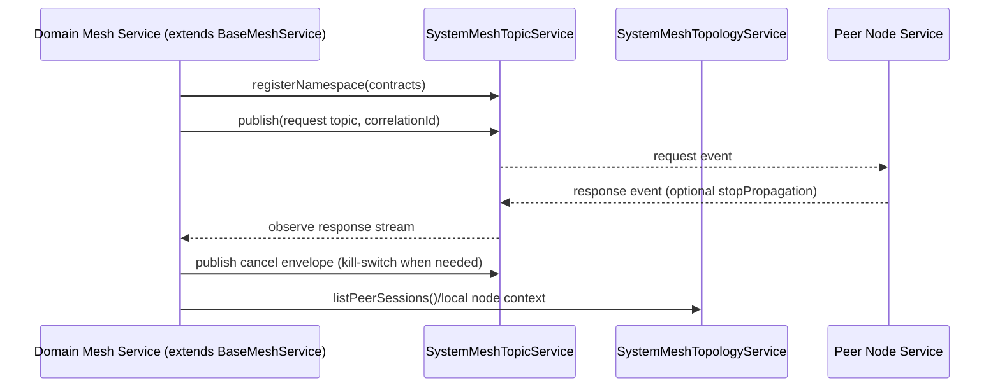

---

## 8) End-to-end model consumption path (web ↔ contracts ↔ api)

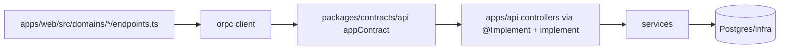

Examples of domain endpoint maps already aligned to this shape:

- `apps/web/src/domains/project/endpoints.ts`
- `apps/web/src/domains/service/endpoints.ts`
- `apps/web/src/domains/deployment/endpoints.ts`
- `apps/web/src/domains/docker/endpoints.ts`
- `apps/web/src/domains/mesh/endpoints.ts`

---

## 9) Contract module hierarchy (API surface)

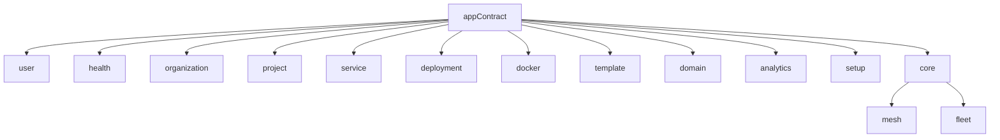

---

## 10) Source index (key files)

### Entity schemas

- `packages/contracts/entities/src/index.ts`
- `packages/contracts/entities/src/entities/project/*`
- `packages/contracts/entities/src/entities/service/*`
- `packages/contracts/entities/src/entities/deployment/*`
- `packages/contracts/entities/src/entities/docker/*`
- `packages/contracts/entities/src/entities/mesh/*`
- `packages/contracts/entities/src/entities/event-stream/*`
- `packages/contracts/entities/src/entities/template/*`
- `packages/contracts/entities/src/entities/configuration/*`
- `packages/contracts/entities/src/entities/setup/*`
- `packages/contracts/entities/src/entities/traefik/*`

### API contract wiring

- `packages/contracts/api/index.ts`
- `packages/contracts/api/modules/index.ts`
- `packages/contracts/api/modules/core/index.ts`
- `packages/contracts/api/modules/mesh/index.ts`

### API runtime wiring (mesh)

- `apps/api/src/core/modules/mesh/mesh-core.module.ts`
- `apps/api/src/system/modules/mesh/system-mesh.module.ts`
- `apps/api/src/system/modules/mesh/controllers/system-mesh.controller.ts`
- `apps/api/src/core/modules/mesh/services/base-mesh.service.ts`

### Web model consumers

- `apps/web/src/domains/*/endpoints.ts`

---

## 11) Practical reading order

1. Start with `contracts/entities` domain you need.
2. Move to matching `contracts/api/modules/<domain>`.
3. Read API controller + service implementation.
4. Confirm web domain endpoint/hook usage.
5. For distributed behavior, follow `core.mesh` + `BaseMeshService` first.

---

## 12) Mega ownership map (entire app in one diagram)

This is the single, end-to-end ownership and responsibility map you asked for.

```mermaid
flowchart TB
  %% =============================
  %% PLATFORM / INFRA LAYER
  %% =============================
  subgraph PLATFORM[Platform Cluster]
    direction TB

    subgraph SERVER_A[Server Node A]
      direction TB
      A_API[API Runtime\nNestJS + ORPC]
      A_WEB[Web Runtime\nNext.js]
      A_MESH[Mesh Node\nnodeId + roles]
      A_TRAEFIK[Traefik Instance\nrouters/services/middlewares]
      A_DOCKER[Docker Engine]
      A_LOCAL_DB[(Local DB\nSQLite / node config)]

      A_DOCKER --> A_CONT[Containers]
      A_DOCKER --> A_IMG[Images]
      A_DOCKER --> A_NET[Networks]
      A_DOCKER --> A_VOL[Volumes]
      A_DOCKER --> A_REG[Registries]
      A_DOCKER --> A_STK[Stacks]
      A_DOCKER --> A_RT[Runtime Streams\nlogs/processes/terminal/filesystem/events]
    end

    subgraph SERVER_B[Server Node B]
      direction TB
      B_API[API Runtime]
      B_MESH[Mesh Node]
      B_TRAEFIK[Traefik Instance]
      B_DOCKER[Docker Engine]
      B_LOCAL_DB[(Local DB\nSQLite)]
    end

    GLOBAL_DB[(Global DB\nPostgreSQL shared state)]
  end

  %% =============================
  %% IDENTITY / ACCESS LAYER
  %% =============================
  subgraph IAM[Identity, Membership & Roles]
    direction TB
    USER[User]

    subgraph PLATFORM_ROLES[Platform Roles\n@repo/auth PLATFORM_ROLES]
      P_SUPER[superAdmin]
      P_ADMIN[admin]
      P_OP[operator]
      P_VIEW[viewer]
    end

    ORG_MEMBERSHIP[Organization Membership]

    subgraph ORG_ROLES[Organization Roles\nORGANIZATION_ROLES]
      O_OWNER[owner]
      O_ADMIN[admin]
      O_MEMBER[member]
    end

    PROJECT_COLLAB[Project Collaborator]

    subgraph PROJECT_ROLES[Project Roles\nPROJECT_ROLES]
      PR_OWNER[owner]
      PR_MAINT[maintainer]
      PR_DEPLOY[deployer]
      PR_VIEW[viewer]
    end
  end

  %% =============================
  %% BUSINESS OWNERSHIP LAYER
  %% =============================
  subgraph BUSINESS[Business Ownership Chain]
    direction TB
    ORG[Organization]
    PROJECT[Project\nownerId + settings]
    SERVICE[Service\nproviderConfig + builderConfig]
    DEPLOYMENT[Deployment\nstatus/environment/source]
    DEP_PLAN[Deployment Compiled Plan\nnodes + edges + rollback graph]
    DEP_QUEUE[Deployment Queue / Execution]
    DEP_EVENTS[Deployment Lifecycle Events]
  end

  %% =============================
  %% DOMAIN / ROUTING / TEMPLATE LAYER
  %% =============================
  subgraph ROUTING[Template, Domain & Traffic Control]
    direction TB
    TEMPLATE[Templates\nprovider/build/deploy/route/preview/dependency]
    ORG_DOMAIN[Organization Domain]
    PROJ_DOMAIN[Project Domain]
    SVC_DOMAIN[Service Domain Mapping]
    TRAEFIK_CFG[Traefik Dynamic Config]
    ROUTE_RULES[Traefik Rules\nrouters/services/middlewares]
  end

  %% =============================
  %% DOCKER RESOURCE OWNERSHIP
  %% =============================
  subgraph DOCKER_MODEL[Docker Entity Ownership & Links]
    direction TB
    D_CONTAINER[Container Entity]
    D_IMAGE[Image Entity]
    D_NETWORK[Network Entity]
    D_VOLUME[Volume Entity]
    D_REGISTRY[Registry Entity]
    D_STACK[Stack Entity]
  end

  %% =============================
  %% MESH / DISTRIBUTED OWNERSHIP
  %% =============================
  subgraph MESH_MODEL[Mesh Ownership & Resource Index]
    direction TB
    M_NODE[Mesh Node State]
    M_PEER[Peer Connection / Session]
    M_RESOURCE[Resource Location Index\nkind+key -> ownerNodeId]
    M_STREAM[Stream Route Plan]
    M_CONTROL[Control Envelope]
    M_TRUST[Trust / Join Grants / Keyring]
    M_QUEUE[Queue Partition Ownership]
  end

  %% =============================
  %% EDGES: IAM -> BUSINESS
  %% =============================
  USER --> PLATFORM_ROLES
  USER --> ORG_MEMBERSHIP --> ORG_ROLES
  USER --> PROJECT_COLLAB --> PROJECT_ROLES

  USER --> ORG
  ORG --> PROJECT
  PROJECT --> SERVICE
  SERVICE --> DEPLOYMENT
  DEPLOYMENT --> DEP_PLAN
  DEPLOYMENT --> DEP_QUEUE
  DEPLOYMENT --> DEP_EVENTS

  %% =============================
  %% EDGES: BUSINESS -> ROUTING/TEMPLATE
  %% =============================
  TEMPLATE --> SERVICE
  ORG --> ORG_DOMAIN
  PROJECT --> PROJ_DOMAIN
  SERVICE --> SVC_DOMAIN
  SERVICE --> TRAEFIK_CFG --> ROUTE_RULES
  ORG_DOMAIN --> ROUTE_RULES
  PROJ_DOMAIN --> ROUTE_RULES
  SVC_DOMAIN --> ROUTE_RULES

  %% =============================
  %% EDGES: BUSINESS -> DOCKER MODEL
  %% =============================
  SERVICE --> D_CONTAINER
  DEPLOYMENT --> D_CONTAINER
  DEPLOYMENT --> D_IMAGE
  PROJECT --> D_CONTAINER
  PROJECT --> D_IMAGE
  PROJECT --> D_NETWORK
  PROJECT --> D_VOLUME
  PROJECT --> D_STACK

  D_CONTAINER --> D_IMAGE
  D_CONTAINER --> D_NETWORK
  D_CONTAINER --> D_VOLUME
  D_CONTAINER --> D_STACK
  D_CONTAINER --> D_REGISTRY

  D_IMAGE --> D_REGISTRY
  D_IMAGE --> D_STACK
  D_STACK --> D_NETWORK
  D_STACK --> D_VOLUME

  %% =============================
  %% EDGES: SERVER OWNS DOCKER FEATURES
  %% =============================
  A_API --> GLOBAL_DB
  A_API --> A_LOCAL_DB
  A_API --> A_TRAEFIK
  A_API --> A_DOCKER
  A_API --> A_MESH

  B_API --> GLOBAL_DB
  B_API --> B_LOCAL_DB
  B_API --> B_TRAEFIK
  B_API --> B_DOCKER
  B_API --> B_MESH

  %% Map abstract docker entities to server runtime ownership
  A_DOCKER --> D_CONTAINER
  A_DOCKER --> D_IMAGE
  A_DOCKER --> D_NETWORK
  A_DOCKER --> D_VOLUME
  A_DOCKER --> D_REGISTRY
  A_DOCKER --> D_STACK

  B_DOCKER --> D_CONTAINER
  B_DOCKER --> D_IMAGE
  B_DOCKER --> D_NETWORK
  B_DOCKER --> D_VOLUME
  B_DOCKER --> D_REGISTRY
  B_DOCKER --> D_STACK

  %% =============================
  %% EDGES: MESH DISTRIBUTED OWNERSHIP
  %% =============================
  A_MESH --> M_NODE
  B_MESH --> M_NODE
  M_NODE --> M_PEER
  M_CONTROL --> M_PEER
  M_RESOURCE --> M_STREAM
  M_STREAM --> M_QUEUE
  M_TRUST --> M_CONTROL

  %% Resource ownership ties to business/runtime entities
  M_RESOURCE --> DEPLOYMENT
  M_RESOURCE --> DEP_EVENTS
  M_RESOURCE --> D_CONTAINER
  M_RESOURCE --> D_STACK

  %% =============================
  %% EDGES: TRAEFIK + DB OWNERSHIP
  %% =============================
  ROUTE_RULES --> A_TRAEFIK
  ROUTE_RULES --> B_TRAEFIK
  GLOBAL_DB --> ORG
  GLOBAL_DB --> PROJECT
  GLOBAL_DB --> SERVICE
  GLOBAL_DB --> DEPLOYMENT
  GLOBAL_DB --> DEP_EVENTS
  GLOBAL_DB --> M_RESOURCE
  A_LOCAL_DB --> A_MESH
  B_LOCAL_DB --> B_MESH
```

### Reading notes for this mega graph

- **Global DB** = shared PostgreSQL truth (org/projects/services/deployments/events/mesh index).  
- **Local DB** = per-node SQLite config/state used by node-level runtime services.  
- **Server owns Docker features** at runtime (`containers/images/networks/volumes/registries/stacks` + streams).  
- **User ownership is layered**: platform role + organization membership role + project collaborator role.  
- **Mesh owns distributed routing decisions**, not business semantics (it routes ownership for streams/resources/partitions).

---

## 13) Alternate view: ER hierarchy map (link-first semantics)

This view uses an **ER diagram** so ownership and hierarchy are read directly from relationship links.

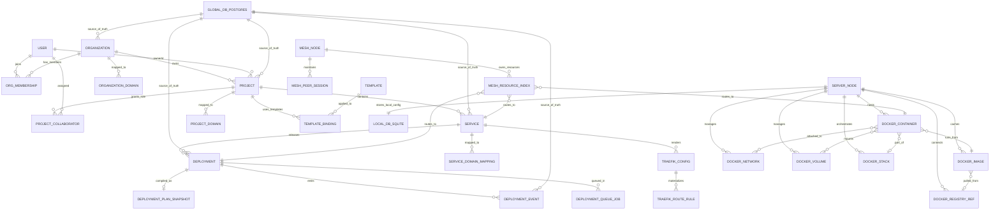

### How to read hierarchy from links

- `||--o{` means **one-to-many ownership** from left to right (parent owns many children).
- `}o--||` means **many-to-one dependency** from left to right (many children point to one parent).
- `||--||` means **one-to-one binding** (e.g., one server node → one local SQLite config DB).
- Relationship labels (`owns`, `contains`, `releases`, `runs_from`, `mapped_to`, etc.) express the hierarchy intent.

### Role hierarchy reference attached to this model

- Platform roles: `superAdmin` > `admin` > `operator` > `viewer`
- Organization roles: `owner` > `admin` > `member`
- Project roles: `owner` > `maintainer` > `deployer` > `viewer`

These role ladders govern access over the linked entities above (organization, project, service, deployment, domain, and operations).
