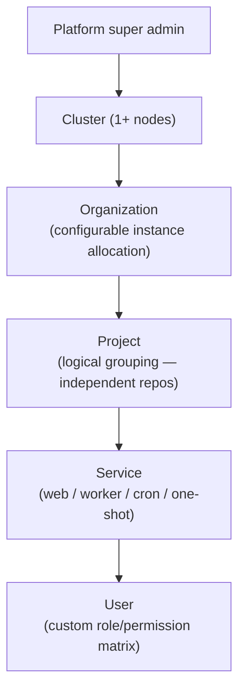

## Identity

**Deployer** is an open-core, self-hosted VPS deployment platform — think Vercel / Render / Railway on your own servers. Target: 1 to 20+ nodes. Open source core + commercial enterprise tier + optional SaaS mode.

## Access hierarchy



- **Roles**: predefined set (Owner / Admin / Developer / Viewer) + custom roles via a permission matrix
- **Scope**: permissions are granular down to the service level
- **Org isolation**: logical, scoped by **project** (not individual service) — each project gets its own Docker network

## Service workload types

| Type | Description | Gets a domain? |
|------|-------------|----------------|
| **Web service** | HTTP-based, routed via Traefik | Yes |
| **Worker** | Long-running background process | No |
| **Cron job** | Scheduled on a cron expression | No |
| **One-shot task** | Run once to completion (e.g. migrations) | No |

## Deployment pipeline

Every phase is configurable per service:

```
Build → Test → Release (push to registry) → Deploy → Smoke test → [Manual approval gate]
```

### Build strategies

- **Nixpacks** (auto-detect)
- **Dockerfile** (custom path, build args/secrets, pre/post hooks)
- **Pre-built Docker image** (pull from registry)

### Deploy strategies (zero-downtime)

- **Rolling update** — new container starts, old stops after health check passes
- **Blue-green** — run both versions, swap Traefik route atomically
- **Canary** — send configurable % of traffic to new version, promote if healthy

### Health checks

Sensible defaults + full per-service override:

- HTTP endpoint check
- TCP port check
- Custom command check
- Auto-restart with exponential backoff
- Alert on repeated failure

## Deployment sources

### v3 launch

- **GitHub** (webhook + CI/CD, monorepo path filters, PR status updates, preview triggers)
- **Zip upload** (manual)
- **Pre-built Docker image** (push to built-in or external registry)

### Post-launch

- GitLab
- Direct Git URL

## Multi-service cascade deploys

**Default: auto-cascade ON.** When service B redeploys and A depends on B, A auto-redeploys.
Configurable per dependency edge — users can turn off cascade for specific dependencies.
Platform manages start order and waits for health check gates between dependent services.

## Environment variables & secrets

### Scopes (higher scope overridable at lower scope)

| Scope | Visibility |
|-------|-----------|
| **Per-org** | All projects in the org |
| **Per-project** | All services in the project |
| **Per-service** | Only this service |

### Behavior

- **Per-variable mode**: each var is tagged as `live` (hot-reload) OR `requires rebuild`
- **Visual badge** in dashboard showing mode per variable
- **Env-only rollback** with cause explanation — separate from code rollback
- **Encryption**: env vars encrypted at rest in DB; enterprise tier supports Vault/Infisical

## Environment tiers & branch mapping

- Tiers are fully configurable (not a fixed prod/staging/preview set)
- **Convention defaults** with full customization per project:
  - Branch name patterns (regex): `main` → prod, `develop` → staging, `PR/*` → preview
  - Docker image tags
  - PR labels / Git tags

## Preview environments

- Auto-created on PR open (GitHub webhook)
- Deterministic subdomain: `<service>-<branch>.<base-domain>`
- Per-preview env var overrides
- **Cleanup**: PR close + configurable TTL inactivity timeout
- **Max open PRs cap** with LRU eviction
- **Scale-to-zero**: default for previews (inactivity-based timing, wake-on-first-request with loading screen)
- **Wake-on-access**: loading screen while container spins up

## Networking

| Scope | Mechanism |
|-------|-----------|
| Intra-project (same node) | Private Docker network (call by container name) |
| Intra-org (cross-node) | Mesh service URL |
| Cross-node service discovery | Internal DNS (CoreDNS) |
| Per-service | Configurable firewall rules |
| Reverse proxy | Traefik: platform baseline labels + user override snippets |
| Custom domains | Multiple aliases per service, platform-managed wildcard DNS |

## SSL / TLS

- **Auto Let's Encrypt** as default (Traefik ACME)
- **Custom certificate upload** per domain/service

## DNS

- Multi-provider support (Cloudflare first)
- Platform manages wildcard DNS, preview subdomains, SSL
- Both manual mode and platform-managed mode

## Mesh architecture

- **Transport**: ORPC EventIterator over HTTP/SSE between nodes
- **Topology**: Gossip ring — K neighbors, transitive propagation
- **Scope**: ALL internal platform events distributed through mesh
- Enables multi-DB sync, cross-node event delivery, and distributed coordination

## Swarm orchestration baseline

- **Runtime model**: Docker Swarm manager/worker cluster
- **Manager nodes**: orchestration state, scheduling, service updates
- **Worker nodes**: execution capacity for service replicas
- **Control-plane management**: all stack/service changes are initiated via manager nodes

## Ingress and traffic management

- **Canonical ingress**: Traefik (Swarm provider) + service labels
- **Default balancing**: Swarm service replicas + Traefik routing (no custom redirect app required for standard HTTP/S)
- **Replica policy target**: when at least two schedulable nodes exist, critical user-facing services should run with at least two replicas spread across nodes
- **No standalone load balancer**: Traefik is the sole reverse proxy for platform and deployment traffic; a direct-proxy supervisor provides temporary failover while Traefik recovers.

## Storage

- **Named volumes** (per-service, default)
- **NFS / S3-backed** shared storage
- **Platform-managed databases**: PostgreSQL, Redis, S3-compatible — all available for user services

## Build cache

Shared across nodes: registry-based layer caching or NFS-mounted cache directory.

## Container resource limits

- **Org-level quota budgets** (hard cap with soft warnings)
- **Dynamic per-service** with configurable maximum
- **Defaults by app type** (web service gets different defaults than worker)

## Registry

- **Built-in private registry** (per-cluster)
- **External registry support**: GHCR, Docker Hub, custom registries

## Image retention

Configurable: retain by count OR by time, whichever retains more.

## Monorepo support

Three methods for path-to-service mapping:
1. Dashboard UI (manual path filter per service)
2. Auto-detected from Dockerfile path / package.json location
3. Defined in `deployer.yaml`

## Config-as-code: `deployer.yaml`

- Everything representable in the UI is representable in the file
- **Bidirectional sync**: platform opens a PR with config diffs for user to merge
- Covers: services, env vars, build config, deploy strategy, health checks, scaling, domains, dependencies

## Deployment approval gate

Configurable per tier. Example: `prod` requires role-based approval, `staging` auto-deploys.

## Rate limiting

Both layers:
- **Platform baseline** via Traefik middleware
- **Service-level overrides** (user adds custom Traefik middleware)

## Database migrations for user services

Platform runs a user-configured migration command as a **one-shot task** before deploy. User specifies the command (e.g. `npx prisma migrate deploy`); platform runs it in a one-shot container from the new image, waits for success, then proceeds.

## Observability

- **Metrics**: Local PostgreSQL dashboard + optional export to Prometheus / Grafana / Datadog
- **Logs**: Build / test / deploy / runtime phases — searchable, downloadable, SSE streaming
- **Log storage**: Hot queryable store + cold S3 archive with configurable TTL tiering
- **Real-time**: ORPC EventIterator over SSE for all streaming (logs, events, deploys)

## Deploy concurrency

Parallel deploys with dynamic limits, then queued. Prevents node resource exhaustion while maximizing throughput.

## Scale-to-zero

Heavily configurable:
- Preview environments: ON by default with inactivity-based timing
- Production: opt-in
- Wake-on-first-request with loading screen
- Configurable inactivity threshold

## Cluster operations

### Node join flow

- **Path A**: Join existing cluster — connect via path + super admin login + one-time token + Swarm join workflow
- **Path B**: Fresh setup — provide DB connection → create first super admin

### Node removal

- **Graceful** (default): checks if remaining capacity can absorb workloads
- **Force**: available with risk warning

### Migration

Automatic with manual override — Swarm service updates and placement policies handle rebalancing.

### Platform self-update

Both manual and auto. Updates are **cluster-wide** — all nodes update together to prevent version mismatches.

### Backup / DR

Full cluster backup to S3-compatible storage including config, volumes, secrets.

## Multi-region

Multiple clusters in different regions. Org traffic routed to nearest cluster. Shared PostgreSQL (single primary + read replicas). Mesh events sync data between DB instances.

## UX surfaces

### Web dashboard

- **Dual view**: Org dashboard (for users) + Platform admin view (for super admins), toggle in header
- **Fully responsive** (PWA deferred post-launch)
- **xterm.js** in-browser container exec terminal
- **Deployment timeline**: build / test / deploy / runtime log phases
- **White-label**: orgs can have branded portal

### CLI

- `deploy` / `redeploy`
- `tail logs`
- `exec` into containers
- Manage env vars
- Bootstrap VPS into cluster

### Notifications

- In-app
- Email
- Web push
- GitHub / GitLab commit status
- Custom webhooks with data transformation

### Audit log

All actions logged (actor, action, resource, IP, user-agent). Configurable retention. Exportable CSV/JSON.

## Integrations

| Category | Details |
|----------|---------|
| **Source control** | GitHub (launch), GitLab (soon) |
| **DNS** | Cloudflare (first), extensible multi-provider |
| **Registries** | Built-in + GHCR + Docker Hub + custom |
| **Storage** | S3-compatible providers |
| **Secrets** | DB-encrypted (core), Vault/Infisical (enterprise) |

## Plugin system

- Third-party deployment providers, notification channels, DNS providers, storage backends
- **Marketplace model** with review/approval before use
- Self-hosted instances: admin can override and allow unreviewed plugins

## Public API

Same ORPC contracts exposed externally with **API key authentication** — usable by CI/CD scripts, Terraform, custom dashboards.

## Business model

- **Self-hosted first** (open source core)
- **Commercial enterprise tier** for advanced features
- **Optional managed servers** with tier-based billing
- **Full white-label** support per org

## Related docs

- [Architecture Overview](/docs/architecture/architecture)
- [Tech Stack](/docs/architecture/tech-stack)
- [Platform Feature Target](/docs/deployment/platform-feature-target)
- [Instance Ports](/docs/deployment/instance-ports) — port conventions and Traefik routing
- [Multi-server Operations](/docs/deployment/multi-server-multi-org-operations)
- [Event System & Streams](/docs/dev/event-system-streams)
