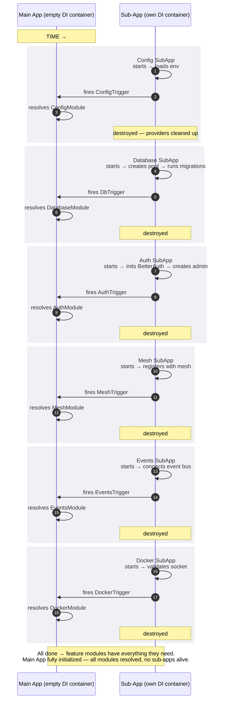
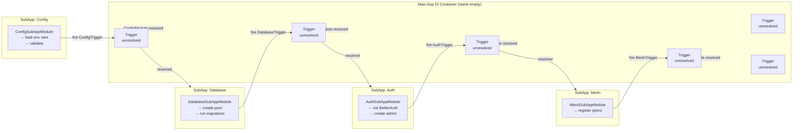
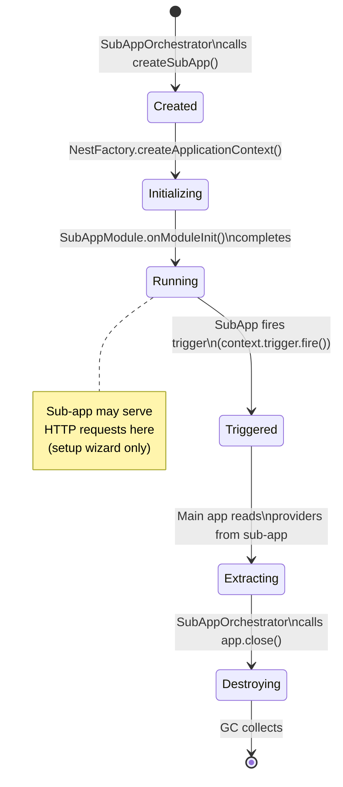
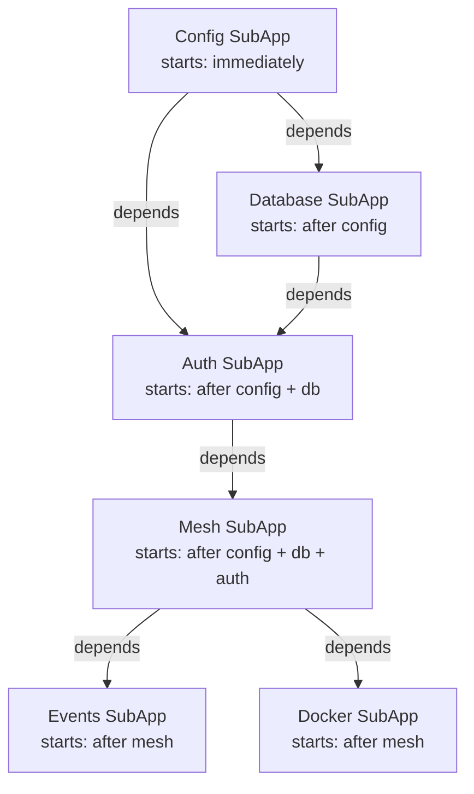
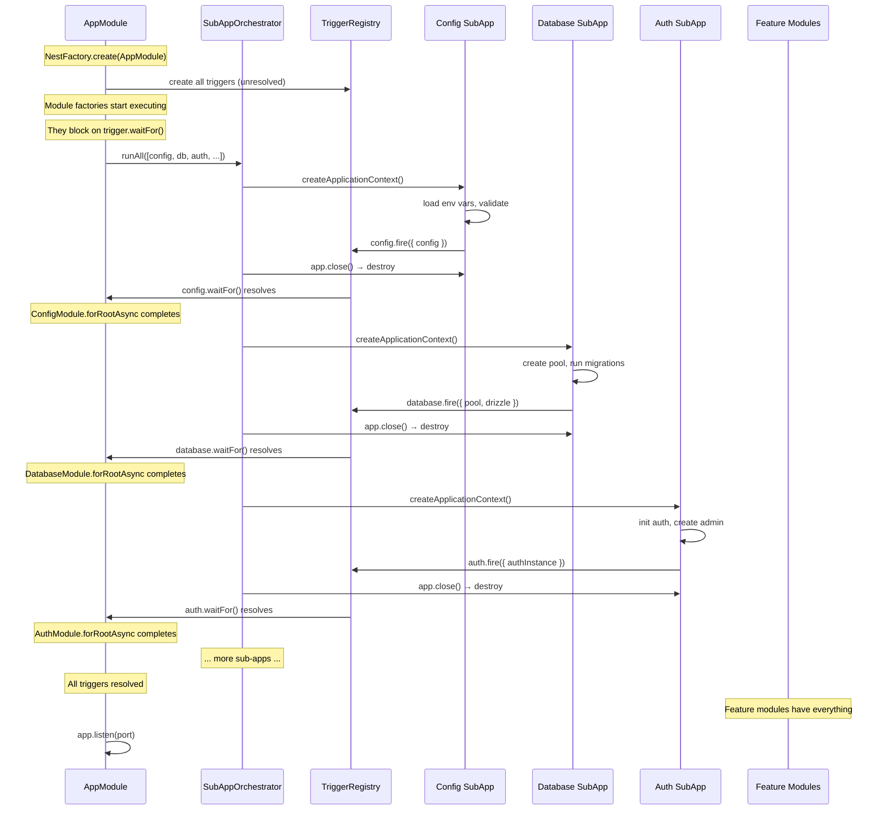
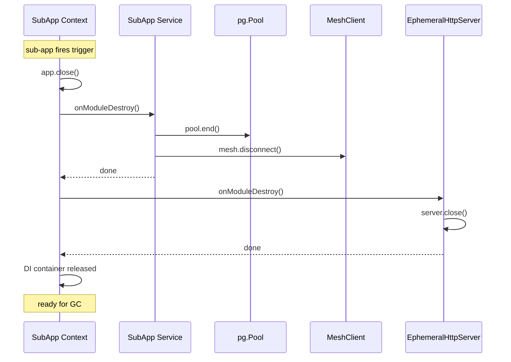
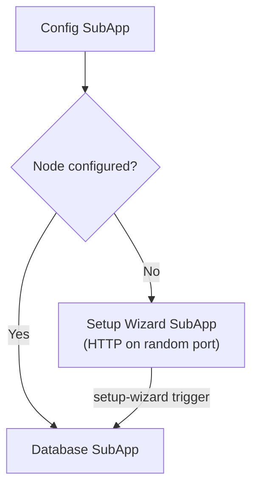

<DocMeta source="docs/architecture/startup-architecture-v2.mdx" scope="canonical" />

# Startup Architecture v2 — Sub-App Trigger Chain

> **This is a from-scratch redesign.** It breaks existing code deliberately. Nothing here is backward-compatible with v1. The v1 `StartupOrchestratorService`, `CoreStartupService` interface, and all per-module `*StartupService` implementations are superseded.

---

## Table of Contents

1. [Why a Redesign?](#why-a-redesign)
2. [Core Concept: Sub-App Trigger Chain](#core-concept-sub-app-trigger-chain)
3. [The Trigger System](#the-trigger-system)
4. [Sub-App Lifecycle](#sub-app-lifecycle)
5. [Sub-App Orchestrator](#sub-app-orchestrator)
6. [Sub-App Definitions](#sub-app-definitions)
7. [Module Resolution in the Main App](#module-resolution-in-the-main-app)
8. [Clean Teardown Protocol](#clean-teardown-protocol)
9. [Error Handling & Recovery](#error-handling--recovery)
10. [Setup Wizard as a Sub-App](#setup-wizard-as-a-sub-app)
11. [Architecture Diagrams](#architecture-diagrams)
12. [Appendix: Interfaces, Tokens, Module Signatures](#appendix-interfaces-tokens-module-signatures)

---

## Why a Redesign?

### Problems with v1 (Current)

| Problem | Symptom | Root Cause |
|---------|---------|------------|
| **Linear startup order** | Adding a new startup service means editing the orchestrator's constructor array | `StartupOrchestratorService` hard-codes an ordered array of `CoreStartupService` implementations |
| **Startup providers pollute DI** | `DatabaseStartupService`, `SetupStartupService`, etc. remain in the container forever | They're registered in the same `StartupModule` that lives in the main app |
| **Setup wizard lives in main app** | Setup endpoints run in the same Express instance as production endpoints | `SetupModule` is imported directly in `AppModule` |
| **No clean teardown** | Setup-related services, subjects, subscriptions persist in memory | No mechanism to destroy the startup context |
| **Eager deadlock-breaking code** | `checkConfigAndEmit()` is called from two places to avoid a deadlock | Pool factory and orchestrator are in the same DI container, racing each other |
| **Monolithic orchestration** | All startup logic is in one `StartupModule` that imports everything | No separation of concerns per startup phase |

### Design Goals for v2

1. **Each startup phase is its own sub-app** — complete isolation, separate DI container, separate lifecycle
2. **Triggers, not bridges** — each sub-app fires a typed signal in the main app that resolves exactly one module
3. **Sequential resolution** — modules are resolved one-by-one as their sub-app completes
4. **Zero leftovers** — sub-app is destroyed after it fires its trigger
5. **Setup wizard as a sub-app** — its HTTP server lives in its own Express instance, proxied by the main app
6. **Clean, typed contract** — `Trigger<T>` interface, `SubApp` interface, everything TypeScript-safe

---

## Core Concept: Sub-App Trigger Chain

### The Pattern

Instead of one monolithic startup app, each core concern is a **self-contained NestJS sub-app**. Each sub-app:

1. Is created as a standalone `INestApplicationContext` by the main app's orchestrator
2. Has its **own DI container**, its **own providers**, its **own lifecycle**
3. Starts at the right time (when its trigger condition is met)
4. Does its work (initialize pool, run migrations, connect to mesh, etc.)
5. Fires a **trigger** in the main app
6. The trigger **resolves exactly one module** in the main app's DI container
7. The sub-app is **destroyed** — every provider cleaned up



### The Chain

Sub-apps do **not** start all at once. They start in sequence because:

1. The main app's `SubAppOrchestrator` knows the order
2. Each sub-app's trigger must resolve before the next sub-app starts
3. The module resolution in the main app makes the provider available for the next sub-app



---

## The Trigger System

### Trigger&lt;T&gt; Interface

The foundation of the architecture is the **trigger** — a typed signal that transitions from "unresolved" to "resolved" exactly once, carrying a typed payload.

```typescript
// core/modules/triggers/trigger.ts
import { Subject, firstValueFrom, type Observable } from 'rxjs';

export class Trigger<T extends object = object> {
  private readonly subject = new Subject<T>();
  private _resolved = false;
  private _value: T | null = null;

  /** Whether this trigger has been fired */
  get resolved(): boolean {
    return this._resolved;
  }

  /** The value that was passed when fired. Throws if not yet resolved. */
  get value(): T {
    if (!this._resolved || !this._value) {
      throw new Error('Trigger not yet resolved');
    }
    return this._value;
  }

  /** Observable that emits once when the trigger fires. */
  get asObservable(): Observable<T> {
    return this.subject.asObservable();
  }

  /**
   * Returns a Promise that resolves when the trigger fires.
   * If already resolved, returns immediately with the value.
   * This is the primary API for `forRootAsync` factories.
   */
  async waitFor(): Promise<T> {
    if (this._resolved && this._value) return this._value;
    return firstValueFrom(this.subject);
  }

  /**
   * Fire the trigger with a value.
   * Can only be called once — subsequent calls are no-ops.
   */
  fire(value: T): void {
    if (this._resolved) return;
    this._value = value;
    this._resolved = true;
    this.subject.next(value);
    this.subject.complete();
  }
}
```

### Trigger Registry

All triggers are registered in a single place and accessible via dependency injection:

```typescript
// core/modules/triggers/trigger-registry.ts
import { Injectable } from '@nestjs/common';
import { Trigger } from './trigger';
import type { ConfigService } from '@/config/env/config.service';
import type { Pool } from 'pg';
import type { NodePgDatabase } from 'drizzle-orm/node-postgres';
import type * as globalSchema from '@/config/drizzle/global/schema';

/** Payload types for each trigger */
export interface ConfigTriggerPayload {
  config: ConfigService;
}

export interface DatabaseTriggerPayload {
  pool: Pool;
  drizzle: NodePgDatabase<typeof globalSchema>;
  isMigrated: boolean;
}

export interface AuthTriggerPayload {
  authInstance: any;
  authCoreService: any;
  adminCreated: boolean;
}

export interface MeshTriggerPayload {
  meshClient: any;
  nodeId: string;
}

export interface EventsTriggerPayload {
  eventBus: any;
}

export interface DockerTriggerPayload {
  dockerode: any;
  socketAvailable: boolean;
}

/**
 * Registry of all triggers.
 * Injected as a single provider so sub-apps can access the triggers
 * they need to fire, and modules can await the triggers they need.
 */
@Injectable()
export class TriggerRegistry {
  readonly config = new Trigger<ConfigTriggerPayload>();
  readonly database = new Trigger<DatabaseTriggerPayload>();
  readonly auth = new Trigger<AuthTriggerPayload>();
  readonly mesh = new Trigger<MeshTriggerPayload>();
  readonly events = new Trigger<EventsTriggerPayload>();
  readonly docker = new Trigger<DockerTriggerPayload>();
}
```

### How a Sub-App Fires a Trigger

The `SubAppRunner` gives the sub-app access to the trigger it needs to fire:

```typescript
// core/modules/sub-app-runner/sub-app-runner.ts
export interface SubAppContext<TTriggerPayload extends object> {
  /** The trigger this sub-app must fire when its work is done */
  trigger: Trigger<TTriggerPayload>;
}
```

The sub-app's root service calls `context.trigger.fire(payload)` when initialization completes.

---

## Sub-App Lifecycle

### Lifecycle Diagram



### States

| State | What Happens |
|-------|-------------|
| **Created** | `SubAppOrchestrator` instantiates the sub-app module class |
| **Initializing** | `NestFactory.createApplicationContext(SubAppModule)` — NestJS creates the DI container, resolves providers, runs `OnModuleInit` |
| **Running** | Sub-app's main service is executing. It can serve HTTP (setup wizard), connect to databases, validate connections, etc. |
| **Triggered** | Sub-app calls `context.trigger.fire(payload)`. The main app's `forRootAsync` factory receives the payload and resolves the module |
| **Extracting** | Main app reads providers from the sub-app's DI container (the pool, drizzle instance, etc.) |
| **Destroying** | `app.close()` — all providers run `OnModuleDestroy`, DI container is released |
| **Collected** | All references are nulled out, GC reclaims memory |

### The SubApp Interface

```typescript
// core/modules/sub-app-runner/sub-app.interface.ts
import type { Type } from '@nestjs/common';
import type { Trigger } from '@/core/modules/triggers/trigger';

export interface SubApp<TTriggerPayload extends object = object> {
  /** Unique name for this sub-app (used in logs and error messages) */
  readonly name: string;

  /**
   * The NestJS module class to load as the sub-app root.
   * This module will be passed to NestFactory.createApplicationContext().
   */
  readonly module: Type<any>;

  /**
   * Optional: names of triggers that must resolve before this sub-app starts.
   * If empty, the sub-app starts immediately.
   */
  readonly dependsOn?: string[];

  /**
   * The trigger this sub-app must fire when initialization completes.
   * The sub-app accesses this trigger via its own DI container.
   */
  readonly trigger: Trigger<TTriggerPayload>;

  /**
   * Optional timeout in milliseconds.
   * If the sub-app doesn't fire its trigger within this time, it's
   * considered failed and the orchestrator handles the error.
   */
  readonly timeoutMs?: number;
}
```

---

## Sub-App Orchestrator

### Role

The `SubAppOrchestrator` lives in the **main app**. It:

1. Holds the list of all sub-app definitions (ordered by dependency)
2. Creates each sub-app at the right time
3. Passes the trigger to the sub-app
4. Waits for the trigger to fire
5. Extracts providers from the sub-app
6. Destroys the sub-app
7. Moves to the next sub-app

### Implementation

```typescript
// core/modules/sub-app-orchestrator/sub-app-orchestrator.service.ts
import { Injectable, Logger } from '@nestjs/common';
import { NestFactory } from '@nestjs/core';
import type { INestApplicationContext } from '@nestjs/common';
import { TriggerRegistry } from '@/core/modules/triggers/trigger-registry';
import type { SubApp } from '@/core/modules/sub-app-runner/sub-app.interface';

@Injectable()
export class SubAppOrchestrator {
  private readonly logger = new Logger(SubAppOrchestrator.name);
  private readonly activeSubApps = new Map<string, INestApplicationContext>();

  constructor(private readonly triggers: TriggerRegistry) {}

  /**
   * Run all registered sub-apps in dependency order.
   * Each sub-app is created, runs, fires its trigger, and is destroyed
   * before the next one starts.
   */
  async runAll(subApps: SubApp[]): Promise<void> {
    const ordered = this.topologicalSort(subApps);

    for (const subApp of ordered) {
      await this.runOne(subApp);
    }

    this.logger.log('✅ All sub-apps completed');
  }

  /**
   * Run a single sub-app: create, initialize, wait for trigger, destroy.
   */
  async runOne(subApp: SubApp): Promise<void> {
    this.logger.log(`▶ Starting sub-app: ${subApp.name}`);

    // 1. Create the sub-app as a standalone NestJS context
    const app = await NestFactory.createApplicationContext(subApp.module, {
      abortOnError: false,
      snapshot: process.env.NODE_ENV !== 'production',
    });

    // Store reference for potential cleanup
    this.activeSubApps.set(subApp.name, app);

    // 2. The sub-app module imports SubAppContextModule.forRoot()
    //    which provides SUB_APP_CONTEXT with the trigger.
    //    The sub-app's services inject SUB_APP_CONTEXT and call
    //    context.trigger.fire(payload) when ready.

    // 3. Wait for the trigger to fire (with optional timeout)
    this.logger.log(`⏳ Waiting for ${subApp.name} trigger...`);

    const timeout = subApp.timeoutMs ?? 30_000;
    const payload = await this.waitForTrigger(subApp.trigger, timeout);

    this.logger.log(`✅ ${subApp.name} trigger fired`);

    // 4. Sub-app has fired its trigger — destroy it
    await app.close();
    this.activeSubApps.delete(subApp.name);

    this.logger.log(`🧹 ${subApp.name} destroyed`);
  }

  private async waitForTrigger<T extends object>(
    trigger: Trigger<T>,
    timeoutMs: number,
  ): Promise<T> {
    return Promise.race([
      trigger.waitFor(),
      new Promise<never>((_, reject) =>
        setTimeout(
          () => reject(new Error(`Trigger timed out after ${timeoutMs}ms`)),
          timeoutMs,
        ),
      ),
    ]);
  }

  private topologicalSort(subApps: SubApp[]): SubApp[] {
    // Build dependency graph and sort using Kahn's algorithm
    const nameMap = new Map(subApps.map((s) => [s.name, s]));
    const inDegree = new Map<string, number>();
    const adjacency = new Map<string, string[]>();

    for (const app of subApps) {
      inDegree.set(app.name, 0);
      adjacency.set(app.name, []);
    }

    for (const app of subApps) {
      for (const dep of app.dependsOn ?? []) {
        adjacency.get(dep)?.push(app.name);
        inDegree.set(app.name, (inDegree.get(app.name) ?? 0) + 1);
      }
    }

    const queue: string[] = [];
    for (const [name, degree] of inDegree) {
      if (degree === 0) queue.push(name);
    }

    const sorted: SubApp[] = [];
    while (queue.length > 0) {
      const name = queue.shift()!;
      const app = nameMap.get(name);
      if (app) sorted.push(app);

      for (const neighbor of adjacency.get(name) ?? []) {
        const newDegree = (inDegree.get(neighbor) ?? 1) - 1;
        inDegree.set(neighbor, newDegree);
        if (newDegree === 0) queue.push(neighbor);
      }
    }

    return sorted;
  }
}
```

### SubAppContextModule

Each sub-app imports a `SubAppContextModule` that provides its trigger:

```typescript
// core/modules/sub-app-runner/sub-app-context.module.ts
import { DynamicModule, Module } from '@nestjs/common';
import { SUB_APP_CONTEXT } from './tokens';

@Module({})
export class SubAppContextModule {
  static forRoot<T extends object>(context: { trigger: Trigger<T> }): DynamicModule {
    return {
      module: SubAppContextModule,
      providers: [
        {
          provide: SUB_APP_CONTEXT,
          useValue: context,
        },
      ],
      exports: [SUB_APP_CONTEXT],
      global: true,
    };
  }
}
```

**Token**:

```typescript
// core/modules/sub-app-runner/tokens.ts
export const SUB_APP_CONTEXT = Symbol('SUB_APP_CONTEXT');
```

---

## Sub-App Definitions

Each sub-app is:
1. A NestJS module (e.g., `DatabaseSubAppModule`)
2. A root service that injects `SUB_APP_CONTEXT` and fires the trigger when ready
3. All providers needed for initialization
4. `OnModuleDestroy` on every provider for clean teardown

### Sub-App 1: Config SubApp

```typescript
// sub-apps/config/config.sub-app.ts
export const configSubApp: SubApp<ConfigTriggerPayload> = {
  name: 'config',
  module: ConfigSubAppModule,
  dependsOn: [],           // starts immediately
  trigger: triggers.config,
  timeoutMs: 5_000,
};
```

```typescript
// sub-apps/config/config.sub-app.module.ts
@Module({
  imports: [SubAppContextModule.forRoot(configSubAppContext)],
  providers: [ConfigSubAppService, EnvService],
})
export class ConfigSubAppModule {}
```

```typescript
// sub-apps/config/config.sub-app.service.ts
@Injectable()
export class ConfigSubAppService implements OnModuleInit {
  constructor(
    @Inject(SUB_APP_CONTEXT)
    private readonly ctx: SubAppContext<ConfigTriggerPayload>,
    private readonly envService: EnvService,
  ) {}

  async onModuleInit(): Promise<void> {
    // Validate all required env vars
    const required = ['NODE_ENV', 'API_PORT', 'DATABASE_URL'] as const;
    for (const key of required) {
      if (!this.envService.get(key)) {
        throw new Error(`Required env var '${key}' is not set`);
      }
    }

    // Fire the trigger — this resolves ConfigModule in the main app
    this.ctx.trigger.fire({ config: this.envService });
  }
}
```

### Sub-App 2: Database SubApp

```typescript
// sub-apps/database/database.sub-app.ts
export const databaseSubApp: SubApp<DatabaseTriggerPayload> = {
  name: 'database',
  module: DatabaseSubAppModule,
  dependsOn: ['config'],
  trigger: triggers.database,
  timeoutMs: 60_000,
};
```

```typescript
// sub-apps/database/database.sub-app.module.ts
@Module({
  imports: [
    SubAppContextModule.forRoot(databaseSubAppContext),
    CoreInitializationModule,
  ],
  providers: [
    DatabaseSubAppService,
    {
      provide: GLOBAL_DATABASE_POOL,
      useFactory: (svc: DatabaseSubAppService) => svc.pool,
      inject: [DatabaseSubAppService],
    },
    {
      provide: GLOBAL_DATABASE_CONNECTION,
      useFactory: (svc: DatabaseSubAppService) => svc.drizzle,
      inject: [DatabaseSubAppService],
    },
  ],
  exports: [GLOBAL_DATABASE_POOL, GLOBAL_DATABASE_CONNECTION],
})
export class DatabaseSubAppModule {}
```

```typescript
// sub-apps/database/database.sub-app.service.ts
@Injectable()
export class DatabaseSubAppService implements OnModuleDestroy {
  private _pool: Pool | null = null;
  private _drizzle: DrizzleClient | null = null;

  constructor(
    @Inject(SUB_APP_CONTEXT)
    private readonly ctx: SubAppContext<DatabaseTriggerPayload>,
    private readonly initializationService: InitializationService,
  ) {}

  async onModuleInit(): Promise<void> {
    this.initializationService.checkConfigAndEmit();
    const { databaseUrl, strategy } =
      await this.initializationService.waitForSetup();

    if (!databaseUrl) {
      throw new Error('Database URL could not be resolved');
    }

    this._pool = new Pool({ connectionString: databaseUrl });
    this._drizzle = drizzle(this._pool, { schema: globalSchema });

    // Fire trigger — resolves DatabaseModule in the main app
    this.ctx.trigger.fire({
      pool: this._pool,
      drizzle: this._drizzle,
      isMigrated: false,
    });
  }

  async onModuleDestroy(): Promise<void> {
    await this._pool?.end();
    this._pool = null;
    this._drizzle = null;
  }
}
```

### Sub-App 3: Auth SubApp

```typescript
// sub-apps/auth/auth.sub-app.ts
export const authSubApp: SubApp<AuthTriggerPayload> = {
  name: 'auth',
  module: AuthSubAppModule,
  dependsOn: ['config', 'database'],
  trigger: triggers.auth,
  timeoutMs: 30_000,
};
```

```typescript
// sub-apps/auth/auth.sub-app.service.ts
@Injectable()
export class AuthSubAppService implements OnModuleInit {
  constructor(
    @Inject(SUB_APP_CONTEXT)
    private readonly ctx: SubAppContext<AuthTriggerPayload>,
    private readonly authCoreService: AuthCoreService,
  ) {}

  async onModuleInit(): Promise<void> {
    if (!this.authCoreService.instance) {
      throw new Error('Auth instance not initialized');
    }

    this.ctx.trigger.fire({
      authInstance: this.authCoreService.instance,
      authCoreService: this.authCoreService,
      adminCreated: true,
    });
  }
}
```

### Sub-App 4: Mesh SubApp

```typescript
// sub-apps/mesh/mesh.sub-app.ts
export const meshSubApp: SubApp<MeshTriggerPayload> = {
  name: 'mesh',
  module: MeshSubAppModule,
  dependsOn: ['config', 'database', 'auth'],
  trigger: triggers.mesh,
  timeoutMs: 30_000,
};
```

### Sub-App 5: Events SubApp

```typescript
// sub-apps/events/events.sub-app.ts
export const eventsSubApp: SubApp<EventsTriggerPayload> = {
  name: 'events',
  module: EventsSubAppModule,
  dependsOn: ['config', 'database', 'auth', 'mesh'],
  trigger: triggers.events,
  timeoutMs: 10_000,
};
```

### Sub-App 6: Docker SubApp

```typescript
// sub-apps/docker/docker.sub-app.ts
export const dockerSubApp: SubApp<DockerTriggerPayload> = {
  name: 'docker',
  module: DockerSubAppModule,
  dependsOn: ['config', 'database', 'auth', 'mesh'],
  trigger: triggers.docker,
  timeoutMs: 10_000,
};
```

### The Full Sub-App List

```typescript
// sub-apps/registry.ts
export const ALL_SUB_APPS = [
  configSubApp,
  databaseSubApp,
  authSubApp,
  meshSubApp,
  eventsSubApp,
  dockerSubApp,
];
```

### Dependency Graph



---

## Module Resolution in the Main App

### The Pattern

Each module in the main app uses `forRootAsync` with a factory that **awaits a trigger**:

```typescript
@Module({
  imports: [
    // Config module waits for the config trigger
    ConfigModule.forRootAsync({
      inject: [TriggerRegistry],
      useFactory: async (triggers: TriggerRegistry) => {
        const payload = await triggers.config.waitFor();
        return { config: payload.config };
      },
    }),

    // Database module waits for the database trigger
    DatabaseModule.forRootAsync({
      inject: [TriggerRegistry],
      useFactory: async (triggers: TriggerRegistry) => {
        const payload = await triggers.database.waitFor();
        return { pool: payload.pool, drizzle: payload.drizzle };
      },
    }),

    // Auth module waits for the auth trigger
    AuthModule.forRootAsync({
      inject: [TriggerRegistry],
      useFactory: async (triggers: TriggerRegistry) => {
        const payload = await triggers.auth.waitFor();
        return { instance: payload.authInstance, coreService: payload.authCoreService };
      },
    }),

    // Feature modules await multiple triggers
    DockerModule.forRootAsync({
      inject: [TriggerRegistry],
      useFactory: async (triggers: TriggerRegistry) => {
        const [db, docker] = await Promise.all([
          triggers.database.waitFor(),
          triggers.docker.waitFor(),
        ]);
        return { pool: db.pool, drizzle: db.drizzle, dockerode: docker.dockerode };
      },
    }),

    // ORPC
    ORPCModule.forRootAsync({
      inject: [TriggerRegistry],
      useFactory: async (triggers: TriggerRegistry) => {
        const [db, auth] = await Promise.all([
          triggers.database.waitFor(),
          triggers.auth.waitFor(),
        ]);
        return {
          context: { auth: auth.coreService.createEmptyAuthUtils() },
        };
      },
    }),
  ],
  providers: [
    SubAppOrchestrator,
    TriggerRegistry,
    {
      provide: APP_BOOTSTRAP,
      useFactory: async (orchestrator: SubAppOrchestrator) => {
        await orchestrator.runAll(ALL_SUB_APPS);
        return true;
      },
      inject: [SubAppOrchestrator],
    },
  ],
})
export class AppModule {}
```

### Resolution Timeline



---

## Clean Teardown Protocol

### Per-Sub-App Teardown

When a sub-app fires its trigger, the orchestrator immediately:

1. Calls `app.close()` on the sub-app
2. Triggers `OnModuleDestroy` on every provider
3. DI container is released
4. All references nulled out



### What Gets Destroyed Per Sub-App

| Sub-App | Providers Destroyed | Connections Closed |
|---------|-------------------|-------------------|
| Config | `ConfigSubAppService`, `EnvService` | None |
| Database | `DatabaseSubAppService`, pool factory | Postgres pool connections |
| Auth | `AuthSubAppService`, `AuthCoreService` | Auth instance |
| Mesh | `MeshSubAppService`, `MeshClient` | Mesh socket/disconnect |
| Events | `EventsSubAppService`, `EventBus` | Event bus connection |
| Docker | `DockerSubAppService`, `DockerClientFactory` | Docker socket (if any) |

### What Survives (Extracted by Triggers)

| Object | Created By | Extracted Via | Lives In |
|--------|-----------|---------------|----------|
| `Pool` (pg) | DatabaseSubAppService | `database` trigger payload | Main app DI |
| `DrizzleClient` | DatabaseSubAppService | `database` trigger payload | Main app DI |
| `BetterAuthInstance` | AuthSubAppService | `auth` trigger payload | Main app DI |
| `AuthCoreService` | AuthSubAppService | `auth` trigger payload | Main app DI |
| `MeshClient` | MeshSubAppService | `mesh` trigger payload | Main app DI |
| `EventBus` | EventsSubAppService | `events` trigger payload | Main app DI |
| `DockerodeInstance` | DockerSubAppService | `docker` trigger payload | Main app DI |

These survive because they are **standalone runtime objects** — they don't depend on the sub-app's DI container.

---

## Error Handling & Recovery

### Per-Sub-App Error Handling

| Scenario | Behavior |
|----------|----------|
| **Sub-app fails to create** | Orchestrator throws `FatalStartupError` |
| **Sub-app service throws** on `onModuleInit` | NestJS `abortOnError: false` catches it. Orchestrator sees trigger never fired |
| **Trigger times out** | Orchestrator throws `SubAppTimeoutError`, then force-destroys the sub-app |
| **Non-critical sub-app fails** | Orchestrator can skip and continue (degraded mode) |

### Degraded Mode

```typescript
export interface SubAppFailurePolicy {
  [subAppName: string]: 'fatal' | 'skip';
}

export const DEFAULT_FAILURE_POLICY: SubAppFailurePolicy = {
  config: 'fatal',
  database: 'fatal',
  auth: 'fatal',
  mesh: 'skip',
  events: 'skip',
  docker: 'skip',
};
```

---

## Setup Wizard as a Sub-App

### Concept

The setup wizard is itself a **sub-app** that runs an internal Express server. It starts when configuration is done but the database isn't yet set up.

```typescript
export const setupWizardSubApp: SubApp<SetupWizardTriggerPayload> = {
  name: 'setup-wizard',
  module: SetupWizardSubAppModule,
  dependsOn: ['config'],
  trigger: triggers.setupWizard,
  timeoutMs: 300_000, // 5 min — user interaction
};
```

```typescript
@Injectable()
export class SetupWizardSubAppService implements OnModuleInit, OnModuleDestroy {
  constructor(
    @Inject(SUB_APP_CONTEXT)
    private readonly ctx: SubAppContext<SetupWizardTriggerPayload>,
    private readonly initializationService: InitializationService,
    private readonly httpServer: EphemeralHttpServer,
  ) {}

  async onModuleInit(): Promise<void> {
    const config = this.initializationService.getCurrentState();

    if (config.configuredAt) {
      // Already configured — fire immediately
      this.ctx.trigger.fire({
        databaseUrl: config.databaseUrl!,
        strategy: config.strategy!,
      });
      return;
    }

    // Start HTTP server for setup wizard
    const port = await this.httpServer.start();
    await this.registerProxy(port);

    // Wait for setup completion
    const completion = await firstValueFrom(
      this.initializationService.getInitializeStream().pipe(
        filter((e) => e.type === 'complete'),
        take(1),
      ),
    );

    await this.httpServer.stop();
    await this.removeProxy();

    this.ctx.trigger.fire({
      databaseUrl: completion.databaseUrl!,
      strategy: completion.strategy!,
    });
  }
}
```

### Setup Wizard Branch



---

## Summary

### Key Principles

| Principle | How the Sub-App Trigger Chain Enforces It |
|-----------|------------------------------------------|
| **Complete isolation** | Each sub-app is a separate `INestApplicationContext` with its own DI container |
| **One trigger = one module** | Each sub-app fires exactly one trigger, which resolves exactly one module |
| **Sequential, not monolithic** | Sub-apps run one at a time in dependency order |
| **Zero leftovers** | Each sub-app is destroyed after firing its trigger |
| **Clean, typed contract** | `Trigger&lt;T&gt;` with generic payload types |
| **Degraded operation** | Non-critical sub-apps can fail without crashing the process |
| **No deadlocks** | Each sub-app has its own DI context — no racing factories vs lifecycle hooks |

### File Manifest

| File | Purpose |
|------|---------|
| `src/core/modules/triggers/trigger.ts` | `Trigger&lt;T&gt;` class |
| `src/core/modules/triggers/trigger-registry.ts` | `TriggerRegistry` with all trigger instances |
| `src/core/modules/triggers/triggers.module.ts` | NestJS module providing `TriggerRegistry` |
| `src/core/modules/sub-app-runner/sub-app.interface.ts` | `SubApp&lt;T&gt;`, `SubAppContext&lt;T&gt;` interfaces |
| `src/core/modules/sub-app-runner/sub-app-context.module.ts` | `SubAppContextModule.forRoot()` |
| `src/core/modules/sub-app-runner/tokens.ts` | `SUB_APP_CONTEXT` token |
| `src/core/modules/sub-app-orchestrator/sub-app-orchestrator.service.ts` | `SubAppOrchestrator` |
| `src/sub-apps/registry.ts` | `ALL_SUB_APPS` list |
| `src/sub-apps/config/*.ts` | Config sub-app |
| `src/sub-apps/database/*.ts` | Database sub-app |
| `src/sub-apps/auth/*.ts` | Auth sub-app |
| `src/sub-apps/mesh/*.ts` | Mesh sub-app |
| `src/sub-apps/events/*.ts` | Events sub-app |
| `src/sub-apps/docker/*.ts` | Docker sub-app |
| `src/sub-apps/setup-wizard/*.ts` | Setup wizard sub-app |

---

*This document is the authoritative specification for v2 startup architecture using the Sub-App Trigger Chain model. All implementation work must follow this design.*
