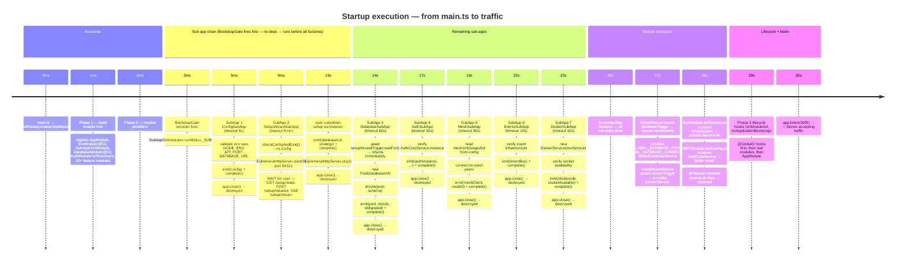
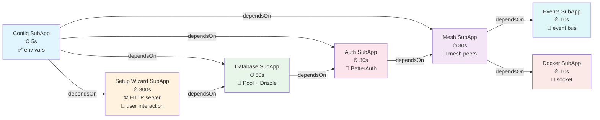
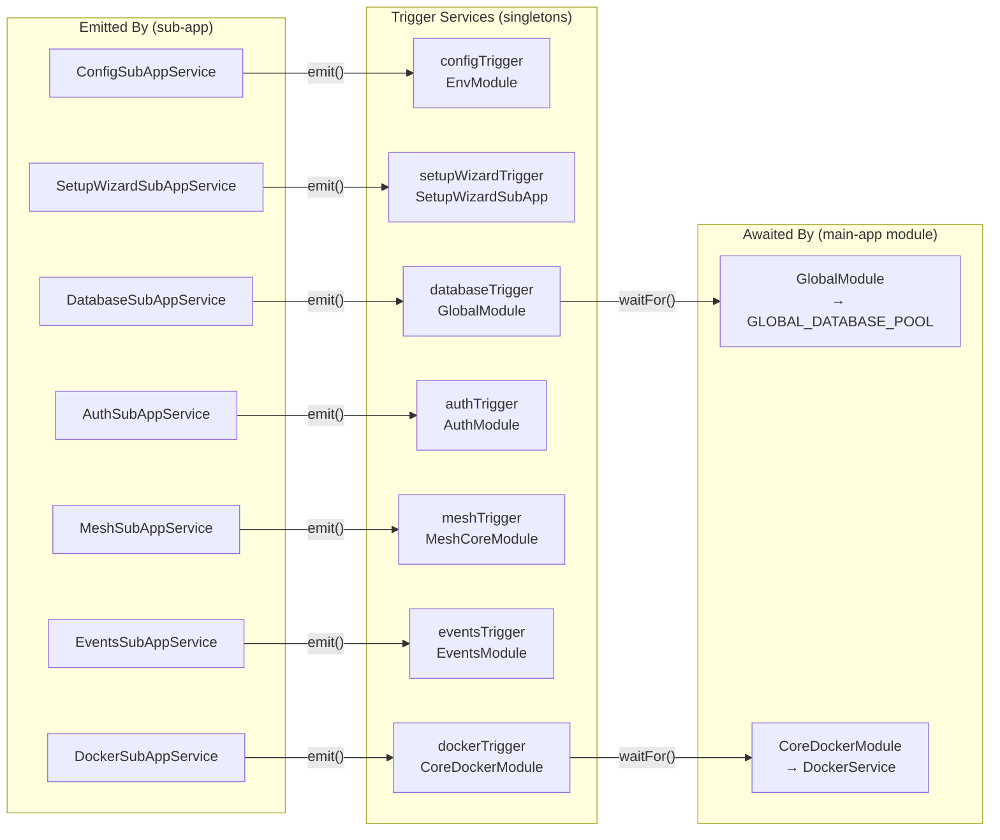

<DocMeta source="docs/architecture/startup-v2-complete-flow.mdx" scope="canonical" />

# Startup v2 — Complete Bootstrap Flow

> One diagram to rule them all. Every step from `process start` to `app.listen()`, showing the exact execution order, every sub-app, every trigger, every module resolution, and every lifecycle hook.

---

## The Complete Flow

```mermaid
flowchart TB
    subgraph PHASE0["Phase 0: Process Start"]
        A["bash: bun --bun run dev"]
        A --> B["main.ts bootstrap()"]
        B --> C["NestFactory.create(AppModule)"]
    end

    subgraph PHASE1["Phase 1: NestJS — Scan Module Tree"]
        direction TB
        P1_START["dependenciesScanner.scan(AppModule)"]
        P1_START --> P1_REGISTER["Register AppModule (distance=0)"]
        P1_REGISTER --> P1_RECURSE["Recurse into imports..."]
        P1_RECURSE --> P1_ENV["Register EnvModule\n@Global() → distance=MAX"]
        P1_RECURSE --> P1_ORCH["Register SubAppOrchestratorModule\n(distance=1)"]
        P1_RECURSE --> P1_DB["Register DatabaseModule\n@Global() → distance=MAX"]
        P1_RECURSE --> P1_AUTH["Register AuthModule.forRootAsync()\n(distance=1)"]
        P1_RECURSE --> P1_FEATURES["Register all feature modules\n(distance=1)"]
        P1_RECURSE --> P1_ORPC["Register ORPCModule.forRootAsync()\n(distance=1)"]
        P1_REGISTER --> P1_BIND["bindGlobalScope()"]
        P1_BIND --> P1_CALC["calculateModulesDistance()"]
        P1_CALC --> P1_DONE["✅ Module graph built\n25+ modules with distances"]
    end

    subgraph PHASE2["Phase 2: NestJS — Resolve All Providers"]
        direction TB
        P2_START["instanceLoader.createInstancesOfDependencies()"]
        P2_START --> P2_INIT["Initialize BootstrapGate provider\n(no inject deps → runs first)"]

        P2_INIT --> BOOTSTRAP_GATE
    end

    subgraph BOOTSTRAP_GATE["BootstrapGate: SubAppOrchestrator.runAll()"]
        direction TB
        BG_START["SubAppOrchestrator.runAll(ALL_SUB_APPS)"]
        BG_START --> BG_SORT["Topological sort by dependsOn:"]
        BG_SORT --> BG_CHAIN["config → setupWizard → database → auth → mesh → docker"]
    end

    subgraph SUB1["Sub-App 1: Config"]
        direction TB
        S1_CREATE["NestFactory.createApplicationContext(ConfigSubAppModule)"]
        S1_CREATE --> S1_INIT["ConfigSubAppService.onModuleInit()"]
        S1_INIT --> S1_VALIDATE["Validate env vars:\nNODE_ENV, API_PORT, DATABASE_URL"]
        S1_VALIDATE -->|"✅ Valid"| S1_EMIT["configTrigger.emit({ config: EnvService })"]
        S1_EMIT --> S1_COMPLETE["configTrigger.complete()"]
        S1_COMPLETE --> S1_DESTROY["app.close() → OnModuleDestroy\n❌ Sub-app destroyed"]
    end

    subgraph CHECK_CONFIG["NodeConfigRepository\n— already configured?"]
        CHECK_YES["✅ Yes: read persisted URL\n→ fire immediately"]
        CHECK_NO["❌ No: start setup wizard"]
    end

    subgraph SUB2["Sub-App 2: Setup Wizard"]
        direction TB
        S2_CREATE["NestFactory.createApplicationContext\n(SetupWizardSubAppModule)"]
        S2_CREATE --> S2_INIT["SetupWizardSubAppService.onModuleInit()"]
        S2_INIT --> S2_CHECK["InitializationService.checkConfigAndEmit()"]
        S2_CHECK -->|"No config"| S2_HTTP["EphemeralHttpServer.start()\n→ random port, 127.0.0.1"]
        S2_HTTP --> S2_WAIT["⏳ Wait for user:\n  GET /setup/state\n  POST /setup/initialize\n  SSE /setup/stream"]
        S2_WAIT --> S2_USER["User completes setup wizard"]
        S2_USER --> S2_COMPLETE["InitializationService.emitCompleted()"]
        S2_COMPLETE --> S2_EMIT["setupWizardTrigger.emit({ databaseUrl, strategy })"]
        S2_EMIT --> S2_CLOSE["setupWizardTrigger.complete()"]
        S2_CLOSE --> S2_STOP_HTTP["EphemeralHttpServer.stop()\n→ port released"]
        S2_STOP_HTTP --> S2_DESTROY["app.close() → ❌ Destroyed"]
    end

    subgraph SUB3["Sub-App 3: Database"]
        direction TB
        S3_CREATE["NestFactory.createApplicationContext\n(DatabaseSubAppModule)"]
        S3_CREATE --> S3_INIT["DatabaseSubAppService.onModuleInit()"]
        S3_INIT --> S3_WAIT["await setupWizardTrigger.waitFor()\n→ gets databaseUrl"]
        S3_WAIT --> S3_POOL["new Pool({ connectionString })\nfrom pg"]
        S3_POOL --> S3_DRIZZLE["drizzle(pool, schema)\n→ Drizzle ORM instance"]
        S3_DRIZZLE --> S3_EMIT["databaseTrigger.emit({ pool, drizzle, isMigrated })"]
        S3_EMIT --> S3_COMPLETE["databaseTrigger.complete()"]
        S3_COMPLETE --> S3_DESTROY["app.close() → ❌ Destroyed"]
    end

    subgraph SUB4["Sub-App 4: Auth"]
        direction TB
        S4_CREATE["NestFactory.createApplicationContext\n(AuthSubAppModule)"]
        S4_CREATE --> S4_INIT["AuthSubAppService.onModuleInit()"]
        S4_INIT --> S4_VERIFY["Verify AuthCoreService.instance\n→ BetterAuth initialized"]
        S4_VERIFY --> S4_EMIT["authTrigger.emit({ authInstance, authCoreService, adminCreated })"]
        S4_EMIT --> S4_COMPLETE["authTrigger.complete()"]
        S4_COMPLETE --> S4_DESTROY["app.close() → ❌ Destroyed"]
    end

    subgraph SUB5["Sub-App 5: Mesh"]
        direction TB
        S5_CREATE["NestFactory.createApplicationContext\n(MeshSubAppModule)"]
        S5_CREATE --> S5_INIT["MeshSubAppService.onModuleInit()"]
        S5_INIT --> S5_READ["Read config: meshUrlsSnapshot\npeerServiceToken"]
        S5_READ --> S5_CONNECT["Connect to mesh peers\n→ MeshInitializationService"]
        S5_CONNECT --> S5_EMIT["meshTrigger.emit({ meshClient, nodeId })"]
        S5_EMIT --> S5_COMPLETE["meshTrigger.complete()"]
        S5_COMPLETE --> S5_DESTROY["app.close() → ❌ Destroyed"]
    end

    subgraph SUB6["Sub-App 6: Events"]
        direction TB
        S6_CREATE["NestFactory.createApplicationContext\n(EventsSubAppModule)"]
        S6_CREATE --> S6_INIT["EventsSubAppService.onModuleInit()"]
        S6_INIT --> S6_VERIFY["Verify event infrastructure"]
        S6_VERIFY --> S6_EMIT["eventsTrigger.emit({ eventBus })"]
        S6_EMIT --> S6_COMPLETE["eventsTrigger.complete()"]
        S6_COMPLETE --> S6_DESTROY["app.close() → ❌ Destroyed"]
    end

    subgraph SUB7["Sub-App 7: Docker"]
        direction TB
        S7_CREATE["NestFactory.createApplicationContext\n(DockerSubAppModule)"]
        S7_CREATE --> S7_INIT["DockerSubAppService.onModuleInit()"]
        S7_INIT --> S7_CREATE_DOCKER["new DockerService(envService)\n→ wraps dockerode"]
        S7_CREATE_DOCKER --> S7_VERIFY["Verify Docker socket"]
        S7_VERIFY --> S7_EMIT["dockerTrigger.emit({ dockerode, socketAvailable })"]
        S7_EMIT --> S7_COMPLETE["dockerTrigger.complete()"]
        S7_COMPLETE --> S7_DESTROY["app.close() → ❌ Destroyed"]
    end

    subgraph MODULE_RESOLUTION["Module Resolution (Main App DI)"]
        direction TB
        MR_GLOBAL["GlobalModule:\n  await databaseTrigger.waitFor()\n  → resolves GLOBAL_DATABASE_POOL\n  → creates DrizzleClient\n  → provides GlobalDatabaseService"]
        MR_DOCKER["CoreDockerModule:\n  await dockerTrigger.waitFor()\n  → provides DockerService"]
        MR_AUTH["AuthModule.forRootAsync:\n  useFactory: createBetterAuth\n  receives GLOBAL_DATABASE_CONNECTION\n  → BetterAuth instance ready"]
        MR_FEATURES["Feature modules:\n  inject GlobalDatabaseService\n  inject AuthCoreService\n  inject DockerService\n  → All providers resolved"]
        MR_ORPC["ORPCModule.forRootAsync:\n  injects AuthCoreService\n  → Router bound with auth context\n  → Interceptors + plugins configured"]
    end

    subgraph PHASE3["Phase 3: NestJS — Lifecycle Hooks"]
        direction TB
        P3_HOOKS["callInitHook()\n→ reverse distance order"]
        P3_HOOKS --> P3_GLOBAL["@Global() modules:\n  EnvModule.onModuleInit()\n  DatabaseModule.onModuleInit()"]
        P3_GLOBAL --> P3_DEEP["Leaf modules:\n  MeshInitializationModule.onModuleInit()\n  CoreEventSyncService.onModuleInit()\n  ..."]
        P3_DEEP --> P3_ROOT["AppModule.onModuleInit()"]
        P3_ROOT --> P3_ROUTES["registerRouter()\n→ HTTP route handlers bound"]
        P3_ROUTES --> P3_BOOT["callBootstrapHook()\n→ onApplicationBootstrap()"]
        P3_BOOT --> P3_LISTEN["app.listen(port)\n🚀 Server accepting traffic"]
    end

    %% CONNECT THE FLOW
    PHASE0 --> PHASE1 --> PHASE2
    P2_INIT --> BG_START

    BG_CHAIN --> S1_CREATE

    S1_DESTROY --> CHECK_CONFIG
    CHECK_CONFIG -->|"✅ Existing config"| S3_CREATE
    CHECK_CONFIG -->|"❌ First time"| S2_CREATE
    S2_DESTROY --> S3_CREATE

    S3_DESTROY --> S4_CREATE
    S4_DESTROY --> S5_CREATE
    S5_DESTROY --> S6_CREATE
    S5_DESTROY --> S7_CREATE

    S6_DESTROYE["S6 destroyed"]
    S7_DESTROYE["S7 destroyed"]
    S6_DESTROYE --> MR_GLOBAL
    S7_DESTROYE --> MR_GLOBAL

    MR_GLOBAL --> MR_AUTH
    MR_AUTH --> MR_FEATURES
    MR_AUTH --> MR_ORPC
    MR_FEATURES --> MR_DOCKER
    MR_DOCKER --> MR_RESOLVED["✅ All modules resolved\nin main app DI container"]
    MR_RESOLVED --> PHASE3

    %% STYLING
    classDef phase fill:#e3f2fd,stroke:#1565c0,stroke-width:2px
    classDef nestjs fill:#e8f5e9,stroke:#2e7d32
    classDef gate fill:#fff3e0,stroke:#e65100,stroke-width:2px
    classDef subapp fill:#fce4ec,stroke:#c62828
    classDef trigger fill:#f3e5f5,stroke:#7b1fa2
    classDef resolve fill:#e0f7fa,stroke:#00838f
    classDef destroy fill:#ffebee,stroke:#b71c1c

    class PHASE0,PHASE1,PHASE2,PHASE3 phase
    class P1_START,P1_REGISTER,P1_RECURSE,P1_BIND,P1_CALC,P1_DONE,P2_START,P2_INIT,P3_HOOKS,P3_GLOBAL,P3_DEEP,P3_ROOT,P3_ROUTES,P3_BOOT,P3_LISTEN nestjs
    class BOOTSTRAP_GATE,BG_START,BG_SORT,BG_CHAIN gate
    class S1_CREATE,S1_INIT,S2_CREATE,S2_INIT,S3_CREATE,S3_INIT,S4_CREATE,S4_INIT,S5_CREATE,S5_INIT,S6_CREATE,S6_INIT,S7_CREATE,S7_INIT subapp
    class S1_EMIT,S2_EMIT,S3_EMIT,S4_EMIT,S5_EMIT,S6_EMIT,S7_EMIT trigger
    class MR_GLOBAL,MR_DOCKER,MR_AUTH,MR_FEATURES,MR_ORPC,MR_RESOLVED resolve
    class S1_DESTROY,S2_DESTROY,S3_DESTROYE,S4_DESTROY,S5_DESTROY,S6_DESTROYE,S7_DESTROYE destroy
```

---

## Execution Timeline (Milliseconds)

---

## Key Design Points

| Aspect | Mechanism | Why |
|--------|-----------|-----|
| **Orchestrator** | `BOOTSTRAP_GATE` provider (Phase 2) | Runs before all module factories because it has no `inject` deps |
| **Sub-app ordering** | Topological sort of `dependsOn` fields | `config → setupWizard → database → auth → mesh → docker` |
| **Setup wizard** | Embedded in sub-app chain | Only runs on first boot; skipped via fast path if config exists |
| **Trigger sync** | `emit()` + `complete()` in sub-app, `waitFor()` in module factory | Singleton trigger services bridge sub-app output to main-app DI |
| **Module barrier** | Each module factory `await`s its trigger | NestJS provider barrier ensures ordering |
| **Clean teardown** | `app.close()` on each sub-app | `OnModuleDestroy` on all providers, connections closed, GC freed |

---

## Sub-App Dependency Graph (Topological)

---

## Trigger Emission → Module Resolution Map

---

## Key Files Involved

| Step | File(s) | Role |
|------|---------|------|
| Entry point | `main.ts` | Creates NestJS app, enables shutdown hooks, configures CORS, listens |
| Module tree | `app.module.ts` | Root module — defines all imports, BOOTSTRAP_GATE provider |
| Foundation | `EnvModule`, `TriggersModule` (past) | `@Global()` modules — EnvService |
| Orchestrator | `SubAppOrchestrator.service.ts` | `runAll()` with topological sort |
| Sub-app runner | `SubAppContextModule`, `sub-app.interface.ts` | Provides SUB_APP_CONTEXT token |
| Config | `sub-apps/config/config.sub-app*.ts` | Validates env vars |
| Setup wizard | `sub-apps/setup-wizard/setup-wizard.sub-app*.ts` | HTTP wizard for first-time setup |
| Database | `sub-apps/database/database.sub-app*.ts` | Creates Pool + Drizzle |
| Auth | `sub-apps/auth/auth.sub-app*.ts` | Verifies BetterAuth |
| Mesh | `sub-apps/mesh/mesh.sub-app*.ts` | Connects to mesh peers |
| Events | `sub-apps/events/events.sub-app*.ts` | Verifies event bus |
| Docker | `sub-apps/docker/docker.sub-app*.ts` | Validates Docker socket |
| Trigger base | `core/modules/triggers/base-trigger.service.ts` | Extends BaseEventService |
| Per-domain triggers | `config.trigger.service.ts` etc. | 7 services with Zod schemas |
| DB provider | `core/modules/database/global/global.module.ts` | Awaits `databaseTrigger.waitFor()` |
| Docker provider | `core/modules/docker/docker.module.ts` | Awaits `dockerTrigger.waitFor()` |
| Registry | `sub-apps/registry.ts` | `ALL_SUB_APPS` list |
