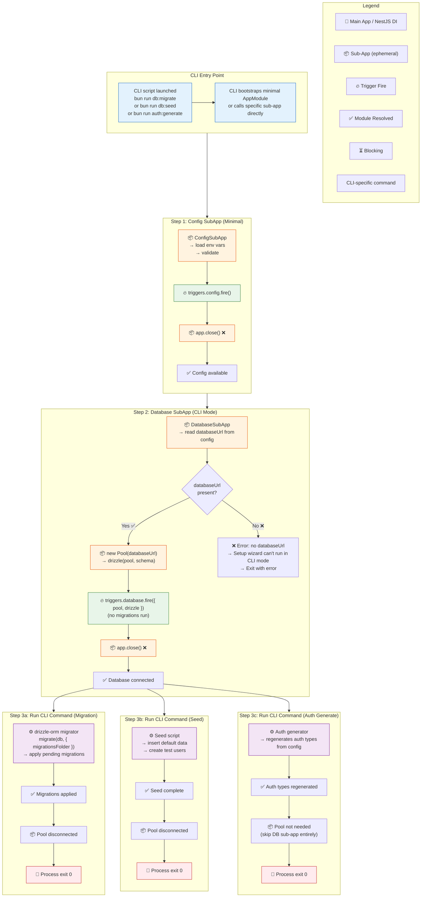
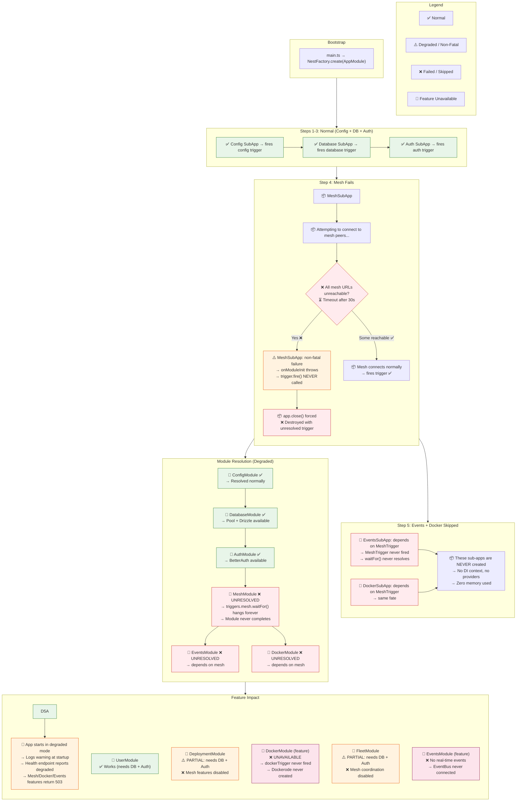
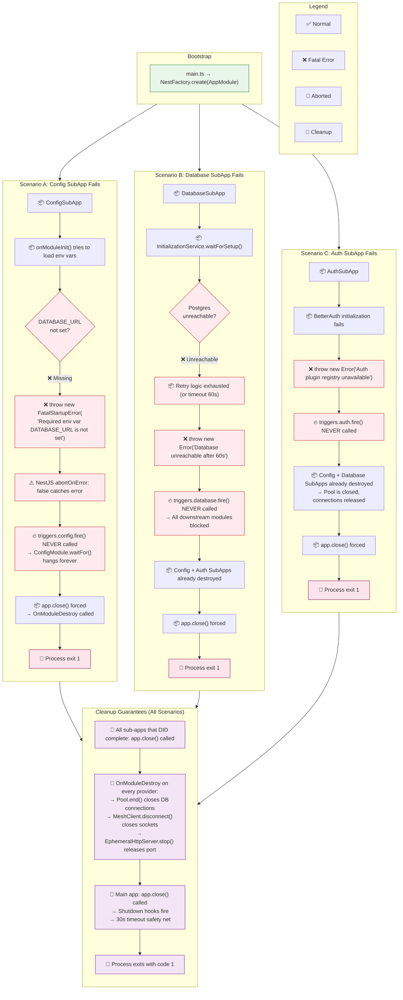
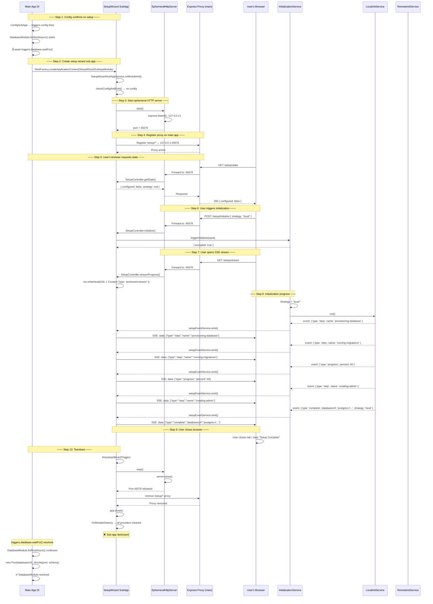
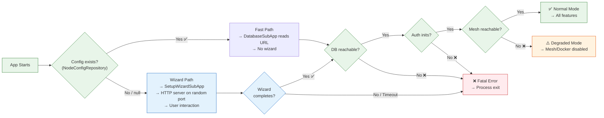

<DocMeta source="docs/architecture/startup-v2-flow-per-case.mdx" scope="canonical" />

# Startup v2 — Complete Flow Per Case

Six distinct startup scenarios. Each graph shows the exact path from `main.ts` through every sub-app, trigger, and module resolution to the final state.

---

## Table of Contents

1. [Case 1: First-Time Setup (Fresh Install)](#case-1-first-time-setup-fresh-install)
2. [Case 2: Normal Restart (Already Configured)](#case-2-normal-restart-already-configured)
3. [Case 3: CLI / Script Mode](#case-3-cli--script-mode)
4. [Case 4: Degraded Mode (Non-Critical Failure)](#case-4-degraded-mode-non-critical-failure)
5. [Case 5: Fatal Error (Critical Failure)](#case-5-fatal-error-critical-failure)
6. [Case 6: Setup Wizard Deep Flow (User Interaction)](#case-6-setup-wizard-deep-flow-user-interaction)

---

## Case 1: First-Time Setup (Fresh Install)

**Condition**: `NodeConfigRepository.find()` returns `null`. No config, no `databaseUrl`. Setup wizard must run.

**Path**: Config SubApp → Setup Wizard SubApp (HTTP server on random port) → user completes wizard → Database SubApp → Auth SubApp → Mesh SubApp → Events + Docker SubApps (parallel) → Ready.

```mermaid
flowchart TB
    subgraph LEGEND["Legend"]
        L1["🥇 Main App / NestJS DI"]
        L2["📦 Sub-App (ephemeral DI container)"]
        L3["🔥 Trigger Fire"]
        L4["✅ Module Resolved"]
        L5["⏳ Blocking / Waiting"]
        L6["❌ Destroyed / Cleaned Up"]
    end

    subgraph PHASE0["Phase 0: Bootstrap"]
        A["main.ts\nNestFactory.create(AppModule)"] --> B["AppModule\nimports scan"]
        B --> C["NestJS Phase 1: Build module tree"]
        C --> D["NestJS Phase 2: Resolve providers\n(barrier mechanism)"]
    end

    subgraph CONFIG["Step 1: Config SubApp"]
        direction TB
        C1["🥇 ConfigModule.forRootAsync()\nuseFactory: await triggers.config.waitFor()\n⏳ BLOCKS here"]
        C2["📦 ConfigSubApp\nNestFactory.createApplicationContext()"]
        C3["📦 ConfigSubAppService.onModuleInit()\n→ load env vars\n→ validate required vars"]
        C4{"All env vars\nvalid?"}
        C5["🔥 triggers.config.fire({ config })\n✅ Sub-app done"]
        C6["📦 app.close()\n→ OnModuleDestroy\n❌ Destroyed"]
        
        C1 -.->|"useFactory creates"| C2
        C2 --> C3 --> C4
        C4 -->|"Yes ✅"| C5
        C4 -->|"No ❌"| C4_FAIL["❌ FatalStartupError\n→ process exit"]
        C5 --> C6
        C6 --> C7["🔥 ConfigTrigger fires\n→ ConfigModule.waitFor() resolves"]
    end

    subgraph CHECK["Step 2: Config Check (Branch)"]
        direction TB
        CH1["📦 InitializationService\ncheckConfigAndEmit()"]
        CH2{"NodeConfigRepository.find()\nreturns config?"}
        
        CH1 --> CH2
        CH2 -->|"null (first time)"| WIZARD_PATH
    end

    subgraph WIZARD_PATH["Step 3: Setup Wizard SubApp (First Time)"]
        direction TB
        W1["🥇 DatabaseModule.forRootAsync()\nuseFactory: await triggers.database.waitFor()\n⏳ BLOCKS here"]
        W2["📦 SetupWizardSubApp\nNestFactory.createApplicationContext()"]
        W3["📦 SetupWizardSubAppService.onModuleInit()\n→ checkConfigAndEmit() = not configured"]
        W4["📦 EphemeralHttpServer.start()\n→ listen(0, '127.0.0.1')\n→ random port: 45678"]
        W5["🌐 Proxy: /setup/* → 127.0.0.1:45678\n(main app Express forwards)"]
        W6["📦 await setupEventService.events$\n→ SSE stream open"]
        W7["⏳ Waiting for user...\nGET /setup/state → shows 'not configured'\nPOST /setup/initialize → triggers local/remote flow\nSSE /setup/stream → progress events"]
        
        W1 -.->|"useFactory creates"| W2
        W2 --> W3 --> W4 --> W5 --> W6 --> W7
    end

    subgraph USER_COMPLETE["Step 4: User Completes Setup"]
        direction TB
        U1["POST /setup/initialize\n{ strategy: 'local', ... }"]
        U2["📦 InitializationService.triggerInitialize()"]
        U3{"Strategy?"}
        U4["📦 LocalInitializationService\n→ provision Postgres\n→ run migrations\n→ create admin"]
        U5["📦 RemoteInitializationService\n→ connect to mesh\n→ join grant\n→ receive databaseUrl"]
        U6["📦 InitializationService.emitCompleted()\n→ ReplaySubject emits\n→ { databaseUrl, strategy, nodeId }"]
        U7["🔥 triggers.setupWizard.fire({ databaseUrl })\n→ wizard completes"]
        
        U1 --> U2 --> U3
        U3 -->|"local"| U4 --> U6
        U3 -->|"remote"| U5 --> U6
        U6 --> U7
        
        U8["📦 EphemeralHttpServer.stop()\n→ server.close(), port released"]
        U9["🌐 Proxy removed from main app Express"]
        U10["📦 SetupWizardSubApp.app.close()\n→ OnModuleDestroy\n❌ Destroyed"]
        
        U7 --> U8 --> U9 --> U10
        U10 --> U11["🔥 DatabaseTrigger fires\n→ DatabaseModule.waitFor() resolves"]
    end

    subgraph DB["Step 5: Database SubApp"]
        direction TB
        D1["📦 DatabaseSubApp\nNestFactory.createApplicationContext()"]
        D2["📦 DatabaseSubAppService.onModuleInit()\n→ new Pool(databaseUrl)\n→ drizzle(pool, schema)"]
        D3["🔥 triggers.database.fire({ pool, drizzle })\n✅ Pool + Drizzle ready"]
        D4["📦 app.close()\n❌ Destroyed"]
        
        D1 --> D2 --> D3 --> D4
        D4 --> D5["🔥 DatabaseTrigger fires\n→ All DB deps resolve"]
    end

    subgraph AUTH["Step 6: Auth SubApp"]
        direction TB
        A1["📦 AuthSubApp\nNestFactory.createApplicationContext()"]
        A2["📦 AuthSubAppService.onModuleInit()\n→ init BetterAuth\n→ verify plugin registry"]
        A3["🔥 triggers.auth.fire({ authInstance })\n✅ Auth ready"]
        A4["📦 app.close()\n❌ Destroyed"]
        
        A1 --> A2 --> A3 --> A4
        A4 --> A5["🔥 AuthTrigger fires\n→ AuthModule.waitFor() resolves"]
    end

    subgraph MESH["Step 7: Mesh SubApp"]
        direction TB
        M1["📦 MeshSubApp\nNestFactory.createApplicationContext()"]
        M2["📦 MeshSubAppService.onModuleInit()\n→ connect to mesh peers\n→ register node"]
        M3["🔥 triggers.mesh.fire({ meshClient })\n✅ Mesh ready"]
        M4["📦 app.close()\n❌ Destroyed"]
        
        M1 --> M2 --> M3 --> M4
        M4 --> M5["🔥 MeshTrigger fires\n→ MeshModule.waitFor() resolves"]
    end

    subgraph PARALLEL["Step 8: Events + Docker (Parallel)"]
        direction TB
        P_GROUP["Both depend on MeshTrigger\n→ NestJS barrier allows parallel"]
        
        subgraph EVENTS["Events SubApp"]
            E1["📦 EventsSubApp\nNestFactory.createApplicationContext()"]
            E2["📦 EventsSubAppService.onModuleInit()\n→ connect EventBus\n→ subscribe to channels"]
            E3["🔥 triggers.events.fire({ eventBus })\n→ EventsModule resolves"]
            E4["📦 app.close()\n❌ Destroyed"]
            E1 --> E2 --> E3 --> E4
        end
        
        subgraph DOCKER["Docker SubApp"]
            DK1["📦 DockerSubApp\nNestFactory.createApplicationContext()"]
            DK2["📦 DockerSubAppService.onModuleInit()\n→ validate socket\n→ init Dockerode"]
            DK3["🔥 triggers.docker.fire({ dockerode })\n→ DockerModule resolves"]
            DK4["📦 app.close()\n❌ Destroyed"]
            DK1 --> DK2 --> DK3 --> DK4
        end
        
        P_GROUP --> EVENTS
        P_GROUP --> DOCKER
    end

    subgraph COMPLETE["Step 9: All Done"]
        CP1["🥇 All triggers resolved"]
        CP2["🥇 Feature modules have all deps:\n→ Pool, Drizzle, Auth, Mesh,\n  EventBus, Dockerode"]
        CP3["🥇 ORPCModule.forRootAsync() resolves\n→ Router bound with auth context"]
        CP4["🥇 app.listen(3005)\n🚀 Server accepting traffic"]
        CP5["🧹 Zero sub-apps alive\nZero startup providers in DI\nZero setup endpoints"]
        
        CP1 --> CP2 --> CP3 --> CP4 --> CP5
    end

    %% Connect the chain
    CONFIG --> CHECK
    WIZARD_PATH --> USER_COMPLETE --> DB --> AUTH --> MESH --> PARALLEL --> COMPLETE

    classDef main fill:#e3f2fd,stroke:#1565c0
    classDef sub fill:#fff3e0,stroke:#e65100
    classDef trigger fill:#e8f5e9,stroke:#2e7d32
    classDef block fill:#ffebee,stroke:#c62828
    classDef destroy fill:#f3e5f5,stroke:#7b1fa2
    classDef proxy fill:#e0f7fa,stroke:#00838f

    class A,B,C,D,CP1,CP2,CP3,CP4,CP5 main
    class C2,C3,C6,W2,W3,W4,W6,W10,D1,D2,D4,A1,A2,A4,M1,M2,M4,E1,E2,E4,DK1,DK2,DK4 sub
    class C5,C7,W7,U6,U7,U11,D3,D5,A3,A5,M3,M5,E3,DK3 trigger
    class C1,W1 block
    class W5,U9 proxy
    class C6,W10,D4,A4,M4,E4,DK4 destroy
```



---

## Case 2: Normal Restart (Already Configured)

**Condition**: `NodeConfigRepository.find()` returns a valid config. `databaseUrl` is known. Setup wizard is skipped entirely.

**Path**: Config SubApp → Database SubApp (reads persisted URL, no wizard) → Auth SubApp → Mesh SubApp → Events + Docker → Ready. No user interaction. No HTTP server.

```mermaid
flowchart TB
    subgraph LEGEND2["Legend"]
        L1["🥇 Main App / NestJS DI"]
        L2["📦 Sub-App (ephemeral DI container)"]
        L3["🔥 Trigger Fire"]
        L4["✅ Module Resolved"]
        L5["⏳ Blocking / Waiting"]
        L6["Fast Path (no wizard)"]
    end

    subgraph P0["Phase 0: Bootstrap"]
        P0A["main.ts\nNestFactory.create(AppModule)"] --> P0B["NestJS Phase 1-2\nbuild graph + resolve providers"]
    end

    subgraph P1["Step 1: Config SubApp"]
        direction TB
        P1A["🥇 ConfigModule.forRootAsync()\n⏳ waitFor(config)"]
        P1B["📦 ConfigSubApp\n→ validate env vars"]
        P1C["🔥 triggers.config.fire()"]
        P1D["📦 app.close() ❌"]
        
        P1A -.->|"creates"| P1B --> P1C --> P1D
        P1D --> P1E["✅ ConfigModule resolved"]
    end

    subgraph P2["Step 2: Database SubApp (Fast Path)"]
        direction TB
        P2A["🥇 DatabaseModule.forRootAsync()\n⏳ waitFor(database)"]
        P2B["📦 DatabaseSubApp"]
        P2C["📦 InitializationService.checkConfigAndEmit()"]
        P2D{"config.configuredAt\npresent?"}
        P2E["📦 Read persisted databaseUrl\nfrom NodeConfigRepository"]
        P2F["📦 new Pool(databaseUrl)\ndrizzle(pool, schema)"]
        P2G["🔥 triggers.database.fire({ pool, drizzle })\n✅ No wizard needed"]
        P2H["📦 app.close() ❌"]
        
        P2A -.->|"creates"| P2B --> P2C --> P2D
        P2D -->|"Yes ✅"| P2E --> P2F --> P2G --> P2H
        P2D -->|"No (unexpected)"| P2_FAIL["❌ Fatal: should have config"]
        P2H --> P2I["✅ DatabaseModule resolved"]
        
        P2E -->|"Also reads:\nmeshUrlsSnapshot,\npeerServiceToken"| P2_STORE["📦 Stored for later sub-apps"]
    end

    subgraph P3["Step 3: Auth SubApp"]
        direction TB
        P3A["📦 AuthSubApp\n→ init BetterAuth"]
        P3B["🔥 triggers.auth.fire()"]
        P3C["📦 app.close() ❌"]
        
        P3A --> P3B --> P3C
        P3C --> P3D["✅ AuthModule resolved"]
    end

    subgraph P4["Step 4: Mesh SubApp"]
        direction TB
        P4A["📦 MeshSubApp"]
        P4B["📦 Read meshUrlsSnapshot from DB config"]
        P4C["📦 Connect to persisted mesh URLs"]
        P4D{"Mesh reachable?"}
        P4E["📦 Register node, establish session"]
        P4F["🔥 triggers.mesh.fire({ meshClient })"]
        P4G["📦 app.close() ❌"]
        
        P4A --> P4B --> P4C --> P4D
        P4D -->|"Yes ✅"| P4E --> P4F --> P4G
        P4D -->|"No ❌"| P4_SKIP["⚠️ Non-fatal: skip mesh\nMeshModule stays unresolved"]
        P4G --> P4H["✅ MeshModule resolved"]
    end

    subgraph P5["Step 5: Events + Docker (Parallel)"]
        direction TB
        
        subgraph P5E["Events SubApp"]
            P5E1["📦 EventsSubApp\n→ connect EventBus\n→ fire(events)"]
            P5E2["📦 app.close() ❌"]
            P5E --> P5E1 --> P5E2
        end
        
        subgraph P5D["Docker SubApp"]
            P5D1["📦 DockerSubApp\n→ validate socket\n→ fire(docker)"]
            P5D2["📦 app.close() ❌"]
            P5D --> P5D1 --> P5D2
        end
        
        P5E2 --> P5_RES["✅ EventsModule resolved"]
        P5D2 --> P5_RES
        P5_RES --> P5_DONE["All core modules resolved"]
    end

    subgraph P6["Step 6: Production Ready"]
        P6A["🥇 Feature modules receive CORE_SERVICES"]
        P6B["🥇 ORPCModule.forRootAsync() resolves"]
        P6C["🥇 app.listen(3005)\n🚀 Ready"]
        P6D["🧹 No sub-apps alive"]
        
        P6A --> P6B --> P6C --> P6D
    end

    P0 --> P1 --> P2 --> P3 --> P4 --> P5 --> P6

    classDef main fill:#e3f2fd,stroke:#1565c0
    classDef sub fill:#fff3e0,stroke:#e65100
    classDef trigger fill:#e8f5e9,stroke:#2e7d32
    classDef block fill:#ffebee,stroke:#c62828
    classDef fast fill:#c8e6c9,stroke:#1b5e20

    class P0A,P0B,P1A,P2A,P6A,P6B,P6C,P6D main
    class P1B,P1D,P2B,P2E,P2F,P2H,P3A,P3C,P4A,P4B,P4C,P4E,P4G,P5E1,P5E2,P5D1,P5D2 sub
    class P1C,P2G,P3B,P4F trigger
    class P1A,P2A,P2_FAIL block
    class P2E,P2F,P2_STORE fast
```

---

## Case 3: CLI / Script Mode

**Condition**: The process runs a CLI command (e.g., `bun run db:migrate`, `bun run db:seed`, `bun run auth:generate`). No HTTP server is started. No setup wizard. Only the minimum sub-apps needed for the CLI task run.

**Path**: Config SubApp → Database SubApp (minimum: pool only, no migrations orchestrated by the CLI) → CLI command executes → process exits.



---

## Case 4: Degraded Mode (Non-Critical Failure)

**Condition**: A non-critical sub-app (Mesh, Events, or Docker) fails. The app continues with reduced functionality. The failed sub-app's trigger never fires, and modules depending on it stay unresolved.

**Path**: Config → Database → Auth → **Mesh FAILS** → Docker **skipped** (because it depends on Mesh) → Feature modules that don't need Mesh/Docker work normally. The rest gracefully degrade.



---

## Case 5: Fatal Error (Critical Failure)

**Condition**: A critical sub-app (Config, Database, or Auth) fails. The process cannot continue. Clean shutdown with proper teardown.

**Path**: Fails at the failing sub-app → all dependent modules are skipped → `app.close()` on main app → process exits with error code.



---

## Case 6: Setup Wizard Deep Flow (User Interaction)

**Condition**: The most detailed view — the setup wizard sub-app lifecycle from creation to teardown, showing every HTTP endpoint, every SSE event, and every state transition.

**Path**: Config SubApp → Setup Wizard SubApp creates Express server → proxy registered on main app → user's browser hits `/setup/state` → user POSTs `/setup/initialize` → SSE stream pushes progress → wizard completes → server stops → proxy removed → sub-app destroyed → Database SubApp continues.



---

## Summary: Case Decision Matrix

| Case | Config Exists? | Wizard Runs? | Pool Created? | Auth Inited? | Mesh Connected? | HTTP Listens? | Degraded? |
|------|---------------|-------------|---------------|--------------|-----------------|---------------|-----------|
| **1. First-Time Setup** | No | ✅ Yes | ✅ After wizard | ✅ Yes | ✅ Yes | ✅ Yes | No |
| **2. Normal Restart** | ✅ Yes | No | ✅ Immediate | ✅ Yes | ✅ Yes | ✅ Yes | No |
| **3. CLI Mode** | ✅ Yes | No | ✅ Yes | No | No | No | N/A (exits) |
| **4. Degraded Mode** | ✅ Yes | No | ✅ Yes | ✅ Yes | ❌ Failed | ✅ Yes | ✅ Yes |
| **5. Fatal Error** | N/A | N/A | ❌ Failed | N/A | N/A | No | ❌ Process exits |
| **6. Setup Wizard Flow** | No | ✅ Deep flow | ✅ After wizard | ✅ After DB | ✅ After auth | ✅ (wizard only) | No |

### Key Decision Points


