<DocMeta source="docs/architecture/startup-v2-orchestration-graph.mdx" scope="canonical" />

# Startup v2 — Complete NestJS DI Orchestration Graph

> **The NestJS dependency injection graph IS the startup orchestrator.** There is no separate orchestrator service. The `imports` chain, the `forRootAsync` factories, the `@Global()` distance system, and the provider barrier mechanism form a single unified execution engine that resolves modules one-by-one in dependency order.

---

## Table of Contents

1. [How NestJS's DI Graph Becomes the Orchestrator](#1-how-nestjss-di-graph-becomes-the-orchestrator)
2. [Diagram 1 — Full Module Import Tree (All 30+ Modules)](#2-diagram-1--full-module-import-tree-all-30-modules)
3. [Diagram 2 — NestJS Bootstrap Sequence (3 Phases)](#3-diagram-2--nestjs-bootstrap-sequence-3-phases)
4. [Diagram 3 — Provider Barrier Mechanism (DI as DAG)](#4-diagram-3--provider-barrier-mechanism-di-as-dag)
5. [Diagram 4 — Sub-App Trigger Chain (Per-Module Isolation)](#5-diagram-4--sub-app-trigger-chain-per-module-isolation)
6. [Diagram 5 — Complete Module Resolution Timeline](#6-diagram-5--complete-module-resolution-timeline)
7. [Diagram 6 — Lifecycle Hooks Execution Order](#7-diagram-6--lifecycle-hooks-execution-order)
8. [Diagram 7 — Error Propagation & Degraded Mode](#8-diagram-7--error-propagation--degraded-mode)
9. [Diagram 8 — Setup Wizard Branch (Conditional Sub-App)](#9-diagram-8--setup-wizard-branch-conditional-sub-app)
10. [Diagram 9 — The Full Orchestration Graph (Unified)](#10-diagram-9--the-full-orchestration-graph-unified)
11. [Diagram 10 — Clean Teardown Sequence](#11-diagram-10--clean-teardown-sequence)
12. [Reference: Module Catalog](#12-reference-module-catalog)

---

## 1. How NestJS's DI Graph Becomes the Orchestrator

### The Core Insight

NestJS already has a complete dependency resolution engine. It:

1. **Scans** all `imports` to build a module tree with distances (Phase 1)
2. **Creates instances** of all providers with a **barrier mechanism**: if Provider B depends on Provider A (via `inject`), NestJS **waits** for A to resolve before calling B's factory (Phase 2)
3. **Calls lifecycle hooks** in reverse-distance order (`@Global()` first, root last) (Phase 3)

These three mechanisms form a **complete startup orchestrator** — no custom orchestrator service needed.

### The Barrier Mechanism (Key Enabler)

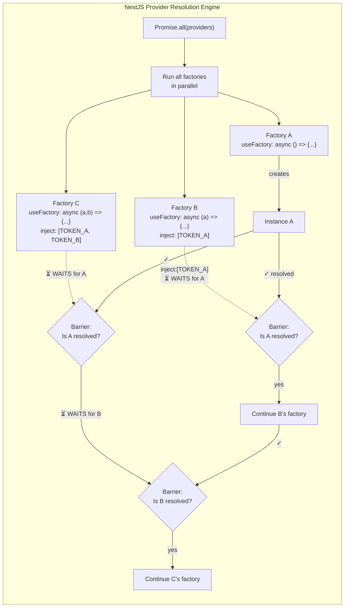

**How NestJS source code implements this** (`injector.js` — simplified):

```javascript
// For each provider, NestJS resolves its dependencies first
const instances = await Promise.all(dependencies.map(async (dep) => {
    const wrapper = await this.resolveSingleParam(wrapper, dep, ...);
    const instanceHost = wrapper.getInstanceByContextId(...);
    // IF THE DEPENDENCY ISN'T RESOLVED YET, WAIT
    if (!instanceHost.isResolved && !wrapper.forwardRef) {
        isResolved = false;
    }
    return instanceHost?.instance;
}));

// Only when all dependencies are resolved, call the factory
if (isResolved) {
    await callback(instances);
}
```

### The Import Chain as a Dependency Tree

Each `imports` entry in a module creates a **parent-child edge** in the module graph. NestJS scans these edges recursively to build the full tree, then assigns **distances**:

- `@Global()` modules → `distance = Number.MAX_VALUE` (resolved first)
- Leaf modules → `distance = n` (deepest paths)
- Root module (AppModule) → `distance = 0` (resolved last)

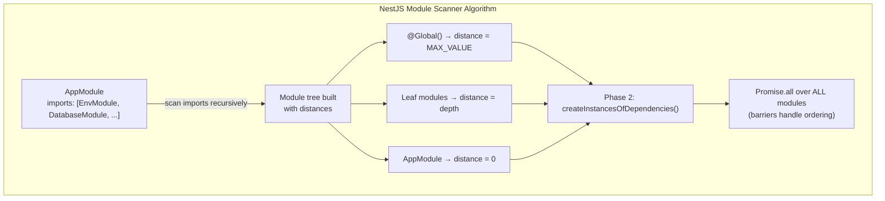

### The Key Design

In the v2 architecture, each core module uses `forRootAsync` with a factory that:

1. Optionally **creates a sub-app** (`NestFactory.createApplicationContext`)
2. **Await** a trigger or async operation
3. **Returns** the initialized service

The `imports` chain declares **what must be ready before this module**:

```typescript
// Pattern: forRootAsync as the dependency declaration
DatabaseModule.forRootAsync({
    imports: [
        ConfigModule.forRootAsync({
            // Config must be ready before Database
            // ConfigModule.forRootAsync triggers ConfigSubApp
        }),
    ],
    useFactory: async (config) => {
        // This factory runs AFTER ConfigModule's trigger resolves
        // because NestJS's barrier mechanism ensures it
    },
    inject: [CONFIG_SERVICE],
})
```

---

## 2. Diagram 1 — Full Module Import Tree (All 30+ Modules)

This is the **complete import hierarchy** of the API application. Each arrow is an `imports` declaration. Distance is NestJS's calculated module distance (lower = closer to root, resolved later).

```mermaid
graph TB
    subgraph LEVEL0["Distance 0 — AppModule (Root)"]
        APP["AppModule\n(resolved LAST)"]
    end

    subgraph LEVEL1["Distance 1 — Direct Feature Imports"]
        HEALTH["HealthModule"]
        USER["UserModule"]
        PUSH["PushModule"]
        TEST["TestModule"]
        SETUP["SetupModule\n(phase-out)"]
        ORG["OrganizationModule"]
        PROJ["ProjectModule"]
        SVC["ServiceModule"]
        DEPLOY["DeploymentModule"]
        GH["GithubModule"]
        FLEET["FleetModule"]
        DOMAIN["DomainModule"]
        ANALYTICS["AnalyticsModule"]
        PROV_SCHEMA["ProviderSchemaModule"]
        DOCKER_FEAT["DockerModule\n(feature)"]
        EVENTS_FEAT["EventsModule\n(feature)"]
        SYSTEM["SystemModule"]
        PERMISSION["PermissionModule"]
    end

    subgraph LEVEL1B["Distance 1 (cont.) — Core Imports"]
        ENV["EnvModule\n@Global()\nRESOLVED FIRST"]
        DB["DatabaseModule\n@Global()"]
        AUTH_ROOT["AuthModule.forRootAsync()"]
        ORPC_ROOT["ORPCModule.forRootAsync()"]
        STARTUP_V1["StartupModule\n(v1 — to be deleted)"]
    end

    subgraph LEVEL2["Distance 2 — Core Sub-Modules"]
        LOCAL_DB["LocalModule\n(SQLite)"]
        GLOBAL_DB["GlobalModule"]
        CORE_INIT["CoreInitializationModule"]
        DB_STARTUP["DatabaseStartupModule"]
        SETUP_STARTUP["SetupStartupModule"]
        AUTH_STARTUP["AuthStartupModule"]
        MESH_STARTUP["MeshStartupModule"]
        EVENTS_STARTUP["EventsStartupModule"]
        DOCKER_STARTUP["DockerStartupModule"]
        SYS_METRICS_STARTUP["SystemMetricsStartupModule"]
    end

    subgraph LEVEL3["Distance 3 — Deep Infrastructure"]
        MESH_INIT["MeshInitializationModule"]
        CORE_DOCKER["CoreDockerModule"]
        CORE_REACH["CoreReachabilityModule"]
        ENV_CONFIG["ConfigModule.forRoot()\n(@nestjs/config)"]
        AUTH_SERVICE["AuthCoreService\n+ BetterAuth"]
    end

    subgraph LEVEL4["Distance 4 — Providers (Resolved by Barriers)"]
        POOL_TOKEN["GLOBAL_DATABASE_POOL\n(useFactory async)"]
        DRIZZLE_TOKEN["GLOBAL_DATABASE_CONNECTION\n(useFactory sync)"]
        GLOBAL_DB_SVC["GlobalDatabaseService\n(injects drizzle)"]
    end

    %% AppModule imports - Distance 1
    APP --> ENV
    APP --> DB
    APP --> AUTH_ROOT
    APP --> ORPC_ROOT
    APP --> HEALTH
    APP --> USER
    APP --> PUSH
    APP --> TEST
    APP --> SETUP
    APP --> ORG
    APP --> PROJ
    APP --> SVC
    APP --> DEPLOY
    APP --> GH
    APP --> FLEET
    APP --> DOMAIN
    APP --> ANALYTICS
    APP --> PROV_SCHEMA
    APP --> DOCKER_FEAT
    APP --> EVENTS_FEAT
    APP --> SYSTEM
    APP --> PERMISSION
    APP --> STARTUP_V1

    %% Distance 1 → Distance 2
    STARTUP_V1 --> DB_STARTUP
    STARTUP_V1 --> SETUP_STARTUP
    STARTUP_V1 --> AUTH_STARTUP
    STARTUP_V1 --> MESH_STARTUP
    STARTUP_V1 --> EVENTS_STARTUP
    STARTUP_V1 --> DOCKER_STARTUP
    STARTUP_V1 --> SYS_METRICS_STARTUP
    STARTUP_V1 --> ENV

    DB --> LOCAL_DB
    DB --> GLOBAL_DB

    AUTH_ROOT --> ENV
    AUTH_ROOT --> DB

    %% Distance 2 → Distance 3
    GLOBAL_DB --> CORE_INIT
    
    CORE_INIT --> MESH_INIT
    CORE_INIT --> LOCAL_DB
    CORE_INIT --> CORE_DOCKER
    CORE_INIT --> CORE_REACH

    ENV --> ENV_CONFIG

    AUTH_STARTUP --> AUTH_SERVICE

    %% Distance 3 → Distance 4 (Provider-Level)
    subgraph BARRIERS["Provider Barrier Chain"]
        POOL_TOKEN -->|"inject: [InitializationService]"| DRIZZLE_TOKEN
        DRIZZLE_TOKEN -->|"inject: [GLOBAL_DATABASE_POOL]"| GLOBAL_DB_SVC
    end

    GLOBAL_DB --> POOL_TOKEN

    %% Annotations
    classDef global fill:#e1f5fe,stroke:#0288d1,stroke-width:2px
    classDef root fill:#fff3e0,stroke:#ff6f00,stroke-width:3px
    classDef feature fill:#e8f5e9,stroke:#388e3c
    classDef core fill:#fce4ec,stroke:#c62828
    classDef provider fill:#f3e5f5,stroke:#7b1fa2,stroke-dasharray: 5 5
    classDef barrier fill:#fff8e1,stroke:#f57f17,stroke-dasharray: 3 3

    class ENV,DB global
    class APP root
    class HEALTH,USER,PUSH,TEST,ORG,PROJ,SVC,DEPLOY,GH,FLEET,DOMAIN,ANALYTICS,PROV_SCHEMA,DOCKER_FEAT,EVENTS_FEAT,SYSTEM,PERMISSION feature
    class AUTH_ROOT,ORPC_ROOT,STARTUP_V1 core
    class CORE_INIT,DB_STARTUP,SETUP_STARTUP,AUTH_STARTUP,MESH_STARTUP,EVENTS_STARTUP,DOCKER_STARTUP,SYS_METRICS_STARTUP core
    class POOL_TOKEN,DRIZZLE_TOKEN,GLOBAL_DB_SVC provider
    class BARRIERS barrier
```

---

## 3. Diagram 2 — NestJS Bootstrap Sequence (3 Phases)

The NestJS bootstrap process has 3 distinct phases. Each is annotated with what happens to which modules.

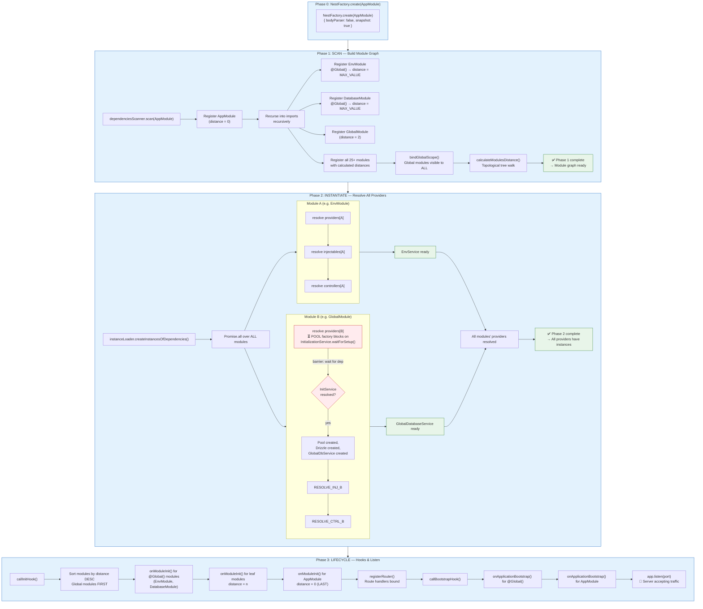

---

## 4. Diagram 3 — Provider Barrier Mechanism (DI as DAG)

This diagram shows how NestJS's provider barrier mechanism creates a **strict execution order** without any custom orchestrator. Each arrow is `inject: [TOKEN_X]` — the arrow direction is "depends on".

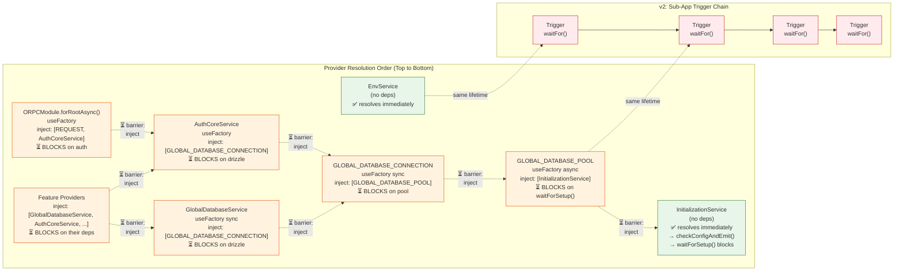

---

## 5. Diagram 4 — Sub-App Trigger Chain (Per-Module Isolation)

This diagram shows how the v2 sub-app pattern integrates with NestJS's DI. Each sub-app is created by a `forRootAsync` factory, does its work in isolation, fires its trigger, and is destroyed.

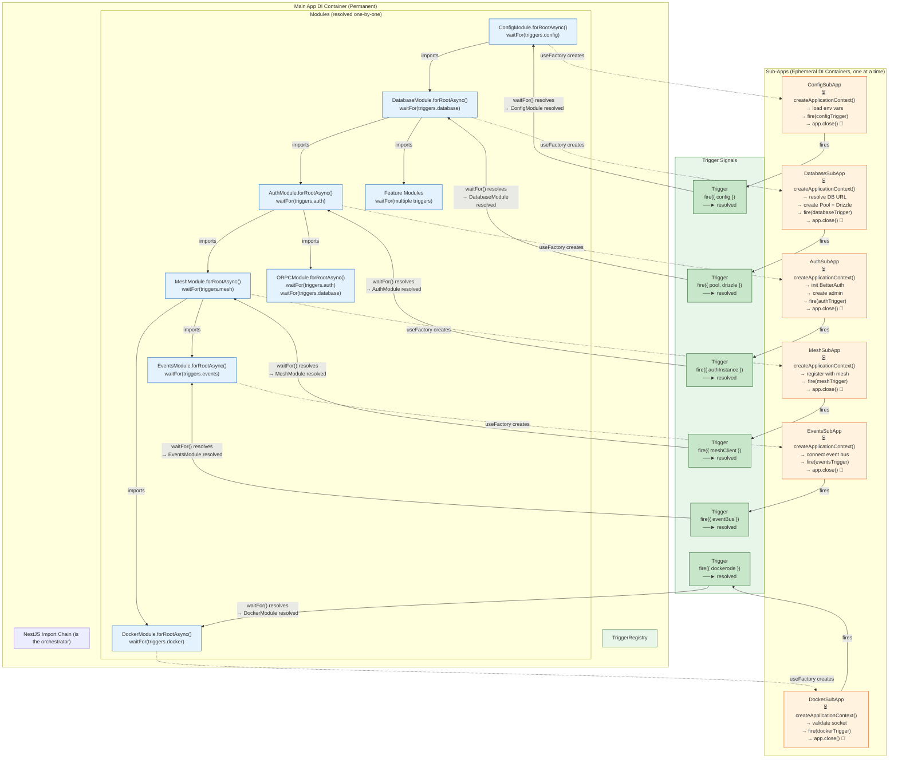

---

## 6. Diagram 5 — Complete Module Resolution Timeline

This is the **chronological execution order** from `main.ts` bootstrap to `app.listen()`. Each module resolves in sequence as the NestJS barrier mechanism or trigger chain enables it.

```mermaid
timeline
    title NestJS Bootstrap — Full Module Resolution Timeline

    section Phase 1: Scan
        0ms : NestFactory.create(AppModule)
            : dependenciesScanner.scan() builds module tree
            : @Global() → distance = MAX_VALUE
            : All 25+ modules registered with distances
            : Module graph complete

    section Phase 2: Instantiate (All Modules in Parallel with Barriers)
        2ms   : EnvModule resolves immediately
             :   → EnvService, ConfigService available
             : InitializationService resolves immediately
             :   → checkConfigAndEmit(), waitForSetup() blocks
        5ms   : LocalModule (SQLite) resolves
             : CoreReachabilityModule resolves
             : CoreDockerModule resolves
        10ms  : MeshInitializationModule resolves
        15ms  : CoreInitializationModule resolves
             :   (imports mesh + local + docker + reachability)
        20ms  : ⏳ GLOBAL_DATABASE_POOL factory starts
             :   → injects InitializationService
             :   → calls checkConfigAndEmit()
             :   → ⏳ BLOCKS on waitForSetup()
        20ms  : All other independent providers resolve
             :   Middlewares, filters, guards
        50ms  : (If configured) Pool created
             : ⏳ waitForSetup() resolves with databaseUrl
             : new Pool(connectionString) created
        55ms  : GLOBAL_DATABASE_CONNECTION factory
             :   → injects Pool
             :   → drizzle(pool, schema) created
        60ms  : GlobalDatabaseService factory
             :   → injects DrizzleClient
        65ms  : AuthCoreService resolves
             :   → injects DrizzleClient
             : AuthModule.forRootAsync() → BetterAuth instance
        70ms  : Feature module providers resolve
             :   → all have GlobalDatabaseService available
        80ms  : ORPCModule.forRootAsync() resolves
             :   → injects REQUEST + AuthCoreService
             :   → Router, interceptors, plugins configured

    section Phase 3: Lifecycle Hooks
        85ms  : callInitHook() — reverse distance order
             : EnvModule.onModuleInit()
             : DatabaseModule.onModuleInit()
             : GlobalModule.onModuleInit()
        90ms  : StartupOrchestratorService.onModuleInit()
             :   → Phase 0: Core startup services (DB, setup, auth, mesh, ...)
             :   → Step 1: Run migrations
             :   → Step 2: Create admin user
             :   → Step 3: Register mesh node
             :   → Step 4: Report schema version
             :   → isStartupComplete() = true
        100ms : AppModule.onModuleInit()
        105ms : registerRouter() → bind routes
        110ms : callBootstrapHook()
             : EnvModule.onApplicationBootstrap()
             : AppModule.onApplicationBootstrap()
        115ms : app.listen(port)
             : 🚀 Server accepting traffic on port 3005
```

---

## 7. Diagram 6 — Lifecycle Hooks Execution Order

NestJS calls lifecycle hooks in **reverse distance order** (deepest/global modules first, root last). This is critical for the v2 sub-app pattern because it determines when each sub-app's `onModuleInit` fires.

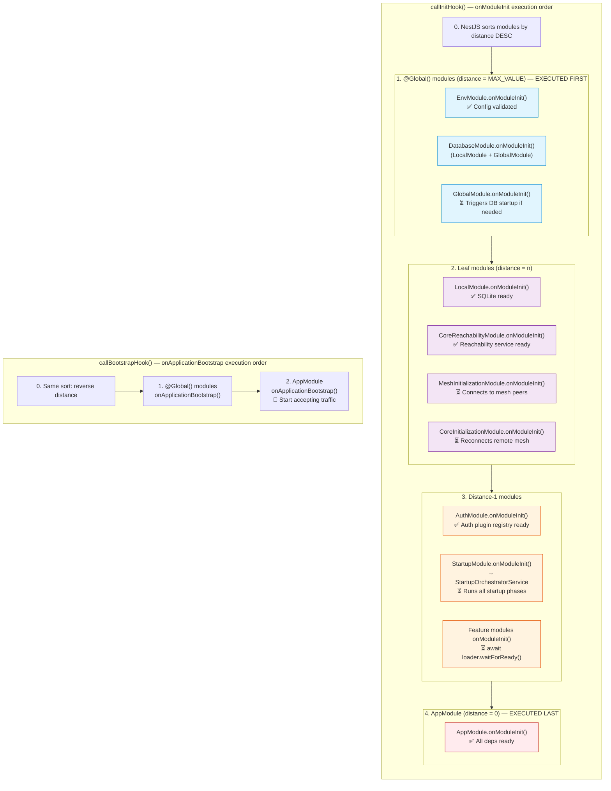

---

## 8. Diagram 7 — Error Propagation & Degraded Mode

When a sub-app fails or a trigger times out, the error propagates through the NestJS barrier mechanism. This diagram shows the failure modes and how the system degrades gracefully.

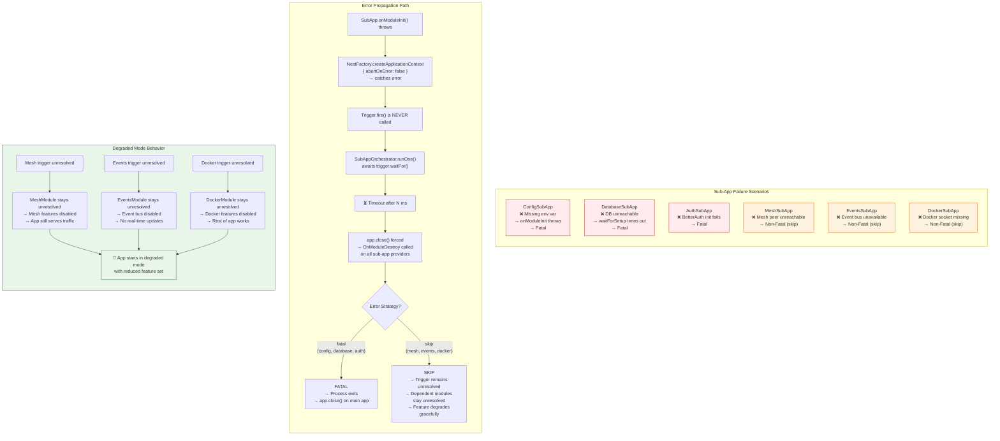

---

## 9. Diagram 8 — Setup Wizard Branch (Conditional Sub-App)

The setup wizard is a conditional branch in the startup chain. It only runs if the node isn't configured yet. This is determined by the `InitService` config check.

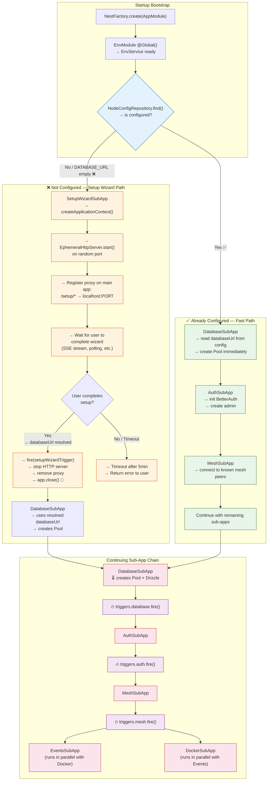

---

## 10. Diagram 9 — The Full Orchestration Graph (Unified)

This is the **complete unified view** — combining the NestJS DI graph, the import tree, the barrier mechanism, the sub-app lifecycle, and the trigger chain into one giant graph.

```mermaid
graph TB
    %% ── Main App Container ──
    subgraph MAIN_APP["Main App DI Container — Permanent"]
        APP["AppModule\n(distance = 0)"]
        
        %% @Global modules - resolved FIRST by NestJS
        subgraph GLOBAL["@Global() Modules — Resolved First"]
            ENV["EnvModule\n→ EnvService"]
            DB_PARENT["DatabaseModule\n→ LocalModule\n→ GlobalModule"]
            TRIG["TriggerRegistry\n→ config, database, auth,\n  mesh, events, docker"]
        end
        
        %% Core modules with forRootAsync
        subgraph CORE["Core Modules — forRootAsync Chain"]
            CONFIG["ConfigModule.forRootAsync()\nuseFactory: await triggers.config.waitFor()\n→ returns EnvService"]
            DB["DatabaseModule.forRootAsync()\nuseFactory: await triggers.database.waitFor()\n→ returns Pool + Drizzle"]
            AUTH["AuthModule.forRootAsync()\nuseFactory: await triggers.auth.waitFor()\n→ returns AuthInstance"]
            MESH["MeshModule.forRootAsync()\nuseFactory: await triggers.mesh.waitFor()\n→ returns MeshClient"]
            EVENTS["EventsModule.forRootAsync()\nuseFactory: await triggers.events.waitFor()\n→ returns EventBus"]
            DOCKER["DockerModule.forRootAsync()\nuseFactory: await triggers.docker.waitFor()\n→ returns Dockerode"]
        end
        
        %% Feature modules
        subgraph FEATURES["Feature Modules — Depend on Core"]
            HEALTH["HealthModule"]
            USER["UserModule"]
            DEPLOY["DeploymentModule"]
            FLEET["FleetModule"]
            ORG["OrganizationModule"]
            PROJ["ProjectModule"]
            GH["GithubModule"]
            DOCKER_FEAT["DockerModule\n(feature)"]
            ORPC["ORPCModule.forRootAsync()\nuseFactory: await triggers.auth\n  + triggers.database.waitFor()"]
        end
    end

    %% ── Sub-App Container ──
    subgraph SUB_APPS["Sub-Apps — Ephemeral DI Containers"]
        direction TB
        
        CONFIG_SA["Config SubApp\nINestApplicationContext\n→ EnvService\n→ fire(config)"]
        
        DB_SA["Database SubApp\nINestApplicationContext\n→ Pool + Drizzle\n→ fire(database)"]
        
        AUTH_SA["Auth SubApp\nINestApplicationContext\n→ BetterAuth\n→ fire(auth)"]
        
        MESH_SA["Mesh SubApp\nINestApplicationContext\n→ MeshClient\n→ fire(mesh)"]
        
        EVENTS_SA["Events SubApp\nINestApplicationContext\n→ EventBus\n→ fire(events)"]
        
        DOCKER_SA["Docker SubApp\nINestApplicationContext\n→ Dockerode\n→ fire(docker)"]
        
        WIZARD_SA["Setup Wizard SubApp\nINestApplicationContext\n→ EphemeralHttpServer\n→ fire(setupWizard)"]
    end

    %% ── Import Chain (NestJS DI Graph as Orchestrator) ──
    APP --> GLOBAL
    APP --> CORE
    APP --> FEATURES
    APP --> TRIG
    
    %% forRootAsync import chain creates dependency ordering in NestJS
    CONFIG -->|"imports"| ENV
    DB -->|"imports"| CONFIG
    AUTH -->|"imports"| DB
    AUTH -->|"imports"| ENV
    MESH -->|"imports"| AUTH
    EVENTS -->|"imports"| MESH
    DOCKER -->|"imports"| MESH
    
    %% Feature modules import their deps
    DOCKER_FEAT -->|"imports"| DOCKER
    DOCKER_FEAT -->|"imports"| DB
    ORPC -->|"imports"| AUTH
    ORPC -->|"imports"| DB
    
    %% Other features depend on DB + Auth
    USER -->|"imports"| DB
    USER -->|"imports"| AUTH
    DEPLOY -->|"imports"| DB
    DEPLOY -->|"imports"| AUTH
    DEPLOY -->|"imports"| MESH
    FLEET -->|"imports"| DB
    FLEET -->|"imports"| AUTH
    FLEET -->|"imports"| MESH

    %% ── Sub-App creation ──
    CONFIG -.->|"useFactory creates"| CONFIG_SA
    DB -.->|"useFactory creates"| DB_SA
    AUTH -.->|"useFactory creates"| AUTH_SA
    MESH -.->|"useFactory creates"| MESH_SA
    EVENTS -.->|"useFactory creates"| EVENTS_SA
    DOCKER -.->|"useFactory creates"| DOCKER_SA
    
    %% ── Trigger connections ──
    CONFIG_SA -->|"🔥 fire"| TRIG
    DB_SA -->|"🔥 fire"| TRIG
    AUTH_SA -->|"🔥 fire"| TRIG
    MESH_SA -->|"🔥 fire"| TRIG
    EVENTS_SA -->|"🔥 fire"| TRIG
    DOCKER_SA -->|"🔥 fire"| TRIG
    WIZARD_SA -->|"🔥 fire"| TRIG

    %% ── Trigger → Module resolution ──
    TRIG -->|"config.waitFor() resolves"| CONFIG
    TRIG -->|"database.waitFor() resolves"| DB
    TRIG -->|"auth.waitFor() resolves"| AUTH
    TRIG -->|"mesh.waitFor() resolves"| MESH
    TRIG -->|"events.waitFor() resolves"| EVENTS
    TRIG -->|"docker.waitFor() resolves"| DOCKER

    %% ── Setup wizard conditional branch ──
    CONFIG_SA -->|"not configured"| WIZARD_SA
    WIZARD_SA -->|"databaseUrl resolved"| DB_SA
    
    %% ── Parallel execution groups ──
    subgraph PARALLEL["Parallel Execution Groups"]
        PG1["Group 1:\nConfig alone"]
        PG2["Group 2:\nDatabase alone"]
        PG3["Group 3:\nAuth alone"]
        PG4["Group 4:\nMesh alone"]
        PG5["Group 5:\nEvents + Docker\n(parallel)"]
    end

    %% Style
    classDef global fill:#e1f5fe,stroke:#0288d1
    classDef core fill:#fff3e0,stroke:#e65100
    classDef feature fill:#e8f5e9,stroke:#388e3c
    classDef sub fill:#fce4ec,stroke:#c62828
    classDef trigger fill:#f3e5f5,stroke:#7b1fa2

    class ENV,DB_PARENT,TRIG global
    class CONFIG,DB,AUTH,MESH,EVENTS,DOCKER core
    class HEALTH,USER,DEPLOY,FLEET,ORG,PROJ,GH,DOCKER_FEAT,ORPC feature
    class CONFIG_SA,DB_SA,AUTH_SA,MESH_SA,EVENTS_SA,DOCKER_SA,WIZARD_SA sub
    class TRIG trigger
```

---

## 11. Diagram 10 — Clean Teardown Sequence

When each sub-app fires its trigger, the orchestrator destroys it. This diagram shows the teardown sequence for one sub-app (applies identically to all).

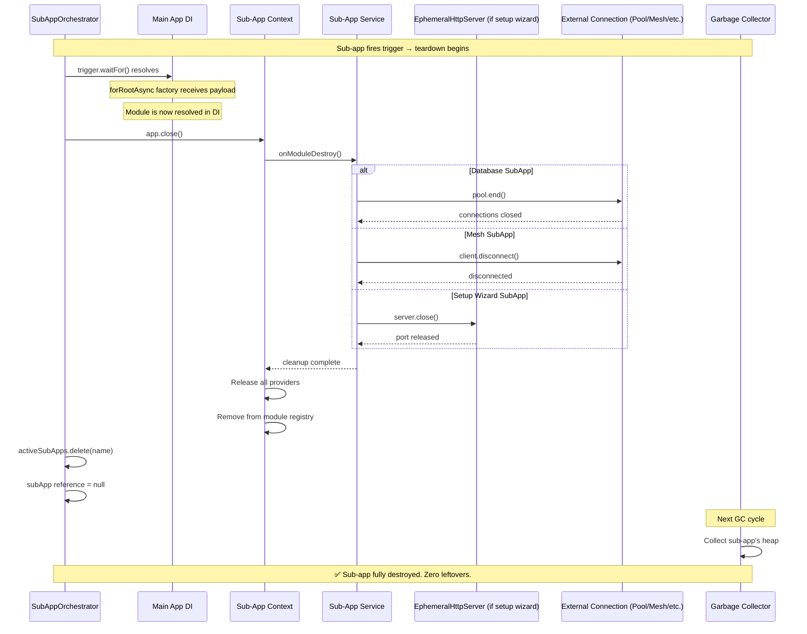

---

## 12. Reference: Module Catalog

### @Global() Modules (Resolved First)

| Module | Token | Dependencies | Resolves |
|--------|-------|-------------|----------|
| `EnvModule` | `EnvService` | None | Env vars, ConfigService |
| `DatabaseModule` | — | None (facade) | LocalModule + GlobalModule |
| `TriggersModule` | `TriggerRegistry` | None | All Trigger<T> instances |
| `SubAppContextModule.forRoot()` | `SUB_APP_CONTEXT` | Varies | Trigger for this sub-app |

### Core forRootAsync Chain (Sequential via Imports)

| Module | Imports | Factory Awaits | Provides |
|--------|---------|---------------|----------|
| `ConfigModule.forRootAsync()` | `TriggersModule` | `triggers.config.waitFor()` | EnvService, ConfigService |
| `DatabaseModule.forRootAsync()` | `ConfigModule` | `triggers.database.waitFor()` | Pool, Drizzle, GlobalDbService |
| `AuthModule.forRootAsync()` | `DatabaseModule` | `triggers.auth.waitFor()` | BetterAuth, AuthCoreService |
| `MeshModule.forRootAsync()` | `AuthModule` | `triggers.mesh.waitFor()` | MeshClient, NodeId |
| `EventsModule.forRootAsync()` | `MeshModule` | `triggers.events.waitFor()` | EventBus |
| `DockerModule.forRootAsync()` | `MeshModule` | `triggers.docker.waitFor()` | Dockerode |

### Feature Modules (Resolve After Core)

| Module | Imports | Depends On |
|--------|---------|------------|
| `ORPCModule.forRootAsync()` | `AuthModule`, `DatabaseModule` | Auth + Database |
| `DockerModule` (feature) | `DockerModule.forRootAsync()`, `DatabaseModule` | Docker + Database |
| `DeploymentModule` | `DatabaseModule`, `AuthModule`, `MeshModule` | DB + Auth + Mesh |
| `FleetModule` | `DatabaseModule`, `AuthModule`, `MeshModule` | DB + Auth + Mesh |
| `UserModule` | `DatabaseModule`, `AuthModule` | DB + Auth |
| Others... | Various | Various |

### Sub-App Definitions

| Sub-App | Module | Depends On | Timeout | Creates | Fires Trigger |
|---------|--------|------------|---------|---------|---------------|
| Config | `ConfigSubAppModule` | — | 5s | EnvService | `config` |
| Database | `DatabaseSubAppModule` | config | 60s | Pool, Drizzle | `database` |
| Auth | `AuthSubAppModule` | config, database | 30s | BetterAuth | `auth` |
| Mesh | `MeshSubAppModule` | config, database, auth | 30s | MeshClient | `mesh` |
| Events | `EventsSubAppModule` | mesh | 10s | EventBus | `events` |
| Docker | `DockerSubAppModule` | mesh | 10s | Dockerode | `docker` |
| Setup Wizard | `SetupWizardSubAppModule` | config | 300s | EphemeralHttpServer | `setupWizard` |

---

## Summary: The DI Graph IS the Orchestrator

The entire startup architecture can be summarized in one statement:

> **NestJS's `imports` chain IS the dependency graph. NestJS's provider barrier mechanism IS the execution engine. `forRootAsync` factories ARE the startup phases. Triggers ARE the communication bridge between sub-app contexts. There is no separate orchestrator.**

```text
imports chain        →  declares "what must be ready first"
forRootAsync         →  wraps each startup phase as a NestJS module
useFactory inject    →  declares provider-level dependencies (barrier)
@Global()            →  ensures certain modules resolve first
Trigger<T>           →  bridges sub-app output to main app module input
SubApp               →  isolates each startup phase in its own DI container
OnModuleDestroy      →  ensures zero leftover providers
```

**The NestJS DI engine was already a perfect orchestrator. We just needed to use it correctly.**
