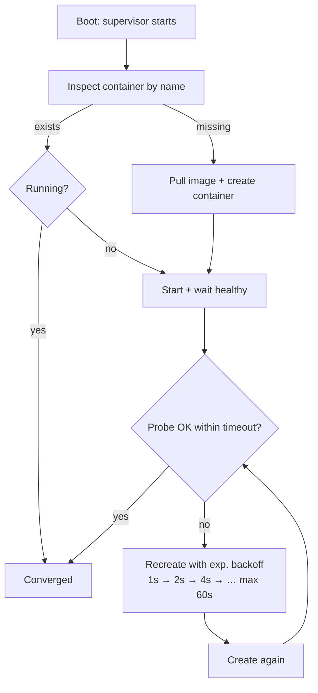
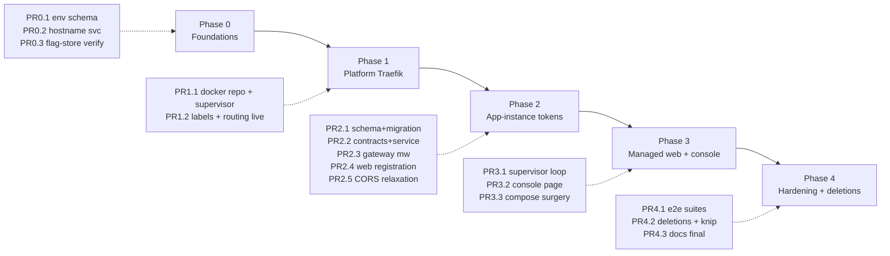

<DocMeta source="apps/doc/content/docs/deployment/api-centric-implementation-blueprint.mdx" scope="canonical" />

<DocCallout title="Companion to the concept doc" tone="info">
This page turns [API-Centric Deployment Architecture](/docs/deployment/api-centric-deployment-architecture) into an implementable engineering plan. The concept doc owns *what and why*; this blueprint owns *where and how*, grounded in the actual repository layout. Every original requirement is traceable in the [traceability matrix](#requirement-traceability).
</DocCallout>

<DocCallout title="Implementation status" tone="success">
Landed and verified: supervisor framework (`core/modules/supervisors/` + `BaseDockerSupervisorService`), platform Traefik via the config-builder (file provider, self-network-attach), managed-web supervisor with flag-driven lifecycle + token provisioning shortcut, `/manage/web-app` console, `app_instances` schema + migration 0027, platform contracts + ORPC middlewares, web-side identity bootstrap + client plugin, BYO compose template, three-tier compose wiring (dev/prod-like compose-managed web, prod API-owned web), gateway CORS relaxation via `resolveCorsDecision`, **e2e suite for the BYO app-instance lifecycle (6/6 passing against a real API + Postgres)**, and the scripted real-docker gate `scripts/local-gate-api-centric.sh` covering prod-boot and side-by-side flows.

Architecture note: per-request identity verification lives in `AppInstancePlugin` — a server handler plugin mirroring `AuthPlugin` — because ORPC `context.request` is only the boot-time initial context; the plugin reads the real per-request headers via its root interceptor and populates `context.appInstance`.
</DocCallout>

## Table of contents

1. [Grounding — what we build on](#grounding--what-we-build-on)
2. [Naming and boundaries](#naming-and-boundaries)
3. [Workstream A — Env schema and hostname grammar](#workstream-a--env-schema-and-hostname-grammar)
4. [Workstream B — Platform ingress supervisor](#workstream-b--platform-ingress-supervisor)
5. [Workstream C — App-instance identity](#workstream-c--app-instance-identity)
6. [Workstream D — Managed web supervisor](#workstream-d--managed-web-supervisor)
7. [Workstream E — Compose, scripts, and web-side changes](#workstream-e--compose-scripts-and-web-side-changes)
8. [PR sequencing and validation gates](#pr-sequencing-and-validation-gates)
9. [Test matrix](#test-matrix)
10. [Risk register and failure modes](#risk-register-and-failure-modes)
11. [Requirement traceability](#requirement-traceability)

---

## Grounding — what we build on

The rewrite reuses machinery that already exists. Implementation must extend these, never duplicate them:

| Existing asset | Path | Reuse in this rewrite |
|---|---|---|
| Express gateway + CORS + health | `apps/api/src/main.ts` | App-token middleware slots into the same middleware chain; CORS policy replaced per Workstream C |
| Sub-app orchestrator | `apps/api/src/core/orchestrator/orchestrator.service.ts` | Platform supervisors join the bootstrap sequence as lifecycle participants |
| Postgres auto-provisioning via dockerode | `apps/api/src/core/modules/setup/services/local-initialization.service.ts` | The dockerode access pattern (client acquisition, pull/create/start, probe) is the template for both new supervisors |
| User-project Traefik domain | `apps/api/src/core/modules/traefik/` (config-builder, validation, sync services) | **Different concern** (see boundaries below). Potential later reuse of validation/middleware-library; not a dependency for Phase 1 |
| Contract aggregation | `packages/contracts/api/index.ts` (`oc.router`) | New `platform` contract group registered here |
| Contract modules convention | `packages/contracts/api/modules/<domain>/` | Home of the new app-instance contracts |
| Env schema (Zod, single SSOT) | `packages/utils/env/src/index.ts` | All new env vars declared here (`API_PORT`, `TRUSTED_ORIGINS`, `SETUP_AUTO` already live there) |
| Global platform config tables | `apps/api/src/config/drizzle/global/schema/app-config.ts` | Candidate store for the managed-web flag (verify key/value shape in Phase 0) |
| Drizzle schema + migrations flow | `apps/api/src/db/drizzle/schema/`, generate → review → migrate | New `app_instances` table follows this exact flow |
| Better Auth wiring + trustedOrigins | `apps/api/src/core/modules/auth/auth.module.ts`, `apps/api/src/auth.ts` | User-auth layer untouched; trustedOrigins cross-origin role removed |

---

## Naming and boundaries

**Platform ingress is not user Traefik.** The existing `core/modules/traefik/` manages Traefik *configuration artifacts for user-deployed projects* (static configs, routes, TLS per project). The new concern — supervising the API's **own ingress container** — is a distinct bounded context:

```text
core/modules/platform-ingress/        ← NEW (this rewrite)
  platform-ingress.module.ts
  services/
    traefik-supervisor.service.ts     ← ensure/reconcile/backoff for the container
    hostname.service.ts               ← hostname grammar SSOT (Workstream A)
    managed-web-supervisor.service.ts ← spawn/probe/teardown (Workstream D)
  repositories/
    docker-container.repository.ts    ← thin dockerode wrapper shared by supervisors
  controllers/
    management.controller.ts          ← /manage/web-app console endpoints
```

Rules enforced by this split:

- `platform-ingress/**` must not import from `modules/traefik/**` (and vice versa). Shared primitives (if any emerge, e.g. label constants) go to `core/modules/common/`.
- The existing traefik module keeps its name and scope untouched.
- Both supervisors depend on the same `DockerContainerRepository` — one place that knows how to acquire a dockerode client (reusing the setup module's connection approach).

### Supervisor framework (implemented)

The hierarchy is live code, not just design:

```text
core/modules/supervisors/
  base-supervisor.service.ts           ← BaseSupervisorService: state machine
                                         (idle/converging/converged/degraded),
                                         runWithBackoff, getHealth, auto-
                                         registration via property-injected
                                         orchestrator + onModuleInit
  supervisor-orchestrator.service.ts   ← global registry; drives boot-time
                                         convergence of ALL registered
                                         supervisors (isolated failures) and
                                         aggregates getHealthOfAll()
  supervisors.module.ts                ← @Global — orchestrator visible everywhere

core/modules/docker/services/
  base-docker-supervisor.service.ts    ← BaseDockerSupervisorService extends
                                         BaseSupervisorService: dockerode
                                         plumbing (inspectContainer null-safe,
                                         ensureNetwork race-safe, pullImage,
                                         createContainer from a declarative
                                         DockerSupervisorContainerSpec)
```

How the pieces connect:

1. **Auto-registration** — `BaseSupervisorService` declares `@Inject(SupervisorOrchestratorService)` and publishes itself in `onModuleInit()`. A supervisor added to *any* module appears in boot convergence and health output with **zero manual registry edits**. Direct construction (`new`, unit tests) leaves the injected property unset and skips registration harmlessly.
2. **Boot convergence** — `SupervisorOrchestratorService.onApplicationBootstrap` converges every registered supervisor in parallel; one degraded supervisor never blocks another.
3. **Health aggregation** — `HealthService.getDetailedHealth()` injects the orchestrator and appends `supervisors: SupervisorHealth[]` to the detailed-health contract (`packages/contracts/api/modules/health/detailed.ts`). Overall status degrades when the DB is unhealthy OR any supervisor is unhealthy.

Adding a new docker-backed supervisor is now three steps: extend `BaseDockerSupervisorService`, implement `buildContainerSpec()/reconcile()/probe()`, register it in a module's providers.

---

## Workstream A — Env schema and hostname grammar

### Env additions (`packages/utils/env/src/index.ts`)

Declared once, next to `API_PORT` / `TRUSTED_ORIGINS`, following the existing Zod patterns:

```ts
// packages/utils/env/src/index.ts — additions (sketch)
DEPLOYER_PREFIX: zod.string().trim().regex(/^[a-z0-9-]*$/, "lowercase alphanumerics and dashes only").default(""),
MANAGED_WEB_APP_EXTERNAL: zod.coerce.boolean().default(false),
MANAGED_WEB_APP_ENABLED: zod.coerce.boolean().default(true),   // seed value, DB wins after first boot
MANAGED_WEB_APP_IMAGE: zod.string().min(1).optional(),           // default: API's own release tag
DEPLOYER_TRAEFIK_IMAGE: zod.string().min(1).default("traefik:v3.3"),
```

Empty-string default for `DEPLOYER_PREFIX` encodes "no prefix segment" as the zero-value — no separate boolean, no sentinel like `"none"`.

### Hostname service (SSOT)

One function derives every self-referencing URL in the codebase. Nothing else may build these strings:

```ts
// apps/api/src/core/modules/platform-ingress/services/hostname.service.ts — sketch
export abstract class HostnameService {
  /** "acme" → "api.acme.deployer.localhost"; "" → "api.deployer.localhost" */
  abstract apiHostname(): string;
  /** Same grammar for the managed web app */
  abstract webHostname(): string;
  /** Full origin including scheme for non-loopback deployments */
  abstract apiOrigin(scheme?: "http" | "https"): string;
}
```

Consumers to migrate onto it during Phase 1–2: auth base URL derivation, managed-web env injection, management-page absolute links, e-mail/link builders if any hardcode hosts today.

Also required in this workstream: declare every new var in `turbo.json` `globalEnv` and mirror documented entries in `.env.example` + root `.env.example` (undeclared build-time vars are a known cache-poisoning anti-pattern in this repo).

---

## Workstream B — Platform ingress supervisor

### Container specification (dockerode)

The supervisor ensures exactly one Traefik container, idempotently, on every boot:

| Property | Value |
|---|---|
| Name | `deployer-platform-traefik` (+ `-<prefix>` when prefixed) |
| Image | `DEPLOYER_TRAEFIK_IMAGE` |
| Network | `deployer-platform` (created if absent; API joins it too) |
| Command | `--providers.docker=true --providers.docker.exposedbydefault=false --entrypoints.web.address=:80` |
| Mounts | `/var/run/docker.sock:/var/run/docker.sock:ro` |
| Labels | `deployer.platform.role=ingress` (ownership marker for cleanup) |
| Ports | `:80` published in dev; prod binding decided per concept doc open question #2 |
| Restart policy | `unless-stopped` |

### Reconciliation loop



Behavioral rules:

- Desired state is static ("always running") — no DB involvement for Traefik itself.
- Convergence failures beyond the backoff ceiling surface as degraded startup (API stays up, gateway reports ingress unhealthy on `/health` payload and console) rather than crash-looping the API — the API must remain reachable to fix its own infrastructure.
- Events emitted through the existing event bus (`core/modules/events`) so logs and future UI can follow reconciliation.

### Routing (implemented — builder-driven file provider)

Platform routes are generated through the **existing traefik config-builder** (`core/modules/traefik/config-builder`) — the single source of truth for Traefik config shapes. `PlatformRouteConfigService.buildDynamicYaml()` emits the dynamic config (`Host(<api hostname>)` router → Traefik `loadBalancer` service targeting the API inside the platform network), written to `<TRAEFIK_CONFIG_BASE_PATH>/platform[-<prefix>]/dynamic.yml`.

The supervisor then:

1. Ensures the platform network and attaches the API's own container to it idempotently (self-detected via `HOSTNAME` = container id; outside Docker it falls back to `host.docker.internal` addressing).
2. Writes the builder-generated YAML before creating Traefik.
3. Creates the Traefik container with `--providers.file.directory=/config --providers.file.watch=true` plus the docker provider for future label-based discovery, mounting the config dir read-only.

Adding a route later (e.g. the managed web app) is one `addRouter()/addService()` chain in the builder call — no label string concatenation anywhere.

---

## Workstream C — App-instance identity

This is the largest workstream. It replaces cross-origin CORS trust with possession-based trust.

### Data model

New Drizzle table colocated with the global schemas:

```ts
// apps/api/src/db/drizzle/schema/platform/app-instance.ts — sketch
export const appInstances = pgTable(
  "app_instances",
  {
    id: uuid("id").primaryKey().defaultRandom(),
    label: text("label").notNull(),
    kind: text("kind", { enum: ["managed", "external"] }).notNull(),
    tokenHash: text("token_hash").notNull().unique(), // sha256(token) — raw token NEVER stored
    status: text("status", { enum: ["active", "stale", "revoked"] }).notNull().default("active"),
    createdByUserId: uuid("created_by_user_id"),
    lastSeenAt: timestamp("last_seen_at", { withTimezone: true }).notNull().defaultNow(),
    createdAt: timestamp("created_at", { withTimezone: true }).notNull().defaultNow(),
    updatedAt: timestamp("updated_at", { withTimezone: true }).notNull().defaultNow(),
  },
  (t) => [index("app_instances_status_idx").on(t.status)],
);
```

Migration via the standard generate → review → migrate flow. No changes to auth/user tables.

### Token format and lifecycle

| Aspect | Decision |
|---|---|
| Format | Opaque random 32 bytes, base64url (`crypto.randomBytes`) — no JWT, no claims to leak or validate client-side |
| Transport | `X-App-Instance-Token` request header; returned once at registration |
| Storage (server) | SHA-256 hash only, unique index for O(1) lookup |
| Storage (web side) | Server-side runtime file on a container volume (`/app/.deployer/app-instance-token`), chmod 600; regenerated automatically if invalid |
| Renewal | Heartbeat every 10 min bumps `lastSeenAt`; no token rotation initially (rotation = issue new + revoke old, deferred until needed — YAGNI) |
| Staleness | `active` → `stale` after 30 min without heartbeat; `stale` → auto-`revoked` after 7 days |
| Revocation | Gateway deny-check against status; revocation is immediate (cache invalidated on write) |

### Contracts (`packages/contracts/api/modules/platform/`)

Four operations registered under a new `platform` key in `packages/contracts/api/index.ts`, each following the `standard.zod(...)` builder convention with `.errors(...)` attached:

```ts
// register-app-instance.contract.ts — sketch (full shapes finalized in PR)
const registerOutputSchema = z.object({
  instanceId: z.string().min(1),
  appToken: z.string().min(1),
  heartbeatIntervalMs: z.number().int().positive(),
})
// input: email, password, instanceLabel — verified against Better Auth credentials
// errors: UNAUTHORIZED (bad credentials), TOO_MANY_REQUESTS (rate limit)

// heartbeat.contract.ts — input: none beyond header; output: renewUntil timestamp
//   errors: UNAUTHORIZED (unknown/revoked token)

// list-app-instances.contract.ts — admin-only; output: instances[] sans secrets
// revoke-app-instance.contract.ts — admin-only; idempotent by instanceId
```

Registration rate-limiting: per-source-IP sliding window (e.g. 5/hour) plus per-account lockout reuse from existing auth throttling where available.

### Gateway middleware wiring (`apps/api/src/main.ts`)

Order inside the existing Express chain becomes:

```text
1. app-instance check      (new — resolves token hash → instance, caches by hash prefix)
2. CORS                    (existing middleware, relaxed — see below)
3. /health                 (existing)
4. NestJS OrchestrationModule (existing)
```

CORS relaxation, precisely scoped (implemented): `resolveCorsDecision()` in `core/utils/cors.utils.ts` encodes the priority matrix — same-origin requests get no CORS headers; allowlisted origins (plus dev localhost variants) keep full credentialed reflection; **untrusted origins carrying cookies are hard-blocked** (ambient/stolen cookies can never read cross-origin responses); cookie-free token-path requests from any origin are reflected WITHOUT the credentials flag — that is what makes BYO web apps work with zero server-side configuration. Preflights statically advertise `X-App-Instance-Token` alongside `Authorization`/`Content-Type`/`Cookie`. The decision matrix is unit-tested in `cors.utils.spec.ts`; the old inline logic in `main.ts` was replaced by this function. Final deletion of the allowlist itself stays deferred until all cookie flows move header-only.

Verification middleware behavior:

- Unknown/revoked token on a protected route → `401` ORPC error before any NestJS routing cost.
- Valid token → instance identity attached to the request context (request-id correlation already exists).
- Route classes (public / app-surface / protected) are declared via existing ORPC auth middleware composition (`createAuthMiddleware` + `requireAuth`), extended with an `requireAppInstance()` sibling in `core/modules/auth/orpc/middlewares.ts`.

### Web-side changes (`apps/web`)

| Concern | Change |
|---|---|
| Boot registration | Server-only module runs once per server start: read persisted token → heartbeat probe → if missing/invalid, `POST register-app-instance` (managed mode receives provisioned token via env instead — no credentials shipped) → persist |
| Client headers | ORPC client (`apps/web/src/lib/orpc.ts`) attaches `X-App-Instance-Token` server-side; browser-originating calls pass through the Next.js server proxy so the token never reaches the browser bundle |
| User token | Unchanged Better Auth session handling, layered alongside |
| BYO entrypoint | Documented env contract (`API_URL`, `NEXT_PUBLIC_API_URL`, `DEPLOYER_INSTANCE_LABEL`) validated at startup with actionable error messages |

Managed-mode provisioning shortcut: when the API spawns the web container it creates the `app_instances` row itself and injects the raw token as an env var of that container only — the web side skips credential registration but still heartbeats.

---

## Workstream D — Managed web supervisor

### Flag storage

`managed_web_app.enabled` lives in the existing app-config global store (`config/drizzle/global/schema/app-config.ts`). Phase 0 includes a 15-minute verification task: confirm the store supports typed boolean keys; if not, add a typed column rather than inventing a parallel KV table. `MANAGED_WEB_APP_ENABLED` seeds it on first boot only.

### Container specification

| Property | Value |
|---|---|
| Name | `deployer-managed-web` (+ prefix suffix) |
| Image | `MANAGED_WEB_APP_IMAGE` or the API's release tag |
| Network | `deployer-platform` |
| Env | `NODE_ENV=production`, internal `API_URL`, public hostnames from `HostnameService`, provisioned `APP_INSTANCE_TOKEN` (managed shortcut) |
| Labels | Traefik router for `webHostname()` + `deployer.platform.role=managed-web` |
| Health | HTTP probe on the web listen port; supervisor marks Healthy only after registration+heartbeat observed |

State machine, events, and backoff mirror Workstream B's loop — extracted as a shared `SupervisorLoop` helper parameterized by desired-state reader and probe, so both supervisors share one tested convergence implementation (DRY; two implementations of the same loop would violate three-strikes immediately).

### Management console (`/manage/web-app`)

Plain Express handler chain in `management.controller.ts` — server-rendered static HTML template, zero React/build-step:

- `GET /manage/web-app` — status page (flag state, reconciler status, recent events). Returns `404` when `MANAGED_WEB_APP_EXTERNAL=true`.
- `POST /manage/web-app/toggle` — flips the flag; reconciler converges asynchronously.
- `POST /manage/web-app/restart` — force recycle of the managed container.
- Auth: operator session/bearer via existing auth guards; first-boot experience follows concept doc open question #4.

---

## Workstream E — Compose, scripts, and web-side changes

### Tier wiring (implemented)

| Tier | Web ownership | API env | Stack contents |
|---|---|---|---|
| **dev** (`docker-compose.dev.yml`) | Compose (`web-dev`) | `MANAGED_WEB_APP_EXTERNAL=true` (default), flag seeded `false` | api + web + doc + lb |
| **prod-like** (`docker-compose.prod-like.yml`) | Compose (`web-prod`) | `MANAGED_WEB_APP_EXTERNAL=true`, flag seeded `false` | api + db + web + doc + lb (prod images) |
| **prod** (`docker-compose.prod.yml`) | **The API itself** | `MANAGED_WEB_APP_EXTERNAL=false`, `MANAGED_WEB_APP_ENABLED=true` (default), `MANAGED_WEB_APP_IMAGE` | api + doc + lb — **no web service** |
| **BYO** (`web/docker-compose.web.byo.yml`) | The consumer | registration credentials or pre-held token; token volume | web only |

Details landed with this workstream:

- Both compose-managed webs carry app-instance identity passthroughs (`DEPLOYER_INSTANCE_LABEL/EMAIL/PASSWORD`, `APP_INSTANCE_TOKEN_PATH=/app/.deployer/...`) and persist their token in a dedicated volume — they register against the API at boot like any BYO instance.
- Prod operators build the managed-web image once (`docker build -f docker/builder/web/Dockerfile.web.runtime.prod -t deployer-web:latest .`) or point `MANAGED_WEB_APP_IMAGE` at a registry tag.
- Pre-existing prod-stack parse failure fixed while landing this: doc/lb port vars now default (`3020` / `8080`).
- All three orchestrators + BYO template validate via `docker compose config`.

### Deletions

| Artifact | Status |
|---|---|
| `docker-compose.web.prod.yml` + its include line + `depends_on` coupling | Deleted (replaced by BYO template + managed supervisor) |
| Cross-origin `TRUSTED_ORIGINS` enforcement in `main.ts` / `cors.utils` | Pending Phase 4 (after e2e flows) |
| Dev workflow docs referencing compose-started web in prod | Updated alongside doc pages |

---

## PR sequencing and validation gates

Same four phases as the concept doc's migration plan, expanded into concrete PR-sized units:



Every PR gate, without exception: `bun --bun run api -- type-check` + `bun --bun run web -- type-check` clean, targeted Vitest green, affected manual smoke executed, conventional commit per area. Zero tolerance for new `as unknown as`, `@ts-ignore`, or defensive fallbacks masking contract bugs.

---

## Test matrix

| Component | Unit | E2E |
|---|---|---|
| HostnameService | prefix empty/present/special-char rejection; grammar snapshots | — |
| SupervisorLoop (shared) | fake-clock backoff; converge-on-missing; degraded ceiling | — |
| Traefik supervisor | inspect/create/start branching vs mocked repo | real-docker smoke: boot API → container up → hostname routes (manual gate) |
| Registration contract | bad creds 401, rate-limit 429, success shape parse | BYO web against running API registers and heartbeats |
| Token middleware | revoked/stale/valid matrix; cache invalidation on revoke | revoked instance blocked mid-session |
| Managed-web supervisor | flag flip converges create/remove; probe-fail backoff | toggle off → container gone → toggle on → healthy |
| Console page | hidden under EXTERNAL flag; auth required | operator toggles flag from page |
| CORS relaxation | preflight allows dual-header; wildcard reflection non-cookie | consumer-origin dashboard performs full login+data flow |

E2E suites join the existing shared-postgres harness (`apps/api/vitest.shared-postgres.e2e.ts`); real-docker checks stay out of CI and run as scripted local gates.

---

## Risk register and failure modes

| Risk | Mitigation |
|---|---|
| Traefik never converges (socket perms, image pull fail) | Degraded-mode startup: API stays reachable by port; `/health` reports ingress status; console shows reconciliation events |
| Flag flipped while container operation in-flight | Single-flight guard per supervisor (mutex on reconcile); desired-state re-read after each action wins |
| Token leaked from browser bundle | Token never leaves server side; proxy-only exposure; penetration checklist item in Phase 4 |
| Registration endpoint abuse | IP sliding-window + account lockout + alert on failure spikes |
| Web image drifts from API release | Default tag = API release; explicit pin requires conscious override; compatibility note in console when versions mismatch |
| Docker socket sprawl | Only API (rw) and platform Traefik (ro) mount the socket; managed web gets none |
| Migration ordering (table before contracts ship) | Schema PR precedes contract PR within Phase 2; both behind same merge train |

---

## Requirement traceability

Guarantee that nothing from the original brief was lost. Each numbered requirement maps to concept coverage and its implementing workstream/phase:

| # | Original requirement | Concept section | Blueprint location |
|---|---|---|---|
| R1 | API runs self-contained with its own services | Design principles; Component ownership | Naming/boundaries; Workstreams B+D |
| R2 | API starts its own Traefik container at boot | Platform Traefik | Workstream B |
| R3 | Web app never runs from docker compose | What gets deleted | Workstream E (compose surgery) |
| R4 | Prod = only API container starts; API handles dependencies | Before/after; Flows per environment | Workstreams B+D; PR sequencing |
| R5 | API starts web app only when managed flag enabled | The managed web app | Workstream D |
| R6 | Flag controlled by a page served directly by the API | Management console page | Workstream D (console endpoints) |
| R7 | Dev passes env var for externally-running web; toggle page then hidden | The managed web app (dev side-by-side) | `MANAGED_WEB_APP_EXTERNAL` in Workstream A; gating in Workstream D |
| R8 | Consumer hosts web anywhere pointing at any API | Externally-managed web apps | Workstream C (registration); Workstream E (BYO template) |
| R9 | Static CORS cannot serve unknown origins | Identity redesign rationale | Workstream C (middleware + relaxation/deletion) |
| R10 | Web app obtains a token for ITSELF (not the user) via account login at boot | Registration handshake | Workstream C (contracts, token lifecycle, managed shortcut) |
| R11 | Requests carry app token AND user auth token when logged in | Dual-token request flow | Workstream C (middleware order, web proxy headers) |
| R12 | Traefik forwards via `api.<prefix>deployer.localhost`; prefix from env; empty prefix = no segment | Hostname scheme | Workstream A (env + HostnameService); Workstream B (labels) |

Any future scope discussion on this rewrite should reference row IDs (R1–R12) to keep the brief atomic.

---

## Related documentation

- [API-Centric Deployment Architecture](/docs/deployment/api-centric-deployment-architecture) — the concept: motivation, flows, security analysis, open questions.
- [Startup Architecture (Current)](/docs/dev/startup-architecture) — bootstrap pipeline the supervisors integrate with.
- [ORPC Workflow](/docs/dev/orpc) and [ORPC Auth Patterns](/docs/dev/orpc-auth-patterns) — contract/middleware conventions referenced throughout.
