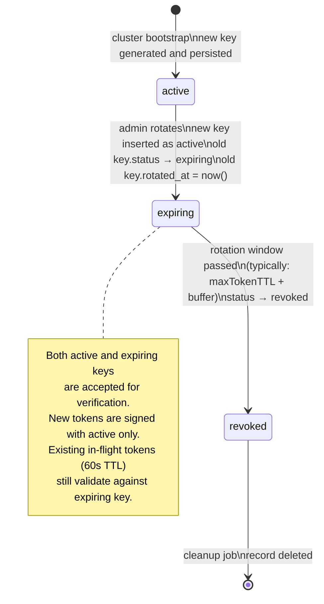
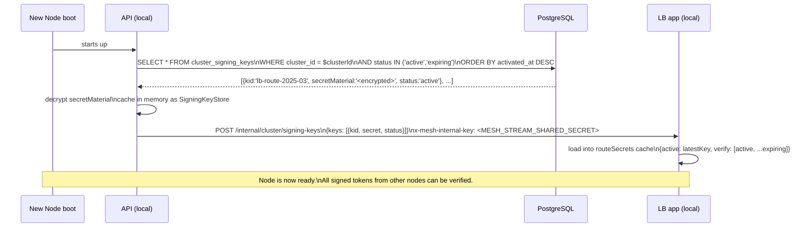
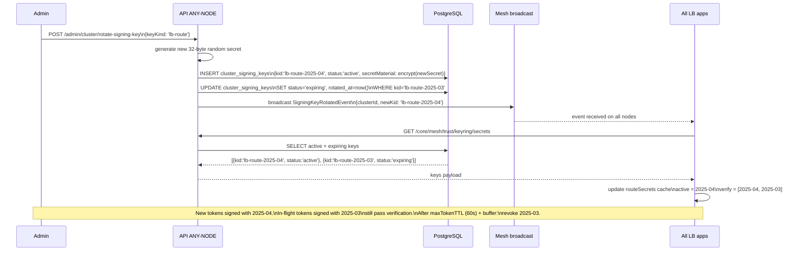

## The problem with environment-only secrets

In a multi-node cluster, every node must share the same signing secrets for:
- Forward tokens (`LB_ROUTE_SECRET`) — a token signed by NODE-A must be verifiable by NODE-B
- Mesh internal keys (`MESH_STREAM_SHARED_SECRET`) — inter-node API calls
- Diagnostic access keys (`LB_DIAGNOSTIC_SECRET`) — analytics gate

If secrets only live in `.env` files, adding a new node requires manually copying secrets and redeploying. Rotating a secret means updating every node's env file and restarting all services.

**Solution**: secrets are the authoritative source in the `cluster_signing_keys` table in the shared PostgreSQL. Environment variables serve as **cold-start fallback only**.

---

## `cluster_signing_keys` table

```sql
create table cluster_signing_keys (
  id               uuid primary key default gen_random_uuid(),
  cluster_id       uuid not null,
  kid              text not null unique,          -- key identifier, e.g. "lb-route-2025-03"
  algorithm        text not null default 'HS256', -- HS256, HS512, RS256, etc.
  status           text not null default 'active',-- active | expiring | revoked
  secret_material  text not null,                -- encrypted at rest (encryptedText column type)
  public_jwk       jsonb,                         -- for asymmetric keys only
  activated_at     timestamptz not null,
  expires_at       timestamptz,                   -- null = no expiry
  rotated_at       timestamptz,
  revoked_at       timestamptz,
  created_at       timestamptz not null,
  updated_at       timestamptz not null
);
```

Each signing key has a **`kid` (key ID)** so tokens can embed which key was used to sign them. The verifying node fetches the correct key by `kid` instead of trying all active keys.

---

## Key lifecycle



---

## How each node gets the secret



---

## Key rotation — zero downtime



---

## Encryption at rest

The `secret_material` column uses the `encryptedText` custom Drizzle column type. This encrypts the raw secret bytes using a per-cluster `DATABASE_ENCRYPTION_KEY` (a node-local env var that is **never stored in the DB itself**).

```
Database stores:  encrypt(rawSecret, DATABASE_ENCRYPTION_KEY)
API decrypts to:  rawSecret  (in memory only, never logged)
LB receives:      rawSecret  (over internal mesh call, encrypted in transit via TLS)
```

This means even if the database is compromised, the raw secrets are not directly readable without the encryption key.

---

## Secret kinds

| `kid` prefix | Used for | Signing algorithm |
|---|---|---|
| `lb-route-*` | Forward tokens, route hint tokens | HS256 |
| `lb-diag-*` | Diagnostic / analytics access key | HS256 |
| `mesh-stream-*` | Internal mesh-to-mesh HTTP call authentication | HS256 |
| `cluster-join-*` | Cluster join grant tokens | HS256 |

---

## Environment variable fallback

On first boot (before any DB connection is available — e.g. during the setup wizard), nodes fall back to environment variables:

| Env var | Fallback for |
|---|---|
| `LB_FORWARD_TOKEN_SECRET` | `lb-route-*` active key (canonical — preferred) |
| `LB_FORWARD_TOKEN_SECRET_PREVIOUS` | `lb-route-*` expiring keys (canonical — preferred) |
| `LB_ROUTE_SECRET` | `lb-route-*` active key (legacy alias — still accepted) |
| `LB_ROUTE_SECRET_PREVIOUS` | `lb-route-*` expiring keys (legacy alias — still accepted) |
| `LB_DIAGNOSTIC_SECRET` | `lb-diag-*` active key |
| `MESH_STREAM_SHARED_SECRET` | `mesh-stream-*` active key |

Once the DB is connected and keys are synced, the in-memory cache takes over. The env vars remain as emergency fallback only.

---

## Related documentation

- [Instance Ports](./instance-ports.mdx) — Traefik ingress conventions
- [Fleet Federation Handshake Protocol](./fleet-federation-handshake-protocol.mdx) — cluster join grants
- [Database Lifecycle](../dev/database-lifecycle.mdx) — Drizzle migrations, schema management
