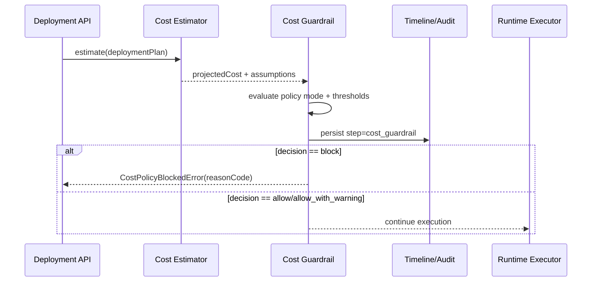

<DocMeta source="advanced feature proposal (T223)" scope="canonical" />

## Goal

Prevent avoidable budget overruns by evaluating deployment cost impact **before** rollout.

Policy modes:

- `off`
- `warn`
- `enforce`

In `warn`, deployment proceeds with visible evidence. In `enforce`, deployment is blocked on policy violation.

---

## Why this feature exists

The platform already has:

- org/service resource metadata,
- deployment preflight checkpoints,
- structured timeline/audit events.

What is missing is a first-class FinOps safety gate to answer:

- *Will this deployment likely exceed org/project budget constraints?*
- *If yes, should it warn or block based on environment and policy?*

---

## Scope (v1)

### In scope

- Preflight cost estimate for deployment candidates (CPU, RAM, replicas, storage class, runtime duration class)
- Policy hierarchy (global/org/project/service/environment override)
- Tier-aware enforcement (`production` default = `enforce`, lower tiers = `warn`)
- Deterministic violation taxonomy + timeline evidence
- Monthly budget and per-project spending cap policies

### Out of scope (v1)

- Real cloud billing reconciliation adapters
- Spot/market price forecasting
- Multi-currency tax handling
- Cross-provider reserved-capacity optimization

---

## Policy model

```ts
type CostGuardrailMode = "off" | "warn" | "enforce";

type CostGuardrailPolicy = {
  mode: CostGuardrailMode;
  protectedEnvironments: string[]; // e.g. ["production"]
  monthlyOrgBudgetUsd?: number;
  projectBudgetUsd?: number;
  maxDeploymentDeltaUsd?: number;  // per deployment threshold
  softHeadroomPercent?: number;     // warn before budget is hit
};
```

Given projected cost $C_{proj}$ and remaining budget $B_{rem}$:

$$
violation =
\begin{cases}
true & C_{proj} > B_{rem} \\
true & (B_{rem} - C_{proj}) / B_{rem} < headroom \\
false & otherwise
\end{cases}
$$

Decision follows the same mode semantics used by Trust Gate.

---

## Runtime flow



---

## Violation taxonomy

- `cost_budget_exceeded_org`
- `cost_budget_exceeded_project`
- `cost_delta_exceeded`
- `cost_headroom_below_threshold`
- `cost_estimator_unavailable`
- `cost_policy_invalid`

Each event should include:

- `projectedCostUsd`
- `remainingBudgetUsd`
- `reasonCode`
- `mode`
- assumptions hash / version

---

## Observability requirements

Counters:

- `cost_guardrail.evaluated`
- `cost_guardrail.warned`
- `cost_guardrail.blocked`
- `cost_guardrail.allowed`
- `cost_guardrail.error`

Dimensions:

- `organizationId`, `projectId`, `environment`, `reasonCode`, `policyMode`.

---

## Rollout strategy

1. **Observe** — `warn` in all tiers
2. **Selective enforce** — `enforce` in production for opt-in orgs
3. **Default enforce** — production default with break-glass override + audit entry

---

## Test strategy

### Unit

- estimator assumptions snapshot stability
- policy precedence and threshold behavior
- reason-code mapping

### Integration

- preflight invokes cost guardrail before runtime apply
- blocked path halts deployment and writes timeline evidence
- warn path writes visible warning and continues

### E2E

- over-budget deploy blocked in enforce mode
- same deploy allowed with warning in warn mode
- non-protected environment remains non-blocking when configured

---

## Definition of done

- Cost preflight evaluates every protected deployment
- warn/enforce behavior is deterministic and auditable
- reason-code taxonomy is queryable in logs/timeline
- tests cover allow/warn/block/error paths
- migration tasks `T223` and `T225` are complete

---

## Task mapping

- `T223` — Cost Guardrail Engine baseline
- `T225` — Trust/Cost policy e2e tests
- `T226` — Operator UI/status surfaces

---

## Related docs

- [Deployment Trust Gate](/docs/deployment/deployment-trust-gate)
- [Resilience GameDay Controller](/docs/deployment/resilience-gameday-controller)
- [Migration Task Breakdown](/docs/deployment/migration-task-breakdown)
- [Registry, Monitoring & Advanced Features — Documentation Coverage](/docs/deployment/registry-monitoring-advanced-doc-coverage)
