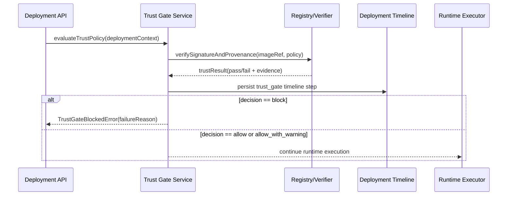

<DocMeta source="advanced feature proposal (T222)" scope="canonical" />

## Goal

Block unsafe image rollouts in protected environments by validating **artifact trust signals** before runtime apply.

The trust gate executes during deployment preflight and decides whether rollout proceeds based on configurable policy mode:

- `off` (no enforcement)
- `warn` (allow deploy, emit warning evidence)
- `enforce` (block deploy on trust policy failure)

---

## Why this feature exists

The platform already supports:

- registry-backed runtime deployment,
- structured deployment timelines,
- policy-driven rollout controls.

The missing piece is a first-class trust checkpoint so operators can answer:

- *Was this image signed by an allowed identity?*
- *Did this build come from a valid provenance source?*
- *Should production rollout be blocked if trust checks fail?*

---

## Scope (v1 of Trust Gate)

### In scope

- Protected-environment preflight trust evaluation (`production` default)
- Policy modes (`off`, `warn`, `enforce`)
- Typed trust-result payload persisted in deployment timeline
- Deterministic failure reason taxonomy for operator debugging
- Optional allowlist by signer identity / repository path

### Out of scope (first iteration)

- Multi-attestor quorum policies
- External policy engines (OPA/CEL) as hard dependencies
- Full attestations UI editor (API-first initially)
- Third-party compliance pack marketplace

---

## Policy model

### Trust policy object

```ts
type TrustGateMode = "off" | "warn" | "enforce";

type DeploymentTrustPolicy = {
  mode: TrustGateMode;
  protectedEnvironments: string[]; // e.g. ["production", "preprod"]
  allowedSigners?: string[];       // signer identities
  allowedRepositories?: string[];  // image repo prefixes
  requireProvenance?: boolean;
  maxProvenanceAgeHours?: number;
};
```

### Decision semantics

Given trust check outcome $R$ and policy mode $M$:

$$
decision =
\begin{cases}
allow & M = off \\
allow\_with\_warning & M = warn \land R = fail \\
allow & M = warn \land R = pass \\
block & M = enforce \land R = fail \\
allow & M = enforce \land R = pass
\end{cases}
$$

---

## Runtime execution flow



---

## Failure taxonomy (typed)

Use stable reason codes for operator UX, filtering, and alerting:

- `trust_signature_missing`
- `trust_signature_invalid`
- `trust_signer_not_allowed`
- `trust_provenance_missing`
- `trust_provenance_invalid`
- `trust_provenance_stale`
- `trust_repository_not_allowed`
- `trust_verifier_unavailable`

Each blocked deployment should include:

- reason code,
- short human-readable message,
- key evidence fields (signer, image digest, provenance ref, verifier status),
- correlation ID.

---

## Observability requirements

Minimum telemetry:

- `trust_gate.evaluated`
- `trust_gate.allowed`
- `trust_gate.warned`
- `trust_gate.blocked`
- `trust_gate.error`

Minimum dimensions:

- `environment`, `organizationId`, `projectId`, `serviceId`, `reasonCode`, `policyMode`.

---

## API and timeline contract expectations

### Timeline step

- `phase`: `deploying`
- `step`: `trust_gate`
- `level`: `info | warn | error`
- metadata:
  - `mode`,
  - `decision`,
  - `reasonCode?`,
  - `imageRef`,
  - `digest?`,
  - `signer?`.

### Operator queryability

Trust gate events must be filterable by:

- step = `trust_gate`
- decision (`allow`, `allow_with_warning`, `block`)
- reason code.

---

## Security and tenancy notes

- Policy resolution follows existing hierarchy (global/org/project/service/environment override rules).
- Trust policy reads/writes require elevated authorization (platform admin or org owner with policy grant).
- Evidence fields must avoid leaking sensitive verifier credentials.

---

## Rollout strategy

### Wave 1 — Observe

- `mode=warn` for protected environments
- collect reason-code distribution and false-positive rate

### Wave 2 — Enforce for selected services

- enable `enforce` for high-sensitivity services first
- run rollback drills for verifier-unavailable scenarios

### Wave 3 — Broader enforcement

- default `enforce` for production-tier environments
- keep explicit break-glass override with audit logging

---

## Test strategy

### Unit

- policy resolution precedence
- decision table correctness (`off/warn/enforce`)
- reason-code mapping

### Integration

- preflight trust check invoked before runtime apply
- blocked path writes timeline evidence and halts execution
- warn path continues and writes warning evidence

### E2E

- trusted image deploy succeeds in enforce mode
- untrusted image deploy blocked in enforce mode
- same untrusted image allowed in warn mode with visible warning artifacts

---

## Definition of done

Trust Gate v1 is done when:

- policy-driven trust preflight is active in deployment flow,
- block/warn decisions are deterministic and audited,
- reason-code taxonomy is stable and queryable,
- tests cover happy + warn + block paths,
- migration checklist tasks `T222` and `T225` are complete.

---

## Task mapping

- `T222` — Trust gate foundation
- `T225` — policy e2e tests
- `T226` — operator UI/status surfaces

---

## Related docs

- [Registry, Monitoring & Advanced Features — Documentation Coverage](/docs/deployment/registry-monitoring-advanced-doc-coverage)
- [Cost Guardrail Engine](/docs/deployment/cost-guardrail-engine)
- [Resilience GameDay Controller](/docs/deployment/resilience-gameday-controller)
- [Benchmark Feature Adaptation Matrix](/docs/deployment/benchmark-feature-adaptation-matrix)
- [Migration Task Breakdown](/docs/deployment/migration-task-breakdown)
- [Platform Feature Target](/docs/deployment/platform-feature-target)
- [Platform Product Specification](/docs/architecture/platform-product-spec)
