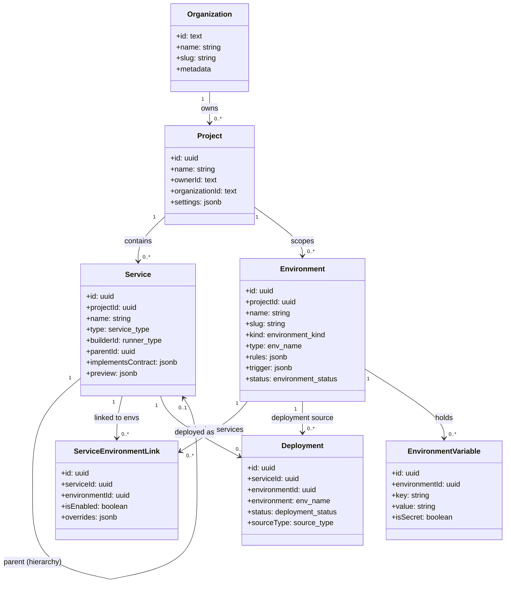
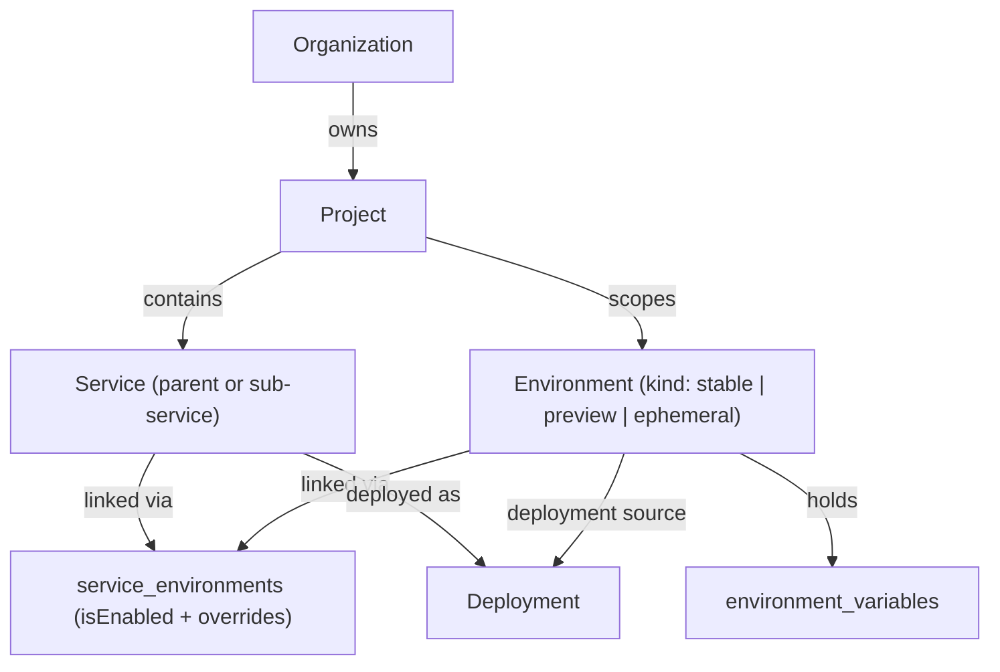
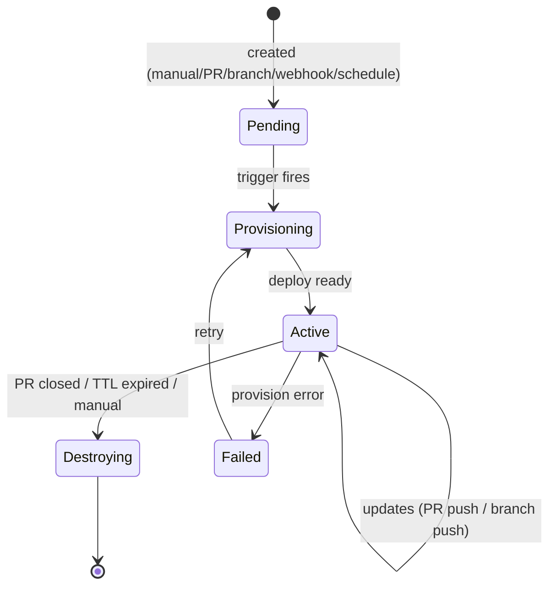

<DocCallout title="Model shift" tone="info">
Environments are NO LONGER built-in names on projects/services. They are
**first-class entities** (`environments` table) linked to a project, with a
**KIND** (stable | preview | ephemeral), **per-env rules**, and an optional
**TRIGGER** (how preview/ephemeral envs are brought to life). A deployment is
created FROM an environment, which belongs to a service, which belongs to a
project, which belongs to an organization.
</DocCallout>

## Complete UML class diagram



## The full containment chain



**Reading a deployment**: `Deployment.environmentId → Environment` (what rules
were active), `Deployment.serviceId → Service → Project → Organization`. The
legacy `Deployment.environment` string stays as a display snapshot.

## Environment kinds & triggers

| Kind | Behavior | Trigger |
|------|----------|---------|
| `stable` | Persistent, shared, long-lived (production, staging, dev, qa) | none (always exists) |
| `preview` | Ephemeral per-PR/branch; auto-created + auto-destroyed | `pull-request` / `branch` / `webhook` |
| `ephemeral` | Short-lived test env (manual or scheduled) | `manual` / `schedule` / `webhook` |



## Per-environment rules (each env has its own)

```ts
environmentRules = {
  profiles: string[],              // compose-profile style optional services
  autoDeployEnabled: boolean,
  deploymentStrategy: 'rolling'|'canary'|'blue-green'|'manual',
  healthGate: 'strict'|'warn'|'ignore',
  startupMode: 'before'|'parallel'|'after',
  replicas: { min, max },
  trafficPolicy: { maxErrorRatePercent, maxLatencyMs, allowCrossRegionFailover },
}
```

## Implementation plan

1. **DB migration 0021**: `projects.organization_id` FK, `deployments.environment_id` FK.
2. **Contracts**: env entity already has `kind`/`rules`/`trigger`; add `organizationId` to project.
3. **API**: env CRUD (create any env with kind+trigger), service×env link CRUD.
4. **Seed**: built-in envs per project (production=stable, staging=stable, preview=preview+PR trigger, development=stable) + links to each service.
