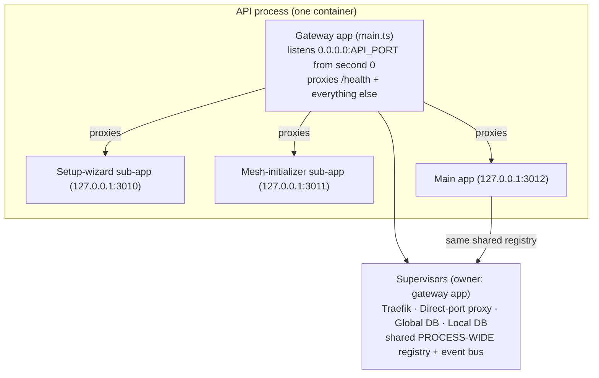
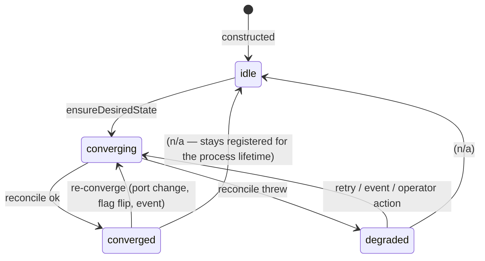

<DocMeta source="apps/doc/content/docs/deployment/onboarding-and-lifecycle.mdx" scope="canonical" />

<DocCallout title="Status: current behavior" tone="success">
This document describes the CURRENT runtime behavior of the API-centric deployment (gateway + sub-app pipeline, gateway-owned supervisors, Traefik-first ingress with failover proxy). It answers the three operational questions: **how does a fresh user get in, what happens on restart, and what are ALL the states in between**.
</DocCallout>

## Table of contents

1. [Mental model](#mental-model)
2. [The master access matrix](#the-master-access-matrix)
3. [How the user gets in — onboarding flow](#how-the-user-gets-in--onboarding-flow)
4. [Supervisor state machine](#supervisor-state-machine)
5. [Ingress state matrix (Traefik × proxy)](#ingress-state-matrix-traefik--proxy)
6. [Restart matrix](#restart-matrix)
7. [Failure matrix & recovery playbook](#failure-matrix--recovery-playbook)
8. [Health surface](#health-surface)

---

## Mental model

One process, three app layers, one shared supervisor registry:



- **The gateway is the only external HTTP surface.** It listens on `0.0.0.0:API_PORT` from the first second (Docker healthchecks pass immediately). Every sub-app binds **loopback** and is proxied by the gateway via longest-prefix-match on the route registry.
- **The supervisors are owned by the gateway app** and boot at process start — **before, during and after setup**. This is deliberate: no service port is published (all port bindings were removed from compose), so the ingress (Traefik) and the failover proxy ARE the way into the platform.
- **One shared registry/event bus per process** (`supervisor-shared.ts`): the gateway RUNS the supervisors, the main sub-app imports only the framework module, and its `/health/detailed` aggregation sees the same registry without a second copy (a duplicated Traefik would race on the same container name).

At the end of the pipeline the gateway fallback points at the **main app**, at which point `/` and every API route are served.

---

## The master access matrix

> **How to reach the platform** for every combination of **setup phase** × **ingress state**. The URLs are the same in dev and prod; `{prefix}` is `DEPLOYER_PREFIX` (empty → no segment).

| Setup phase | Traefik converged (entry port 80) | Traefik failed (proxy active) |
|---|---|---|
| **Fresh boot — wizard open** (no DB yet) | `http://api.{prefix}deployer.localhost` — gateway health + setup ORPC endpoints | `http://localhost:{API_PORT}` — same, via the failover proxy |
| | `http://web.{prefix}deployer.localhost` — the web app shows the **onboarding UI** (its setup gate calls `setup.getState` → `needsSetup`) | `http://localhost:{DIRECT_PROXY_WEB_HOST_PORT}` (default 3000) — the onboarding UI via the proxy's web forward |
| **Setup in progress** (background provisioning) | Same two URLs; the web app renders the live **progress stream** (SSE `setup.getInitializeStream`) | Same two URLs; the proxy keeps forwarding while the flow runs |
| **Setup complete** | `http://api.{prefix}deployer.localhost` → API (auth + ORPC) | (transient) `http://localhost:{API_PORT}` → API |
| | `http://web.{prefix}deployer.localhost` → the real web dashboard | `http://localhost:3000` → the real web dashboard |
| **Setup complete + re-provisioned** (DB wiped) | The web's setup gate re-opens the onboarding UI automatically — the operator completes it again; the wizard stops at the running state until `setup_done` |

**The rule of thumb:** the **web app is always where the human lands**. `web.{prefix}deployer.localhost` (or `localhost:3000` in proxy mode) serves the web app in every phase; the web app itself decides whether to show onboarding or the dashboard (its setup gate). `api.{prefix}deployer.localhost` is the machine surface (health + ORPC + `openapi.json` / `reference` from the main app).

---

## How the user gets in — onboarding flow

### Step 0 — boot pipeline (what happens before the UI)

1. **Gateway up** (`0.0.0.0:API_PORT`) — health checks answer `200` immediately.
2. **`OrchestratorService.onApplicationBootstrap`** runs the pipeline:
   - **DB resolver** (`SetupDevService`):
     - `SETUP_AUTO=true` **with** `SETUP_AUTO_DATABASE_URL` (or legacy `SETUP_DATABASE_URL`) → the URL is **probed**; unreachable → **boot FAILS hard** (no retry, no local-only fallback — the global DB is mandatory even in dev). Reachable → persisted to local SQLite `node_config`.
     - `SETUP_AUTO=true` **without** a URL → persists nothing; the wizard **auto-provisions** (its local strategy spins up the Postgres container).
     - `SETUP_AUTO` off → persists nothing; the wizard handles configuration manually.
   - **Stale-config guard**: `setup_done` + empty URL is an invalid state → reset to `not_started` so the wizard can re-run.
   - **If a DB URL exists in `node_config`** → heal-or-verify → migrations (idempotent, no-op when already migrated) → mesh-init → main app.
   - **If no URL** → **setup-wizard sub-app starts** (`127.0.0.1:3010`) and the orchestrator waits **event-driven** (`InitializationService.waitForSetup()` — no polling) for completion.
3. **While the wizard is open**, the supervisors are already converged (Traefik routing the hostnames, proxy on standby), so steps 4-5 below are always reachable.

### Step 1 — the onboarding UI (web app, setup gate active)

The web app (compose `web-dev`, managed web, or BYO — it doesn't matter) calls `setup.getState` on boot:

- `state: "not_started"` → show onboarding.
- `state: "completed"` → show the dashboard.
- Progress mid-run → show the SSE progress stream.

Two **bootstrap strategies** are offered:

| Strategy | What it does | Supervision |
|---|---|---|
| **Local** (recommended default) | The API provisions its own Postgres 16 container via dockerode (fixed name `deployer-postgres-dev`, named volume `deployer_postgres_data`, host-assigned 5432) — OR the operator pastes an existing Postgres URL. | Provisioned container → **supervised** by `GlobalDbSupervisorService` (`mode: "managed"`). Pasted URL → `mode: "external"` (no container supervision; the guard/probe path applies). |
| **Remote** | The node joins an existing mesh (`probeMesh` reachability check, `remoteAuth` against the remote node) — the fleet pattern. | Not supervised here; mesh-level trust applies. |

### Step 2 — the provisioning pipeline (`LocalInitializationService.initialize`)

Runs as a background job with an SSE progress stream (`setup.getInitializeStream`), one step at a time:

```text
provision_database  → ensure_empty  → run_migrations  → seed_initial_data  → register_node  → finalize
```

1. **provision_database** — existing URL is probed with a real `SELECT 1` then used; otherwise the Docker Postgres container is pulled/bootstraped and its `DATABASE_URL` captured.
2. **ensure_empty** — `information_schema` table listing; 0 tables → fresh DB; existing tables → **skip migrate + seed** (idempotent re-provisioning).
3. **run_migrations** — Drizzle migrations from `config/drizzle/global/migrations`.
4. **seed_initial_data** — first admin user + default organization (from `DEFAULT_ADMIN_EMAIL` / `DEFAULT_ADMIN_PASSWORD`, or the wizard form when unset).
5. **register_node** — `node_config` finalized: `setupState: "setup_done"`, `databaseUrl`, `nodeId`, `strategy`, `databaseProvisioning: "local" | "external"`, `configuredAt`.
6. **finalize** — terminal event; `waitForSetup()` resolves.

### Step 3 — automatic continuation

Completion triggers, in order:

1. Gateway **unregisters the setup-wizard sub-app** (its routes leave the registry).
2. **Mesh-init** sub-app boots (`127.0.0.1:3011`, registers the node in the mesh if `MESH_NODE_ID` is set).
3. **Main app** boots (`127.0.0.1:3012`) — the gateway fallback flips to it; `/` and /`health/detailed` and the ORPC surface now come from the full app.
4. **Supervisors re-converge** (the main sub-app's shared orchestrator runs `ensureAll` on bootstrap): the **managed web spawns** if `managed_web_app.enabled` is on, the **global-db supervisor takes over** the managed Postgres, and the **ingress settles** (Traefik routes now point at the real API + web; if Traefik had failed, its recovery closes the proxy).

### After onboarding

- The operator logs in with the seeded admin credentials.
- The web dashboard is the day-to-day surface; the **management/developer surfaces** (managed-web toggle, entry-port warning/editor, supervisor health, global network/tunnel) are part of the web app / health surface below.

---

## Supervisor state machine

Every supervisor transitions `idle → converging → converged | degraded`, emitting typed events on the shared bus (`registered`, `state-changed`, `reconciled`, `health-snapshot`):



| State | Meaning | Health `healthy` | What the operator should do |
|---|---|---|---|
| `idle` | Registered, never converged yet (boot window) | `false` | Nothing — it converges on the next `ensureAll` (or the shared orchestrator's bootstrap). |
| `converging` | A convergence pass is running | `false` | Nothing. |
| `converged` | Desired state matches reality | `true` | Nothing — nominal. |
| `degraded` | Last reconcile threw (detail recorded) | `false` | Read `detail` + `warnings[]`; act (see [Failure matrix](#failure-matrix--recovery-playbook)). The app NEVER stops because of a degraded supervisor. |

**Reachability of “process info”:** any consumer resolves a supervisor with `await orch.getSupervisor(SupervisorClass)` and gets `getProcessInfo()` — the docker process (desired spec + live container state), URLs/entry port/connection DSNs — all Zod-validated.

---

## Ingress state matrix (Traefik × proxy)

The ingress is **two supervisors coordinating through the event bus** — Traefik is the single entry point; the proxy is a failover that only exists while Traefik is failed.

| Traefik state | Direct-port proxy | Host ports published | What `api.*` / `web.*` do | Operator sees |
|---|---|---|---|---|
| **converged** (entry port bound) | **removed** (nothing) | Only the **entry port** (default 80) | Route normally to API + web via hostname | Nominal app |
| **converging** (boot window) | **removed** (hold-off — proxy waits for the outcome) | None yet | Not yet routed | Brief wait; if Traefik then fails, its state event starts the proxy |
| **not registered** (e.g. docker socket down at boot) | **running** (takeover) | `API_PORT` + `DIRECT_PROXY_WEB_HOST_PORT`(3000) | Hostname routing unavailable; direct-port URLs work | Warning: “Traefik ingress is FAILED — fallback proxy active. Fix the entry port.” |
| **degraded — entry port taken** (`EntryPortConflictError`, fatal → no retry) | **running** (takeover) | `API_PORT` + 3000 via nginx, forwarding to container names over the platform network | Hostname routing unavailable; direct ports work | **Big warning banner in the web app** — “the app can't listen on port 80”. |
| **degraded → converged** (operator set a free entry port) | **closes itself** (Traefik's `state-changed` event) | Back to only the entry port | Hostname routing restored | Warning clears |

**Self-healing of the proxy:** if one of the service ports (`API_PORT` or 3000) is already bound by another process on the host, the proxy detects it on start failure, **drops only that forward**, and converges with the remaining ones (warning logged) — it never blocks the whole failover.

---

## Restart matrix

“Restart” semantics — everything is **event-driven + idempotent**, so restarts converge to the same end state:

| Scenario | What happens | End state | Timeout/notes |
|---|---|---|---|
| **API container restarts** (compose restart / crash) | Gateway boots → `node_config` already has a URL → verify → migrations no-op → main app. Supervisors re-run; Traefik/proxy reconcile to the same rules. | Nominal, no wizard | Health green from second 0; full ready in a few seconds. |
| **Full stack restart** (`docker compose up -d`, same volumes) | API + web containers restart (DB volume persists). Same as API restart + web reboots against the same token/store. | Nominal | Web instance-token volume persists → no re-registration needed. |
| **Host reboot** | Docker brings back containers by restart policy (`unless-stopped` on API/web/Traefik/managed-web; managed Postgres container is re-ensured by its supervisor). API re-attaches to the platform network. | Nominal | First to answer: `/health`. |
| **Managed Postgres container restarts/stopped** | `GlobalDbSupervisorService` probes (`SELECT 1`, container state); if stopped it calls `startPostgresContainer()` (reuses the fixed-name container + named volume — data survives). | Nominal | Degraded only while it's actually down; converges when back. |
| **External DB restarts** | Not supervised (external mode). `DatabaseStartupGuard` + probes; app reports DB health in `/health/detailed`. | Nominal (as long as the DB returns) | No container is touched. |
| **Traefik container restarts** (crash) | Supervisor reconciles: inspect → not running → start (same entry port / config volume). | Nominal | Routing resumes; a downgrade during the window falls back to the proxy if Traefik ever degrades. |
| **Web container restarts** (dev web) | Compose restarts it; it re-registers/persists its instance token; Traefik route already points at it. | Nominal | During the window `web.*` returns Traefik's 502/404 — brief. |
| **Managed web (API-supervised) restarts** | `ManagedWebSupervisorService` sees stopped → **recreates** it (fresh app-instance token, revokes the stale one — rotation is safe, only the newest env-carrying container survives). | Nominal | No manual step. |
| **Entry port changed via the web** (Traefik can't bind 80) | `PlatformIngressSettingsService.setEntryPort(n)` persists to local SQLite → Traefik reconcile reads it → label mismatch → **recreate on the new port** → verify → converged → proxy closes itself. | Nominal, new entry port | The exact remediation flow for “port 80 taken”. |
| **`managed_web_app.enabled` flipped** (management console) | Flag persisted (DB wins) → managed-web supervisor converges: on → spawn container + the Traefik route resolves to it (via `PlatformWebTargetService`); off → remove container + revoke token; web route then targets the external/`DEPLOYER_WEB_TARGET` web or disappears. | Nominal | Live toggle, no restart. |
| **Database wiped / re-provisioned** | `node_config` still has the URL but the DB is empty/tables missing → `tryHealFromGlobalDb` fails → **wizard reopens** → the onboarding UI returns and the operator provisions again (migrate+seed run; existing tables skip gracefully). | Wizard → Nominal | Idempotent seeding prevents duplicates. |
| **Platform settings table cleared** (entry port reset) | `clearEntryPort()` → back to env default (80) → Traefik reconcile recreates on 80. | Nominal (if 80 is free) | If 80 is taken again → degraded → proxy + warning loop restarts. |

---

## Failure matrix & recovery playbook

| Failure | Symptom | Detection (how you know) | Automatic behavior | Recovery |
|---|---|---|---|---|
| **Entry port (80) already bound** by another process | `web.*`/`api.*` unreachable; web shows the **big warning** | Traefik `degraded` (`EntryPortConflictError`, fatal — soft-fail, the app stays up); proxy **active**; `/health/detailed` shows it | Proxy publishes `API_PORT` + 3000 → the app remains reachable by direct port | In the web app: set a **free entry port** (e.g. 8080) → Traefik recreates on it → proxy closes → warning clears. |
| **Traefik image pull fails / config invalid** | `api.*` refuses, proxy takes over if it degrades | `degraded` with detail | Supervisor re-converges with backoff; proxy covers | Check `DEPLOYER_TRAEFIK_IMAGE` / the shared config volume; retry from the dev/management page (`convergeNow`). |
| **Docker socket unavailable** at boot | Nothing supervised starts; proxy absent → nothing reachable (no possible takeover without docker) | Supervisors degraded on docker errors; `/health/detailed` | Backoff + degrade | Fix the socket mount; restart the API. |
| **Global DB unreachable** (external) | App fails health; wizard reopens on next boot if it can't heal | `SELECT 1` probes fail; `GlobalDbSupervisorService` degrades | Nothing retries the external URL — operators fix the DB | Restore the DB / fix the URL; restart. `SETUP_AUTO=true` + unreachable URL at boot **fails fast** (never a silent local-only boot). |
| **API container keeps crashing** | Container cycles; health check fails | Compose restart policy + `/health` | Restart policy handles it | Check logs; the DB must be reachable (mandatory, even in dev). |
| **Web app container crashed** | `web.*` 502/404 during the window | Managed web supervisor degrades (container missing while flag on); dev web is compose-managed | Managed web is recreated; dev web restarts via compose | None — automatic. |
| **Managed-web token revoked** (rotation edge) | Managed web 401s | `app_instances` heartbeat/revocation | Supervisor recreates the container with a fresh token on next convergence | None — automatic. |

### The entry-port remediation walkthrough (the only “config” action ops ever needs)

```mermaid
sequenceDiagram
    participant Op as Operator (browser)
    participant Web as Web app
    participant API as API (platform settings)
    participant TR as Traefik supervisor
    participant PR as Failover proxy
    Op->>Web: land on web.deployer.localhost
    Web->>Web: show BIG WARNING "can't listen on port 80"
    Op->>Web: set entry port = 8080
    Web->>API: setEntryPort(8080) (local SQLite)
    API-->>TR: reconcile sees entry.port=8080 + label mismatch
    TR->>TR: remove container, recreate publishing 8080
    TR->>TR: verify entrypoint reachable → converged
    TR-->>PR: health-snapshot event (healthy)
    PR->>PR: remove proxy container (closes itself)
    Web-->>Op: warning clears; api/web.* back through Traefik at :8080
```

---

## Health surface

| Endpoint | Auth | Includes supervisors | Purpose |
|---|---|---|---|
| `GET /health` | None | No | Docker healthcheck + startup gate — answers `200` from the first second (gateway). |
| `GET /health/detailed` | Yes (session/bearer) | Yes — `supervisors[]` with `supervisorId`, `state`, `healthy`, `detail`, `warnings[]`, `checkedAt` | Operator dashboard; the source of truth for degraded supervisors. |

Supervisors aggregate via `SupervisorOrchestratorService.getHealthOfAll()` — every probe runs a **real measurement** (HTTP probe, `SELECT 1`, container inspect) validated against the supervisor's Zod `payloadSchema`; failures never throw — they degrade into an unhealthy snapshot. The full per-process details (docker spec + live state, entry port, URLs, connection DSNs) are one `getProcessInfo()` call away from any supervisor consumer.