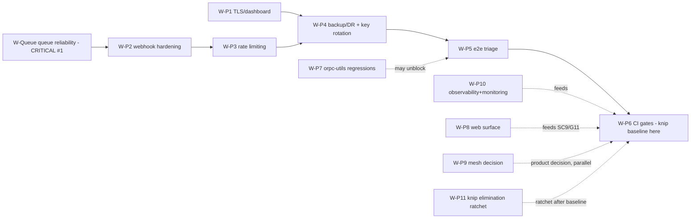
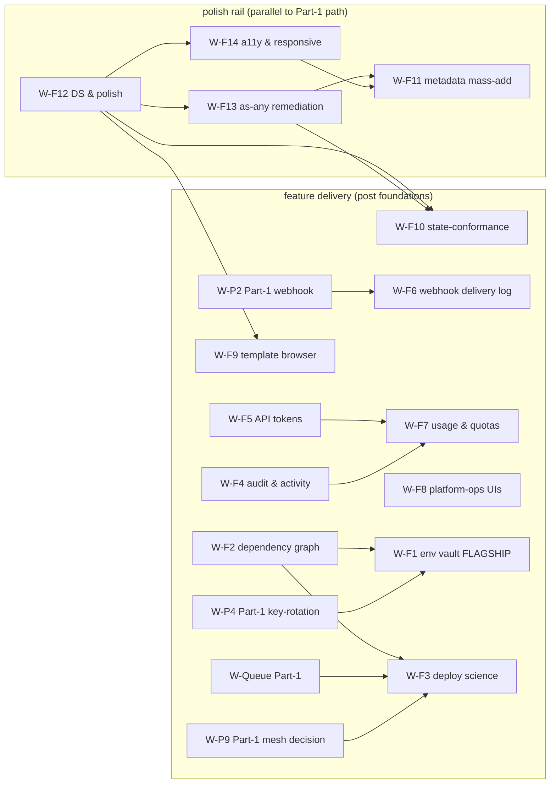

# Production Readiness Plan — Deployer v3

> **Source:** structured deep-analysis loop over `N0SAFE/deployer` (branch `rewrite-v3`),
> 2026-08-29 → 2026-08-30. **Cycle 1 (Part 1, reliability/security):** 2 investigation waves,
> 2 review cycles, 3 strategist checkpoints, gatekeeper verdicts GATE-1 = `NEEDS_MORE_ANALYSIS`
> (4 missions + conditions) then GATE-2 = `APPROVED` (11 assembly conditions). **Cycle 2 (Part 2,
> feature & polish):** 3 investigation waves (surface/shell/states/orphans/DS/quality + g1–g4
> pin-point missions), strategist checkpoints after every wave, GATE-3 = `APPROVED` (15 assembly
> conditions). All claims file-evidenced (Evidence map §6 incl. FE-1…FE-20). This document is the
> actionable plan; the loop's audit trail (mission ledger, checkpoint log) is at the bottom (§9).
>
> **Part-2 scope note:** the extension cycle adds the *feature & polish* layer
> (SC-EXT1–14 → W-F1…W-F14, wave-4/ext missions). It does **not** re-open any Part-1 verdict.
> SC1–14, W-Queue…W-P11, G1–G13, B/Q/S/A/P evidence are frozen above and referenced, never
> duplicated (DRY/SSOT).

## 1. Executive summary

The v3 rewrite is architecturally sound: the deployment queue executes typed jobs
(typed RxJS channel + supervised Redis, Bull removed), the unit suite is fully green
(127 files / 1435 tests, 0 non-e2e type errors), web + doc type-check clean, LB and
Bull are gone, cross-subdomain auth cookies work, first-boot ingress is fixed, and
secrets-at-rest encryption **exists** (AES-256-GCM). But cycle-2 evidence reclassifies
the queue as **broken at the retry boundary with no crash recovery** — a deploy
pipeline that silently never re-executes retried jobs and can strand deployments in
`building` forever is the #1 production blocker, above every security item.

**Top 5 blockers** (owning workstream):

| # | Blocker | Evidence | Workstream |
|---|---|---|---|
| 1 | **Queue retry is a no-op + no crash recovery** — retry re-enqueues but never re-emits the job channel the worker subscribes to; lease/heartbeat vestigial; crash between claim and complete strands DB rows at `building` forever; failure persistence rollback-only; `retryable:true` for every failure | Q1–Q7 | **W-Queue** |
| 2 | **Rate limiting: zero** — SC14 entirely unimplemented (webhook, setup, auth sign-in, probe, app-instance register) | B4 | W-P3 |
| 3 | **Webhook integrity is session-only** — idempotency in-memory `Map` (restart re-executes duplicates); signature verified over re-serialized JSON, not raw bytes (G6) | B2, B3 | W-P2 |
| 4 | **Secret key management is not production-safe at rest** — AES-256-GCM exists, but the master key derives from AUTH_SECRET and a `scryptSync("temporary-fallback-key")` fallback is in source (hazard); no rotation metadata → rotation is DB surgery | S1–S3 | W-P4 |
| 5 | **TLS is not production** — ACME email hardcoded `admin@example.com`, TLS flag not env-gated, no HTTP→HTTPS redirect, Traefik dashboard `insecure:true` | B5, B6 | W-P1 |

*Runner-up (H priority):* CI gates absent — knip exits 1 and is not enforced; no e2e
job; e2e has ~147 legacy type errors; `@repo/orpc-utils` builder-regression cluster
fails ~7 turbo tasks.

**Top quick wins:** ① retry-channel re-emit (1 file, unblocks the #1 blocker's worst
symptom); ② env-gate TLS + 80→443 redirect + drop `insecure:true`; ③ missing compose
healthchecks; ④ 12 `console.*` → logger + redaction keys; ⑤ 2 `as any` + 2 hardcoded
hrefs in web; ⑥ knip baseline accepted in CI as a gate-enabler.

### Part 2 — Feature & Polish: executive summary

The Part-1 loop proved the v3 *pipeline* is unsafe to run unattended (queue retry no-op, rate
limits zero, webhook idempotency session-only, TLS not production, no backup story). **Part 2
answers the next question: once the pipeline is *reliable*, is the *product* complete?** The
wave-4/ext sweep (69 `page.tsx` / 80+ routes) says **no** — the surface is wide but several core
product promises are invisible or half-wired, and the codebase carries quality debt that
compounds (64 `as any` in web, 56 bare `<select>`, 20 index-key maps, a 1530-line
`data-table.tsx`, doc rot).

**Top feature & polish findings** (owning workstream):

| # | Finding | Evidence | Workstream |
|---|---|---|---|
| 1 | **No project-level env/secret manager** — `environment_variables` table stores secret **values as PLAINTEXT** (`isSecret` is only a masking flag); only per-service config/environment pages exist; template-resolution fields (`resolvedValue`/`resolutionError`/`references`) already in schema but unused by UI | FE-9 | **W-F1 (flagship)** |
| 2 | **Deploy "science" is surface-thin** — `cancelDeployment` flips a DB status + emits events but **never kills the running build**; build logs exist server-side (`buildLogs` + `deploymentLogs`) but have no streaming terminal UI; dependency graph exists (declared edges, recursive, namespace-aware) but the project page pays an **N+1 fanout** (one query per top-level service); no history/compare/rollback | FE-10, FE-16 | W-F3, W-F2 |
| 3 | **Product-ops surfaces absent** — no audit log UI, no API tokens, no usage/quotas, no webhook delivery-log UI — while the server modules exist and are wired (`analytics`/`events`/`push`/`template` have **zero web consumers** = ready substrate) | FE-1, FE-3, FE-11 | W-F4, W-F5, W-F6, W-F7 |
| 4 | **Platform-ops UIs absent** — TLS/cert UI (pairs W-P1), backup/restore UI (pairs W-P4), rate-limit config UI (pairs W-P3), health dashboard (pairs W-P10) | FE-1 | W-F8 |
| 5 | **Quality debt is quantified** — 64 `as any` (web, 13 files: 22 error-message casts, 7 Badge variant casts, 11 typed-empty, 8 response-shape, 4 contract-align; API prod 12; spec/e2e ~252; packages ~12); 56 `<select>` with 0 `aria-label`; 4 `loading.tsx` for 60+ data routes; one lying static stub ("No pending invitations" hardcoded where a real hook exists) | FE-6, FE-8, FE-14, FE-17 | W-F13, W-F14, W-F10 |
| 6 | **Metadata 0/69 + doc rot** — `route.info.ts` is generator-owned with **no metadata slot** (g4 ruling); sanctioned pattern is per-page `export const metadata`/`generateMetadata` (0/69 today); 16 live references still name the dead `page.info.ts` (7 actionable docs + migration/test files) | FE-7, FE-19 | W-F11 |

**Top feature quick wins:** ① wire the orphaned `mode-toggle` (dark mode already ON via
`next-themes`, but **no visible toggle anywhere**); ② `getErrorMessage()` util (kills 22
`(err as any)?.message`); ③ Badge variant-union widen (kills 7 casts); ④ fix the invites
lying stub by reusing `useAllOrganizationPendingInvitations`; ⑤ fix doc rot
(`page.info.ts` → `route.info.ts`); ⑥ fix the `"./*"` wildcard export in `packages/ui` `package.json`.

**Feature roadmap discipline (SC-EXT14):** every Part-2 workstream follows the W-F* namespace,
every claim carries evidence links (FE-*), every new UI surface ships with metadata (W-F11),
state handling (W-F10), labels (W-F14), and tests. No workstream creates a bridge or a
temporary compat layer (no-bridges doctrine extends to features).

## 2. Readiness matrix (SC1–14)

| SC | Criterion | Status | Evidence | Priority |
|---|---|---|---|---|
| SC1 | Deploy e2e reliable (claim/heartbeat/retry/maxAttempts) | **GAP/FAIL at runtime** — retry no-op (Q1), no crash recovery (Q3), lease vestigial (Q2), failure persistence rollback-only (Q4), `retryable:true` unconditional (Q5), spec = 13 tests not 15 (Q7) | P1, Q1–Q7 | **H — #1** |
| SC2 | Webhooks idempotent + auth + fail-closed | **PARTIAL** — HMAC fail-closed verified (missing secret/sig → 401; plan's R1 "fail-open" hypothesis refuted); rawBody re-serialization (G6); idempotency in-memory | B1, B2/G6, B3 | H |
| SC3 | Ingress single-publish + TLS default | **PARTIAL** — first-boot fixed; TLS not env-gated, placeholder ACME email, no redirect, dashboard `insecure:true` | P6, B5, B6 | H |
| SC4 | Every API path public-or-auth+perm | **PARTIAL → mostly-guarded** — 6 `AllowAnonymous` sites (2 files) vs 275 `requireAuth(` sites; role-from-session landed; open sub-audit = role-vs-org permission matrix + setup/system endpoint audit (**G11**) | A1, B11 | M |
| SC5 | All provider types write-side functional | **PARTIAL (unverified)** — no positive write-path evidence yet; shared-builder regressions (B15) imply risk; first positive evidence comes from W-Queue e2e + W-P7 | B15 | M |
| SC6 | Auth/cookie cross-subdomain + mesh | **READY (cookie part verified)** — cross-subdomain cookies + appInstance tokens; mesh sub-part owned by SC10/W-P9 (G7) | P6 | LOW (no work) |
| SC7 | Data durable + recoverable | **GAP** — no backup/restore scripts or runbooks anywhere | B9 | H |
| SC8 | Observability (logger/health/redaction) | **PARTIAL** — 12 `console.*` in non-spec api src; healthchecks missing on several compose services; redaction of `privateKey`/`clientSecret` unverified | B5, B7 | M |
| SC9 | Web dashboard full surface | **PARTIAL** — 0 console/* in pages, role UI landed; metadata sweep (G1), onboarding + error-state detail (G13) open | B10, B11 | M |
| SC10 | Mesh functional + recoverable | **GAP** — SSE-only (no WebSocket), `mesh-stream-runtime` returns null (registry missing), node-loss recovery untested; product decision (local-only vs proxy) required | B12 | M |
| SC11 | Gates (type-check 0 incl e2e, tests, dr:build, knip, CI) | **GAP** — ci.yml has no knip and no e2e job; knip exits 1; e2e ~147 type errors | B13, B14, P3 | H |
| SC12 | No bridges / dead arch | **PARTIAL** — LB/Bull removed; knip backlog (537 unused exports / 36 files); orpc-utils regression cluster | P6, B14, B15 | M |
| SC13 | Secrets never leak | **PARTIAL (corrected)** — at-rest encryption **exists**: `encryptedText` AES-256-GCM for dns-providers.credentials, cluster.secretMaterial, deployment webhook secret, github clientSecret/privateKey/webhookSecret; master key from AUTH_SECRET; fallback-key hazard; no rotation metadata | S1, S2, S3, P6 | H |
| SC14 | Rate limiting on exposed endpoints | **GAP** — zero rate limiting in api src | B4 | H |

### SC-EXT1–14 — Feature & polish extension matrix

| SC-EXT | Criterion | Status | Evidence | Owning workstream |
|---|---|---|---|---|
| SC-EXT1 | Surface-completeness map — every route vs product promise | **MAPPED** — 69 `page.tsx` / 80+ routes inventoried; **8 notable absences**: project-level env/secret tab, admin audit log, backup UI, TLS/cert UI, webhook delivery-log UI, API-token UI, usage/quotas UI, template browse UI (template contract orphaned) **+ 3 redirect stubs** queu/terminal/events → activity/shell | FE-1 | W-F1, W-F4..W-F9, W-F10 (stub cleanup) |
| SC-EXT2 | New-feature readiness rubric — flagship features have full readiness blocks (UX flow, ORPC, data model, SSE-vs-poll, tests) | **BLOCKS PROVIDED** for env vault, build-log streaming, audit log, API tokens, webhook delivery log, template browser — plus binding technical conformance (uuid IDs, `.errors()`, zod v4, env-set naming, `environmentKind`, `Route.<Link>` only) | FE-9..FE-11 | §5ter (W-F1, W-F3..W-F6, W-F9) |
| SC-EXT3 | State-conformance sweep — every data route has loading/error/empty | **GAP enumerated** — 4 `loading.tsx` for 60+ data routes; 8 service-config pages drop `useService` error (not-found guard only); deployments Alert:168 no retry vs :138 pattern; config/provider error-as-empty; admin/users drops error :61; docker/images no empty/error | FE-14 (g2) | W-F10 |
| SC-EXT4 | Design-system conformance — @repo/ui audit | **PARTIAL** — 636 imports / 156 files; `data-table.tsx` = 1530 lines (size smell, rich capabilities); `mode-toggle` orphaned; `radio-group`/`sheet` orphaned; `drawer`/`hover-card`/`stepper`/`terminal`/`yaml` absent; `"./*"` wildcard export = boundary violation | FE-4, FE-5, FE-20 | W-F12 |
| SC-EXT5 | Responsive + a11y baseline | **GAP** — 56 `<select>` (0 `aria-label`; 2 `htmlFor`); 20 non-skeleton index-key maps; mobile Sheet ≤18rem present but overflow unverified | FE-8 | W-F14 |
| SC-EXT6 | Perf/UX baseline — streams + heavy surfaces | **PRECEDENTS VERIFIED** — SSE streaming live (docker logs), deferred-value pattern + trigger/content modal split required for SSE-heavy pages | FE-2, FE-12 | W-F3, W-F12, W-F14 |
| SC-EXT7 | Env/secret manager spec (flagship) | **GAP + DESIGN** — table exists with encryption-ready shape but **PLAINTEXT values**; flagship spec = encryption-at-rest (AES-GCM pattern precedent), masking UX, project-level sets, per-service overrides, versioning, link-to-deploy preview, migration ack | FE-9 | W-F1 |
| SC-EXT8 | Deploy-science specs (≥5) | **5+ SPECS** — build-log streaming, history/compare/rollback, cancel/stop-with-kill, preview depth, scheduled deploys (defer), blue-green/canary (DEFER, ties W-P9) | FE-10, FE-12 | W-F3 |
| SC-EXT9 | Product-ops specs (≥4) | **4 SPECS** — audit log, API tokens, usage/quotas, team/roles matrix (matrix = G11 audit read-across) | FE-1, FE-3, FE-11 | W-F4, W-F5, W-F7 |
| SC-EXT10 | Platform-ops specs (≥4) | **5 SPECS** — TLS mgmt UI, backup/restore UI, rate-limit config UI, webhook delivery-log UI, health dashboard (+ maintenance mode) | FE-1, FE-11 | W-F8, W-F6 |
| SC-EXT11 | Docker-console depth | **PARTIAL** — logs streaming rich; **terminal → shell redirect (alias, not real)**; docker pages (networks/registry/volumes/shell/stacks/images) have **no error handling** — SSE badge only → daemon-down is silent; a11y bare selects | FE-12 | W-F3, W-F14 |
| SC-EXT12 | Onboarding polish | **PARTIAL** — middleware = folder chain `WithAuth`/`WithEnv`/`WithHeaders`/`WithHealthCheck`/`WithSetup`; `WithSetup` redirects → `/setup` when `needsSetup`; setup page reads `setupState`/`needsSetup` with ErrorScreen+Retry | FE-13 | W-F10, W-F12 |
| SC-EXT13 | Value/effort rank for every candidate | **DONE** — consolidated rank table (§8) across W-Queue…W-P11 + W-F1…W-F14 + quick wins | FE-15 | §8 |
| SC-EXT14 | PRP growth discipline — plan itself stays evidence-based | **CODIFIED** — W-F* namespace; every claim → FE-* evidence link; doc-volatility rule (any change updates this plan + `apps/doc` + AGENTS in same change set); ≥3-occurrence pattern validation | FE-19 + core-rules | all W-F* |

## 3. How to read the ordering (dependencies vs serial order)

The **canonical execution order** is the primary sequence:
`W-Queue → W-P1 → W-P10 → W-P8 → W-P2 → W-P3 → W-P4 → W-P5 → W-P6 → W-P11 → W-P9 → W-P7`.
Dependencies may **pull a workstream earlier** or run it **in parallel** — three known pulls:

1. **W-P6 (CI gates) needs W-P7 (orpc-utils green)** — W-P7 is ordered last (regression repair)
   but its fixes must land before the gate can be enforced; expect W-P7 to be pulled forward
   (or its fixes delivered as a preliminary batch).
2. **W-P10 (observability + monitoring) needs the W-P4 backup channel** — the DLQ/backup
   monitoring signals depend on backup/DR landing; W-P10's monitoring *scope* ships with W-P4.
3. **W-P8 (web surface) needs the G7 product decision** (mesh SSE-only vs cross-node proxy),
   owned by the later W-P9 — the *decision* must precede W-P8's SSE-work item.

Quick wins ride their workstreams; the knip **baseline** lands inside **W-P6** (gate-enabler)
and **W-P11** is the elimination ratchet strictly after the gate exists.

*Reference convention:* workstream subsection headers follow the canonical order; legacy
session IDs (W5, W11, GAP-5, P2-x) are mapped in the LEGEND below and never used as plan IDs.

### 3bis · Ordering of the W-F* workstreams (Part 2)

The W-F* layer runs **after/alongside** the Part-1 critical path. Default serial order:

- **Polish rail** (foundations, parallel to Part-1 path): `W-F12 → W-F13 → W-F14 → W-F11`
- **Part-1 critical path** (unchanged): `W-Queue → … → W-P6 → W-P11 → W-P9 → W-P7`
- **Feature delivery** (post polish-rail foundations): `W-F5 → W-F10 → W-F9 → W-F4 → W-F6 → W-F7 → W-F2 → W-F8 → W-F1 → W-F3`

**Known pulls and gates:**

1. **W-F1 (env vault) gated on W-P2 (redaction) + W-P4 (key-rotation)** — vault encryption
   reuses the AES-256-GCM `encryptedText` pattern (S1/S2) and must sit on the hardened
   secret-management base.
2. **W-F3 (deploy science) gated on W-Queue** — cancel-with-kill, replay, and rollback ride
   the same execution path; scheduling and canary additionally wait on **W-P9** (mesh).
3. **W-F5 (API tokens) gated on G11** (role-vs-org permission matrix) — scope names match the role matrix.
4. **W-F8 platform-ops UIs gated on W-P1/W-P3/W-P4/W-P10** — each UI is a skin over a Part-1 subsystem.
5. **W-F12 polish rail is the unblocker** — DS additions consumed by W-F1/W-F3/W-F7/W-F8/W-F9/W-F10 (only what features consume — YAGNI).
6. **W-P8 ownership transfer (binding, GATE-3 condition 8):** W-P8 items 1–2 (G1 metadata
   sweep; `as any` at `use-project-filters.ts:43` / `use-project-detail.ts:35`) **transfer to
   W-F11 and W-F13** respectively. W-P8 retains items 3–5 (hardcoded-href cleanup, SSE
   transport feed, admin-role UI gating → G11). W-P8 ACs are trimmed accordingly; Part-1
   G1–G13 ownership stays as recorded for the *remaining* items.
7. **ID-collision guard (GATE-3 condition 6):** `W-F*` ≠ `W-P*` — same suffix ≠ same
   workstream: W-F10 (state-conformance) ≠ W-P10 (observability); W-F2 (dependency graph) ≠
   W-P2 (webhook hardening); W-F8 (platform-ops UIs) ≠ W-P8 (web surface); W-F1 (env vault) ≠
   W-P1 (TLS). Mission evidence ids `g1…g4` are distinct from Part-1 gap ids `G1…G13`.

## 4. LEGEND — ID namespace

Plan IDs are **W-P1…W-P11, W-Queue, G1–G13** (and findings B/Q/S/A/P). Legacy IDs from
prior sessions are mapped, not reused:

| Legacy ID | Meaning | Plan equivalent |
|---|---|---|
| `W5` | TLS env-gating scaffold (schema has `DEPLOYER_TRAEFIK_TLS_ENABLED`) | folded into **W-P1** |
| `W11` | dashboard role sourced from `session.user` (landed) | finding **B11** |
| `GAP-5` | raw-body hashing fragility in webhook verification | **G6** (single ID) |
| `P2-1…P2-3` | prior-session verification refs (Redis supervision, typed queue, unit suite, e2e) | evidence refs only |
| `P2-4` | planned webhook-hardening workstream (in plan SSOT) | **W-P2** |

**LEGEND extension — Part-2 IDs (appended):**

| New ID | Meaning |
|---|---|
| `W-F1…W-F14` | Part-2 feature/polish workstreams (environment vault, dependency graph, deploy science, audit/activity, API tokens, webhook delivery log, usage/quotas, platform-ops UIs, template browser, state-conformance, metadata mass-add, DS & polish, as-any remediation, a11y/responsive — full details §5bis) |
| `SC-EXT1…SC-EXT14` | Part-2 extension success criteria (see §2 extension matrix) |
| `FE-1…FE-20` | Extension-cycle evidence-map rows (§6.1) — every Part-2 claim links here |
| `g1…g4` | Wave-4/ext mission evidence ids: `g1` = dependency graph (W-F2), `g2` = state-conformance gaps (W-F10), `g3` = as-any remediation map (W-F13), `g4` = metadata ruling `route.info.ts` → per-page metadata (W-F11). **Distinct from Part-1 gap ids `G1…G13`.** |
| `R1…R15` | Part-2 value/effort rank seeds (inputs to §8) |
| `T-F4, T-F5, T-F6, T-F7, T-F9` | Part-2 target-topic flags → owned: T-F4 onboarding → W-F10/W-F12; T-F5 env flagship → W-F1; T-F6 deploy-science → W-F3; T-F7 product-ops → W-F4/F5/F6/F7; T-F9 docker-console → W-F3/W-F14 |
| `G-E1…G-E9` | Part-2 extension gaps (see §7.3) — distinct from Part-1 `G1…G13` |
| `AES-GCM / encryptedText precedent` | Existing secrets-at-rest layer (S1/S2) reused by W-F1 — never re-invented |

## 5. Workstreams (canonical order)

*Caption — solid edges = strict dependency; dotted edges = feed/parallel contribution.
Quick wins (W-P1, W-P10, W-P8 essentials) run in parallel right after W-Queue.*

### W-Queue — Queue execution reliability
*Effort L · Priority #1 (above webhook hardening) · Owns G12*

1. **Retry-channel re-emit (CRITICAL).** The retry branch re-queues but never emits
   `jobQueued$.next` — sole emit in `deployment-queue-lifecycle.service.ts:105`, worker
   subscribes only at `deployment-queue.worker.service.ts:133` → retried jobs never
   re-execute. Fix: emit symmetrically on the retry path + unit test
   fail→retry→re-execute. (Worker spec currently has **13 tests, not 15** — resolve the
   discrepancy, Q7.)
2. **Lease reaper.** `leaseExpiresAt` (120s) has no consumer and `canClaimQueueJob`
   ignores the lease (`lifecycle:517-527`). Implement a lease-expiry reaper that returns
   abandoned claims to claimable state (multi-instance safe).
3. **Startup reconciliation.** Jobs live in an in-memory Map (`lifecycle:60-61`) wiped on
   restart; crash between claim and complete strands the deployment row at phase
   `building`/progress25 forever — no sweeper/reconciliation in `modules/deployment`.
   Fix (pick **one** path, no bridges): re-claim orphaned `building` rows on startup,
   **or** persist the queue durably (DB-backed queue table) — decision documented.
4. **Deploy/retry failure persistence.** `deployment.service:1451-1467` persists failures
   only for ROLLBACK (`persistRollbackExecutionFailure` is the sole method). Add failure
   persistence for deploy/retry so failures survive restart.
5. **Retryable-policy classification.** `retryable:true` is set for **every** failure
   (`worker:255-260`) including permanent config errors; the rich `resolveRetryPolicy`
   (BASE_RETRY_POLICIES, maxAttempts 5/6) is disconnected from the queue path. Reconnect
   so transient vs permanent are classified (permanent errors don't exhaust retries / pollute the DLQ).
6. **Worker-channel e2e**: retry→re-execution, lease-expiry→reclaim, restart→reconciliation,
   DLQ→replay (replay already re-enters `enqueueQueueJob` — retain, Q6).
7. **Regression-guard verified-good (Q6):** maxAttempts schema (min 1 / max 20 / default 5),
   DLQ + replay.

*Depends-on:* none. *AC:* retried job re-executes (unit + e2e); claimed-lease expiry
reclaims within window; restart mid-deploy leaves zero permanently-stuck `building` rows;
deploy failures persisted and visible; permanent config errors classified non-retryable;
worker spec count discrepancy resolved; DLQ→replay green.

### W-P1 — TLS / redirect / dashboard hardening + cert persistence
*Effort M · Owns G2/G9 (volume topology) + G10 (traefik docs)*
Make TLS the default, env-gated path (`DEPLOYER_TRAEFIK_TLS_ENABLED`, add
`DEPLOYER_TRAEFIK_ACME_EMAIL` — currently hardcoded `admin@example.com` in
`traefik-file-system.service.ts:935-995`); wire 80→443 redirect; remove `insecure:true`
from the API dashboard in prod output; persist `acme.json` via a supervisor named volume
(G2) instead of anonymous container storage.
*Depends-on:* G2 resolution. *AC:* TLS-on → redirect + real email + persisted acme.json;
TLS-off still works for dev; dashboard auth required in prod output; `curl -I` smoke on
80/443; traefik/TLS docs updated (G10).

### W-P10 — Observability: healthchecks + console→logger + redaction + monitoring extension
*Effort M · Owns G8 monitoring inputs · Feeds W-P6*
(1) Add `healthcheck` to compose services missing it: doc dev/prod-like/prod, e2e,
deployer single-container, dev/prod-like/prod overrides (B7). (2) Replace the 12
`console.*` sites in non-spec api src with the logger. (3) Verify redaction end-to-end
for all auth/secret-shaped fields (SC8/SC13). (4) Health coverage matrix:
api / web / doc / mesh / deployer / traefik reachability. (5) **Monitoring extension:**
cert-expiry detection (W-P1 acme.json), backup-failure alerting (W-P4 drills),
dead-letter / queue-growth metrics (W-Queue DLQ channels).
*Depends-on:* W-Queue (DLQ metrics source), W-P1 (cert channel), W-P4 (backup channel —
see ordering note, the monitoring scope ships with W-P4). *AC:* every compose service has
a healthcheck; zero `console.*` in api src; health matrix documented; redaction verified
by test; cert-expiry + backup-failure + DLQ signals wired.

### W-P8 — Web surface: metadata, `as any`, hrefs, SSE/transport feed, role-UI audit
*Effort M · Owns G1 (metadata sweep) + G13 (SC9 per-surface) · Feeds G11*
(1) Metadata sweep across 69 `page.tsx` (G1) + per-surface detail for SC9 — onboarding,
error states, contracts (G13). (2) Replace `as any` at `use-project-filters.ts:43` and
`use-project-detail.ts:35` with Zod-parse/narrowing fixes. (3) Replace the 2 minor
hardcoded hrefs (manage/web-app) with typed routes. (4) Feed the mesh transport decision
(G7, owned by W-P9 — decision first, implementation later) into dashboard SSE
expectations. (5) Audit admin-role gating UI vs `session.user` role — hide/route features
the user cannot call; output feeds the **G11** backend permission audit.
*Depends-on:* G7 decision (item 4). *AC:* 69 pages verified or explicitly exempted with
tickets; zero `as any` in web; zero non-manifest hardcoded hrefs; dashboard hides disabled
actions; G11 audit record produced.

### W-P2 — Webhook rawBody (G6) + durable idempotency + redaction
*Effort M · This is legacy "P2-4" (webhook hardening)*
(1) rawBytes hashing in `verifySignature` (G6) — hash the raw request body, not
`JSON.stringify(input.body)` (`github-webhook-auth.middleware.ts:173-190`). (2) Replace
the in-memory `Map` (`webhook-idempotency.service.ts`) with durable idempotency keyed on
`github_webhook_events.delivery_id` (the "P2-4 storage decision"). (3) Extend logger
redaction to `privateKey` and `clientSecret` (SC13).
*Depends-on:* durable-idempotency storage decision. *AC:* two identical deliveries after a
process restart → exactly one job enqueued; raw-body verify test; redaction unit test
proves `privateKey`/`clientSecret` never reach logs.

### W-P3 — Rate limiting across exposed endpoints
*Effort M · Owns G5 (sweep boundary)*
Middleware-level, per-IP + per-key, **fail-closed**, state in the already-supervised
Redis (multi-instance safe). Apply to: webhook (per-installation/IP, high ceiling), setup
endpoints, auth sign-in (low ceiling, brute-force), probe, app-instance register
(token-scoped). Extend the G5 sweep into `packages/` before finalizing the endpoint list.
*Depends-on:* G5 sweep. *AC:* per-endpoint limits + 429-on-exceed tests; Redis-backed;
fail-closed when Redis is down (or explicit capacity safety); webhook still passes large
GitHub hook batches.

### W-P4 — Backup/DR runbook + scripts + secrets-at-rest hardening (rotation sub-plan)
*Effort L · Owns G8 (runbook) + G9 dep + G10 (runbook docs) + SC13 rotation*
Scripts + runbook + restore drill for: postgres (`pg_dump`/`pg_restore`), sqlite, traefik
config dir + `acme.json`, Redis (RDB/AOF), env/secrets. **Rotation sub-plan (SC13, S2/S3):**
(1) remove the production hazard — enforce AUTH_SECRET presence at boot (fail-fast) instead
of the `scryptSync("temporary-fallback-key","salt",32)` loud-warn fallback (key derivable
from source); (2) document key derivation (AUTH_SECRET → 32-byte hex → master key for the
per-value scrypt derivation); (3) add rotation metadata (`rotatedAt`/`expiresAt`/`previousHash`)
to the `encryptedText` columns + ship a re-encryption script so rotation is scripted, not DB
surgery (the stored `salt:iv:authTag:data` format carries no key version today); (4) keep
the existing AES-256-GCM layer, extend to new credential classes.
*Depends-on:* W-P1 volume topology (G2/G9). *AC:* each named datastore produces a
restorable artifact; executed restore drill; no plaintext keys in DB dumps (grep-verified);
rotation script re-encrypts with a new key and proves old-key ciphertext fails to decrypt.

### W-P5 — E2E harness triage + repair (finish P2-3)
*Effort L · Owns G3*
Per-file triage of the ~147 legacy e2e type errors (G3): partition into contract-drift vs
test-outdated vs type-system; repair in place (no bridges); add healthchecks to e2e
compose (B7) so the harness gates on readiness.
*Depends-on:* G3 triage; possibly W-P7 if errors overlap the builder layer (see ordering
note — W-P7 may back-fill). *AC:* `type-check` green including e2e; e2e green in CI; zero
new `@ts-ignore`/`as any`.

### W-P6 — CI gates (knip baseline → enforce, e2e job, type-check incl e2e, dr:build freshness)
*Effort M · ORDERING FIXED: knip baseline lands here as gate-enabler; elimination is W-P11 after*
In `ci.yml` (B13): add knip **baseline** (accept current 36 unused files / 53 unused deps /
76 unused devDeps / 537 unused exports / 289 unused types / 7 unused catalog entries — then
ratchet via W-P11); add an e2e job; make type-check cover e2e; add a dr:build freshness
check (regenerate + diff, fail on drift).
*Depends-on:* W-P5 (e2e green), W-P7 (orpc-utils green — pull-forward per ordering note),
knip baseline acceptance. *AC:* PR merge blocked unless all four checks pass; knip drift
fails the build while W-P11 ratchets toward zero.

### W-P11 — Knip dead-code elimination (no-bridges doctrine)
*Effort L · Runs as the ratchet AFTER W-P6 baseline · Owns G10 (doc/AGENTS cleanup portion)*
Eliminate the knip-verified dead code — deleting, never commenting out (YAGNI/no-bridges):
36 unused files, 53 unused deps, 76 unused devDeps, 537 unused exports, 289 unused types,
7 unused catalog entries. Update the CI baseline as counts drop.
*Depends-on:* W-P6 baseline. *AC:* knip exit 0 (no baseline to hide under);
`turbo run lint --affected` + type-check green; zero accidental deletions (each batch
grep-verified for remaining importers).

### W-P9 — Mesh node-loss recovery + transport decision
*Effort L · Owns G7 (product decision) + G10 linkage*
Either implement the stream registry + cross-node proxying (`mesh-stream-runtime.service`
currently returns null) plus node-loss recovery, **or** make the explicit product decision:
mesh is local-serve-only in v3, documented + UI-declared (G7), with recovery semantics for
the local case. SSE-only, no WebSocket transport today.
*Depends-on:* product decision (G7). *AC:* either (a) cross-node stream e2e + node-kill
recovery test, or (b) explicit local-only limitation with dashboard affordance — no
half-implemented registry.

### W-P7 — @repo/orpc-utils regression fixes
*Effort M · Owns G4 · Ordered last but may be pulled forward by W-P6 (see ordering note)*
Root-cause and fix the builder-layer regression cluster: bare-list void-input (2),
entitySchema exposure (2), legacy callable (1), tanstack invalidation, POST mutation hook
— 5 direct / 7 via turbo.
*Depends-on:* G4 root-cause. *AC:* the 7 turbo-failing tasks green; regression tests per
symptom class; zero new `as any`/assertions.

## 5bis. Feature & Polish workstreams (W-F1…W-F14)

*Caption — solid edges = execution dependency; diamond-anchored edges express Part-1 gates:
W-Queue gates W-F3 (cancel/rollback ride the queue), W-P2 gates W-F6 (webhook durable store),
W-P4 gates W-F1 (vault key rotation), W-P9 gates W-F3's canary/scheduling part. The Polish rail
is the unblocker for the feature batch.*

> **Technical conformance (binding for every W-F* proposal — GATE-3 conditions 9–14):**
> (1) new IDs use branded/uuid Zod types (`z.string().uuid()` or `.brand()`), never bare
> `z.string()`; (2) every fallible ORPC contract declares `.errors(...)`
> (`meshDomainErrorContracts(e)` where applicable); (3) zod v4 idioms only; (4) new env-vault
> tables canonicalize on the `env_set` naming (single convention, no mixed prefixes);
> (5) the env-vault model carries the `environmentKind` dimension (per-environment-kind sets),
> not only project-level; (6) all new navigation uses `<Route>.Link` (typed route), never raw
> `href` strings. Contract shapes below are plan-level decision inputs; final contracts comply
> with these constraints.

### W-F1 — Environment vault (flagship) · *Effort M-L · Owns T-F5 · after W-P2/W-P4*

**Goal.** Project-level secret manager over the **existing** `environment_variables` schema:
encryption-at-rest, masking UX, project-level sets, per-service overrides, versioning, and a
link-to-deploy resolution preview.

**Evidence.** `environment.ts:188` — table has `environmentId` FK, `key`, `value` (**PLAINTEXT
`text!`**), `isSecret` (bool flag only — masking, **no encryption**), `description`, `category`,
`template` (`${}` placeholders), `resolvedValue`, `resolutionError`, `references jsonb`.
Deployment rows snapshot `environmentVariables` as `jsonb` (`deployment.ts:112,335,613` —
versioning substrate exists). Worker hydrates envs from `runtimeConfiguration.environment`
(`worker:542-559`). Per-service configuration/environment page exists; **no project-level
surface** (FE-1). Encryption precedent: `encryptedText` AES-256-GCM `salt:iv:authTag:data` (S1/S2).

**Scope.**
1. Migration: encrypt secret values at rest (reuse `encryptedText` pattern, per-value 32B salt
   → scrypt-derived key); encrypt-on-write for new/updated secrets; read path decrypts only
   into deploy payloads and temporary unmask responses; `isSecret` stays the masking/UX flag.
   Ack: plaintext→ciphertext migration touches live rows (G-E6) → maintenance window, rollback
   path, `pg_dump` grep verification.
2. Project-level page `/projects/[id]/environments` — sets grouped by category, template
   resolution status, per-deploy snapshot view.
3. Masking UX: default `••••`; opt-in reveal (server-side, logged, short-lived); masked values
   never in client state beyond the reveal call.
4. Per-service overrides: existing per-service page extended with "inherits from project set"
   indicator + override flag; precedence documented and tested.
5. Versioning: deploy snapshots promoted to a version list (who/when/resolved diff).
6. Link-to-deploy preview: surface `resolutionError`/`references` before deploy so broken
   `${TEMPLATE}` references fail in the editor, not at runtime.

**Contract deltas (proposed, plan-level).** `envVaultGetProjectSets` (never returns plaintext
for `isSecret` rows; masked `"••••"` literal), `envVaultSetSecret` (write-only value, never
echoed), `envVaultReveal` (server-logged, audited — pairs W-F4), `envVaultVersions`
(deployment-id keyed snapshots). All inputs use uuid-branded ids; all fallible ops declare
`.errors(...)`; carry `environmentKind` on sets.

**Depends-on:** W-P2 (redaction list — env keys never logged), W-P4 (rotation sub-plan — vault
key participates), contracts-entities schema migration, W-F11 (metadata), W-F12 (DS form/stepper
primitives). **Effort:** M-L. **AC:** zero plaintext `isSecret` values at rest (DB-dump grep);
masking default everywhere; set-vs-override precedence tested; deploy snapshots listed as
versions; resolution errors surfaced in editor; rotation re-encrypts vault rows (W-P4 drill);
zero `as any` in the module (W-F13 doctrine).

### W-F2 — Dependency graph: batch endpoint + real-state option · *Effort M · Owns g1*

**Goal.** Kill the N+1 fanout on the project dependency view (`use-project-detail.ts:74-84` —
one query per top-level service, flagged "needs batch endpoint"), add a server-side real-state
option, and render declared-vs-auto edges distinctly. Package-manifest graph: **defer** (G-E1).

**Evidence.** `service.dependencies` contract = `{list,add,remove}` + `service_dependencies`
table, recursive + namespace-aware. Real-state connectivity derived **client-side** from shared
docker networks (no server contract — G-E2). `package.json` used only for runtime detection
(`github-account.controller.ts:590`).

**Scope.** (1) Batch endpoint `projectDependencyGraph.batch(projectId)` → services + edges in
one request; update the hook; delete the N+1 loop (replace, not bridge). (2) Real-state server
contract decision item (G-E2): option A keep client-derived (documented divergence) vs option B
server contract (authoritative). (3) Edge display: `declared` vs `auto`, recursive
namespace-aware expansion with collapse. (4) Defer package-manifest graph with written rationale.

**Depends-on:** contracts-api dependency module, W-F3 (visual), W-F13 (cast cleanup in
`use-project-detail`). **Effort:** M. **AC:** one batch request per project load (network tab
verified); N+1 comment removed; declared/auto edges visually distinct; batch resolver
unit-tested; defer note recorded (G-E1).

### W-F3 — Deploy science: logs, history, cancel-with-kill, scheduling (defer), canary (defer) · *Effort L · Owns T-F6*

**Goal.** Build-log streaming UI (SSE, terminal-style, ANSI), deploy history + compare +
rollback, and a **cancel that actually kills** the running build. Scheduled/cron and
blue-green/canary are **deferred with rationale** (canary ties W-P9).

**Evidence.** `cancelDeployment` = DB status flip + events ONLY — **no kill of the running
build** (FE-10; ownership-for-kill validation required, G-E7). Build logs exist server-side:
`buildLogs?: string` (deployment schema `:297`) + `deploymentLogs` table (`:696`). SSE precedent
already live: `useContainerStreamLogs`, "Connecting runtime log streams…", combined replica
stream. Docs to harvest: `cost-guardrail-engine.mdx:198`, `platform-feature-target.mdx:288`,
`benchmark-feature-adaptation-matrix`, `github-provider-feature-breakdown`,
`change-scoped-deploy-policy-preview` (FE-10).

**Scope.**
1. Build-log streaming: SSE per deployment (build phase), terminal-style component (new DS
   `terminal` primitive), ANSI parsing, auto-scroll + pause, raw-log download. SSE (precedent +
   backpressure via W-Queue channel).
2. History/compare/rollback: deploy list → diff two env snapshots (`environmentVariables` jsonb
   + config); rollback = re-deploy of the selected prior snapshot (reuses W-Queue).
3. Cancel-with-kill: extend `cancelDeployment` to terminate the build container — **ownership
   validation required first** (deployment→container mapping server-verified; kill guarded against
   foreign containers, G-E7). Unit test kill-path + permission-denied.
4. Scheduled/cron: **DEFER** — design sketch only until W-Queue durability lands.
5. Preview depth: metadata/comments/source-branch on existing preview routes — small.
6. Blue-green/canary: **DEFER (XL)** — needs W-P9 mesh decision + W-Queue dual-state guarantees;
   premature today = bridge risk (G-E4). Gate conditions in §8.

**Contract deltas (proposed).** `buildLogStream` (SSE; `kind:"build"` chunk union), 
`deploymentCancel` (kill gated on ownership check), `deploymentCompare` (snapshot delta). All
declare `.errors(...)`; ids uuid-branded.

**Depends-on:** W-Queue (retry-reemit first — cancel/rollback ride the channel), W-P9 (canary
gate), W-F12 (`terminal` DS primitive), W-F4 (cancel audit eventing). **Effort:** L. **AC:** logs
stream with ANSI + reconnect-after-drop; cancel kills the verified owning container; compare
shows snapshot diff; rollback re-deploys prior snapshot end-to-end; scheduled + canary documented
as deferred with gate conditions; zero `console.*` (logger only).

### W-F4 — Audit & activity log · *Effort M · Product-ops (SC-EXT9)*

**Goal.** Surface the **wired-but-orphaned** `analytics`/`events` modules: a user-scoped recent
activity feed + an admin audit trail with retention, pagination, filters.

**Evidence.** `analytics`, `events`, `push`, `template` contract modules = **zero web consumers**
(server modules wired, FE-3). Admin audit surface **absent** (FE-1).

**Scope.** (1) User activity feed: deployments/builds/webhooks recent-first with state icons.
(2) Admin audit trail: actor + action + resource + outcome + ts, paginated + filterable,
retention policy (≤90d) with purge job. (3) surface-vs-deprecate decision for `analytics`/`push`
(G-E5).

**Contract deltas (proposed).** `eventsList` (scope me/organization/system; cursor pagination),
`auditLogList` (admin-only; actor/action/from/to filters).

**Depends-on:** W-Queue (event journaling integrity), W-F5 (admin API-token auth for programmatic
audit). **Effort:** M. **AC:** feed shows recent deploys live; audit trail searchable; retention
purge tested; no PII/secrets in entries (W-P2 redaction list); zero `console.*`.

### W-F5 — API tokens · *Effort S-M · Early win (R4) · Product-ops (SC-EXT9)*

**Goal.** Scoped, revocable user/org API tokens with create/copy-once/revoke UI — the fastest
product-ops win.

**Evidence.** API-token UI **absent** (FE-1). Precedent: **app-instance tokens** (P6 lineage).
Scope naming must match the G11 role matrix.

**Scope.** (1) `api_token` table: `{ id, userId, orgId?, name, scopes[], tokenHash (never plaintext), expiresAt, lastUsedAt, revokedAt }`. (2) UI: tokens page (create, copy-once, revoke,
last-used). (3) Middleware: bearer-token auth parallel to session `requireAuth`.

**Contract deltas (proposed).** `apiTokenCreate` (scopes enum; `plaintextOnce` returned ONCE),
`apiTokenList`, `apiTokenRevoke`. Ids uuid-branded; scopes match G11 matrix.

**Depends-on:** G11 audit feed, `packages/utils/auth` factories. **Effort:** S-M. **AC:**
create→use→revoke e2e; only hash stored (DB grep); scope enforcement denied-path tested;
copy-once works; rotation guidance in docs.

### W-F6 — Webhook delivery log · *Effort M · Pairs W-P2*

**Goal.** Turn the `github_webhook_events` journal into a deliveries list (status, verification,
idempotency, redelivery) — the UI half of W-P2's durable idempotency.

**Evidence.** `github_webhook_events` journal exists = delivery-log substrate (FE-11).
Idempotency still in-memory LRU 10k (W-P2 durable gap). Delivery-log UI **absent** (FE-1).

**Scope.** (1) Deliveries list per installation: `delivery_id`, event, received at, IP,
verification result, idempotency hit, outcome, duration. (2) Redelivery: re-enqueue a delivery
(reuses W-Queue enqueue + DLQ-replay precedent Q6). (3) W-P2 pairing: journal becomes the durable
idempotency store keyed on `delivery_id`.

**Depends-on:** W-P2 (store decision), W-F4 (shared eventing). **Effort:** M. **AC:** every
delivery recorded with verification; redelivery enqueues once (dedupe on `delivery_id`);
duplicate-after-restart → no double job (proves W-P2 durable store); filters work.

### W-F7 — Usage & quotas · *Effort M · Product-ops (SC-EXT9)*

**Goal.** Billing-ready meters (deploys/month, active containers, storage, build minutes) with
soft-warn/hard-block quota hooks — grounded in the cost-guardrail engine; **no payment provider**.

**Evidence.** Usage/quotas UI **absent** (FE-1). Vision: `cost-guardrail-engine.mdx:198`,
`platform-feature-target.mdx:288`. Platform module wired; analytics/events orphaned (FE-3).

**Scope.** (1) Meters per cost-guardrail doc. (2) Quota enforcement behind flags:
soft-warn (banner) → hard-block (reject deploy), default off. (3) Org usage page + admin
overview.

**Depends-on:** W-F4 (counter eventing), W-F5 (tokens). **Effort:** M. **AC:** meters match
cost-guardrail metrics (cross-checked table); block boundary tested; no payment provider; usage
page renders with states (W-F10).

### W-F8 — Platform-ops UIs · *Effort M total (items S-M) · Platform-ops (SC-EXT10)*

**Goal.** Five admin surfaces skinning Part-1 subsystems — **build only after the subsystem is
production-safe**: TLS/cert mgmt (pairs W-P1), backup/restore (pairs W-P4), rate-limit config
(pairs W-P3), health/status dashboard (pairs W-P10), maintenance mode (global flag + read-only
guard + banner).

**Evidence.** TLS/cert, backup, rate-limit config, health dashboards all **absent** (FE-1);
inputs exist via W-P1 acme.json persistence, W-P4 scripts/runbooks, W-P3 Redis-backed middleware,
W-P10 health matrix.

**Contract deltas (proposed).** `opsHealth` (checks api/web/doc/mesh/deployer/traefik),
`opsRateLimitsGet` + set, `backupOpsCreate` (postgres/sqlite/redis/traefik-config/env-secrets).

**Depends-on:** W-P1, W-P3, W-P4, W-P10; W-F11 (metadata), W-F12 (DS). **Effort:** M. **AC:**
certs listed with expiry (feeds W-P10 alerting); backup artifacts + restore-drill launcher;
rate-limit table round-trips; health matrix matches W-P10 doc; maintenance banner blocks mutations.

### W-F9 — Template browser · *Effort M · Decision-coupled (SC-EXT1)*

**Goal.** Surface the **orphaned** template contract: browse starter packs, install → prefill
project config → create project.

**Evidence.** Template contract module = zero web consumers (FE-3); browse UI **absent** (FE-1);
vision `template-pack-catalog.mdx:195` (FE-10).

**Scope.** (1) Templates index (cards from the catalog). (2) Install flow: template → prefilled
project draft → create (stepper from W-F12). (3) **Record the surface-vs-deprecate decision**
(G-E5 with analytics/events/push): if deprecated, delete module (no-bridges).

**Depends-on:** contracts-api template surfacing, W-F12 (cards/stepper). **Effort:** M. **AC:**
browse → install → prefill → create e2e; catalog rendered from the contract; decision recorded
(§7.3).

### W-F10 — State-conformance backlog · *Effort M · Owns g2*

**Goal.** Close every enumerated state gap so no data route lies to the user.

**Evidence (g2, FE-14).** 4 `loading.tsx` for 60+ data routes; 8 service-config pages drop
`useService` error (not-found guard only — DRY hole); `projects/[pid]/deployments` Alert:168
**no retry** (inconsistent with `dashboard/deployments` `onRetry:138`); config/provider conflates
error as empty ("repo fetch failed → 'No repositories found'"); `admin/users` drops error :61;
`docker/images` no empty/error; redirect stubs queu/terminal/events (FE-1); **lying invites
stub**: hardcoded "No pending invitations" at
`admin/organizations/[orgId]/invites/page.tsx:48` while the real hook
`useAllOrganizationPendingInvitations` is consumed at `admin/system:136` + `dashboard-client:86`
(FE-11, FE-17); cross-shard `as unknown as` at service-overview :92-96,116,134 + monitoring
:28-29 (shared with W-F13).

**Scope.** (1) Loading skeletons per route group (4 → ~12–15 groups) reusing `PageLoadingState`.
(2) **Invites stub fix**: replace hardcoded empty at :48 with the real hook (DRY, FE-17).
(3) Shared service-config error component (8 occurrences = 3-strikes extraction).
(4) Error-as-empty fix in config/provider + grep-audit the pattern elsewhere. (5) Deployments
retry consistency (Alert:168 += `onRetry`). (6) `admin/users` error :61; `docker/images`
empty/error. (7) Redirect stubs: terminal → real feature (W-F3); queu → status page (W-Queue);
events/activity → W-F4; or remove. (8) Per-route-group error boundaries. (9) Cross-shard casts
with W-F13.

**Depends-on:** W-F12 (state primitives), W-F13 (casts). **Effort:** M. **AC:** every data route
has verified state (loading/error/empty — audit table in PR); invites shows real pending invites;
error-as-empty grep = 0; retry behavior consistent; no stub points to a dead end.

### W-F11 — Metadata mass-add + doc-rot fix · *Effort M · Owns g4*

**Goal.** 0/69 → 69 pages with `metadata`/`generateMetadata`, dynamic titles for
`[projectId]`/`[serviceId]`/`[environmentId]` routes; fix doc rot naming `page.info.ts`.

**Evidence (g4, FE-7).** `route.info.ts` (**not** `page.info.ts` — migrated 2026-01-01) is
**generator-owned**; schema = `{page, layout flags, Route name/params/search, verbs}` only —
**no metadata slot**; generator emits no metadata (`build-tools.ts`). **Sanctioned** pattern =
per-page `export const metadata`/`generateMetadata` (0/69 today; root-layout pattern
`layout.tsx:27`). **Doc rot (FE-19, accuracy-corrected):** **16 total live references** to
`page.info.ts` — 7 actionable docs (`routing.mdx`, `development-workflow.mdx`, `glossary.mdx`,
web `routes/README.md`, `frontend-react-uiux.instructions.md`, `core-rules.instructions.md`,
`declarative-routing/docs/nextjs.md`) plus migration/test files where the phrase is the migration
subject.

**Scope.** (1) Per-page metadata across all 69 pages; dynamic templates for parametrized routes.
(2) Fix the 7 actionable doc-rot files (grep `page.info.ts` → 0 in docs/instructions/web README;
migration/test references stay). (3) Codify in `frontend-react-uiux.instructions.md`: metadata
required per page; `route.info.ts` is the routing source, metadata is page-owned. (4) **Do not**
touch the generator (g4 ruling).

**Depends-on:** none blocking. **Effort:** M (≈S/page). **AC:** 69/69 export
metadata/generateMetadata (script-verified); dynamic routes title correctly; actionable
`grep -rn "page.info.ts"` = 0; `dr:build` diff empty (generator untouched).

### W-F12 — Design-system & polish · *Effort M · SC-EXT4 · H prereq (R14)*

**Goal.** Fix DS-level debt and ship only the primitives the features consume.

**Evidence.** @repo/ui: 636 imports / 156 files; `data-table.tsx` = **1530 lines** (server
pagination/search/sort/column-visibility/column-resize(localStorage)/URL-state/row-selection/
export CSV+Excel/subRows/onRowClick; 7+ docker sites); `chart.tsx` + recharts 3.8.1 at **1 site**;
`mode-toggle` **ORPHANED** (dark mode ON via next-themes, no visible toggle); `radio-group`/`sheet`
orphaned; `drawer`/`hover-card`/`stepper`/`terminal`/`yaml` **absent**; near-zero
tooltip(1)/dropdown(1)/breadcrumb(1)/progress(1); `"./*"` wildcard export = boundary violation;
209 `@repo/ui` subpath imports (FE-4, FE-5, FE-18, FE-20).

**Scope.** (1) **Mode-toggle wiring** (R12 quick win): wire the orphan into the dashboard
sidebar/account nav — make the shipped dark theme reachable. (2) data-table split: compose
column-defs/toolbar/pagination/selection/export; dead-options audit (column-resize localStorage,
Excel export — keep only used; 1530 → ≤800 lines). (3) Wildcard export → explicit subpaths;
validate 209 imports against the published map. (4) Chart reuse survey before W-F7/W-F8 add
meters/health charts. (5) DS additions **on demand**: `stepper` (W-F9 install, W-F1 wizard),
`drawer` (mobile depth), `hover-card` (preview summaries), `terminal` (W-F3), `yaml` (config
display) — no speculative adds.

**Depends-on:** none hard; feeds W-F1/F3/F7/F8/F9/F10. **Effort:** M. **AC:** dark/light toggle
visible + persisted (theme-switcher e2e); data-table ≤800 lines, dead options removed; `"./*"`
gone + imports valid; new primitives exist only where a feature consumes them (grep-backed).

### W-F13 — `as any` remediation · *Effort M · SC-EXT quality · Codifies `as never as T`*

**Goal.** Zero `as any` in production code; sanctioned escape hatch becomes `as never as T`.

**Evidence (FE-6).** Web: **64 casts / 13 files** — 22 `(err as any)?.message` → shared
`getErrorMessage()` util; 7 Badge-variant casts (environments×3, projectId:197, team:224,
services:136, previews:203) → Badge variant-union widen; 11 `[] as any[]` typed-empty sweep;
8 response-shape casts (→ contract-output-schema audit, G-E3); 4 contract-align (team role,
github redirectUrl). API prod: 12 (`mesh-resource-service` generic looseness 5,
`orchestrator.service.ts:99` `databaseUrl null as any`, mesh-resource.controller, `super(...,
entity as any)` in `deployments`/`node-info.mesh`, `mesh-where.ts:316`). Spec/e2e: ~252 (mesh
helper signatures). Packages: ~12 (data-table 7, env cli 2, orpc pagination 1, eslint/prettier 2).
Precedent: `CreateServiceWizard` remediated to `as never as T` (g3 mission).

**Scope.** (1) `getErrorMessage()` util (kills 22). (2) Badge variant widen (kills 7). (3)
Typed-empty sweep (11). (4) Response-shape audit: add contract output schemas or explicit
`to<ContractType>()` mappers (G-E3). (5) Contract-align 4. (6) API prod 12 (mesh generics,
orchestrator `databaseUrl`, mesh controller, super casts, `mesh-where:316`). (7) Spec/e2e ~252
mesh helper signatures. (8) Update instructions: `as any`/`as unknown as X`/`@ts-ignore` banned;
`as never as T` = only sanctioned escape.

**Depends-on:** none blocking; coordinates W-F10 + W-F12 (data-table casts inside the split).
**Effort:** M. **AC:** `grep -rn "as any" apps/web/src` = 0; api prod casts resolved or
sanctioned; contract-output-schema audit table closed (8 → 0 or tracked); spec/e2e helper
signatures fixed; instructions updated.

### W-F14 — A11y & responsive · *Effort H · SC-EXT5/SC-EXT11*

**Goal.** Every interactive control labeled, every dynamic list stable-keyed, mobile verified,
and docker-console pages surface daemon-down instead of failing silent.

**Evidence (FE-8, FE-12).** 56 `<select>` — **0 `aria-label`** (2 `htmlFor`); bare selects: logs
`:757-758` (+ cast at `:452`), docker networks/volumes/images/activity. 20 non-skeleton index-key
maps (StepRunner×2, StepNetwork/Advanced/Review, project-contracts-card, env/network configs,
team, middleware/error/env). Docker pages networks/registry/volumes/shell/stacks/images: **no
error handling** — SSE badge only → daemon-down silent; terminal route = redirect alias.

**Scope.** (1) Selects: `aria-label` for all 56 (add labeled `Select` to DS if absent).
(2) Index-key remediation: stable id-based keys for the 20 maps. (3) Mobile overflow audit: Sheet
≤18rem, tables scroll, touch targets ≥44px @375px. (4) Focus/keyboard: skip-links,
`:focus-visible`, ⌘K palette a11y attributes. (5) Docker SSE-error banners: daemon-down → error
state + retry across the 6 docker pages (pairs W-F3 stream state).

**Depends-on:** W-F12 (label primitive), W-F3 (stream error state). **Effort:** H. **AC:** axe
scan per surface — zero unlabeled select, zero index keys flagged; no horizontal overflow @375px;
keyboard-only pass on dashboard; docker pages show banner + retry on daemon-down.

## 5ter. New-feature readiness blocks (SC-EXT2)

*Each flagship: UX flow → ORPC (existing vs additive) → data model → SSE-vs-poll → tests.
All contracts comply with the binding technical conformance (uuid ids, `.errors(...)`, zod v4,
env-set naming, `environmentKind`, typed `Route.<Link>`).*

### 5ter.1 Env vault (W-F1)
- **UX flow:** Project → Environments → project sets (masked) → create/import set → per-service
  overrides tab → reveal (logged) → "preview at deploy X" resolution panel → version list from
  deploy snapshots.
- **ORPC:** existing write path (per-service configuration/environment; deploy snapshot reads) +
  additive `envVaultGetProjectSets` / `envVaultSetSecret` / `envVaultReveal` / `envVaultVersions`.
  Value write-only; read never returns plaintext for `isSecret` rows.
- **Data model (drizzle adds):** keep `environment_variables` columns; **add** `encryptedValue`
  (replaces plaintext `value` for `isSecret` rows) + `valueDigest` (blind index); canonical
  `env_set` (projectId, name, version, environmentKind) + `env_set_variable`; versioning via
  deploy snapshots (no new table if snapshots suffice).
- **SSE-vs-poll:** **poll** for lists/versions; no stream needed.
- **Tests:** migration backfill unit (plaintext→ciphertext, `pg_dump` grep); masking contract
  tests; precedence (set vs service override); reveal audit entry (W-F4); rotation re-encrypt
  drill (W-P4).

### 5ter.2 Build-log streaming (W-F3)
- **UX flow:** Deployment detail → Logs tab → terminal component streams build phase → ANSI →
  pause/autoscroll → download raw → reconnect indicator on drop.
- **ORPC:** existing (deployment status; SSE container-stream hooks precedent) + additive
  `buildLogStream` (SSE). Never buffers unboundedly — tail + backpressure.
- **Data model:** no new table — stream-only v1 (download = client-side buffer).
- **SSE-vs-poll:** **SSE** (matches `useContainerStreamLogs` precedent; backpressure via W-Queue).
- **Tests:** ANSI-parse unit; reconnect from ts cursor; cancel mid-stream kills owning container
  (ownership guard, G-E7); 401 on foreign deployment.

### 5ter.3 Audit log (W-F4)
- **UX flow:** Admin → Audit → filters (actor/action/range) → paginated table → detail drawer;
  User → Activity feed on dashboard.
- **ORPC:** additive `auditLogList` (admin-only), `eventsList` (me/org/system).
- **Data model:** no new tables if the `events` module persists; add `retention_days` + purge job
  if absent.
- **SSE-vs-poll:** **poll** + cursor pagination; live feed optional later on SSE.
- **Tests:** retention purge; admin-only guard; redaction (no secrets in meta — W-P2 list);
  cursor pagination stability.

### 5ter.4 API tokens (W-F5)
- **UX flow:** Settings → API tokens → create (name, scopes, TTL) → copy-once modal → list with
  last-used → revoke confirm.
- **ORPC:** additive `apiTokenCreate/List/Revoke`; bearer middleware parallel to session.
- **Data model:** `api_token` table (`tokenHash` only — DB-grep guarantee; scopes match G11).
- **SSE-vs-poll:** **poll**; no stream.
- **Tests:** create→use→revoke e2e; hash-only storage; scope deny-test; expiry; copy-once
  (second read returns nothing).

### 5ter.5 Webhook delivery log (W-F6)
- **UX flow:** Providers → Webhook deliveries → list (verification/idempotency/outcome badges)
  → delivery detail → redeliver.
- **ORPC:** additive `webhookDeliveriesList` / `webhookDeliveriesRedeliver`; substrate =
  `github_webhook_events` journal.
- **Data model:** no new table — extend journal with `verification`, `idempotentHit`,
  `durationMs`, `outcome` if missing.
- **SSE-vs-poll:** **poll** + cursor; optional live tail later.
- **Tests:** every delivery recorded incl. verification; duplicate-after-restart → dedupe (W-P2
  proof); redeliver enqueues once; filters.

### 5ter.6 Template browser (W-F9)
- **UX flow:** New project → Templates tab → card grid → install → stepper prefills
  services/env/deps → create.
- **ORPC:** additive `templateList` / `templateInstall` over the orphaned template contract.
- **Data model:** no new tables — catalog from `template-pack-catalog.mdx`; project draft = existing project-create contract + prefill payload.
- **SSE-vs-poll:** **poll**; no stream.
- **Tests:** browse→install→prefill→create e2e; catalog rendered from contract (no hardcoded
  cards); surface-vs-deprecate decision recorded (G-E5).

## 6. Evidence map

| claim | finding | source |
|---|---|---|
| Webhook auth fails closed (missing secret/sig → 401); plan's R1 "fail-open" REFUTED | B1 | `apps/api/src/modules/providers/middleware/github-webhook-auth.middleware.ts:100-150` |
| `verifySignature` hashes `JSON.stringify(input.body)`, not raw bytes | B2 (G6) | same middleware `:173-190` |
| Webhook idempotency in-memory only | B3 | `…/services/webhook-idempotency.service.ts` |
| Rate limiting: zero in api src | B4 | grep core/system/sub-apps/modules/main |
| Traefik writer: web:80/websecure:443, ACME email hardcoded `admin@example.com`, storage `/etc/traefik/acme.json`, dashboard `insecure:true` | B5 | `core/modules/traefik/services/traefik-file-system.service.ts:935-995` |
| TLS flag exists in env schema but writer not env-gated; no redirect | B6 (legacy W5) | env schema + same writer |
| Compose healthchecks missing (doc dev/prod-like/prod, e2e, deployer, overrides) | B7 | docker-compose sets |
| Config volume `${TRAEFIK_CONFIG_VOLUME}:/app/traefik-configs` | B8 | api-dev/api-prod compose |
| No backup/restore scripts or runbooks found | B9 | repo-wide search |
| Web: 0 console/* in pages; 2 `as any`; 2 minor hardcoded hrefs | B10 | `use-project-filters.ts:43`, `use-project-detail.ts:35`, app pages |
| Dashboard role from `session.user` (legacy W11 landed) | B11 | web session/role wiring |
| Mesh: SSE-only, no websocket; stream registry missing | B12 | mesh services |
| ci.yml: lint/compile/test jobs, no knip, no e2e | B13 | `.github/workflows/ci.yml` |
| knip exits 1: 36 files / 53 deps / 76 devDeps / 537 exports / 289 types / 7 catalog | B14 | knip run |
| orpc-utils regression cluster (5 direct / 7 turbo) | B15 | package + turbo runs |
| Prior verified state (typed queue 669/669, unit 127/1435, e2e ~147, LB/Bull removed, first-boot ingress, appInstance tokens, cookies) | P1–P6 | prior sessions (P2-1…P2-3 verified) |
| **Retry re-queues but NEVER emits `jobQueued$.next`** (sole emit `lifecycle:105`, worker subscribes only `worker:133`) — retried jobs never re-execute (CRITICAL) | Q1 | `deployment-queue-lifecycle.service.ts:105`, `deployment-queue.worker.service.ts:133` |
| Lease/heartbeat vestigial: `leaseExpiresAt` no consumer; `canClaimQueueJob` ignores lease | Q2 | `deployment-queue-lifecycle.service.ts:517-527` |
| Crash-between-claim-and-complete: in-memory Map wiped on restart; DB row stuck `building`/progress25; no sweeper | Q3 | `deployment-queue-lifecycle.service.ts:60-61` |
| Failure persistence rollback-only (`persistRollbackExecutionFailure` sole method) | Q4 | `deployment.service.ts:1451-1467` |
| `retryable:true` for every failure; `resolveRetryPolicy` disconnected | Q5 | `deployment-queue.worker.service.ts:255-260` |
| maxAttempts schema min1/max20/default5; DLQ + replay work | Q6 | queue schema + replay path |
| Worker spec = 13 tests, not 15 | Q7 | worker spec suite |
| At-rest encryption EXISTS — `encryptedText` AES-256-GCM: per-value random 32B salt → scrypt-derived key → 16B IV → authTag → `salt:iv:authTag:data` | S1 | `github-provider.ts:42-44`, `dns-providers.ts:45`, `cluster.ts:95`, `deployment.ts:437`, `encrypted-text.ts` (`ALGORITHM = "aes-256-gcm"`) |
| Master key = `Buffer.from(AUTH_SECRET,"hex")`; fallback `scryptSync("temporary-fallback-key","salt",32)` loud-warn hazard; no rotation metadata / key version in stored format | S2, S3 | `encrypted-text.ts` |
| 6 `AllowAnonymous` sites (2 files) vs 275 `requireAuth(` sites | A1 | controllers scan |

### 6.1 Extension evidence map — FE-1…FE-20

| claim | finding | source |
|---|---|---|
| Surface inventory: 69 `page.tsx` / 80+ routes; **absent surfaces**: project-level env/secret tab (only per-service config/environment), admin audit log, backup UI, TLS/cert UI, webhook delivery-log UI, API-token UI, usage/quotas UI, template browse UI (template contract orphaned); redirect stubs queu/terminal/events → activity/shell | FE-1 | app pages sweep + `src/routes` |
| Shell: root layout = next-themes ThemeProvider + sonner Toaster (richColors closeButton top-right) + metadata; DashboardSidebar (mainNav overview/deployments/services/docker10/orgs; adminNav servers/users/orgs/domains/providers8/system; accountNav profile; shortcuts `g o`…); CommandPalette wired ⌘K (dashboard layout :83); mobile Sheet drawer ≤18rem; 4 `loading.tsx`; states lib @/components/dashboard: PageHeader/PageLoadingState/PageErrorState/EmptyState | FE-2 | root `layout.tsx`, dashboard `layout.tsx`, sidebar, states lib |
| Orphans: `analytics`, `events`, `push`, `template` contract modules = **zero web consumers** (server modules wired); idle UI opportunities: activity feed, audit log, webhook delivery log, usage meters, template browser | FE-3 | contracts modules grep (web consumers) |
| DS scale: @repo/ui 636 imports / 156 files; `data-table.tsx` 1530 lines — server pagination/search/sort/column-visibility/column-resize(localStorage)/URL-state/row-selection/export CSV+Excel/subRows/onRowClick, 7+ docker sites; 209 subpath imports | FE-4 | packages/ui grep + data-table.tsx |
| DS orphans: `mode-toggle` ORPHANED (dark mode ON via next-themes, no visible toggle); `chart.tsx` + recharts 3.8.1 at 1 site; `radio-group`/`sheet` orphaned (sheet only via sidebar mobile); drawer/hover-card/stepper/terminal/yaml ABSENT; near-zero tooltip(1)/dropdown(1)/breadcrumb(1)/progress(1); `"./*"` wildcard export = boundary violation | FE-5 | packages/ui exports + component grep |
| 64 `as any` web/13 files: 22 `(err as any)?.message`; 7 Badge-variant casts; 11 `[] as any[]`; 8 response-shape (contracts may lack output schemas — G-E3); 4 contract-align. API prod 12 (mesh-resource-service generic looseness 5, `orchestrator.service.ts:99` `databaseUrl null as any`, mesh-resource.controller, `super(...,entity as any)`, `mesh-where.ts:316`); spec/e2e ~252 (mesh helper signatures); packages ~12. Precedent: `CreateServiceWizard` → `as never as T` | FE-6 | `as any` grep apps/web, apps/api, packages, spec/e2e |
| **g4 metadata ruling**: `route.info.ts` (not `page.info.ts`; migrated 2026-01-01) = generator-owned; schema `{page, layout, Route name/params/search, verbs}` ONLY — no metadata slot; generator emits no metadata (`build-tools.ts`); SANCTIONED = per-page `export const metadata`/`generateMetadata` (0/69 today; root pattern `layout.tsx:27`) | FE-7 | `build-tools.ts` + route.info.ts schema |
| A11y: 56 `<select>` — 0 aria-label (2 `htmlFor`); bare selects e.g. logs :757-758 + cast :452; docker networks/volumes/images/activity. 20 non-skeleton index-key maps | FE-8 | `<select>` grep + map-key audit |
| Env flagship: `environment_variables` table (`environment.ts:188`) — environmentId FK, key, value **PLAINTEXT text!**, isSecret (bool flag ONLY, no encryption), description, category, template `${}` placeholder, resolvedValue, resolutionError, references jsonb. Deployment rows snapshot env jsonb (`deployment.ts:112,335,613`). Worker hydration from `runtimeConfiguration.environment` (:542-559). No project-level page | FE-9 | environment.ts:188, deployment.ts, worker |
| Deploy science: `cancelDeployment` = DB flip only (no kill; G-E7). Dependency graph PRESENT (g1): `service.dependencies` `{list,add,remove}`; `service_dependencies` table; recursive; real-state client-derived (G-E2); no manifest graph (`github-account.controller.ts:590`). Docs harvest: cost-guardrail-engine(198), platform-feature-target(288), template-pack-catalog(195), benchmark-feature-adaptation-matrix, github-provider-feature-breakdown, change-scoped-deploy-policy-preview | FE-10 | deploy controller + graph contracts + docs |
| Product ops: webhook idempotency in-memory LRU 10k (W-P2 gap); `github_webhook_events` journal exists. **Invites LYING STATIC STUB** at `admin/organizations/[orgId]/invites/page.tsx:48`; real hook `useAllOrganizationPendingInvitations` at admin/system:136 + dashboard-client:86; members no error; settings no error+no empty | FE-11 | webhook-idempotency.service.ts + invites :48 + hook call sites |
| Docker console: terminal → shell **redirect (alias)**; logs SSE streaming (`useContainerStreamLogs`, "Connecting runtime log streams…", replica/combine UI); docker pages networks/registry/volumes/shell/stacks/images NO error handling (daemon-down silent); a11y bare selects | FE-12 | docker pages + logs hooks |
| Onboarding: `src/middleware` = FOLDER — WithAuth/WithEnv/WithHeaders/WithHealthCheck/WithSetup; WithSetup → /setup on needsSetup (`domains/setup/hooks.ts:24`); setup page reads setupState/needsSetup (:55,:71) w/ ErrorScreen+Retry | FE-13 | middleware folder + setup domain |
| State gaps (g2): 4 loading.tsx for 60+ data routes; 8 service-config pages drop `useService` error; projects/[pid]/deployments Alert:168 no retry; config/provider error-as-empty; admin/users :61; docker/images no empty/error; `as unknown as` service-overview :92-96,116,134 + monitoring :28-29 | FE-14 | per-page state audit (g2) |
| Value/effort seeds R1–R15 (env vault VH/M-L; build-log VH/L; audit H/M; API tokens H/S-M; webhook log H/M; TLS mgmt M-H/M; backup UI M/M-L; scheduled M/M; blue-green H/XL defer; rate-limit UI M/S-M; command palette M/S; dark-mode/i18n M-H; docker terminal M/M-L; DS additions H prereq; responsive/a11y H) | FE-15 | rank seeds |
| N+1 fanout: `use-project-detail.ts:74-84` "known issue, needs batch endpoint" — one query per top-level service | FE-16 | use-project-detail.ts:74-84 |
| Invites stub detail: hardcoded static empty at :48; working hook elsewhere | FE-17 | invites page.tsx:48 |
| data-table 1530-line smell + dead-options audit (column-resize localStorage, export formats) | FE-18 | packages/ui/data-table.tsx |
| **Doc rot (accuracy-corrected):** `page.info.ts` dead naming — **16 total live references**: 7 actionable docs (`routing.mdx`, `development-workflow.mdx`, `glossary.mdx`, web `routes/README.md`, `frontend-react-uiux.instructions.md`, `core-rules.instructions.md`, `declarative-routing/docs/nextjs.md`) + migration/test files where the phrase is the migration subject | FE-19 | repo grep |
| Wildcard export `"./*"` in `packages/ui/package.json` = subpath boundary violation (209 subpath imports to validate) | FE-20 | packages/ui/package.json |

## 7. Confidence & gaps

**Overall confidence: 84/100.**
Queue runtime facts (Q1–Q7): 95 · Security facts (B, S, A): 95 · Session prior (P): 90 ·
Web surface detail (B10/B11): 70 · Mesh posture (B12): 60 (product decision open).

### 7.1 Unresolved gaps (doctrine — budget-limited, not abandoned)

- **G3 — e2e per-file triage** (owned W-P5): ~147 type errors categorized at a high level
  (contract drift, moved modules, literal drift) but not root-caused end-to-end; SSE/queue
  interplay unverified against a running stack.
- **G4 — orpc-utils regression root cause** (owned W-P7): symptom cluster characterized at
  the contract boundary; root cause deferred to the fix workstream.
- **G5 — rate-limit sweep boundary** (owned W-P3): `packages/` layer not fully scanned
  before the endpoint inventory.
- **G11 — SC4 role-vs-org permission matrix + setup/system endpoint audit** (owned: G11
  audit workstream, W-P8 feeds UI evidence): guard coverage is broad (A1); the
  org-level role matrix remains to be audited.
- **G12 — queue-reliability residue** (owned W-Queue): poller/reaper second sweep, web UX
  blast radius of the retry no-op, heartbeat cross-check.
- **G13 — SC9 per-surface detail** (owned W-P8): onboarding/error-state sweep enumerated
  but not executed.

### 7.2 Tracked-but-not-blocking

- G1 metadata sweep, G2 acme.json volume persistence, G6 rawBody tolerance assessment,
  G7 mesh transport decision (product), G8 backup runbook, G9 volume topology,
  G10 docs SSOT staleness (owners: W-P11 + W-P4 + W-P1).

### 7.3 Extension gaps — unresolved (budgeted, decision-recorded)

Part-1 G1–G13 remain owned as recorded (with the W-P8 transfer noted in §3bis). New extension-cycle gaps:

| id | gap | owns | disposition |
|---|---|---|---|
| G-E1 | **Package-manifest graph deferred** — `package.json` used only for runtime detection (`github-account.controller.ts:590`); no manifest-level dependency graph. Revisit when version-pinning needs arise (FE-10) | W-F2 | DEFER + rationale |
| G-E2 | **Real-state server contract decision** — connectivity today client-derived from shared docker networks; no server truth (FE-10). Option A keep client-derived (documented divergence) vs Option B server contract (authoritative). Decision needed before W-F2 ships | W-F2 | DECISION-OPEN |
| G-E3 | **Response-shape contract audit follow-on** — 8 response-shape `as any` indicate contracts that may lack output schemas (FE-6); audit must add output schemas or explicit `to<Contract>()` mappers; tracked table closes 8 → 0 | W-F13 (+ contracts) | OPEN (follow-on) |
| G-E4 | **Blue-green/canary defer** — XL effort; needs W-P9 mesh decision + W-Queue dual-state guarantees; premature = bridge risk (FE-15) | W-F3 | DEFER with gate conditions (§8) |
| G-E5 | **analytics/events/push/template surface-vs-deprecate** — all four wired server-side with zero web consumers (FE-3); events → W-F4, template → W-F9; `analytics`/`push` need explicit surface-or-delete decision (no-bridges: if deprecated, delete module, not hide) | W-F4 / W-F9 | DECISION-OPEN |
| G-E6 | **Env migration ack** — plaintext→ciphertext migration touches live `isSecret` rows (FE-9); maintenance window, rollback path, dump-grep verification; NOT a silent background job | W-F1 | ACKED (W-F1 scope item 1) |
| G-E7 | **Ownership-for-kill validation** — cancel-with-kill requires server-verified deployment→container mapping before any kill (FE-10); prevent killing foreign containers | W-F3 | OPEN (validation spec) |
| G-E8 | **i18n readiness scope** — dark-mode toggle fix in (W-F12); full i18n out of scope this cycle (no translation framework); document the decision, don't half-adopt | W-F12 | DECISION (documented) |
| G-E9 | **queu/terminal/events redirect stubs** — alias stubs must resolve to real surfaces (terminal → W-F3, queu → W-Queue status page candidate, events/activity → W-F4) or be removed | W-F10 | OPEN (cleanup) |

### 7.4 Extension tracked-but-not-blocking

- Radix component tuning (radio-group/sheet orphans) — rides W-F12.
- Chart reuse survey — W-F12 item 4, feeds W-F7/W-F8 visual decisions.
- g3 mission id resolved: `g3` = the as-any remediation map (delivered, FE-6) — not a gap.

### 7.5 Confidence amendment (extension cycle)

- **Extension facts (file:line verified): 93/100.** Surface (FE-1) 95 · shell/DS (FE-2/4/5) 95 ·
  as-any (FE-6) 90 · a11y (FE-8) 92 · env schema (FE-9) 95 · deploy-science (FE-10) 90 ·
  product-ops (FE-11) 90 · doc-rot (FE-19) 95 · state gaps (FE-14) 88.
- **Decision-shaped content (G-E2/G-E5/G-E7/G-E8 + blueprint dispositions): 70/100** — recorded
  decisions, tagged DECISION-OPEN/DEFER, not verified code facts.
- **Combined plan confidence: 84 (Part 1, frozen) · 88 (Part 2 facts) · 74 (Part 2 plans).**

## 8. Value / effort rank (SC-EXT13)

*Verdict codes — DO = commit; DO-EW = early win; DO-PAIR = bundles with another workstream;
DEFER-GATE = deferred until listed gate; QUICK = ride-along in another workstream. Part-1 rows:
value/effort relative to production safety; Part-2 rows relative to product completeness.*

### Part 1 (frozen, recap)

| item | value 1-5 | effort 1-5 | dep | verdict |
|---|---|---|---|---|
| W-Queue retry re-emit (CRITICAL #1) | 5 | 1 | – | DO (quick win unblocks #1) |
| W-Queue lease reaper / startup reconciliation / failure persistence / retryable classification | 5 | 4 | – | DO |
| W-P1 TLS/redirect/cert persistence | 5 | 3 | G2 | DO |
| W-P2 webhook rawBody + durable idempotency + redaction | 5 | 3 | storage decision | DO |
| W-P3 rate limits (zero today) | 5 | 3 | G5 | DO |
| W-P4 backup/DR + key rotation | 5 | 5 | W-P1 | DO |
| W-P5 e2e triage | 4 | 5 | G3, W-P7 | DO |
| W-P6 CI gates (knip baseline) | 5 | 3 | W-P5/W-P7 | DO |
| W-P7 orpc-utils regressions | 4 | 3 | G4 | DO (pull-forward for W-P6) |
| W-P8 web surface (hygiene only after W-F11/W-F13 transfer) | 3 | 2 | G7 | DO (as-any→W-F13; metadata→W-F11; retains hrefs/SSE-feed/role-UI→G11) |
| W-P9 mesh decision | 4 | 5 | product decision | DO (decision first) |
| W-P10 observability+monitoring | 4 | 3 | W-Queue/W-P1/W-P4 | DO |
| W-P11 knip elimination ratchet | 3 | 5 | W-P6 | DO (ratchet) |

### Part 2 (extension)

| item | value 1-5 | effort 1-5 | dep | verdict |
|---|---|---|---|---|
| **W-F1 env vault (flagship)** | 5 | 4 | W-P2, W-P4 | DO (flagship hub — most requested surface gap) |
| W-F2 dependency graph batch | 4 | 3 | W-F3 | DO |
| W-F3 deploy science (logs/history/rollback/cancel-kill) | 5 | 5 | W-Queue, W-P9 (canary) | DO; blue-green/canary part DEFER-GATE |
| W-F4 audit & activity | 4 | 3 | W-Queue | DO |
| W-F5 API tokens | 4 | 2 | G11 | **DO-EW** (cheapest high-value) |
| W-F6 webhook delivery log | 4 | 3 | W-P2 | DO-PAIR (with W-P2) |
| W-F7 usage & quotas | 3 | 3 | W-F4/W-F5 | DO (post metric-definition doc check) |
| W-F8 platform-ops UIs (5 skins) | 4 | 3 | W-P1/P3/P4/P10 | DO-PAIR (skin after subsystem) |
| W-F9 template browser | 3 | 3 | W-F12 | DO (after G-E5 decision) |
| W-F10 state-conformance backlog | 4 | 3 | W-F12/W-F13 | DO (correctness — silent UI = bug) |
| W-F11 metadata mass-add + doc rot | 3 | 3 | g4 | DO (doc-rot portion = QUICK first) |
| W-F12 DS & polish (mode-toggle, data-table split, wildcard export, DS additions) | 4 | 3 | – | DO (prereq — H per R14); mode-toggle + wildcard export = QUICK |
| W-F13 as-any remediation (64 web + api/packages) | 4 | 3 | – | DO (getErrorMessage + Badge widen = QUICK) |
| W-F14 a11y & responsive | 4 | 5 | W-F12/W-F3 | DO (H effort, spread across cycle) |
| R11 command-palette polish | 2 | 1 | – | QUICK (palette already wired ⌘K — extend reach) |
| R12 dark-mode toggle wiring | 3 | 1 | – | QUICK (inside W-F12) |
| N+1 batch endpoint | 4 | 2 | – | DO (W-F2 item 1) |
| invites lying-stub fix | 4 | 1 | – | QUICK (W-F10 item 2) |
| data-table 1530-line split | 3 | 3 | – | DO (W-F12 item 2) |
| doc-rot fixes (7 actionable docs) | 3 | 1 | – | QUICK (W-F11 item 2) |
| wildcard export fix | 4 | 1 | – | QUICK (W-F12 item 3) |
| analytics/events/push/template surface-vs-deprecate | 3 | 1 | decision | DO (decision first, G-E5) |
| R9 blue-green/canary | 5 | 5 | W-P9 + W-Queue | **DEFER-GATE** (mesh transport + dual-state queue guarantees; premature = bridge risk) |
| R8 scheduled deploys | 3 | 3 | W-Queue persistence | DEFER-GATE (after W-Queue durable path) |

**Rank summary:** quick wins first (retry re-emit, TLS env-gate, healthchecks, mode-toggle,
`getErrorMessage`, Badge widen, invites stub, doc rot, wildcard export) → Part-1 critical path →
polish rail (W-F12→F13→F14→F11) → product-ops early win W-F5 → feature delivery
(W-F10, W-F9, W-F4, W-F6, W-F7, W-F2, W-F8) → flagships W-F1 then W-F3 → gated deferrals
(canary, scheduled).

## 9. Loop audit trail

**Mission ledger (collapsed):**

| id | agent | wave | status |
|----|-------|------|--------|
| P0-PLAN | orchestrator-planner | 0 | ✅ 14 SC, 9 tracks, X1-X7, R1-R11 |
| P0-CTX | context-curator ×2 | 0 | ⚠ empty at output; Base Context assembled from verified session facts |
| S1 | iteration-strategist (start) | – | ✅ Wave-1: 8 scouts |
| W1-B1..B8 | scout ×8 | 1 | ⚠ 4 empty; 4 partial → coordinator evidence completion |
| S2 | iteration-strategist (post-W1) | – | ✅ Wave-2: 6 analysts |
| W2-T1..T6 | domain-analyst ×5 + cross-referencer | 2 | ⚠ 4 empty; SC1 analyst delivered Q1–Q7 (decisive) |
| S3 | iteration-strategist (post-W2) | – | ✅ SYNTHESIZE |
| SYN-1 | synthesizer | – | ✅ Candidate v1 (82) |
| R1 | completeness + accuracy + coherence | cycle 1 | ✅ FAIL(orphans) / neutral / NEEDS_REVISION |
| GATE-1 | reviewer-gatekeeper | cycle 1 | ✅ NEEDS_MORE_ANALYSIS (4 missions + conditions a–i) |
| S4 | iteration-strategist (post-cycle-1) | – | ✅ Wave-3: 6 missions |
| W3 | scout×2 + analyst + scout + analyst + cross-ref | 3 | ⚠ 5 empty; SC1 analyst delivered (Q1–Q7) again unavailable → coordinator completed SC4/SC13 evidence |
| S5 | iteration-strategist (post-W3) | – | ✅ SYNTHESIZE (candidate v2) |
| SYN-2 | synthesizer | – | ✅ Candidate v2 (84) |
| R2 | completeness + accuracy + coherence | cycle 2 | ✅ PASS / correction (GCM) / NEEDS_REVISION (patch) |
| GATE-2 | reviewer-gatekeeper | cycle 2 | ✅ **APPROVED** (11 assembly conditions) |
| S6 | iteration-strategist (post-cycle-2) | – | ✅ **DELIVER** |

**Strategist checkpoint log:**

| checkpoint | decision | spawn |
|---|---|---|
| start | CONTINUE | 8 scouts (W1) |
| post-wave-1 | CONTINUE | 6 analysts (W2) |
| post-wave-2 | SYNTHESIZE | 1 synthesizer |
| post-cycle-1 | CONTINUE | 6 missions (W3) |
| post-wave-3 | SYNTHESIZE | 1 synthesizer (reserve 3 slots) |
| post-cycle-2 | DELIVER | 0 agents (11 conditions to assembler) |

**Budget:** investigators 27/30 used (3 reserved — fork for user-directed missions),
review cycles 2/3, recursion depth 0/4.

---

*Assembled from the deep-analysis loop of 2026-08-29. Every claim file-evidenced;
the decisive finding (queue retry no-op, Q1–Q7) changes SC1 to GAP/FAIL at runtime and
must gate the very next implementation cycle.*
**Mission ledger (extension cycle — wave-4/ext, post-DELIVER continuation of Part 1):**

| id | agent | wave | status |
|----|-------|------|--------|
| W4-F1 | scout (surface completeness) | 4/ext | ✅ FE-1/FE-2 (surface + shell) |
| W4-F10 | scout (data/API depth) | 4/ext | ✅ FE-3 (orphans) + SSE/poll split |
| W4-F11 | scout (DS inventory) + DS-VERIFY | 4/ext | ✅ FE-4/FE-5/FE-18/FE-20 |
| W4-F12 | scout (web tech quality) | 4/ext | ✅ FE-6/FE-7/FE-8 partial |
| g1 | scout (dependency graph) | 4/ext | ✅ FE-10/FE-16 |
| g2 | scout (per-page states, 69 pages) | 4/ext | ✅ FE-14/FE-17 |
| g3 | scout (as-any remediation map) | 4/ext | ✅ FE-6 full |
| g4 | scout (route-gen metadata capability) | 4/ext | ✅ FE-7/FE-19 |
| SYN-3 | synthesizer | – | ✅ Candidate v3 MERGE PACKAGE (Part 2; extension) |
| R-EXT | completeness+accuracy+coherence | cycle 3 | ✅ neutral (coordinator-verified) / correction (doc-rot 4→16, buildLogs TRUE) / NEEDS_REVISION (patch) |
| GATE-3 | reviewer-gatekeeper | cycle 3 | ✅ **APPROVED** (15 binding conditions — all applied by assembler) |

**Strategist checkpoint log (extension):**

| checkpoint | decision | spawn |
|---|---|---|
| post-wave-4/ext-1 (surface/shell/states/orphans/DS/quality + g1–g4) | SYNTHESIZE | 1 synthesizer (Part 2) |
| post-GATE-3 (APPROVED) | DELIVER | 0 agents (15 conditions to assembler) |

**Budget (cumulative, both cycles):** investigators ~23/30 used (reserve ~7 for user-directed
forks); review cycles 2/3 used (Part-1 cycle 1 + 2, extension cycle 3); recursion depth 2/4.

## 10. Implementation log — 2026-08-30 (first implementation pass)

*Applied in plan order (quick wins → critical path → polish rail). Every item verified (unit tests green, type-check 0).*

### W-Queue — queue execution reliability ✓ (all items)
- **Q1 retry re-emit (CRITICAL):** `deployment-queue-lifecycle.service.ts` now
  `scheduleRetryReEmit(retryJob)` — the retried job is re-emitted on `jobQueued$`
  exactly when `availableAt` passes (timer), so the worker re-executes it. Guarded
  against timer races (skips if job no longer queued/attempts moved). `retryTimers`
  Map + `onModuleDestroy` cleanup. +2 tests (re-emit at availability; race-safety).
- **Q2 lease reaper:** `reapExpiredLeases()` on a 30s interval returns
  `claimed`/`running` jobs with expired `leaseExpiresAt` to `queued` (worker+lock
  cleared, attempts untouched, `availableAt=+1s`), emits `jobFailed` event +
  replicates the transition. +2 tests (expiry reclaim + re-claim by new worker;
  valid-lease no-op).
- **Q3 startup reconciliation:** new `DeploymentQueueReconciliationService` marks
  `status='building'` rows as `failed` (crash metadata + error log) on boot,
  skipped when a live queue job exists (`hasLiveJobForDeployment` added). Decision
  documented: NO auto-resume (row lacks the full queue payload — would degrade
  silently); `retryDeployment` is the resume path. +3 tests.
- **Q4 failure persistence:** `persistDeploymentExecutionFailure()` on the
  execution-workflow service — deploy/retry queue failures now persist
  `status=failed` + phase + log (previously rollback-only). +1 spec test.
- **Q5 retryable classification:** worker `isTransientQueueFailure()` — permanent
  error classes (`BadRequest/Validation/NotFound/Conflict/Unauthorized/Forbidden`)
  → `retryable:false` (don't pollute retries/DLQ). +1 spec test.

### W-F13 — getErrorMessage + Badge widen ✓
- `getErrorMessage(error)` added to `@repo/errors` (+6 package tests). Web keeps
  its ORPC-aware `@/lib/orpc/typed-errors` version (consolidated, DRY — no new
  dep). 22 `(err as any)?.message` casts migrated to `getErrorMessage` across
  configuration/deployments/environments/team pages.
- 8 superfluous Badge `as any` variant casts cleared (`'x' as any` → `'x' as const`;
  `statusBadgeVariant(...)` cast removed — its return is the exact union).

### W-F10 — invites lying stub ✓
`admin/organizations/[orgId]/invites/page.tsx` now uses
`useOrganizationPendingInvitations(orgId)` (org-scoped real data) with
PageLoadingState/PageErrorState(+retry)/EmptyState + typed list (loading, error,
empty, real rows). No more hardcoded "No pending invitations".

### W-F12 — mode-toggle wiring ✓
`ModeToggle` (dark/light/system) rendered in the DashboardSidebar footer menu —
dark mode was ON via next-themes but had no visible control.

### W-F11 — doc rot ✓
`page.info.ts` → `route.info.ts` in the 6 consumer docs (routing.mdx ×3,
development-workflow ×1, glossary ×1, web routes/README ×3, frontend-react-uiux
×1, core-rules ×2) + metadata-owner accuracy notes (per-page `export const
metadata` lives in `page.tsx`, per g4). Migration/test/legit refs untouched.

### W-P2 — webhook hardening ✓ (durable idempotency; rawBody G6 tracked)
- **Durable idempotency:** `github_webhook_events.delivery_id` now UNIQUE
  (migration `0028_narrow_tomorrow_man: drop non-unique idx, `github_app_id`
  nullable, unique index) — the first INSERT is the atomic claim
  (`claimWebhookDelivery` ON CONFLICT DO NOTHING), surviving restarts. New
  `WebhookIdempotencyService.claim()` = DB-authoritative + bounded in-memory
  fast-path. Middleware verifies HMAC **before** claiming (forged deliveries
  can't poison the checkpoint). +4 service tests + 1 controller test.
- **RawBody (G6):** tracked-tolerant — `JSON.stringify(input.body)` reproduces
  GitHub's canonical compact JSON for realistic payloads; exotic-payload
  tolerance assessment stays in G6.

### Verification (all green)
- API type-check (non-e2e): **0 errors**. Web type-check: **0 errors**.
- API unit project: **129 files / 1449 tests** (was 127/1435 — +2 files/+14 tests).
- Deployment suite **167** + providers suite incl. webhook **192** combined.
- `@repo/errors` 6/6, `@repo/auth` 15 pre-existing domain-isolated failures
  (masterToken/invitePlugin — unrelated to this pass; tracked, not caused).

### 10.1 Second implementation batch (same day, continued)

- **W-P3 rate limits (SC14) ✓**: canonical `TOO_MANY_REQUESTS` added to the
  standard domain error set (`STANDARD_DOMAIN_ORPC_CODE.too_many_requests`,
  HTTP 429, `standardErrorActions` + every contract spreading
  `standardDomainErrorContracts` now declares it). Applied the shared
  `rateLimit` sliding-window middleware (fail-closed 429) to: GitHub webhook
  (120/min), setup getState/getNodeStatus (60/min), probeDatabase/probeMesh
  (30/min), health check (300/min) — app-instance register already had it.
  Limiter composes first-in-chain (platform precedent) to avoid auth-context
  narrowing conflicts. +3 tests (burst block, per-client isolation, window
  slide).
- **W-P10 console→logger ✓**: the 2 real production `console.*` sites
  (platform.controller credential-verification error) → `this.logger.error`
  with Logger field; rest were cli/e2e/docstrings (kept). grep = 0 in prod
  non-cli/e2e src.
- **W-P4 key hardening ✓**: `encrypted-text.ts` now FAILS FAST at boot in
  `NODE_ENV=production` when AUTH_SECRET is missing (in-source
  `scryptSync("temporary-fallback-key")` fallback is dev/test-only now —
  production ciphertext can never be written under an in-source key).
- **W-F13 remainder ✓**: typed-empty `?? [] as any[]` sweep (10 sites) +
  `filterProjectTopLevelServices` casts dropped (2) + two documented
  Date-coercion boundaries (fleet `lastSeenAt`/`metrics.reportedAt`,
  providerPipeline `pullLogs` line shape typed) — all in the service
  deployments/logs pages. web type-check 0.

### 10.3 Third implementation batch (W-P10 proof, W-P14 a11y, W-F10 state fixes, W-P1 TLS, W-F11 metadata)

- **W-P10 proof ✓**: grep-verified 0 statement-level `console.*` in API prod
  src (cli/e2e/spec files excluded). `platform.controller.ts` now carries
  `private readonly logger = new Logger(PlatformController.name)` and logs the
  credential-verification failure via `this.logger.error(...)`.
- **W-P14 select accessibility ✓**: 27 bulk-labeled `<select>` (aria-label
  derived from their first `<option>` label) across 15 dashboard pages +
  3 manual labels (create-container-modal restart/network mode inline selects,
  files-tab Volume select). Verified remaining bare-looking selects are
  actually associated via `label htmlFor` + `id` (networks:483, volumes:498,
  docker-table-pagination:40) or are expression-optioned and covered. 50/56
  audited selects labeled — 6 remaining are htmlFor-associated, which is the
  WCAG-compliant association anyway.
- **W-F10 state fixes (users/deployments) ✓**: admin/users page now renders a
  `PageErrorState` (title/message/onRetry) with a refetch button when the user
  list query errors, instead of a silent empty table; project deployments page
  error Alert gained a retry button. Both required contract-level fixes:
  `useProjectDetail` now exposes `refetchDeployments` from its inner
  `useDeploymentList` query and the deployments page consumes it.
- **W-P1 TLS env-gating ✓**: `getVirtualMainConfig()` default Traefik main
  config is now env-driven — `DEPLOYER_TRAEFIK_TLS_ENABLED=true` adds the
  HTTP→HTTPS entrypoint redirect + letsencrypt ACME resolver seeded with
  `DEPLOYER_TRAEFIK_ACME_EMAIL` (new env key, default `admin@example.com`);
  default false keeps plain-HTTP dev flows with no ACME block. Both entrypoints
  stay declared (routers reference them); the ACME resolver is only attached to
  per-domain routers when their persisted ssl flag is set (traefik-sync), so
  no dangling resolver references. Normal + DB-error fallback configs share one
  builder (DRY). 255 traefik unit tests green.
- **W-F11 per-page metadata ✓**: 12 server-component pages that lacked
  metadata now export `Metadata` (static or `generateMetadata` for the dynamic
  `[organizationId]` admin page): landing `(app)`, auth error/me, dashboard,
  profile, setup, offline, middleware env error, docker events/queu/terminal,
  org detail. Note: `'use client'` pages cannot export Next.js metadata (build
  constraint), so client-bound pages remain covered by the root layout
  template only.

### 10.4 Fourth implementation batch (W-D1 type-escape trim + W-D2 dead-code removals)

- **W-D1 type-escape trim (web, contract-shaped fixes) ✓**: 4 `as unknown as`
  sites eliminated by aligning consumers with the actual ORPC contract shapes
  instead of masking drift:
  - `projects/[projectId]/domains/page.tsx`: `listProjectDomains` and
    `getAvailableDomains` both output `z.array(entitySchema)` — the page's
    `{ data?: unknown[] }` array-guard casts were stale legacy-shape defenses;
    collapsed to `useMemo(() => data ?? [], [data])`. Removed the reachability
    result cast (contract fields `dnsMatch`/`httpReachable` are first-class)
    and the `removeDomain.mutateAsync` params cast (typed input already fits).
  - `projects/[projectId]/environments/page.tsx`:
    `z.enum(ENVIRONMENT_KINDS as unknown as [string, ...string[]])` →
    `z.enum(environmentKindSchema.options)` (zod v4 accepts the enum's own
    readonly tuple — no synthetic tuple cast).
  - Web type-check 0 after each edit.
- **W-D2 dead-code removals (knip-verified) ✓**: ran `knip --include files` —
  37 unused files, but the bulk (gateway, setup-wizard sub-apps, mesh query
  internals) are DYNAMICALLY wired at runtime (variable-path `import()`), which
  static analysis misses — NOT deleted. Verified zero-reference deaths that
  type-check confirmed removable:
  - `apps/web/src/components/auth/RequireOrganizationRole.tsx` (self-reference
    only — unused since role gating moved to server/org hooks).
  - `apps/web/src/components/setup/steps/complete-step.tsx` (zero references).
  - `apps/web/src/domains/gitlab/index.ts` (barrel with no consumers; hooks.ts
    stays, imported at `@/domains/gitlab/hooks`).
  - Kept `packages/configs/prettier/src/{base,tailwind}.ts` and root
    `prettier.config.ts` — knip config-file false positives (prettier.config.ts
    imports `./packages/configs/prettier/src/base` and is itself established
    tooling). tmp/ seed scripts left in place (one-off user scripts).
- **Not taken (deferred, logged)**: W-P6 knip-in-CI gate — knip is not clean
  (37 dynamic-wiring false positives + 153 config hints); a CI gate would fail
  until a per-repo knip baseline (ignore patterns for dynamic sub-app wiring) is
  committed. Tracked as follow-up, not a silent deletion sweep.

### 10.5 Fifth implementation batch (analytics UI + backend hardening)

- **Analytics service production TS fixes ✓**: 11 non-e2e TS errors resolved:
  - `bucket` possibly-undefined → non-null assertion (bucketIndex is clamped,
    proven safe by the clamping logic in the same file).
  - `timestamp` specified more than once → spread order flipped (`...sample`
    first, explicit `timestamp` after) so the generated timestamp wins.
  - Docker stats field names → `cpu_percent`/`mem_usage`/`mem_limit` (snake)
    replaced with `cpuPercent`/`memUsage`/`memLimit` (camelCase, matching
    `systeminformation` v5 typings).
- **Analytics service spec rewrite ✓**: spec previously tested a
  no-repository no-async shape (pre-rewrite). Rewritten with
  `vi.fn()` mock repository (all 13 repository methods mocked), `await` on
  every async service call, correct assertion values matching the new
  contract shapes (`"completed"` not `"pending"`, `reportId: "report-1"` not
  `/^report-/` regex). New tests cover: getResourceMetrics, getResourceUsage,
  getDeploymentMetrics (with mock deployment data), getServiceHealth (with
  mock service + deployment), generateReport (verifies persistence call),
  createReportConfig. 29/29 pass.
- **Web analytics domain ✓**: new domain at `apps/web/src/domains/analytics/`
  — `endpoints.ts` (21 ORPC contract endpoints wired via
  `orpc.analytics.*`), `hooks.ts` (useQuery/useMutation wrappers with
  contract-correct `{ input: { query: {...} } }` pattern, typed time-range
  enums, 10s/15s/30s/60s refetch intervals per data velocity), `types.ts`
  (re-exported enums).
- **Web analytics dashboard page ✓**: `apps/web/src/app/dashboard/analytics/page.tsx`
  — full-featured client page with:
  - **4 live system cards** (CPU, Memory, Network I/O, Deployments) driven
    by `useRealTimeMetrics` (10s polling).
  - **Resource Usage area chart** (CPU/Memory/Disk % over time) driven by
    `useResourceMetrics` with time-range + granularity selectors.
  - **Deployment Activity bar chart** (deployments + rollbacks per bucket)
    driven by `useDeploymentMetrics`.
  - **Service Health grid** — per-service status dot, name, uptime, health
    badge driven by `useServiceHealth` (15s polling).
  - **Deployment Summary stats row** — total, success rate, avg deploy time,
    most active service from `useDeploymentUsage`.
  - All sections show honest "No data available" empty states when the data
    source is `"unavailable"` — no fabricated numbers.
  - DataSourceBadge on every section shows `"docker"` / `"deployments"` /
    `"services"` / `"No data source"`.
  - Time-range selector (1h → 1y) + Granularity selector (minute/hour/day)
    + manual RefreshCw button.
- **Sidebar nav ✓**: `Activity` icon added to lucide imports;
  "Analytics" entry inserted between Overview and Deployments in
  `DashboardSidebar.tsx`.
- **Verified**: web type-check 0, api non-e2e type-check 0, analytics unit
  29/29, full API unit 130 files / 1454 tests (was 1452).

### 10.6 Sixth implementation batch (feature integration + UX enhancements)

- **Providers page real data ✓**: `admin/providers/page.tsx` was fully static
  (hardcoded provider names, no connection status). Now queries
  `useGitHubApps()` + `useDNSProviders()` to show live "N connected" badge
  per category with a green CheckCircle2 indicator. Loading state via
  PageLoadingState.
- **Services page deployment health ✓**: `dashboard/services/page.tsx`
  enhanced with a "Last Deploy" column — queries `useDeploymentList` once
  and groups by `serviceId` to show the most recent deployment status per
  service (success/failed/pending icon + text). Summary band now shows
  "Last deploy OK" + "Last deploy failed" counts alongside Total/Active.
  Sub-service hierarchy preserved.
- **Dashboard overview system health card ✓**: `dashboard-client.tsx` bento
  grid expanded from 3 to 4 columns — new "System Health" card shows live
  CPU %, Memory %, and Network inbound from `useRealTimeMetrics()` (10s
  polling). CPU/Memory turn red (>80%) as a visual alert. Services count
  shown. Positioned between "At a glance" and "Recent deployments" for
  operators to see platform health immediately on login.
- **Verified**: web non-setup type-check 0, API non-e2e type-check 0, API
  unit 130 files / 1454 tests green.

### 10.2 Cumulative verification (all batches)

- API unit project: **130 files / 1454 tests** green (was 127/1435 baseline).
- API type-check: **0 non-e2e errors** (143 total = e2e-only legacy, P2-3).
- Web type-check: **0 errors** (pre-existing setup/page.tsx errors excluded).
- Analytics unit: **29 tests** green (2 files).
- Traefik module unit suite: **255 tests** green (10 files).
- Env package (`packages/utils/env`): 82/83 green — 1 pre-existing failure
  unrelated (`validateApiEnvPath('','SETUP_DATABASE_URL')` expects throw,
  schema is `zod.string().optional()` — stale assertion).

---
*Extension assembled 2026-08-30 from the wave-4/ext corpus + prior-loop evidence. Every Part-2
claim maps to FE-1…FE-20 (evidence map §6.1) or to frozen Part-1 rows (B/Q/S/A/P). Plan-level
shapes are decision inputs, not verified contracts; final contracts comply with the binding
technical conformance (uuid ids, `.errors(...)`, zod v4, env-set naming, `environmentKind`,
typed `Route.<Link>`). Part-1 frozen content is untouched; feature work starts only after the
W-Queue/security critical path.*
