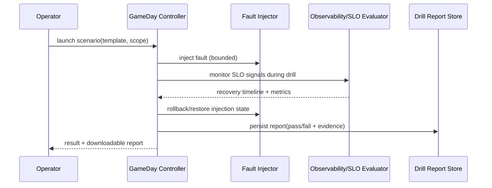

<DocMeta source="advanced feature proposal (T224)" scope="canonical" />

## Goal

Turn disaster-recovery and reliability drills into a repeatable product workflow:

1. schedule a drill,
2. inject controlled faults,
3. evaluate recovery/SLO criteria,
4. export a report with pass/fail evidence.

---

## Why this feature exists

The platform already defines mesh, routing, queue, and rollback resilience behavior. What is missing is a **first-class drill controller** so reliability does not stay a slide deck promise.

---

## Scope (v1)

### In scope

- Drill template catalog (node outage, queue backlog spike, route desync, unhealthy rollout)
- Scheduled and ad-hoc execution
- Fault injection adapters (safe, scoped, time-bounded)
- Automatic SLO checks and pass/fail scoring
- Drill report persistence + export (`json`, `markdown`, `csv`)

### Out of scope (v1)

- Autonomous remediation without operator approval
- Arbitrary user-defined scripting runtime in controller process
- Multi-region simultaneous destructive chaos campaigns

---

## Core model

```ts
type GameDayScenario = {
  id: string;
  name: string;
  faultType: "node_outage" | "queue_backlog" | "route_desync" | "health_failure";
  targetScope: { organizationId: string; projectId?: string; serviceId?: string };
  durationSec: number;
  expectedSLO: {
    maxRecoverySeconds: number;
    maxFailedDeployments: number;
    maxErrorRatePercent: number;
  };
};
```

Score model:

$$
score = w_1 \cdot recovery + w_2 \cdot errorRate + w_3 \cdot rollbackSuccess
$$

with pass/fail threshold configured per scenario template.

---

## Execution flow



---

## Safety boundaries

- Hard scope guardrails (cannot target outside requested org/project)
- Time-boxed injection with auto-revert fallback
- Max concurrent drills per org
- Emergency abort endpoint with mandatory reason and audit log

---

## Drill result taxonomy

- `gameday_pass`
- `gameday_fail_slo_recovery`
- `gameday_fail_error_budget`
- `gameday_fail_rollback`
- `gameday_abort_manual`
- `gameday_abort_safety_guard`
- `gameday_runner_error`

---

## Operator UX expectations

- Scenario templates list + prerequisites
- “Dry-run” check before injection
- Live drill timeline and current phase
- Post-drill report with:
  - timeline,
  - observed metrics,
  - pass/fail reasoning,
  - suggested corrective actions

---

## Test strategy

### Unit

- scenario validation
- score/pass-fail determinism
- safety guard logic

### Integration

- end-to-end controller → injector → evaluator → report store
- timeout and auto-revert correctness
- abort flow correctness + audit evidence

### E2E

- node outage drill passes when recovery within threshold
- queue backlog drill fails when SLO exceeds threshold
- report export includes all required evidence fields

---

## Definition of done

- Operators can run at least 3 built-in scenario templates safely
- Each drill produces queryable report artifacts
- pass/fail scoring is deterministic and documented
- abort + safety guard paths are tested
- migration tasks `T224` and `T226` are complete

---

## Task mapping

- `T224` — Resilience GameDay Controller baseline
- `T226` — UI/status surfaces for trust/cost/gameday

---

## Related docs

- [Deployment Trust Gate](/docs/deployment/deployment-trust-gate)
- [Cost Guardrail Engine](/docs/deployment/cost-guardrail-engine)
- [Migration Task Breakdown](/docs/deployment/migration-task-breakdown)
- [Registry, Monitoring & Advanced Features — Documentation Coverage](/docs/deployment/registry-monitoring-advanced-doc-coverage)
