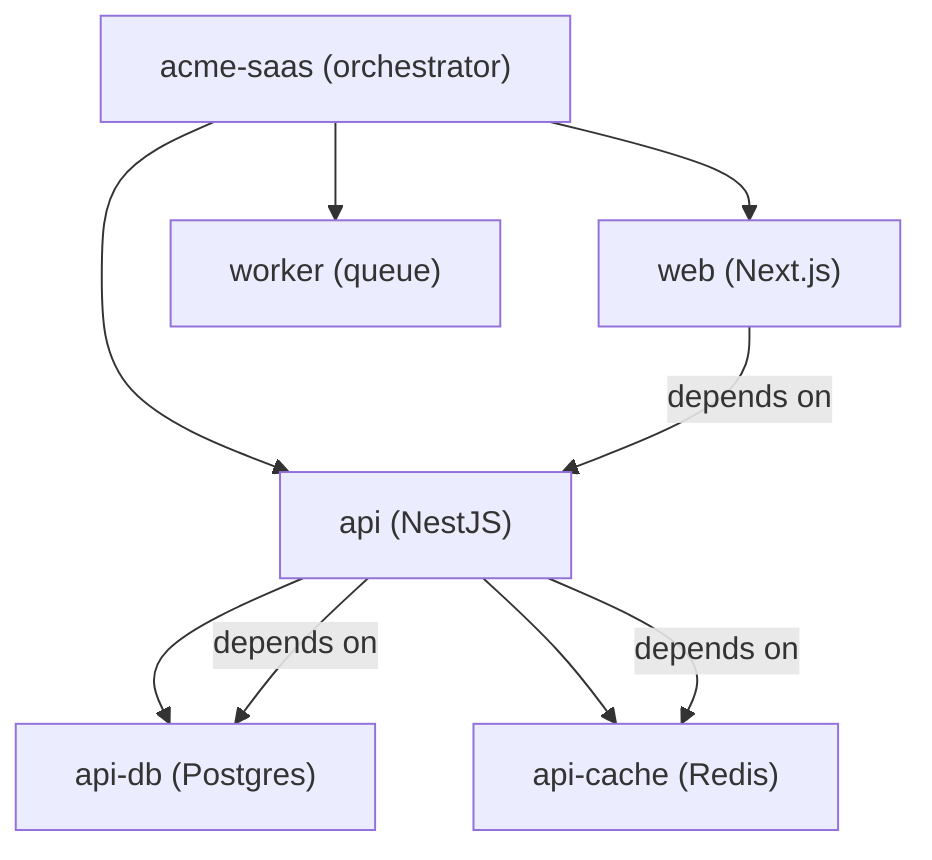
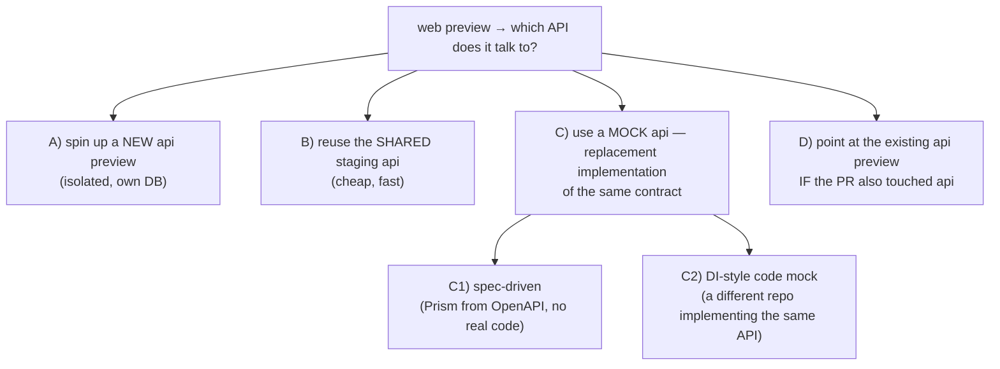
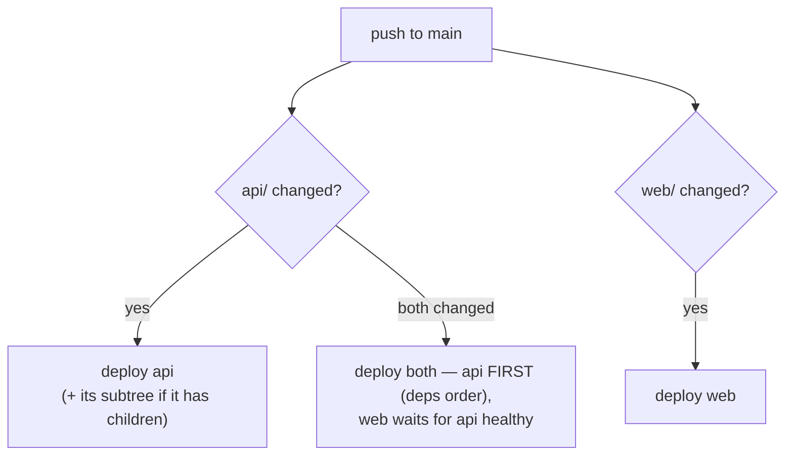
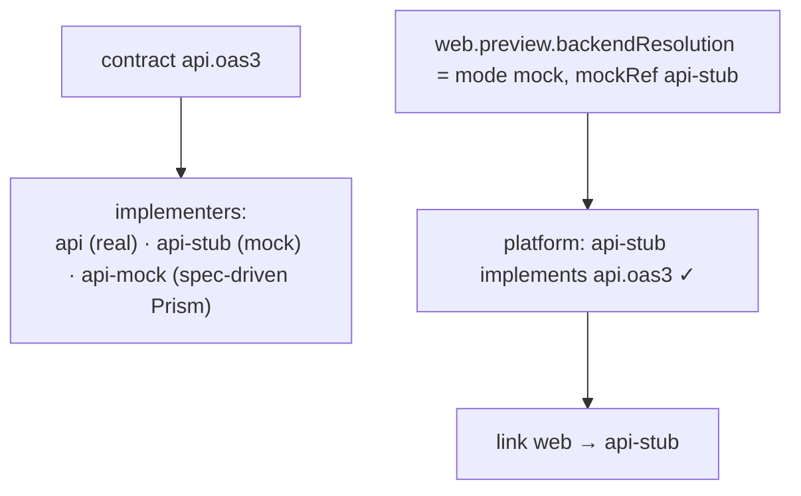
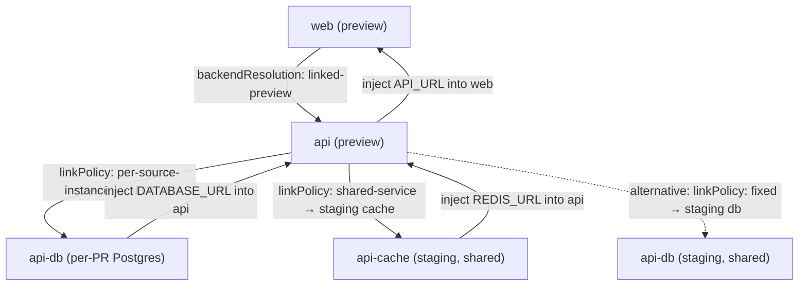
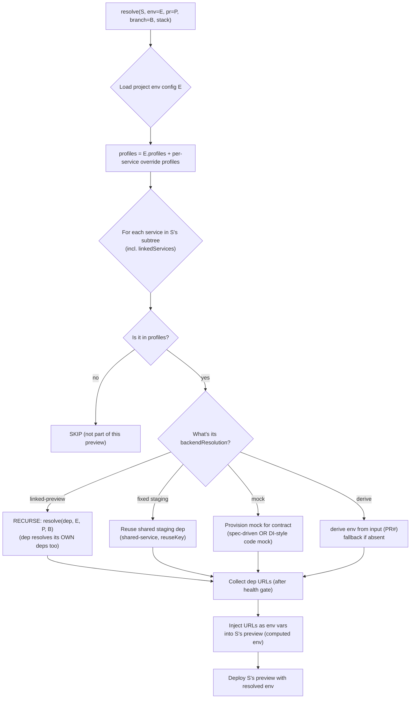
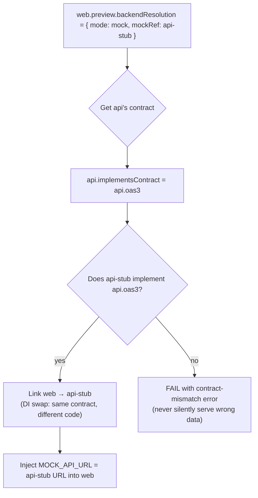
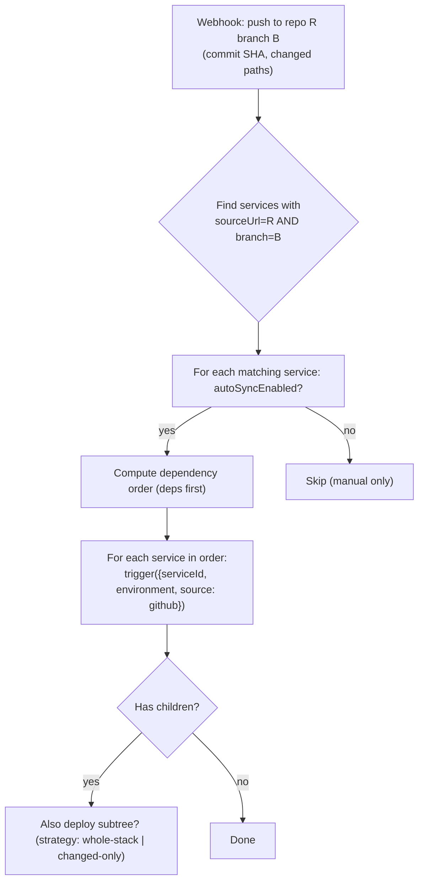

<DocCallout title="Scope" tone="info">
This is a **Proof-of-Concept design doc**. It explains *how* the platform can achieve three capabilities
— (1) every service deploys itself when its source updates, (2) preview deployments create the mock or
linked services they need based on configuration, and (3) a preview of the web app can choose between
"spin up a new API", "reuse the staging API", or "use a mock API" — purely from declarative config.
It maps every mechanism to **real products** (Vercel, Heroku Review Apps, GitLab Review Apps, Railway PR
Environments, Docker Compose profiles) and to the **schema primitives that already exist** in this repo.
</DocCallout>

<DocCallout title="What we mean by 'mock API'" tone="warning">
A mock is a **replacement implementation of the same contract** — like dependency injection at the
deployment level. Two flavors, both supported:

1. **Spec/behavior-driven mocks** — generated from a contract (OpenAPI → Prism, stubs → WireMock,
   fixtures → json-server). No real code, useful for UI previews.
2. **Code-based mocks (DI-style replacement)** — a *different codebase* that implements the *same
   interface*: e.g. `api` (NestJS, real) vs `api-stub` (a small Express app in another repo or branch)
   that both satisfy `contracts/api.oas3.yml`. The platform swaps the real service for the stub the same
   way code swaps `RealPaymentGateway` for `FakePaymentGateway`.

Both flavors resolve through the same mechanism: a service declares *"I implement contract X"* and the
link policy says *"for preview, use any service that implements contract X"*.
</DocCallout>

## The three capabilities

| # | Capability | Real-world analog | Already in this repo? |
|---|------------|-------------------|-----------------------|
| 1 | **Self-deploy on update** — a push to a service's repo/branch deploys just that service (or its subtree) | GitHub Actions path filters, Vercel monorepo skipping | `autoSyncEnabled` + `webhookEnabled` on the provider config; `deploymentTriggerInputSchema` with `pullRequestNumber` |
| 2 | **Preview creates linked services** — a preview of `web` spins up `api` (or reuses staging) based on config; **links chain transitively** (web→api→db, each hop independently resolved) | Heroku Review Apps (app.json), Railway PR Environments, GitLab Review Apps | `dependencyLinkTarget` (same/fixed/derived env) + `dependencyInstanceProvisioning` (shared/per-source/on-demand) |
| 3 | **Mock services in preview** — preview uses a replacement implementation of the same contract (spec-driven OR a DI-style mock built from another codebase) | MSW/WireMock/Prism (spec), **Pact consumer contracts + service virtualization** (code-based replacement) | **New**: needs a `mock` runner/service type + `implementsContract` + `mockSource` |

The key insight: **capability 2's schema already exists** (`serviceDependencyLinkPolicySchema`,
`dependencyInstanceProvisioningSchema`). Capability 1 mostly exists (trigger contract + autoSync flag, needs a
webhook → trigger bridge). Capability 3 needs a new service type **plus** a contract/interface model
(`implementsContract`) so the platform can prove a mock actually replaces the real service. This POC shows
how to wire them together into a coherent, deeply-configurable system.

---

## 1. The problem, precisely

A company runs a product as a **hierarchical project** (your sub-services system):



**When a developer opens a PR touching only `web`,** the platform must decide:



**And links chain** — the api preview itself must decide where its OWN dependencies live:

```mermaid
flowchart TD
    Q["api preview → which api-db / api-cache?"]
    Q --> N["NEW per-PR db<br/>full isolation: preview-&#123;pr&#125;-api-db"]
    Q --> S["SHARED staging<br/>reuse staging-api-db — cheap, shared data"]
```



So a full chain looks like: `web(preview) → api(preview) → api-db(new per-PR | staging)`. **Each hop
resolves independently** — that's the heart of the config model.

And **when the PR merges / a branch pushes**, the platform must decide which services redeploy:



None of this should be imperative code per project. It must be **declarative configuration** that the
platform interprets.

---

## 2. What already exists (build on this, don't reinvent)

### 2.1 Self-deploy trigger (capability 1 — mostly done)

The deployment trigger contract already accepts a GitHub source with **branch, commit SHA, and PR number**:

```ts
// packages/contracts/api/modules/deployment/crud.ts
export const githubTriggerSourceSchema = z.object({
  sourceType: z.literal("github"),
  repositoryUrl: z.string().min(1),
  branch: z.string().min(1).optional(),
  commitSha: z.string().min(1).optional(),
  pullRequestNumber: z.number().int().positive().optional(),   // ← the PR hook
}).strict()

export const deploymentTriggerInputSchema = z.object({
  serviceId: z.uuid(),
  environment: deploymentEnvironmentSchema.default("production"),
  source: deploymentTriggerSourceSchema,   // github | upload | custom
  execution: { builder, runner, runtimeRunnerOptions, healthChecks }.optional(),
})
```

And the provider config already has the auto-deploy flags:

```ts
// packages/contracts/entities/src/entities/service/provider-config.schema.ts
githubProviderConfigSchema = z.object({
  sourceUrl, branch, rootPath, buildContext, dockerfilePath, image,
  autoSyncEnabled: z.boolean(),   // ← auto-deploy on push
  webhookEnabled: z.boolean(),    // ← webhook registered
  authSecretRef,
}).strict()
```

**Gap:** there is no **webhook receiver** that (a) receives a GitHub push/PR event, (b) figures out which
services in the project match that `sourceUrl` + `branch`, (c) resolves their dependency order, and (d)
calls `trigger` for each. That bridge is the "self-deploy" engine (§5).

### 2.2 Dependency link target + provisioning (capability 2 — DONE, underused)

This is the crown jewel that already exists:

```ts
// packages/contracts/entities/src/entities/configuration/dependency-targeting.schema.ts
const dependencyLinkTargetSchema = z.discriminatedUnion('mode', [
  z.object({ mode: z.literal('same-environment') }),                          // same env as source
  z.object({ mode: z.literal('fixed-environment'),
             targetEnvironment: envNameSchema }),                            // e.g. always staging
  z.object({ mode: z.literal('derived-environment'),
             fromInputKey: z.string().min(1),
             fallbackEnvironment: envNameSchema }),                          // from PR#/branch input
])

const dependencyInstanceProvisioningSchema = z.discriminatedUnion('provisioningMode', [
  z.object({ provisioningMode: z.literal('shared-service'),
             sharingScope: z.enum(['project', 'environment', 'organization']),
             reuseKey: z.string().min(1),
             noMatchPolicy: z.enum(['create-new-instance', 'fail']).default('create-new-instance') }),
  z.object({ provisioningMode: z.literal('per-source-instance'),
             instanceNameTemplate: z.string().min(1),                        // e.g. "preview-{pr}-api"
             maxInstancesPerEnvironment: z.number().int().positive().optional(),
             noMatchPolicy: z.enum(['create-new-instance', 'fail']).default('create-new-instance') }),
  z.object({ provisioningMode: z.literal('on-demand-pool'),
             poolRef: z.string().min(1),
             warmInstances: z.number().int().nonnegative().default(0),
             scaleToZeroAfterSeconds: z.number().int().positive().optional(),
             noMatchPolicy: z.enum(['create-new-instance', 'fail']).default('create-new-instance') }),
])
```

**This is the entire "new api vs staging api vs pool" decision.** The four options from §1 map directly:

| Preview wants | `dependencyLinkPolicy` |
|---|---|
| **A) new isolated api preview** | `target: { mode: 'same-environment' }`, `provisioning: { provisioningMode: 'per-source-instance', instanceNameTemplate: 'preview-{pr}-api' }` |
| **B) shared staging api** | `target: { mode: 'fixed-environment', targetEnvironment: 'staging' }`, `provisioning: { provisioningMode: 'shared-service', sharingScope: 'environment', reuseKey: 'staging-api' }` |
| **C) mock api** | `target: { mode: 'same-environment' }` + the `api` sub-service has `type: 'mock'` in preview (§4) |
| **D) reuse existing api preview (same PR)** | `target: { mode: 'derived-environment', fromInputKey: 'pullRequestNumber', fallbackEnvironment: 'staging' }` |

And per-environment behavior knobs already exist:

```ts
// packages/contracts/common/src/dependency.schema.ts
dependencyRequirementModeSchema = z.enum(['required', 'optional', 'disabled'])
dependencyHealthGateSchema      = z.enum(['must-pass', 'warn', 'ignore'])
dependencyStartupModeSchema     = z.enum(['before', 'parallel', 'after'])
dependencyAttachmentModeSchema  = z.enum(['single-target', 'multi-target-filtered'])
```

Plus per-environment **execution overrides** per service:

```ts
// packages/contracts/entities/src/entities/configuration/service-overrides.schema.ts
serviceEnvironmentExecutionOverrideSchema = z.object({
  disabled: z.boolean().optional(),          // e.g. worker disabled in preview
  replicas: { min, max }.optional(),         // e.g. api preview runs 1 replica
  strategy: serviceRunnerStrategySchema.optional(),
  providerRefOverride: z.string().optional(),  // e.g. api preview uses a different source ref
  runnerRefOverride: z.string().optional(),
  dependencyBehavior: serviceEnvironmentDependencyBehaviorSchema.optional(),
  dependencyLinkPolicy: serviceDependencyLinkPolicySchema.optional(),  // ← the killer
})
```

### 2.3 Preview environment read model (exists)

```ts
// packages/contracts/api/modules/deployment/previews.ts
previewEnvironmentSchema = z.object({
  id, subdomain, fullDomain, sslEnabled, isActive, webhookTriggered,
  expiresAt, deploymentId,
  metadata: { pullRequestUrl, branchName, lastAccessedAt, accessCount }.nullable().optional(),
})
```

---

## 3. The proposed configuration model (POC)

A **layered config stack**, mirroring Docker Compose merge semantics, Vercel/Netlify env scoping, and Heroku
app.json — base → environment → branch → preview override. Most-specific wins.

### 3.1 Layer 0 — Service base config (already exists)

Every service has its own config (provider, runner, port, env, health check, resource limits) and
**inherits from its parent** via the `effectiveConfig` merge (§ see the sub-services rework). That's the
namespace baseline.

### 3.2 Layer 1 — Project environment config (exists, extend it)

```ts
// packages/contracts/entities/src/entities/configuration/project-environment.schema.ts
projectBaseEnvironmentConfigSchema = z.object({
  variables: z.record(z.string(), z.string()),       // env vars for ALL services in this env
  autoDeployEnabled: z.boolean(),                   // ← self-deploy gate per environment
  deploymentStrategy: ...,
  healthGate: ...,
  startupMode: ...,
  replicas: { min, max },
  trafficPolicy: {...},
})
projectEnvironmentConfigByNameSchema = z.object({
  production: projectBaseEnvironmentConfigSchema,
  preview: projectPreviewEnvironmentConfigSchema.optional(),
  development: projectDevelopmentEnvironmentConfigSchema.optional(),
}).catchall(projectBaseEnvironmentConfigSchema)
```

**Proposed extension** — a `profiles` array (Compose-style) so an environment can toggle optional services:

```ts
// proposed
projectEnvironmentConfigSchema = projectBaseEnvironmentConfigSchema.extend({
  /** Compose-profile style: which optional services participate in this env. */
  profiles: z.array(z.string()).default([]),
  /** TTL for auto-created preview infra (Railway/GitLab auto_stop_in). */
  previewTtlHours: z.number().int().positive().default(72),
  /** Whether previews of this env auto-destroy on PR close. */
  destroyOnMerge: z.boolean().default(true),
})
```

### 3.3 Layer 2 — Per-service per-environment override (exists)

Already covered (§2.2) — `serviceEnvironmentExecutionOverrideByEnvSchema` with `dependencyLinkPolicy`,
`disabled`, `replicas`, `strategy`, `providerRefOverride`.

**Proposed extension** — per-service **preview template** (what a preview of THIS service should be):

```ts
// proposed — packages/contracts/entities/src/entities/configuration/preview-template.schema.ts
export const previewSourceTemplateSchema = z.object({
  /** How the preview chooses its backend. */
  backendResolution: z.discriminatedUnion('mode', [
    z.object({ mode: z.literal('linked-preview') }),      // spin up the dep's own preview
    z.object({ mode: z.literal('fixed'), targetEnvironment: envNameSchema }), // use staging
    z.object({ mode: z.literal('mock'), mockRef: z.string().min(1) }),         // replace with a mock
    z.object({ mode: z.literal('derive'),
               fromInputKey: z.string().min(1), fallbackEnvironment: envNameSchema }),
  ]).default({ mode: 'linked-preview' }),
  /** Services to spin up alongside this preview (Railway Focused-PR / compose profiles). */
  linkedServices: z.array(z.object({
    serviceId: z.string().min(1),          // a sub-service id
    mode: z.enum(['inherit', 'mock', 'fixed']).default('inherit'),
    fixedEnvironment: envNameSchema.optional(),
  })).default([]),
  /** Custom domains / subdomain template for this preview. */
  subdomainTemplate: z.string().default('{branch}-{service}'),
})
```

> **`backendResolution.mode = 'mock'`** no longer hardcodes an engine. `mockRef` points at a *mock
> service definition* (see §3.4) — which may be spec-driven **or** a DI-style code replacement. The
> platform resolves the ref, then links the dep to whichever mock implements the same contract.

### 3.4 Layer 3 — Mock services (NEW, two flavors)

A mock is **a replacement implementation of the same contract**. Two flavors, both first-class:

| Flavor | What it is | Engine/source | Real-world analog |
|--------|-----------|---------------|-------------------|
| **Spec-driven** | No real code — generated from a contract/fixtures | Prism (OpenAPI), WireMock (stubs), json-server (fixtures) | MSW, Stoplight Prism, WireMock |
| **Code-based (DI-style)** | A *different codebase* that implements the same interface as the real service | any builder/runner (docker, static, worker) with `providerRef` pointing at the mock repo/branch | Service virtualization (CA DevTest), **Pact contract-based mock providers**, `FakePaymentGateway` vs `RealPaymentGateway` |

```ts
// proposed — packages/contracts/entities/src/entities/service/mock-config.schema.ts
export const mockEngineSchema = z.enum(['prism', 'wiremock', 'json-server'])

/** The contract this mock REPLACES (dependency-injection semantics). */
export const implementedContractSchema = z.object({
  contractRef: z.string().min(1),              // e.g. "api.oas3" — resolved from the contract registry
  compatibility: z.enum(['http', 'grpc', 'events']).default('http'),
})

export const mockServiceConfigSchema = z.object({
  /** What contract this mock satisfies (proves it can replace the real service). */
  implements: implementedContractSchema,

  /** Flavor A — spec-driven: generated from a contract/fixtures. */
  engine: mockEngineSchema.optional(),
  source: z.discriminatedUnion('kind', [
    z.object({ kind: z.literal('openapi'), specPath: z.string().min(1) }),       // → Prism
    z.object({ kind: z.literal('stub-dir'), mappingsDir: z.string().min(1) }),   // → WireMock
    z.object({ kind: z.literal('db-file'), dbPath: z.string().min(1) }),         // → json-server
    z.object({ kind: z.literal('recorded'), targetUrl: z.string().min(1) }),     // → WireMock record/replay
  ]).optional(),

  /** Flavor B — code-based (DI-style): a real codebase implementing the same contract. */
  // The mock is itself a normal service row (runner + providerConfig); this only
  // declares the replacement relationship. `providerRefOverride` on the env
  // override points it at the mock's repo/branch/folder.

  /** Response behavior tuning (spec-driven only). */
  behavior: z.object({
    latencyMs: z.number().int().nonnegative().default(0),
    failRatePercent: z.number().min(0).max(100).default(0),
  }).default({}),
  /** Whether this mock is only present in preview (default true). */
  previewOnly: z.boolean().default(true),
})
```

A `mock` service is then just a normal sub-service whose `runnerId = 'mock'` and
`runnerConfig = mockServiceConfigSchema`. It inherits config, has a port, participates in the dependency
graph, and can be targeted by `backendResolution: { mode: 'mock', mockRef }`.

**The DI-style mock in practice** — "replace the service with a mock API from another code":

```yaml
# real api — declares the contract it implements
api:
  parent: acme-saas
  runner: docker
  implementsContract: { contractRef: api.oas3, compatibility: http }

# DI-style mock — SAME contract, DIFFERENT codebase
api-stub:
  parent: acme-saas
  runner: docker                       # builds its own Dockerfile
  provider: { sourceUrl: github.com/acme/api-stub, branch: main }   # another repo!
  implementsContract: { contractRef: api.oas3, compatibility: http }

# web's preview: swap api → api-stub (same way DI swaps a real for a fake)
web:
  preview:
    backendResolution: { mode: mock, mockRef: api-stub }
```

The platform **validates the swap**: before linking `web → api-stub`, it checks
`api-stub.implements.contractRef === api.implementsContract.contractRef`. If they diverge, the preview
fails with a clear "contract mismatch" error instead of silently serving wrong data.

### 3.5 Layer 4 — Contract registry (NEW, the DI "interface")

To prove a mock actually replaces a service, the platform needs a registry of contracts (the "interface"
in DI terms):

```ts
// proposed — packages/contracts/entities/src/entities/configuration/contract-registry.schema.ts
export const serviceContractRegistrySchema = z.object({
  /** Unique contract id, e.g. "api.oas3", "checkout.payment", "user.events". */
  contractRef: z.string().min(1),
  /** Where the contract definition lives (OpenAPI file, protobuf, event schema). */
  source: z.discriminatedUnion('kind', [
    z.object({ kind: z.literal('openapi'), path: z.string().min(1) }),
    z.object({ kind: z.literal('proto'), path: z.string().min(1) }),
    z.object({ kind: z.literal('json-schema'), path: z.string().min(1) }),
  ]),
  /** Version to enforce compatibility. */
  version: z.string().min(1).default('1'),
})
```

**How the swap resolves (contract → implementations):**



The registry also powers **auto-discovery**: if no explicit `mockRef` is given, the platform can pick the
first mock implementer of the dep's contract (deterministic, configurable order).

---

## 4. The resolution algorithm (POC)

### 4.0 Chained / transitive resolution — the core idea

Links **chain**: a service links to a dependency, which itself links to its own dependencies — and **each
hop resolves independently**. `web → api → api-db` can resolve as:

```
web  (preview)   ──backendResolution──►  api    (preview: spin up new api)
api  (preview)   ──dependencyLinkPolicy─► api-db (per-source-instance: new DB per PR)
                                        OR api-db (fixed: shared staging DB)
api  (preview)   ──dependencyLinkPolicy─► api-cache (shared: reuse staging cache)
```

So "link a service to another service that also links to staging or to a new service for a new DB" is
exactly this: **the link graph is walked depth-first, each node applies ITS OWN policy, and URLs are
computed bottom-up** (a service's URL depends on the URLs of everything below it, which must resolve
first).



**The two config surfaces (one per hop):**

| Hop | Config that decides it | Where it lives |
|-----|------------------------|----------------|
| `web` → `api` | `preview.backendResolution` (linked-preview / fixed / mock / derive) | the *consumer's* preview template (§3.3) |
| `api` → `api-db` | `api.environment.<env>.dependencyLinkPolicy` (target + provisioning) | the *consumer's* per-env override (§2.2, already exists) |

A hop with `linked-preview` means *"resolve my dependency the same way I was resolved"* — recursion. A hop
with `fixed` / `mock` / `per-source-instance` stops the recursion at that node.

### 4.1 The full recursive resolution

When a preview deployment is requested for service S in environment E, the platform:



**The env injection is the critical step** (the #1 pain point in real life — see §6): the platform computes
`API_URL`, `DATABASE_URL` etc. from the *actual* provisioned sibling previews and injects them, instead of
requiring a human to maintain per-branch env vars.

```ts
// proposed — computed env injection, recursive (bottom-up)
async function resolveServicePreview(S, envKey, input): Promise<ResolvedService> {
  // 1. Resolve EVERY dependency first (deps-first, so URLs are available).
  const depResults = []
  for (const D of S.dependencies) {
    const policy = S.environment[envKey].dependencyLinkPolicy ?? defaultPolicy
    switch (policy.target.mode) {
      case 'same-environment':
        // RECURSE: the dep's own preview (and its deps' previews) resolve first.
        depResults.push(await resolveServicePreview(D, envKey, input))
        break
      case 'fixed-environment':
        depResults.push({ service: D, url: registry.getEnvironmentUrl(D.id, policy.target.targetEnvironment) })
        break
      case 'derived-environment':
        const env = input[policy.target.fromInputKey] ?? policy.target.fallbackEnvironment
        depResults.push({ service: D, url: registry.getEnvironmentUrl(D.id, env) })
        break
    }
  }

  // 2. Map each dep's resolved URL into this service's env vars.
  const env = { ...S.environmentVariables }
  for (const dep of depResults) {
    env[`${dep.service.name.toUpperCase()}_URL`] = dep.url
  }

  // 3. Deploy THIS service with the computed env; register its URL for parents.
  const deployment = await trigger({ serviceId: S.id, environment: envKey, source: input.source })
  const url = await registry.waitForUrl(S.id, envKey, deployment.id)   // health-gated
  registry.register(S.id, envKey, url)
  return { service: S, url, deps: depResults }
}
```

### 4.2 Contract-aware mock resolution (the DI swap)

When a hop resolves to `mode: 'mock'`, the platform picks the mock **by contract**, not by name:



**Auto-discovery variant** (no explicit `mockRef`): the platform finds the first mock implementer of the
dep's contract from the contract registry (§3.5) — `contract api.oas3 → [api (real), api-stub (code),
api-mock (prism)]` → picks the mock.

### 4.3 Self-deploy resolution (capability 1)



Two subtree strategies (configurable on the parent service):

| Strategy | Behavior | Analog |
|---|---|---|
| `whole-stack` | Every push to the parent repo deploys parent + ALL children in dep order | Docker Compose `up`, Portainer stack |
| `changed-only` | Use changed-paths (from the webhook) to deploy only affected services; parent deploys only if its own files changed | GitHub `paths:` filters, Vercel monorepo skipping |

```ts
// proposed — on the orchestrator/sub-services service type
orchestratorRunnerConfigSchema.extend({
  autoDeploySubtree: z.enum(['whole-stack', 'changed-only']).default('whole-stack'),
  /** PR previews: whole product or only touched services. */
  previewScope: z.enum(['whole-stack', 'changed-only']).default('whole-stack'),
})
```

---

## 5. Real-world patterns mapped to our config

### 5.1 Vercel — the cross-link gap we fix

Vercel injects `VERCEL_GIT_PULL_REQUEST_ID`, `VERCEL_BRANCH_URL`, `VERCEL_ENV`; the web preview derives the
API preview URL by **naming convention** (`<api-project>-git-<branch>-<scope>.vercel.app`). It does NOT
inject the sibling's URL. Our system does it properly: `backendResolution: { mode: 'linked-preview' }` →
platform provisions the API preview, waits for health, injects the real URL. **We exceed Vercel.**

```yaml
# web service, preview override
preview:
  backendResolution: { mode: linked-preview }   # new api preview, URL injected
```

### 5.2 Heroku Review Apps — the app.json model

Heroku's `app.json` declares `env`, `addons` (Postgres per review app!), `formation`, `postdeploy`.
Each PR gets an isolated app + its own DB. Our equivalent:

```yaml
# api-db sub-service, preview override
preview:
  mode: linked-preview          # provision a fresh Postgres per PR
  replicas: { min: 1, max: 1 }  # ephemeral plan = 1 replica
```

And the "web preview reuses staging API" = Heroku pipeline review-app config var `API_URL` → staging:

```yaml
# web service, preview override
preview:
  backendResolution: { mode: fixed, targetEnvironment: staging }
```

### 5.3 GitLab Review Apps — dynamic env + TTL

GitLab names envs `review/$CI_COMMIT_REF_SLUG`, gives wildcard-DNS URLs, auto-stops with `auto_stop_in`.
Our equivalent: `subdomainTemplate: '{branch}-{service}'`, `projectEnvironmentConfig.previewTtlHours: 72`,
`destroyOnMerge: true`.

### 5.4 Railway PR Environments — focused vs full

Railway replicates the whole base env per PR, OR uses "Focused PR Environments" (frontend-only PRs reuse
prod backend). Our equivalent: `previewScope: 'changed-only'` + `backendResolution: { mode: 'fixed', targetEnvironment: 'production' }` for frontend-only PRs.

### 5.5 Docker Compose profiles — the mock toggle

Compose `profiles: [preview]` starts a service only when `--profile preview` is used. Our equivalent:
a `mock-api` sub-service with `preview.profiles: ['preview']` — present in preview, absent in prod. One
manifest, no fork.

---

## 6. The complete example — "Acme SaaS"

```yaml
# project: acme-saas  (projectEnvironmentConfigByName)
environments:
  production:
    variables: { NODE_ENV: production }
    autoDeployEnabled: true
    profiles: []                    # no mocks in prod
  staging:
    variables: { NODE_ENV: staging }
    autoDeployEnabled: true
    profiles: []                    # real services, shared
  preview:
    variables: { NODE_ENV: preview }
    autoDeployEnabled: true
    profiles: [preview]             # mocks allowed
    previewTtlHours: 72
    destroyOnMerge: true
```

```yaml
# services
acme-saas:                          # orchestrator (parent)
  type: sub-services
  provider: { sourceUrl: github.com/acme/saas, branch: main, autoSyncEnabled: true, webhookEnabled: true }
  runner: orchestrator
  runnerConfig:
    autoDeploySubtree: changed-only     # §4.3: only touch affected services
    previewScope: changed-only

web:
  parent: acme-saas
  runner: static
  preview:                              # §3.3 — the "web preview" decision
    backendResolution: { mode: linked-preview }   # new api preview, URL injected
    # OR staging-only:  { mode: fixed, targetEnvironment: staging }
    # OR DI mock:       { mode: mock, mockRef: api-stub }   # swap api → api-stub (same contract)

api:
  parent: acme-saas
  runner: docker
  implementsContract: { contractRef: api.oas3, compatibility: http }   # §3.5
  environment: preview
    dependencyLinkPolicy:             # CHAINED hop #2 — how THIS service resolves ITS deps
      target: { mode: same-environment }                 # api preview talks to ITS db preview
      provisioning: { provisioningMode: per-source-instance,
                      instanceNameTemplate: 'preview-{pr}-api-db' }
      # OR share staging db instead of a new one:
      # target: { mode: fixed-environment, targetEnvironment: staging }
      # provisioning: { provisioningMode: shared-service, sharingScope: environment, reuseKey: staging-api-db }
  environment: staging
    dependencyLinkPolicy:
      target: { mode: fixed-environment, targetEnvironment: staging }
      provisioning: { provisioningMode: shared-service, sharingScope: environment, reuseKey: staging-api-db }

api-db:
  parent: api
  runner: docker
  image: postgres:16-alpine
  environment: preview:
    replicas: { min: 1, max: 1 }        # cheap ephemeral
    startupMode: before                 # db before api (depends_on: service_healthy)

# DI-style code mock — SAME contract (api.oas3), DIFFERENT codebase
api-stub:                               # §3.4 flavor B — "mock api from another code"
  parent: acme-saas
  runner: docker
  provider: { sourceUrl: github.com/acme/api-stub, branch: main }   # another repo
  implementsContract: { contractRef: api.oas3, compatibility: http } # proves it replaces api
  previewOnly: true

mock-api:                               # §3.4 flavor A — spec-driven mock (Prism from OpenAPI)
  parent: acme-saas
  runner: mock                          # new runner id
  runnerConfig:
    implements: { contractRef: api.oas3, compatibility: http }
    engine: prism
    source: { kind: openapi, specPath: contracts/api.oas3.yml }
    previewOnly: true                   # never in prod
```

**What happens on PR #42 touching only `web/`** (chained resolution, §4.1):

1. Webhook → resolve → only `web` matched, `autoSyncEnabled` → trigger web preview.
2. `web.preview.backendResolution = linked-preview` → **RECURSE**: resolve `api` preview.
3. `api` in preview: `per-source-instance` db → **RECURSE/chain**: provisions `preview-42-api-db`,
   waits healthy → injects `DATABASE_URL` into `api`'s env. (If the config instead said
   `fixed → staging`, this hop would NOT recurse — it would reuse the shared staging DB.)
4. `api` preview builds from PR #42's api code (if changed) or the base branch (if not); platform
   registers its URL.
5. Platform computes `API_URL = https://api-preview-42.<domain>` and injects into web's build env
   (bottom-up: db URL → api URL → web URL).
6. web preview deploys with `API_URL` set. PR comment shows the whole chain: web ✓, api ✓, db ✓.
7. PR closes → `destroyOnMerge` → all preview infra torn down.

**Same PR, but with the DI mock instead** (contract-aware swap, §4.2):

1. `web.preview.backendResolution = { mode: mock, mockRef: api-stub }`.
2. Platform checks `api-stub.implements.contractRef === api.implementsContract.contractRef`
   (`api.oas3` === `api.oas3`) → **swap valid**.
3. `api-stub` builds from `github.com/acme/api-stub`, not the real api repo — no backend code needed.
4. web's env gets `API_URL = https://api-stub-preview-42.<domain>`. UI previews against a faithful
   stub that speaks the real API's contract.

---

## 7. POC implementation plan

| Step | Work | Files |
|------|------|-------|
| 1 | Add `mock` runner type + `mockServiceConfigSchema` (both flavors) + `implementsContract` on the service entity | `packages/contracts/common/src/provider-runner.schema.ts`, `packages/contracts/entities/src/entities/service/runner-config.schema.ts`, `service.schema.ts` |
| 2 | Add `serviceContractRegistrySchema` (contract registry) + `previewSourceTemplateSchema` + extend `projectEnvironmentConfigSchema` (profiles, TTL, destroyOnMerge) | `packages/contracts/entities/src/entities/configuration/` |
| 3 | Add `autoDeploySubtree` + `previewScope` to orchestrator runner config | `packages/contracts/entities/src/entities/service/runner-config.schema.ts` |
| 4 | Webhook receiver service: GitHub push/PR event → match services → order → trigger | `apps/api/src/modules/deployment/` |
| 5 | Preview topology planner: **recursive** resolution (walk dep graph bottom-up, apply each hop's policy, contract-validate mocks) | `apps/api/src/modules/preview/` (new) |
| 6 | Preview URL registry: after each preview deploy, record `serviceId → envKey → URL`; computed env injection | `apps/api/src/modules/preview/registry.ts` (new) |
| 7 | Mock runner executor: run prism/wiremock/json-server (flavor A) + docker/static builds (flavor B) from `mockServiceConfigSchema` | `apps/api/src/modules/runners/` |
| 8 | Web: preview tab shows the resolved **chain** (web→api→db, with per-hop resolution labels + mock badges) + live URLs + TTL countdown | `apps/web/src/app/dashboard/.../previews/` |
| 9 | Docs: extend this POC + `environment-linked-service-dependencies.mdx` | `apps/doc/content/docs/deployment/` |

**Validation gates (per repo rules):** zod-as-truth for every new schema, zero type assertions, unit tests for
the planner (the recursive resolution is pure — perfect for `*.spec.ts`: test each hop mode, the
contract-mismatch failure, and the shared-vs-new-db branching), docs in the same change set.

---

## 8. Chained linking patterns — "link to a service that also links to staging or a new DB"

The **reference chain** is the deepest config surface: any service can link to a dependency that itself
resolves its own dependencies differently per environment. Four recurring real-world chains:

### 8.1 New-API → new-DB (full isolation)

```yaml
web:  { preview: { backendResolution: { mode: linked-preview } } }   # new api preview
api:  { environment.preview.dependencyLinkPolicy:
         target: { mode: same-environment } }                        # its OWN new db
# chain: web(preview) → api(preview) → api-db(per-source-instance: preview-{pr}-api-db)
```
Use when the PR touches backend logic / schema — Heroku Review App + per-PR Postgres model.

### 8.2 New-API → shared-staging-DB (cheap isolation)

```yaml
web:  { preview: { backendResolution: { mode: linked-preview } } }   # new api preview
api:  { environment.preview.dependencyLinkPolicy:
         target: { mode: fixed-environment, targetEnvironment: staging },
         provisioning: { provisioningMode: shared-service, sharingScope: environment, reuseKey: staging-api-db } }
# chain: web(preview) → api(preview) → api-db(STAGING, shared — NOT recursed)
```
Use when the API changes are code-only (no migrations) — get an isolated API without paying for a DB.

### 8.3 Web-mock → (no backend at all) (DI-style mock)

```yaml
web:  { preview: { backendResolution: { mode: mock, mockRef: api-stub } } }   # swap api → api-stub
# chain stops at the swap: web(preview) → api-stub(same contract, different code)
```
Use for frontend-only PRs — no backend infrastructure spun up at all.

### 8.4 Web-staging → staging-API → staging-DB (fully shared)

```yaml
web:  { preview: { backendResolution: { mode: fixed, targetEnvironment: staging } } }
# chain: web(preview) → staging api → staging db — everything shared, zero provisioning
```
Use for cosmetic/UI-only changes — Railway's "Focused PR Environments" model.

### 8.5 Mixed chain (the full power)

```yaml
web:  { preview: { backendResolution: { mode: linked-preview } } }      # new web
api:  { environment.preview.dependencyLinkPolicy:
         target: { mode: same-environment },                            # new api
         provisioning: { provisioningMode: per-source-instance, instanceNameTemplate: 'preview-{pr}-api' } }
api-db: { environment.preview.dependencyLinkPolicy:
            target: { mode: fixed-environment, targetEnvironment: staging },
            provisioning: { provisioningMode: shared-service, sharingScope: environment, reuseKey: staging-api-db } }
# chain: web(preview) → api(preview, new) → api-db(staging, shared)
#        api(preview) → api-cache(staging, shared)
```
**This is "link a service to another service that also links to staging or a new service"**: each hop
decides independently — `api` gets a NEW instance, but its DB and cache are SHARED from staging.

---

## 9. What this buys over every real product

| Product | Self-deploy on update | Per-PR linked services | Reuse staging | Mock in preview | Chained links | Computed env injection |
|---------|----------------------|------------------------|---------------|-----------------|---------------|------------------------|
| Vercel | ✓ (per project) | ✗ (naming convention) | partial (custom envs) | MSW only (client) | ✗ | ✗ |
| Netlify | ✓ | ✗ (static env only) | ✓ (context values) | MSW only | ✗ | ✗ |
| Heroku | ✓ (app.json+auto) | ✓ (app.json addons) | ✓ (pipeline vars) | ✗ | ✗ (per-app, no chaining) | partial (postdeploy) |
| GitLab Review Apps | ✓ (CI) | ✓ (compose up) | ✓ (manual) | CI-dependent | ✗ (compose is one unit) | ✗ |
| Railway | ✓ | ✓ (full env) | ✓ (Focused PR) | ✗ | partial (env-level) | ✓ (service discovery) |
| **This design** | ✓ changed-only/whole-stack | ✓ per-source-instance | ✓ fixed/shared | ✓ **first-class mock (spec + DI-style code)** | ✓ **per-hop resolution** | ✓ registry-injected |

The **unique differentiators** of this design are: (1) **mock services as first-class config in two
flavors** — spec-driven (Prism/WireMock from an OpenAPI spec) AND **DI-style code replacement** (a mock
built from another repo that implements the same contract, contract-validated before swap), (2)
**chained/transitive link resolution** — every hop in `web → api → db` resolves independently (new
instance vs shared staging vs mock), and (3) **computed env injection from the live preview registry**
(the exact gap Vercel #12993 / Netlify static-env users keep hitting) — all built on the
`dependencyLinkTarget`/`dependencyInstanceProvisioning` primitives that already exist in this repo.
