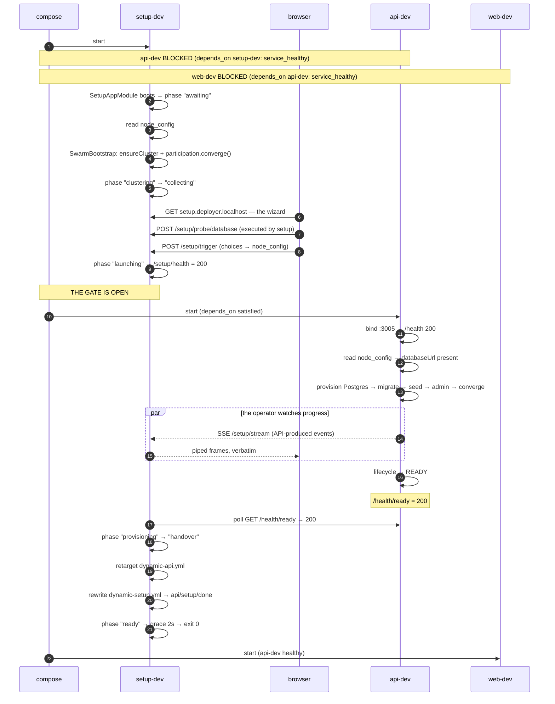
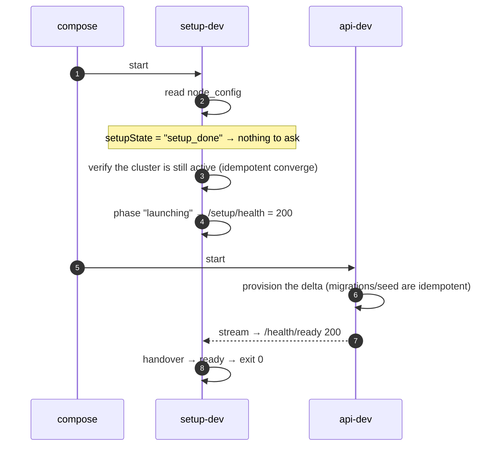
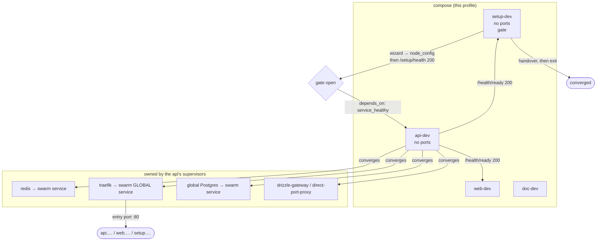
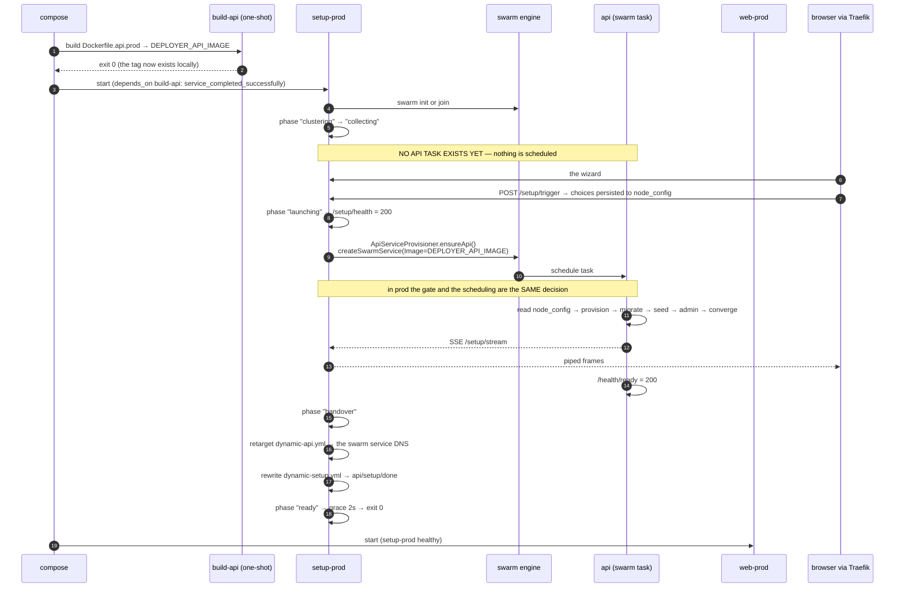

<DocMeta source="apps/doc/content/docs/deployment/startup-order.mdx" scope="canonical" />

<DocCallout title="Why this page exists" tone="info">
The two-app model has **one ordering rule** (the API never starts before setup opens the gate) but
**three different mechanisms** for achieving it, because who owns the API differs per profile. This
page shows the sequence for each, and names the single line of compose that makes it work.

Read `onboarding-and-lifecycle.mdx` for the access matrix and the failure playbook; read this page
to understand *when* each process starts.
</DocCallout>

## The invariant, stated once

> **The API is a converged-platform process. It does not exist until setup opens the gate.**

Earlier drafts ran the API from the start in a degraded "not ready yet" mode and had setup drive it
over HTTP. That is the arrangement this document replaces: it made every readiness report a
negotiation between two processes, and it left a half-provisioned API listening on the platform.

The gate is inverted, and it is a plain compose dependency chain:

```text
setup ──healthy──▶ api ──healthy──▶ web
```

| Service | Its `healthcheck` answers | Which means |
|---|---|---|
| `setup` | `GET /setup/health` | *"the platform may start the API"* — 200 only once the wizard has everything it needs, or a previous run already finished |
| `api` | `GET /health/ready` | *"the platform works"* — 200 only once Postgres, swarm, every supervisor and mesh are green |
| `web` | its own probe | *"the dashboard can render"* |

**Setup's health does NOT depend on the API.** That is what makes the chain acyclic: setup becomes
healthy because the *operator* finished the wizard (or because a previous run already did), never
because it observed someone else's process. The API then starts, provisions itself, and becomes
healthy on its own.

This is the correction to the earlier design's §8.5 "deadlock": there is no cycle to avoid, because
the two processes never gate on each other. One edge, one direction.

---

## What each process owns

| Concern | setup | api |
|---|---|---|
| The wizard UI (`setup.<host>`) | **yes** | — |
| Swarm init/join, node policy | **yes** | — |
| Probe a candidate database | **yes** | — |
| Persist the wizard's choices to `node_config` | **yes** (single writer) | reads only |
| **Open the gate** (`/setup/health` → 200) | **yes** | — |
| Global Postgres provisioning | — | **yes** |
| Migrations, seed, default admin | — | **yes** |
| Converge traefik / redis / global-db | — | **yes** |
| Report progress | reads the API's stream | **produces** |
| Retarget the ingress, then exit | **yes** | — |

The wizard **collects**; the API **executes**. Setup never provisions anything itself — it has no
Drizzle schema, no migrations and no auth stack, and duplicating them would be a second
implementation of the same platform.

---

## Profile 1 — dev (`docker-compose.dev.yml`)

Compose owns the platform services **and** the API, and now also owns the *ordering*: the API is
not started until setup is healthy.



### The restart case — setup already done

Identical code path, one shortcut: the wizard is **not** shown, because there is nothing to collect.



Both runs converge on the **same** sequence. The only difference is whether the browser was
involved, which is why there is one code path and not two modes.

---

## Profile 2 — dev-supervised (`docker-compose.dev-supervised.yml`)

Same ordering chain as dev. What changes is *who converges the platform services*: compose manages
none of them, so the API's supervisors do — after the gate opens, exactly like everything else the
API owns.



| Concern | Owner in this profile | In plain `dev` |
|---|---|---|
| redis | **API supervisor** | compose |
| traefik | **API supervisor** | compose |
| global Postgres | **API** (`PostgresServiceProvisioner`) | API (same) |
| drizzle-gateway | **API supervisor** | compose |
| swarm init/join | **setup** (before the gate) | setup |
| the API process | compose, gated on setup | compose, gated on setup |

<DocCallout title="Stream safety is now structural, not a timing trick" tone="success">
Earlier designs had to reason carefully about the wizard's SSE stream surviving an ingress swap,
because the browser's connection flowed through the port that was changing hands.

That concern is gone. The wizard is served by **setup** and stays on setup for the whole of
onboarding — the ingress is never retargeted mid-wizard. Setup rewrites `dynamic-api.yml` only after
the API is already green, by which time the form was submitted long ago.
</DocCallout>

---

## Profile 3 — prod (`docker-compose.prod.yml`)

**Setup is the entry point**, and the API is not a compose service at all:

- a compose container would sit outside the cluster setup just built — no placement, no cross-node
  restart policy, no `service ls` visibility;
- and "start the API only when the gate opens" is exactly what scheduling a swarm task means.



**Why `web-prod` gates on `setup-prod`:** the API is a swarm task, so compose cannot observe its
health. Gating on setup is the same guarantee by the only route compose has — and it is honest
here, because setup reports `ready` only after it has watched the API turn green and handed the
ingress over.

### The single variable that differs between local and real prod

| Environment | `DEPLOYER_API_IMAGE` | What setup does |
|---|---|---|
| Local (`compose up --build`) | `deployer-api:local` (just built by `build-api`) | schedules a service from the local tag |
| Real deploy | `ghcr.io/<owner>/deployer:<tag>` | identical code path; the engine pulls |

Neither setup nor the compose file gains a branch. Only the value changes — so the local path is a
faithful rehearsal of the real one.

---

## Side-by-side summary

| | dev | dev-supervised | prod |
|---|---|---|---|
| Who starts the API? | compose, **behind the gate** | compose, **behind the gate** | **setup**, as a swarm task |
| Who starts setup? | compose | compose | compose |
| `web` gates on | `api-dev: service_healthy` | `api-dev: service_healthy` | `setup-prod: service_healthy` |
| Setup's health means | *"the API may start"* | *"the API may start"* | *"the API may start"* |
| Who converges traefik / redis / global-db? | compose | **API supervisors** | API supervisors |
| Who provisions Postgres? | API | API | API |
| Setup exits? | yes, after the API is green | yes | yes |
| Wizard shown? | fresh install only | fresh install only | fresh install only |

## The two files setup writes

Setup writes exactly two files. Every other dynamic file belongs to the API — a per-owner split
that prevents two writers racing on the same path.

| File | Written when | Content |
|---|---|---|
| `dynamic-setup.yml` | app boot | `setup.<host>` → `setup:3016` (the wizard) |
| `dynamic-setup.yml` | at handover | `setup.<host>` → the API's `/setup/done` page |
| `dynamic-api.yml` | handover start | `api.<host>` → the API (container or swarm DNS name) |

`dynamic-setup.yml` is written **twice, to the same router name**, and never deleted. Deleting it
would leave `setup.<host>` resolving to no route — a Traefik 404 for an operator who bookmarked the
wizard. Rewriting the backend instead means every hostname is answerable before, during and after
the handover.

## Phase vocabulary

`GET /setup/state` carries these; `/setup/health` collapses them to a binary.

| Phase | Meaning | Gate |
|---|---|---|
| `awaiting` | booted; reading `node_config` | closed |
| `clustering` | swarm init/join + node policy | closed |
| `collecting` | the wizard is serving the form | closed |
| `launching` | choices persisted; the API may start | **open** |
| `provisioning` | the API is up and provisioning | open |
| `handover` | the API is green; the ingress is being retargeted | open |
| `ready` | converged; setup is about to exit | open |
| `failed` | terminal until the operator retries | closed |
