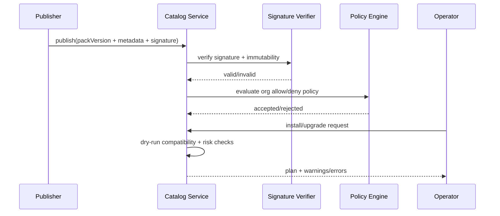

<DocMeta source="advanced feature adaptation (T227)" scope="canonical" />

## Goal

Provide a trusted internal marketplace of reusable deployment templates ("Template Packs") so teams can bootstrap projects quickly without losing policy control.

This feature should reduce copy/paste infra drift while preserving strict compatibility and security gates.

---

## Why this feature exists

The platform already has typed configuration and deployment policy surfaces. What is missing is a **curated distribution layer** for proven templates:

- operators want faster onboarding,
- platform teams need standardization,
- security/compliance teams need controlled provenance.

---

## Scope (v1)

### In scope

- Template Pack registry with signed metadata and immutable versions
- Compatibility metadata (`provider`, `runner`, `routing`, `runtime constraints`)
- Risk labels (`safe`, `review_required`, `experimental`)
- Install/upgrade workflow with dry-run compatibility checks
- Org-level allow/deny policy on packs and publishers

### Out of scope (v1)

- External public marketplace ingestion
- Arbitrary runtime plugin execution from packs
- Automatic install in production without operator confirmation

---

## Core model

```ts
type TemplatePackRisk = "safe" | "review_required" | "experimental";

type TemplatePackVersion = {
  packId: string;
  version: string; // semver
  signature: string;
  publisher: string;
  risk: TemplatePackRisk;
  compatibility: {
    providers: string[];
    runners: string[];
    requiresFeatures?: string[];
    minPlatformVersion?: string;
  };
  templates: {
    providerTemplateId?: string;
    buildTemplateId?: string;
    deployTemplateId?: string;
    routeTemplateId?: string;
    previewTemplateId?: string;
    dependencyTemplateId?: string;
  };
};
```

---

## Catalog workflow



---

## Compatibility and risk gates

Installation decision depends on compatibility pass $C$ and policy allowance $P$:

$$
installAllowed = C \land P
$$

Risk behavior:

- `safe`: can be installed by default roles
- `review_required`: requires elevated approval
- `experimental`: hidden by default unless explicitly enabled by org policy

Default install policy baseline:

- `safe` = allow
- `review_required` = approval required
- `experimental` = blocked (unless explicitly enabled by org policy)

---

## Failure taxonomy

- `template_pack_signature_invalid`
- `template_pack_version_immutable_violation`
- `template_pack_compatibility_failed`
- `template_pack_risk_policy_blocked`
- `template_pack_not_allowed_for_org`
- `template_pack_dependency_missing`

---

## Operator UX expectations

- Catalog list with filters: risk, provider compatibility, last update
- Pack detail page with:
  - signed publisher metadata,
  - compatibility matrix,
  - template graph preview,
  - change log between versions
- Install/upgrade dry-run report before apply
- Org policy panel for allow/deny + risk-level defaults

---

## Security boundaries

- All pack versions are immutable once published
- Signature verification is mandatory before visibility in catalog
- Pack install/upgrade operations are audit logged (actor + target + result)
- No executable code from packs is run in control plane in v1 (metadata/templates only)

---

## Test strategy

### Unit

- semver and immutability checks
- signature verification result mapping
- risk-policy decision table

### Integration

- publish → verify → catalog visibility
- install dry-run compatibility failure path
- upgrade path with immutable prior version preserved

### E2E

- org installs `safe` pack successfully
- `review_required` pack blocked without approval role
- incompatible pack version rejected with deterministic reasons

---

## Definition of done

- Signed, immutable Template Pack versions are publishable and queryable
- Dry-run install/upgrade reports compatibility and risk outcomes
- Org policy controls pack/risk visibility and installability
- Failure reasons are stable and operator-queryable
- migration task `T227` is complete

---

## Task mapping

- `T227` — Internal Template Pack catalog baseline
- `T085` — Internal template marketplace evolution

---

## Related docs

- [Benchmark Feature Adaptation Matrix](/docs/deployment/benchmark-feature-adaptation-matrix)
- [Platform Feature Target](/docs/deployment/platform-feature-target)
- [Migration Task Breakdown](/docs/deployment/migration-task-breakdown)
