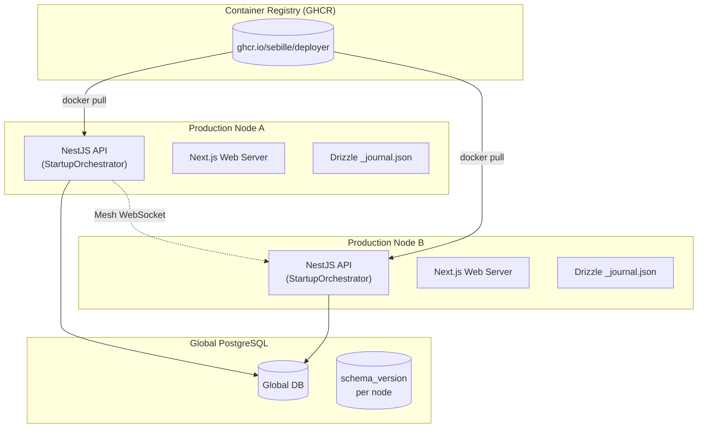
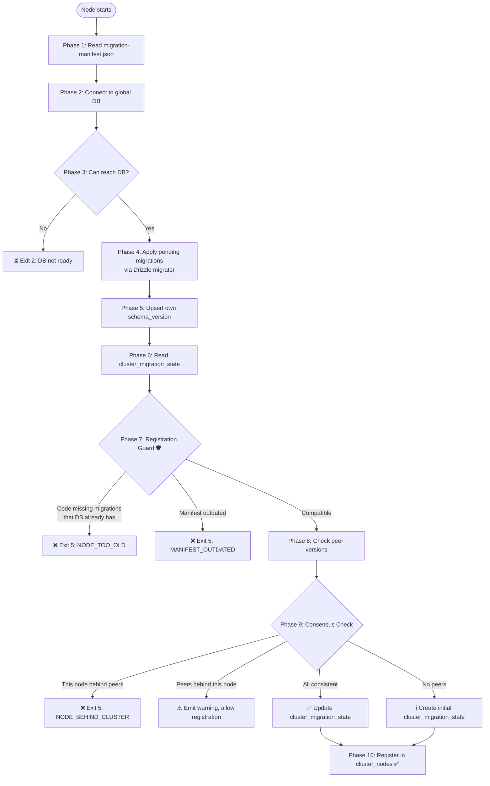
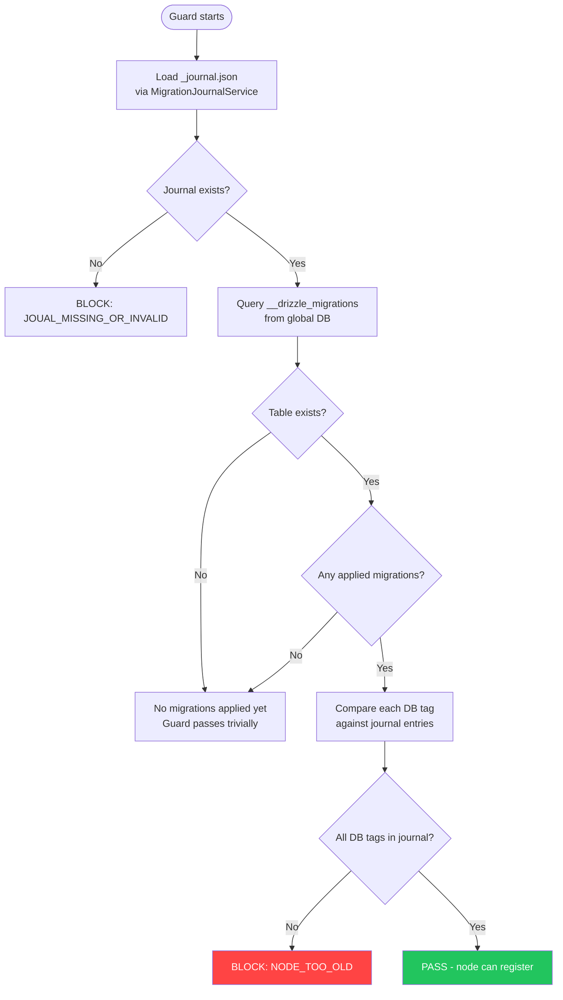
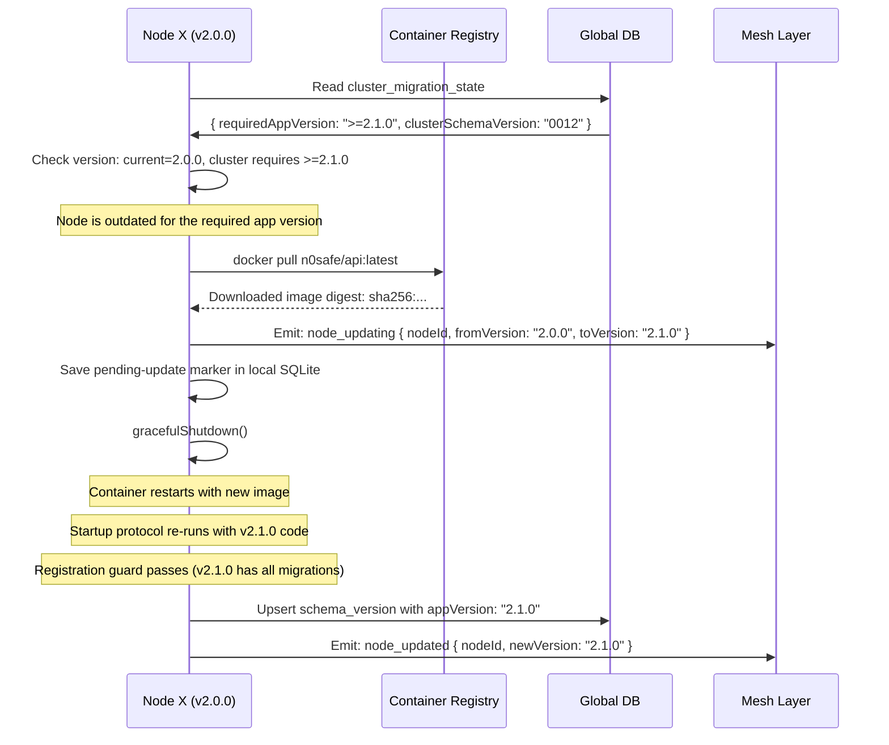
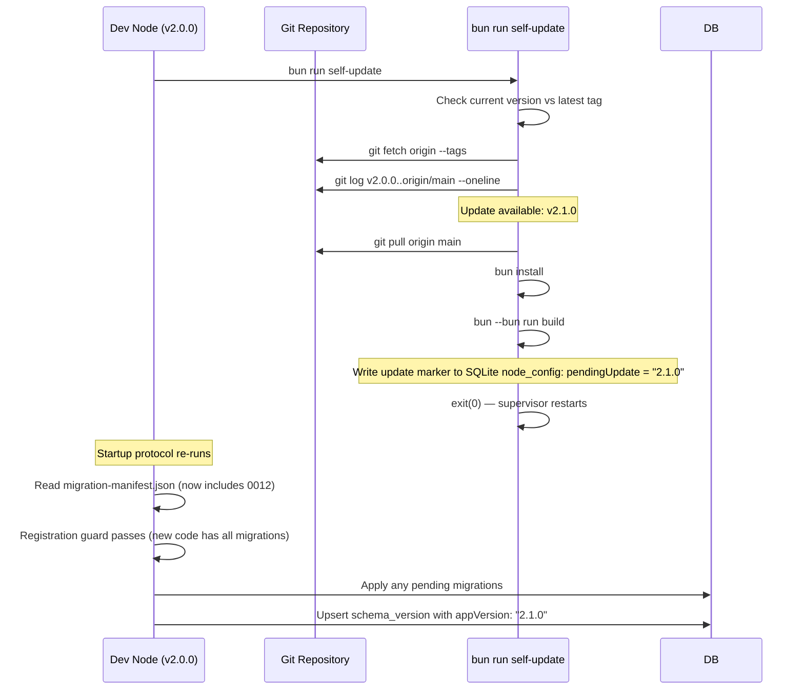

<DocMeta source="apps/api architecture + mesh design" scope="v3" />

## Architecture Overview

The platform uses a **dual-database architecture** with potentially many API nodes sharing one global PostgreSQL database.

| Database | Scope | Technology | Coordination |
|----------|-------|------------|--------------|
| **Global** (PostgreSQL) | Shared across ALL nodes | Drizzle ORM + `node-postgres` | **Mesh-coordinated** — multi-node version registry, guards, and auto-update |
| **Local** (SQLite) | Per-node private state | Better Sqlite3 | None — each node owns its own |

### Core Principles

1. **Drizzle `_journal.json` as SSOT** — Drizzle auto-generates `meta/_journal.json` tracking every migration. This is the single source of truth — no manually maintained manifest.
2. **`package.json` version for compatibility** — Semver from `apps/api/package.json` is the only version considered. No per-migration version requirements.
3. **Registration guard** — A node can only join the mesh if its code contains ALL migrations already applied to the global DB. This prevents outdated code from operating on an incompatible schema.
4. **Self-contained startup** — The NestJS app runs all startup tasks (migrations, admin creation, mesh registration) in `OnModuleInit` lifecycle hooks. No external CLI commands needed.
5. **Uniform version enforcement** — All nodes in the mesh must run compatible schemas. Mismatches are detected, reported, and surfaced via health checks.
6. **Global version registry** — The `schema_version` table tracks per-node schema and app versions.
7. **Single-container deployment** — In production, API + Web run in one container. Upgrading is just pulling a new image from the registry.
8. **CI/CD pipeline** — Pushing a version tag triggers automatic Docker image build + push to GHCR.

### The Big Picture



---

## Version Tracking Tables

These tables are created by **migration 0011** (the next migration after the current latest 0010).

### `schema_version` — Per-Node Schema State

Each node has exactly one row, updated on every startup and periodically every 60 seconds.

```typescript
// apps/api/src/config/drizzle/global/schema/schema-version.schema.ts
import { pgTable, text, timestamp, jsonb } from 'drizzle-orm/pg-core'

export const schemaVersion = pgTable('schema_version', {
  nodeId: text('node_id').primaryKey(),

  // Latest migration version applied by this node
  // e.g. "0011" from the last entry in __drizzle_migrations
  schemaVersion: text('schema_version').notNull(),

  // Full ordered list of applied migration file names
  // e.g. ["0000_brave_steve_rogers", ..., "0011_mesh_coordination"]
  appliedMigrations: jsonb('applied_migrations').notNull().$type<string[]>(),

  // Application version from package.json
  // e.g. "2.1.0"
  appVersion: text('app_version').notNull(),

  // When this node last verified its schema state
  lastVerification: timestamp('last_verification', { withTimezone: true })
    .notNull()
    .defaultNow(),

  createdAt: timestamp('created_at', { withTimezone: true })
    .notNull()
    .defaultNow(),

  updatedAt: timestamp('updated_at', { withTimezone: true })
    .notNull()
    .defaultNow()
    .$onUpdate(() => new Date()),
})
```

### `cluster_migration_state` — Cluster-Wide Schema Target

A singleton row (always `id = 1`) that tracks the cluster's migration progress and enforced requirements.

```typescript
// apps/api/src/config/drizzle/global/schema/cluster-migration-state.schema.ts
import { pgTable, text, timestamp, jsonb, integer } from 'drizzle-orm/pg-core'

export const clusterMigrationState = pgTable('cluster_migration_state', {
  id: integer('id').primaryKey().default(1),

  // The highest migration version that ALL active consensus nodes have applied.
  // Advances only when the cluster reaches agreement.
  clusterSchemaVersion: text('cluster_schema_version').notNull(),

  // The minimum app version (semver) required to be in the cluster.
  // Nodes with appVersion < requiredAppVersion are marked outdated.
  // Computed from the migration manifest's highest minAppVersion.
  requiredAppVersion: text('required_app_version').notNull(),

  // List of active node IDs that contributed to the current consensus.
  // Updated each time consensus is re-evaluated.
  consensusNodeIds: jsonb('consensus_node_ids').notNull().$type<string[]>(),

  // Optimistic locking — incremented on every update.
  // Used to detect concurrent updates and prevent write conflicts.
  recordVersion: integer('record_version').notNull().default(1),

  // Last time consensus was verified.
  lastConsensusAt: timestamp('last_consensus_at', { withTimezone: true })
    .notNull()
    .defaultNow(),

  createdAt: timestamp('created_at', { withTimezone: true })
    .notNull()
    .defaultNow(),

  updatedAt: timestamp('updated_at', { withTimezone: true })
    .notNull()
    .defaultNow()
    .$onUpdate(() => new Date()),
})
```

---

## Migration Journal — Auto-Generated Source of Truth

Drizzle Kit auto-generates `meta/_journal.json` in the migrations folder every time you run `drizzle-kit generate`. This is the **single source of truth** — no manually maintained manifest is needed.

The hand-maintained `migration-manifest.json` has been **removed** as part of the v2 architecture. The `_journal.json` is always in sync with the migration files because Drizzle generates it.

```json
// apps/api/src/config/drizzle/global/migrations/meta/_journal.json
{
  "version": "7",
  "dialect": "postgresql",
  "entries": [
    { "idx": 0, "version": "7", "when": 1700000000, "tag": "0000_initial_schema", "breakpoints": true },
    { "idx": 1, "version": "7", "when": 1700001000, "tag": "0011_cynical_goliath", "breakpoints": true }
  ]
}
```

### Key Fields

| Field | Description |
|-------|-------------|
| `version` | Drizzle journal format version |
| `dialect` | Database dialect (`postgresql`, `sqlite`, `mysql`) |
| `entries[].idx` | Sequential migration index (0-based) |
| `entries[].tag` | Migration filename (e.g., `0011_cynical_goliath`) |
| `entries[].breakpoints` | Whether this migration creates a snapshot |

### MigrationJournalService

File: `apps/api/src/core/utils/migration-journal.service.ts`

Provides typed access to the journal:

```typescript
const journal = journalService.load()
// { entries: [{ idx: 0, tag: "0000_...", ... }, ...] }

journalService.getMigrationTags()      // ["0000_...", ..., "0011_..."]
journalService.getLatestMigrationTag() // "0011_cynical_goliath"
journalService.getMigrationCount()     // 12
journalService.hasMigration(tag)       // true/false
```

### Why `_journal.json` Instead of a Hand-Maintained Manifest?

| Concern | Hand-maintained manifest | Auto-generated journal |
|---------|------------------------|------------------------|
| **Accuracy** | Human must remember to update it | Always in sync — generated by Drizzle |
| **Per-migration versions** | `minAppVersion`, `minSchemaVersion` required | None needed — package.json semver is SSOT |
| **Maintenance burden** | Update manifest for every migration | Zero — Drizzle handles it |
| **Error cases** | MANIFEST_MISSING, MANIFEST_OUTDATED | Only JOURAL_MISSING — can't be outdated |
    {
      "version": "0002",
      "name": "whole_sumo",
      "minAppVersion": ">=1.0.0",
      "minSchemaVersion": "0001",
      "description": "Session/role columns"
    },
    {
      "version": "0003",
      "name": "dusty_firestar",
      "minAppVersion": ">=1.0.0",
      "minSchemaVersion": "0002",
      "description": "Seed version tracking"
    },
    {
      "version": "0004",
      "name": "cool_bruce_banner",
      "minAppVersion": ">=1.0.0",
      "minSchemaVersion": "0003",
      "description": "Org/invitation/push tables"
    },
    {
      "version": "0005",
      "name": "chief_blade",
      "minAppVersion": ">=1.2.0",
      "minSchemaVersion": "0004",
      "description": "Deployment domain tables"
    },
    {
      "version": "0006",
      "name": "ancient_iron_patriot",
      "minAppVersion": ">=1.5.0",
      "minSchemaVersion": "0005",
      "description": "Mesh cluster tables"
    },
    {
      "version": "0007",
      "name": "smooth_martin_li",
      "minAppVersion": ">=1.5.0",
      "minSchemaVersion": "0006",
      "description": "Node ID unique constraint"
    },
    {
      "version": "0008",
      "name": "past_scream",
      "minAppVersion": ">=1.5.0",
      "minSchemaVersion": "0007",
      "description": "Cluster index cleanup"
    },
    {
      "version": "0009",
      "name": "bouncy_hellfire_club",
      "minAppVersion": ">=1.8.0",
      "minSchemaVersion": "0008",
      "description": "Docker security scans (v1)"
    },
    {
      "version": "0010",
      "name": "gigantic_stranger",
      "minAppVersion": ">=1.8.0",
      "minSchemaVersion": "0009",
      "description": "Docker runtime activities + lifecycle"
    },
    {
      "version": "0011",
      "name": "mesh_coordination_tables",
      "minAppVersion": ">=2.0.0",
      "minSchemaVersion": "0010",
      "description": "schema_version, cluster_migration_state, migration manifest, registration guard"
    }
  ]
}
```

### Manifest Schema Validation

```typescript
// apps/api/src/config/drizzle/global/migrations/migration-manifest.schema.ts
import { z } from 'zod/v4'

export const migrationEntrySchema = z.object({
  version: z.string().regex(/^\d{4}$/),
  name: z.string().min(1),
  minAppVersion: z.string().regex(/^[><=!~^]+\d+\.\d+\.\d+/),
  minSchemaVersion: z.string().nullable(),
  description: z.string().optional(),
})

export const migrationManifestSchema = z.object({
  currentSchemaVersion: z.string().regex(/^\d{4}$/),
  migrations: z.array(migrationEntrySchema),
})

export type MigrationManifest = z.infer<typeof migrationManifestSchema>
export type MigrationEntry = z.infer<typeof migrationEntrySchema>
```

### Critical Rules

| Rule | Enforcement | Why |
|------|-------------|-----|
| Every migration must have a manifest entry | Code review + CLI validation script | Without the entry, the system can't determine requirements |
| `currentSchemaVersion` must match the last migration file | CI check | The manifest is the source of truth; drift causes registration to fail |
| `minAppVersion` must increase or stay the same | CI check | If a later migration requires a LOWER version, older nodes could bypass requirements |
| Manifest is checked on every `register-mesh-node` call | Runtime | Ensures the node's code matches what the cluster expects |

---

## Startup Architecture: Lifecycle Hooks

In production, startup tasks run **inside the NestJS process** via `StartupOrchestratorService.onModuleInit()`. No external CLI commands or separate startup scripts are needed.

### Flow



```mermaid
flowchart LR
    START([Container starts]) --> A["entrypoint.prod.ts starts"]
    A --> B["Validates environment variables"]
    B --> C["Starts NestJS API (bootstrap())"]
    C --> D["NestJS emits onModuleInit event"]
    D --> E["StartupOrchestrator.onModuleInit()"]
    E --> F["1. Run Drizzle migrations"]
    F --> G["2. Create default admin"]
    G --> H["3. Register mesh node"]
    H --> I["4. Report schema version"]
    I --> J["API ready to serve traffic"]
    J --> K["entrypoint also starts Next.js web server"]
```

### StartupOrchestratorService

File: `apps/api/src/core/modules/startup/startup-orchestrator.service.ts`

Each step is independent — failures in later steps don't block the app:

```typescript
@Injectable()
export class StartupOrchestratorService implements OnModuleInit {
  private startupComplete = false
  private startupErrors: string[] = []

  async onModuleInit(): Promise<void> {
    await this.runMigrations()        // Step 1: Run pending Drizzle migrations
    await this.createDefaultAdmin()   // Step 2: Create default admin
    await this.registerMeshNode()     // Step 3: Register this node in the mesh
    await this.reportSchemaVersion()  // Step 4: Report schema version
    this.startupComplete = true
  }
}
```

### Step Details

#### Step 1: Run Drizzle Migrations

Uses the programmatic Drizzle migrator:

```typescript
import { migrate } from 'drizzle-orm/node-postgres/migrator'

private async runMigrations(): Promise<void> {
  await migrate(this.globalDatabaseService.db, {
    migrationsFolder: resolve('src/config/drizzle/global/migrations'),
  })
}
```

Migrations are **idempotent** — Drizzle tracks applied migrations in `__drizzle_migrations` and only runs new ones.

#### Step 2: Create Default Admin

Shells out to the CLI command (runs in the same process space):

```typescript
private async createDefaultAdmin(): Promise<void> {
  const { execSync } = await import('child_process')
  execSync('bun --bun dist/cli.js create-default-admin', { stdio: 'inherit' })
}
```

#### Step 3: Register Mesh Node

Uses raw SQL to upsert the node in `cluster_nodes`:

```typescript
private async registerMeshNode(): Promise<void> {
  const nodeId = this.envService.get('NODE_ID')
  const clusterId = this.envService.get('CLUSTER_ID')
  await this.globalDatabaseService.db.execute(
    sql`INSERT INTO cluster_nodes (node_id, cluster_id, ...)
        VALUES (...) ON CONFLICT (node_id) DO UPDATE SET ...`
  )
}
```

#### Step 4: Report Schema Version

Reads the journal and upserts into `schema_version`:

```typescript
private async reportSchemaVersion(): Promise<void> {
  const journal = this.journalService.load()
  const latestTag = journal.entries.at(-1)?.tag ?? 'none'
  const appVersion = readPackageJson().version
  await this.globalDatabaseService.db.execute(
    sql`INSERT INTO schema_version (...) VALUES (...)
        ON CONFLICT (node_id) DO UPDATE SET ...`
  )
}
```

### Why Lifecycle Hooks Instead of CLI Commands?

| Concern | Old approach (CLI commands) | New approach (lifecycle hooks) |
|---------|---------------------------|-------------------------------|
| **Dependencies** | Separate process, separate DI context | Same DI context as the app |
| **Error handling** | Exit codes, stdout parsing | Native try/catch, structured logging |
| **Startup time** | Sequential process spawns | Direct method calls |
| **Config access** | Env vars passed explicitly | DI-injected services |
| **Production deployment** | Many containers, complex entrypoint | Single container, simple entrypoint |

### Unified Production Entrypoint

The simplified `entrypoint.prod.ts` just starts both servers:

```typescript
// apps/api/scripts/entrypoint.prod.ts
async function main() {
  validateEnvironment()
  const api = await startApi()        // NestJS handles startup in lifecycle hooks
  const web = await startWeb()        // Next.js web server (if built assets exist)
  await keepAlive()                   // Wait for either process to exit
}
```

Every API node runs this protocol on startup, **before** it can serve traffic or accept mesh connections.

### 10-Phase Flow



### Phase-by-Phase Specification

#### Phase 1: Read migration-manifest.json

Read the manifest from disk. This tells the node:
- Which migrations exist in this code version
- What the current schema version should be after applying all of them
- What app version is required for each migration

**Failure handling:** If the manifest is missing, malformed, or fails Zod validation:
- Log error: `❌ Migration manifest missing or corrupted at {path}. Cannot verify schema compatibility.`
- Exit code 5 (registration denied)

#### Phase 2-3: DB Connectivity

Standard `SELECT 1` check against the global PostgreSQL.

| Condition | Exit Code | Action |
|-----------|-----------|--------|
| `SELECT 1` succeeds | continues | Proceed to migration |
| Auth failure (password/role) | 1 | Configuration error — fix env vars |
| Network error (ECONNREFUSED) | 2 | Transient — retry on next restart |

#### Phase 4: Apply Pending Migrations

Run Drizzle's `migrate()` function. This is **idempotent**:
- Reads `__drizzle_migrations` to see what's already applied
- Applies only migrations not yet in the tracking table
- PostgreSQL's MVCC ensures safe concurrent execution

**Important:** Migration 0011 creates the `schema_version` and `cluster_migration_state` tables. Before migration 0011:
- These tables don't exist
- The node falls back to basic registration (skip version checks)
- This ensures backward compatibility with nodes still on schema 0010

#### Phase 5: Upsert Own Schema Version

Write the node's state into `schema_version`:

```typescript
async function reportSchemaVersion(nodeId: string): Promise<void> {
  const migrations = await db.execute<{ version: string }>(
    sql`SELECT version FROM "__drizzle_migrations" ORDER BY version`
  )
  const appliedVersions = migrations.rows.map(r => r.version)
  const latestVersion = appliedVersions.at(-1) ?? '0000'
  const appVersion = readPackageVersion()

  await db
    .insert(schemaVersion)
    .values({
      nodeId,
      schemaVersion: latestVersion,
      appliedMigrations: appliedVersions,
      appVersion,
      lastVerification: new Date(),
    })
    .onConflictDoUpdate({
      target: schemaVersion.nodeId,
      set: {
        schemaVersion: latestVersion,
        appliedMigrations: appliedVersions,
        appVersion,
        lastVerification: new Date(),
        updatedAt: new Date(),
      },
    })
}
```

**Graceful skip:** If the `schema_version` table doesn't exist yet (pre-0011 cluster), catch the error and skip the phase.

#### Phase 6: Read cluster_migration_state

If the table doesn't exist (pre-0011), this phase is skipped.

If it exists, read the singleton row to learn:
- `clusterSchemaVersion`: what the cluster thinks the current version is
- `requiredAppVersion`: minimum app version to be in the cluster
- `consensusNodeIds`: which nodes participated in the last consensus

#### Phase 7: Registration Guard 🛡️

**This is the most critical safety check in the system.** Before a node can register, it must prove its code is compatible with the cluster's current schema state.

```typescript
type RegistrationGuardResult =
  | { allowed: true }
  | { allowed: false; reason: 'NODE_TOO_OLD'; missingMigrations: string[] }
  | { allowed: false; reason: 'MANIFEST_OUTDATED'; currentSchemaVersion: string }
  | { allowed: false; reason: 'MANIFEST_MISSING_OR_INVALID'; error: string }

async function registrationGuard(db: GlobalDatabase, manifest: MigrationManifest): Promise<RegistrationGuardResult> {
  // 1. Read all migrations already applied in the global DB
  const appliedInDb = await db.execute<{ version: string }>(
    sql`SELECT version FROM "__drizzle_migrations" ORDER BY version`
  )
  const dbVersions = new Set(appliedInDb.rows.map(r => r.version))

  // 2. Read the node's own migration versions from the manifest
  const myVersions = new Set(manifest.migrations.map(m => m.version))

  // 3. Check: every DB-applied migration must exist in my files
  const missingFromCode = [...dbVersions].filter(v => !myVersions.has(v))
  if (missingFromCode.length > 0) {
    return {
      allowed: false,
      reason: 'NODE_TOO_OLD',
      missingMigrations: missingFromCode,
    }
  }

  // 4. Check: manifest's currentSchemaVersion >= max DB version
  const dbMaxVersion = [...dbVersions].sort().at(-1) ?? '0000'
  if (compareVersions(dbMaxVersion, manifest.currentSchemaVersion) > 0) {
    return {
      allowed: false,
      reason: 'MANIFEST_OUTDATED',
      currentSchemaVersion: manifest.currentSchemaVersion,
    }
  }

  return { allowed: true }
}
```

**Blocked output example:**
```
❌ REGISTRATION DENIED: Node code is too old for this cluster.
   Missing migrations already applied to global DB:
     - 0011_mesh_coordination_tables
   Current cluster schema: 0011
   This node's max schema: 0010
   Action: Deploy app version >=2.0.0 to this node before it can join.
```

#### Phase 8: Check Peer Versions

Query `schema_version` for all active peers and compare their app versions + schema versions against the manifest requirements.

```typescript
type PeerVersionState = {
  nodeId: string
  schemaVersion: string
  appVersion: string
  satisfiesMinAppVersion: boolean  // does appVersion meet manifest's latest minAppVersion?
}
```

#### Phase 9: Consensus Check

Determine cluster consensus state and take appropriate action:

| Local State | Peer State | Cluster Migration State | Action | Traffic? |
|-------------|-----------|------------------------|--------|----------|
| = peers | = peers | exists, matches | ✅ Consistent — update consensus, register | ✅ Yes |
| = peers | = peers | exists, behind | ✅ Advance cluster_migration_state to match | ✅ Yes |
| = peers | = peers | doesn't exist | Create initial cluster_migration_state (first node) | ✅ Yes |
| > peers | < peers | exists | ⚠️ Peers behind — warn, allow | ⚠️ Yes (degraded) |
| < peers | > peers | exists | ❌ Node behind cluster | ❌ No, blocked |
| < peers | > peers | doesn't exist | ❌ Node behind cluster | ❌ No, blocked |
| = peers | < peers (app version) | exists | ⚠️ Peer app version too low for pending migrations | ⚠️ Yes (degraded) |

#### Phase 10: Register in cluster_nodes

Only reached after passing Phases 7-9. Idempotent insert with conflict handling.

---

## Registration Guard — Detailed Logic

The registration guard prevents outdated nodes from joining the mesh. It compares Drizzle's `__drizzle_migrations` table against the auto-generated `_journal.json`.

### Flow



### Edge Cases

| Scenario | Detection | Action |
|----------|-----------|--------|
| Node v1.0 tries to join cluster at schema 0010 | Guard identifies migrations 0005-0010 missing from v1.0's code | ❌ **Block**. Log: "Missing migrations 0005-0010. Update to >= v2.0.0." |
| Fresh DB, first node ever | `__drizzle_migrations` empty → no DB versions to compare | ✅ Allow. Apply all migrations. Become the first node. |
| Node has code for migrations not yet applied to DB | Manifest lists `currentSchemaVersion` > DB max version | ✅ Allow. Node will apply pending migrations in Phase 4. |
| Node restarts with SAME code version as before | Both DB and code have the same migrations | ✅ Allow. Guard passes trivially. |
| `migration-manifest.json` has syntax error | JSON parse or Zod validation fails | ❌ **Block**. Log: "Manifest corrupted" |
| Node's app version is below cluster_migration_state.requiredAppVersion | Phase 6 reads `requiredAppVersion: ">=2.0.0"`, node's version is "1.5.0" | ❌ **Block** in Phase 9. Log: "Node version 1.5.0 is below cluster minimum >=2.0.0." |
| `schema_version` table doesn't exist (pre-0011 cluster) | Phase 5 can't upsert | ⚠️ Degrade gracefully. Skip Phases 5-9, go directly to basic registration. |

---

## Version Compatibility

App version from `package.json` is the single source of truth for version compatibility. The `_journal.json` tracks which migrations exist in the current code.

| Situation | Guard Result |
|-----------|-------------|
| Node has all DB-applied migrations in its journal | ✅ Pass — node can register |
| DB has migrations not in node's journal | ❌ Block — NODE_TOO_OLD |
| Fresh DB (no migrations applied) | ✅ Pass — node becomes first |
| Journal file missing/corrupted | ❌ Block — JOURAL_MISSING_OR_INVALID |
| `1.2.x` - `1.4.x` | 0000-0005 | 0005 | ✅ If cluster ≤ 0005 |
| `1.5.x` - `1.7.x` | 0000-0008 | 0008 | ✅ If cluster ≤ 0008 |
| `1.8.x` - `1.9.x` | 0000-0010 | 0010 | ✅ If cluster ≤ 0010 |
| `>=2.0.0` | 0000-0011+ | 0011+ | ✅ Always compatible (current) |

**Key rule:** A node can always apply NEWER migrations (if its code has them), but can NEVER join a cluster with migrations it doesn't know about.

---

## Uniform Version Enforcement

### How Enforcement Works

The `cluster_migration_state` table has a `requiredAppVersion` field. This is computed as the **highest `minAppVersion` across all applied migrations**.

For example, if the cluster has applied migrations up to 0011, and migration 0011 requires `>=2.0.0`, then `requiredAppVersion = ">=2.0.0"`.

**Enforcement points:**

1. **Registration guard** (Phase 7): Blocks nodes whose code is missing migrations
2. **Peer version check** (Phase 9): Detects nodes running below `requiredAppVersion`
3. **Health endpoint**: Exposes version mismatches for monitoring/alerting
4. **Mesh event emission**: Version anomalies are broadcast to all nodes

### What Happens to Outdated Nodes

Outdated nodes in the mesh are:

| Situation | Status | Traffic? | Action |
|-----------|--------|----------|--------|
| Schema version behind peers | Stale | ⚠️ Allowed (degraded) | Warning logged, event emitted |
| App version < requiredAppVersion | Outdated | ⚠️ Allowed (degraded) | Warning logged, health check flags it |
| Both behind | Stale + Outdated | ⚠️ Allowed (degraded) | Operator should update immediately |
| Crashes and restarts with old code | Blocked by guard | ❌ No | Node can't rejoin until updated |

**Important:** Stale/outdated nodes already in the mesh continue serving but are flagged. The guard only prevents NEW registrations.

---

## Migration Execution Protocol

### When a Migration Can Run

A migration can run ONLY when **all** conditions are met:

```
For migration "0011_mesh_coordination_tables" to run:
  ✓ This node's appVersion satisfies minAppVersion (>=2.0.0)
  ✓ Cluster's clusterSchemaVersion >= minSchemaVersion (>=0010)
  ✓ ALL active nodes in schema_version have appVersion satisfying >=2.0.0
  ✓ This node's code has the migration file
  ✓ No other migration is currently in progress (advisory lock)
```

### Advisory Lock

To minimize contention between concurrent migration attempts:

```sql
-- Acquire a PostgreSQL advisory lock before running migrations
SELECT pg_advisory_lock(hashtext('migration_coordinator'));

-- Apply migrations
-- ...

-- Release the lock
SELECT pg_advisory_unlock(hashtext('migration_coordinator'));
```

**Note:** This is an optimization, not a correctness requirement. Drizzle's migrator is already idempotent and transaction-safe. The advisory lock just reduces log noise from concurrent attempts.

### After Migration Success

The node that applied the migration should update `cluster_migration_state`:

```typescript
async function advanceClusterState(
  db: GlobalDatabase,
  newSchemaVersion: string,
  minAppVersion: string,
  consensusNodeIds: string[]
): Promise<void> {
  // Use the existing row or create one
  const existing = await db.select().from(clusterMigrationState).where(eq(clusterMigrationState.id, 1))

  if (existing.length === 0) {
    // First time — insert
    await db.insert(clusterMigrationState).values({
      id: 1,
      clusterSchemaVersion: newSchemaVersion,
      requiredAppVersion: minAppVersion,
      consensusNodeIds,
      lastConsensusAt: new Date(),
    })
  } else {
    // Update with optimistic locking
    const current = existing[0]!
    const result = await db
      .update(clusterMigrationState)
      .set({
        clusterSchemaVersion: sql`GREATEST(${clusterMigrationState.clusterSchemaVersion}, ${newSchemaVersion})`,
        requiredAppVersion: minAppVersion,
        consensusNodeIds,
        lastConsensusAt: new Date(),
        recordVersion: current.recordVersion + 1,
      })
      .where(
        and(
          eq(clusterMigrationState.id, 1),
          eq(clusterMigrationState.recordVersion, current.recordVersion)  // optimistic lock
        )
      )

    if (result.rowCount === 0) {
      // Optimistic lock failure — another node updated it concurrently
      // Re-read and re-try or accept the other node's update
      this.logger.warn('cluster_migration_state was concurrently updated by another node — accepting their update')
    }
  }
}
```

---

## Node Registration Guard — What Happens at Every Exit Code

### `register-mesh-node` Exit Codes

| Exit Code | Meaning | When | Example Log |
|-----------|---------|------|-------------|
| 0 | Success or graceful skip | Node registered, already exists, or MESH_NODE_ID not configured | `✅ Registered mesh node: abc-123` |
| 1 | Configuration error | Bad env vars, can't determine server URL | `❌ MESH_NODE_ID is not a valid UUID` |
| 2 | DB not ready | `SELECT 1` failed (transient) | `⚠️ Global DB unreachable: ECONNREFUSED` |
| 3 | Migrations needed | `cluster_nodes` or `schema_version` table missing | `⚠️ Table "cluster_nodes" does not exist` |
| 4 | Registration failed | DB error during insert | `❌ Failed to register: connection lost` |
| **5** | **Registration DENIED** | Guard blocked the node (code too old for cluster) | `❌ REGISTRATION DENIED: NODE_TOO_OLD` |

### Exit Code 5 — Detailed Messages

| Reason | Message | Suggested Action |
|--------|---------|------------------|
| `NODE_TOO_OLD` | Node code is missing migrations already applied to global DB: 0011_mesh_coordination_tables. | Deploy app version >=2.0.0 to this node. |
| `MANIFEST_OUTDATED` | Migration manifest schema version 0010 is behind DB version 0011. | Update migration-manifest.json to currentSchemaVersion: "0011" |
| `MANIFEST_MISSING_OR_INVALID` | Migration manifest missing or corrupted at apps/api/src/config/drizzle/global/migrations/migration-manifest.json | Ensure the manifest file exists and is valid JSON matching the Zod schema. |
| `NODE_BEHIND_CLUSTER` | Node schema version 0010 is behind cluster consensus 0011. This node cannot safely serve traffic. | Deploy newer app version or rollback cluster to 0010. |

---

## Auto-Update Protocol

Nodes can auto-update to the latest version when a new release is available.

### Mode 1: Docker-Based (Production)



### Mode 2: Git-Based (Development)



### Self-Update CLI Command

```typescript
// apps/api/src/cli/commands/self-update.command.ts
@Command({ name: 'self-update', description: 'Check for and apply updates' })
export class SelfUpdateCommand extends CommandRunner {
  async run(): Promise<void> {
    const currentVersion = this.getCurrentVersion()
    const latestVersion = await this.checkForUpdate()

    if (!latestVersion || latestVersion === currentVersion) {
      this.logger.log(`✅ Already at latest version: ${currentVersion}`)
      return
    }

    this.logger.log(`📦 Update available: ${currentVersion} → ${latestVersion}`)

    // Save update marker so the entrypoint knows this is an intentional update
    await this.saveUpdateMarker(latestVersion)

    this.logger.log(`🔄 Restarting to apply update...`)
    process.exit(0)  // Docker supervisor / restart policy handles restart
  }

  private async checkForUpdate(): Promise<string | null> {
    // Strategy 1: Check container registry for newer image tag
    try {
      const manifest = await fetch('https://registry.n0safe.io/v2/api/manifests/latest')
      const labels = manifest.headers.get('docker-image-labels')
      // ...
    } catch {
      // Strategy 2: Check git tags
      // ...
    }
    return null
  }

  private async saveUpdateMarker(version: string): Promise<void> {
    // Write to a well-known path that the entrypoint checks
    await fs.writeFile('/tmp/pending-update.json', JSON.stringify({
      version,
      triggeredAt: new Date().toISOString(),
    }))
  }
}
```

### Entrypoint Update Detection

Both `entrypoint.dev.ts` and `entrypoint.prod.ts` should check for update markers:

```typescript
function checkPendingUpdate(): void {
  const markerPath = '/tmp/pending-update.json'
  if (existsSync(markerPath)) {
    const marker = JSON.parse(readFileSync(markerPath, 'utf-8'))
    console.log(`🔄 Completing update to ${marker.version}...`)
    // Log the successful update
    console.log(`✅ Node updated to version ${marker.version}`)
    rmSync(markerPath)
  }
}
```

### Self-Update Detection Strategies

| Strategy | How It Works | Best For |
|----------|-------------|----------|
| **Docker registry API** | Query registry for latest tag, compare with current image | Production Docker deployments |
| **Git tags** | `git fetch --tags && git describe --tags origin/main` | Development environments |
| **Version manifest URL** | Fetch `https://releases.n0safe.io/versions.json` for latest | Air-gapped environments |
| **Cluster recommendation** | Read `cluster_migration_state.requiredAppVersion` and infer target | Auto-detect from cluster needs |

---

## Integration with Existing Mesh Services

### MeshClusterSyncService

The existing peer sync service should sync `schema_version` data. When a peer updates its schema version, the sync propagates it to all connected nodes.

### Health Check Integration

The health endpoint should expose migration status:

```json
{
  "status": "ok",
  "info": {
    "globalDbMigration": {
      "status": "up",
      "schemaVersion": "0011",
      "appVersion": "2.1.0",
      "clusterConsensus": "consistent",
      "peersCount": 3,
      "outdatedPeers": []
    }
  }
}
```

### Mesh Events

New migration-related events for the mesh event system:

| Event | Trigger | Payload | Consumers |
|-------|---------|---------|-----------|
| `migration_applied` | A migration was just applied | `{ nodeId, version, name, duration }` | Audit log, admin UI |
| `node_schema_updated` | Node's schema_version upserted | `{ nodeId, schemaVersion, appVersion }` | Mesh peer sync, monitoring |
| `cluster_schema_advanced` | cluster_migration_state updated | `{ oldVersion, newVersion, appliedBy }` | All nodes react to new state |
| `registration_denied` | Node blocked by registration guard | `{ nodeId, reason, missingMigrations }` | Admin alert |
| `node_update_available` | New version detected | `{ currentVersion, latestVersion }` | Admin UI, auto-update trigger |
| `node_updating` | Node is about to restart for update | `{ nodeId, fromVersion, toVersion }` | Mesh routing table update |
| `node_updated` | Node completed update | `{ nodeId, newVersion }` | Mesh routing table update |
| `peer_version_mismatch` | Peer app version below requiredAppVersion | `{ peerNodeId, peerAppVersion, requiredVersion }` | Admin alert, auto-update trigger |

---

## Error Scenarios — Complete Catalog

### Scenario A: Stale Node Attempts to Join

```
Cluster: Schema 0010, Nodes: A(v2.0.0, 0010), B(v2.0.0, 0010)
Attempting: Node C(v1.5.0, 0006)
```

1. Node C connects to global DB
2. C's migration files: goes up to 0008 (v1.5.x includes 0007-0008)
3. Phase 7 (Registration Guard):
   - DB has migrations: 0000-0010
   - C's code has migrations: 0000-0008
   - Missing from C: 0009, 0010
4. ❌ **`NODE_TOO_OLD`** — Exit code 5

**Result:** Registration denied. Node C must update to >= v1.8.0.

### Scenario B: Critically Old Node

```
Cluster: Schema 0010, Nodes: A(v2.0.0), B(v2.0.0)
Attempting: Node C(v1.0.0, 0004)
```

1. Phase 7 (Registration Guard):
   - DB has migrations: 0000-0010
   - C's code has migrations: 0000-0004
   - Missing from C: 0005, 0006, 0007, 0008, 0009, 0010
2. ❌ **`NODE_TOO_OLD`** — Exit code 5

**Result:** Registration denied. Node C must update to >= v2.0.0.

### Scenario C: Fresh Cluster, First Node

```
Cluster: Empty DB, no nodes
Attempting: Node A(v2.0.0)
```

1. Phase 4: Drizzle applies ALL migrations from 0000 to 0011
2. Phase 7: `__drizzle_migrations` has 12 entries. A's code has 12 entries. ✅ ALL PRESENT
3. Phase 8: No peers → first node
4. Phase 9: Create initial `cluster_migration_state` with `clusterSchemaVersion: "0011"`
5. Phase 10: Register in `cluster_nodes` ✅

**Result:** Node A is the cluster's first node.

### Scenario D: Concurrent Migration Attempt

```
Cluster: Schema 0010, Nodes: A(v2.0.0), B(v2.0.0)
New migration 0011 is added. Both nodes restart simultaneously.
```

1. Node A Phase 4: Drizzle starts applying 0011
2. Node B Phase 4: Drizzle starts applying 0011
3. Node A acquires `pg_advisory_lock` first, applies 0011
4. Node B's Drizzle run detects 0011 already applied → skips it
5. Both report `schema_version: 0011`
6. Both pass registration guard
7. Both register

**Result:** Safe. Migration applied exactly once.

### Scenario E: Node Restarts With Same Old Code After Cluster Advanced

```
Cluster: Schema 0011, Nodes: A(v2.0.0), B(v2.0.0). Cluster advanced to 0011.
Node C(v1.8.0, 0010) restarts.
```

1. Phase 4: C's code has migrations only up to 0010. Drizzle skips 0011 (no file).
2. Phase 5: C reports `schemaVersion: 0010`
3. Phase 6: C reads `cluster_migration_state: { clusterSchemaVersion: "0011", requiredAppVersion: ">=2.0.0" }`
4. Phase 7 (Registration Guard):
   - DB has: 0000-0011
   - C's code has: 0000-0010
   - Missing: 0011
5. ❌ **`NODE_TOO_OLD`** — Exit code 5

**Result:** Registration denied. C must update to >= v2.0.0.

### Scenario F: Long-Running Node That Never Restarts (Node Still On Old Code)

```
Cluster advances from Schema 0010 → 0011 (migration applied by Node A)
Node B: running schema 0010 code for 60 days, never restarted
```

**While Node B is running with old code:**
- Node B serves traffic for features that don't depend on 0011 tables
- Node B's `schema_version` shows 0010 (stale)
- `cluster_migration_state` shows `clusterSchemaVersion: "0011"` (Node A updated it)
- Health checks show the mismatch but don't disrupt existing traffic
- When Node B eventually restarts → Scenario E applies

**Result:** Graceful degradation. Traffic continues; Node B must update before next restart.

### Scenario G: Fresh Node With Higher Code Version Than Existing Cluster

```
Cluster: Schema 0006, Nodes: A(v1.5.0, 0006)
Attempting: Node D(v2.0.0, 0011)
```

1. Phase 4: Drizzle applies migrations 0007-0011 (newer files exist in D's code)
2. Phase 5: D reports `schemaVersion: 0011`
3. Phase 7: Guard passes (all DB migrations exist in D's code)
4. Phase 8: A is at schema 0006
5. Phase 9: A is behind, but D can serve. Warning emitted.
6. Phase 10: D registers ✅

**Result:** Node D joins as the advanced node. Node A is stale. Both serve traffic; A has degraded status.

### Scenario H: Migration Manifest Is Outdated

```
Cluster: Schema 0011, manifest says "0011"
Developer adds migration 0012 but FORGETS to update manifest
```

1. Phase 4: Drizzle applies 0012. `__drizzle_migrations` now has up to 0012.
2. Phase 7 (Registration Guard):
   - DB has: 0000-0012
   - Code has: 0000-0011 (manifest), but migration file 0012 exists on disk!
   - Manifest says `currentSchemaVersion: "0011"` but DB has 0012
3. ❌ **`MANIFEST_OUTDATED`** — Exit code 5
4. Log: "Migration manifest schema version 0011 is behind DB version 0012. Update migration-manifest.json."

**Result:** Registration is blocked, forcing the developer to update the manifest. This prevents accidental drift between the manifest and the actual migrations.

### Scenario I: Registry Guard With Missing Manifest

```
Node starts without migration-manifest.json (deleted, never created, or volume mount issue)
```

1. Phase 1: Read manifest fails — file not found
2. ❌ **`MANIFEST_MISSING_OR_INVALID`** — Exit code 5
3. Log: "Migration manifest missing or corrupted. Cannot verify schema compatibility."
4. Node never reaches the DB.

**Result:** Registration blocked. Node can't join until the manifest is restored.

---

## CLI Command Exit Codes Summary

### `register-mesh-node`

| Exit Code | Meaning | When | Example |
|-----------|---------|------|---------|
| 0 | Success or graceful skip | Registered, already exists, or MESH_NODE_ID not set | `✅ Registered mesh node` |
| 1 | Configuration error | Bad env vars | `❌ Invalid UUID` |
| 2 | DB not ready | Transient connectivity failure | `⚠️ ECONNREFUSED` |
| 3 | Migrations needed | Tables missing | `⚠️ cluster_nodes not found` |
| 4 | Registration failed | DB error during insert | `❌ Connection lost` |
| **5** | **Registration DENIED** | Guard blocked the node | `❌ NODE_TOO_OLD` or `❌ MANIFEST_OUTDATED` or `❌ NODE_BEHIND_CLUSTER` |

### `migrate`

| Exit Code | Meaning | When |
|-----------|---------|------|
| 0 | Success | All migrations applied |
| 1 | SQLite verify failed | Local DB corrupted |
| 2 | Postgres failed | DB unreachable, file error, or migration failure |

---

## Implementation Plan

### Phase 1: Schema Tables + Manifest (Migration 0011)
- [ ] Create `schema-version.schema.ts` with `schema_version` table
- [ ] Create `cluster-migration-state.schema.ts` with `cluster_migration_state` table
- [ ] Create `migration-manifest.schema.ts` (Zod schema for manifest validation)
- [ ] Create `migration-manifest.json` with entries for migrations 0000-0011
- [ ] Generate Drizzle migration 0011
- [ ] Export both schemas from `global/schema/index.ts`
- [ ] Apply: `db:generate` then `db:push` (dev) or `db:migrate` (prod)

### Phase 2: Registration Guard
- [ ] Add `readMigrationManifest()` utility function to `register-mesh-node.command.ts`
- [ ] Add `registrationGuard()` function implementing the guard logic
- [ ] Wire guard into Phase 7 of the command (before Phase 4 registration)
- [ ] Add exit code 5 handling in both entrypoints
- [ ] Handle backward compatibility (pre-0011, manifest missing gracefully)

### Phase 3: GlobalMigrationCoordinatorService
- [ ] Create `GlobalMigrationCoordinatorService` in `apps/api/src/core/modules/database/global/services/`
- [ ] Implement the full 10-phase startup protocol
- [ ] Add `MigrationHealthIndicator` for health endpoint
- [ ] Wire into `GlobalDatabaseModule.onModuleInit()`

### Phase 4: Peer Version Sync
- [ ] Add periodic schema_version re-reporting (every 60s)
- [ ] Update `MeshClusterSyncService` to include schema version data
- [ ] Add migration events to the mesh event system

### Phase 5: Self-Update Command
- [ ] Create `self-update.command.ts`
- [ ] Add update marker mechanism in entrypoints
- [ ] Implement Docker registry version check
- [ ] Implement git tag version check (dev mode)

### Phase 6: Testing & Documentation
- [ ] Unit tests for registration guard (all 12+ edge cases)
- [ ] Integration test: two nodes starting simultaneously
- [ ] Integration test: old node blocked from joining
- [ ] Chaos test: DB lost mid-migration
- [ ] E2E test: full cluster upgrade cycle (v1.0 → v2.0 with migration 0011)
- [ ] Add migration manifest validation to CI

---

## Glossary

| Term | Definition |
|------|------------|
| **Schema version** | The version number of the last applied migration (e.g., "0011") |
| **App version** | The semantic version of the application code (e.g., "2.1.0") |
| **Migration manifest** | JSON file at `migrations/migration-manifest.json` listing all migrations with their requirements |
| **Registration guard** | Phase 7 check that prevents outdated nodes from joining the cluster |
| **Cluster consensus** | Agreement among all active nodes on the current schema version |
| **Admission lock** | PostgreSQL advisory lock that prevents concurrent migration attempts |
| **Update marker** | A temp file (`/tmp/pending-update.json`) that signals a pending self-update to the entrypoint |
| **Stale node** | A node whose schema version is behind the cluster's current target |
| **Outdated node** | A node whose app version is below the cluster's minimum requirement |
| **Global version registry** | The combination of `cluster_migration_state` (cluster-wide target) + `schema_version` (per-node state) |
| **Optimistic locking** | Using `recordVersion` to detect concurrent writes to `cluster_migration_state` |

---

## Related Documentation

- [Database Lifecycle](/docs/dev/database-lifecycle) — Schema ownership, migration commands, dev/prod flow
- [Architecture Overview](/docs/architecture/architecture) — System boundaries, multi-node topology
- [Mesh-Consumer Boundary Pattern](/docs/architecture/mesh-consumer-boundary-pattern) — Mesh responsibilities vs domain responsibilities
- [Event System Streams](/docs/dev/event-system-streams) — Mesh event system used for migration events
- [ORPC Type-Safe API](/docs/dev/orpc) — Error contracts and typed endpoints
- [Production Deployment](/docs/deployment/production-deployment) — Full deployment sequence
- [Mesh Peer Selection Algorithm](/docs/architecture/mesh-peer-selection-algorithm) — How the mesh picks coordinator roles

### Data Rollback

If data was migrated and needs to be restored:

1. **Restore from backup**: Use PostgreSQL point-in-time recovery
2. **Rollback the schema**: Apply the reversal migration
3. **Re-seed data**: Run the seed process if applicable

### Emergency Procedure

If a migration breaks the cluster:

1. **Identify the problematic node(s)** via `schema_version` table
2. **Isolate them**: Remove them from the load balancer
3. **Rollback the affected nodes**: Deploy the previous version
4. **Let them rejoin**: The startup protocol will detect that they're behind and allow them to catch up when the fix is deployed

---

## Implementation Phases

### Phase 1: Schema Version Table

- [ ] Create `schema_version` table schema in `apps/api/src/config/drizzle/global/schema/`
- [ ] Generate migration
- [ ] Add `reportSchemaVersion()` helper
- [ ] Update existing `register-mesh-node` CLI to also report schema version

### Phase 2: Migration Coordinator Service

- [ ] Create `GlobalMigrationCoordinatorService`
- [ ] Implement `discoverExpectedVersion()`, `getPeerSchemaVersions()`, `evaluateClusterConsensus()`
- [ ] Implement `runStartupProtocol()` with full decision matrix
- [ ] Add lifecycle hook (onModuleInit) in `GlobalDatabaseModule`

### Phase 3: Event Integration

- [ ] Define mesh events for schema version changes
- [ ] Wire event emission into coordinator
- [ ] Add event consumers for admin dashboard

### Phase 4: Health & Observability

- [ ] Create `MigrationHealthIndicator`
- [ ] Register in health check endpoint
- [ ] Add periodic schema version reporting (every 60s via mesh sync)

### Phase 5: Docker Compose Update

- [ ] Remove `migrate` service from docker-compose
- [ ] Update `entrypoint.dev.ts` and `entrypoint.prod.ts` to rely on coordinator
- [ ] Update `database-lifecycle.mdx` documentation

### Phase 6: Testing

- [ ] Unit tests for consensus evaluation logic
- [ ] Integration tests with multiple simulated nodes
- [ ] Chaos tests: concurrent migration attempts, network partitions, stale nodes rejoining

---

## Comparison with Alternatives

### Approach A: External Migration Service (Rejected)

A dedicated migration container that runs before API nodes start.

**Pros**:
- Simple, linear execution model
- No concurrency concerns

**Cons**:
- **Single point of failure**: The migration service must complete before any node starts
- **Doesn't work in multi-node**: If nodes can start independently, the migration service becomes a bottleneck
- **Out of band**: The migration logic lives outside the application, making version coupling harder
- **User's requirement**: "the global database migration should be handled by the api and mesh itself"

**Verdict**: Rejected by design. The mesh-coordinated approach is the specified solution.

### Approach B: Leader Election for Migration

One node is elected as the "migration leader" and runs migrations on behalf of the cluster.

**Pros**:
- Clear ownership of migration execution
- No concurrent migration attempts

**Cons**:
- Adds leader election complexity
- Leader could crash mid-migration → stale lock
- Requires fencing mechanism to prevent split-brain

**Verdict**: Better for very large migrations, but over-engineering for this use case. Drizzle's idempotent migrator handles concurrency safely without leader election.

### Approach C: Pessimistic Locking

Nodes acquire a `pg_advisory_lock` before running migrations.

**Pros**:
- Prevents concurrent execution
- PostgreSQL native — no external dependencies

**Cons**:
- Extra complexity for no real benefit (Drizzle migrator is already idempotent)
- Lock holders could crash → lock leak (though PG handles this on connection drop)
- Doesn't solve the version-check problem

**Verdict**: Not needed. Drizzle's idempotent migrator handles the concurrent case safely. The value of this protocol is **version checking** and **cluster consensus**, not preventing concurrent migration execution.

---

## Related Documentation

- [Database Lifecycle](/docs/dev/database-lifecycle) — Schema ownership, migration commands, dev/prod flow
- [Architecture Overview](/docs/architecture/architecture) — System boundaries, multi-node topology
- [Mesh-Consumer Boundary Pattern](/docs/architecture/mesh-consumer-boundary-pattern) — Mesh responsibilities vs domain responsibilities
- [Event System Streams](/docs/dev/event-system-streams) — Mesh event system used for migration events
- [ORPC Type-Safe API](/docs/dev/orpc) — Error contracts and typed endpoints
- [Production Deployment](/docs/deployment/production-deployment) — Full deployment sequence
