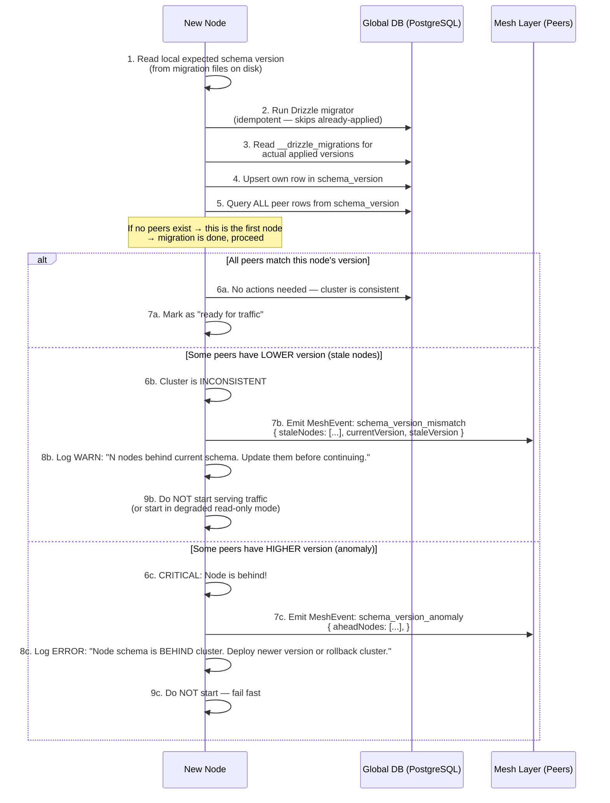

<DocMeta source="apps/api architecture + mesh design" scope="v3" />

## Problem Statement

The platform uses a **dual-database architecture**:

| Database | Scope | Technology | Coordination |
|----------|-------|------------|--------------|
| **Global** (PostgreSQL) | Shared across ALL nodes | Drizzle ORM + `node-postgres` | **Needs mesh coordination** — multiple nodes share one DB |
| **Local** (SQLite) | Per-node private state | Better Sqlite3 (via better-sqlite3) | None — each node owns its own |

### Why This Matters

In a multi-node deployment, the global database is **shared infrastructure**. If two API nodes start simultaneously, both could attempt to apply the same migration. While Drizzle's migrator is **idempotent** (it tracks which migration files have been applied in the `__drizzle_migrations` table), concurrent attempts can cause:

- **Lock contention** on the migrations tracking table
- **Partial migration states** if one node crashes mid-migration
- **Version drift** where nodes running different code versions would disagree on the schema
- **Transient failures** from race conditions (duplicate column errors, deadlocks)

### The Core Requirement

> **Schema migrations must only proceed when the mesh cluster is in a consistent state** — all nodes agree on the current schema version.

**This document defines the protocol for achieving that.**

---

## Schema Version Tracking

### The `schema_version` Table

A new global table to track the current schema version of each node and the cluster consensus:

```typescript
// apps/api/src/config/drizzle/global/schema/schema-version.schema.ts
import { pgTable, text, timestamp, integer, jsonb } from 'drizzle-orm/pg-core'

/**
 * Tracks the schema version of each mesh node and the cluster-wide consensus.
 *
 * - One row per node (node_id).
 * - When all nodes report the same `schema_version`, the cluster is consistent.
 * - A node may be on a LOWER version if it hasn't started/reconnected recently.
 * - A node should NEVER be on a HIGHER version than the others — that would mean
 *   it applied migrations that others don't know about, which is a critical anomaly.
 */
export const schemaVersion = pgTable('schema_version', {
  // Node identity
  nodeId: text('node_id').primaryKey(),

  // Schema version from the migration files (e.g. "0010" from the last applied migration file name)
  // Derived from the Drizzle migrations meta-table: SELECT max(version) FROM __drizzle_migrations
  schemaVersion: text('schema_version').notNull(),

  // The exact list of applied migration file names (for detailed comparison)
  appliedMigrations: jsonb('applied_migrations').notNull().$type<string[]>(),

  // Node's current app version (from package.json or VERSION file)
  appVersion: text('app_version').notNull(),

  // When this node last reported / verified its schema version
  lastVerification: timestamp('last_verification', { withTimezone: true })
    .notNull()
    .defaultNow(),

  // When this row was first created
  createdAt: timestamp('created_at', { withTimezone: true })
    .notNull()
    .defaultNow(),

  // When this row was last updated
  updatedAt: timestamp('updated_at', { withTimezone: true })
    .notNull()
    .defaultNow()
    .$onUpdate(() => new Date()),
})

export type SchemaVersion = typeof schemaVersion.$inferSelect
export type NewSchemaVersion = typeof schemaVersion.$inferInsert
```

### How It Gets Populated

Every node, on startup and periodically, reads the applied migrations from `__drizzle_migrations` and upserts its row in `schema_version`:

```typescript
// Pseudocode — runs in the migration coordinator service
async function reportSchemaVersion(nodeId: string): Promise<void> {
  // 1. Read applied migrations from Drizzle's meta table
  const migrations = await db.execute<{ version: string }>(
    sql`SELECT version FROM "__drizzle_migrations" ORDER BY version`
  )
  const appliedVersions = migrations.rows.map(r => r.version)
  const latestVersion = appliedVersions.at(-1) ?? '0000'
  const appVersion = pkg.version

  // 2. Upsert into schema_version
  await db
    .insert(schemaVersion)
    .values({
      nodeId,
      schemaVersion: latestVersion,
      appliedMigrations: appliedVersions,
      appVersion,
      lastVerification: new Date(),
    })
    .onConflictDoUpdate({
      target: schemaVersion.nodeId,
      set: {
        schemaVersion: latestVersion,
        appliedMigrations: appliedVersions,
        appVersion,
        lastVerification: new Date(),
        updatedAt: new Date(),
      },
    })
}
```

### Periodic Verification

The migration coordinator should also **periodically re-report** the schema version (every 60 seconds, or on mesh peer sync) so that:

- Newly joined nodes discover current state quickly
- The cluster detects version drift promptly
- Stale entries are identified by their `lastVerification` timestamp

---

## Node Startup Protocol

This is the core algorithm. Every API node runs this on startup **before** accepting traffic.



### Detailed Protocol Steps

#### Step 1: Discover Expected Version

The node discovers what schema version its code expects by checking which migration files exist on disk:

```typescript
// Discovery strategy: read migration folder + Drizzle meta
async function discoverExpectedVersion(): Promise<{
  fileMigration: string  // last version from migration files on disk
  appliedMigration: string // last version from __drizzle_migrations
  pendingMigrations: string[] // files not yet applied
}> {
  // 1. List migration files from the migrations folder
  const migrationFiles = await fs.readdir('src/config/drizzle/global/migrations')
  const fileVersions = migrationFiles
    .filter(f => f.endsWith('.sql'))
    .map(f => f.split('_')[0])  // "0010_something.sql" → "0010"
    .sort()

  const fileMigration = fileVersions.at(-1) ?? '0000'

  // 2. Read applied migrations from __drizzle_migrations
  const applied = await db.execute<{ version: string }>(
    sql`SELECT version FROM "__drizzle_migrations" ORDER BY version`
  )
  const appliedVersions = applied.rows.map(r => r.version)
  const appliedMigration = appliedVersions.at(-1) ?? '0000'

  // 3. Compute pending
  const pendingMigrations = fileVersions.filter(v => !appliedVersions.includes(v))

  return { fileMigration, appliedMigration, pendingMigrations }
}
```

#### Step 2: Apply Local Pending Migrations

If there are pending migrations (files on disk not yet applied), the node applies them **locally first** using Drizzle's migrator. This is safe because:
- The migrator is **idempotent** — it checks `__drizzle_migrations` before applying
- If another node already applied version X, this node's migrator skips it
- If two nodes try to apply version X simultaneously, PostgreSQL locking handles the race

```typescript
async function applyPendingMigrations(pending: string[]): Promise<void> {
  if (pending.length === 0) {
    logger.info('No pending migrations to apply')
    return
  }

  logger.info(`Applying ${pending.length} pending migration(s)...`)

  // Drizzle's migrate() function is safe for concurrent calls
  await migrate(db, { migrationsFolder: MIGRATIONS_PATH })

  logger.info(`Migrations applied successfully`)
}
```

#### Steps 3-4: Report Own Schema Version

```typescript
await reportSchemaVersion(nodeId)
```

This upserts the node's current state into `schema_version`.

#### Step 5: Query Peer Schema Versions

```typescript
async function getPeerSchemaVersions(): Promise<SchemaVersion[]> {
  const rows = await db
    .select()
    .from(schemaVersion)
    .where(ne(schemaVersion.nodeId, thisNodeId))

  return rows
}
```

#### Steps 6-9: Version Comparison and Decision

```typescript
type ClusterConsensus =
  | { status: 'consistent' }
  | { status: 'stale_nodes'; staleNodes: string[]; staleVersion: string; currentVersion: string }
  | { status: 'ahead_nodes'; aheadNodes: string[]; aheadVersion: string; localVersion: string }
  | { status: 'no_peers' }

async function evaluateClusterConsensus(
  localVersion: string,
  peers: SchemaVersion[]
): Promise<ClusterConsensus> {
  if (peers.length === 0) {
    return { status: 'no_peers' }
  }

  const peerVersions = new Set(peers.map(p => p.schemaVersion))

  // All peers at same version as local? Perfect.
  if (peerVersions.size === 1 && peerVersions.has(localVersion)) {
    return { status: 'consistent' }
  }

  // Some peers are behind
  const stalePeers = peers.filter(p => p.schemaVersion < localVersion)
  if (stalePeers.length > 0) {
    return {
      status: 'stale_nodes',
      staleNodes: stalePeers.map(p => p.nodeId),
      staleVersion: stalePeers[0]!.schemaVersion,
      currentVersion: localVersion,
    }
  }

  // Some peers are ahead — this node is behind
  const aheadPeers = peers.filter(p => p.schemaVersion > localVersion)
  if (aheadPeers.length > 0) {
    return {
      status: 'ahead_nodes',
      aheadNodes: aheadPeers.map(p => p.nodeId),
      aheadVersion: aheadPeers[0]!.schemaVersion,
      localVersion,
    }
  }

  // Multiple different versions among peers (general inconsistency)
  return {
    status: 'ahead_nodes',
    aheadNodes: peers.filter(p => p.schemaVersion > localVersion).map(p => p.nodeId),
    aheadVersion: [...peerVersions].sort().at(-1)!,
    localVersion,
  }
}
```

---

## Startup Decision Matrix

| Local State | Peer State | Action | Traffic Ready? |
|-------------|-----------|--------|----------------|
| Migrations applied | No peers exist | Report version, continue | ✅ Yes (first node) |
| Migrations applied | All peers match | Report version, continue | ✅ Yes |
| Pending migrations | No peers exist | Apply, report, continue | ✅ Yes (first node) |
| Pending migrations | All peers match | Apply, report, continue | ✅ Yes |
| Migrations applied | Some peers behind | Report version, emit warning, continue | ⚠️ Yes (graceful) |
| Pending migrations | Some peers on higher version | **DO NOT APPLY** — node is behind cluster | ❌ No |
| Any | Some peers on lower AND higher | Cluster is fractured — manual intervention needed | ❌ No |

### Graceful Degradation

When there are **stale nodes** but this node is consistent with the newest ones:

- The node can still serve traffic
- It should emit a cluster-wide warning via the mesh event system
- It should expose the stale node list via a health/status endpoint so ops can take action

### Hard Block

When this node is **behind the cluster** (peers have higher schema version):

- **Do not apply migrations** — this would be applying NEW migrations without knowing the current full schema state
- **Do not start serving traffic** — the schema might be incompatible
- Log a clear error: "Node X is behind the cluster. Deploy version Y to catch up."
- Expose this in the health check so the orchestrator doesn't route traffic to it

---

## Migration Execution

### Why Drizzle's Migrator Is Safe for Concurrent Use

Drizzle's `migrate()` function works by:

1. Reading all migration files from the migrations folder
2. Checking `__drizzle_migrations` to see which have been applied
3. Applying only the unapplied ones in order
4. Recording each applied migration in `__drizzle_migrations`

This is safe because:
- PostgreSQL's MVCC ensures consistent reads of `__drizzle_migrations`
- The migrator uses **serializable** semantics for the tracking table
- If two nodes apply the same migration concurrently, PostgreSQL's locking prevents duplicate application
- The `__drizzle_migrations` insert is the single source of truth

### Migration Service

```typescript
// apps/api/src/core/modules/database/global/services/global-migration-coordinator.service.ts
@Injectable()
export class GlobalMigrationCoordinatorService {
  private readonly logger = new AppLogger('api').scope(GlobalMigrationCoordinatorService.name)
  private readonly MIGRATIONS_PATH = 'src/config/drizzle/global/migrations'

  constructor(
    private readonly db: GlobalDatabaseService,
    private readonly meshEventService: MeshEventService,
    private readonly config: ConfigService,
  ) {}

  /**
   * Full startup migration protocol.
   * Called once during NestJS onModuleInit or via a dedicated lifecycle hook.
   */
  async runStartupProtocol(): Promise<MigrationStartupResult> {
    const nodeId = this.config.get('NODE_ID')!
    const startTime = Date.now()

    // Phase 1: Ensure schema_version table exists (it's part of the base schema)
    // This table should be created by migration 0000 or a "bootstrap" migration.
    // If the table doesn't exist, we can't run the protocol — fall back to
    // a safe default (apply migrations directly).

    // Phase 2: Apply local pending migrations
    const expected = await this.discoverExpectedVersion()
    if (expected.pendingMigrations.length > 0) {
      await migrate(this.db.getClient(), { migrationsFolder: this.MIGRATIONS_PATH })
    }

    // Phase 3: Report own version
    await this.reportSchemaVersion(nodeId)

    // Phase 4: Evaluate cluster
    const peers = await this.getPeerSchemaVersions(nodeId)
    const consensus = await this.evaluateClusterConsensus(expected.fileMigration, peers)

    switch (consensus.status) {
      case 'consistent':
      case 'no_peers':
        return { status: 'ready', duration: Date.now() - startTime }

      case 'stale_nodes':
        this.logger.warn(
          `Cluster has stale nodes: ${consensus.staleNodes.join(', ')} ` +
          `(version ${consensus.staleVersion} vs current ${consensus.currentVersion}). ` +
          `Update stale nodes to match.`
        )
        await this.meshEventService.emit('schema_version_mismatch', {
          type: 'stale_nodes',
          staleNodes: consensus.staleNodes,
          currentVersion: consensus.currentVersion,
          staleVersion: consensus.staleVersion,
          detectedBy: nodeId,
        })
        return { status: 'ready_with_warnings', staleNodes: consensus.staleNodes, duration: Date.now() - startTime }

      case 'ahead_nodes':
        this.logger.error(
          `This node (${nodeId}) is BEHIND the cluster. ` +
          `Peers ${consensus.aheadNodes.join(', ')} are on version ${consensus.aheadVersion}, ` +
          `but this node is on ${consensus.localVersion}. ` +
          `Deploy a newer version or rollback the cluster.`
        )
        await this.meshEventService.emit('schema_version_anomaly', {
          type: 'node_behind',
          aheadNodes: consensus.aheadNodes,
          aheadVersion: consensus.aheadVersion,
          localVersion: consensus.localVersion,
          nodeId,
        })
        return { status: 'blocked', reason: 'node_behind_cluster', duration: Date.now() - startTime }
    }
  }

  // ... private helper methods as described above
}
```

### Lifecycle Integration

The coordinator should be triggered automatically when the NestJS application starts:

```typescript
// Option A: Module lifecycle hook
@Module({ /* ... */ })
export class GlobalDatabaseModule implements OnModuleInit {
  constructor(private readonly coordinator: GlobalMigrationCoordinatorService) {}

  async onModuleInit() {
    const result = await this.coordinator.runStartupProtocol()
    if (result.status === 'blocked') {
      // Log and let the health check reflect the blocking state
      // The application starts but reports unhealthy
    }
  }
}

// Option B: Dedicated CLI command for manual/script usage
// bun --bun run cli db:migrate:global
```

### Health Check Integration

The migration status should be exposed via the health endpoint:

```typescript
@Injectable()
export class MigrationHealthIndicator {
  private status: 'ok' | 'behind' | 'blocked' = 'ok'
  private details: Record<string, unknown> = {}

  setStatus(status: 'ok' | 'behind' | 'blocked', details?: Record<string, unknown>) {
    this.status = status
    this.details = details ?? {}
  }

  async getHealth(): Promise<HealthIndicatorResult> {
    return {
      globalDbMigration: {
        status: this.status === 'ok' ? 'up' : 'down',
        ...this.details,
      },
    }
  }
}
```

---

## Event System Integration

The migration coordinator should emit mesh events so the cluster can react:

### Events

| Event | Trigger | Payload | Consumer |
|-------|---------|---------|----------|
| `schema_version_updated` | Node reports its version | `{ nodeId, schemaVersion, appVersion, appliedMigrations }` | Mesh peer sync, monitoring |
| `schema_version_mismatch` | Stale nodes detected | `{ type: 'stale_nodes', staleNodes, currentVersion, staleVersion, detectedBy }` | Admin dashboard, alerts |
| `schema_version_anomaly` | Node behind cluster | `{ type: 'node_behind', aheadNodes, aheadVersion, localVersion, nodeId }` | Health checks, auto-remediation |
| `migration_applied` | A migration was just applied | `{ nodeId, version, migrationName, duration }` | Audit log, streaming UI |

### Error Contracts (ORPC)

Following the existing [ORPC error patterns](/docs/dev/orpc):

```typescript
const migrationErrorContracts = {
  SCHEMA_MISMATCH: error()
    .message("Cluster schema version mismatch")
    .status(503)
    .data(z.object({
      staleNodes: z.array(z.string()),
      currentVersion: z.string(),
      staleVersion: z.string(),
    })),
  NODE_BEHIND: error()
    .message("Node schema is behind cluster")
    .status(503)
    .data(z.object({
      nodeVersion: z.string(),
      clusterVersion: z.string(),
      aheadNodes: z.array(z.string()),
    })),
}
```

---

## Error Scenarios

### Scenario 1: Network Partition During Migration

```
Node A (version 0010) ──┐
                        ├── Global DB ──┐
Node B (version 0005) ──┘              │
                                        │
Node C (new, version 0010) ─────────────┘
```

If Node C starts during a network partition where it can see the DB but not the mesh peers:

1. Node C queries `schema_version` → sees Node A and Node B rows
2. Node C applies any pending migrations (idempotent)
3. Node C reports its version (0010)
4. Partition prevents C from knowing that Node B is offline and behind

**Mitigation**: The migration coordinator should also check `mesh_cluster_nodes` for the **expected** set of peers. If some nodes are missing from `schema_version` but present in `cluster_nodes`, they are either offline or partitioned. In either case, **do not block** — the online nodes are consistent.

### Scenario 2: Concurrent Migration

```
Node A ──┐
         ├── Global DB
Node B ──┘
Both start simultaneously, both try to apply migration 0011
```

1. Both read `__drizzle_migrations` → last applied is 0010
2. Both try to apply 0011
3. Drizzle's migrator runs in a transaction
4. First node to commit records 0011 in `__drizzle_migrations`
5. Second node's transaction detects the conflict → rolls back → re-reads `__drizzle_migrations` → sees 0011 applied → skips

**Result**: Migration 0011 is applied exactly once. Both nodes converge. This is safe by design.

### Scenario 3: Two Nodes with Different Code Versions

```
Node A (app v2.0, schema 0010)
Node B (app v1.5, schema 0005)
Node C (new, app v2.0, schema 0010)
```

Node C starts:

1. Applies any pending migrations (none — Node A already applied 0010)
2. Reports own version 0010
3. Queries peers → Node A at 0010, Node B at 0005
4. **Decision**: Cluster is inconsistent (Node B stale)
5. Node C starts with warning, emits event, exposes in health check
6. **Outcome**: Node C serves normally, but ops is alerted about Node B

### Scenario 4: Node Rejoining After Long Absence

A node that was offline for weeks rejoins. Its schema version is far behind.

1. Node queries `__drizzle_migrations` → migration files on disk are old
2. But wait — the migration files are part of the code, so if the node was updated, it has the files
3. If the node was NOT updated (same code version) → its schema version matches peers → fine
4. If the node WAS updated (newer code with migration files) → it applies pending migrations
5. If the code is OLDER than peers → `ahead_nodes` scenario → blocked

**Key insight**: Migration files live in the codebase. A node that hasn't been updated doesn't have the new migration files. So the scenario of "long-absent node with old code rejoining modern cluster" resolves to `ahead_nodes` → blocked, which is correct.

### Scenario 5: Schema Version Table Doesn't Exist

If the `schema_version` table itself doesn't exist (fresh DB, no migrations applied yet):

1. The coordinator should catch the `relation "schema_version" does not exist` error
2. Fall back to: create the table as part of the bootstrap migration sequence
3. The `schema_version` table should be created by migration 0000 (the first migration)
4. If even migration 0000 hasn't been applied, the DB is empty — safe to apply all migrations

```typescript
async function ensureSchemaVersionTable(): Promise<void> {
  try {
    await db.execute(sql`SELECT 1 FROM schema_version LIMIT 1`)
  } catch {
    // Table doesn't exist — create it as part of bootstrap
    // This is a one-time migration that should also be in migration 0000
    await db.execute(sql`
      CREATE TABLE IF NOT EXISTS schema_version (
        node_id TEXT PRIMARY KEY,
        schema_version TEXT NOT NULL,
        applied_migrations JSONB NOT NULL DEFAULT '[]',
        app_version TEXT NOT NULL,
        last_verification TIMESTAMPTZ NOT NULL DEFAULT NOW(),
        created_at TIMESTAMPTZ NOT NULL DEFAULT NOW(),
        updated_at TIMESTAMPTZ NOT NULL DEFAULT NOW()
      )
    `)
  }
}
```

---

## Integration with Existing Mesh Services

The migration coordinator integrates with several existing services:

### Peer Discovery

Uses `MeshClusterSyncService` (or directly queries `cluster_nodes` table) to discover expected peers:

```typescript
async function getExpectedPeers(): Promise<string[]> {
  const rows = await db
    .select({ nodeId: clusterNodes.nodeId })
    .from(clusterNodes)
    .where(eq(clusterNodes.status, 'active'))
  return rows.map(r => r.nodeId)
}
```

### Event Emission

Uses the existing mesh event system (`SystemMeshTopicService` or `CoreEventStreamPoolService`) to emit schema version events. This allows:

- Admin dashboards to show real-time migration status
- Alerting systems to detect stuck clusters
- Other services to react (e.g., load balancer to avoid stale nodes)

### Health Endpoint

The existing `/health` endpoint should include migration status:

```typescript
// Register the migration health indicator
@Injectable()
export class HealthController {
  constructor(
    private readonly health: HealthCheckService,
    private readonly migrationHealth: MigrationHealthIndicator,
  ) {}

  @Get('health')
  @HealthCheck()
  check() {
    return this.health.check([
      () => this.migrationHealth.getHealth(),
    ])
  }
}
```

### Docker Compose Service Changes

The existing `migrate` docker-compose service should be replaced by the mesh-coordinated startup. The dependency chain becomes:

```yaml
services:
  api:
    depends_on:
      postgres:
        condition: service_healthy
    # No more migrate service dependency — migration is internal
```

---

## Rollback Strategy

### Code Rollback

If a migration needs to be rolled back:

1. **Write a reversal migration**: Create a new migration file that reverses the schema change
2. **Deploy the reversal**: Add the reversal migration to all nodes
3. **Let the nodes converge**: Each node applies the reversal on next startup
4. **Verify cluster consensus**: The `schema_version` table should converge

### Data Rollback

If data was migrated and needs to be restored:

1. **Restore from backup**: Use PostgreSQL point-in-time recovery
2. **Rollback the schema**: Apply the reversal migration
3. **Re-seed data**: Run the seed process if applicable

### Emergency Procedure

If a migration breaks the cluster:

1. **Identify the problematic node(s)** via `schema_version` table
2. **Isolate them**: Remove them from the load balancer
3. **Rollback the affected nodes**: Deploy the previous version
4. **Let them rejoin**: The startup protocol will detect that they're behind and allow them to catch up when the fix is deployed

---

## Implementation Phases

### Phase 1: Schema Version Table

- [ ] Create `schema_version` table schema in `apps/api/src/config/drizzle/global/schema/`
- [ ] Generate migration
- [ ] Add `reportSchemaVersion()` helper
- [ ] Update existing `register-mesh-node` CLI to also report schema version

### Phase 2: Migration Coordinator Service

- [ ] Create `GlobalMigrationCoordinatorService`
- [ ] Implement `discoverExpectedVersion()`, `getPeerSchemaVersions()`, `evaluateClusterConsensus()`
- [ ] Implement `runStartupProtocol()` with full decision matrix
- [ ] Add lifecycle hook (onModuleInit) in `GlobalDatabaseModule`

### Phase 3: Event Integration

- [ ] Define mesh events for schema version changes
- [ ] Wire event emission into coordinator
- [ ] Add event consumers for admin dashboard

### Phase 4: Health & Observability

- [ ] Create `MigrationHealthIndicator`
- [ ] Register in health check endpoint
- [ ] Add periodic schema version reporting (every 60s via mesh sync)

### Phase 5: Docker Compose Update

- [ ] Remove `migrate` service from docker-compose
- [ ] Update `entrypoint.dev.ts` and `entrypoint.prod.ts` to rely on coordinator
- [ ] Update `database-lifecycle.mdx` documentation

### Phase 6: Testing

- [ ] Unit tests for consensus evaluation logic
- [ ] Integration tests with multiple simulated nodes
- [ ] Chaos tests: concurrent migration attempts, network partitions, stale nodes rejoining

---

## Comparison with Alternatives

### Approach A: External Migration Service (Rejected)

A dedicated migration container that runs before API nodes start.

**Pros**:
- Simple, linear execution model
- No concurrency concerns

**Cons**:
- **Single point of failure**: The migration service must complete before any node starts
- **Doesn't work in multi-node**: If nodes can start independently, the migration service becomes a bottleneck
- **Out of band**: The migration logic lives outside the application, making version coupling harder
- **User's requirement**: "the global database migration should be handled by the api and mesh itself"

**Verdict**: Rejected by design. The mesh-coordinated approach is the specified solution.

### Approach B: Leader Election for Migration

One node is elected as the "migration leader" and runs migrations on behalf of the cluster.

**Pros**:
- Clear ownership of migration execution
- No concurrent migration attempts

**Cons**:
- Adds leader election complexity
- Leader could crash mid-migration → stale lock
- Requires fencing mechanism to prevent split-brain

**Verdict**: Better for very large migrations, but over-engineering for this use case. Drizzle's idempotent migrator handles concurrency safely without leader election.

### Approach C: Pessimistic Locking

Nodes acquire a `pg_advisory_lock` before running migrations.

**Pros**:
- Prevents concurrent execution
- PostgreSQL native — no external dependencies

**Cons**:
- Extra complexity for no real benefit (Drizzle migrator is already idempotent)
- Lock holders could crash → lock leak (though PG handles this on connection drop)
- Doesn't solve the version-check problem

**Verdict**: Not needed. Drizzle's idempotent migrator handles the concurrent case safely. The value of this protocol is **version checking** and **cluster consensus**, not preventing concurrent migration execution.

---

## Related Documentation

- [Database Lifecycle](/docs/dev/database-lifecycle) — Schema ownership, migration commands, dev/prod flow
- [Architecture Overview](/docs/architecture/architecture) — System boundaries, multi-node topology
- [Mesh-Consumer Boundary Pattern](/docs/architecture/mesh-consumer-boundary-pattern) — Mesh responsibilities vs domain responsibilities
- [Event System Streams](/docs/dev/event-system-streams) — Mesh event system used for migration events
- [ORPC Type-Safe API](/docs/dev/orpc) — Error contracts and typed endpoints
- [Production Deployment](/docs/deployment/production-deployment) — Full deployment sequence
