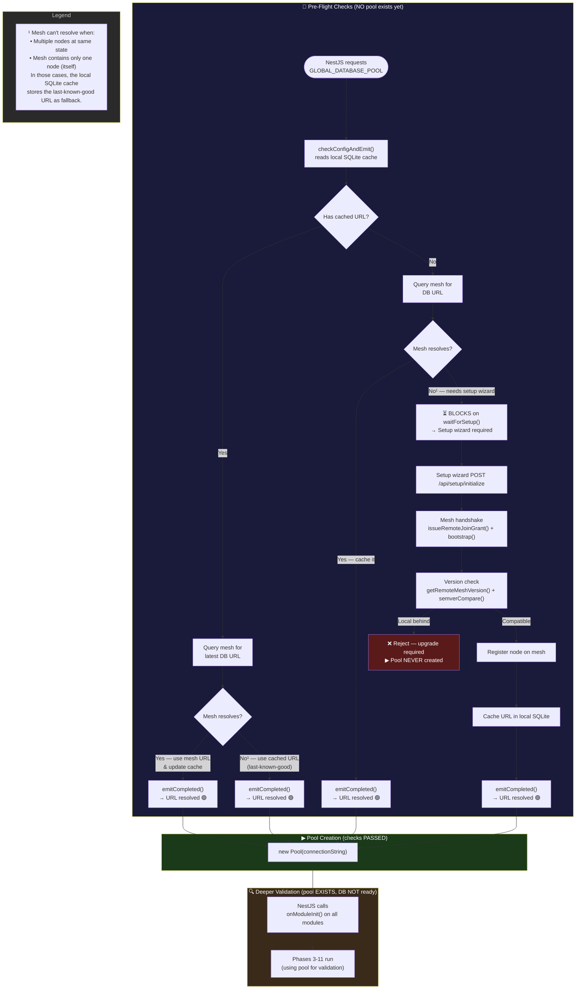
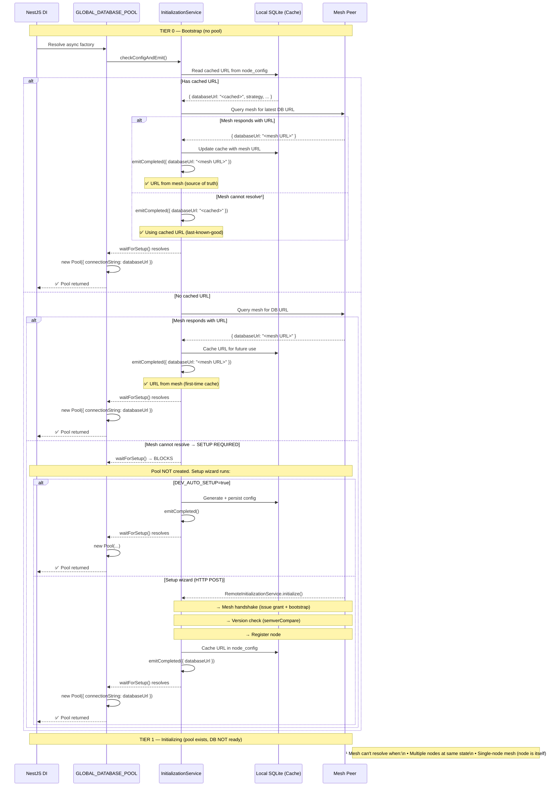
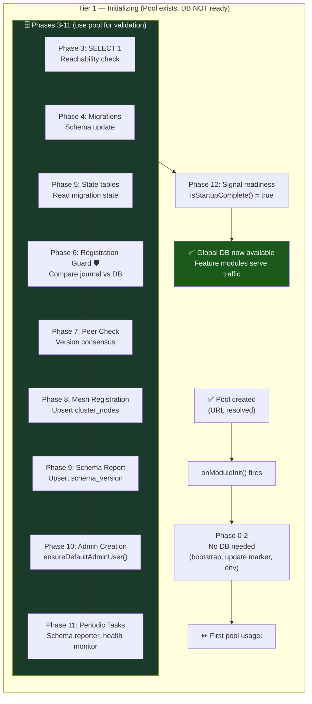
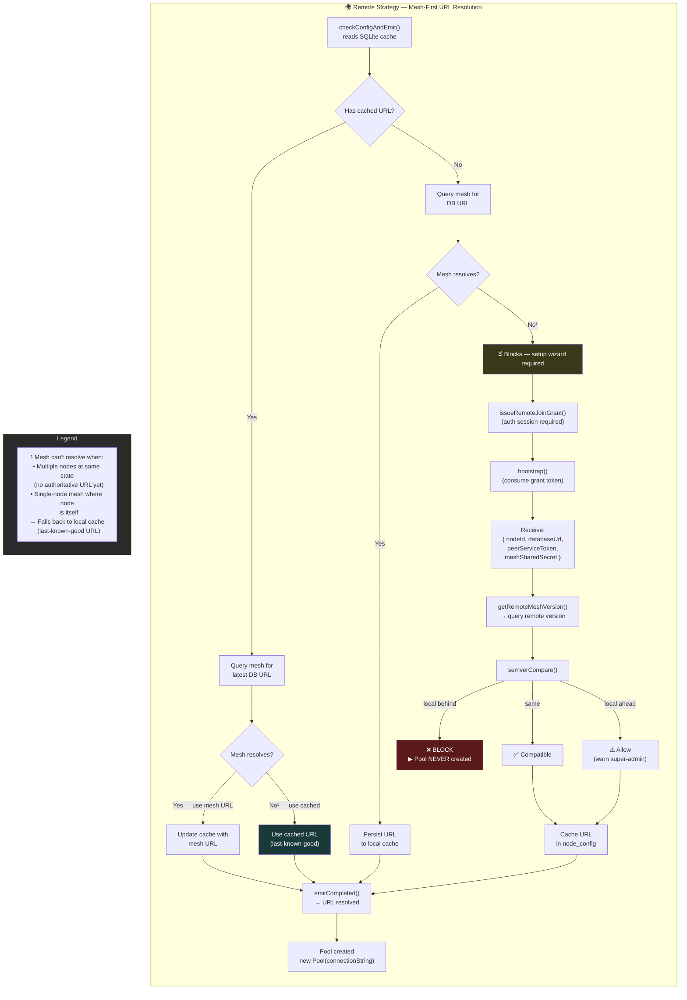
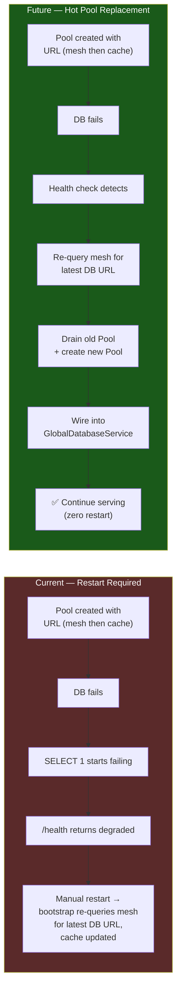

<DocMeta source="apps/api architecture" scope="v3" />

## Overview

The API has **three tiers**. The critical rule: **the global database is NOT available or initialized until all checks pass.**

| Tier | What happens | Global DB state | Feature traffic |
|------|-------------|-----------------|-----------------|
| **Tier 0 — Bootstrap** | DI container created, local SQLite available, pre-flight checks run, URL resolved | ❌ **Not available** — no pool exists yet (or pool is still being resolved) | ❌ Blocked |
| **Tier 1 — Initializing** | Pool created (URL resolved), then phases 3-11 use it for validation. Migrations, guard, peer check, registration all run. | ⚠️ **Pool exists but DB NOT ready** — transport only, still validating | ❌ Blocked |
| **Tier 2 — Ready** | Phase 12 signals `isStartupComplete() = true`. All checks passed. | ✅ **Fully available and initialized** | ✅ Serving |

### The Fundamental Rule

> **The global database is only "available and initialized" when Phase 12 completes.**
> Before that, the pool may exist as a transport, but nothing should treat the global DB as ready.

This means:
- ❌ At Tier 0: No pool. No global DB access at all.
- ❌ At Tier 1: Pool exists (URL was resolved), but the DB is NOT "available" — it's being validated (migrations, guard, peer check).
- ✅ At Tier 2: Everything checked, DB is finally available.

### What "Not Available" Means

Even though the pool object exists at Tier 1, the global DB is NOT considered "available" because:

| Check | Runs at | Why it matters |
|-------|---------|----------------|
| URL resolution | Tier 0 (before pool) | Validates we CAN connect |
| `SELECT 1` | Tier 1 Phase 3 | Validates the DB is REACHABLE |
| Migrations (Phase 4) | Tier 1 | Validates schema is CURRENT |
| Registration guard (Phase 6) | Tier 1 | Validates code vs DB compatibility |
| Peer check (Phase 7) | Tier 1 | Validates cluster consensus |
| Readiness signal (Phase 12) | Tier 1→2 boundary | ALL checks passed |

The pool is created AFTER URL resolution (an initial check), but BEFORE all the other checks. **The pool is never the indicator that the DB is ready.**

---

## Tier 0 — Bootstrap (No Pool, Pre-Flight Checks)

**When**: `NestFactory.create(AppModule)` starts.

**What happens, in order:**

```
NestFactory.create(AppModule)
  │
  ├── All sync providers created
  │
  ├── GLOBAL_DATABASE_POOL (async factory):
  │     ├── checkConfigAndEmit() → reads local SQLite cache
  │     │
  │     ├── CACHED URL EXISTS → try mesh first for latest:
  │     │     ├── Mesh responds with URL → use mesh URL, update cache
  │     │     │                           → emitCompleted()
  │     │     │                           → waitForSetup() resolves
  │     │     │                           → new Pool(connectionString)  ← POOL CREATED
  │     │     │
  │     │     └── Mesh can't resolve¹    → use cached URL
  │     │                                 → emitCompleted()
  │     │                                 → waitForSetup() resolves
  │     │                                 → new Pool(connectionString)  ← POOL CREATED
  │     │
  │     ├── NO CACHED URL → try mesh first:
  │     │     ├── Mesh responds with URL → use mesh URL, persist as cache
  │     │     │                           → emitCompleted()
  │     │     │                           → waitForSetup() resolves
  │     │     │                           → new Pool(connectionString)  ← POOL CREATED
  │     │     │
  │     │     └── Mesh can't resolve¹    → does NOT emit
  │     │                                 → waitForSetup() BLOCKS
  │     │                                 → NO POOL (needs setup wizard)
  │     │
│     ├── DEV_AUTO_SETUP=true:
│     │     ├── WITH DATABASE_URL env → generate config, persist
│     │     │                          → emitCompleted()
│     │     │                          → waitForSetup() resolves
│     │     │                          → new Pool(connectionString)  ← POOL CREATED
│     │     │
│     │     └── WITHOUT DATABASE_URL → log, no emit (setup wizard handles it)
│     │                                → waitForSetup() BLOCKS
│     │                                → SetupWizard sub-app auto-triggers
│     │                                → LocalInitializationService.initialize()
│     │                                → provision Postgres container (dockerode)
│     │                                → run migrations → seed data
│     │                                → emitCompleted()
│     │                                → Pool created
  │     │
  │     └── SETUP WIZARD (HTTP POST /api/setup/initialize):
  │           → RemoteInitializationService.initialize():
  │               → Mesh handshake (issue grant + bootstrap)
  │               → Mesh provides DB URL
  │               → Cache URL in local SQLite
  │               → emitCompleted() → waitForSetup() resolves
  │               → Pool created
  │
  └── ¹ Mesh can't resolve when: multiple nodes at same state (no single
      authoritative URL), or the mesh contains only one node (the node itself).
      The local SQLite cache stores the last-known-good URL as fallback.
```

### The Pool-As-Result Principle

The pool is **not a starting point**. It is the **result** of passing the URL resolution check:



> **Key insight**: The pool is NEVER created before the URL resolution check passes. For fresh remote installs, this check includes the full mesh handshake + version check. No check → no URL → no pool.

### What Is Available at Tier 0

| Service/Module | Status | Why |
|---------------|--------|-----|
| `EnvModule` | ✅ Operational | No DB needed |
| `LocalModule` (SQLite) | ✅ Operational | Local file, no global DB |
| `NodeConfigRepository` | ✅ Operational | Reads/writes local SQLite |
| `MeshInitializationService` | ✅ Operational | Can reach mesh peers |
| `MeshVersionService` | ✅ Operational | Can query mesh versions |
| `InitializationService` | ✅ Operational | Orchestrates setup |
| `SetupModule` (wizard) | ✅ Operational | HTTP endpoints for setup |
| `HealthModule` | ⚠️ Degraded | Returns `{ status: "degraded" }` |
| `StartupOrchestratorService` | ⏳ Registered, not running | Runs in `onModuleInit()` |
| `MigrationJournalService` | ✅ Operational | Reads local `_journal.json` |
| `GLOBAL_DATABASE_POOL` | ⏳ Being resolved OR blocked | Async factory |
| `GlobalDatabaseService` | ❌ Not available | Depends on pool |
| `AuthModule` | ❌ Locked | Depends on global DB |
| All feature modules | ❌ Locked | Depends on `isStartupComplete()` |

---

## Between Tier 0 and Tier 1 — The Pool Factory in Detail

The pool factory is the bridge between Tier 0 (no pool) and Tier 1 (pool exists). It has two phases:

1. **Check phase**: `checkConfigAndEmit()` — resolves URL or blocks for setup wizard
2. **Create phase**: `waitForSetup()` returns → `new Pool(connectionString)` — only if check passed



### The Two Kinds of "Checks"

It is crucial to distinguish two categories of checks:

| Category | What they validate | When they run | Pool needed? |
|----------|-------------------|---------------|--------------|
| **Pre-pool checks** | Is there a viable database URL (from mesh or cache)? Is the mesh compatible? | Inside the async factory (Tier 0) | ❌ No |
| **Post-pool checks** | Is the database schema compatible? Is the cluster healthy? | Phases 3-11 in `onModuleInit()` (Tier 1) | ✅ Yes |

**The pool exists ONLY because pre-pool checks passed.** The post-pool checks then validate deeper compatibility:

- Phase 3 (`SELECT 1`): Validates the pool can actually reach the DB
- Phase 4 (migrations): Validates schema is up to date
- Phase 6 (registration guard): Validates code vs DB migration state
- Phase 7 (peer check): Validates cluster version consensus

If any post-pool check fails, the node exits (in production) — even though the pool exists.

---

## Tier 1 — Initializing (Pool Exists, DB NOT Available)

**When**: Pool factory resolved → NestJS calls `onModuleInit()` on all modules.

**The pool exists at this point**, but the global database is **NOT** considered "available" or "initialized". Only the startup orchestrator uses the pool during these phases:

```
onModuleInit() fires on all modules
  │
  ├── Phase 0: Bootstrap (read journal, local config, log version)
  │     (Does NOT need global DB — uses local SQLite + filesystem)
  │
  ├── Phase 1: Update marker (check /tmp/pending-update.json)
  │     (Does NOT need global DB)
  │
  ├── Phase 2: Env validation (validateApiEnvSafe)
  │     (Does NOT need global DB)
  │
  ├── Phase 3: DB connectivity (SELECT 1) ← FIRST USE OF POOL
  ├── Phase 4: Run Drizzle migrations
  ├── Phase 5: Read state tables (__drizzle_migrations, cluster_migration_state)
  ├── Phase 6: Registration guard 🛡️
  ├── Phase 7: Peer version check + cluster consensus
  ├── Phase 8: Register this node in the mesh
  ├── Phase 9: Report schema version
  ├── Phase 10: Create default admin user
  ├── Phase 11: Start periodic tasks
  │
  └── Phase 12: Signal readiness
        → isStartupComplete() = true
        → GLOBAL DB IS NOW AVAILABLE
        → Feature modules start serving
```



### What the Pool Is (and Isn't) at Tier 1

| Aspect | Truth | Why |
|--------|-------|-----|
| **Pool object exists** | ✅ Yes | URL was resolved → `new Pool(connectionString)` |
| **Can execute queries** | ✅ Yes | Pool is a valid Postgres connection |
| **Global DB is "available"** | ❌ **No** | Migrations may not have run, guard hasn't passed, peer check hasn't completed |
| **Feature modules can use it** | ❌ **No** | All feature modules are locked until Phase 12 |
| **AuthModule is active** | ❌ **No** | Locked until Phase 12 |
| **Health endpoint returns OK** | ❌ **No** | Returns `{ status: "degraded" }` until Phase 12 |

### What Happens If a Post-Pool Check Fails

```mermaid
flowchart LR
    PHASE6["Phase 6: Registration Guard"] --> CHECK{"Journal matches\nDB migrations?"}
    CHECK -->|Yes| PASS6["✅ Pass → continue"]
    CHECK -->|No| FAIL6{"Is production?"}
    FAIL6 -->|Yes| EXIT5["❌ process.exit(5)\nNode too old"]
    FAIL6 -->|No (dev)| WARN6["⚠️ Warn only → continue"]
    
    PHASE7["Phase 7: Peer Check"] --> PEER_CHECK{"Version consensus?"}
    PEER_CHECK -->|same| PASS7["✅ Continue"]
    PEER_CHECK -->|local_ahead| WARN7["⚠️ Warn → continue"]
    PEER_CHECK -->|local_behind| EXIT7["❌ process.exit(5)\nNode behind mesh"]
    PEER_CHECK -->|no_peers| CONTINUE7["ℹ️ Create initial state"]
```

Even though the pool exists, a check failure at Phase 6 or 7 will cause the process to exit (in production). The global DB is NEVER available if these checks fail.

---

## Tier 2 — Ready (Global DB Available, Feature Traffic Active)

**When**: Phase 12 sets `isStartupComplete() = true`.

**Now, and only now**, is the global database fully "available and initialized":

- ✅ All pre-pool checks passed (URL resolved)
- ✅ All post-pool checks passed (migrations, guard, peer check, registration)
- ✅ Feature modules unlocked
- ✅ Auth module active
- ✅ Health endpoint returns `{ status: "ok" }`
- ✅ Feature traffic flowing

### Module Readiness Truth Table

| Service / Module | Tier 0 (Bootstrap, no pool) | Tier 1 (Initializing, pool exists) | Tier 2 (Ready) |
|---|---|---|---|
| **EnvModule** | ✅ Operational | ✅ | ✅ |
| **LocalModule** (SQLite) | ✅ Operational | ✅ | ✅ |
| **NodeConfigRepository** | ✅ Operational | ✅ | ✅ |
| **MeshInitializationService** | ✅ Operational | ✅ | ✅ |
| **MeshVersionService** | ✅ Operational | ✅ | ✅ |
| **MigrationJournalService** | ✅ Operational | ✅ | ✅ |
| **SetupModule** (wizard) | ✅ Operational | ✅ | ✅ |
| **HealthModule** | ⚠️ degraded | ⚠️ degraded | ✅ full |
| **GLOBAL_DATABASE_POOL** | ⏳ Resolving or blocked | ✅ Created | ✅ |
| **GlobalDatabaseService** | ❌ Not available | ⚠️ Used by orchestrator, NOT available to features | ✅ Available to all |
| **Drizzle Migrations** | ❌ Not run | 🔄 Running Phase 4 | ✅ Done |
| **Registration Guard** | ❌ Not run | 🔄 Running Phase 6 | ✅ Passed |
| **Peer Version Check** | ❌ Not run | 🔄 Running Phase 7 | ✅ Done |
| **Mesh Registration** | ❌ Not run | 🔄 Running Phase 8 | ✅ Done |
| **Schema Reporting** | ❌ Not run | 🔄 Running Phase 9 | ✅ Done (60s periodic) |
| **AuthModule** | ❌ Locked | ❌ Locked | ✅ Operational |
| **All Feature Modules** | ❌ Locked | ❌ Locked | ✅ Operational |

Key distinction in Tier 1:
- ❌ **GlobalDatabaseService** is listed as "Not available to features" — the orchestrator uses it internally, but it's NOT a public resource yet
- ⚠️ The pool is marked as existing but the DB is NOT ready

---

## The State Machine (Complete View)

```mermaid
stateDiagram-v2
    [*] --> BOOTSTRAP: NestFactory.create()
    
    state BOOTSTRAP {
        [*] --> PRE_FLIGHT: Sync providers created
        
        state PRE_FLIGHT {
            [*] --> CHECK_CONFIG: checkConfigAndEmit()
            CHECK_CONFIG --> URL_RESOLVED: URL found
            CHECK_CONFIG --> SETUP_WIZARD: No URL
            
            state SETUP_WIZARD {
                [*] --> MESH_HANDSHAKE: issueRemoteJoinGrant()
                MESH_HANDSHAKE --> VERSION_CHECK: bootstrap()
                VERSION_CHECK --> REGISTER: Compatible
                VERSION_CHECK --> REJECTED: Incompatible
                REGISTER --> URL_RESOLVED: emitCompleted()
            end
            
            URL_RESOLVED --> POOL_CREATED: new Pool(connectionString)
        end
        
        POOL_CREATED --> BOOTSTRAP_COMPLETE
    end
    
    BOOTSTRAP_COMPLETE --> INITIALIZING: onModuleInit() fires
    
    state INITIALIZING {
        [*] --> PHASES_0_2: No DB needed
        
        PHASES_0_2 --> PHASES_3_5: First pool usage
        
        state PHASES_3_5 {
            [*] --> SELECT_1: Phase 3
            SELECT_1 --> MIGRATIONS: Phase 4
            MIGRATIONS --> STATE_TABLES: Phase 5
        end
        
        PHASES_3_5 --> REGISTRATION_GUARD: Phase 6
        
        state REGISTRATION_GUARD {
            [*] --> CHECK_MIGRATIONS: Compare journal vs DB
            CHECK_MIGRATIONS --> GUARD_PASS: Match
            CHECK_MIGRATIONS --> GUARD_FAIL_PROD: Mismatch (PROD)
            CHECK_MIGRATIONS --> GUARD_FAIL_DEV: Mismatch (DEV)
            GUARD_FAIL_PROD --> EXIT_5: process.exit(5)
            GUARD_FAIL_DEV --> PHASES_7_9: Warn only
            GUARD_PASS --> PHASES_7_9
        end
        
        PHASES_7_9 --> PHASES_10_11
        PHASES_10_11 --> SIGNAL_READY: Phase 12
    end
    
    INITIALIZING --> READY: isStartupComplete() = true
    
    state READY {
        [*] --> FEATURE_TRAFFIC
    }
    
    EXIT_5 --> [*]
    REJECTED --> [*]
    
    note left of PRE_FLIGHT
        TIER 0 — NO pool exists.
        URL must be resolved first.
        Setup wizard includes mesh
        handshake + version check.
    end note
    
    note right of INITIALIZING
        TIER 1 — Pool EXISTS.
        Global DB is NOT available.
        Phases 3-11 validate
        schema compatibility.
        Feature modules LOCKED.
    end note
    
    note right of READY
        TIER 2 — Global DB is
        finally available.
        All checks passed.
        Feature traffic flows.
    end note
```

---

## The Complete Execution Timeline

```mermaid
gantt
    title Full Startup Sequence (time not to scale)
    dateFormat X
    axisFormat %s
    
    section Tier 0 — Bootstrap
    Create sync providers       : 0, 1
    checkConfigAndEmit         : 1, 2
    Setup wizard (if needed)   : 1, 3
    Pool created               : 2, 3
    
    section Tier 1 — Initializing
    Phase 0-2 (no DB)          : 3, 4
    Phase 3: SELECT 1          : 4, 5
    Phase 4: Migrations        : 5, 6
    Phase 5: State tables      : 6, 6
    Phase 6: Guard             : 6, 7
    Phase 7: Peer check        : 7, 8
    Phase 8-11: Register, etc  : 8, 9
    Phase 12: Readiness        : 9, 10
    
    section Tier 2 — Ready
    Feature traffic            : 10, 12
    Global DB available        : 10, 12
```



Notice: **The global DB is only marked as "available" at the Tier 1→2 boundary (Phase 12), NOT when the pool is created.**

---

## Remote Strategy — Mesh Is Primary URL Source, Local Cache Is Fallback

For remote strategy nodes, the DB URL **always comes from the mesh first**. The local SQLite cache is used only when the mesh cannot resolve (e.g., multiple nodes at same state, or single-node mesh where the node is itself).

1. Node starts → DI bootstrap → pool factory invoked
2. `checkConfigAndEmit()` reads `node_config` cache:
   - **Cached URL exists** → query mesh for latest URL first
     - Mesh responds → **use mesh URL** (source of truth), update cache
     - Mesh can't resolve → **use cached URL** (last-known-good fallback)
   - **No cached URL** → query mesh for URL
     - Mesh responds → **use mesh URL**, persist as cache
     - Mesh can't resolve → **blocks**. Needs setup wizard.
3. Setup wizard (`POST /api/setup/initialize`, for first-time setup):
   - `issueRemoteJoinGrant(meshUrl, authToken)` → creates a one-time grant on the remote mesh
   - `bootstrap(meshUrl, grantToken, serverUrl)` → consumes the grant → receives `{ databaseUrl, nodeId, ... }`
   - `getRemoteMeshVersion(meshUrl)` → queries the remote mesh's deployer version
   - `semverCompare(localVersion, remoteVersion)` → blocks join if local is behind
   - `register_node` → registers node on the mesh
   - `finalize` → caches URL and config to `node_config`
4. `emitCompleted({ databaseUrl })` → `waitForSetup()` resolves → **pool created**



> **For a restart with cached config**: The node first queries the mesh for the latest URL. If the mesh responds, the mesh's URL is used (and the cache is updated). If the mesh cannot resolve, the cached URL from the previous session is used as a fallback. The registration guard (Phase 6) then re-verifies schema compatibility after the pool exists. This is safe because:
> - The mesh is the source of truth for the URL (when it can respond)
> - The local cache holds the last-known-good URL (when mesh can't resolve)
> - Phase 6 re-validates that the local code is still compatible with the stored schema

---

## Dev Mode Differences

| Aspect | Production | Development |
|--------|-----------|-------------|
| **Registration guard** (Phase 6) | Exits with `process.exit(5)` | Warns only, continues |
| **Peer version check** (Phase 7) | Full consensus protocol, can block | Skipped entirely |
| **Mesh registration** (Phase 8) | Required for cluster join | Optional |
| **Fatal startup errors** | `process.exit(1)` | Logged, app continues |
| **DB URL acquisition** | Mesh-first (primary), local SQLite cache (fallback), setup wizard (first-time) | `DEV_AUTO_SETUP=true` bypasses wizard |
| **Database provision** | User provides existing Postgres | Auto-provisions Docker Postgres 16 |
| **Health endpoint** | Returns readiness only | Returns full debug info |

---

## How DB URL Can Change Mid-Run

The database URL is resolved once during bootstrap (mesh-first, with local cache fallback). If it changes mid-run (failover, migration), the current architecture requires a restart:



## Setup Wizard API Endpoints

The setup wizard is exposed via ORPC endpoints under `/api/setup/`:

| Endpoint | Method | Purpose |
|----------|--------|---------|
| `/state` | GET | Current wizard state (`not_started` → `completed`) |
| `/node-status` | GET | Persisted node configuration status |
| `/state-machine` | GET | Canonical state machine definition (states, transitions) |
| `/probe/database` | POST | Test a PostgreSQL URL before submitting |
| `/probe/mesh` | POST | Test a mesh URL before submitting |
| `/remote/auth` | POST | Authenticate against a remote mesh node |
| `/trigger` | POST | Start initialization in background (returns `{ accepted }`) |
| `/initialize` | POST | Start initialization AND return SSE event stream |
| `/stream` | GET | Subscribe to initialization SSE events |

### `initialize` Endpoint

The `POST /setup/initialize` endpoint composes `triggerInitialize` + `getInitializeStream` into a single call. The client receives an Observable (SSE) that emits progress events:

```javascript
const stream = await client.initialize({
  strategy: 'local',
  name: 'My Node',
  email: 'admin@example.com',
  password: '••••••••',
  organizationName: 'My Org',
  serverUrl: 'https://node.example.com'
})
// stream emits: step_detail → snapshot → log → completed
```

### `getStateMachine` Endpoint

Returns a `SetupStateMachine` object defining the valid states and transitions:

```json
{
  "initialState": "not_started",
  "terminalStates": ["completed"],
  "states": ["not_started", "awaiting_strategy", "awaiting_credentials",
             "awaiting_remote_auth", "provisioning", "completed"],
  "transitions": [
    { "from": "not_started", "to": "awaiting_strategy", "event": "start_setup" },
    { "from": "awaiting_strategy", "to": "awaiting_credentials", "event": "choose_local" },
    { "from": "awaiting_strategy", "to": "awaiting_remote_auth", "event": "choose_remote" },
    { "from": "awaiting_credentials", "to": "provisioning", "event": "start_initialize" },
    { "from": "awaiting_remote_auth", "to": "provisioning", "event": "start_initialize" },
    { "from": "provisioning", "to": "completed", "event": "provisioning_complete" }
  ]
}
```

The frontend uses this definition to render the setup wizard UI without hardcoded state machine logic.

---

## Related Documentation

- [Global DB Migration Management](./global-db-migration-management.mdx) — the 12-phase protocol in detail
- [API Architecture](../api-architecture.mdx) — overall module structure
- [Mesh Coordination](../mesh/mesh-coordination.mdx) — peer-to-peer mesh operations
