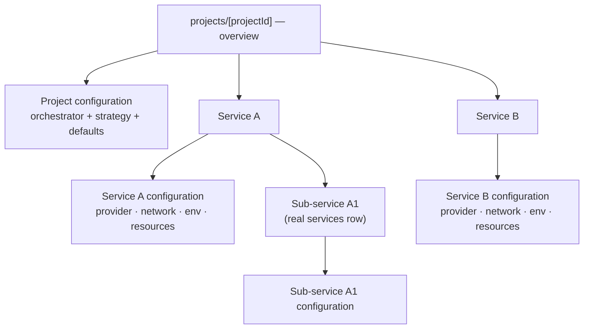
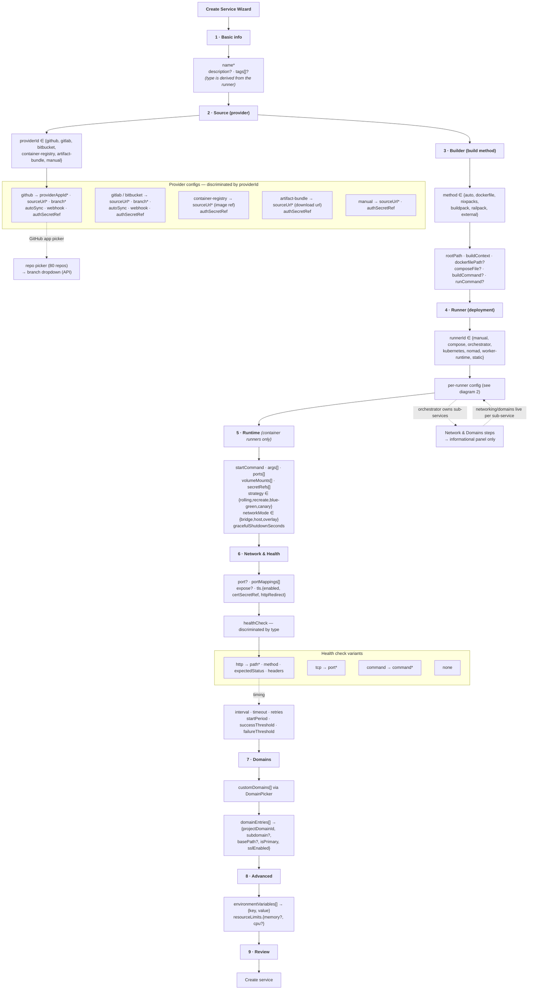
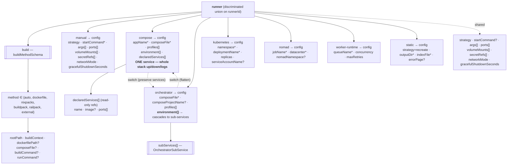
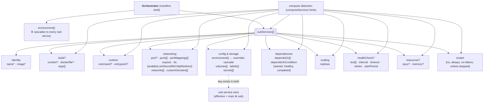
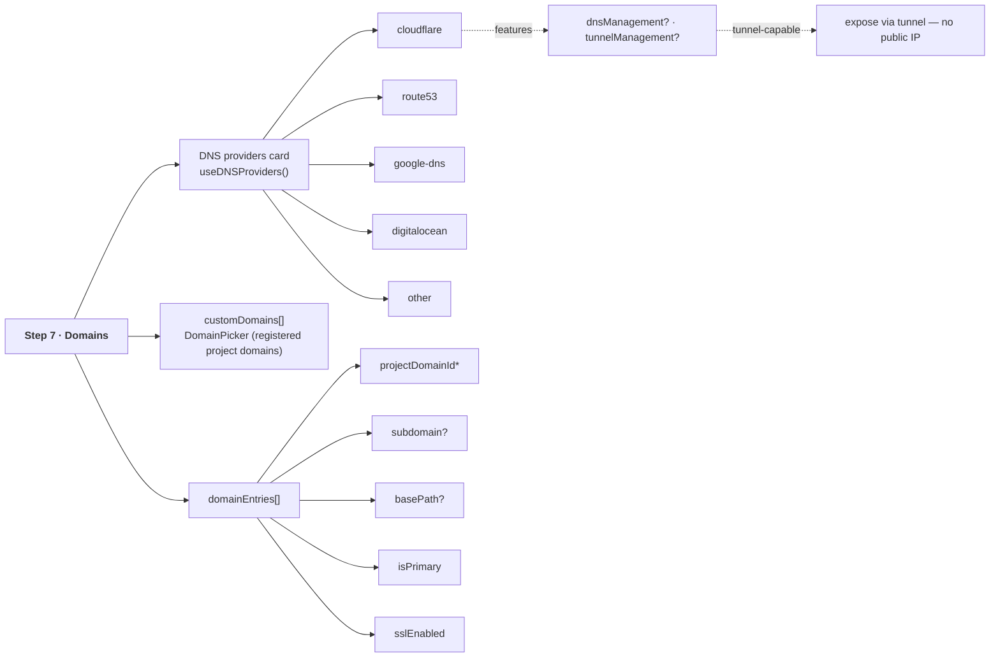
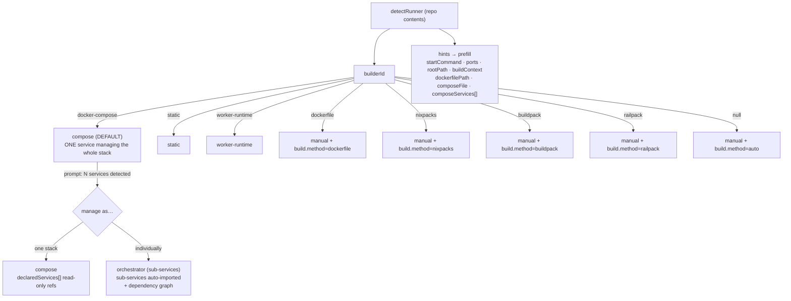

# Service Creation Wizard — Feature Reference
This document is the **complete feature catalog** for the service creation
wizard (`apps/web/src/app/dashboard/projects/_components/CreateServiceWizard.tsx`).

This document is the **complete feature catalog** for the service creation
wizard (`apps/web/src/app/dashboard/projects/_components/CreateServiceWizard.tsx`).
Every step, every runner type, every build method, and every network/health/
domain option is described here so the form can be extended without guessing.

---

## Overview

The wizard is a 9-step flow:

| # | Step | File | Purpose |
|---|------|------|---------|
| 1 | Basic info | `steps/StepBasicInfo.tsx` | Name, type, description, tags |
| 2 | Source | `steps/StepProvider.tsx` | Provider (GitHub app/repo/branch, registry, manual) |
| 3 | **Builder** | `steps/StepBuilder.tsx` | **How the image is built** (build method + paths) |
| 4 | **Runner** | `steps/StepRunner.tsx` | **How the service runs** (runner type + per-runner config) |
| 5 | **Runtime** | `steps/StepRuntime.tsx` | Process, ports, volumes, secrets, deployment policy |
| 6 | **Network** | `steps/StepNetwork.tsx` | Container port, port forwards, internet exposure, TLS, health check |
| 7 | **Domains** | `steps/StepDomains.tsx` | Custom domains + subdomain/base-path/SSL bindings |
| 8 | Advanced | `steps/StepAdvanced.tsx` | Environment variables, resource limits |
| 9 | Review | `steps/StepReview.tsx` | Summary of every choice |

The two load-bearing concepts that were previously conflated:

- **Builder** — how a container image is *produced* (auto / Dockerfile /
  Nixpacks / Buildpack / Railpack / external).
- **Runner** — how the built service is *deployed & executed* (manual container /
  compose stack / orchestrator sub-services / Kubernetes / Nomad / worker-runtime /
  static).

> **Service type** is now *derived from the runner* (dokploy-style), not a freeform
> category: `manual → application`, `compose → compose`, `orchestrator → sub-services`,
> `worker-runtime → worker`, `kubernetes/nomad/static → same`. A compose file detected
> with **multiple services** prompts the choice: manage as **one stack** (compose runner,
> `docker compose up/down/logs` on the whole stack) or **sub-services** (orchestrator,
> each service individually managed with a dependency graph).

---

## Configuration hierarchy: project (orchestrator) vs service

Two distinct configuration levels, each with its own page:

### Project level — `projects/[projectId]/configuration`

The **orchestrator / strategy layer**. It configures *how services behave as a
group* and provides **defaults that cascade into services**:

| Concern | What it controls |
|---------|------------------|
| General | Name, description, base domain |
| Deployment | Strategy (rolling/blue-green/canary/recreate), auto-deploy, preview environments, retention |
| Security | Access policy, secrets policy, build isolation |
| Resources | Default CPU/memory/storage limits applied to new services |
| Notifications | Alert channels (webhook/slack/email) for deployment events |
| Environments | The environment matrix (production/staging/preview/development) every service inherits |
| Dependencies | Service-to-service dependency graph (deploy order, readiness gating) |

### Service level — `projects/[projectId]/services/[serviceId]`

The **per-service execution layer**. Each service (including sub-services —
they are real `services` rows) has its own detail page with its own
configuration:

| Section | What it controls |
|---------|------------------|
| General | Identity, resources, deployment retention |
| Provider | Git provider / registry / manual source + branch |
| Network | Port, network mode, exposure, TLS, custom domains, health check |
| Environment | Per-environment variable overrides, templates |
| Deployments / Logs / Monitoring / Previews | Operational views for this one service |

**Navigation:** clicking a service anywhere (project page table, dependency
graph, sub-service tree) navigates to **its own** detail page — never to the
project configuration. The project page header exposes "Project configuration"
for the orchestrator/strategy layer.

---

## Full data model (Mermaid)

### 1. Wizard flow — every step and every field

### 2. Runner & build — full schema hierarchy

### 3. Orchestrator sub-service — full model (the hierarchy)

### 4. DNS providers & domains

### 5. Detection → runner mapping

---

## Step 3 — Builder

### Build methods (`runner.build.method`)

| Method | Meaning |
|--------|---------|
| `auto` | Detect the best method from the repository contents |
| `dockerfile` | Build with the repository's Dockerfile |
| `nixpacks` | Zero-config containerization (language auto-detection) |
| `buildpack` | Cloud Native Buildpacks (Heroku-style) |
| `railpack` | Railpack runtime detection & builds |
| `external` | Use a prebuilt image — **no build step** |

### Build fields (`runner.build.*`)

| Field | Used by | Meaning |
|-------|---------|---------|
| `rootPath` | all build methods | Directory containing the app entrypoint |
| `buildContext` | all build methods | Docker build context path |
| `dockerfilePath` | `dockerfile` | Path to the Dockerfile (e.g. `docker/Dockerfile`) |
| `composeFile` | `dockerfile` | Reference compose file (when an orchestrator is used) |
| `buildCommand` | nixpacks/buildpack/railpack | Custom build command override |
| `runCommand` | nixpacks/buildpack/railpack | Custom run command override |

Every path field is an **autocomplete** — pick a preset or type a custom value.

---

## Step 4 — Runner

### Runner types (`runner.runnerId`)

| Runner | Meaning | Config keys |
|--------|---------|-------------|
| `manual` | Single container with an explicit start command (classic `docker run`) | `startCommand` (required) |
| `orchestrator` | Multi-service manifest (compose) that **owns detected sub-services** | `composeFile`, `composeProjectName`, `profiles`, `subServices[]`, `environment` (cascades) |
| `kubernetes` | Kubernetes Deployment workload | `namespace`, `deploymentName`, `replicas`, `serviceAccountName` |
| `nomad` | Nomad job on the cluster | `jobName`, `datacenter`, `nomadNamespace` |
| `worker-runtime` | Queue consumer with N concurrent workers | `queueName`, `concurrency`, `maxRetries` |
| `static` | Static file server (SPA / JAMstack) | `outputDir`, `indexFile`, `errorPage` |

> **Note:** `docker-compose` and `docker-swarm` are **no longer runner types.**
> A detected compose file becomes an **orchestrator** runner whose sub-services
> are parsed out of the manifest and managed individually.

### Orchestrator hierarchy

The orchestrator is a **manifest shell**. Networking, ports, exposure, TLS and
domains belong to the **sub-services**, NOT the orchestrator. When sub-services
exist, the wizard's Network and Domains steps are replaced by an informational
panel pointing to the per-sub-service editors in the Runner step.

**Environment cascade:** the orchestrator's `runner.config.environment` merges
into every sub-service. A sub-service's own environment key **overrides** the
cascaded value. The sub-service editor shows a live "effective environment"
preview (main + this, tagged `cascaded` / `override`).

### Sub-services are REAL service rows

Sub-services are **not** just a JSON blob in the runner config — on create,
the wizard's `subServices[]` manifest is materialized as **real `services`
rows** linked to the parent via `parentId`, in the **same transaction** as the
parent:

- **`parentId`** — self-referencing FK to `services.id` (cascade delete).
- **`parentPath`** — materialized ancestor path (e.g. `<parentId>/<childId>`)
  for cheap subtree queries (`LIKE '<subtreePath>%'`).
- **`depth`** — nesting level (root = 0, child = 1, grandchild = 2, …).

Any service may have children (it becomes an orchestrator) and a child may
itself have children — **full nesting**. Each sub-service behaves like a
normal service: it has its own detail page, deployments, logs, config and
environments, but it is linked to its parent.

**API surface:**

| Endpoint | Purpose |
|----------|---------|
| `POST /services` with `children[]` | Create parent + whole subtree atomically |
| `PUT /services/:id` with `parentId` | Reparent (moves the whole subtree, rebuilds paths) |
| `GET /services/:id/children` | Direct children (one level) |
| `GET /services/:id/subtree` | Full nested descendant tree |

The runner config still keeps `subServices[]` as the **wizard authoring
manifest** (the source of the child rows); the DB rows are the source of
truth at runtime. The service overview page renders a recursive
**Sub-services tree** where every node links to its own detail page.

### Orchestrator sub-services (`runner.config.subServices[]`)

Each sub-service is **as complex as the main service** — it mirrors every main
service concern:

| Concern | Fields |
|---------|--------|
| Identity | `name`, `image` |
| Build | `build.context`, `build.dockerfile`, `build.args` |
| Runtime | `command`, `entrypoint` |
| Networking | `port`, `ports`, `portMappings[]`, `expose`, `tls.{enabled,certSecretRef,httpRedirect}`, `networks`, `customDomains` |
| Config / storage | `environment` (overrides cascade), `volumes`, `labels`, `secrets` |
| Dependencies | `dependsOn`, `dependsOnCondition` (started/healthy/completed) |
| Scaling | `replicas` |
| Health | `healthCheck.{test,interval,timeout,retries,startPeriod}` |
| Resources | `resources.{cpus,memory}` |
| Restart | `restart` (no/always/on-failure/unless-stopped) |

Sub-services are **auto-completed** from the compose detection (`composeServices`
hints): image, build context/dockerfile/args, command, entrypoint, ports,
networks, environment, volumes, labels, secrets, depends_on (with conditions),
replicas, healthcheck, deploy.resources and restart policy are all parsed out of
the manifest. Wizard-level concerns (expose, TLS, custom domains, port mappings)
default to off/empty and are filled by the user.

### Autocomplete fields

`startCommand`, `composeFile`, `namespace`, `datacenter`, `queueName`,
`outputDir`, `indexFile`, sub-service `customDomains` and certificate secrets are
all **autocompletes** (select a preset or type a custom value).

---

## Step 5 — Runtime

Only shown for **container-style** runners (`manual`, `kubernetes`, `nomad`,
`worker-runtime`). Orchestrators and static sites declare their process
differently and are skipped.

| Field | Meaning |
|-------|---------|
| `runner.config.startCommand` | Process command that starts the container |
| `runner.config.args` | Extra CLI arguments (comma-separated) |
| `runner.config.ports` | Ports exposed by the container |
| `runner.config.volumeMounts` | Volume mounts (`/host:/container`) |
| `runner.config.secretRefs` | Secret references consumed by the service |
| `runner.config.strategy` | Rollout strategy: `rolling`, `recreate`, `blue-green`, `canary` |
| `runner.config.networkMode` | `bridge`, `host`, `overlay` |
| `runner.config.gracefulShutdownSeconds` | Grace period before SIGKILL |

---

## Step 6 — Network & Health

### Networking

| Field | Meaning |
|-------|---------|
| `network.port` | Primary container port (ingress + health default) |
| `network.portMappings[]` | Extra forwards: `{ containerPort, hostPort?, protocol, name? }` |
| `network.expose` | Expose to the internet via the ingress (Traefik) |
| `network.tls.enabled` | Terminate HTTPS on the edge |
| `network.tls.certSecretRef` | Certificate source (e.g. `letsencrypt`) |
| `network.tls.httpRedirect` | Redirect HTTP → HTTPS |

### Health check (`network.healthCheck`)

| Type | Fields |
|------|--------|
| `http` | `path`, `method` (GET/HEAD/POST), `expectedStatus`, `headers` |
| `tcp` | `port` |
| `command` | `command` |
| `none` | — |

All non-none types share timing/threshold fields:

| Field | Meaning |
|-------|---------|
| `interval` | Seconds between checks |
| `timeout` | Per-check timeout |
| `retries` | Retry count |
| `startPeriod` | Grace period after container start |
| `successThreshold` | Consecutive successes to mark healthy |
| `failureThreshold` | Consecutive failures to mark unhealthy |

---

## Step 7 — Domains

Two surfaces:

1. **Custom domains** (`network.customDomains`) — pick registered project domains.
2. **Subdomain & routing** (`network.domainEntries[]`) — per-domain bindings:

| Field | Meaning |
|-------|---------|
| `projectDomainId` | The project domain this entry binds to |
| `subdomain` | Subdomain (constrained by the domain's allowed list) |
| `basePath` | Optional path prefix |
| `isPrimary` | Primary routing entry |
| `sslEnabled` | Enable SSL for this binding |

---

## Detection → Runner mapping

The `detectRunner` GitHub endpoint inspects repository contents and returns a
`builderId` + `hints`. The wizard maps them (`runner-presets.ts`):

| Detected | → Runner | Build method |
|----------|----------|--------------|
| `docker-compose` | `orchestrator` | `auto` (compose manifest) |
| `static` | `static` | `auto` |
| `worker-runtime` | `worker-runtime` | `auto` |
| `dockerfile` | `manual` | `dockerfile` |
| `nixpacks` | `manual` | `nixpacks` |
| `buildpack` | `manual` | `buildpack` |
| `railpack` | `manual` | `railpack` |
| `null` (no detection) | `manual` | `auto` |

The hints populate `startCommand`, `ports`, `rootPath`, `buildContext`,
`dockerfilePath`, `composeFile`, and `composeServices[]` so the form is
pre-filled with detected values.

---

## API mapping (`projectId/page.tsx` `handleCreateService`)

The wizard's typed `RunnerFormData` is flattened into the API's
`builderConfig` record (validated by `@repo/contracts-entities`
`serviceRunnerConfigUnionSchema`):

- `manual` → `{ startCommand, strategy, args, ports, volumeMounts, secretRefs, networkMode, gracefulShutdownSeconds }`
- `orchestrator` → `{ composeFile, composeProjectName, profiles, subServices[] }` (+ strategy/network/graceful)
- `kubernetes` → namespace/deploymentName/replicas/serviceAccountName
- `nomad` → jobName/datacenter/nomadNamespace
- `worker-runtime` → queueName/concurrency/maxRetries
- `static` → outputDir/indexFile/errorPage

Network data maps to `port`, `healthCheckPath/Interval/Timeout/Retries`, and
`metadata.networking` (expose/tls/portMappings).

---

## Extending

To add a new runner type:

1. Add the discriminated variant in `CreateService.hook.ts` (`runnerSchema`).
2. Add the matching schema in `packages/contracts/entities/src/entities/service/runner-config.schema.ts` (`runnerConfigSchemaById`).
3. Add meta + default config in `steps/runner-presets.ts` (`RUNNER_META`, `RUNNER_DEFAULT_CONFIG`).
4. Add the config editor case in `steps/StepRunner.tsx` (`RunnerSpecificFields`).
5. Map it in `runnerFromDetection` + `projectId/page.tsx` `perRunnerFields`.

To add a new build method:

1. Add to `buildMethodSchema` in `CreateService.hook.ts`.
2. Add to `BUILD_METHOD_META` in `runner-presets.ts`.
3. Add any method-specific build fields in `StepBuilder.tsx`.

To add a new health check variant:

1. Add the discriminated variant in `healthCheckSchema` (`CreateService.hook.ts`).
2. Add the editor in `StepNetwork.tsx` (`HealthTypePicker` + fields).
3. Map to the API's health-check columns in `projectId/page.tsx`.
