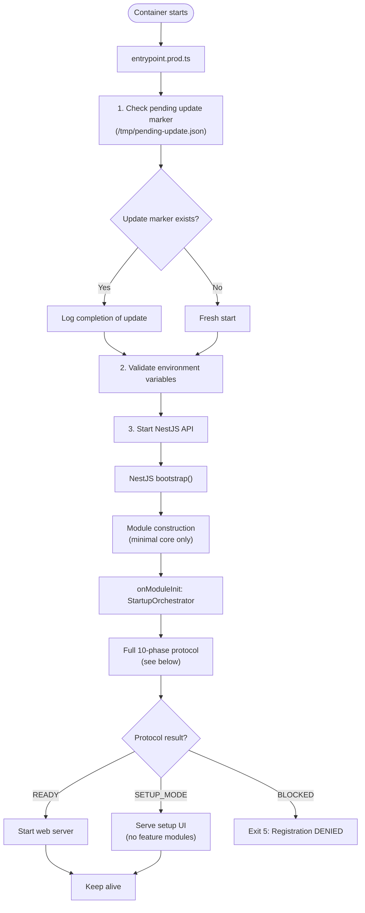
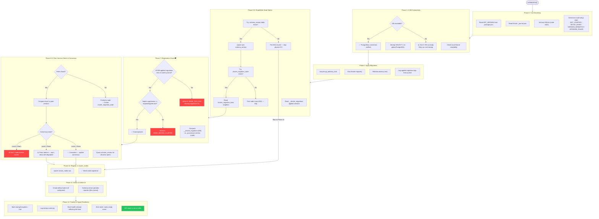
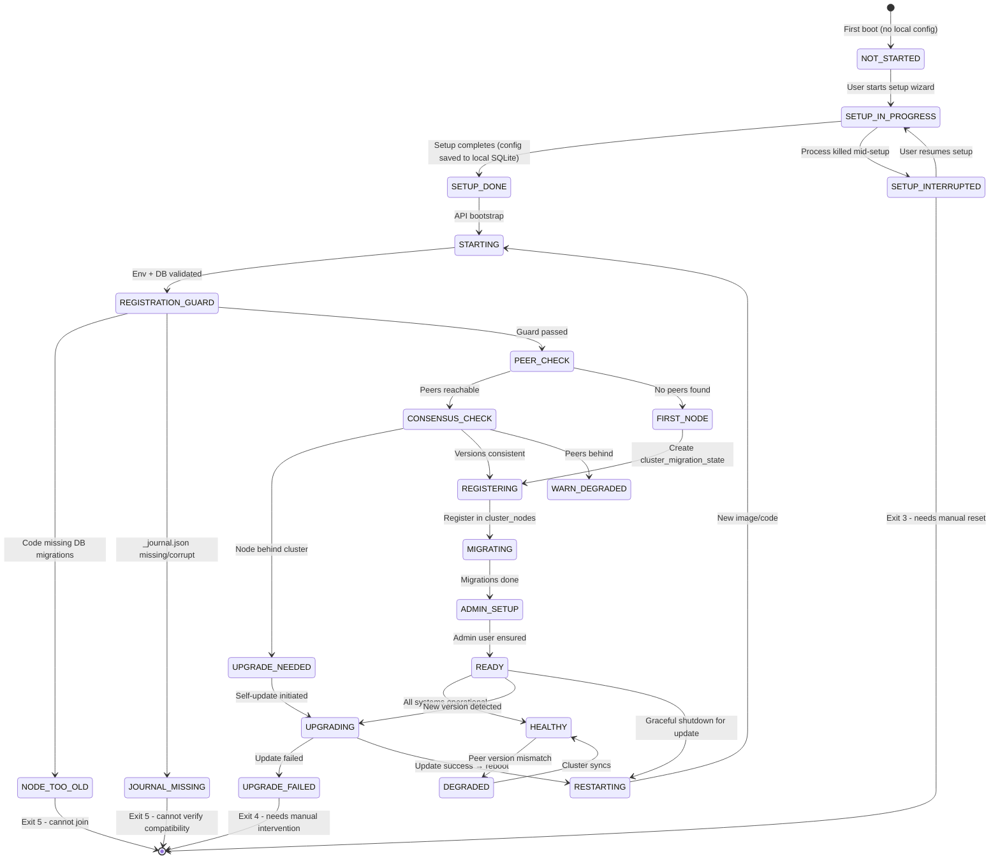

<DocMeta source="Architecture audit of entrypoints, StartupOrchestrator, module graph, and global-db-migration-management doc" scope="v3" />

## Part 1: Current State Analysis

### Entrypoints

| Aspect | `entrypoint.dev.ts` | `entrypoint.prod.ts` |
|--------|---------------------|----------------------|
| **Phases** | 6 phases: Version → StartupCheck → EnvValidation → Diagnostics → MeshRegistration → StartNestJS | 3 phases: ValidateEnv → StartAPI → StartWeb |
| **CLI interaction** | `spawnSync('bun --bun src/cli.ts node-startup-check')` and `register-mesh-node` | None — delegates to `StartupOrchestratorService.onModuleInit()` |
| **Version extraction** | `readFileSync('package.json')` at module load time | No version extraction |
| **Error handling** | Exit codes from spawn, interpreted per-state | `try/catch` on API start |
| **Mesh registration** | CLI command before NestJS starts (when `DATABASE_URL` set) — **OR** deferred to sub-app chain (`SetupSubAppModule` → `MeshInitializerAppModule` → `GlobalDatabaseModule` bridge) in dev auto-provisioning mode | Internal via `StartupOrchestrator` after NestJS starts |
| **Update marker detection** | None | None (both missing) |
| **Seeding** | Not handled | Not handled (must be done manually) |
| **Diagnostics** | Phase 4 runs `bun --bun --watch diagnose.ts` | None |

### StartupOrchestratorService

The current implementation in `apps/api/src/core/modules/startup/startup-orchestrator.service.ts`:

| Step | Current Implementation | Doc Spec (10-Phase) | Gap |
|------|----------------------|---------------------|-----|
| **1. Run migrations** | ✅ Calls `migrate()` via Drizzle migrator | Phase 4: Apply pending migrations | ✅ Matches |
| **2. Create admin** | ⚠️ Shells out via `execSync('bun --bun dist/cli.js create-default-admin')` | Step 2 in doc | ❌ Should use DI (AuthService) instead of subprocess |
| **3. Register mesh node** | ⚠️ Raw SQL upsert into `cluster_nodes` | Phase 10: Register in cluster_nodes | ⚠️ No guard check before registering |
| **4. Report schema version** | ⚠️ Raw SQL upsert into `schema_version` | Phase 5: Upsert own schema_version | ⚠️ No `cluster_migration_state` read |
| **5. Registration guard** | ❌ Missing entirely | Phase 7: Compare journal vs DB applied | ❌ **Critical gap** — outdated nodes not blocked |
| **6. Check peer versions** | ❌ Missing entirely | Phase 8: Query `schema_version` for peers | ❌ **Critical gap** — no mesh version awareness |
| **7. Consensus check** | ❌ Missing entirely | Phase 9: Compare local vs cluster state | ❌ **Critical gap** — can't detect cluster disagreements |
| **8. cluster_migration_state** | ❌ Missing entirely | Phase 6: Read/create singleton row | ❌ Table won't advance |
| **9. Error isolation** | ⚠️ All steps wrapped in try/catch, errors pushed to array | Each step independent | ⚠️ Acceptable but exit codes not propagated |
| **10. Lazy module startup** | ❌ Not addressed | Not in current doc | ❌ All 25+ modules eagerly loaded |

### Module Loading (Current State)

**Eagerly loaded in AppModule** (all 25+ modules start at NestJS boot):

```
EnvModule → DatabaseModule → AuthModule → HealthModule → UserModule →
PushModule → TestModule → SetupModule → OrganizationModule → ProjectModule →
ServiceModule → DeploymentModule → GithubModule → FleetModule → DomainModule →
AnalyticsModule → ProviderSchemaModule → DockerModule → EventsModule →
SystemModule (→ SystemMeshModule → SystemFleetModule) → PermissionModule →
StartupModule → ORPCModule
```

**Problem**: Every module is instantiated and constructed before any `onModuleInit` hook runs. Modules like `DockerModule`, `FleetModule`, `MeshModule`, `AnalyticsModule` start initializing their providers (opening connections, spawning workers) even when:
- The node hasn't passed registration guard yet
- The node is in setup mode (first run)
- The node's version mismatches the cluster

---

## Part 2: The Correct Architecture

### Principle

**Start as minimal as possible. Validate. Expand.**

The API must start in three concentric circles:

```text
┌─────────────────────────────────────────┐
│           CORE (always starts)           │
│  EnvModule, DatabaseModule (local SQLite)│
│  StartupModule, ORPCModule (minimal)     │
└────────────────┬────────────────────────┘
                 │ guards pass
┌────────────────▼────────────────────────┐
│          INFRASTRUCTURE (phase 2)        │
│  GlobalDatabaseModule, AuthModule        │
│  MeshInitializationModule, HealthModule  │
└────────────────┬────────────────────────┘
                 │ registration + consensus
┌────────────────▼────────────────────────┐
│          FEATURES (lazy, phase 3)        │
│  DockerModule, FleetModule, SystemModule │
│  All domain modules                      │
└─────────────────────────────────────────┘
```

### Dev Entrypoint — Correct Design

The dev entrypoint should be a **unified CLI** that can do any operation:

```text
bun run dev -- seed           # Seed the database
bun run dev -- migrate        # Run pending migrations
bun run dev -- reset          # Reset + re-migrate
bun run dev -- start          # Start full stack (default)
bun run dev -- setup          # Run setup wizard
bun run dev -- diagnose       # Run diagnostics
bun run dev -- all            # Seed + migrate + start
```

It should **never** use `spawnSync` for CLI commands that duplicate NestJS DI context. Instead:
- Use direct imports for simple operations (version checks, env validation)
- Start NestJS in minimal mode for operations that need DI (migrations, seeding, mesh registration)
- Use the `StartupOrchestratorService` methods directly after booting a minimal app

```mermaid
flowchart TD
    DEV_CMD["bun run dev -- <command>"] --> PARSE{Parse arguments}
    
    PARSE -->|seed| SEED_FLOW
    
    subgraph SEED_FLOW["Seed Flow"]
        direction TB
        S1["Validate environment"]
        S2["Connect to global DB (direct pool)"]
        S3["Run `api-db seed` (inside container)"]
    end
    
    PARSE -->|migrate| MIGRATE_FLOW
    
    subgraph MIGRATE_FLOW["Migrate Flow"]
        direction TB
        M1["Validate environment"]
        M2["Read Drizzle _journal.json"]
        M3["Connect to global DB"]
        M4["Run Drizzle migrate()"]
        M5["Report schema version"]
    end
    
    PARSE -->|start| START_FLOW
    
    subgraph START_FLOW["Start Flow (default)"]
        direction TB
        ST1["Validate environment"]
        ST2["Check update markers"]
        ST3["Start NestJS in full mode"]
        ST4["StartupOrchestrator handles<br/>migrations + registration + consensus"]
        ST5["Start web dev server"]
    end
    
    PARSE -->|setup| SETUP_FLOW
    
    subgraph SETUP_FLOW["Setup Flow"]
        direction TB
        SE1["Validate environment"]
        SE2["Check local SQLite config"]
        SE3["Start NestJS in setup mode"]
        SE4["Setup wizard via API (localhost)"]
    end
    
    PARSE -->|all| ALL_FLOW["Seed → Migrate → Start"]
    PARSE -->|diagnose| DIAG_FLOW["Validate env + config + check DB connectivity"]
```



### Production Entrypoint — Correct Design



### Full 10-Phase Startup Protocol (Inside StartupOrchestrator)



### Module Lazy Loading Strategy

```mermaid
flowchart LR
    subgraph CORE["Core Layer (always loaded)"]
        ENV[EnvModule]
        LOCAL_DB[LocalModule]
        STARTUP[StartupModule]
        ORPC_MIN[ORPCModule - minimal]
        HEALTH_BASIC[HealthModule - basic]
    end
    
    subgraph INFRA["Infrastructure Layer (phase 2)"]
        GLOBAL_DB[GlobalModule<br/><i>Created AFTER setup check</i>]
        AUTH[AuthModule<br/><i>Uses global DB</i>]
        MESH_INIT[MeshInitializationModule<br/><i>Needs auth + global DB</i>]
        HEALTH_FULL[HealthModule - full<br/><i>Now includes migration state</i>]
    end
    
    subgraph FEATURES["Feature Layer (lazy, phase 3)"]
        DOCKER[DockerModule]
        FLEET[FleetModule]
        SYSTEM[SystemModule]
        DOMAIN[DomainModule<br/>docker / mesh / fleet / user / org / ...]
        ORPC_FULL[ORPCModule - full router<br/><i>Registered after all features ready</i>]
    end
    
    CORE -->|"StartupOrchestrator<br/>passes guard"| INFRA
    INFRA -->|"Registration +<br/>consensus complete"| FEATURES
```



#### How Lazy Loading Works Practically

In NestJS, true lazy loading of modules is done via `LazyModuleLoader` or dynamic imports. The pattern:

```typescript
// apps/api/src/app.module.ts
@Module({
  imports: [
    // Core — always needed
    EnvModule,
    LocalModule,           // Local SQLite
    StartupModule,         // Orchestrator + version services
    HealthModule.forRoot({ mode: 'basic' }),  // Basic health
    ORPCModule.forRootAsync({ /* minimal — only auth-less routes */ }),
  ],
})
export class AppModule implements NestModule {
  configure(consumer: MiddlewareConsumer) {
    consumer.apply(InternalErrorContextMiddleware, LoggerMiddleware).forRoutes('*');
  }
}
```

Then `StartupOrchestratorService.onModuleInit()` dynamically loads modules once passes:

```typescript
async onModuleInit() {
  // Phase 0-3: Core bootstrap, DB connectivity, migrations
  await this.runCoreBootstrap();
  
  // Phase 4-7: Registration guard
  const guardResult = await this.runRegistrationGuard();
  if (!guardResult.allowed) {
    this.logger.error(`❌ ${guardResult.reason}`);
    process.exit(5);  // Will be caught by entrypoint
  }
  
  // Phase 8-9: Peer consensus
  const consensus = await this.evalClusterConsensus();
  
  // Now dynamically load infrastructure modules
  await this.lazyLoad.infrastructureModules();
  
  // Phase 10: Register in cluster_nodes
  await this.registerInMesh();
  
  // Phase 11: Admin creation
  await this.createDefaultAdmin();
  
  // Phase 12: Finally load feature modules
  await this.lazyLoad.featureModules();
  
  // Re-register ORPC routes with full router
  await this.lazyLoad.orpcFullRouter();
  
  this.startupComplete = true;
}
```

### State Machine: Node Lifecycle



---

## Part 3: Issues & Fixes

### Critical Gaps

| # | Gap | Location | Impact | Fix |
|---|-----|----------|--------|-----|
| 1 | **No registration guard** | `StartupOrchestrator` doesn't check `__drizzle_migrations` vs `_journal.json` | Outdated nodes can join the mesh and corrupt data | Implement Phase 7 in orchestrator |
| 2 | **No peer version check** | `StartupOrchestrator` doesn't query `schema_version` for peers | Can't detect cluster version disagreements | Add Phase 8-9 to orchestrator |
| 3 | **No cluster_migration_state** | Never created or advanced | Schema version registry is useless — no cluster-wide SSOT | Add Phase 6 read/write in orchestrator |
| 4 | **CLI duplication in dev entrypoint** | `entrypoint.dev.ts` uses `spawnSync` for CLI commands | Duplicates logic, bypasses DI, DI context built twice | Replace with direct NestJS bootstrap + method calls |
| 5 | **All modules eagerly loaded** | `AppModule` imports 25+ modules | Heavy modules (Docker, Mesh, Fleet) start before guard passes | Use `LazyModuleLoader` for feature modules |
| 6 | **Admin creation shells to CLI** | `StartupOrchestrator` uses `execSync('bun --bun dist/cli.js create-default-admin')` | Duplicate DI, brittle path, breaks in production | Use `AuthService` via DI |
| 7 | **No update marker detection** | Both entrypoints missing | Self-update protocol can't signal completion | Add `/tmp/pending-update.json` check |
| 8 | **GlobalModule setup deadlock** | Provider factory waits for `InitializationService.waitForSetup()` | Fragile workaround with `checkConfigAndEmit()` | Restructure: core init doesn't need global DB |

### Fix Priority

```text
P0 - BLOCKER (ship-stopping):
  └─ Add registration guard (#1)
  └─ Add peer version check + consensus (#2)

P1 - CRITICAL (correctness):
  └─ Add cluster_migration_state management (#3)
  └─ Fix admin creation to use DI (#6)

P2 - IMPORTANT (architecture):
  └─ Lazy-load feature modules (#5)
  └─ Unify dev entrypoint (#4)

P3 - ENHANCEMENT (completeness):
  └─ Add update marker detection (#7)
  └─ Fix GlobalModule setup deadlock (#8)
```

---

## Part 4: Complete Module Initialization Order

Below is the definitive, frame-accurate sequence of what happens from `docker run` to `API ready`, covering **every possible state** the node can be in.

```mermaid
sequenceDiagram
    participant D as Docker
    participant EP as entrypoint.prod.ts
    participant N as NestJS App
    participant C as Core Modules
    participant S as StartupOrchestrator
    participant G as Global DB
    participant M as Mesh
    participant F as Feature Modules

    Note over D,F: === STATE: FRESH NODE (first boot, no local config) ===
    
    D->>EP: docker run
    EP->>EP: 1. Read /tmp/pending-update.json (not found)
    EP->>EP: 2. Validate env vars
    EP->>N: 3. bun run start:prod
    
    N->>N: bootstrap() - create NestJS app
    N->>C: Load Core Modules (always)
    Note over C: EnvModule, LocalModule (SQLite), StartupModule
    
    C->>S: Constructor injection
    S->>S: Read APP_VERSION from package.json
    S->>S: Read Drizzle _journal.json
    S->>S: Read local SQLite node_config
    
    alt Local config NOT_FOUND
        S->>S: Node state = NOT_STARTED (first boot)
    end
    
    alt Local config found, version matches
        S->>S: Node state = SETUP_DONE (normal restart)
    end
    
    alt Local config found, version MISMATCH
        S->>S: Node state = VERSION_MISMATCH (upgrade detected)
    end
    
    S->>G: SELECT 1 (check global DB connectivity)
    
    alt DB unreachable
        S->>S: ⚠️ Exit 2: DB not ready (transient)
        N->>N: process.exit(2)
        EP->>EP: Retry on restart (Docker restart policy)
    end
    
    G-->>S: ✅ Connected
    
    S->>S: Run Phase 4: Drizzle migrate()
    S->>G: pg_advisory_lock → migrate → unlock
    
    S->>G: Read __drizzle_migrations
    G-->>S: [0000_initial, ..., 0011_mesh_coordination]
    
    S->>S: Run Phase 5: Upsert schema_version
    
    alt schema_version table exists (post-0011)
        S->>G: INSERT INTO schema_version ON CONFLICT
    else table doesn't exist (pre-0011)
        S->>S: ⚠️ Skip schema_version (backward compat)
    end
    
    S->>S: Run Phase 6: Read cluster_migration_state
    
    alt table doesn't exist
        S->>S: ⚠️ Skip — pre-0011 cluster or first node
    else table exists
        G-->>S: { clusterSchemaVersion, requiredAppVersion, consensusNodeIds }
        S->>S: Compare local appVersion vs requiredAppVersion
    end
    
    S->>S: Run Phase 7: Registration Guard 🛡️
    
    alt Guard FAILS (NODE_TOO_OLD)
        S->>S: ❌ Missing migrations: [0011_mesh_coordination]
        S->>S: process.exit(5)
        N->>N: ❌ Exit 5: Registration DENIED
        EP->>EP: Log error, container exits
        Note over EP: Docker shows unhealthy. Operator must update.
    end
    
    alt Guard FAILS (JOURNAL_MISSING)
        S->>S: ❌ _journal.json not found
        S->>S: process.exit(5)
    end
    
    S->>S: ✅ Guard passed
    
    S->>S: Run Phase 8-9: Peer Version Check
    
    alt No peers (first/only node)
        S->>G: CREATE cluster_migration_state singleton
        S->>S: ✅ First node — proceeding
    else Peers found
        S->>G: Query schema_version for all peers
        G-->>S: [peer versions...]
        
        alt All versions consistent
            S->>S: ✅ Cluster consensus: schema=0011, app>=2.0.0
            S->>G: UPDATE cluster_migration_state with consensus
        else Local > Peers
            S->>S: ⚠️ Peers behind — allowing degraded
        else Local < Peers
            S->>S: ❌ Exit 5: Node behind cluster
            N->>N: process.exit(5)
        end
    end
    
    S->>S: Run Phase 10: Register in mesh
    
    alt MESH_NODE_ID not set
        S->>S: ⏭️ Skipping (local/setup mode)
    else Normal registration
        S->>G: INSERT INTO cluster_nodes ON CONFLICT
        G-->>S: ✅ Registered
    end
    
    S->>S: Run Phase 11: Admin + Periodic Tasks
    
    alt DEFAULT_ADMIN_EMAIL set
        S->>N: Inject AuthService.createDefaultAdmin()
        N-->>S: ✅ Admin ensured
    else Not set
        S->>S: ⏭️ Skipping
    end
    
    S->>S: Start periodic schema_version reporter (60s interval)
    
    Note over S: === NOW LOAD INFRASTRUCTURE MODULES ===
    
    S->>N: Load GlobalModule (full with pool)
    S->>N: Load AuthModule
    S->>N: Load MeshInitializationModule
    S->>N: Load HealthModule (full)
    
    Note over S: === NOW LOAD FEATURE MODULES ===
    
    S->>N: Load DockerModule
    S->>N: Load FleetModule
    S->>N: Load SystemModule
    S->>N: Load all domain modules
    
    Note over S: === RE-REGISTER ORPC ROUTES ===
    
    S->>N: Load ORPCModule (full router)
    
    S->>S: ✅ startupComplete = true
    S->>S: Log summary (with any errors)
    
    S->>M: Emit mesh: node_ready
    N->>EP: HTTP server ready on port 3001
    
    EP->>EP: Start web server (Next.js)
    
    Note over D,F: === STATE: NODE HEALTHY ===
    Note over F: API serves traffic. Mesh connections active.

    %% ─── UPDATE FLOW ───
    Note over D,F: === STATE: SELF-UPDATE TRIGGERED ===
    
    S->>S: Detect cluster requires >=2.1.0
    S->>S: Save /tmp/pending-update.json
    S->>S: Emit mesh: node_updating
    S->>N: Graceful shutdown
    N->>D: process.exit(0)
    D->>D: Docker restart policy kicks in
    
    Note over D,F: Container restarts with new image tag
    Note over D,F: Entrypoint detects update marker, logs completion
    Note over D,F: Full startup protocol re-runs with new code
```



---

## Part 5: Dev Entrypoint — Unified Design Recommendation

The single dev entrypoint should look like:

```typescript
// entrypoint.dev.ts — Unified Dev Entrypoint
// Usage:
//   bun run dev                    → defaults to 'start'
//   bun run dev -- seed           → seed database only
//   bun run dev -- migrate        → run migrations only
//   bun run dev -- seed --start   → seed + migrate + start
//   bun run dev -- setup          → run setup wizard
//   bun run dev -- diagnose       → run diagnostics
//   bun run dev -- all            → seed + migrate + start

async function main() {
  const args = parseArgs(process.argv.slice(2));
  
  // 1. Always: validate environment
  validateEnvironment();
  
  // 2. Check update markers
  checkPendingUpdate();
  
  // 3. Execute requested commands in order
  if (args.seed || args.all || args.only === 'seed') {
    await executeSeed();
  }
  
  if (args.migrate || args.all || args.only === 'migrate') {
    await executeMigrations();
  }
  
  if (args.diagnose || args.only === 'diagnose') {
    await runDiagnostics();
  }
  
  if (args.setup || args.only === 'setup') {
    await startSetupWizard();
    return;  // Setup runs as a server, doesn't return to CLI
  }
  
  if (args.start || args.all || !args.only) {
    await startFullStack();  // Default
  }
}

// Each function boots NestJS in the appropriate mode
async function executeMigrations() {
  // Boot minimal NestJS app (Core modules only)
  // Call StartupOrchestrator.runMigrations() directly
  // Shutdown
}
```

---

## Part 6: Gaps Between Doc & Reality

| Doc Statement | Current Reality | Fix Needed |
|--------------|----------------|------------|
| "10-phase startup protocol" | Only 4 phases implemented | Add Phases 4-9 to orchestrator |
| "Registration guard blocks outdated nodes" | No guard exists | Implement Phase 7 |
| "Peer version check in Phase 8" | `MeshVersionService` exists but not wired into orchestrator | Wire into `StartupOrchestrator.onModuleInit()` |
| "cluster_migration_state managed at startup" | Table schema may not even exist yet | Create migration 0011 if not done, add read/write logic |
| "Self-contained startup — no external CLI" | Dev entrypoint uses CLI commands | Unify dev entrypoint, remove spawnSync |
| "Startup tasks in OnModuleInit lifecycle hooks" | True for production, but orchestrator misses critical phases | Add missing phases |
| "schema_version upserted every startup" | ⚠️ Table may not exist (pre-0011) | Add graceful skip |
| "Health endpoint exposes migration status" | Not yet implemented | Add `MigrationHealthIndicator` |

---

## Part 7: Implementation Order

### Phase A: Fix Critical Gaps (P0)

1. **Add registration guard** to `StartupOrchestratorService`:
   - Read `__drizzle_migrations` from global DB
   - Compare against `_journal.json` entries
   - Exit 5 if code is missing migrations

2. **Add peer version check**:
   - Wire `MeshVersionService` into `StartupOrchestratorService`
   - Call `compareLocalWithMesh()` during startup
   - Handle all 5 return statuses

3. **Add cluster_migration_state management**:
   - Read/create singleton at startup
   - Update on consensus agreement

### Phase B: Fix Architecture Issues (P1)

4. **Fix admin creation**: Replace `execSync` with `AuthService` DI
5. **Implement lazy module loading**: Feature modules behind `LazyModuleLoader`

### Phase C: Fix Dev Experience (P2)

6. **Unify dev entrypoint**: Single CLI with subcommands
7. **Add update marker detection**: Both entrypoints

### Phase D: Documentation (P3)

8. **Update `global-db-migration-management.mdx`** to reflect the real 12-phase protocol
9. **Update implementation plan** with completed items and new gaps
10. **Create `startup-architecture-analysis.mdx`** (this file) as the reference for startup sequence
