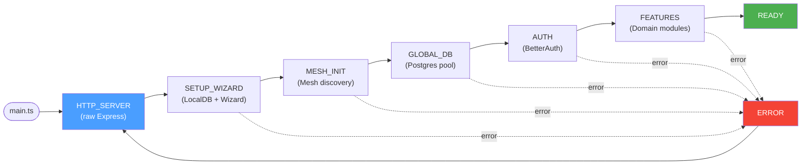
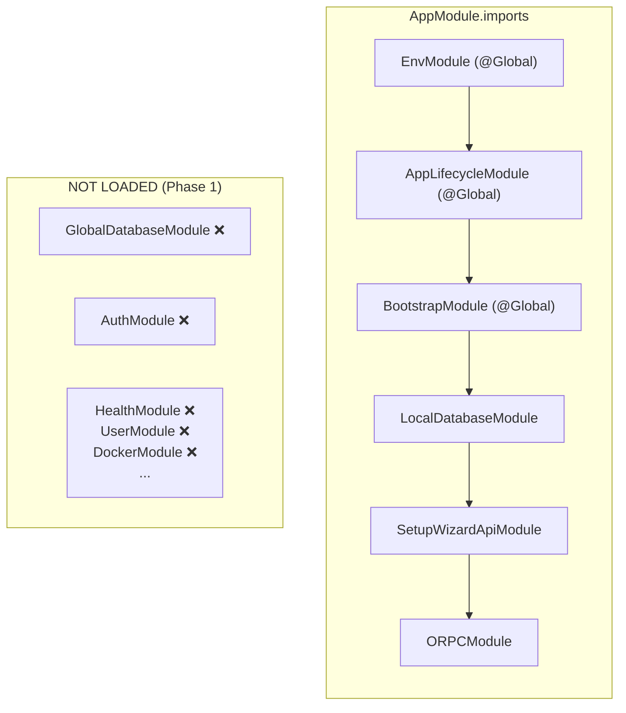
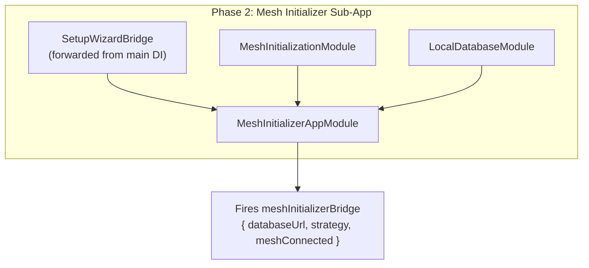
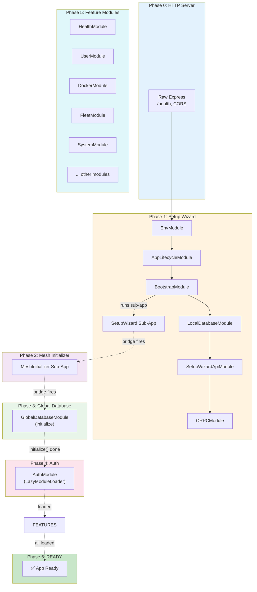

import { Callout } from 'nextra/components'

## Core Principle

<Callout type="warning">
**Key Rule**: A module that requires data or a service that is not finished should **NOT start at all**. Do NOT use null providers to hide the problem — use proper dependency waiting patterns.
</Callout>

**The application startup is driven by a lifecycle state machine.** Each phase loads only the modules whose dependencies are satisfied. Modules are not loaded eagerly — they are loaded **when their dependencies are ready**.

```
Phase 0: HTTP Server (raw Express)     → /health, CORS
Phase 1: Setup Wizard                  → LocalDatabaseModule + SetupWizardApiModule
Phase 2: Mesh Initializer              → MeshInitializationModule
Phase 3: Global Database               → GlobalDatabaseModule (real connection)
Phase 4: Auth                          → AuthModule
Phase 5: Feature Modules               → All domain modules
Phase 6: READY                         → Full functionality
```

**Dependency chain:**

```
SetupWizardSubApp ──► MeshInitializerSubApp ──► GlobalDatabase ──► Auth ──► Features
       │                      │                       │              │            │
       │  needs:              │  needs:                │  needs:      │  needs:    │  needs:
       │  - LocalDatabase     │  - SetupWizard result  │  - MeshInit  │  - DB      │  - DB
       │  - Env               │  - MeshInitModule      │    result    │  - Auth    │  - Auth
       │                      │                        │              │            │
```

---

## Lifecycle State Machine

The `AppLifecycleService` tracks the current phase. Modules do NOT poll the phase — instead, they subscribe to lifecycle events via `lifecycle.events` (an RxJS `Observable`) or use the bridge/trigger pattern (`BaseTriggerService`) which resolves a Promise when an event is emitted.



### No Null Providers — Modules Should Fail Fast

❌ **WRONG approach** — using null/undefined providers:

```typescript
// BAD: Null provider that hides the real problem
@Injectable()
export class DatabaseService {
  private _db: DB | null = null;
  
  get db() {
    if (!this._db) {
      throw new Error('Database not initialized'); // Too late!
    }
    return this._db;
  }
}
```

This pattern is dangerous because:
1. The module "starts" but doesn't work
2. Runtime errors occur when services try to use the DB
3. Debugging is hard — the error happens far from the root cause

✅ **CORRECT approach** — modules don't load until ready:

```typescript
// Option 1: Use LazyModuleLoader - module loads ON DEMAND
await this.lazyModuleLoader.load(() => AuthModule)

// Option 2: Use the bridge/trigger pattern (event-based)
// The trigger extends BaseEventService — emits an event when ready.
// The loader injects the result as a DI token; NestJS resolves the
// async useFactory provider (which awaits bridge.waitFor()).
// No polling, no setInterval — pure event-driven DI resolution.

// 1. Define a trigger (in trigger file):
export const { Bridge: DbReady, Result: DbReadyResult } =
  createResultBridge(z.object({ initializedAt: z.string() }))

// 2. Wire in module:
providers: [
  DbReady,
  injectResult(DbReady, DbReadyResult),  // async useFactory
]

// 3. Inject in loader:
@Injectable()
export class MyLoader implements OnApplicationBootstrap {
  constructor(
    private readonly dbReady: DbReadyResult,  // DI blocks until trigger fires
  ) {}
}
```

### Phase Definitions

```typescript
export enum AppLifecyclePhase {
  HTTP_SERVER    = 'http_server',     // Raw Express listening, /health responds
  SETUP_WIZARD   = 'setup_wizard',   // LocalDatabaseModule + SetupWizardApiModule loaded
  MESH_INIT      = 'mesh_init',      // MeshInitializer sub-app running
  GLOBAL_DATABASE = 'global_database', // GlobalDatabaseService initialized
  AUTH           = 'auth',            // AuthModule loaded
  FEATURES       = 'features',       // Feature modules loaded
  READY          = 'ready',           // All modules loaded, full functionality
  ERROR          = 'error',           // Irrecoverable error
}
```

---

## Phase 0: HTTP Server (Raw Express)

**What loads:** Nothing NestJS. Only raw Express.

**What's available:**
- `/health` endpoint (returns `{ status: "ok", phase: "http_server" }`)
- CORS middleware
- The Express server is listening on the configured port

**What happens in `main.ts`:**

```mermaid
flowchart LR
    A["main.ts"] --> B["Create Express server"]
    B --> C["Register CORS middleware"]
    C --> D["Register /health endpoint"]
    D --> E["server.listen()"]
    E --> F["✅ HTTP server LIVE"]
    F --> G["NestFactory.create(AppModule)"]
    G --> H["app.init()"]
    H --> I["✅ Routes registered"]
    I --> J["OnApplicationBootstrap"]
    J --> K["BootstrapOrchestrator starts"]
```



**Key insight:** `server.listen()` is called BEFORE `NestFactory.create()`. The health endpoint responds immediately, even while NestJS is initializing.

### Tiered Health Check Architecture

The health endpoint uses a **tiered approach**:

| Tier | Handler | When Available | What It Returns |
|------|---------|----------------|-----------------|
| **Tier 1** | Express `server.get("/health")` | Phase 0 (immediately) | `{"status": "ok", uptime: ...}` |
| **Tier 2** | HealthModule via NestJS | Phase 1+ (after NestJS loads) | Full lifecycle info, readiness, liveness |

**Why tiered?** Docker liveness probes must work BEFORE NestJS finishes loading. The Express-level handler ensures probes succeed during bootstrap.

**HealthModule advantages** (when loaded in Phase 1):
- Returns lifecycle phase (`bootstrapping`, `ready`, etc.)
- Includes setup progress information
- Can check database readiness via `getReadiness()`
- Integrates with ORPC for proper request/response handling

```typescript
// HealthService.getHealth() - no DB dependency, returns lifecycle info
getHealth() {
    const snapshot = this.lifecycle.getSnapshot();
    return {
        status: "ok",
        lifecycle: { phase: snapshot.phase, step: snapshot.step },
    };
}
```

---

## Module Loader Architecture

The core idea: **`main.ts` should only reference "module loaders"** — each loader is responsible for loading a group of modules when its dependencies are ready. Loaders use the existing repo-standard bridge/trigger pattern (`createResultBridge`, `injectResult`, `BaseTriggerService`) so that **dependencies are resolved through NestJS DI itself**, not through lifecycle phases or polling.

### The Problem: Null Providers and Premature Initialization

The error below is exactly what happens when a module starts before its dependency is ready:

```
error: GlobalDatabaseService has not been initialized yet
      at db (/app/apps/api/src/core/modules/database/shared/database.service.ts:30:23)
      at dispatchPending (/app/apps/api/src/core/modules/events/outbox/local-event-outbox-dispatcher.service.ts:58:36)
```

`LocalEventOutboxDispatcherService.onModuleInit()` starts a ticker that calls `this.databaseService.db`, but the database hasn't been initialized yet. The module was loaded eagerly in `AppModule`, so its `onModuleInit` runs before the database is ready.

**The fix is not to make the database service null-safe — the fix is to NOT load the module until the database is ready.**

### Solution: Event-Driven Module Loading via DI

We use the **existing bridge/trigger infrastructure** that already exists in this repo. This is built on `BaseEventService` (the core event system) — everything is event-driven:

| Existing Tool | Built On | Purpose |
|---|---|---|
| `createResultBridge(schema)` | `BaseTriggerService` → `BaseEventService` | Creates a `Bridge` trigger + `Result` DI token pair from a Zod schema |
| `injectResult(Bridge, Result)` | NestJS `useFactory` | Provider factory that resolves `bridge.waitFor()` as a DI token — the Promise resolves when `bridge.emit()` fires |
| `BaseTriggerService` | `BaseEventService` (Subject + Observable) | Event-based trigger: `emit()` pushes to a Subject, `waitFor()` returns a Promise resolved by the emission |
| `BaseEventService` | RxJS `Subject` | Core event bus — `emit()` pushes typed events, `subscribe$()` returns `Observable`, `onValue()` subscribes |
| `LazyModuleLoader` | NestJS built-in | Loads modules on demand |

**The flow is purely event-driven:**
1. `BootstrapOrchestrator` calls `databaseReadyTrigger.emit({ initializedAt })` — this pushes to the internal `Subject`
2. `BaseTriggerService.waitFor()` resolves the Promise it returned to the DI container
3. NestJS injects the resolved value into the loader's constructor
4. The loader's `onApplicationBootstrap` runs with the dependency ready

No polling. No `setInterval`. No lifecycle phase checks. Pure event-driven resolution through `BaseEventService`.

### Step 1: Define a DatabaseReady Trigger

```typescript
// apps/api/src/core/modules/database/global/database-ready.trigger.ts
import { z } from 'zod/v4'
import { createResultBridge } from '@/core/modules/sub-app-runner/bridge.utils'
import type { BaseTriggerService } from '@/core/modules/triggers/base-bridge.service'

/**
 * Schema for the "database is ready" signal.
 * Any loader that needs the database injects this result.
 */
export const databaseReadySchema = z.object({
  initializedAt: z.string().min(1),
  url: z.string().min(1).optional(),
})

export type DatabaseReadyPayload = z.infer<typeof databaseReadySchema>

export const { Bridge: DatabaseReadyTrigger, Result: DatabaseReadyResult } =
  createResultBridge(databaseReadySchema)

export interface DatabaseReadyResult extends DatabaseReadyPayload {}
export interface DatabaseReadyTrigger extends BaseTriggerService<typeof databaseReadySchema> {}
```

### Step 2: BootstrapOrchestrator Emits the Trigger

```typescript
// apps/api/src/core/modules/bootstrap/bootstrap-orchestrator.service.ts
@Injectable()
export class BootstrapOrchestratorService implements OnApplicationBootstrap {
  constructor(
    private readonly globalDatabase: GlobalDatabaseService,
    private readonly databaseReadyTrigger: DatabaseReadyTrigger,
    // ... other deps
  ) {}

  async onApplicationBootstrap(): Promise<void> {
    // Phase 1-2: Sub-apps (Setup Wizard, Mesh Initializer)
    // ... existing code ...

    // Phase 3: Initialize Database
    const databaseUrl = setupResult?.databaseUrl ?? process.env.DATABASE_URL
    if (databaseUrl) {
      await this.globalDatabase.initialize(databaseUrl)
      // Emit the trigger — any loader that injects DatabaseReadyResult will resolve
      this.databaseReadyTrigger.emit({
        initialized: new Date().toISOString(),
        url: databaseUrl,
      })
    }

    // Phase 6: READY
    this.lifecycle.markReady()
  }
}
```

### Step 3: FeatureModuleLoader Injects the Result via DI

```typescript
// apps/api/src/core/modules/loader/feature-module-loader.ts
import { Injectable, Logger, OnApplicationBootstrap } from '@nestjs/common'
import { LazyModuleLoader } from '@nestjs/core'
import { DatabaseReadyResult } from '@/core/modules/database/global/database-ready.trigger'

/**
 * Loads all feature modules AFTER the database is initialized.
 *
 * The dependency is resolved through NestJS DI itself:
 *   - `DatabaseReadyResult` is a DI token provided via `injectResult()`
 *   - NestJS waits for the bridge's `waitFor()` Promise before injecting
 *   - The loader receives the resolved payload — no polling, no lifecycle checks
 *
 * This works for ANY dependency, not just database:
 *   - Define a trigger schema → createResultBridge → injectResult → inject in loader
 */
@Injectable()
export class FeatureModuleLoader implements OnApplicationBootstrap {
  private readonly logger = new Logger(FeatureModuleLoader.name)

  constructor(
    private readonly lazyModuleLoader: LazyModuleLoader,
    /** Injected via DI — NestJS waits for DatabaseReadyTrigger.waitFor() */
    private readonly dbReady: DatabaseReadyResult,
  ) {}

  async onApplicationBootstrap(): Promise<void> {
    this.logger.log(`🚀 Database ready at ${this.dbReady.initialized}, loading feature modules…`)

    const modules = [
      () => import('@/modules/health/health.module').then(m => m.HealthModule),
      () => import('@/modules/user/user.module').then(m => m.UserModule),
      () => import('@/modules/docker/docker.module').then(m => m.DockerModule),
      () => import('@/modules/deployment/deployment.module').then(m => m.DeploymentModule),
      () => import('@/modules/fleet/fleet.module').then(m => m.FleetModule),
      () => import('@/modules/service/service.module').then(m => m.ServiceModule),
      () => import('@/modules/project/project.module').then(m => m.ProjectModule),
      () => import('@/modules/organization/organization.module').then(m => m.OrganizationModule),
      () => import('@/modules/github/github.module').then(m => m.GithubModule),
      () => import('@/modules/domain/domain.module').then(m => m.DomainModule),
      () => import('@/modules/analytics/analytics.module').then(m => m.AnalyticsModule),
      () => import('@/modules/provider-schema/provider-schema.module').then(m => m.ProviderSchemaModule),
      () => import('@/modules/push/push.module').then(m => m.PushModule),
      () => import('@/modules/test/test.module').then(m => m.TestModule),
      () => import('@/modules/permission/permission.module').then(m => m.PermissionModule),
      () => import('@/system/system.module').then(m => m.SystemModule),
    ]

    for (const loadModule of featureModules) {
      try {
        const mod = await loadModule()
        await this.lazyModuleLoader.load(() => mod)
        this.logger.log(`  ✅ Loaded: ${mod.name}`)
      } catch (err) {
        this.logger.warn(`  ⚠️  Failed to load module: ${err instanceof Error ? err.message : String(err)}`)
      }
    }
  }
}
```

### Step 4: AuthModuleLoader Injects the Same DI Token

```typescript
// apps/api/src/core/modules/loader/auth-module-loader.ts
import { Injectable, Logger, OnApplicationBootstrap } from '@nestjs/common'
import { LazyModuleLoader } from '@nestjs/core'
import { DatabaseReadyResult } from '@/core/modules/database/global/database-ready.trigger'
import { AuthModule } from '@/core/modules/auth/auth.module'
import { GLOBAL_DATABASE_CONNECTION } from '@/core/modules/database/database-connection'
import { EnvService } from '@/config/env/env.service'
import { createBetterAuth } from '@/config/auth/auth'

/**
 * Loads AuthModule AFTER the database is initialized.
 *
 * Same pattern as FeatureModuleLoader — injects DatabaseReadyResult.
 * Both loaders can run in parallel; each waits independently for the DB.
 */
@Injectable()
export class AuthModuleLoader implements OnApplicationBootstrap {
  private readonly logger = new Logger(AuthModuleLoader.name)

  constructor(
    private readonly lazyModuleLoader: LazyModuleLoader,
    private readonly dbReady: DatabaseReadyResult,
    private readonly envService: EnvService,
  ) {}

  async onApplicationBootstrap(): Promise<void> {
    this.logger.log(`🔐 Database ready, loading AuthModule…`)

    await this.lazyModuleLoader.load(() =>
      AuthModule.forRootAsync({
        imports: [],
        useFactory: createBetterAuth,
        inject: [GLOBAL_DATABASE_CONNECTION, EnvService],
        disableBodyParser: false,
        disableGlobalAuthGuard: true,
      }),
    )
    this.logger.log('✅ AuthModule loaded')
  }
}
```

### Step 5: Wire the DI in LoaderModule

```typescript
// apps/api/src/core/modules/loader/loader.module.ts
import { Module } from '@nestjs/common'
import { DatabaseReadyTrigger, DatabaseReadyResult } from '@/core/modules/database/global/database-ready.trigger'
import { injectResult } from '@/core/modules/sub-app-runner/bridge.utils'
import { FeatureModuleLoader } from './feature-module-loader'
import { AuthModuleLoader } from './auth-module-loader'

@Module({
  providers: [
    // Register the trigger so BootstrapOrchestrator can emit
    DatabaseReadyTrigger,

    // Register the result token — resolves bridge.waitFor() via DI
    injectResult(DatabaseReadyTrigger, DatabaseReadyResult),

    // Loaders — they inject DatabaseReadyResult, so NestJS waits
    FeatureModuleLoader,
    AuthModuleLoader,
  ],
  exports: [
    DatabaseReadyTrigger,
    FeatureModuleLoader,
    AuthModuleLoader,
  ],
})
export class LoaderModule {}
```

### Step 6: How main.ts References Loaders

```typescript
// apps/api/src/main.ts — only references module loaders
async function bootstrap(): Promise<void> {
  const server = express()
  // ... CORS, health endpoint, server.listen() ...

  const app = await NestFactory.create(AppModule, new ExpressAdapter(server), {
    snapshot: process.env.NODE_ENV !== 'production',
    bodyParser: false,
  })

  // The loaders are registered in AppModule and run in OnApplicationBootstrap.
  // Each loader injects its dependencies as DI tokens — NestJS resolves them.
  // main.ts doesn't need to know about the dependency graph — DI handles it.
  
  // ... shutdown hooks, global filters ...
}
```

### Step 7: How AppModule Registers the LoaderModule

```typescript
// apps/api/src/app.module.ts
@Module({
  imports: [
    // Phase 1: Foundation — always loaded
    EnvModule,
    AppLifecycleModule,
    BootstrapModule,  // Contains BootstrapOrchestratorService
    
    // Phase 1: Setup Wizard
    LocalDatabaseModule,
    SetupWizardApiModule,
    
    // ORPC
    ORPCModule.forRootAsync({...}),
    
    // Loader module — wires triggers + loaders via DI
    LoaderModule,
    
    // NOTE: AuthModule and feature modules are NOT imported here.
    // They are loaded lazily by AuthModuleLoader and FeatureModuleLoader.
  ],
})
export class AppModule {}
```

### Dependency Graph (DI-Driven)

```
main.ts
  │
  ├── BootstrapOrchestratorService (OnApplicationBootstrap)
  │     ├── Phase 1: Setup Wizard sub-app
  │     ├── Phase 2: Mesh Initializer sub-app
  │     ├── Phase 3: GlobalDatabaseService.initialize()
  │     └── Phase 3: DatabaseReadyTrigger.emit({ initialized, url })
  │
  ├── FeatureModuleLoader (OnApplicationBootstrap)
  │     └── injects: DatabaseReadyResult ← DI resolves via bridge.waitFor()
  │     └── Phase 5: LazyModuleLoader → HealthModule, UserModule, ...
  │
  └── AuthModuleLoader (OnApplicationBootstrap)
        └── injects: DatabaseReadyResult ← DI resolves via bridge.waitFor()
        └── Phase 4: LazyModuleLoader → AuthModule
```

**Key insight**: Both `FeatureModuleLoader` and `AuthModuleLoader` inject `DatabaseReadyResult`. NestJS's DI container sees that this token depends on `DatabaseReadyTrigger.waitFor()`. The container **blocks injection** until the trigger fires. No polling, no `setInterval`, no lifecycle phase checks — pure DI resolution.

### Why This Solves the Error

The `LocalEventOutboxDispatcherService` error happened because:
1. It was loaded eagerly in `AppModule`
2. Its `onModuleInit()` started a ticker immediately
3. The ticker called `this.databaseService.db` before Phase 3 completed

With the loader pattern:
1. `LocalEventOutboxDispatcherService` is NOT loaded eagerly — it's loaded by `FeatureModuleLoader`
2. `FeatureModuleLoader` injects `DatabaseReadyResult` — NestJS blocks until the trigger fires
3. By the time `LocalEventOutboxDispatcherService.onModuleInit()` runs, the database is ready

**No null providers. No polling. No lifecycle phases. Pure DI.**

### Extending the Pattern: Any Dependency, Any Reason

The same pattern works for **any** dependency, not just the database:

```typescript
// 1. Define a trigger for any async dependency
export const { Bridge: MeshReadyTrigger, Result: MeshReadyResult } =
  createResultBridge(z.object({ peers: z.number() }))

// 2. Emit when ready
this.meshReadyTrigger.emit({ peers: 3 })

// 3. Inject in any loader
@Injectable()
export class MeshDependentLoader implements OnApplicationBootstrap {
  constructor(
    private readonly lazyModuleLoader: LazyModuleLoader,
    private readonly meshReady: MeshReadyResult,  // ← DI blocks until mesh is ready
  ) {}

  async onApplicationBootstrap() {
    this.logger.log(`🌐 Mesh ready with ${this.meshReady.peers} peers, loading modules…`)
    // ... load modules that need mesh ...
  }
}
```

### How It Feels Like Regular NestJS DI

The pattern uses NestJS's own DI mechanism — there's no custom framework, no base class to extend, no lifecycle hooks to implement for dependency resolution:

| Aspect | How it works |
|---|---|
| Dependency declaration | `private readonly dbReady: DatabaseReadyResult` — just a constructor parameter |
| Waiting mechanism | NestJS `useFactory` provider resolves `bridge.waitFor()` — the Promise resolves when `emit()` fires on the `BaseEventService` Subject |
| Error handling | NestJS throws on injection failure — standard DI error propagation |
| Testability | Provide `DatabaseReadyResult` directly in test module — no mocking needed |
| IDE support | Class token — autocomplete, rename refactoring, find usages all work |
| Reusability | Any loader injects the same token — define once, use everywhere |

### NestJS Official Patterns (Evidence)

#### Pattern 1: LazyModuleLoader (Load on Demand)

```typescript
constructor(private readonly lazyModuleLoader: LazyModuleLoader) {}

async someMethod() {
  const { AuthModule } = await import('@/core/modules/auth/auth.module')
  await this.lazyModuleLoader.load(() => AuthModule)
}
```

> **Evidence**: Per NestJS documentation on [Lazy Loading Modules](https://docs.nestjs.com/fundamentals/lazy-loading-modules), "Use `LazyModuleLoader#load` to dynamically import and load a module. Loaded modules are cached for subsequent fast access."

#### Pattern 2: Custom Providers with useFactory

```typescript
{
  provide: DatabaseReadyResult,
  useFactory: (bridge: DatabaseReadyTrigger) => bridge.waitFor(),
  inject: [DatabaseReadyTrigger],
}
```

> **Evidence**: Per NestJS [Custom Providers](https://docs.nestjs.com/fundamentals/custom-providers), `useFactory` providers resolve asynchronously. NestJS waits for the Promise before injecting the token into dependents. This is the core mechanism — the DI container itself handles the async dependency graph.

#### Pattern 3: onApplicationBootstrap for Post-Init Work

```typescript
async onApplicationBootstrap() {
  // All modules are initialized, DI is ready
  // Safe to use LazyModuleLoader here
}
```

> **Evidence**: Per NestJS [Lifecycle Events](https://docs.nestjs.com/fundamentals/lifecycle-events), `OnApplicationBootstrap` runs after all modules have been initialized. This is the correct hook for lazy-loading additional modules.

---

## Phase 1: Setup Wizard

**What loads:** Only the modules needed for setup wizard.

| Module | Why loaded | Dependencies |
|--------|-----------|-------------|
| `EnvModule` | Provides `EnvService` | None |
| `AppLifecycleModule` | Provides `AppLifecycleService` | None |
| `BootstrapModule` | Provides orchestrator + bridges | `EnvModule` |
| `LocalDatabaseModule` | SQLite config storage | None |
| `SetupWizardApiModule` | `/setup/*` HTTP routes | `LocalDatabaseModule`, `EnvModule` |
| `ORPCModule` | ORPC contract routing | None |

**What is NOT loaded:**
- ❌ `GlobalDatabaseModule` (no DATABASE_URL yet)
- ❌ `AuthModule` (no DB yet)
- ❌ All feature modules (HealthModule, UserModule, DockerModule, etc.)

**HTTP endpoints mapped during this phase:**
- `/health` (raw Express)
- `/setup/*` (SetupWizardController via ORPC)
- ORPC contract routes (empty contract — only setup routes)



### BootstrapOrchestrator Emits DatabaseReadyTrigger

```typescript
// BootstrapOrchestratorService.onApplicationBootstrap() — Phase 3 completes
await this.globalDatabase.initialize(databaseUrl)

// Emit the trigger — loaders pick it up via DI (event-based, no polling)
this.databaseReadyTrigger.emit({
    initializedAt: new Date().toISOString(),
    url: databaseUrl,
})

// AuthModuleLoader and FeatureModuleLoader inject DatabaseReadyResult.
// NestJS DI resolves bridge.waitFor() — the Promise resolves when emit() fires.
// The loaders' onApplicationBootstrap methods run with the DB ready.
```

**What the orchestrator does (Phase 1-3, then emit):**

```typescript
async onApplicationBootstrap(): Promise<void> {
    this.lifecycle.enterPhase(AppLifecyclePhase.SETUP_WIZARD)

    // Phase 1: Run setup wizard sub-app
    const setupResult = await this.runSubApp(
        'SetupWizard',
        SetupWizardAppModule,
        this.setupWizardBridge,
    )
    
    // ... continues to Phase 2
}
```

**The setup wizard sub-app** is an isolated NestJS context running `SetupWizardAppModule`. It determines the database URL:

| Scenario | Action |
|----------|--------|
| Node already configured | Read persisted URL from SQLite config, fire bridge immediately |
| `DATABASE_URL` set in env | Fire bridge with the URL |
| `DEV_AUTO_SETUP=true` | Auto-provision Postgres via Docker, await completion, fire bridge |
| Neither | Wait for user via `/setup/*` API endpoints |

---

## Phase 2: Mesh Initializer

**What loads:** Only the mesh initializer sub-app.

| Module | Why loaded | Dependencies |
|--------|-----------|-------------|
| `MeshInitializerAppModule` | Mesh discovery | `SetupWizardBridge` (forwarded) |
| `MeshInitializationModule` | Mesh peer connection | None |
| `LocalDatabaseModule` | Read mesh URLs from config | None |

**What is NOT loaded:**
- ❌ `GlobalDatabaseModule` (waiting for mesh result)
- ❌ `AuthModule`
- ❌ All feature modules



**What the orchestrator does:**

```typescript
// Phase 2: Run mesh initializer sub-app
await this.runSubApp(
    'MeshInitializer',
    MeshInitializerAppModule,
    this.meshInitializerBridge,
    [
        // Forward the setup wizard bridge so mesh init can await it
        { provide: SetupWizardBridge, useValue: this.setupWizardBridge },
    ],
)
```

The mesh initializer:
1. Subscribes to `setupWizardBridge.asObservable` (event-based — RxJS `Observable` from `BaseEventService`)
2. Reads mesh peer URLs from local SQLite config
3. Tries to connect to each mesh peer
4. Falls back to wizard URL if no mesh peers reachable
5. Fires `meshInitializerBridge.emit(...)` with final URL

---

## Phase 3: Global Database

**What loads:** The real Postgres database connection.

| Module | Why loaded | Dependencies |
|--------|-----------|-------------|
| `GlobalDatabaseService` | Already exists (null-initialized) | `MeshInitializerBridge` result |

**What happens:**

```typescript
// Phase 3: Initialize global database
const databaseUrl = setupResult?.databaseUrl ?? process.env.DATABASE_URL

if (databaseUrl) {
    await this.globalDatabase.initialize(databaseUrl)
    // Now GlobalDatabaseService.db returns the real handle
    // GLOBAL_DATABASE_CONNECTION is still null (it was a useFactory)
    // But GlobalDatabaseService.initialize() creates a new pool internally
}
```

**Important:** `GLOBAL_DATABASE_POOL` and `GLOBAL_DATABASE_CONNECTION` tokens (provided by `GlobalDatabaseModule`'s `useFactory`) remain `null`. The `GlobalDatabaseService` is the **single source of truth** for the database connection. Modules that need the DB should inject `GlobalDatabaseService`, not the raw tokens.

After this phase:
- `GlobalDatabaseService.isInitialized` → `true`
- `GlobalDatabaseService.db` → real Drizzle handle
- `GlobalDatabaseService.isHealthy()` → `true`

---

## Phase 4: Auth

**What loads:** The `AuthModule` via `AuthModuleLoader` (DI-driven).

| Module | Why loaded | Dependencies |
|--------|-----------|-------------|
| `AuthModule.forRootAsync(...)` | BetterAuth + auth routes | `DatabaseReadyResult` (resolved via DI) |

**What happens (in AuthModuleLoader):**

```typescript
// AuthModuleLoader.onApplicationBootstrap()
// DatabaseReadyResult was injected via DI — NestJS waited for DatabaseReadyTrigger.emit()

await this.lazyModuleLoader.load(() =>
    AuthModule.forRootAsync({
        imports: [],
        useFactory: createBetterAuth,
        inject: [GLOBAL_DATABASE_CONNECTION, EnvService],
        disableBodyParser: false,
        disableGlobalAuthGuard: true,
    }),
)
```

**Why lazy via DI:** The `AuthModuleLoader` injects `DatabaseReadyResult`. NestJS's DI container blocks injection until `DatabaseReadyTrigger.emit()` fires (in Phase 3). No polling, no lifecycle phase checks — pure event-driven DI resolution through `BaseEventService`.

**What becomes available:**
- `/api/auth/*` routes (sign-in, sign-up, session, etc.)
- `AuthService` and `AuthCoreService` in DI
- Auth guard for protected routes

---

## Phase 5: Feature Modules

**What loads:** All domain modules via `FeatureModuleLoader` (DI-driven).

| Module | Why loaded | Dependencies |
|--------|-----------|-------------|
| `HealthModule` | Health check endpoint | `DatabaseReadyResult` (resolved via DI) |
| `UserModule` | User management | `DatabaseReadyResult` (resolved via DI) |
| `DockerModule` | Docker management | `DatabaseReadyResult` (resolved via DI) |
| `FleetModule` | Fleet management | `DatabaseReadyResult` (resolved via DI) |
| `SystemModule` | System management | `DatabaseReadyResult` (resolved via DI) |
| ... | All other feature modules | `DatabaseReadyResult` (resolved via DI) |

**What happens (in FeatureModuleLoader):**

```typescript
// FeatureModuleLoader.onApplicationBootstrap()
// DatabaseReadyResult was injected via DI — NestJS waited for DatabaseReadyTrigger.emit()

const featureModules = [
    HealthModule,
    UserModule,
    PushModule,
    TestModule,
    OrganizationModule,
    ProjectModule,
    ServiceModule,
    DeploymentModule,
    GithubModule,
    FleetModule,
    DomainModule,
    AnalyticsModule,
    ProviderSchemaModule,
    DockerModule,
    EventsModule,
    SystemModule,
    PermissionModule,
]

for (const mod of featureModules) {
    await this.lazyModuleLoader.load(() => mod)
    this.logger.log(`✅ Loaded: ${mod.name}`)
}
```

**Each module's controllers are registered when the module loads.** This means HTTP endpoints appear one by one as modules are loaded.

---

## Phase 6: READY

**What happens:**

```typescript
// Phase 6: Signal READY
this.lifecycle.enterPhase(AppLifecyclePhase.READY)
```

The health endpoint now returns:
```json
{ "status": "ok", "phase": "ready", "uptime": 42 }
```

All modules are loaded. The application is fully functional.

---

## Complete Timeline

```
Time  Event                                          Phase
────  ─────────────────────────────────────────────  ─────────────
T+0   main.ts starts
T+0   Create Express server
T+0   Register CORS middleware
T+0   Register /health endpoint
T+0   server.listen() → port open                    HTTP_SERVER
T+0   Health endpoint LIVE
T+0   NestFactory.create(AppModule)
T+0   Module construction:
        EnvModule ✅
        AppLifecycleModule ✅
        BootstrapModule ✅
        LocalDatabaseModule ✅
        SetupWizardApiModule ✅
        ORPCModule ✅
        LoaderModule ✅ (triggers + loaders registered)
        GlobalDatabaseModule ✅ (service exists, not initialized)
        AuthModule ❌ (NOT imported — loaded lazily by AuthModuleLoader)
        Feature modules ❌ (NOT imported — loaded lazily by FeatureModuleLoader)
T+1   app.init() completes
T+1   Only Phase 1 routes registered (health, setup/*, ORPC)
T+1   OnApplicationBootstrap:
        BootstrapOrchestrator starts
T+1   Phase 1: Setup Wizard sub-app                 SETUP_WIZARD
T+1   Create isolated NestJS context
T+1   SetupWizardService.onModuleInit()
T+1   Check config → fire bridge
T+2   Sub-app closes
T+2   Phase 2: Mesh Initializer sub-app             MESH_INIT
T+2   Create isolated NestJS context
T+2   Forward SetupWizardBridge
T+2   MeshInitializerService.onModuleInit()
T+2   setupWizardBridge.asObservable emits (event-based)
T+2   Try mesh peers → fire meshInitializerBridge.emit()
T+5   Sub-app closes
T+5   Phase 3: GlobalDatabaseService.initialize()   GLOBAL_DATABASE
T+5   Create pg.Pool + Drizzle
T+5   DB ready
T+5   BootstrapOrchestrator emits: databaseReadyTrigger.emit()
T+5   DI resolves: AuthModuleLoader receives DatabaseReadyResult
T+5   DI resolves: FeatureModuleLoader receives DatabaseReadyResult
T+5   Phase 4: AuthModuleLoader.onApplicationBootstrap()     AUTH
T+5   LazyModuleLoader → AuthModule
T+5   Auth routes registered (/api/auth/*)
T+6   Phase 5: FeatureModuleLoader.onApplicationBootstrap() FEATURES
T+6   LazyModuleLoader → HealthModule → /health (NestJS)
T+6   LazyModuleLoader → UserModule → /user/*
T+6   LazyModuleLoader → DockerModule → /docker/*
T+6   ... all feature modules loaded
T+10  Phase 6: lifecycle.enterPhase(READY)         READY
T+10  ✅ App fully ready
```

---

## What the `AppModule` Should Look Like

Only the **absolutely necessary** modules are imported eagerly. Everything else is loaded lazily by the orchestrator.

```typescript
@Module({
    imports: [
        // ── Phase 1: Always loaded ──────────────────────────────────────
        EnvModule,                     // @Global() — EnvService
        AppLifecycleModule,            // @Global() — AppLifecycleService
        BootstrapModule,               // @Global() — orchestrator + bridges

        // ── Phase 1: Setup Wizard ───────────────────────────────────────
        LocalDatabaseModule,           // SQLite config (always available)
        SetupWizardApiModule,          // /setup/* routes

        // ── Phase 1: ORPC ──────────────────────────────────────────────
        ORPCModule.forRootAsync({...}), // ORPC contract routing

        // ── Phase 3: Global Database (null-safe) ────────────────────────
        GlobalDatabaseModule,          // @Global() — null providers initially

        // ── NOTE: AuthModule and feature modules are loaded lazily ────────
        // AuthModule.forRootAsync(...)  → loaded in Phase 4
        // HealthModule                  → loaded in Phase 5
        // UserModule                    → loaded in Phase 5
        // DockerModule                  → loaded in Phase 5
        // ...                           → loaded in Phase 5
    ],
})
export class AppModule implements NestModule {
    configure(consumer: MiddlewareConsumer) {
        consumer
            .apply(InternalErrorContextMiddleware, LoggerMiddleware)
            .forRoutes("*")
    }
}
```

---

## Dependency Graph (Complete)



---

## Module Loading Table

| Module | Phase | Load Method | Depends On | Provides |
|--------|-------|-------------|------------|----------|
| `EnvModule` | 1 | Eager (`AppModule`) | Nothing | `EnvService` |
| `AppLifecycleModule` | 1 | Eager (`AppModule`) | Nothing | `AppLifecycleService` |
| `BootstrapModule` | 1 | Eager (`AppModule`) | `EnvModule` | Orchestrator, bridges |
| `LocalDatabaseModule` | 1 | Eager (`AppModule`) | Nothing | SQLite config DB |
| `SetupWizardApiModule` | 1 | Eager (`AppModule`) | `LocalDatabaseModule` | `/setup/*` routes |
| `ORPCModule` | 1 | Eager (`AppModule`) | Nothing | ORPC contract routing |
| `GlobalDatabaseModule` | 1 | Eager (`AppModule`) | Nothing | Null-safe DB providers |
| `SetupWizardAppModule` | 1 | Sub-app (orchestrator) | `LocalDatabaseModule` | DB URL via bridge |
| `MeshInitializerAppModule` | 2 | Sub-app (orchestrator) | Setup wizard result | Final DB URL via bridge |
| `GlobalDatabaseService.initialize()` | 3 | Method call (orchestrator) | Mesh init result | Real DB connection |
| `AuthModule` | 4 | `LazyModuleLoader` | `GlobalDatabaseService` | Auth routes, guards |
| `HealthModule` | 5 | `LazyModuleLoader` | `GlobalDatabaseService` | `/health` (NestJS) |
| `UserModule` | 5 | `LazyModuleLoader` | `GlobalDatabaseService`, Auth | `/user/*` |
| `DockerModule` | 5 | `LazyModuleLoader` | `GlobalDatabaseService`, Auth | `/docker/*` |
| `FleetModule` | 5 | `LazyModuleLoader` | `GlobalDatabaseService`, Auth | `/fleet/*` |
| `SystemModule` | 5 | `LazyModuleLoader` | `GlobalDatabaseService`, Auth | `/system/*` |
| Other feature modules | 5 | `LazyModuleLoader` | `GlobalDatabaseService`, Auth | Domain routes |

---

## Error Handling

### Per-Phase Error Isolation

Each phase is wrapped in try/catch. If a phase fails:

1. The error is logged with full context
2. The lifecycle transitions to `ERROR`
3. The orchestrator throws (NestJS logs it)
4. The HTTP server **continues running** (health endpoint still responds)
5. The health endpoint reports the error phase

### What Happens on Error

```json
// GET /health during error state
{
  "status": "error",
  "phase": "setup_wizard",
  "error": "Setup wizard sub-app failed: ...",
  "uptime": 5.2
}
```

### Sub-App Timeout

The `runSubApp()` method does NOT have a timeout. The sub-app's bridge fires when the sub-app completes. If the sub-app hangs (e.g., waiting for user input in setup wizard), the orchestrator waits indefinitely. This is intentional — the setup wizard must complete before the app can proceed.

---

## Key Rules

1. **`app.init()` must complete immediately** — all routes registered before any heavy work
2. **Heavy work runs in `OnApplicationBootstrap`** — orchestrated, sequential, isolated
3. **Sub-apps are isolated NestJS contexts** — created via `NestFactory.createApplicationContext()`, destroyed after bridge fires
4. **Bridges use static shared state** — same instance works across DI contexts
5. **All eager modules must be null-safe** — no module should crash when `DATABASE_URL` is missing
6. **No custom wrappers** — use NestJS built-ins (`LazyModuleLoader`, `OnApplicationBootstrap`)
7. **No blocking in `useFactory`** — async providers that await sub-apps block `app.init()`
8. **Phase ordering is explicit** — each phase `await`s the previous before starting
9. **Controllers are attached when their module loads** — HTTP endpoints appear one by one
10. **The lifecycle IS the dependency graph** — a module should not start until its dependencies' phase is complete

---

## Migration from Current State

The current `AppModule` eagerly imports all modules. The migration plan:

1. Create `LoaderModule` with `DatabaseReadyTrigger` + `DatabaseReadyResult` + `AuthModuleLoader` + `FeatureModuleLoader`
2. Move `AuthModule.forRootAsync()` from `AppModule` imports to `AuthModuleLoader`
3. Move all feature modules from `AppModule` imports to `FeatureModuleLoader`
4. Keep only Phase 1 foundation modules in `AppModule` imports
5. Update `BootstrapOrchestratorService` to emit `DatabaseReadyTrigger` instead of loading modules directly

### Files to Create or Modify

| File | Action |
|------|--------|
| `apps/api/src/core/modules/loader/database-ready.trigger.ts` | **Create** — `DatabaseReadyTrigger` + `DatabaseReadyResult` via `createResultBridge` |
| `apps/api/src/core/modules/loader/loader.module.ts` | **Create** — wires trigger + result + loaders |
| `apps/api/src/core/modules/loader/feature-module-loader.ts` | **Create** — injects `DatabaseReadyResult`, loads feature modules |
| `apps/api/src/core/modules/loader/auth-module-loader.ts` | **Create** — injects `DatabaseReadyResult`, loads `AuthModule.forRootAsync()` |
| `apps/api/src/core/modules/bootstrap/bootstrap-orchestrator.service.ts` | **Modify** — emit `DatabaseReadyTrigger` instead of loading modules directly |
| `apps/api/src/core/modules/bootstrap/bootstrap.module.ts` | **Modify** — add `DatabaseReadyTrigger` to `providers` and `exports` |
| `apps/api/src/app.module.ts` | **Modify** — import `LoaderModule`, remove eager feature module imports |
| `apps/api/src/main.ts` | **Verify** — no changes needed, loaders run in `OnApplicationBootstrap` |
| `apps/api/src/main.ts` | Update health endpoint to report lifecycle phase |