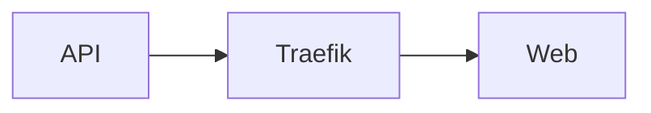
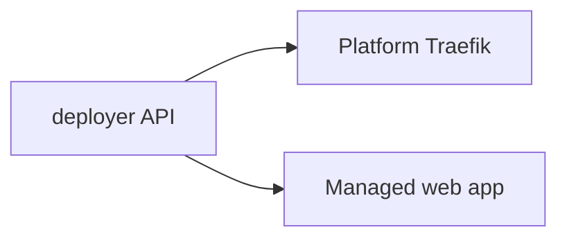

## Mermaid diagrams

Two ways to render a diagram — pick whichever reads better in context:

### Fenced block (auto-detected)

Any ```` ```mermaid ```` code block is intercepted by the `pre` renderer and becomes an interactive diagram:

````mdx

````

Renders as:



### Component form

Use `<Mermaid>` when you need a titled/framed figure:

```mdx
<Mermaid
  chart={`sequenceDiagram
    Web->>API: register app instance
    API-->>Web: app token`}
/>
```

<Mermaid
  chart={`sequenceDiagram
    participant W as Web instance
    participant A as Deployer API
    W->>A: register-app-instance
    A-->>W: appToken`}
/>

Guidelines:

- Keep node labels short; long sentences belong in prose.
- Prefer `flowchart` for structures, `sequenceDiagram` for request flows, `stateDiagram-v2` for lifecycles.
- Diagrams render client-side; avoid relying on them for critical content that must work without JS.

## Charts

`DocChart` wraps [TanStack Charts](https://tanstack.com/charts) with a declarative, JSON-driven interface. No brace expressions needed — data is a quoted string attribute:

```mdx
<DocChart
  kind="bar"
  title="Deploys per weekday"
  data='[{"label":"Mon","value":12},{"label":"Tue","value":18},{"label":"Wed","value":9},{"label":"Thu","value":22}]'
  xLabel="Day"
  yLabel="Deploys"
/>
```

<DocChart
  kind="bar"
  title="Deploys per weekday"
  data='[{"label":"Mon","value":12},{"label":"Tue","value":18},{"label":"Wed","value":9},{"label":"Thu","value":22}]'
  xLabel="Day"
  yLabel="Deploys"
/>

Line charts connect the points in order:

```mdx
<DocChart
  kind="line"
  title="Reconciliation latency (ms)"
  data='[{"label":"p50","value":42},{"label":"p90","value":120},{"label":"p99","value":310}]'
/>
```

<DocChart
  kind="line"
  title="Reconciliation latency (ms)"
  data='[{"label":"p50","value":42},{"label":"p90","value":120},{"label":"p99","value":310}]'
/>

Props:

| Prop | Type | Default | Purpose |
|---|---|---|---|
| `data` | JSON string | required | Array of `{ "label": string, "value": number }`. |
| `kind` | `"line" \| "bar"` | `"line"` | Mark family. |
| `title` / `caption` | string | – | Figure header. |
| `xLabel` / `yLabel` | string | – | Axis labels. |
| `height` | string (px) | `"320"` | Chart height. |

Invalid JSON renders an inline error panel with the offending payload instead of breaking the page build.

## When to use which

- **Structure / flow / lifecycle** → Mermaid.
- **Numeric comparison or trend** → `DocChart`.
- **Step-by-step procedure** → `<DocStepFlow>`.
