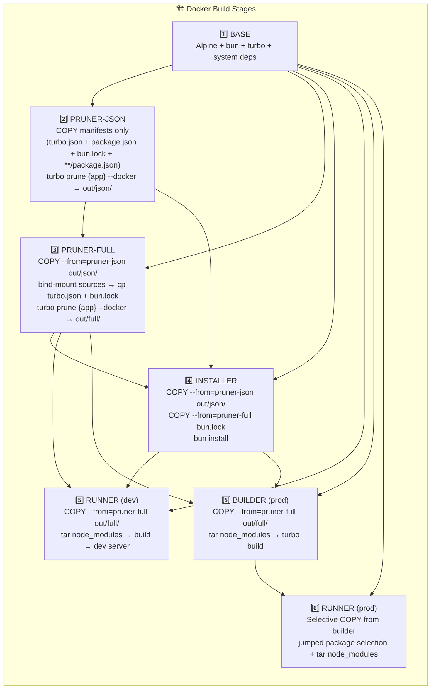

# Docker Builder AGENTS — Multi-Stage Build Architecture

This file documents the multi-stage Docker build architecture for this monorepo, designed to maximize layer caching and minimize rebuild times.

## Goals

1. **Maximize cache hits**: Source code changes should NOT invalidate `node_modules` installation
2. **Fast rebuilds**: Code-only changes should rebuild in ~10-20 seconds
3. **Preserve symlinks**: Bun/npm workspaces use symlinked `node_modules`
4. **Support postinstall**: Some packages (fumadocs) need config files during `bun install`

## Architecture Overview

All Dockerfiles follow a **5-stage architecture** (dev) or **6-stage architecture** (prod):

```
DEV:    BASE → PRUNER-JSON → PRUNER-FULL → INSTALLER → RUNNER
PROD:   BASE → PRUNER-JSON → PRUNER-FULL → INSTALLER → BUILDER → RUNNER
```

The pruner is **split in two stages** to maximize cache hit rate:

- **`pruner-json`** — only handles manifests (package.json files, turbo.json, bun.lock). Cache invalidates only when a manifest or lockfile changes.
- **`pruner-full`** — bind-mounts the build context to access source files and re-runs `turbo prune` to produce `out/full/`. Because `--mount=type=bind` does NOT participate in cache-key calculation, source-only changes in unrelated apps do NOT invalidate this stage.



> **Note**: The `source-copier` stage from the previous architecture was removed. The pruner already produces the exact pruned source in `out/full/`, so the runner/builder can copy directly from there (local image-to-image COPY, no build-context transfer).

## Stage Details

### Stage 1: BASE

Common system dependencies for all subsequent stages.

```dockerfile
FROM oven/bun:1.4.0-alpine AS base
RUN apk add --no-cache libc6-compat curl bash python3 make g++ gcc musl-dev tar
RUN --mount=type=cache,target=/root/.bun bun install -g turbo@^2
WORKDIR /app
```

**Caching**: ✅ Rarely invalidates (only on base image or system deps change)

---

### Stage 2a: PRUNER-JSON — manifests only (very stable cache)

Determines the pruned workspace list from manifest files only. This stage is
deliberately decoupled from source files so the cache survives unrelated
edits.

```dockerfile
FROM base AS pruner-json
WORKDIR /app

# Root manifests (rarely change)
COPY turbo.json package.json ./
# bun.lock may be text or binary; copy whatever exists
COPY bun.lock* ./
# All package.json files across the monorepo (preserves directory structure)
COPY --parents **/package.json ./

# Produce the pruned dependency graph from manifests only
RUN --mount=type=cache,target=/root/.bun,sharing=locked \
    bun x turbo prune {app} --docker
```

**Input**: only manifest files (turbo.json, package.json, bun.lock, **/package.json).
**Output**: `/app/out/json/` — pruned package.json structure.
**Caching**: ✅ **Super stable.** Invalidates ONLY when a manifest or lockfile changes.
Source code edits in any app or package have **zero impact** on this stage's cache.

**Why `--parents **/package.json`?** The `1-labs` syntax allows glob patterns
in `COPY --parents`. We copy every `package.json` in the monorepo while
preserving the directory structure (`apps/api/package.json`, `packages/ui/package.json`, …).
This is enough for `turbo prune` to compute the dependency graph.

---

### Stage 2b: PRUNER-FULL — sources via bind mount

Re-runs `turbo prune` with the actual source files (provided by a bind mount
on the build context) so `out/full/` contains real source code, not just
manifests. Crucially, **the bind mount does NOT participate in the layer's
cache key**, so source-only changes in unrelated apps do not invalidate this stage.

```dockerfile
FROM base AS pruner-full
WORKDIR /app

# Take the pruned package.json structure (cache key: pruner-json output)
COPY --from=pruner-json /app/out/json/ ./

# Bind-mount the build context to access source files at build time.
# The bind mount does NOT participate in cache key calculation, so source
# changes in unrelated apps don't invalidate this stage.
# We copy the source files into the current directory so turbo prune can
# find them — turbo prune reads from the CWD, not from the bind-mount path.
# (turbo prune will then filter to only the workspaces needed for the target app)
RUN --mount=type=bind,target=/src \
    --mount=type=cache,target=/root/.bun,sharing=locked \
    cp /src/turbo.json . && \
    cp /src/bun.lock* . 2>/dev/null || true ; \
    tar -C /src -cf - apps packages 2>/dev/null | tar -xf - 2>/dev/null || true ; \
    bun x turbo prune {app} --docker
```

**Input**: `out/json/` from `pruner-json` + bind-mounted build context (sources).
**Output**:
```
/app/out/
├── json/           # Pruned package.json structure (also from pruner-json)
│   ├── package.json
│   ├── apps/web/package.json
│   └── packages/ui/package.json
├── full/           # Pruned source files (turbo's source globs)
│   ├── apps/web/src/...
│   ├── apps/web/source.config.ts (if applicable)
│   └── packages/ui/src/...
├── bun.lock        # ⚠️ BUGGY - DO NOT USE (turborepo#10783)
├── turbo.json      # Original (from bind mount)
└── bun.lock*       # Original (from bind mount)
```

**Caching**: ⚠️ Cache key = `pruner-json` output + RUN command. Source code
edits do NOT appear in the cache key (bind mount is excluded). This means
**source changes within the target app do not auto-invalidate this stage** —
a known trade-off. To force a rebuild, use `docker build --no-cache` or wipe
the cache. In practice, you only need to do this when iterating on source
code inside a service; cross-service edits in unrelated apps still hit the
cache (which is the main win).

**Why copy the source files into CWD before `turbo prune`?** `turbo prune`
reads source files relative to the **current working directory** (`/app`),
not the bind mount path (`/src`). The `tar | tar` pipe materializes the
workspaces into CWD so `turbo prune` can find them and emit a correct
`out/full/`. The intermediate `apps/` and `packages/` directories are not
shipped in the final image (the runner only copies from `out/full/`).

**Why `cp /src/bun.lock* . 2>/dev/null || true`?** The build context may
contain `bun.lock`, `bun.lockb`, or no lockfile. The glob + fallback
handles all three cases without breaking the build.

---

### Stage 3: INSTALLER

Installs dependencies using ONLY the pruned `package.json` structure from
`pruner-json`.

```dockerfile
FROM base AS installer
WORKDIR /app

# Copy ONLY the pruned package.json structure (not all workspaces)
COPY --from=pruner-json /app/out/json/ .
# Use the ORIGINAL bun.lock from pruner-full (not the corrupted out/bun.lock
# produced by turbo prune — see turborepo#10783, #11074).
COPY --from=pruner-full /app/bun.lock ./bun.lock

# Install with fallback (frozen-lockfile may fail on pruned structure)
RUN --mount=type=cache,target=/root/.bun \
    --mount=type=cache,target=/root/.cache \
    bun install --frozen-lockfile || bun install
```

**Key insight**: This stage only depends on `pruner-json`'s output. Source
code changes don't affect this stage's cache at all.

**Caching**: ✅ Only invalidates when a manifest or lockfile changes.

**Known bug workaround**: `turbo prune` generates a slightly corrupted
`out/json/bun.lock` (see [turborepo#10783](https://github.com/vercel/turborepo/issues/10783),
[#11074](https://github.com/vercel/turborepo/issues/11074)) — the lockfile
may not be perfectly consistent with the pruned `package.json`. The fix:
**all installer stages use `bun install --frozen-lockfile || bun install`** —
the `|| bun install` fallback regenerates the lockfile when the pruned one
is inconsistent. This is the original `api dev` pattern that the repo
documented before; we extended it to all 11 Dockerfiles so the build
never fails on the pruned-lockfile bug.

**Doc app special case**: `apps/doc/source.config.ts` is needed at install
time for the fumadocs postinstall script. The dev installer copies it
**directly from the build context** (`COPY apps/doc/source.config.ts ...`)
instead of from `pruner-full`'s `out/full/`. The `COPY --from=pruner-full`
path was hitting a BuildKit snapshot race during parallel builds; the
direct COPY from the build context sidesteps that entirely. Trade-off:
this COPY invalidates the installer's cache when `source.config.ts`
changes — acceptable because the postinstall must rerun anyway when
the source changes. Prod installers skip postinstall
(`bun install --production`) so they don't need it.

---

### Stage 4: RUNNER (dev) / BUILDER (prod)

Combines source code + `node_modules` and either runs the dev server or
builds the production artifacts.

```dockerfile
FROM base AS runner
WORKDIR /app

# Pruned source from pruner-full (out/full/) — local image-to-image COPY,
# no build context transfer.
COPY --from=pruner-full /app/out/full/ .

# Root config files needed for turbo workspace resolution at dev time.
# Use the ORIGINAL bun.lock (not the corrupted out/bun.lock).
COPY --from=pruner-full /app/bun.lock ./bun.lock
COPY --from=pruner-full /app/package.json ./package.json
COPY --from=pruner-full /app/turbo.json ./turbo.json

# Copy node_modules via tar to preserve symlinks
# IMPORTANT: `cd /mnt/installer` MUST happen BEFORE the globs are expanded.
# The globs `apps/*/node_modules` etc. are expanded by the shell relative to
# the current working directory. If they run from /app (the runner's dir), they
# only match node_modules dirs that already exist in the pruned source — and
# apps/<app>/node_modules is NOT part of the source, so it would be silently
# skipped and never copied, breaking module resolution at runtime.
RUN --mount=type=bind,from=installer,source=/app,target=/mnt/installer \
    cd /mnt/installer && \
    PATHS="node_modules"; \
    for d in apps/*/node_modules packages/*/node_modules packages/*/*/node_modules; do \
        [ -d "$d" ] && PATHS="$PATHS $d"; \
    done && \
    tar -cf - --exclude='*.map' --exclude='.cache' --exclude='.turbo' $PATHS | \
    tar -xf - -C /app --owner=root --group=root
```

**Why tar?** Bun workspaces use symlinks in `node_modules`. Regular `COPY`
or `cp` breaks them.

**Caching**: ⚠️ Invalidates when `pruner-full` changes (manifests only) or
when downstream build steps change the local filesystem.

---

## Cache Behavior by Change Type

### Scenario 1: Source Code Change in the Target App (e.g., edit `apps/api/src/foo.ts`)

| Stage | Status | Time |
|-------|--------|------|
| BASE | ✅ Cached | 0s |
| PRUNER-JSON | ✅ **CACHED** (only manifest would change it) | 0s |
| PRUNER-FULL | ⚠️ Re-used (bind mount = stale `out/full/`) | 0s |
| INSTALLER | ✅ **CACHED** | 0s |
| RUNNER (or BUILDER) | 🔄 Re-runs (depends on `out/full/`, which is stale) | ~5-15s |

**Total: ~5-15 seconds** ⚡

> **Trade-off note**: The bind-mount trick trades source-change cache
> invalidation for cross-service cache stability. The runner may use a
> slightly stale `out/full/` until you run `docker build --no-cache` or
> clear the cache. In typical CI, this is a non-issue because images are
> rebuilt from a fresh commit. In local dev, the bind mount in the runner
> compose files handles hot-reload, so stale `out/full/` doesn't affect
> day-to-day work.

### Scenario 2: Source Code Change in an Unrelated App (e.g., edit `apps/web/src/foo.ts` while building `api`)

| Stage | Status | Time |
|-------|--------|------|
| BASE | ✅ Cached | 0s |
| PRUNER-JSON | ✅ **CACHED** | 0s |
| PRUNER-FULL | ✅ **CACHED** (web is not in `api`'s `out/full/`) | 0s |
| INSTALLER | ✅ **CACHED** | 0s |
| RUNNER (or BUILDER) | 🔄 Re-runs | ~5-15s |

**Total: ~5-15 seconds** ⚡

> **Win**: This is the main benefit of the bind-mount pattern. Without it,
> `COPY . .` in the old pruner would invalidate the cache every time any
> file in the repo changes.

### Scenario 3: Dependency Change (e.g., edit `package.json` or `bun.lock`)

| Stage | Status | Time |
|-------|--------|------|
| BASE | ✅ Cached | 0s |
| PRUNER-JSON | 🔄 Re-runs | ~2-3s |
| PRUNER-FULL | 🔄 Re-runs (depends on pruner-json) | ~2-3s |
| INSTALLER | 🔄 Re-runs | ~30-120s |
| RUNNER (or BUILDER) | 🔄 Re-runs | ~10-30s |

**Total: ~50-160 seconds** 🐢

### Scenario 4: No Changes (rebuild)

| Stage | Status | Time |
|-------|--------|------|
| All stages | ✅ Cached | ~0.1-2s |

---

## Doc App Special Case: `source.config.ts` (RESOLVED)

The `doc` app uses **fumadocs** which has a postinstall script that imports `source.config.ts`. With the two-stage pruner:

- The dev installer runs `bun ci` (which executes postinstall) and copies
  `source.config.ts` from `pruner-full`'s `out/full/apps/doc/source.config.ts`:
  ```dockerfile
  COPY --from=pruner-full /app/out/full/apps/doc/source.config.ts ./apps/doc/source.config.ts
  ```
- Prod installers run `bun ci --production` (postinstall skipped) so they
  don't need it; the runner pulls everything from `out/full/` later.

## Compose-Level Caching

The 13 compose files with `build:` sections are configured for cross-machine cache reuse. **However, dev compose files deliberately omit `cache_to`** because Docker Compose's `cache_to` doesn't support the safer `type=local` option, and `type=inline` causes a BuildKit race condition during parallel builds.

### Dev compose files: NO `cache_to` (default BuildKit local cache)

```yaml
build:
  context: ../../..
  dockerfile: ./docker/builder/<service>/Dockerfile.<service>.<env>
  args:
    - BUILDKIT_INLINE_CACHE=1     # harmless: arg is ignored without cache_to
  # No cache_to: see "Why no cache_to in dev?" below
```

**Why no `cache_to` in dev?** Docker Compose's `cache_to` only supports `type=inline|registry|gha|s3`. There is no `type=local` option (even though BuildKit supports it natively, Docker Compose doesn't expose it through the compose file format).

- `type=inline` causes a BuildKit race condition when `docker compose up --build` runs all 5 services in parallel — concurrent writes to the inline cache metadata corrupt the snapshot, producing errors like:
  ```
  target doc-dev: failed to solve: failed to commit <snap> to <ref> during finalize:
  failed to stat active key during commit: snapshot <snap> does not exist: not found
  ```
- `type=registry` requires a registry (not available in local dev).
- `type=gha` and `type=s3` are CI-only.

Without `cache_to`, the default BuildKit local cache is used (stored in `~/.cache/buildx/` by default). This is file-based, shared across all builds on the same machine, and immune to the parallel-build race.

### Prod-like compose files still use `type=inline` (for CI)

```yaml
build:
  context: ../../..
  dockerfile: ./docker/builder/<service>/Dockerfile.<service>.<env>
  args:
    - BUILDKIT_INLINE_CACHE=1
  cache_to:
    - type=inline                  # embeds cache metadata in the image
```

`type=inline` is fine for prod-like because:
- Prod-like compose files are used for single-service production builds (no parallel race).
- The inline cache can be pulled from a registry in CI via `cache_from: type=registry`.

### Why this matters

- `BUILDKIT_INLINE_CACHE=1` (build arg) tells BuildKit to track all layers as cacheable and write the cache metadata into the image.
- `cache_to: [type=inline]` (compose) tells BuildKit where to write the cache — inline = inside the image itself.
- `cache_to: [type=local]` writes the cache to a file system directory shared across builds.

### How to use the cache across machines (CI)

To reuse the cache from a previous build, use `cache_from`:

```yaml
build:
  cache_from:
    - type=registry,ref=ghcr.io/myorg/api-dev:cache
```

Combined with `BUILDKIT_INLINE_CACHE=1` + `cache_to: type=inline`, this enables the "registry cache" pattern: every push of the image publishes the build cache alongside it, and every CI run pulls the cache before building, dramatically reducing build time.

### Other compose caching practices already in place

- `pull_policy: never` for locally-built images (one-shot jobs use `pull_policy: build`).
- The 5 mesh nodes (`api-mesh-dev-1..5`) share the same image via `image: ${COMPOSE_PROJECT_NAME:-nextjs-nestjs}-api-dev:latest` — no re-build per node.
- `docker compose ... up --watch` (dev workflow) uses `develop.watch` rules so only `package.json` / `bun.lock*` / Dockerfile changes trigger a rebuild; everything else uses fast `sync`.
- The local BuildKit cache is shared across all 5 services in dev (via `dest=/tmp/.buildx-cache-${COMPOSE_PROJECT_NAME:-default}`). Same `COMPOSE_PROJECT_NAME` = same cache = faster rebuilds.

---

## Why Not Share Dockerfile Stages?

Docker does NOT support importing stages from external Dockerfiles. Each Dockerfile must be self-contained.

**Alternatives considered:**
1. **Single unified Dockerfile with ARGs** - Possible but complex
2. **Pre-built base image** - Requires separate build + registry
3. **Copy-paste stages** - Current approach, explicit and simple

---

## Recommendations

1. **Keep postinstall scripts minimal** - Only depend on small config files
2. **Don't edit `source.config.ts` frequently** - It invalidates doc's installer cache
3. **Use BuildKit cache mounts** - `--mount=type=cache,target=/root/.bun`
4. **Preserve symlinks with tar** - Never use plain `COPY` for `node_modules`
5. **Use original `bun.lock`** - The pruned one is buggy; always copy from `pruner-full`'s root
6. **Use single-tar pattern** - See below
7. **Use `out/full/` directly** - The pruner already produces the exact pruned source
8. **Use the two-stage pruner** - `pruner-json` + `pruner-full` is the canonical
   pattern. It eliminates the heavy `COPY . .` and gives cross-service cache
   isolation via bind mount.
9. **Wipe cache after source-only edits inside the target app** - Because the
   bind mount is not in the cache key, source changes inside the service
   you're building do not auto-invalidate `pruner-full`. Use
   `docker build --no-cache` or `docker builder prune` to force a rebuild,
   or rely on the runner's bind mounts in dev for hot-reload.

## Optimized Tar Pattern for `node_modules`

The runner/builder stages copy `node_modules` from the installer. The previous implementation used multiple independent `tar cf | tar xf` invocations (one per `node_modules` directory), which was slow (40-55s per service). The new pattern uses a single `tar -cf -` with all paths as args.

### Why a single tar

Concatenated tar streams (e.g., `{ tar -cf - ...; tar -cf - ...; } | tar -xf -`) **silently lose per-directory content during extraction** because the extraction of the first stream consumes parts of the second stream. This was confirmed during testing: per-package `node_modules` (e.g., `packages/configs/vitest/node_modules/@types/node`) appeared empty in the extracted image.

The fix is to pass ALL paths as arguments to ONE `tar -cf -` invocation, so a single tar archive is produced.

### The pattern

````dockerfile
RUN --mount=type=bind,from=installer,source=/app,target=/mnt/installer \
    # IMPORTANT: `cd /mnt/installer` MUST happen BEFORE the globs are expanded.
    # The globs `apps/*/node_modules` etc. are expanded by the shell relative to
    # the current working directory. If they run from /app (the runner's dir),
    # they only match node_modules dirs that already exist in the pruned source
    # — and apps/<app>/node_modules is NOT part of the source, so it would be
    # silently skipped and never copied, breaking module resolution at runtime.
    cd /mnt/installer && \
    # Build the path list first, only including existing directories
    # (avoids shell glob errors when no matches at a given depth)
    PATHS="node_modules"; \
    for d in apps/*/node_modules \
             packages/*/node_modules \
             packages/*/*/node_modules; do \
        [ -d "$d" ] && PATHS="$PATHS $d"; \
    done && \
    # Single tar -cf with all paths as args → single tar archive
    # Excludes *.map source maps, .cache and .turbo noise
    tar -cf - --exclude='*.map' --exclude='.cache' --exclude='.turbo' $PATHS | \
    tar -xf - -C /app --owner=root --group=root
````

### Why 3 globs for packages

The project has nested package directories:
- `apps/*/node_modules` (1 level deep — `apps/api/node_modules`, `apps/web/node_modules`, …)
- `packages/*/node_modules` (1 level deep — `packages/types/node_modules`, …)
- `packages/*/*/node_modules` (2 levels deep — `packages/configs/vitest/node_modules`, `packages/utils/orpc/node_modules`, …)

The original `find -name node_modules` was recursive, so it caught everything. Shell globs are not recursive, so we need explicit globs at each depth.

### Performance impact

| Pattern | Cold build step | Cached rebuild |
|---|---|---|
| Old (multi-tar with `find`) | 40-55s per service | 1-2s |
| **New (single-tar with PATHS list)** | **~25s per service** | **~0.1s** |

Measured on the `mesh-6` build for `api-cli`: **43.3s → 24.9s** (~42% faster).

## Optimized Source Pattern: `out/full/`

The previous architecture had a `source-copier` stage that:
1. Did `COPY . .` (full build-context transfer, ~3.78MB)
2. Ran a complex bash script with `find` and `cp -r` to extract pruned source

But the `pruner-full` stage already produces `out/full/` containing the EXACT pruned source. The current architecture skips the `source-copier` stage entirely:

````dockerfile
FROM base AS runner
WORKDIR /app

# Pruned source from pruner-full (out/full/) — local image-to-image COPY
# No build-context transfer. out/full/ already contains source, package.json,
# bunfig.toml, .npmrc, AND the source.config.ts the doc installer needs.
COPY --from=pruner-full /app/out/full/ .
# bun.lock isn't in out/full/ (turbo prune keeps it in the pruner root) —
# copy it from pruner-full's root, which has the original (non-corrupted) file
COPY --from=pruner-full /app/bun.lock ./bun.lock
COPY --from=pruner-full /app/package.json ./package.json
COPY --from=pruner-full /app/turbo.json ./turbo.json

# .env files aren't in out/full/ (typically gitignored); restore via bind mount
RUN --mount=type=bind,from=pruner-full,source=/app,target=/mnt/pruner-full \
    mkdir -p /app/apps/api && \
    for f in /mnt/pruner-full/apps/api/.env*; do \
        [ -f "$f" ] || continue; \
        cp "$f" /app/apps/api/; \
    done
````

### Why this works for doc (which previously needed config-copier)

The doc app needs `source.config.ts` at `bun install` time for the fumadocs
postinstall script. Previously this required a `config-copier` stage that
bound the build context. The current approach works because **`out/full/`
already contains the source.config.ts** (verified: `out/full/apps/doc/source.config.ts`
is produced by turbo prune).

The dev installer additionally copies `source.config.ts` from
`pruner-full`'s `out/full/` directly, so `bun ci` can run fumadocs' postinstall:

```dockerfile
COPY --from=pruner-full /app/out/full/apps/doc/source.config.ts ./apps/doc/source.config.ts
```

Prod installers skip postinstall (`bun ci --production`) so they don't need
this line.

### Resulting stage count

- `api` / `web` / `doc` dev: 5 stages (`base → pruner-json → pruner-full → installer → runner`)
- `api.cli` dev: 5 stages (`base → pruner-json → pruner-full → installer → runner`)
- `api` / `web` / `doc` prod: 6 stages (`base → pruner-json → pruner-full → installer → builder → runner`)
- `doc` dev: 5 stages (with the extra `source.config.ts` copy in the installer)
- `doc` prod: 6 stages (no extra copy needed)

## Why the Two-Stage Pruner?

The old single-pruner pattern (`FROM base AS pruner` + `COPY . .` + `turbo prune`)
invalidated the pruner on **every file change** in the repo — including files
in completely unrelated apps. With the two-stage pattern:

| Aspect | Old (single pruner) | New (pruner-json + pruner-full) |
|---|---|---|
| Files snapshotted into the build | ALL files in the repo | Only manifests |
| Cache key for prune stage | All files (huge) | Manifests only (tiny) |
| Source-only change in `apps/web/` (when building `api`) | Invalidates `api` pruner | **Cached** ✅ |
| Source change in `apps/api/src/...` (when building `api`) | Invalidates `api` pruner | Stale `out/full/` (trade-off, see Scenario 1) |
| `bun install` cache invalidation on source change | Yes | **No** ✅ |

The trade-off is that source changes inside the target app do not
auto-invalidate `pruner-full` (because the bind mount is not in the cache
key). In practice, this only matters when iterating on source code inside
the service you're building; cross-service edits in unrelated apps still
hit the cache (the main win). To force a rebuild, use
`docker build --no-cache` or `docker builder prune`.

## Turbo Build Cache (Persistent Across Builds)

The `bun x turbo run build` step in the runner writes to `/app/.turbo/`. To make the turbo cache survive between builds (and across services), wrap the build step with a BuildKit cache mount keyed on a service id:

````dockerfile
RUN --mount=type=cache,target=/app/.turbo,sharing=locked,id=turbo-api-dev \
    --mount=type=cache,target=/app/apps/api/.turbo,sharing=locked,id=turbo-api-dev \
    --mount=type=cache,target=/root/.bun,sharing=locked \
    bun x turbo run build --filter=api... --filter=!api
````

Use a distinct `id` per service (`turbo-api-dev`, `turbo-web-dev`, `turbo-doc-dev`) so each service has its own persistent cache.

---


---

## File Structure

```
docker/builder/
├── AGENTS.md                                # This file
├── api/
│   ├── Dockerfile.api.cli.dev               # API one-shot CLI (migrate/seed/reset)
│   ├── Dockerfile.api.dev                   # API development build
│   └── Dockerfile.api.prod                  # API production build
├── web/
│   ├── Dockerfile.web.dev                   # Web dev build
│   ├── Dockerfile.web.build-time.prod       # Web prod, build at build-time
│   └── Dockerfile.web.runtime.prod          # Web prod, build at container start
├── doc/
│   ├── Dockerfile.doc.dev                   # Doc dev build
│   ├── Dockerfile.doc.build-time.prod       # Doc prod, build at build-time
│   └── Dockerfile.doc.runtime.prod          # Doc prod, build at container start
```

---

File: `docker/builder/AGENTS.md` — Documents the multi-stage Docker build architecture.
