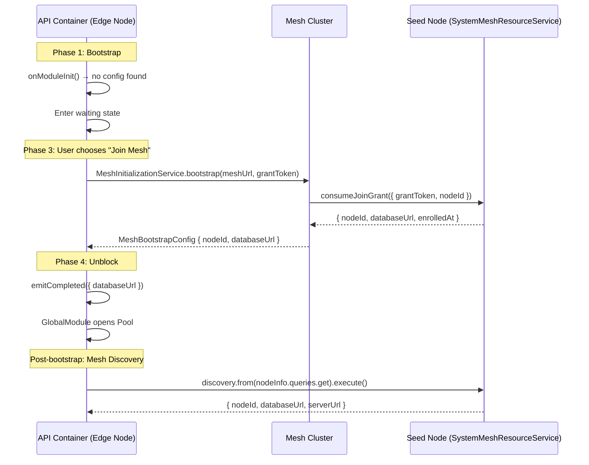

# Deployer v3: Initialization & Self-Bootstrapping Architecture

> **Status:** Active development
> **Scope:** `InitializationService`, `DatabaseModule`, `MeshCoreModule`, `SystemMeshResourceService`, `SystemMeshResourceDiscoveryService`
> **Goal:** Self-bootstrapping API container that gates all DB-dependent modules until the `databaseUrl` is resolved — either from local Docker provisioning or from the mesh resource discovery layer.

---

## 1. Core Philosophy: The Gatekeeper Pattern

The system architecture follows a **Phase-based Initialization** model. Because the system is designed to be self-bootstrapping (capable of spawning its own dependencies), the application must start in a "minimal" mode and gate its full functional modules until a stable environment is established.

### Key Principles

| Principle | Description |
|-----------|-------------|
| **Observable-First Signals** | All setup and connection states are driven by RxJS Observables. The system can wait, retry, and compose complex startup logic without blocking the main process thread. |
| **Zero-Restart Setup** | The system transitions from "Setup Wizard" to "Fully Operational" without requiring a container restart. |
| **Dependency Gating** | Modules that require the Global Database (PostgreSQL) use NestJS `useFactory` providers that `await` the signal from `InitializationService.waitForSetup()`. |
| **Mesh-as-Resource-Provider** | The mesh is not just a transport layer — it is a **distributed resource surface**. The `databaseUrl` is a mesh-queryable resource exposed by `SystemMeshResourceService` via the `node-info` entity. |
| **Single Source of Truth** | The `InitializationService` holds the `completedSubject` — the one and only signal that unblocks the entire application. |

---

## 2. Startup Phases

### Phase 1: Bootstrap (Local SQLite)

- The API container starts.
- **Local SQLite DB** (`/app/data/local.db`) is initialized immediately — no external dependencies.
- **CoreInitializationModule** initializes and `InitializationService.onModuleInit()` checks for existing `node-config` in the local DB.
- If a config exists → skip to Phase 4 (auto-unblock).
- If no config exists → enter Phase 2 (waiting).

### Phase 2: Signal Waiting

- **DatabaseModule** → **GlobalModule** attempts to initialize the `GLOBAL_DATABASE_POOL`.
- The pool factory calls `InitializationService.waitForSetup()` which internally does `firstValueFrom(this.completedSubject)`.
- **All modules depending on `GlobalDatabaseService`** (Project, Deployment, Service, etc.) are held in suspense by NestJS dependency injection.
- The setup wizard UI is available at `GET /setup/status`.

### Phase 3: Setup Action (Local Seed or Remote Mesh Edge)

The user chooses a strategy via the **Setup Controller** (`POST /setup/initialize`):

| Strategy | Flow | `databaseUrl` Source |
|----------|------|---------------------|
| **Local (Seed Node)** | Docker orchestration spawns PostgreSQL container → migrations → seed data | Constructed from Docker port mapping |
| **Remote (Edge Node)** | Mesh handshake via `MeshInitializationService.bootstrap()` → receive `databaseUrl` from mesh | Returned by remote mesh node's `consumeJoinGrant` endpoint |

### Phase 4: Initialization & Unblocking

- `InitializationService.emitCompleted(status)` fires `completedSubject.next(status)` + `.complete()`.
- `GlobalModule` factory receives the `databaseUrl`, opens the PostgreSQL pool, and provides `GLOBAL_DATABASE_CONNECTION`.
- All suspended modules are automatically initialized by NestJS as their dependencies become available.
- **No container restart required.**

### Phase 4b: Reboot Recovery (Already Configured)

On subsequent container starts, `onModuleInit()` finds the persisted `node-config` in SQLite:
1. Reads `meshUrlsSnapshot` and attempts to reconnect to the mesh.
2. Uses the `SystemMeshResourceDiscoveryService` to query the `node-info` entity from the mesh for the `databaseUrl`.
3. Emits `completedSubject` immediately with the recovered config.
4. All downstream modules unblock automatically.

---

## 3. Database Separation Strategy

We maintain a strict boundary between the **Bootstrap DB** and the **Operational DB**.

### Local Bootstrap DB (SQLite)

| Property | Value |
|----------|-------|
| **Path** | `/app/data/local.db` |
| **Role** | System identity and setup persistence |
| **Lifetime** | Survives container restarts (mounted volume) |
| **Access** | Synchronous via Drizzle + `bun:sqlite` |

**Tables:**
- `node_config` — Single-row table: `nodeId`, `strategy`, `databaseUrl`, `meshUrlsSnapshot`, `configuredAt`
- `setup_status` — Tracks onboarding progress (optional, for resumable setup)

**Usage:** Used ONLY for system startup and offline local caching. Never for operational data.

### Global Operational DB (PostgreSQL)

| Property | Value |
|----------|-------|
| **Source** | Docker container (local) or mesh-provided URL (remote) |
| **Role** | Source of truth for the entire platform |
| **Lifetime** | Persistent across deploys |
| **Access** | Async via Drizzle + `pg` Pool |

**Tables:**
- `container_config` / `container_instance` — Full lifecycle state
- `mesh_nodes` — Shared view of the mesh cluster
- `image_definitions` / `build_jobs` — Image registry and build state
- `user` / `organization` / `member` / `account` — Auth tables (Better Auth)

**Replication:** This database is multi-master or replicated across mesh nodes to ensure platform consistency.

---

## 4. Module Dependency Chain

The initialization order is enforced by NestJS dependency injection. The chain is:

```
┌─────────────────────────────────────────────────────────────────────┐
│                        Phase 1: Bootstrap                          │
│                                                                     │
│  LocalModule (SQLite)                                               │
│       ↓                                                             │
│  CoreInitializationModule                                           │
│       ├── NodeConfigRepository (reads SQLite)                       │
│       ├── LocalInitializationService (Docker provisioning)          │
│       ├── RemoteInitializationService (mesh handshake)              │
│       ├── MeshInitializationModule → MeshInitializationService      │
│       ├── CoreDockerModule → PostgresContainerService               │
│       └── CoreReachabilityModule → ReachabilityService              │
│                                                                     │
│  InitializationService.onModuleInit()                               │
│       → checks node_config in SQLite                                │
│       → if found: auto-emit completedSubject                        │
│       → if not found: wait for user action                          │
└─────────────────────────────────────────────────────────────────────┘
                              │
                              │  completedSubject.next(status)
                              │  completedSubject.complete()
                              ↓
┌─────────────────────────────────────────────────────────────────────┐
│                     Phase 2: Global DB Unlock                       │
│                                                                     │
│  DatabaseModule (Global)                                            │
│       ├── GlobalModule                                              │
│       │     ├── useFactory: await initService.waitForSetup()        │
│       │     ├── new Pool({ connectionString: databaseUrl })         │
│       │     └── drizzle(pool, { schema: globalSchema })             │
│       └── GlobalDatabaseService                                     │
│                                                                     │
│  MeshCoreModule (depends on DatabaseModule)                         │
│       ├── SystemMeshResourceService (exposes node-info entity)      │
│       ├── SystemMeshResourceDiscoveryService (query engine)         │
│       ├── MeshQueryExecutor                                         │
│       └── ... topology, topic, stream services                      │
│                                                                     │
│  All feature modules (Project, Deployment, Service, etc.)           │
│       → import DatabaseModule → auto-unblock when pool is ready     │
└─────────────────────────────────────────────────────────────────────┘
```

### Blocking Hierarchy

```
Setup blocks MeshInitializationService until onboarding is completed.
MeshInitializationService blocks RemoteInitializationService until mesh handshake succeeds.
InitializationService blocks DatabaseModule until databaseUrl is known.
DatabaseModule blocks MeshCoreModule until the pool is open.
MeshCoreModule blocks all feature modules that consume mesh streams.
```

---

## 5. Mesh Resource Discovery Integration

### 5.1 The `node-info` Entity

The `SystemMeshResourceService` exposes a `node-info` entity that makes the `databaseUrl` queryable across the mesh:

```typescript
// entities/node-info.entity.ts
export const nodeInfoEntity = meshEntity({
  key: "node-info",
  item: z.object({
    nodeId: z.string(),
    databaseUrl: z.string(),
    serverUrl: z.string(),
  }),
  itemKey: "nodeId",
  queries: {
    get: meshQuery(
      z.object({}),
      z.object({
        nodeId: z.string(),
        databaseUrl: z.string(),
        serverUrl: z.string(),
      })
    )
  },
  mutations: {}
});
```

### 5.2 The `SystemMeshResourceService` (Provider)

This service runs on every mesh node and responds to `node-info:get` queries:

```typescript
// services/system-mesh-resource.service.ts
@Injectable()
export class SystemMeshResourceService extends SystemMeshResourceBase
  implements OnModuleInit, OnModuleDestroy {

  onModuleInit(): void {
    super.onModuleInit();
    this.registerEntityHandler("node-info", "get", async () => {
      return {
        payload: {
          nodeId: this.meshConfig.getNodeId(),
          databaseUrl: this.env.get("DATABASE_URL") || "",
          serverUrl: this.env.get("NEXT_PUBLIC_API_URL") || "",
        },
      };
    });
  }
}
```

### 5.3 Fetching `databaseUrl` from the Mesh (Remote Strategy)

When a node joins an existing mesh (remote strategy), the `databaseUrl` is obtained through two mechanisms:

#### Mechanism A: Direct Bootstrap (Current)

The `MeshInitializationService.bootstrap()` method uses an oRPC client to call `consumeJoinGrant` on the remote mesh, which returns the `databaseUrl` directly:

```typescript
// mesh-initialization.service.ts
async bootstrap(meshUrl, grantToken, serverUrl): Promise<MeshBootstrapConfig> {
    const client = this.createRemoteClient(meshUrl);
    const result = await client.consumeJoinGrant({ grantToken, nodeId, serverUrl });
    return {
        nodeId: result.body.nodeId,
        databaseUrl: result.body.databaseUrl,  // ← databaseUrl from mesh
        enrolledAt: result.body.enrolledAt,
    };
}
```

#### Mechanism B: Mesh Resource Discovery (New — Post-Bootstrap)

After the initial bootstrap, the `SystemMeshResourceDiscoveryService` can be used to query the `node-info` entity from any mesh node to obtain or verify the `databaseUrl`:

```typescript
// Using the discovery service to fetch databaseUrl from the mesh
const result = await discovery
  .from(SystemMeshResourceService.entities.nodeInfo.queries.get)
  .scope({ strategy: "direct-node", timeoutMs: 5000 })
  .execute();

// result.items[0].databaseUrl → the database URL from the mesh node
```

This is the **preferred mechanism for reboot recovery** — instead of storing the `databaseUrl` in SQLite and trusting it forever, the system can re-derive it from the mesh on startup.

### 5.4 Reboot Recovery Flow with Mesh Discovery

On container restart, `InitializationService.onModuleInit()` should:

1. Read `node_config` from SQLite → get `meshUrlsSnapshot`.
2. Connect to the mesh using `MeshInitializationService.connectToMesh()`.
3. Use `SystemMeshResourceDiscoveryService` to query `node-info` from the mesh.
4. Extract `databaseUrl` from the query result.
5. Emit `completedSubject` with the recovered `databaseUrl`.

This ensures the `databaseUrl` is always fresh from the mesh, not a potentially stale SQLite copy.

### 5.5 Topic Derivation for `node-info`

The `BaseMeshService` factory automatically derives topics from the namespace + entity + method:

```
Namespace: system-resource
Entity:    node-info
Method:    get

Derived topics:
  system-resource:node-info:get:req
  system-resource:node-info:get:res
  system-resource:node-info:get:cancel
  system-resource:node-info:changed
```

Users never reference these topics directly — they use the typed entity API.

---

## 6. Implementation Details

### 6.1 InitializationService

**File:** `v3/apps/api/src/core/modules/setup/services/initialization.service.ts`

The `InitializationService` acts as the single source of truth for the setup signal.

```typescript
@Injectable()
export class InitializationService implements OnModuleInit {
    private readonly completedSubject = new Subject<SetupCompletionStatus>()

    // Converting Observable to Promise for NestJS factory
    waitForSetup(): Promise<SetupCompletionStatus> {
        return firstValueFrom(this.completedSubject.asObservable())
    }

    // Emitting completion
    private emitCompleted(status: SetupCompletionStatus): void {
        this.completedSubject.next(status)
        this.completedSubject.complete()
    }
}
```

**Key methods:**

| Method | Purpose |
|--------|---------|
| `onModuleInit()` | Check SQLite for existing config; auto-emit if found; attempt mesh reconnection |
| `initialize(input)` | Main entry point — returns `Observable<SetupStreamEvent>` with step-by-step progress |
| `waitForSetup()` | Returns `Promise<SetupCompletionStatus>` — used by `GlobalModule` factory |
| `getSetupState()` | Returns current setup state snapshot for the UI |
| `getNodeStatus()` | Returns node identity and mesh connectivity status |
| `emitCompleted(status)` | Fires the completion signal |

### 6.2 DatabaseModule Gating

**File:** `v3/apps/api/src/core/modules/database/global/global.module.ts`

The `GlobalModule` uses the `InitializationService` to block until the database URL is known:

```typescript
@Module({
    imports: [CoreInitializationModule],
    providers: [
        {
            provide: GLOBAL_DATABASE_POOL,
            useFactory: async (initService: InitializationService): Promise<Pool> => {
                logger.log('⏳ Waiting for setup to complete before opening DB pool...')
                const { databaseUrl, nodeId, strategy } = await initService.waitForSetup()

                if (!databaseUrl) {
                    throw new Error(
                        `Setup completed (nodeId=${nodeId}, strategy=${strategy}) but databaseUrl is empty.`
                    )
                }

                logger.log(`✅ Setup complete — opening Postgres pool (strategy=${strategy})`)
                return new Pool({ connectionString: databaseUrl })
            },
            inject: [InitializationService],
        },
        // ... GLOBAL_DATABASE_CONNECTION, GlobalDatabaseService
    ],
    exports: [GlobalDatabaseService, GLOBAL_DATABASE_CONNECTION, GLOBAL_DATABASE_POOL],
})
export class GlobalModule {}
```

### 6.3 LocalInitializationService

**File:** `v3/apps/api/src/core/modules/setup/services/local-initialization.service.ts`

Handles the **local seed node** flow:

1. **Provision database** — Either probe an existing PostgreSQL URL or spawn a Docker container via `PostgresContainerService`.
2. **Ensure empty** — Verify the database has no existing tables.
3. **Run migrations** — Apply Drizzle migrations to the fresh database.
4. **Seed initial data** — Create the first user, organization, and membership.
5. **Register node** — Persist `nodeId`, `strategy: "local"`, and `databaseUrl` to SQLite.

### 6.4 RemoteInitializationService

**File:** `v3/apps/api/src/core/modules/setup/services/remote-initialization.service.ts`

Handles the **remote edge node** flow:

1. **Mesh handshake** — Call `MeshInitializationService.bootstrap()` to get `nodeId` and `databaseUrl` from the mesh.
2. **Fetch peer URLs** — Call `MeshInitializationService.getMeshNodeUrls()` to discover mesh peers.
3. **Finalize** — Persist `nodeId`, `strategy: "remote"`, `databaseUrl`, and `meshUrlsSnapshot` to SQLite.

### 6.5 MeshInitializationService

**File:** `v3/apps/api/src/core/modules/mesh/initialization/services/mesh-initialization.service.ts`

Handles the low-level mesh connectivity:

| Method | Purpose |
|--------|---------|
| `bootstrap(meshUrl, grantToken, serverUrl)` | Full bootstrap: validate mesh, generate nodeId, consume join grant → returns `{ nodeId, databaseUrl, enrolledAt }` |
| `connectToMesh(meshUrl)` | Opens a typed oRPC session to a remote mesh node |
| `getMeshNodeUrls(meshUrl, localNodeId)` | Retrieves all known peer endpoint URLs from the mesh |

---

## 7. Deployment Orchestration (Local Strategy)

In **Local Mesh** mode, the system follows these steps:

1. API starts with a Docker socket mount.
2. `LocalInitializationService` uses the `PostgresContainerService` to deploy `postgres:alpine`.
3. System waits for PostgreSQL health check.
4. System runs Drizzle migrations on the newly created PostgreSQL container.
5. System seeds initial data (user + organization).
6. Node config is persisted to SQLite.
7. `InitializationService.emitCompleted()` fires → all modules unblock.

---

## 8. Mesh Resource Discovery Architecture

### 8.1 Layer Overview

The mesh resource discovery system is a **distributed relational query engine** over mesh services. It follows the architecture defined in `mesh-resource-discovery-v2-pattern.md`:

```
┌──────────────────────────────────────────────────────────────┐
│                SystemMeshResourceDiscoveryService            │
│  .from(Service.entities.entity.queries.method)               │
│  .where() .join() .select() .orderBy() .limit() .execute()  │
└──────────────────────────────────────────────────────────────┘
                              │
                              ▼
┌──────────────────────────────────────────────────────────────┐
│                      MeshQueryBuilder                        │
│  Immutable, composable, strongly typed                      │
└──────────────────────────────────────────────────────────────┘
                              │
                              ▼
┌──────────────────────────────────────────────────────────────┐
│                     MeshQueryExecutor                        │
│  Strategy resolution → distributed execution → dedup →      │
│  filter → joins → order → paginate → project                │
└──────────────────────────────────────────────────────────────┘
                              │
                              ▼
┌──────────────────────────────────────────────────────────────┐
│              InternalBaseMeshService (BaseMeshService)       │
│  registerQueryHandler() / registerMutationHandler()          │
│  callMany() / emitEntityEvent() / observeEntityEvents$()    │
└──────────────────────────────────────────────────────────────┘
                              │
                              ▼
┌──────────────────────────────────────────────────────────────┐
│                    Mesh Topic Infrastructure                 │
│  system-resource:node-info:get:req / res / cancel           │
└──────────────────────────────────────────────────────────────┘
```

### 8.2 Entity Definition Pattern

Every mesh service exposes **entities** (not raw RPC methods). An entity is defined using `meshEntity()`:

```typescript
const nodeInfoEntity = meshEntity({
  key: "node-info",
  item: z.object({ nodeId: z.string(), databaseUrl: z.string(), serverUrl: z.string() }),
  itemKey: "nodeId",
  queries: { get: meshQuery(z.object({}), z.object({...})) },
  mutations: {}
});
```

### 8.3 Service Definition Pattern

Services extend `BaseMeshService({ namespace, entities })` and register handlers:

```typescript
const Base = BaseMeshService({ namespace: "system-resource", entities: { nodeInfo: nodeInfoEntity } });

class SystemMeshResourceService extends Base implements OnModuleInit {
  onModuleInit() {
    super.onModuleInit();
    this.registerEntityHandler("node-info", "get", async () => ({ payload: {...} }));
  }
}
```

### 8.4 Query Builder API

Consumers use the discovery service to build typed queries:

```typescript
const result = await discovery
  .from(SystemMeshResourceService.entities.nodeInfo.queries.get)
  .scope({ strategy: "direct-node", timeoutMs: 5000 })
  .execute();
```

### 8.5 How `databaseUrl` Flows Through the Mesh



---

## 9. What Needs to Be Done

### 9.1 Immediate: Fix Broken `onModuleInit()` in InitializationService

The current `onModuleInit()` has a syntax error (`client.`) and incomplete mesh reconnection logic. It needs to:

1. Read `node_config` from SQLite.
2. If config exists and `strategy === "local"` → emit immediately with stored `databaseUrl`.
3. If config exists and `strategy === "remote"` → reconnect to mesh, then use `SystemMeshResourceDiscoveryService` to query `node-info` for the `databaseUrl`, then emit.
4. If no config → log "setup wizard required" and wait.

### 9.2 Integrate `SystemMeshResourceDiscoveryService` into Reboot Recovery

Currently, `onModuleInit()` tries to reconnect to mesh URLs but doesn't use the discovery service to fetch the `databaseUrl`. The fix:

```typescript
// In InitializationService.onModuleInit() — remote strategy recovery
if (config.strategy === 'remote' && config.meshUrlsSnapshot.length > 0) {
    // Connect to mesh
    const session = await this.meshInitializationService.connectToMesh(config.meshUrlsSnapshot[0]);

    // Use discovery to fetch fresh databaseUrl from the mesh
    const result = await this.discovery
        .from(SystemMeshResourceService.entities.nodeInfo.queries.get)
        .scope({ strategy: "direct-node", timeoutMs: 5000 })
        .execute();

    const freshDatabaseUrl = result.items[0]?.databaseUrl ?? config.databaseUrl;

    this.emitCompleted({
        nodeId: config.nodeId,
        connectedAt: new Date(config.configuredAt),
        databaseUrl: freshDatabaseUrl,
        strategy: config.strategy,
    });
}
```

### 9.3 Wire `SystemMeshResourceDiscoveryService` into `CoreInitializationModule`

The `CoreInitializationModule` currently imports `MeshInitializationModule` but does not have access to `SystemMeshResourceDiscoveryService`. Since the discovery service lives in `MeshCoreModule` which depends on `DatabaseModule`, we have a **circular dependency** problem:

```
CoreInitializationModule → MeshCoreModule → DatabaseModule → GlobalModule → CoreInitializationModule
```

**Solution:** Use `@Inject(forwardRef(() => SystemMeshResourceDiscoveryService))` or extract the discovery service into a separate lightweight module that doesn't depend on `DatabaseModule`.

**Preferred approach:** For reboot recovery, use `MeshInitializationService.connectToMesh()` directly (oRPC client) instead of the discovery service, since the discovery service requires the full mesh infrastructure to be running. The discovery service is used **after** the database is connected, for ongoing mesh queries.

### 9.4 Complete Task List

| # | Task | Status | File |
|---|------|--------|------|
| T1 | Fix `onModuleInit()` syntax error (`client.`) | ❌ Not started | `initialization.service.ts` |
| T2 | Implement local strategy auto-emit in `onModuleInit()` | ❌ Not started | `initialization.service.ts` |
| T3 | Implement remote strategy mesh reconnection in `onModuleInit()` | ❌ Not started | `initialization.service.ts` |
| T4 | Add `SystemMeshResourceDiscoveryService` injection to `InitializationService` (post-DB only) | ❌ Not started | `initialization.service.ts` |
| T5 | Verify `GlobalModule` factory correctly awaits `waitForSetup()` | ✅ Done | `global.module.ts` |
| T6 | Verify `LocalInitializationService` persists `databaseUrl` to SQLite | ✅ Done | `local-initialization.service.ts` |
| T7 | Verify `RemoteInitializationService` receives `databaseUrl` from mesh bootstrap | ✅ Done | `remote-initialization.service.ts` |
| T8 | Add `node-info` entity to `SystemMeshResourceService` | ✅ Done | `node-info.entity.ts` |
| T9 | Register `node-info:get` handler in `SystemMeshResourceService` | ✅ Done | `system-mesh-resource.service.ts` |
| T10 | Wire `MeshQueryExecutor` to use `InternalBaseMeshService.callMany()` | ❌ Not started | `mesh-query-executor.ts` |
| T11 | End-to-end test: local strategy init → DB unlock | ❌ Not started | `initialization.service.spec.ts` |
| T12 | End-to-end test: remote strategy init → mesh bootstrap → DB unlock | ❌ Not started | `initialization.service.spec.ts` |
| T13 | End-to-end test: reboot recovery with mesh discovery | ❌ Not started | `initialization.service.spec.ts` |

---

## 10. Architectural Decisions

### 10.1 Why Observable-Only (No Separate Promise)

The `InitializationService` uses a single `Subject<SetupCompletionStatus>` exposed as `setupCompleted$ = this.completedSubject.asObservable()`. The `waitForSetup()` method converts it to a Promise via `firstValueFrom()`.

**Rationale:**
- Single source of truth — no dual Promise + Observable state to synchronize.
- RxJS provides `firstValueFrom()` for Promise conversion where needed.
- The Observable can be composed with `pipe()`, `timeout()`, `retry()` for advanced scenarios.
- No resolver functions to manage (`resolveSetupComplete`).

### 10.2 Why `useFactory` Instead of `forRootAsync`

The `GlobalModule` uses a plain `useFactory` provider that injects `InitializationService` directly. This is simpler than `forRootAsync()` because:

- `GlobalModule` is not a dynamic module — it's always imported the same way.
- The async gating is handled by the factory itself, not by module configuration.
- `forRootAsync()` is needed when the module's *configuration* is async (e.g., reading env vars from a remote source). Here, the *dependency* is async.

### 10.3 Why Mesh Discovery for Reboot Recovery (Not Just SQLite)

Storing `databaseUrl` in SQLite works for the initial setup, but:

- The database might be migrated to a different host/port.
- The mesh might have a newer `databaseUrl` (e.g., after a failover).
- SQLite is a local cache, not the source of truth for the mesh.

Using mesh discovery ensures the `databaseUrl` is always fresh from the mesh's perspective.

### 10.4 Circular Dependency Resolution

The `MeshCoreModule` depends on `DatabaseModule`, and `DatabaseModule` depends on `CoreInitializationModule`. This creates a potential circular dependency:

```
CoreInitializationModule → MeshInitializationModule (lightweight, no DB)
DatabaseModule/GlobalModule → CoreInitializationModule (for waitForSetup)
MeshCoreModule → DatabaseModule (for GlobalDatabaseService)
```

**Resolution:** The `CoreInitializationModule` only imports `MeshInitializationModule` (which is lightweight — just the oRPC client, no DB). The full `MeshCoreModule` is imported at the app level and depends on `DatabaseModule`, which is already unblocked by the time it initializes.

---

## 11. File Reference Map

| Component | File |
|-----------|------|
| InitializationService | `v3/apps/api/src/core/modules/setup/services/initialization.service.ts` |
| LocalInitializationService | `v3/apps/api/src/core/modules/setup/services/local-initialization.service.ts` |
| RemoteInitializationService | `v3/apps/api/src/core/modules/setup/services/remote-initialization.service.ts` |
| MeshInitializationService | `v3/apps/api/src/core/modules/mesh/initialization/services/mesh-initialization.service.ts` |
| NodeConfigRepository | `v3/apps/api/src/core/modules/setup/repositories/node-config.repository.ts` |
| CoreInitializationModule | `v3/apps/api/src/core/modules/setup/initialization.module.ts` |
| GlobalModule | `v3/apps/api/src/core/modules/database/global/global.module.ts` |
| DatabaseModule | `v3/apps/api/src/core/modules/database/database.module.ts` |
| LocalModule | `v3/apps/api/src/core/modules/database/local/local.module.ts` |
| SystemMeshResourceService | `v3/apps/api/src/core/modules/mesh/services/system-mesh-resource.service.ts` |
| SystemMeshResourceDiscoveryService | `v3/apps/api/src/core/modules/mesh/services/system-mesh-resource-discovery/system-mesh-resource-discovery.service.ts` |
| MeshQueryExecutor | `v3/apps/api/src/core/modules/mesh/services/system-mesh-resource-discovery/query/mesh-query-executor.ts` |
| MeshQueryBuilder | `v3/apps/api/src/core/modules/mesh/services/system-mesh-resource-discovery/query/mesh-query-builder.ts` |
| BaseMeshService | `v3/apps/api/src/core/modules/mesh/services/base-mesh.service.ts` |
| node-info entity | `v3/apps/api/src/core/modules/mesh/entities/node-info.entity.ts` |
| MeshCoreModule | `v3/apps/api/src/core/modules/mesh/mesh-core.module.ts` |
| Database connection tokens | `v3/apps/api/src/core/modules/database/database-connection.ts` |

---

## 12. Definitions of Done

- [x] **Observable Pattern:** `completedSubject` is the single source of truth.
- [x] **Database Gating:** `GlobalModule` factory awaits `waitForSetup()`.
- [x] **Identity Persistence:** `nodeId` and mesh snapshots survive API restarts via SQLite.
- [x] **Zero-Restart Transition:** Suspended modules activate automatically without killing the application process.
- [x] **node-info Entity:** `SystemMeshResourceService` exposes `databaseUrl` as a mesh-queryable resource.
- [x] **Local Strategy Flow:** Docker provisioning → migrations → seed → emit.
- [x] **Remote Strategy Flow:** Mesh bootstrap → receive `databaseUrl` → emit.
- [ ] **Reboot Recovery:** `onModuleInit()` reconnects to mesh and fetches fresh `databaseUrl`.
- [ ] **Mesh Discovery Integration:** `SystemMeshResourceDiscoveryService` used for post-DB `databaseUrl` queries.
- [ ] **MeshQueryExecutor Wiring:** Executor uses `InternalBaseMeshService.callMany()` for distributed queries.
- [ ] **End-to-End Tests:** Local strategy, remote strategy, reboot recovery.
- [ ] **Health Monitoring:** Setup UI reflects real-time provisioning logs (streamed via RxJS Observable).
