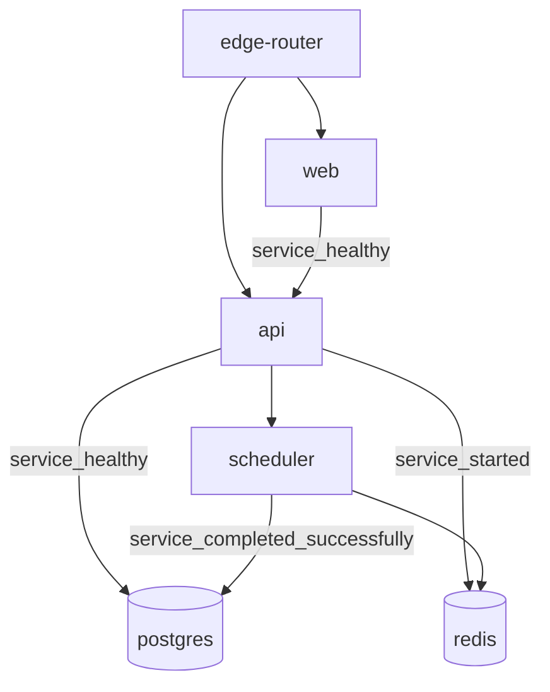
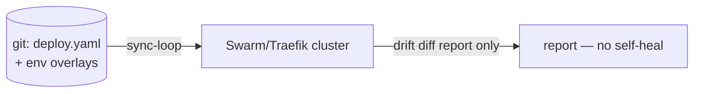
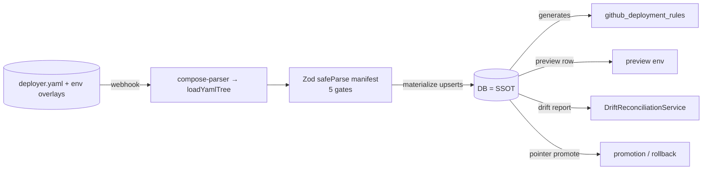
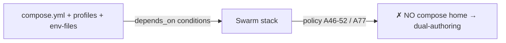
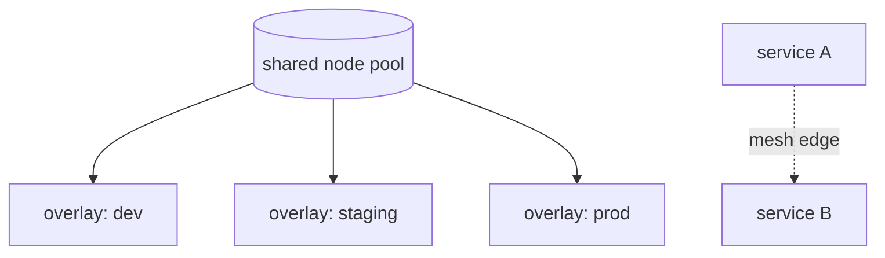

# Candidate Systems

> **Date:** 2026-08-06
> **Status:** Proposed — comparative study, no implementation
> **Scope:** Five named candidate systems (SC1), env hierarchy + service dep models + version pinning + preview + pros/cons per system, comparison table
> **Branch:** n/a (docs only)

Five systems were evaluated. They differ primarily on **where the truth lives** (DB vs repo file vs compose vs mesh topology) and on how **preview + promotion** are modeled. System A (EnvGraph) and C (RepoProposal) share the same underlying machinery; B and D violate the DB-first HARD constraint and are counterfactuals; E is the A58 north-star.

## Shared service-dependency DAG model (SC4 reference)

All systems model service deps as an acyclic graph over `service_dependencies` (service_id → depends_on_service_id, is_required) and/or manifest `dependsOn` with conditions (`service_started` / `service_healthy` / `service_completed_successfully`). Canonical example:



- **Ordering:** topological (fleet `service-dag` implements Kahn; today **unwired**).
- **Cycles:** rejected — axiom A78 satisfied in code; the manifest's `superRefine acyclic` re-enforces at the boundary.
- **Compatibility:** version-compatibility check is **ABSENT** today (no system implements it); only A/C/E expose a natural slot.
- **Readiness:** `service_healthy` gates; `fleet-readiness-gate` exists but is **unwired** (contradiction with A74).
- **Shared deps (A58):** only E is native; A/C carry it as manifest `shared: true` / overlay; B/D cannot express it.

---

## System A — "EnvGraph" (DB-first promotion lattice)

**Overview:** Environments are nodes in a promotion DAG *lattice* stored in the DB. Artifact promotion-without-rebuild is a first-class **pointer move**; rollback is a pointer re-move. Preview is an ephemeral leaf (TTL / quota / PR-close). Reuses unwired fleet machinery.

```mermaid
graph TD
    subgraph Lattice["Promotion DAG (DB nodes)"]
        D[dev] --> S[staging]
        S --> P[prod]
        D -.-> PV[preview<br/>ephemeral leaf]
    end
    subgraph Art["Artifact pointer"]
        TAG[(image:tag)] -->|promote = pointer move| DIG[(image@digest)]
    end
    PV -->|PR close / TTL| GC[GC + quota]
    P -->|rollback = re-point| S
```

| Concern | Model |
|---|---|
| Env hierarchy | DB DAG lattice; inheritance via ancestry (currently **missing** — no ancestry FK) |
| Service deps | Existing `service_dependencies` + fleet DAG services (to be wired) |
| Version pinning | Pointer-move promotion; digests in DB (P1 artifact-promotion pattern) |
| Preview lifecycle | Ephemeral leaf; TTL/quota/PR-close; reuses preview env machinery |
| Drift / sync | No file involved; reconciliation against DB intent |
| Truth direction | DB-first (T274) — fully compliant |

**Pros:** Satisfies existing axioms; A57–58 need only mild extension; smallest conceptual delta; rollback is trivial (pointer move); promotion is first-class (P1 artifact-promotion gap closed).
**Cons:** No config-file-in-repo story (SC2 requires one — it must be added or delegated); fleet machinery must be wired from zero consumers; drift detection requires a new intent source.
**v3 fit:** Strongest axiom continuity (A9–12, A56–59, A61–86, A103). **Compat strategy:** adopt as the *runtime engine* under C's manifest layer. **Truth direction:** DB.

---

## System B — "RepoTruth" (GitOps ArgoCD-style)

**Overview:** `deploy.yaml` + folder-per-env overlays in git; a sync-loop controller reconciles; drift diff is report-only by default, `selfHeal OFF`; promotion = git op.



| Concern | Model |
|---|---|
| Env hierarchy | Folder-per-env overlays (ArgoCD-style) |
| Service deps | Not native — requires a second model |
| Version pinning | Git commit = pin; tag-based |
| Preview lifecycle | PR-driven from git, not DB rows |
| Drift / sync | Sync-loop controller; report-only drift, selfHeal OFF |
| Truth direction | **Git = truth** — VIOLATES DB-first T274; secrets leave DB |

**Pros:** Battle-tested pattern; declarative diff; promotion is a code review.
**Cons:** **DISQUALIFIED** at HARD gate (DB-is-SSOT violated); secrets leave DB; no reuse of v3 machinery (duplication); tag-based pinning is a promotion hazard (no digest pointer model).
**v3 fit:** Contradicts T274 and A67 webhook-sync. **Compat strategy:** none under current axioms — only viable if the truth-direction decision reverses (see `decision-matrix.md` conditional). **Truth direction:** Git.

---

## System C — "RepoProposal" (HYBRID — RECOMMENDED)

**Overview:** Repo file = **proposal**, never the truth. Webhook → parse (reuse `compose-parser`'s include/extends/interpolation as `loadYamlTree`) → Zod `safeParse` (authoritative validation at the git boundary) → materialize into DB. DB stays SSOT. Drift = file-vs-DB report, no self-heal. Preview = DB row from rendered overlay. Reuses EnvGraph machinery + `github_deployment_rules` generation. New axiom: "authored-in-repo / owned-by-DB".



| Concern | Model |
|---|---|
| Env hierarchy | Same lattice as A; env rows materialized from overlays |
| Service deps | Manifest `dependsOn` + `service_dependencies` upserts; `superRefine acyclic` |
| Version pinning | Author tag/git → promote → digest in DB; pointer-move promotion; rollback re-point |
| Preview lifecycle | Per-PR materialization; `subdomainTemplate` (A103); TTL + maxConcurrent; A58 shared deps |
| Drift / sync | 3 levels (config/runtime/version), report-only default, selfHeal opt-in; webhook + ~60s reconciler + manual |
| Truth direction | DB (T274 preserved); repo is the input channel |

**Pros:** Preserves T274 explicitly; reuses EnvGraph machinery, `compose-parser`, webhook, and fleet services; gives SC2 its config-file system without surrendering SSOT; fixes the preview disconnect (F1–F5 fall out naturally); new axioms are additive (M1–M6).
**Cons:** Medium-high complexity; two artifacts to keep in sync (file + DB) — but drift is explicit and report-only; digest write-back is an open question; new "authored-in-repo/owned-by-DB" axiom needed.
**v3 fit:** Strongest overall; consistent with T274, A67 (webhook-sync), A46–52 (per-env policy now has a persisted home), A103. **Compat strategy:** A is its runtime engine; E is its north-star for A58. **Truth direction:** DB (repo-as-proposal).

---

## System D — "StackNative" (compose as config)

**Overview:** Compose = the unit of deployment. Profiles + env-files select environments; `depends_on` conditions = ordering; the parser already exists ~70% (`compose-parser.ts` parses include/extends/interpolation/depends_on/replicas/healthcheck).



| Concern | Model |
|---|---|
| Env hierarchy | Compose profiles per env |
| Service deps | `depends_on` conditions (native) |
| Version pinning | Weak; no digest pointer model |
| Preview lifecycle | Not expressible natively |
| Drift / sync | None (file is truth) |
| Truth direction | **File = truth** — VIOLATES DB-first; dual-authoring with DB |

**Pros:** Compose ops are a HARD-gate requirement anyway and are already ~70% parsed; ordering is native.
**Cons:** **DISQUALIFIED** — compose-as-config makes the file the SSOT (dual-authoring); A46–52/A77 policy has **no compose home**; version compat weak; preview lifecycle not expressible. **v3 fit:** Parser is reused by C (that is the correct home). **Truth direction:** file (rejected).

---

## System E — "MeshOverlay" (mesh-topology overlays)

**Overview:** Environments = logical overlays on a **shared node pool**; dependencies = mesh edges; A58 shared deps are native; strongest readiness story. Highest complexity — greenfield.



| Concern | Model |
|---|---|
| Env hierarchy | Logical overlays over shared pool (mesh) |
| Service deps | Mesh edges; shared deps native (A58) |
| Version pinning | Not defined — new machinery required |
| Preview lifecycle | Overlay + strong readiness |
| Drift / sync | Mesh topology sync (new) |
| Truth direction | DB-backed overlays (compliant) but new topology concepts |

**Pros:** A58 native; strongest readiness/failure-isolation potential; aligns with mesh (A183–185) and adaptive-topology direction.
**Cons:** Greenfield — highest complexity; **A47 amendment required**; no rulebook/policy/version story without massive build-out; footprint and migration risk worst in class.
**v3 fit:** North-star target for A58; not a near-term option. **Truth direction:** DB (but new schema).

---

## Comparison table

| Dimension | A EnvGraph | B RepoTruth | C RepoProposal | D StackNative | E MeshOverlay |
|---|---|---|---|---|---|
| Truth | DB | **Git (HARD fail)** | DB (repo = proposal) | **File (HARD fail)** | DB |
| Env hierarchy | DAG lattice | Git overlays | DAG lattice + overlays | Compose profiles | Mesh overlays |
| Service deps | `service_dependencies` + fleet | none | manifest `dependsOn` → DB | `depends_on` | mesh edges (A58 native) |
| Version pinning | digest pointer | tag-in-git | tag→digest pointer | weak | undefined |
| Preview lifecycle | ephemeral leaf | git-driven | DB row from overlay | not expressible | overlay + readiness |
| Artifact promotion (P1 gap) | **first-class** | git op | **first-class** | ✗ | first-class (via overlay) |
| Drift | n/a (no file) | report-only sync | 3-level report-only | n/a | new |
| Axiom fit | strong | T274/A67 broken | strong (+A-new) | A46-52/A77 broken | A47 amendment |
| Complexity | medium | medium | medium-high | low | **highest (greenfield)** |
| Adoption realism | reuses fleet | duplicates machinery | reuses parser+webhook+fleet | parser reuse only | new machinery |
| Gate verdict | **PASS** | **DISQUALIFIED** | **PASS — RECOMMENDED** | **DISQUALIFIED** | PASS (caveat) |

**Conclusion:** C is the strongest default; A is the runner-up (compatible — C uses A as its engine); E is the A58 north-star; B and D are counterfactuals that only make sense if the truth-direction decision reverses.
