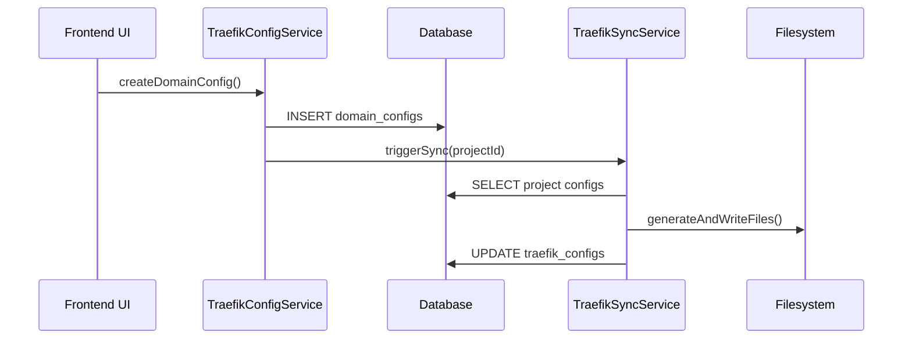
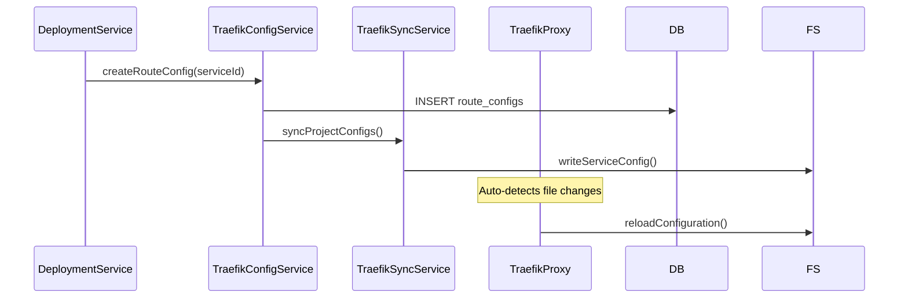
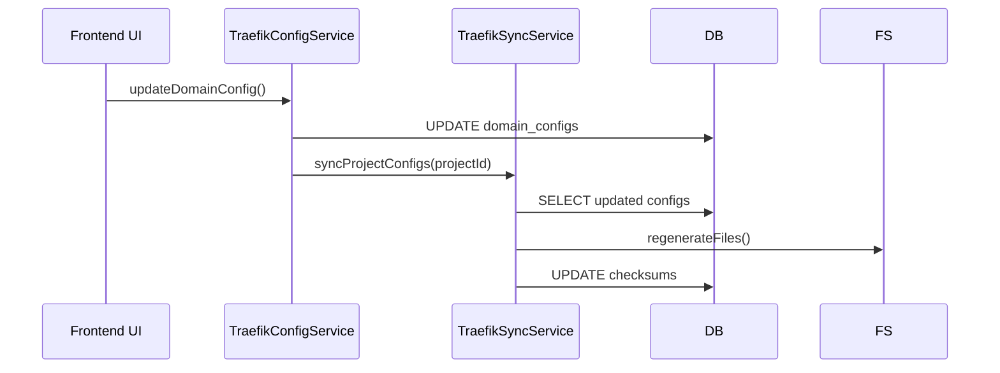

# Traefik Database-Driven Architecture

## Overview

This document outlines the new Traefik architecture where **the database serves as the single source of truth** for all configuration management. The filesystem becomes a synchronized mirror of the database state, managed by a dedicated sync service.

## Architecture Principles

### 1. Database as Source of Truth
- All Traefik configurations are stored in PostgreSQL database tables
- No manual file editing - all changes go through the database first
- Filesystem files are generated automatically from database state
- Database schema provides validation and consistency guarantees

### 2. Single Sync Service Pattern
- **Only one service** (`TraefikSyncService`) handles filesystem synchronization
- All other services interact only with the database
- Sync service watches for database changes and updates filesystem accordingly
- Clear separation of concerns between data management and file generation

### 3. Project-Based Configuration
- Configuration is organized by **projects**, not individual instances
- Each project can have multiple services with their own Traefik configs
- Simplified deployment model with predictable file structures

## Database Schema

### Core Tables

```sql
-- Project-level domain configurations
CREATE TABLE domain_configs (
  id UUID PRIMARY KEY,
  project_id UUID NOT NULL REFERENCES projects(id),
  domain VARCHAR NOT NULL,
  subdomain VARCHAR,
  full_domain VARCHAR NOT NULL,
  ssl_enabled BOOLEAN DEFAULT true,
  ssl_provider VARCHAR,
  is_active BOOLEAN DEFAULT true,
  created_at TIMESTAMP DEFAULT NOW(),
  updated_at TIMESTAMP DEFAULT NOW()
);

-- Service-specific route configurations  
CREATE TABLE route_configs (
  id UUID PRIMARY KEY,
  domain_config_id UUID NOT NULL REFERENCES domain_configs(id),
  service_id UUID NOT NULL REFERENCES services(id),
  path_rule VARCHAR DEFAULT "/",
  priority INTEGER DEFAULT 1,
  middleware JSONB,
  target_port INTEGER NOT NULL,
  target_url VARCHAR,
  health_check JSONB,
  is_active BOOLEAN DEFAULT true,
  created_at TIMESTAMP DEFAULT NOW(),
  updated_at TIMESTAMP DEFAULT NOW()
);

-- Generated Traefik configuration files
CREATE TABLE traefik_configs (
  id UUID PRIMARY KEY,
  project_id UUID NOT NULL REFERENCES projects(id),
  config_type VARCHAR NOT NULL, -- 'static', 'dynamic', 'service'
  file_path VARCHAR NOT NULL,   -- relative path in traefik directory
  content TEXT NOT NULL,        -- YAML/TOML content
  checksum VARCHAR NOT NULL,    -- for change detection
  last_synced_at TIMESTAMP,
  created_at TIMESTAMP DEFAULT NOW(),
  updated_at TIMESTAMP DEFAULT NOW()
);
```

## Service Architecture

### TraefikSyncService (Core Service)

**Responsibility**: Synchronize database state to filesystem

```typescript
@Injectable()
export class TraefikSyncService {
  // Watch database for changes and sync to filesystem
  async syncProjectConfigs(projectId: string): Promise<SyncResult>
  async syncAllProjects(): Promise<SyncResult[]>
  
  // Generate configuration files from database
  private generateStaticConfig(project: Project): string
  private generateDynamicConfig(project: Project): string
  private generateServiceConfigs(project: Project): ServiceConfig[]
  
  // Filesystem operations
  private writeConfigFile(filePath: string, content: string): Promise<void>
  private cleanupOrphanedFiles(projectId: string): Promise<string[]>
  
  // Change detection
  private hasConfigChanged(configId: string, newContent: string): boolean
  private updateConfigChecksum(configId: string, content: string): Promise<void>
}
```

### TraefikConfigService (Database Management)

**Responsibility**: CRUD operations for Traefik configurations in database

```typescript
@Injectable()
export class TraefikConfigService {
  // Domain configuration management
  async createDomainConfig(input: CreateDomainConfigInput): Promise<DomainConfig>
  async updateDomainConfig(id: string, input: UpdateDomainConfigInput): Promise<DomainConfig>
  async deleteDomainConfig(id: string): Promise<void>
  
  // Route configuration management  
  async createRouteConfig(input: CreateRouteConfigInput): Promise<RouteConfig>
  async updateRouteConfig(id: string, input: UpdateRouteConfigInput): Promise<RouteConfig>
  async deleteRouteConfig(id: string): Promise<void>
  
  // Project configuration queries
  async getProjectConfigs(projectId: string): Promise<ProjectTraefikConfig>
  async listProjectDomains(projectId: string): Promise<DomainConfig[]>
  async listServiceRoutes(serviceId: string): Promise<RouteConfig[]>
}
```

### TraefikFileSystemService (Read-Only File Access)

**Responsibility**: Provide read-only access to generated configuration files

```typescript
@Injectable()
export class TraefikFileSystemService {
  // File system browsing (read-only)
  async getTraefikFileSystem(path?: string): Promise<DirectoryTree>
  async getProjectFileSystem(projectName: string): Promise<DirectoryTree>
  async getFileContent(filePath: string): Promise<FileContent>
  async downloadFile(filePath: string): Promise<FileDownload>
  async listProjects(): Promise<string[]>
}
```

## Workflow

### 1. Configuration Creation


### 2. Service Deployment


### 3. Configuration Updates


## File Structure

Generated files follow a predictable structure:

```
/app/traefik-configs/
├── static/
│   └── traefik.yml           # Main Traefik configuration
├── dynamic/
│   ├── project-1/
│   │   ├── domains.yml       # Domain configurations
│   │   ├── services/
│   │   │   ├── api.yml       # Service-specific routes
│   │   │   └── web.yml
│   │   └── middleware.yml    # Project middleware
│   └── project-2/
│       ├── domains.yml
│       └── services/
│           └── app.yml
└── ssl/
    ├── certs/               # SSL certificates
    └── keys/                # Private keys
```

## Benefits

### 1. Consistency and Reliability
- Database transactions ensure configuration consistency
- No risk of manual file corruption or conflicts
- Atomic updates with rollback capability
- Foreign key constraints prevent orphaned configurations

### 2. Scalability
- Centralized configuration management
- Easy horizontal scaling of sync services
- Database indexing for fast configuration queries
- Efficient change detection with checksums

### 3. Auditability
- Complete change history in database
- User attribution for all modifications
- Rollback capabilities to previous configurations
- Compliance with audit requirements

### 4. Development Experience
- Type-safe database schemas with Drizzle ORM
- Automatic API contract generation
- Real-time UI updates through database queries
- Clear separation between data and presentation

## Implementation Guidelines

### DO ✅

1. **Always modify configurations through the database**
   ```typescript
   // Correct approach
   await traefikConfigService.createDomainConfig({
     projectId: 'project-1',
     domain: 'example.com',
     sslEnabled: true
   })
   ```

2. **Use the sync service for filesystem operations**
   ```typescript
   // Correct approach
   await traefikSyncService.syncProjectConfigs(projectId)
   ```

3. **Implement proper error handling and rollback**
   ```typescript
   await db.transaction(async (tx) => {
     const domain = await createDomainConfig(tx, input)
     const route = await createRouteConfig(tx, routeInput)
     await syncConfigs(domain.projectId)
   })
   ```

### DON'T ❌

1. **Never manually edit configuration files**
   ```typescript
   // Wrong approach
   await fs.writeFile('/app/traefik-configs/dynamic/project-1/domains.yml', yamlContent)
   ```

2. **Don't bypass the database for configuration changes**
   ```typescript
   // Wrong approach
   await dockerService.updateTraefikFiles(serviceId, newConfig)
   ```

3. **Avoid direct filesystem operations in business logic**
   ```typescript
   // Wrong approach - handle this in sync service only
   await fs.mkdir(`/app/traefik-configs/dynamic/${projectName}`)
   ```

## Migration Strategy

### Phase 1: Database Schema Setup
1. Create new database tables for Traefik configurations
2. Migrate existing file-based configurations to database
3. Implement database services with CRUD operations

### Phase 2: Sync Service Implementation
1. Develop `TraefikSyncService` with file generation logic
2. Implement change detection and incremental updates
3. Add monitoring and error handling for sync operations

### Phase 3: API Integration
1. Update API contracts to use database-driven services
2. Remove legacy file-based endpoints
3. Implement real-time sync triggers

### Phase 4: Frontend Migration
1. Update UI components to use new API endpoints
2. Add real-time configuration preview
3. Implement configuration validation and error handling

### Phase 5: Legacy Cleanup
1. Remove old file-based configuration code
2. Clean up obsolete database tables and services
3. Update documentation and deployment procedures

## Monitoring and Maintenance

### Health Checks
- Sync service status and performance metrics
- Database connectivity and query performance
- Filesystem integrity and disk space monitoring
- Traefik configuration validation

### Alerting
- Failed sync operations
- Configuration inconsistencies between database and filesystem
- SSL certificate expiration warnings
- Service routing failures

### Backup and Recovery
- Regular database backups with point-in-time recovery
- Configuration versioning for rollback capabilities
- Disaster recovery procedures for complete system restoration

This architecture provides a robust, scalable foundation for Traefik configuration management while maintaining the flexibility needed for complex deployment scenarios.