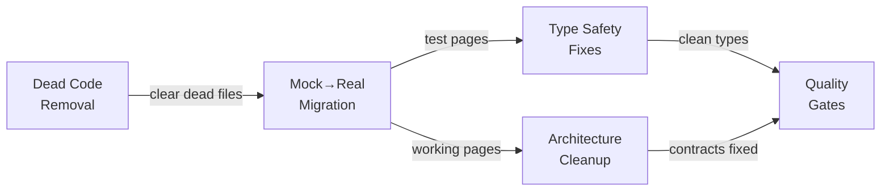

# Migration Plan — Complete Application Perfection

> **Date:** 2026-07-20
> **Scope:** Full monorepo — dead code removal, mocked→real migration, type safety fixes, architectural cleanup
> **Methodology:** Knip analysis + manual import chain verification + file-by-file review
> **Estimated effort:** ~80-120 engineering hours across 5 phases

---

## Architecture Reference

```mermaid
flowchart TB
    subgraph PHASE1["Phase 1: 🧹 Dead Code Removal ~10h"]
        D1[Delete dead core modules<br/>context, ephemeral-http, sub-app-orch, loader, git]
        D2[Delete dead system + sub-apps<br/>system/fleet, setup-wizard, auth/ empty dir]
        D3[Delete dead packages<br/>nest/auth (20 files), permissions/builder, poc]
        D4[Delete dead web files<br/>mock-hooks, orphaned libs, reference/]
        D5[Remove orphaned apps<br/>apps/test, apps/observable-poc]
    end

    subgraph PHASE2["Phase 2: 🔗 Mock→Real Migration ~40h"]
        M1[Migrate Projects pages<br/>List, Detail, Config, Envs]
        M2[Migrate Service pages<br/>Detail, Config (5 tabs), Monitoring]
        M3[Migrate Deployments page<br/>List + mock operations]
        M4[Clean up mock data files<br/>Remove unused mocks after migration]
    end

    subgraph PHASE3["Phase 3: 🔒 Type Safety ~15h"]
        T1[Fix 80+ as unknown as assertions]
        T2[Fix 35+ as any escapes]
        T3[Replace 40+ console.log with logger]
        T4[Centralize 30+ process.env into EnvService]
    end

    subgraph PHASE4["Phase 4: 🏗️ Architecture ~20h"]
        A1[Create GitHub ORPC contract]
        A2[Replace 4 direct fetch() with ORPC calls]
        A3[Replace 2 hardcoded href with declarative routing]
        A4[Consolidate auth layers]
        A5[Resolve 16 duplicate exports]
    end

    subgraph PHASE5["Phase 5: ✅ Quality Gates ~15h"]
        Q1[Address 14 TODO/FIXME items]
        Q2[Add frontend tests for migrated pages]
        Q3[Add knip to CI pipeline]
        Q4[Dependency cleanup]
        Q5[Final type-check + lint pass]
    end

    PHASE1 --> PHASE2 --> PHASE3 --> PHASE4 --> PHASE5
```

---

## Status Definitions

| Symbol | Meaning | Follow-up |
|--------|---------|-----------|
| 🟢 **SAFE DELETE** | Zero importers, zero consumers | Delete immediately, no migration needed |
| 🟡 **VERIFY FIRST** | Knip says dead but may have consumers | Manual check needed before action |
| 🔴 **KEEP** | Used despite Knip flag | False positive — document and ignore |
| 🧪 **MOCKED** | Web UI uses fake data | Migrate to real API calls |
| ⚠️ **NEEDS FIX** | Code works but violates standards | Quality improvement needed |

---

## Phase Dependencies



---

## Quick Reference: All Action Items

### Phase 1: 🧹 Dead Code Removal (135+ files, ~8h)

| Area | Files | Subagent Report | Effort |
|------|:-----:|:---------------:|:------:|
| core/modules/context/ | 2 files + docs | — | 15 min |
| core/modules/ephemeral-http/ | 1 file | — | 5 min |
| core/modules/sub-app-orchestrator/ | 2 files | — | 10 min |
| core/modules/loader/ | 4 files | — | 15 min |
| core/modules/git/ (both sub-modules) | 12 files + docs | — | 30 min |
| core/modules/mesh/examples/ | 3 files | — | 10 min |
| system/modules/fleet/ | 4 files | [W1-M2] | 15 min |
| system/modules/mesh/ (dead parts) | 2 files | [W1-M2] | 10 min |
| system/system.module.ts | 1 file | — | 5 min |
| sub-apps/setup-wizard/ (6 files) + setup-sub-app.module | 7 files | [W1-M2] | 20 min |
| sub-apps/auth/ (empty dir) | 0 files | — | 2 min |
| packages/nest/auth/ | **39 files** 🏆 | [09-AUTH] | 45 min |
| packages/utils/auth/.../builder/ | 16 files | [09-AUTH] | 20 min |
| packages/poc/core-sync-system/ | 3 files | — | 5 min |
| reference/ directory | 25 files | — | 10 min |
| apps/test/ | 5 files | — | 10 min |
| apps/observable-poc/ | 8 files | — | 10 min |
| Web mock-hooks (9 domains) | 9 files | — | 10 min |
| Web unused lib/ files | 15 files | — | 20 min |
| Web dead auth lib (3 files) | 3 files | [09-AUTH] | 5 min |
| Web duplicate permission components | 2 files | [09-AUTH] | 5 min |
| Web auth/permission dead components | 4 files | — | 10 min |

### Phase 2: 🔗 Mock→Real Migration (29 pages, ~45h)

| Feature | Pages | Total | Subagent Report | Effort |
|---------|:-----:|:-----:|:---------------:|:------:|
| **Docker** detail modals (mock cleanup) | 5 modals | 5 | [07-DOCKER-WEB] | 4h |
| Docker `queu/` typo fix | 1 dir | 1 | [07-DOCKER-WEB] | 15 min |
| **Project** list page | migrate 1 | 1 | [04-PROJECT] | 4h |
| Project detail page | migrate 1 | 1 | [04-PROJECT] | 4h |
| Project config pages | migrate 2 | 2 | [04-PROJECT] | 3h |
| Project service sub-pages | migrate 10 | 10 | [04-PROJECT] | 12h |
| **Service** list page | migrate 1 | 1 | [05-SERVICE] | 2h |
| **Deployments** list page | migrate 1 | 1 | [02-DEPLOYMENT-WEB] | 3h |
| Wire real deployment mutations | add | — | [02-DEPLOYMENT-WEB] | 2h |
| Add loading/error/empty states | add | — | [02-DEPLOYMENT-WEB] | 2h |

### Phase 3: 🔒 Type Safety (200+ violations, ~18h)

| Feature/Area | Violations | Files | Subagent Report | Effort |
|-------------|:----------:|:-----:|:---------------:|:------:|
| Docker API — `as unknown as` | 5 | docker.repository.ts | [06-DOCKER-API] | 1h |
| Docker Web — `as unknown as` | 6 | use-docker-live.ts | [07-DOCKER-WEB] | 2h |
| Service — type assertions | 11 | service.service.ts | [05-SERVICE] | 3h |
| Service — `as Record` | 1 | service.repository.ts | [05-SERVICE] | 30 min |
| Web shared helpers — `as unknown as` | 10+ | domains/shared/helpers.ts | — | 2h |
| Events module — `as unknown as` | 6 | 4 files | — | 1h |
| All other `as unknown as` | 50+ | 20+ files | — | 3h |
| All `as any` in production | 35+ | 18+ files | — | 2h |
| console.log → AppLogger | 40+ | 15 files | — | 1h |
| process.env → EnvService | 30+ | 15 files | [06-DOCKER-API], [05-SERVICE], [04-PROJECT] | 3h |
| Deployment process.env | 1 | deployment.service.ts | [01-DEPLOYMENT-API] | 30 min |
| Project process.env | 1 | project.repository.ts | [04-PROJECT] | 30 min |
| Service process.env | 1 | service.repository.ts | [05-SERVICE] | 30 min |
| Docker process.env | 2 | 2 files | [06-DOCKER-API] | 30 min |

### Phase 4: 🏗️ Architecture (6 items, ~22h)

| Item | Details | Subagent Report | Effort |
|------|---------|:---------------:|:------:|
| Create GitHub ORPC contract | 1 new module | — | 3h |
| Replace 4 fetch() → ORPC | 4 files | — | 2h |
| Fix 2 hardcoded href → DR | 2 files | — | 15 min |
| **Consolidate auth layers** | **3 subagents, 12 action items** | [09-AUTH-SUBAGENT-*](./subagent-reports/09-AUTH-SUBAGENT-01-API.md) | 4h |
| Resolve 16 duplicate exports | entities package | — | 1h |
| **Deployment in-memory state audit** | verify Maps vs DB | [01-DEPLOYMENT-API] | 2h |
| **Deployment missing source files** | 2 spec files without source | [01-DEPLOYMENT-API] | 1h |
| Fix Docker `queu/` → `queue/` | 1 directory | [07-DOCKER-WEB] | 15 min |
| Split monolithic Docker modals | 5 modals | [07-DOCKER-WEB] | 4h |
| Fill Docker schema gaps | 2 empty dirs | [08-DOCKER-CONTRACTS] | 1h |
| Docker stream validation (server-side) | verify | [08-DOCKER-CONTRACTS] | 2h |
| Deployment stream validation | verify | [03-DEPLOYMENT-CONTRACTS] | 1h |
| Check load-balancer auth dep | 1 file | [09-AUTH] | 30 min |

### Phase 5: ✅ Quality Gates (5 areas, ~18h)

| Item | Details | Subagent Report | Effort |
|------|---------|:---------------:|:------:|
| Address 14 TODO/FIXME items | 10 files | [04-PROJECT] (6 TODOs) | 3h |
| Deployment task list | 14 items | [01-DEPLOYMENT-API] | 6h |
| Add tests for migrated pages | 29 pages | all | 6h |
| Add Knip to CI | 1 pipeline file | — | 30 min |
| Dependency cleanup | 150 knip flags | — | 2h |
| Final type-check + lint | all | — | 1h |

---

## Per-Feature Summary (from Subagent Reports)

### 🐳 Docker — 3 Subagents, 14 Action Items
| ID | Item | Effort | Layer |
|:--:|------|:------:|:-----:|
| D1 | Fix 5 `as unknown as` in docker.repository.ts | M | API |
| D2 | Centralize 2 `process.env` → EnvService | S | API |
| D3 | Remove/revive dead scan-config repository | S | API |
| D4 | Ensure all stream chunks validated server-side | M | API |
| D5 | Fix 6 `as unknown as` in use-docker-live.ts | M | Web |
| D6 | Replace mock data in 5 modal components | M | Web |
| D7 | Split 5 monolithic modals → Trigger+Content | L | Web |
| D8 | Fix `queu/` → `queue/` typo | S | Web |
| D9 | Remove mock-hooks.ts | S | Web |
| D10 | Fill security schema gaps | S | Contracts |
| D11 | Fill projects schema (or remove empty dir) | S | Contracts |
| D12 | Add dockerode schemas for registries+stacks | M | Contracts |
| D13 | Verify stream contracts validate per emission | M | Contracts |
| D14 | Add Docker test coverage | L | All |

### 📦 Deployment — 3 Subagents, 25 Action Items
| ID | Item | Effort | Layer |
|:--:|------|:------:|:-----:|
| E1 | Remove dead spec files (no source) | S | API |
| E2 | Centralize process.env.DEPLOYMENT_UPLOAD_DIR | S | API |
| E3 | Add deployment.repository.ts test | M | API |
| E4 | Add Bull queue service test | M | API |
| E5 | Add 5 missing runner tests | L | API |
| E6 | Add 4 storage provider tests | M | API |
| E7 | Add 3 storage policy resolver tests | M | API |
| E8 | Add upload provider tests | S | API |
| E9 | Add event service tests | S | API |
| E10 | Add stream bridge test | S | API |
| E11 | Add load balancer adapter test | S | API |
| E12 | Add container link service test | S | API |
| E13 | Add preview overlay service test | S | API |
| E14 | Audit in-memory state vs DB persistence | M | API |
| E15 | Wire useDeploymentList() into deployments page | L | Web |
| E16 | Add loading skeleton to deployments page | S | Web |
| E17 | Add error state to deployments page | S | Web |
| E18 | Wire real mutation hooks (retry, rollback, cancel) | M | Web |
| E19 | Wire trigger rollout mutation | M | Web |
| E20 | Add true-empty state | S | Web |
| E21 | Remove `as DeploymentLite[]` cast | S | Web |
| E22 | Remove unused mock-hooks.ts | S | Web |
| E23 | Remove MOCK_INCIDENTS/MOCK_NOTIFICATIONS | M | Web |
| E24 | Verify stream contracts validate | M | Contracts |
| E25 | No contract gaps (best module) | — | Contracts |

### 🏗️ Project — 3 Subagents, 12 Action Items
Reports: [API](subagent-reports/04-PROJECT-SUBAGENT-01-API.md) | [Web](subagent-reports/04-PROJECT-SUBAGENT-02-WEB.md) | [Contracts](subagent-reports/04-PROJECT-SUBAGENT-03-CONTRACTS.md)

| ID | Item | Effort | Layer |
|:--:|------|:------:|:-----:|
| P1 | Replace stub servicesCount with real joins — project.controller.ts:337,354 | M | API |
| P2 | Implement real health check trigger — project.controller.ts:367 | L | API |
| P3 | Integrate variable-resolver module — project.service.ts:739,752 | L | API |
| P4 | Centralize process.env.MESH_NODE_ID — project.repository.ts:323 | S | API |
| P5 | Implement project-scoped variable templates — project.repository.ts:573 | S | API |
| P6 | Migrate 18 pages from mock → real hooks | XL | Web |
| P7 | Remove mock-specific strings ("mock dashboard") | M | Web |
| P8 | Add loading/error/empty states for migrated pages | L | Web |
| P9 | Add page-level tests | M | Web |
| P10 | No contract gaps (fully aligned) | — | Contracts |
| P11 | Verify config schemas match API implementation | S | Contracts |

### 🔧 Service — 3 Subagents, 17 Action Items
Reports: [API](subagent-reports/05-SERVICE-SUBAGENT-01-API.md) | [Web](subagent-reports/05-SERVICE-SUBAGENT-02-WEB.md) | [Contracts](subagent-reports/05-SERVICE-SUBAGENT-03-CONTRACTS.md)

| ID | Item | Effort | Layer |
|:--:|------|:------:|:-----:|
| S1 | Centralize process.env.MESH_NODE_ID — service.repository.ts:258 | S | API |
| S2 | Replace `as ServiceRow["metadata"]` with Zod parse — service.repository.ts:71 | M | API |
| S3 | Replace 6 `envelope.payload as X` with Zod safeParse — service.service.ts:435-525 | M | API |
| S4 | Extract duplicated runtime config resolution | S | API |
| S5 | Remove localEventOutbox writes from repository — move to service layer | M | API |
| S6 | Add typed response schemas for delete/removeDependency | S | API |
| S7 | Add tests for toServiceStreamEvent (6 branches, untested) | S | API |
| S8 | Add tests for ServiceEventService (0 tests) | S | API |
| S9 | Add tests for ServiceRepository (0 tests) | M | API |
| S10 | Migrate 11 service pages from mock → real hooks | XL | Web |
| S11 | Delete mock-hooks.ts after migration | S | Web |
| S12 | Add loading/error/empty states for migrated pages | M | Web |
| S13 | Add SSE stream consumer hook for real-time updates | M | Web |
| S14 | Remove stale schemas.ts — use @repo/contracts-entities | S | Contracts |
| S15 | Add .errors(...) to all 10 contracts | M | Contracts |
| S16 | Add explicit .params() to find-by-id | S | Contracts |
| S17 | Verify createdAt/updatedAt format consistency | S | Contracts |

### 🔐 Auth — 3 Subagents, 12 Action Items
Reports: [API](subagent-reports/09-AUTH-SUBAGENT-01-API.md) | [Web](subagent-reports/09-AUTH-SUBAGENT-02-WEB.md) | [Packages](subagent-reports/09-AUTH-SUBAGENT-03-PACKAGES.md)

| ID | Item | Effort | Layer |
|:--:|------|:------:|:-----:|
| A1 | Fix `as unknown as` in auth guards/middlewares/plugin-utils | M | API |
| A2 | Resolve TODO(ph2) in orpc/middlewares.ts — proper DI | M | API |
| A3 | Add tests for auth-core.service.ts (missing) | S | API |
| A4 | Review DI token consistency (class vs string tokens) | S | API |
| A5 | Delete dead `lib/auth/actions.ts` | S | Web |
| A6 | Delete dead `lib/auth/Components.tsx` | S | Web |
| A7 | Delete dead `lib/auth/with-client-session.tsx` | S | Web |
| A8 | Delete duplicate `components/permissions/RequireRole.tsx` | S | Web |
| A9 | Delete duplicate `components/permissions/RequirePlatformRole.tsx` | S | Web |
| A10 | Investigate/delete `RequireOrganizationRole.tsx` + fix `as any` | M | Web |
| A11 | Delete `packages/nest/auth/` (39 files) | M | Packages |
| A12 | Audit `packages/utils/auth/package.json` deps | S | Packages |

---

## Detailed Phase Breakdown

### [Phase 1: Dead Code Removal](./MIGRATION-STEP-01-DEAD-CODE.md)
### [Phase 2: Mock→Real Migration](./MIGRATION-STEP-02-MOCKED-PAGES.md)
### [Phase 3: Type Safety + Quality](./MIGRATION-STEP-03-TYPE-SAFETY.md)
### [Phase 4: Architecture Cleanup](./MIGRATION-STEP-04-ARCHITECTURE.md)
### [Phase 5: Final Quality Gates](./MIGRATION-STEP-05-QUALITY-GATES.md)
