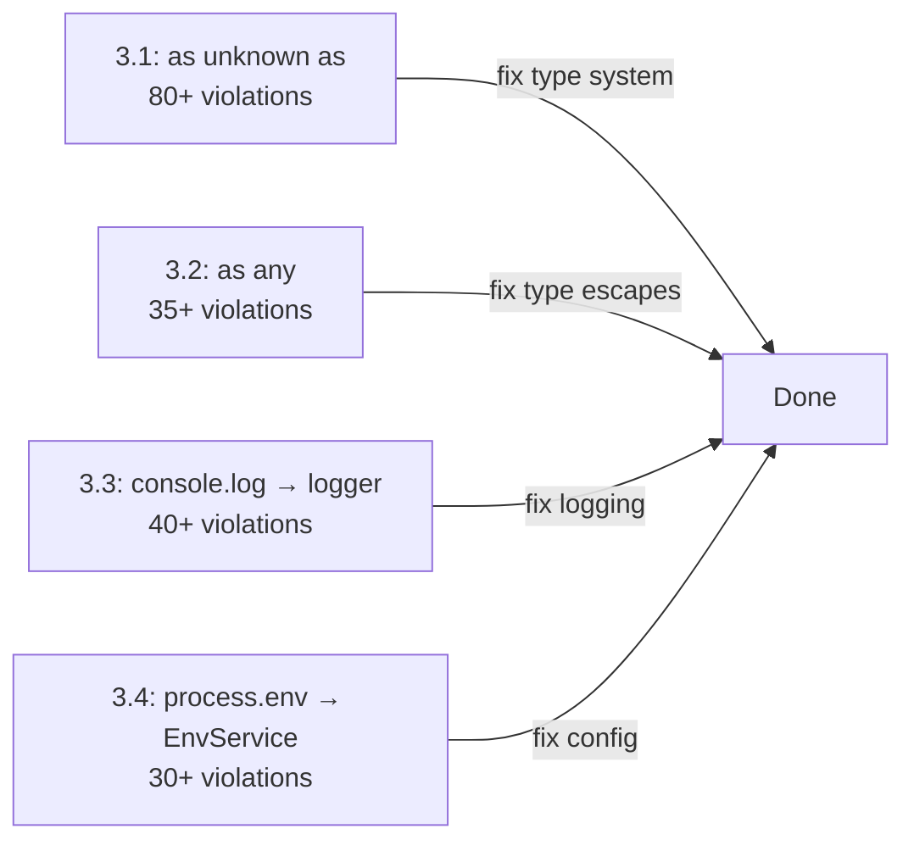

# Phase 3: Type Safety + Code Quality Fixes 🔒

> **Goal:** Eliminate all banned type assertions, console.log bypasses, and scattered process.env access.
> **Total items to fix:** ~200 violations across ~50 files
> **Risk:** MEDIUM
> **Est. time:** ~15 hours

---

## Priority Order



---

## 3.1 Fix `as unknown as` Violations (80+)

### 3.1.1 Web: `domains/shared/helpers.ts` (10+ violations)

**Location:** Lines ~620-720 and ~1000-1070

**Pattern:**
```typescript
// ❌ BEFORE
return output as unknown as TMappedOutput;
options as unknown as Parameters<...>;
return dynamicKeys as unknown as ReturnType<typeof utils.queryKey>;
config as unknown as Record<keyof TRecord, ...>;
```

**✅ Fix Strategy:**
```typescript
// ✅ AFTER — use proper Zod schema or type guard
const mapped = mappedOutputSchema.parse(output);
return mapped as TMappedOutput;  // Remove "as unknown" layer

// Or use a generic constraint:
function mapOutput<T>(output: unknown, schema: z.ZodType<T>): T {
  return schema.parse(output);
}
```

**Detailed steps:**
1. Identify what type each `as unknown as` is trying to produce
2. Create a Zod schema or type guard for that transformation
3. Replace the assertion with a `schema.parse()` call
4. Add error handling for parse failures

### 3.1.2 Web: `domains/docker/use-docker-live.ts` (6 violations)

**Location:** Lines ~112, ~292, ~340-376

**Pattern:**
```typescript
return chunk as unknown as T;
const config = kindConfigs[kind] as unknown as KindConfig<TEntity>;
```

**✅ Fix:**
```typescript
// Use proper discriminated union narrowing instead of casting
// Create a type-safe factory function
function createKindConfig<T extends DockerEntityKind>(kind: T): KindConfig<T> {
  const configs = { container: containerConfig, image: imageConfig, ... };
  return configs[kind] as KindConfig<T>;  // Single as, not "as unknown as"
}
```

### 3.1.3 API: `docker/repositories/facade/docker.repository.ts` (5 violations)

**Location:** Lines ~2130-2150, ~3940-4015

**Pattern:**
```typescript
if (parsed.success) return parsed.data as unknown as Record<string, unknown>;
```

**✅ Fix:**
```typescript
// The Zod parse already gives you the right shape
// Just use parsed.data directly — no cast needed
if (parsed.success) return parsed.data;
// The function return type should already be correct
```

### 3.1.4 API: `docker/entity/docker-entity-domain.service.ts` (4 violations)

**Location:** Lines ~431-463

**Pattern:**
```typescript
return flat as unknown as TEntity;
{ ...(detail as unknown as DockerContainer), ... }
```

**✅ Fix:**
```typescript
// Use the entity's Zod schema to validate:
const entity = dockerContainerEntitySchema.parse(flat);
return entity;
```

### 3.1.5 API: `core/modules/events/` (6 files)

**Files:**
- `base-event.service.ts` (lines ~164, ~249, ~328)
- `event-contract.builder.ts` (lines ~40, ~49)
- `core-event-sync.service.ts` (lines ~189, ~219, ~381, ~491)

**Pattern:**
```typescript
this as unknown as EventContractBuilder<T, TOutput>;
this.events.set(fullEventName, subscription as unknown as EventSubscriptionData<unknown>);
```

**✅ Fix:**
```typescript
// These are builder pattern self-references
// Use proper generic typing instead of casts
// Example: add a type parameter to the method
registerInstance<T>(instance: T): this {
  BaseEventService.registerInstance(this as unknown as BaseEventService);
  // Cast is acceptable here — it's a deliberate type narrowing for static registration
}
```

### 3.1.6 Remaining Files (~50 violations)

**File list:**
- `apps/api/src/config/env/env.service.ts`
- `apps/api/src/core/modules/auth/` (guards, middlewares, services)
- `apps/api/src/core/modules/database/` (global-database.service.ts)
- `apps/api/src/core/modules/mesh/` (mesh-entity.ts, mesh-type-utils.ts, query files)
- `apps/api/src/core/modules/traefik/` (service-builder.ts, variable.types.ts)
- `apps/api/src/core/utils/drizzle-filter.utils.ts`
- `apps/api/src/e2e/` (shared-api-runtime/manager.ts)
- `apps/api/src/modules/deployment/repositories/deployment.repository.ts`
- `apps/web/src/utils/tanstack-query.ts`
- `apps/doc/src/app/docs/[...slug]/page.tsx`

**For each file, the same pattern applies:**
1. Identify the actual type needed
2. Use Zod parse to get the right type
3. Or use a proper type guard function
4. Remove the `as unknown as` layer

---

## 3.2 Fix `as any` Escapes (35+)

### 3.2.1 UI: `data-table.tsx` (6 violations)

**Location:** Lines ~311, ~399, ~538, ~637, ~685

**Pattern:**
```typescript
const subRows = (item as any)[subRowsConfig.subRowsField || 'subRows'];
```

**✅ Fix:**
```typescript
// Use proper indexed access type:
const subRowsField = subRowsConfig.subRowsField || 'subRows';
const subRows = (item as Record<string, unknown>)[subRowsField];

// Or better: use a generic type parameter
function getSubRows<T extends Record<string, unknown>>(item: T, field: string): T[] {
  return (item[field] ?? []) as T[];
}
```

### 3.2.2 Web: `DashboardSidebar.tsx` (2 violations)

**Location:** Line ~173

**Pattern:**
```typescript
const { data: projectsData } = useProjectList({} as any);
if (!expandedProject) return undefined as any;
```

**✅ Fix:**
```typescript
// If useProjectList takes no required params:
const { data: projectsData } = useProjectList();
// If it needs empty input:
const { data: projectsData } = useProjectList({} as ProjectListInput);
```

### 3.2.3 API: `setup-wizard.controller.ts` (2 violations)

**Note:** This file is in the DEAD setup-wizard sub-app. If Phase 1 deleted it, this is already resolved.

If kept:
```typescript
// Replace:
}) as any);
// With typed return:
} as SetupWizardApiResponse);
```

### 3.2.4 API: `gateway.module.ts` (1 violation)

```typescript
requestId: (req as any).requestId,
```
**✅ Fix:**
```typescript
interface RequestWithId extends Request { requestId: string }
requestId: (req as RequestWithId).requestId,
```

### 3.2.5 API: `nest-app-reference.service.ts` (4 violations)

**Note:** This file is in the DEAD loader module. If Phase 1 deleted it, this is already resolved.

### 3.2.6 Remaining `as any` files:

**Check these for the same pattern:**
- `apps/api/src/core/sub-app/express-route-extractor.ts` — NestJS internals access
- `apps/api/src/core/modules/triggers/base-bridge.service.ts` — `(this.constructor as any).bridgeId`
- `apps/api/src/core/modules/auth/plugin-utils/middleware/` — role/org checks
- `apps/web/src/components/auth/RequireOrganizationRole.tsx` — already in DELETE list
- `apps/web/src/lib/auth/Components.tsx` — `Link component as any`

---

## 3.3 Replace `console.log` with AppLogger (40+ occurrences)

### Files to fix:

**Production code (NOT debug-cli or examples):**
- `apps/api/src/e2e/utils/shared-api-runtime/manager.ts` — 1 instance
- `apps/api/src/e2e/utils/test-interceptor.ts` — 2 instances
- `apps/api/src/modules/github/controllers/github-webhook.controller.ts` — uses `new Logger()` from NestJS, should use AppLogger
- `apps/api/src/core/modules/traefik/events/traefik-event.service.ts` — console.log in JSDoc (fix docs)

**✅ Fix pattern:**
```typescript
// Before:
console.log(`[e2e-runtime ${now}] ${message}`);

// After:
import { AppLogger } from '@repo/logger';
const logger = new AppLogger('e2e');
logger.info(`[e2e-runtime ${now}] ${message}`);
```

### Dev/Debug files (acceptable to keep):
- `apps/api/debug-cli.ts` — Debug utility, keep console.log
- `apps/api/src/core/modules/mesh/examples/` — Already deleted in Phase 1

---

## 3.4 Centralize `process.env` Access into EnvService (30+)

### Current Pattern (Scattered)
```typescript
// In setup-wizard service:
process.env.SETUP_DATABASE_URL
process.env.SETUP_AUTO
process.env.DEFAULT_ADMIN_EMAIL
// In docker repository:
process.env.APP_DOCKER_IMAGE_SCAN_PARALLELISM
// In deployment service:
process.env.DEPLOYMENT_UPLOAD_DIR
// In various places:
process.env.MESH_NODE_ID
process.env.GITHUB_WEBHOOK_SECRET
process.env.DEV_AUTH_KEY
```

### Target Pattern (Centralized)

**Step 1: Create env schema entries for missing vars**

File: `apps/api/src/config/env/env.schema.ts` (or similar)
```typescript
export const envSchema = z.object({
  // Existing vars...
  
  // Add missing ones:
  SETUP_DATABASE_URL: z.string().optional(),
  SETUP_AUTO: z.coerce.boolean().default(false),
  DEFAULT_ADMIN_EMAIL: z.string().email().default('admin@admin.com'),
  APP_DOCKER_IMAGE_SCAN_PARALLELISM: z.coerce.number().default(5),
  APP_DOCKER_IMAGE_SCAN_IMAGE_PARALLELISM: z.coerce.number().default(3),
  DEPLOYMENT_UPLOAD_DIR: z.string().default('/tmp/deployer-uploads'),
  DEV_AUTH_KEY: z.string().optional(),
  GITHUB_WEBHOOK_SECRET: z.string().optional(),
  MESH_NODE_ID: z.string().optional(),
});
```

**Step 2: Replace scattered access**

```typescript
// Before:
const raw = process.env.APP_DOCKER_IMAGE_SCAN_PARALLELISM;
// After:
const parallelism = this.envService.get('APP_DOCKER_IMAGE_SCAN_PARALLELISM');
```

**Step 3: Files to update**

| File | Env Var | Current Pattern |
|------|---------|----------------|
| `sub-apps/setup-wizard/setup-wizard.service.ts` | 8 vars | Direct process.env |
| `src/main.ts` | `API_PORT`, `NODE_ENV` | Direct process.env |
| `cli/cli.module.ts` | `SETUP_DATABASE_URL` | Mixed: envService.get + process.env |
| `cli/commands/setup-db.command.ts` | `SETUP_DATABASE_URL` | Direct |
| `docker/.../docker.repository.ts` | `APP_DOCKER_IMAGE_SCAN_PARALLELISM` | Direct |
| `docker/.../image-auto-scan-listener.service.ts` | `APP_DOCKER_IMAGE_SCAN_IMAGE_PARALLELISM` | Direct |
| `docker/.../container-resolution.service.ts` | `DEV_AUTH_KEY` | Direct |
| `deployment/services/deployment.service.ts` | `DEPLOYMENT_UPLOAD_DIR` | Direct |
| `deployment/repositories/deployment.repository.ts` | `MESH_NODE_ID` | Direct |
| `project/repositories/project.repository.ts` | `MESH_NODE_ID` | Direct |
| `service/repositories/service.repository.ts` | `MESH_NODE_ID` | Direct |
| `github/controllers/github-webhook.controller.ts` | `GITHUB_WEBHOOK_SECRET` | Direct |

---

## 3.5 Verification

```bash
# After all fixes:
bun --bun run api -- type-check
bun --bun run web -- type-check

# Verify zero banned patterns remain in production code:
grep -rn "as unknown as" apps/api/src/ apps/web/src/ packages/ | grep -v node_modules | grep -v spec.ts | grep -v '.test.ts' | grep -v debug-cli.ts | grep -v examples/
# → should be zero (or only unavoidable builder patterns)

grep -rn "as any" apps/api/src/ apps/web/src/ | grep -v node_modules | grep -v spec.ts | grep -v '.test.ts'
# → should be zero (or only test/example files)

grep -rn "console\.\(log\|debug\)" apps/api/src/ apps/web/src/ | grep -v node_modules | grep -v spec.ts | grep -v debug-cli.ts | grep -v examples/
# → should be zero

grep -rn "process\.env\." apps/api/src/ | grep -v node_modules | grep -v config/ | grep -v spec.ts | grep -v e2e/utils/
# → should be zero (or only main.ts and config)
```
