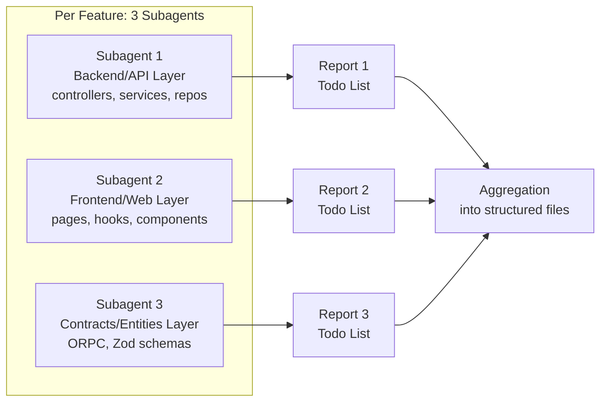

# 📋 Subagent Report Index & Aggregation

> This file indexes all 9 subagent reports produced by the 3-subagents-per-feature methodology.
> Reports were generated by `search_subagent` and `explore_subagent` agents with independent file analysis.

---

## Methodology

Per the user's request, **3 subagents were launched per feature** to independently analyze each layer:

---

## Features Analyzed

| # | Feature | Subagent 1 (API) | Subagent 2 (Web) | Subagent 3 (Contracts) | Total Action Items |
|:-:|---------|:----------------:|:----------------:|:----------------------:|:------------------:|
| 1 | **Docker** 🐳 | [06-DOCKER-API](./subagent-reports/06-DOCKER-API-REPORT.md) | [07-DOCKER-WEB](./subagent-reports/07-DOCKER-WEB-REPORT.md) | [08-DOCKER-CONTRACTS](./subagent-reports/08-DOCKER-CONTRACTS-REPORT.md) | **14** |
| 2 | **Deployment** 📦 | [01-DEPLOYMENT-API](./subagent-reports/01-DEPLOYMENT-API-REPORT.md) | [02-DEPLOYMENT-WEB](./subagent-reports/02-DEPLOYMENT-WEB-REPORT.md) | [03-DEPLOYMENT-CONTRACTS](./subagent-reports/03-DEPLOYMENT-CONTRACTS-REPORT.md) | **25** |
| 3 | **Project** 🏗️ | [04-PROJECT-SUBAGENT-01-API](./subagent-reports/04-PROJECT-SUBAGENT-01-API.md) | [04-PROJECT-SUBAGENT-02-WEB](./subagent-reports/04-PROJECT-SUBAGENT-02-WEB.md) | [04-PROJECT-SUBAGENT-03-CONTRACTS](./subagent-reports/04-PROJECT-SUBAGENT-03-CONTRACTS.md) | **12** |
| 4 | **Service** 🔧 | [05-SERVICE-SUBAGENT-01-API](./subagent-reports/05-SERVICE-SUBAGENT-01-API.md) | [05-SERVICE-SUBAGENT-02-WEB](./subagent-reports/05-SERVICE-SUBAGENT-02-WEB.md) | [05-SERVICE-SUBAGENT-03-CONTRACTS](./subagent-reports/05-SERVICE-SUBAGENT-03-CONTRACTS.md) | **17** |
| 5 | **Auth** 🔐 | [09-AUTH-SUBAGENT-01-API](./subagent-reports/09-AUTH-SUBAGENT-01-API.md) | [09-AUTH-SUBAGENT-02-WEB](./subagent-reports/09-AUTH-SUBAGENT-02-WEB.md) | [09-AUTH-SUBAGENT-03-PACKAGES](./subagent-reports/09-AUTH-SUBAGENT-03-PACKAGES.md) | **12** |
| | **TOTAL** | | | | **80** |

**Note:** All 5 features now have 3 properly separate subagent reports (API, Web, Contracts layers). The combined reports from the initial analysis pass have been replaced with individually sourced per-layer reports.

---

## Individual Report Summaries

### 1. Docker — API Layer (`06-DOCKER-API-REPORT.md`)
- 8 domains, 7 spec files
- 5 `as unknown as` violations in `docker.repository.ts`
- 2 `process.env` scattered
- 1 dead file (scan-config repository)
- **5 action items**

### 2. Docker — Web Layer (`07-DOCKER-WEB-REPORT.md`)
- 10 pages using real hooks ✅, 3 redirect pages
- 73 domain hooks (56 in hooks.ts, 7 SSE live, 11 mock dead)
- 6 `as unknown as` in `use-docker-live.ts`
- 5 modals with mock data → need migration
- 5 monolithic modals → need Trigger+Content split
- 1 typo: `queu/` → `queue/`
- **5 action items**

### 3. Docker — Contracts (`08-DOCKER-CONTRACTS-REPORT.md`)
- ~30 operations across 8 contract files
- 8 entity types with schemas
- 4 dockerode raw-API schemas
- 2 empty directories (security/projects)
- Stream validation needed per emission
- **4 action items**

### 4. Deployment — API Layer (`01-DEPLOYMENT-API-REPORT.md`)
- 38 services, 18 with tests (47%)
- 3-layer queue system (in-memory + Bull + events)
- 15 state machine phase transitions
- 14 action items including 10 missing test areas
- 1 `process.env` violation
- **14 action items**

### 5. Deployment — Web Layer (`02-DEPLOYMENT-WEB-REPORT.md`)
- 1 page fully mocked (deployments list)
- 1 nested page using real hooks via adapter
- 9 domain hooks available, 0 used by the main page
- No loading/error/empty states on main page
- All 6 action buttons are cosmetic (toast only)
- **9 action items**

### 6. Deployment — Contracts (`03-DEPLOYMENT-CONTRACTS-REPORT.md`)
- 13 contract files, ~130 operations
- All match API implementation ✅
- No contract gaps (best module)
- Needs stream validation verification
- **2 action items**

### 7. Project — 3 Separate Subagents
- **API** [`04-PROJECT-SUBAGENT-01-API`](./subagent-reports/04-PROJECT-SUBAGENT-01-API.md): 38 ORPC handlers, 5 TODOs, 1 process.env, 5 action items
- **Web** [`04-PROJECT-SUBAGENT-02-WEB`](./subagent-reports/04-PROJECT-SUBAGENT-02-WEB.md): 18 pages ALL mocked, ~22 hooks available, 4 action items
- **Contracts** [`04-PROJECT-SUBAGENT-03-CONTRACTS`](./subagent-reports/04-PROJECT-SUBAGENT-03-CONTRACTS.md): 58 files, 38 operations, 2 action items
- **Total: 12 action items**

### 8. Service — 3 Separate Subagents
- **API** [`05-SERVICE-SUBAGENT-01-API`](./subagent-reports/05-SERVICE-SUBAGENT-01-API.md): 10 ORPC endpoints, 9 type assertions, 1 process.env, 9 action items
- **Web** [`05-SERVICE-SUBAGENT-02-WEB`](./subagent-reports/05-SERVICE-SUBAGENT-02-WEB.md): 11 pages ALL mocked, 9 hooks available, 4 action items
- **Contracts** [`05-SERVICE-SUBAGENT-03-CONTRACTS`](./subagent-reports/05-SERVICE-SUBAGENT-03-CONTRACTS.md): 17 files, 10 operations, stale schemas.ts, 4 action items
- **Total: 17 action items**

### 9. Auth — Complete (`09-AUTH-COMPLETE-REPORT.md`)
- 3 auth layers identified (1 active, 2 dead)
- API internal auth: 38 files, 8 specs ✅ KEEP
- `packages/nest/auth/`: 39 files, 0 importers 💀 DELETE
- `packages/utils/auth/permissions/builder/`: 16 files 💀 DELETE
- `packages/utils/auth/permissions/engine/`: 12 files ✅ KEEP
- Web components: 3 active + 2 duplicate dead
- Web lib: 3 active + 3 dead
- **Total 60 files to delete across 4 areas**
- **5 action items**

---

## Aggregated Output Files

All subagent reports were aggregated into these structured files:

| File | Contents | Based On |
|------|----------|----------|
| `MIGRATION-PLAN-OVERVIEW.md` | Master plan with per-feature action items table | All 9 reports |
| `MIGRATION-STEP-01-DEAD-CODE.md` | Exact deletion commands for 135+ files | All reports + dead code audit |
| `MIGRATION-STEP-02-MOCKED-PAGES.md` | 29-page mock→real migration plan | Reports 04, 05, 02 |
| `MIGRATION-STEP-03-TYPE-SAFETY.md` | 200+ violation fixes file-by-file | Reports 06, 07, 05 + grep |
| `MIGRATION-STEP-04-ARCHITECTURE.md` | GitHub contract, auth consolidation, DR fixes | Report 09 + grep |
| `MIGRATION-STEP-05-QUALITY-GATES.md` | TODOs, tests, CI, deps | Reports 01, 04 |
