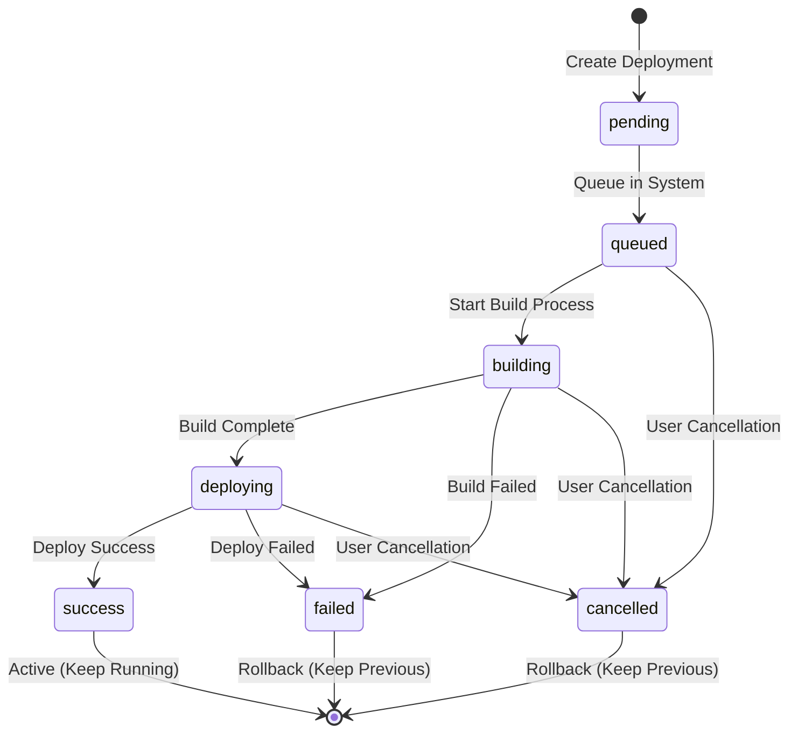

# Deployment Health Status Rules

> Comprehensive health status calculation rules for services based on deployment states and rollback policies.

This document defines how service health status is calculated based on the state of all deployments, implementing the rollback policy to ensure accurate health reporting.

## Health Status Calculation Rules

### Core Principle

**A service is considered healthy if it has at least ONE deployment with status `success` (regardless of whether it's the latest deployment or not).**

This principle is based on the rollback policy: when a new deployment fails, the system keeps the last successful deployment running. Therefore, if ANY successful deployment exists, there's a running instance of the service.

### Health Status States

| Status | Description | Display |
|--------|-------------|---------|
| `healthy` | Service has at least one successful deployment running | Green ✓ |
| `unhealthy` | All deployments have failed or been cancelled | Red ✗ |
| `starting` | Latest deployment is pending/queued/building/deploying | Blue ⟳ |
| `unknown` | Service has no deployments | Gray ? |

### Decision Tree

```
IF service has no deployments
  THEN status = 'unknown'

ELSE IF latest deployment status is 'pending', 'queued', 'building', or 'deploying'
  IF any OTHER deployment has status = 'success'
    THEN status = 'healthy' (rollback keeps previous successful running)
  ELSE
    THEN status = 'starting' (first deployment in progress)

ELSE IF any deployment has status = 'success'
  THEN status = 'healthy'

ELSE
  THEN status = 'unhealthy' (all deployments failed/cancelled)
```

## Rollback Policy

### Automatic Rollback Behavior

When a deployment transitions through different states, the system follows these rules:

#### On Deployment Failure

```yaml
When: deployment.status → 'failed'
Action:
  - Keep previous successful deployment running
  - Do NOT stop or remove successful containers
  - Log failure for monitoring
  - Alert if configured
Result: Service remains healthy (previous success still running)
```

#### On Deployment Success

```yaml
When: deployment.status → 'success'
Action:
  - Start new deployment containers
  - Wait for health checks to pass
  - Stop previous deployment containers (all environments)
  - Clean up old containers
  - Update Traefik routing to new deployment
Result: Only the latest successful deployment is running
```

#### On Deployment Cancellation

```yaml
When: deployment.status → 'cancelled'
Action:
  - Stop deployment process immediately
  - Remove any partially created containers
  - Keep previous successful deployment running (if exists)
  - Log cancellation event
Result: Service health unchanged from before deployment attempt
```

### Deployment Lifecycle



## Implementation Strategy

### Backend API Responsibilities

1. **Health Status Calculation**
   - Query ALL deployments for the service
   - Evaluate based on rollback rules
   - Return comprehensive health data

2. **Deployment State Management**
   - Track all deployment states in database
   - Implement automatic rollback on failure
   - Ensure only one active deployment per environment

3. **Container Management**
   - Stop old containers when new deployment succeeds
   - Keep successful containers when new deployment fails
   - Clean up cancelled deployment containers

### Frontend Responsibilities

1. **Display Calculated Health**
   - Use health status from API
   - Show appropriate visual indicators
   - Display deployment progress when deploying

2. **Real-time Updates**
   - Subscribe to deployment status changes
   - Update health status reactively
   - Show deployment phase progress

## Database Schema Requirements

### Deployments Table Fields

```typescript
deployments {
  id: uuid
  serviceId: uuid
  status: 'pending' | 'queued' | 'building' | 'deploying' | 'success' | 'failed' | 'cancelled'
  environment: 'production' | 'staging' | 'preview' | 'development'
  containerName: string // Docker container identifier
  isActive: boolean // Whether this deployment is currently serving traffic
  createdAt: timestamp
  deployCompletedAt: timestamp
  ...
}
```

### Health Check Results

```typescript
serviceHealthStatus {
  serviceId: uuid
  status: 'healthy' | 'unhealthy' | 'starting' | 'unknown'
  lastCheck: timestamp
  activeDeploymentId: uuid | null // Currently active deployment
  deploymentCount: number
  successfulDeploymentCount: number
  calculatedAt: timestamp
}
```

## API Endpoint Specification

### GET /service/:id/health

**Response:**

```json
{
  "status": "healthy | unhealthy | starting | unknown",
  "lastCheck": "2024-10-02T10:30:00Z",
  "checks": [
    {
      "name": "Deployment Status",
      "status": "pass | fail | warn",
      "message": "Service has 1 successful deployment running",
      "timestamp": "2024-10-02T10:30:00Z"
    },
    {
      "name": "Container Health",
      "status": "pass",
      "message": "Container is running and responding",
      "timestamp": "2024-10-02T10:30:00Z"
    }
  ],
  "uptime": 86400,
  "containerStatus": "running",
  "activeDeployment": {
    "id": "uuid",
    "status": "success",
    "environment": "production",
    "createdAt": "2024-10-01T10:30:00Z"
  },
  "rollbackAvailable": true,
  "deploymentStats": {
    "total": 5,
    "successful": 3,
    "failed": 1,
    "inProgress": 1
  }
}
```

## Examples

### Example 1: Healthy Service with Failed Latest Deployment

```
Service: web-app
Deployments:
  - ID: dep-001, Status: success, Created: 2024-10-01T10:00:00Z
  - ID: dep-002, Status: success, Created: 2024-10-01T14:00:00Z  
  - ID: dep-003, Status: failed,  Created: 2024-10-02T09:00:00Z (LATEST)

Health Status: healthy ✓
Reason: dep-002 is still running (rollback policy kept it active when dep-003 failed)
```

### Example 2: Service Deploying New Version

```
Service: api-backend
Deployments:
  - ID: dep-001, Status: success,   Created: 2024-10-01T08:00:00Z
  - ID: dep-002, Status: deploying, Created: 2024-10-02T10:00:00Z (LATEST)

Health Status: healthy ✓ (or starting based on UI preference)
Reason: dep-001 is still running while dep-002 is deploying
Display: Show "Deploying..." with progress indicator, but service is functional
```

### Example 3: Unhealthy Service (All Deployments Failed)

```
Service: background-worker
Deployments:
  - ID: dep-001, Status: failed,    Created: 2024-10-01T10:00:00Z
  - ID: dep-002, Status: failed,    Created: 2024-10-01T15:00:00Z
  - ID: dep-003, Status: cancelled, Created: 2024-10-02T09:00:00Z (LATEST)

Health Status: unhealthy ✗
Reason: No successful deployments exist, service has no running containers
```

### Example 4: Unknown Status (No Deployments)

```
Service: new-service
Deployments: []

Health Status: unknown ?
Reason: Service created but never deployed
```

## Monitoring and Alerts

### Health Check Frequency

- **Active Services**: Check every 30 seconds
- **Inactive Services**: Check every 5 minutes
- **Services in Deployment**: Check every 10 seconds

### Alert Triggers

1. **Health Status Change**
   - Trigger when: `healthy` → `unhealthy`
   - Send to: Project owners, configured webhooks
   - Include: Service details, recent deployments, error logs

2. **Deployment Failure**
   - Trigger when: deployment.status → `failed`
   - Send to: Deployment initiator, project owners
   - Include: Build logs, error message, rollback status

3. **Repeated Failures**
   - Trigger when: 3+ consecutive deployment failures
   - Send to: Project admins
   - Include: Failure pattern analysis, suggested fixes

## Testing Requirements

### Unit Tests

- [ ] Test health calculation with various deployment combinations
- [ ] Test rollback policy logic
- [ ] Test edge cases (no deployments, all failed, mixed states)

### Integration Tests

- [ ] Test actual deployment → failure → rollback sequence
- [ ] Test deployment → success → old deployment cleanup
- [ ] Test health status updates during deployment lifecycle

### E2E Tests

- [ ] Deploy service successfully
- [ ] Deploy new version that fails
- [ ] Verify service remains healthy with old version
- [ ] Deploy successful new version
- [ ] Verify old version is stopped

## Deployment Strategy Compatibility

This health calculation system works with all deployment strategies:

- ✅ **Rolling Update**: Gradual replacement, health maintained throughout
- ✅ **Recreate**: Brief downtime acceptable, health reflects state accurately
- ✅ **Blue-Green**: Maintains health during switch
- ✅ **Canary**: Shows healthy if any version is running

## Future Enhancements

1. **Environment-Specific Health**
   - Calculate health per environment (production, staging, etc.)
   - Allow different health thresholds per environment

2. **Advanced Health Metrics**
   - Include response time in health calculation
   - Consider error rate thresholds
   - Monitor resource usage health

3. **Automatic Recovery**
   - Trigger automatic redeployment on persistent unhealthy state
   - Implement exponential backoff for retry attempts
   - Self-healing deployment system

4. **Deployment History Analysis**
   - Track deployment success rates
   - Identify problematic code changes
   - Suggest deployment best times based on history

---

**Implementation Status**: 
- [x] Documentation complete
- [ ] API health endpoint implementation
- [ ] Rollback policy enforcement
- [ ] Container management logic
- [ ] Frontend integration
- [ ] Testing suite
