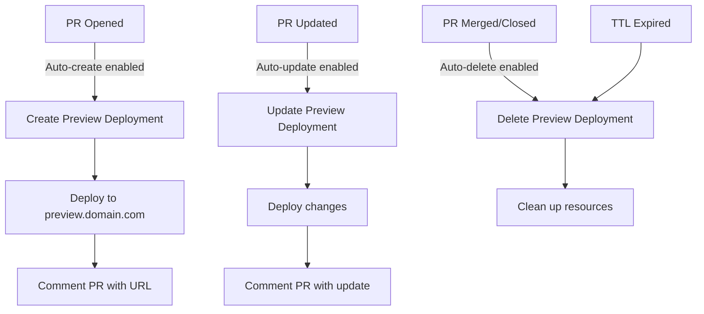

# GitHub Provider - Comprehensive Implementation Guide

**Last Updated:** 6 October 2025  
**Status:** Implementation Phase - Active Development

## Overview

The GitHub Provider enables automatic deployments triggered by GitHub events (push, pull requests, tags, releases) with advanced configuration options including path-based caching, deployment strategies, and environment-specific rules.

## Architecture Overview

```
┌─────────────────────────────────────────────────────────────────┐
│                     GITHUB PROVIDER SYSTEM                      │
├─────────────────────────────────────────────────────────────────┤
│                                                                 │
│  ┌──────────────────────────────────────────────────────────┐  │
│  │              GITHUB APP REGISTRATION                     │  │
│  │                                                          │  │
│  │  • Multiple GitHub Apps Support                         │  │
│  │  • Organization/User Installation                       │  │
│  │  • Repository Access Control                            │  │
│  │  • Webhook Secret Management                            │  │
│  │  • OAuth Token Storage (Encrypted)                      │  │
│  └──────────────────────────────────────────────────────────┘  │
│                            ↓                                    │
│  ┌──────────────────────────────────────────────────────────┐  │
│  │              REPOSITORY CONFIGURATION                    │  │
│  │                                                          │  │
│  │  • Repository Selection per Service                     │  │
│  │  • Base Path Configuration (monorepo support)           │  │
│  │  • Branch Tracking                                       │  │
│  │  • Path-based Change Detection                          │  │
│  │  • Cache Strategy (skip unchanged paths)                │  │
│  └──────────────────────────────────────────────────────────┘  │
│                            ↓                                    │
│  ┌──────────────────────────────────────────────────────────┐  │
│  │              DEPLOYMENT RULES ENGINE                     │  │
│  │                                                          │  │
│  │  • Trigger Conditions (push, PR, tag, release)          │  │
│  │  • Branch/Tag Pattern Matching                          │  │
│  │  • Environment Mapping                                   │  │
│  │  • Path-based Deployment Control                        │  │
│  │  • Custom Deployment Strategies                         │  │
│  │  • Preview Deployment Configuration                     │  │
│  └──────────────────────────────────────────────────────────┘  │
│                            ↓                                    │
│  ┌──────────────────────────────────────────────────────────┐  │
│  │              WEBHOOK EVENT PROCESSING                    │  │
│  │                                                          │  │
│  │  • Event Reception & Validation                         │  │
│  │  • Signature Verification (HMAC SHA256)                 │  │
│  │  • Path Change Detection                                │  │
│  │  • Rule Matching & Evaluation                           │  │
│  │  • Deployment Triggering                                │  │
│  └──────────────────────────────────────────────────────────┘  │
└─────────────────────────────────────────────────────────────────┘
```

## Core Features

### 1. Multi-GitHub App Support

**Purpose**: Support multiple GitHub Apps for different organizations, teams, or use cases.

**Use Cases**:
- Different GitHub Apps for different organizations
- Separate apps for production vs staging
- Team-specific GitHub Apps with different permissions

**Implementation**:
```typescript
interface GitHubApp {
  id: string;
  name: string;
  appId: string;
  clientId: string;
  clientSecret: string; // Encrypted
  privateKey: string;   // Encrypted
  webhookSecret: string; // Encrypted
  installationId: string;
  accountLogin: string; // Organization or user
  accountType: 'Organization' | 'User';
  permissions: GitHubAppPermissions;
  createdAt: Date;
  updatedAt: Date;
}
```

### 2. Repository Configuration

**Purpose**: Configure how a GitHub repository integrates with a service.

**Key Features**:

#### 2.1 Base Path Configuration (Monorepo Support)
```typescript
interface RepositoryConfig {
  serviceId: string;
  githubAppId: string;
  repositoryFullName: string; // e.g., "owner/repo"
  
  // Monorepo support
  basePath: string; // e.g., "apps/frontend" or "" for root
  watchPaths: string[]; // Additional paths to watch, e.g., ["packages/shared"]
  ignorePaths: string[]; // Paths to ignore, e.g., ["*.md", "docs/"]
  
  // Branch configuration
  defaultBranch: string; // e.g., "main"
  productionBranch: string; // e.g., "main" or "production"
  stagingBranch: string; // e.g., "develop" or "staging"
  
  // Cache configuration
  enablePathCache: boolean; // Skip deployment if paths unchanged
  cacheStrategy: 'strict' | 'loose'; // strict = exact match, loose = any file
}
```

**Example Configurations**:

```typescript
// Example 1: Monorepo - Deploy only frontend when frontend changes
{
  basePath: "apps/frontend",
  watchPaths: ["packages/ui", "packages/shared"],
  ignorePaths: ["**/*.test.ts", "**/*.spec.ts"],
  enablePathCache: true,
  cacheStrategy: "strict"
}

// Example 2: Full repository deployment
{
  basePath: "",
  watchPaths: [],
  ignorePaths: ["docs/", "*.md"],
  enablePathCache: true,
  cacheStrategy: "loose"
}

// Example 3: Microservice in monorepo
{
  basePath: "services/auth-api",
  watchPaths: ["libs/shared-types"],
  ignorePaths: [],
  enablePathCache: true,
  cacheStrategy: "strict"
}
```

### 3. Deployment Rules

**Purpose**: Define when and how deployments should be triggered based on GitHub events.

#### 3.1 Rule Structure

```typescript
interface DeploymentRule {
  id: string;
  serviceId: string;
  name: string;
  priority: number; // Higher priority rules evaluated first
  enabled: boolean;
  
  // Trigger configuration
  trigger: {
    type: 'push' | 'pull_request' | 'tag' | 'release' | 'manual';
    
    // Branch/Tag matching
    branchPattern?: string; // Glob pattern, e.g., "main", "feature/*", "release/**"
    excludeBranchPattern?: string; // Exclude pattern
    tagPattern?: string; // Tag pattern, e.g., "v*", "release-*"
    
    // PR-specific
    prLabels?: string[]; // Deploy only if PR has these labels
    prTargetBranches?: string[]; // Deploy only if PR targets these branches
    requireApproval?: boolean; // Require PR approval before deploy
    minApprovals?: number; // Minimum number of approvals
    
    // Path-based conditions
    requiredPaths?: string[]; // Deploy only if these paths changed
    excludePaths?: string[]; // Don't deploy if only these paths changed
    
    // Custom conditions
    customCondition?: string; // JavaScript expression evaluated at runtime
  };
  
  // Deployment configuration
  deployment: {
    environment: 'production' | 'staging' | 'preview' | 'development';
    strategy: DeploymentStrategy;
    
    // Environment variables override
    envOverrides?: Record<string, string>;
    
    // Build configuration override
    buildConfig?: {
      dockerfile?: string;
      buildArgs?: Record<string, string>;
      target?: string;
    };
    
    // Auto-actions
    autoMergeOnSuccess?: boolean; // Auto-merge PR on successful deployment
    autoDeleteOnMerge?: boolean; // Auto-delete preview on PR merge
    notifyOnSuccess?: boolean;
    notifyOnFailure?: boolean;
  };
  
  // Cache configuration override
  cacheOverride?: {
    enabled: boolean;
    ignoreCache?: boolean; // Force deployment even if no changes
  };
}
```

#### 3.2 Deployment Strategies

```typescript
type DeploymentStrategy = 
  | { type: 'standard' } // Simple deployment
  | { type: 'blue-green'; healthCheckUrl: string; healthCheckTimeout: number }
  | { type: 'canary'; percentage: number; duration: number }
  | { type: 'rolling'; batchSize: number; delayBetweenBatches: number }
  | { type: 'custom'; script: string }; // Custom deployment script
```

**Strategy Details**:

1. **Standard**: Simple deployment, replaces current deployment
2. **Blue-Green**: Deploy to new instance, switch traffic after health check
3. **Canary**: Gradually shift traffic percentage to new deployment
4. **Rolling**: Update in batches with configurable delay
5. **Custom**: Execute custom deployment script for advanced scenarios

### 4. Path-based Change Detection & Caching

**Purpose**: Optimize deployments by only deploying when relevant files change.

#### 4.1 Change Detection Algorithm

```typescript
interface ChangeDetection {
  /**
   * Detect if deployment should run based on changed files
   */
  shouldDeploy(params: {
    changedFiles: string[];
    basePath: string;
    watchPaths: string[];
    ignorePaths: string[];
    requiredPaths?: string[];
    excludePaths?: string[];
    cacheStrategy: 'strict' | 'loose';
  }): boolean;
}
```

**Algorithm**:

1. **Filter changed files** by base path and watch paths
2. **Apply ignore patterns** (e.g., `*.md`, `docs/`)
3. **Check required paths** - if specified, at least one required path must change
4. **Check exclude paths** - if only excluded paths changed, skip deployment
5. **Apply cache strategy**:
   - `strict`: Deploy only if files in exact paths changed
   - `loose`: Deploy if any file in the repository changed

**Example Scenarios**:

```typescript
// Scenario 1: Monorepo frontend - only README changed
changedFiles: ["apps/frontend/README.md"]
basePath: "apps/frontend"
ignorePaths: ["**/*.md"]
result: SKIP (only ignored files changed)

// Scenario 2: Monorepo frontend - component changed
changedFiles: ["apps/frontend/src/App.tsx"]
basePath: "apps/frontend"
result: DEPLOY (source file in base path changed)

// Scenario 3: Monorepo with shared package
changedFiles: ["packages/ui/Button.tsx"]
basePath: "apps/frontend"
watchPaths: ["packages/ui"]
result: DEPLOY (watched path changed)

// Scenario 4: Required paths not changed
changedFiles: ["src/utils.ts"]
requiredPaths: ["src/components/**"]
result: SKIP (required paths not changed)
```

#### 4.2 Cache Storage

```typescript
interface DeploymentCache {
  serviceId: string;
  branch: string;
  lastCommitSha: string;
  lastDeployedAt: Date;
  changedPaths: string[]; // Paths that triggered last deployment
  cacheMetadata: {
    filesHash: string; // Hash of deployed files
    basePath: string;
    watchPaths: string[];
  };
}
```

### 5. Preview Deployments

**Purpose**: Automatic preview deployments for pull requests and feature branches.

#### 5.1 Preview Configuration

```typescript
interface PreviewDeploymentConfig {
  enabled: boolean;
  
  // Preview naming
  namingPattern: string; // e.g., "pr-{number}", "{branch}-preview"
  
  // URL configuration
  urlPattern: string; // e.g., "{name}.preview.domain.com"
  
  // Lifecycle
  autoCreate: boolean; // Auto-create on PR open
  autoUpdate: boolean; // Auto-update on PR sync
  autoDelete: boolean; // Auto-delete on PR close/merge
  ttl?: number; // Time to live in hours (auto-delete after)
  
  // Resource limits (lower than production)
  resourceLimits: {
    cpu: string; // e.g., "0.5"
    memory: string; // e.g., "512M"
  };
  
  // Environment variables
  envTemplate: Record<string, string>; // Preview-specific env vars
}
```

#### 5.2 Preview Lifecycle



### 6. Advanced Rule Examples

#### 6.1 Production Deployment on Tag

```typescript
{
  name: "Production deployment on version tag",
  priority: 100,
  trigger: {
    type: "tag",
    tagPattern: "v*.*.*", // Match v1.0.0, v2.1.3, etc.
  },
  deployment: {
    environment: "production",
    strategy: { type: "blue-green", healthCheckUrl: "/health", healthCheckTimeout: 30 },
    notifyOnSuccess: true,
    notifyOnFailure: true
  }
}
```

#### 6.2 Staging Deployment on Develop Push

```typescript
{
  name: "Staging deployment on develop branch",
  priority: 90,
  trigger: {
    type: "push",
    branchPattern: "develop",
    excludePaths: ["docs/**", "*.md"]
  },
  deployment: {
    environment: "staging",
    strategy: { type: "standard" },
    envOverrides: {
      NODE_ENV: "staging",
      DEBUG: "true"
    }
  }
}
```

#### 6.3 Preview Deployment on PR (with approval)

```typescript
{
  name: "Preview deployment for approved PRs",
  priority: 50,
  trigger: {
    type: "pull_request",
    prTargetBranches: ["main", "develop"],
    requireApproval: true,
    minApprovals: 1
  },
  deployment: {
    environment: "preview",
    strategy: { type: "standard" },
    autoDeleteOnMerge: true
  },
  cacheOverride: {
    enabled: false, // Always deploy previews, ignore cache
    ignoreCache: true
  }
}
```

#### 6.4 Monorepo Microservice Deployment

```typescript
{
  name: "Auth service deployment on service changes",
  priority: 80,
  trigger: {
    type: "push",
    branchPattern: "main",
    requiredPaths: [
      "services/auth/**",
      "libs/shared-types/**"
    ]
  },
  deployment: {
    environment: "production",
    strategy: { type: "rolling", batchSize: 2, delayBetweenBatches: 30 },
    buildConfig: {
      dockerfile: "services/auth/Dockerfile",
      buildArgs: { "NODE_ENV": "production" }
    }
  }
}
```

#### 6.5 Custom Condition Deployment

```typescript
{
  name: "Deploy if package.json version changed",
  priority: 70,
  trigger: {
    type: "push",
    branchPattern: "main",
    customCondition: `
      const changedFiles = context.changedFiles;
      const packageJson = changedFiles.find(f => f.endsWith('package.json'));
      if (!packageJson) return false;
      
      const oldVersion = context.previousCommit.packageVersion;
      const newVersion = context.currentCommit.packageVersion;
      
      return oldVersion !== newVersion;
    `
  },
  deployment: {
    environment: "production",
    strategy: { type: "blue-green", healthCheckUrl: "/health", healthCheckTimeout: 60 }
  }
}
```

## Implementation Architecture

### Database Schema

```sql
-- GitHub Apps Table
CREATE TABLE github_apps (
  id UUID PRIMARY KEY,
  name VARCHAR(255) NOT NULL,
  app_id VARCHAR(50) NOT NULL,
  client_id VARCHAR(255) NOT NULL,
  client_secret TEXT NOT NULL, -- Encrypted
  private_key TEXT NOT NULL, -- Encrypted
  webhook_secret TEXT NOT NULL, -- Encrypted
  installation_id VARCHAR(50),
  account_login VARCHAR(255) NOT NULL,
  account_type VARCHAR(20) NOT NULL,
  permissions JSONB,
  created_at TIMESTAMP DEFAULT NOW(),
  updated_at TIMESTAMP DEFAULT NOW()
);

-- Repository Configuration Table
CREATE TABLE github_repository_configs (
  id UUID PRIMARY KEY,
  service_id UUID NOT NULL REFERENCES services(id) ON DELETE CASCADE,
  github_app_id UUID NOT NULL REFERENCES github_apps(id) ON DELETE CASCADE,
  repository_full_name VARCHAR(255) NOT NULL,
  base_path VARCHAR(500) DEFAULT '',
  watch_paths JSONB DEFAULT '[]',
  ignore_paths JSONB DEFAULT '[]',
  default_branch VARCHAR(100) DEFAULT 'main',
  production_branch VARCHAR(100),
  staging_branch VARCHAR(100),
  enable_path_cache BOOLEAN DEFAULT true,
  cache_strategy VARCHAR(20) DEFAULT 'strict',
  created_at TIMESTAMP DEFAULT NOW(),
  updated_at TIMESTAMP DEFAULT NOW(),
  UNIQUE(service_id, repository_full_name)
);

-- Deployment Rules Table (Enhanced)
CREATE TABLE deployment_rules (
  id UUID PRIMARY KEY,
  service_id UUID NOT NULL REFERENCES services(id) ON DELETE CASCADE,
  name VARCHAR(255) NOT NULL,
  priority INTEGER DEFAULT 0,
  enabled BOOLEAN DEFAULT true,
  
  -- Trigger configuration
  trigger_type VARCHAR(50) NOT NULL,
  branch_pattern VARCHAR(255),
  exclude_branch_pattern VARCHAR(255),
  tag_pattern VARCHAR(255),
  pr_labels JSONB,
  pr_target_branches JSONB,
  require_approval BOOLEAN DEFAULT false,
  min_approvals INTEGER DEFAULT 1,
  required_paths JSONB,
  exclude_paths JSONB,
  custom_condition TEXT,
  
  -- Deployment configuration
  environment VARCHAR(50) NOT NULL,
  deployment_strategy JSONB NOT NULL,
  env_overrides JSONB,
  build_config JSONB,
  auto_merge_on_success BOOLEAN DEFAULT false,
  auto_delete_on_merge BOOLEAN DEFAULT true,
  notify_on_success BOOLEAN DEFAULT true,
  notify_on_failure BOOLEAN DEFAULT true,
  
  -- Cache override
  cache_enabled BOOLEAN,
  ignore_cache BOOLEAN DEFAULT false,
  
  created_at TIMESTAMP DEFAULT NOW(),
  updated_at TIMESTAMP DEFAULT NOW()
);

-- Deployment Cache Table
CREATE TABLE deployment_cache (
  id UUID PRIMARY KEY,
  service_id UUID NOT NULL REFERENCES services(id) ON DELETE CASCADE,
  branch VARCHAR(255) NOT NULL,
  last_commit_sha VARCHAR(40) NOT NULL,
  last_deployed_at TIMESTAMP NOT NULL,
  changed_paths JSONB,
  cache_metadata JSONB,
  created_at TIMESTAMP DEFAULT NOW(),
  updated_at TIMESTAMP DEFAULT NOW(),
  UNIQUE(service_id, branch)
);

-- Preview Deployments Config Table
CREATE TABLE preview_deployment_configs (
  id UUID PRIMARY KEY,
  service_id UUID NOT NULL REFERENCES services(id) ON DELETE CASCADE,
  enabled BOOLEAN DEFAULT true,
  naming_pattern VARCHAR(255) DEFAULT 'pr-{number}',
  url_pattern VARCHAR(255) DEFAULT '{name}.preview.domain.com',
  auto_create BOOLEAN DEFAULT true,
  auto_update BOOLEAN DEFAULT true,
  auto_delete BOOLEAN DEFAULT true,
  ttl_hours INTEGER,
  resource_limits JSONB,
  env_template JSONB,
  created_at TIMESTAMP DEFAULT NOW(),
  updated_at TIMESTAMP DEFAULT NOW(),
  UNIQUE(service_id)
);

-- Webhook Events Log (for debugging)
CREATE TABLE github_webhook_events (
  id UUID PRIMARY KEY,
  github_app_id UUID REFERENCES github_apps(id) ON DELETE SET NULL,
  event_type VARCHAR(50) NOT NULL,
  delivery_id VARCHAR(255) NOT NULL,
  payload JSONB NOT NULL,
  signature VARCHAR(255) NOT NULL,
  processed BOOLEAN DEFAULT false,
  matched_rules JSONB,
  triggered_deployments JSONB,
  processing_error TEXT,
  created_at TIMESTAMP DEFAULT NOW(),
  INDEX(github_app_id, event_type, created_at)
);
```

### Service Architecture

```
apps/api/src/modules/github-provider/
├── controllers/
│   ├── github-app.controller.ts          # GitHub App CRUD
│   ├── github-webhook.controller.ts      # Webhook receiver
│   ├── github-oauth.controller.ts        # OAuth flow
│   └── deployment-rules.controller.ts    # Rules management
├── services/
│   ├── github-app.service.ts             # App management
│   ├── github-webhook.service.ts         # Webhook processing
│   ├── github-oauth.service.ts           # OAuth handling
│   ├── repository-config.service.ts      # Repo configuration
│   ├── deployment-rules.service.ts       # Rules engine
│   ├── change-detection.service.ts       # Path-based detection
│   ├── deployment-cache.service.ts       # Cache management
│   ├── preview-deployment.service.ts     # Preview lifecycle
│   └── deployment-strategy.service.ts    # Strategy executor
├── interfaces/
│   ├── github-app.types.ts
│   ├── deployment-rule.types.ts
│   ├── webhook-event.types.ts
│   └── deployment-strategy.types.ts
└── github-provider.module.ts
```

## Security Considerations

1. **Webhook Signature Verification**: Always verify GitHub webhook signatures using HMAC SHA256
2. **Encrypted Secrets**: Store all GitHub App credentials encrypted in database
3. **Access Control**: Validate repository access permissions before deployment
4. **Rate Limiting**: Implement rate limiting on webhook endpoints
5. **Audit Logging**: Log all webhook events and deployment triggers

## Next Steps

1. ✅ Database schema migration
2. ✅ Basic services and controllers structure
3. 🔄 Webhook handler with signature verification
4. 🔄 OAuth flow implementation
5. ⏳ Change detection service
6. ⏳ Deployment cache service
7. ⏳ Preview deployment lifecycle
8. ⏳ Frontend UI for configuration
9. ⏳ Comprehensive testing

---

**Related Documentation**:
- [GitHub Provider Roadmap](./GITHUB-PROVIDER-ROADMAP.md)
- [GitHub Provider Implementation](./GITHUB-PROVIDER-IMPLEMENTATION.md)
- [Deployment Rules API Contract](../../../packages/api-contracts/modules/deployment-rules.ts)
