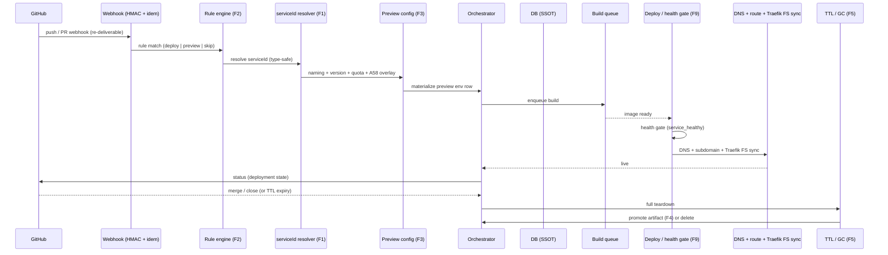
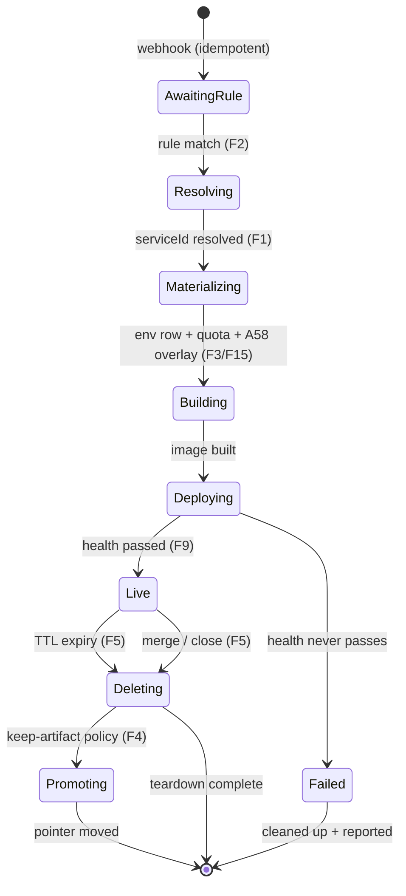

# Preview Deployment Lifecycle

> **Date:** 2026-08-06
> **Status:** Proposed — end-to-end lifecycle trace (SC8), no implementation
> **Scope:** 16-step current trace with file:line, 12-step target (minimal wiring + manifest-driven), mermaid sequence + state diagrams, edge cases, feature hooks
> **Branch:** n/a (docs only)

## Current state — 16-step trace

| # | Step | Status | Evidence (file:line) |
|---|---|---|---|
| 1 | HMAC verification | ✅ | webhook world |
| 2 | Idempotency | ✅ | webhook world |
| 3 | Dispatch | ✅ | webhook world |
| 4 | Rule match (deploy/preview/skip) | ❌ MISSING | `github_deployment_rules` zero consumers |
| 5 | `serviceId` resolution | ❌ **BROKEN** | cast at `github-webhook.controller.ts:163` |
| 6 | Preview naming | ⚠️ PARTIAL | hardcoded `pr`; `PreviewNamingService` (pr/branch/branch_hash) exists |
| 7 | Version selection | ⚠️ PARTIAL | no digest resolution |
| 8 | Env creation | ⚠️ PARTIAL | `recordPreviewRow` links **OLDEST deployment**; quota field zero-consumers |
| 9 | DNS | ⚠️ PARTIAL | fail-open |
| 10 | Route | ⚠️ PARTIAL | DB-only (`addPreviewRoute`), **never syncs Traefik FS** |
| 11 | Build | ❌ MISSING | no enqueue |
| 12 | Deploy / health | ⚠️ PARTIAL | manual-only; `fleet-readiness-gate` unwired |
| 13 | TTL | ⚠️ PARTIAL | row-only, hardcoded 168h |
| 14 | Merge / close handling | ⚠️ PARTIAL | hardcoded |
| 15 | Promotion | ✅ routing-only | `promotePreviewToStable` = routing-only (`domain-routing.service.ts:396`) |
| 16 | Read API | ✅ | zero web consumers |

**Coverage today: ≈ 35–40% of the target lifecycle.** Fully green: ingress auth, idempotency, dispatch, routing promotion, read API. The rest is partial or missing.

## Target — 12-step single orchestrator (minimal wiring + manifest-driven)

| # | Step | Feature | Mechanism |
|---|---|---|---|
| 1 | Rule match | **F2** | `github_deployment_rules` generated from manifest |
| 2 | `serviceId` resolve | **F1** | fix cast; type-safe resolution |
| 3 | Naming + version | **F3** | config from DB; `PreviewNamingService`; digest pin |
| 4 | Env materialization | F3/F15 | DB row from rendered overlay; quota + A58 `sharedDependencies` (F15) |
| 5 | Build enqueue | F2 | build trigger rules |
| 6 | Deploy, health-gated | **F9** | wire `fleet-readiness-gate` (`service_healthy`) |
| 7 | DNS + route + FS sync | — | Traefik FS sync (closes C4) |
| 8 | Live | — | status reported to GitHub |
| 9 | TTL full cleanup | **F5** | TTL + auto-delete + full teardown |
| 10 | Merge/close auto-delete | F5 | hardcoded path replaced |
| 11 | Promote artifact | **F4** | pointer-move promotion without rebuild |
| 12 | Rollback-ready state | F4 | re-point |

## Edge cases

| Edge case | Handling |
|---|---|
| PR reopened | state machine resumes from `Resolving`/`Building`; idempotent re-entry |
| Force-push | rebuild on new head; digest re-resolve |
| Branch deleted without close | TTL (F5) as backstop |
| Merge without close event | reconcile webhook state (A67); merge detection |
| Quota exceeded (`maxConcurrent`) | queue or reject with explicit status |
| Unshareable dependency | F15 (A58) shared-deps resolution falls back to per-preview dep |
| DNS fail-open | current behavior kept; route/FS sync retried by reconciler |
| Promotion conflict | append-only deployments; conflict detected at pointer-move |
| TTL race (build vs expiry) | TTL checked at every state transition |
| Health never passes | `Deploying → Failed`; auto-delete + status to GitHub |
| Webhook re-delivery | HMAC + idempotency (already ✅) |

## Feature hooks

F1 → step 2 · F2 → steps 1, 5 · F3 → steps 3–4 · F4 → steps 11–12 · F5 → steps 9–10 · F9 → step 6 · **F15 → step 4 (A58 shared deps)**. Full specs in `deployment-architecture-features.md`.

## Open questions

- Should "promote on merge" be the default or opt-in (A76 approvals)?
- Traefik FS sync: watch-based vs push — reuses existing `traefik_*` tables?
- Where does the orchestrator live: webhook handler vs a dedicated service (no new machinery rule)?
