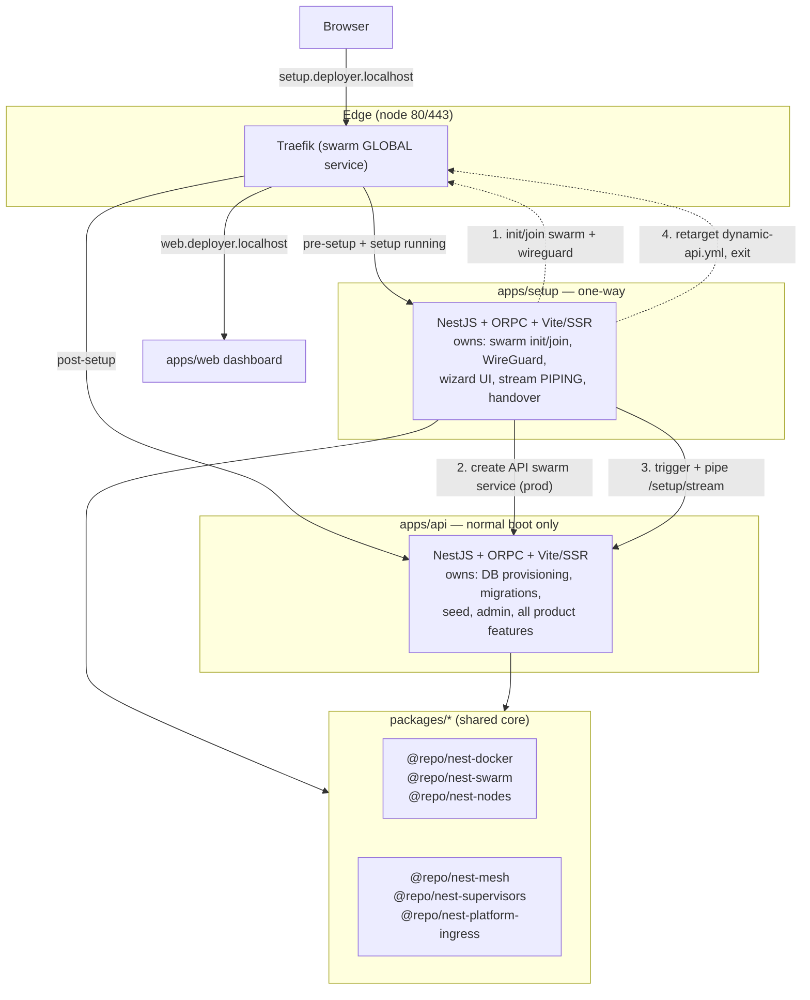
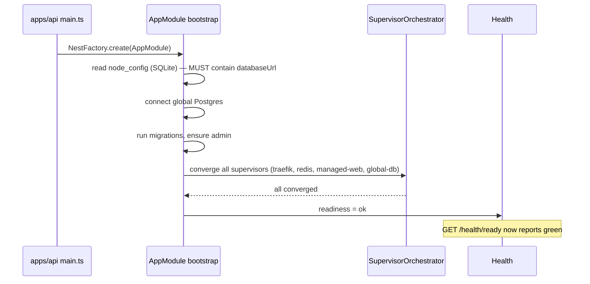
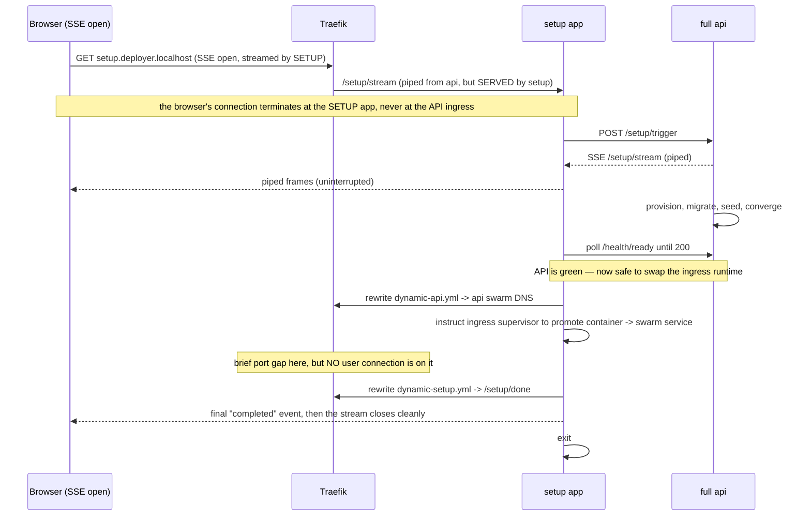
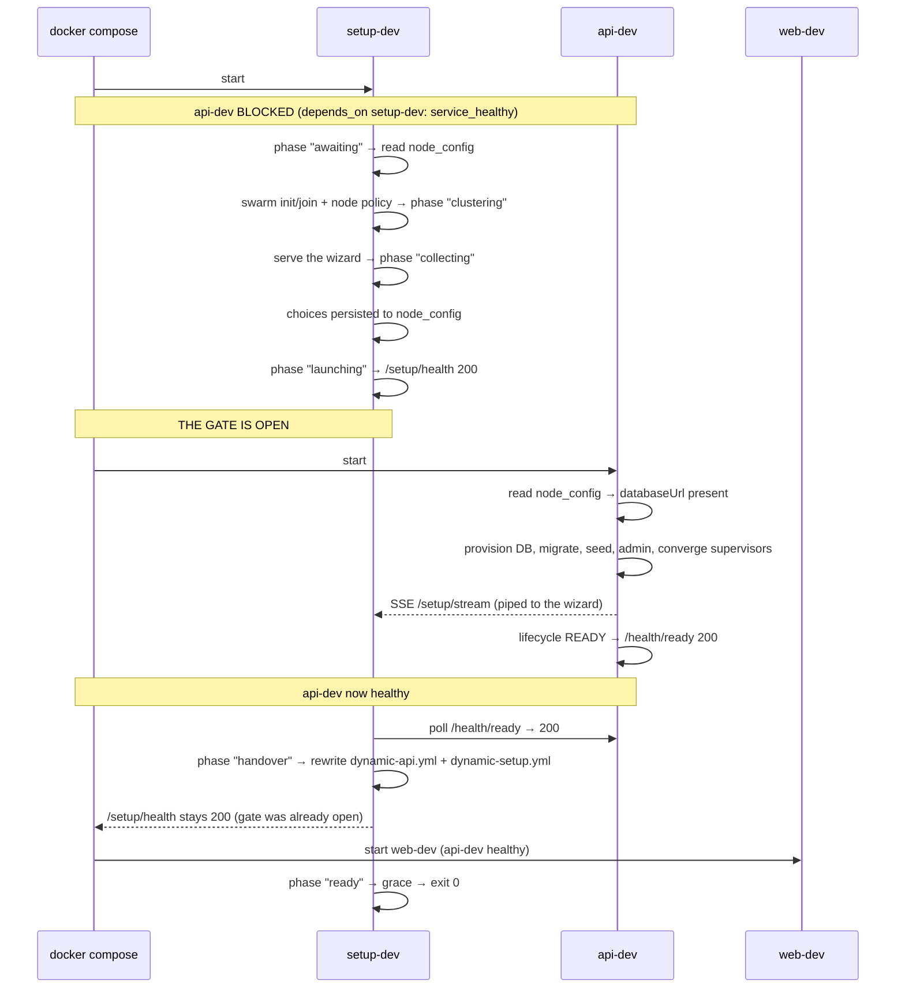
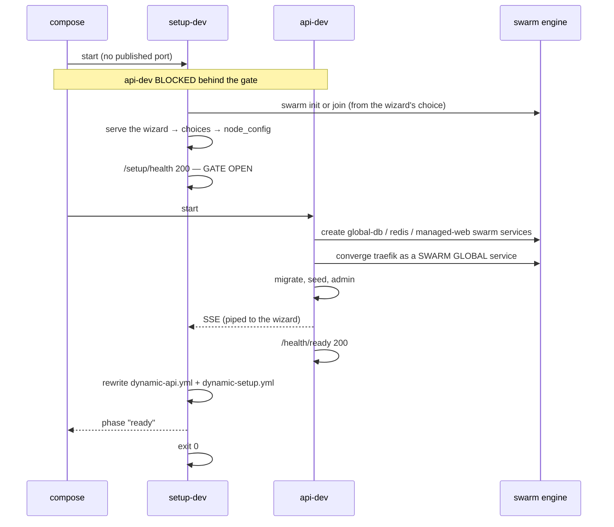
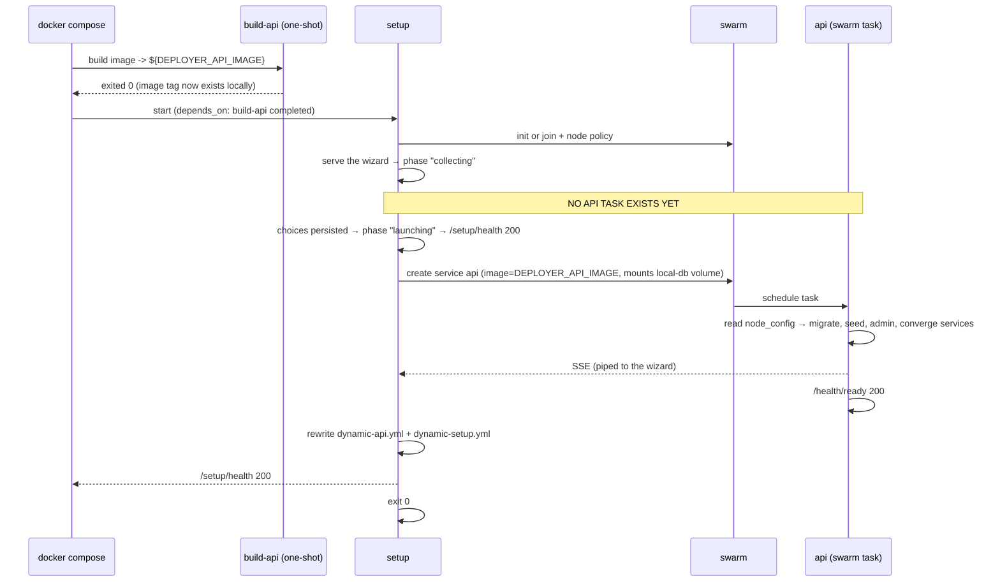

# Setup App Refactor — Plan

Status: **proposed** (no code changed yet)
Owner: platform
Scope: `apps/*`, `packages/*`, `docker/*`

---

## 1. Goal

Split the platform into **two apps with one clear handover**:

1. **`apps/setup`** — a minimal, one-way app whose only job is to *get the platform onto a
   cluster*. It runs the setup wizard, initialises or joins the swarm, configures WireGuard,
   asks the full API to provision the database, and then **hands the entry port over and exits**.
2. **`apps/api`** — the full platform. It no longer knows anything about being "pre-setup".

The handover replaces the current arrangement, where one process boots in a degraded
"maybe-setup" mode and orchestrates sub-apps to work around the fact that it cannot serve
traffic before setup finishes.

### The three outcomes this buys

| Today | After |
|---|---|
| `OrchestrationModule` boots the API in a special pre-setup mode, runs a sub-app pipeline (setup-wizard :3010, mesh-init :3011, main-app :3012), and swaps the gateway fallback at runtime | API boots **one normal way**. The sub-app pipeline is deleted. |
| Every feature module must tolerate "no global DB yet" (guards, deferred supervisors, `pending` states, lazy pools) | The API only ever starts **after** setup, so those caveats move to the setup app. |
| Compose starts the API and it decides at runtime whether to be a wizard or a server | Compose starts **setup**, and setup decides when the API becomes a service. |

### Two facts that shape everything below

- **Traefik has two incarnations** — a plain container pre-swarm, then a swarm GLOBAL
  service. The entry port is exclusively bound, so the swap has an unavoidable gap; the
  design makes that gap *irrelevant* rather than trying to make it impossible (§9.3).
- **Health is NestJS Terminus** in both apps — one endpoint aggregating multiple internal
  services, returning real 200/503 codes, which is what makes the compose gates trivial (§8).

### Non-goals

- Not changing the user-facing wizard (same steps, same shared `@repo/ui` components).
- Not changing the setup *contract* semantics (`/setup/*` keeps its shape for the client).
- Not touching the build pipeline (`turbo prune` + the existing Dockerfiles) beyond the tags needed.

---

## 2. Current state (measured)

Facts this plan is built on, gathered from the working tree:

### Apps

```
apps/api    — name: "api"        the full platform + sub-app orchestration + SSR views
apps/web    — name: "web"        Next.js dashboard
apps/doc    — name: "doc"        Fumadocs
```

`apps/api/src/`:

```
core/        357 files, ~66.9k LOC   shared infrastructure (docker, swarm, mesh, traefik, supervisors, ...)
sub-apps/    mesh-initializer/ + setup-wizard/     the pipeline that must go
views/       SSR React app (Vite, @nestjs-ssr/react) — includes the setup wizard UI
modules/     product features (health, platform, cluster, ...)
system/      control plane
cli/         CLI entry
main.ts      gateway Express + OrchestrationModule
```

`apps/api/src/sub-apps/setup-wizard/` (12 files) is the "weird sub app":

```
setup-page.controller.ts    GET /setup  (SSR wizard page)
setup-wizard.controller.ts  ORPC /setup/* implementations
setup-wizard.sub-app.module.ts   root of the sub-app (RenderModule + SetupModule)
setup-wizard.app.module.ts       root for the app context
setup-wizard.api.module.ts       mounted on the main Express server too
setup-wizard.orpc.module.ts      ORPC context factory
setup-wizard-init.module.ts      providers (InitializationService et al)
setup-wizard.service.ts          bridge that fires when setup completes
setup-wizard.bridge.ts           typed event bridge
```

`apps/api/src/core` module sizes (from the prior audit, rounded):

| Module | ~LOC | Needed before the API starts? |
|---|---|---|
| `mesh` | 15,000 | **yes** (join a remote swarm, WireGuard) |
| `traefik` | 12,500 | partly (config generation) |
| `auth` | 6,300 | **yes** (local strategy creates the admin) |
| `supervisors` | 5,700 | **yes** (traefik/redis/wireguard as swarm tasks) |
| `docker` | 5,000 | **yes** (swarm init/join, service creation) |
| `swarm` | 2,600 | **yes** |
| `setup` | 1,900 | **yes** |
| `reachability`, `platform-ingress`, `node-state`, `database/local` | ~2,100 | **yes** |

### Setup contract (unchanged by this plan)

`packages/contracts/api/modules/setup/index.ts` — prefix `/setup`:

```
GET  /setup/state                     wizard state
GET  /setup/node-status
POST /setup/probe/database
POST /setup/probe/mesh
POST /setup/remote/auth
POST /setup/trigger                   start provisioning
GET  /setup/stream                    SSE progress
GET  /setup/post-setup/hints
POST /setup/post-setup/hints/dismiss
```

### Health

- `GET /health` — Express, unauthenticated, immediate: `{ status: "ok", uptime }`. Used by Docker
  healthchecks.
- `GET /health/detailed` — ORPC, **authenticated**: `{ status, database: { status }, supervisors: [{ supervisorId, healthy, state, ... }] }`.
- `HealthService`: `isHealthy = database.status === "ok" && every(supervisor.healthy)`.

**Gap:** there is no *unauthenticated* readiness endpoint. The setup app has no session, so it
cannot poll `/health/detailed` to decide "the platform is green".

### Compose profiles

| File | API | Managed services | Notes |
|---|---|---|---|
| `docker-compose.dev.yml` | `api-dev`, publishes drizzle-studio port | compose owns redis/traefik/db | `MANAGED_*=true` |
| `docker-compose.dev-supervised.yml` | `api-dev`, **no published ports** | API supervises everything | `MANAGED_*=false`, `SETUP_AUTO=true` |
| `docker-compose.prod.yml` | `api-prod`, publishes `API_PORT` | API supervises everything | single container, `entrypoint.prod.ts` |
| `docker-stack.deploy.yml` | `api` replicas 3 | swarm services | **stale** — still has `--providers.docker.swarmMode=true`, removed as broken in Traefik v3 |

### Image & build

- API dev image is tagged `nextjs-nestjs-api-dev:latest` (`common/api/docker-compose.config.dev.yml`).
- Prod image comes from `docker/builder/api/Dockerfile.api.prod`, `CMD ["bun","--bun","--cwd=apps/api","run","prod"]`
  → `apps/api/scripts/entrypoint.prod.ts`, which spawns `start:prod` and then builds+starts the web app.
- **In-container builds are not possible in dev**: the build context is not mounted
  (`build context "docker/scanner-runner/" not found from cwd "/app/apps/api"` in the logs).
  So the setup app must **reference an existing image**, never build one.

### Why the current API is "weird"

`OrchestrationModule` + `sub-app-runner` exist because the API may be launched before setup.
That produces, across the codebase:

- a gateway that swaps its fallback target at runtime,
- supervisors with `pending` states and convergence gates,
- DB-touching modules with guards and deferred pools,
- `SETUP_AUTO` branching in the orchestrator,
- an SSR surface served from a sub-app that is later unregistered.

All of it exists to serve a phase that, after this refactor, belongs to a different app.

---

## 3. Target architecture



### The key sequencing rule

> **The setup app is the only process that exists until the gate opens. The API is a
> converged-platform process: it is started BY the platform being ready, never before.**

This is stronger than an ordering preference — it is what makes the two apps clean:

- **Dev:** compose starts `setup` only. `api-dev` has
  `depends_on: setup-dev: condition: service_healthy`, so compose itself enforces the gate. Then
  `web-dev` gates on `api-dev: service_healthy`. One direction, no cycle.
- **Prod:** compose starts `setup` only, and the API is **not a compose service at all** — setup
  schedules it as a swarm task when the gate opens. The gate and the scheduling are the same
  decision.
- **The restart case is the same flow.** If `node_config` already says `setup_done`, setup skips the
  wizard, re-verifies the cluster, and opens the gate immediately. One code path.

Consequences worth stating plainly:

| Because the API never starts early… | …this disappears |
|---|---|
| it has no "pre-setup" mode to tolerate | the deleted sub-app pipeline and the gateway fallback swap stay deleted |
| its bootstrap can require a `databaseUrl` | the guards, deferred pools and `pending` supervisor states that existed only for a DB-less boot |
| setup never has to poll the API before it may exist | the "is the API up yet?" branching in setup's cluster phase |
| the wizard is served by setup for its whole life | the ingress-swap-vs-SSE-stream timing analysis (§9.3) — it is now structural |

---

## 4. Responsibility split

The single most important table in this plan. "Where does this run?"

| Concern | Setup app | Full API | Shared package |
|---|---|---|---|
| Wizard UI (React, SSR, Vite) | **yes** | — | `@repo/ui` (components) |
| Wizard session state | **yes** | — | — |
| Stream SSE to the client | **yes** (pipes) | produces | — |
| Swarm `init` / `join` | **yes** | — | `@repo/nest-swarm` |
| WireGuard overlay | **yes** | — | `@repo/nest-mesh` |
| Create the API swarm service | **yes** (prod) | — | `@repo/nest-docker` |
| Traefik config generation | **yes** (bootstrap subset) | yes (full) | `@repo/nest-platform-ingress` |
| Retarget `dynamic-api.yml` (handover) | **yes** | — | `@repo/nest-platform-ingress` |
| Global Postgres provisioning | — | **yes** | `@repo/nest-docker` |
| Migrations / seed / admin user | — | **yes** | — |
| Mesh registration | — | **yes** | `@repo/nest-mesh` |
| Supervised services (traefik, redis, managed-web) | bootstraps per-node ingress + redis | converges the full set | `@repo/nest-supervisors` |
| Readiness reporting | consumes | **produces** | — |

**Rationale for the split.** Swarm bootstrap and WireGuard *must* run before the API can be
scheduled on the cluster — that is the whole point. Database provisioning, migrations, seeding and
admin creation *must* run inside the API, because they need the full Drizzle schema, the auth
stack, and the entity contracts; duplicating that in a "minimal" app would be a second
implementation of the same thing (exactly what the repo forbids). So the setup app **orchestrates**
and the API **executes**.

The user-visible consequence: the stream is *produced* by the API and *piped* by the setup app.

---

## 5. Package extraction

### 5.1 Rules

- Follow the existing convention: framework-ish NestJS packages → `packages/nest/<name>`,
  utilities → `packages/utils/<name>`, contracts → `packages/contracts/<name>`.
- Use `packages/nest/events/package.json` as the template (single `"."` export pointing at
  `./src/index.ts`, `catalog:` deps, the standard script set).
- Extract **only what both apps need**. Everything setup-only moves *into* the setup app.
- `scripts/check-di-graph.ts` already enforces "no cycles / no reverse imports" and must stay green
  after every extraction step.

### 5.2 Target packages (AUDITED — supersedes the original list)

The list below was re-audited against the §8.7 rule ("if exactly one app consumes it, it is
business logic → move it into that app"). Three entries from the original draft were **removed**
and one was **split**, because the audit proved they failed the rule.

| New package | Extracted from | Rough size | Consumers | Verdict |
|---|---|---|---|---|
| `@repo/nest-docker` | `core/modules/docker` | ~5.0k | 7 areas, both apps | **extract** (done) |
| `@repo/nest-swarm` | `core/modules/swarm` | ~2.6k | 6 areas, both apps | **extract** (done) |
| `@repo/nest-nodes` | `core/modules/node-state` | ~0.6k | 7 areas + `cli`, both apps | **extract** (done) |
| `@repo/nest-database-local` | `core/modules/database/local` | ~0.5k | both apps | **extract** (done) |
| `@repo/nest-reachability` | `core/modules/reachability` | ~0.5k | wizard + 3 API modules | **extract** (done) |
| `@repo/nest-supervisor-core` | `core/modules/supervisors` (framework only) | ~2k | both apps | **extract** (done) |
| `@repo/nest-mesh` | `core/modules/mesh` | 18k / 120 files | API: 30 files across 6 areas. Setup: **0** | **REJECTED — see below** |
| `@repo/nest-supervisors` | `core/modules/supervisors` (impls only) | ~4.3k | API: 1 file. Setup: **0** | **REJECTED — see below** |
| `@repo/nest-platform-ingress` | `core/modules/platform-ingress` + traefik builders | ~1.4k | API: 6 files across 4 areas. Setup: **0** | **REJECTED — see below** |

Already shared and unchanged: `@repo/env`, `@repo/errors`, `@repo/logger`, `@repo/types`,
`@repo/orpc-utils`, `@repo/auth`, `@repo/contracts-*`, `@repo/ui`.

#### Why the three rejected entries fail the rule

The original rationale for each was a **factual error**, and the measured consumer counts
contradict it:

1. **`@repo/nest-mesh` — "join a remote swarm + WireGuard; needed by setup".**
   WireGuard is **not** in `mesh`. It lives in
   `core/modules/supervisors/platform/wireguard-supervisor.service.ts` as a supervisor that runs
   the sidecar container. The `mesh` module is the peer-to-peer *data plane* (topology, topics,
   resource discovery, CRDT primitives, query engine) — 120 files of platform business logic.
   Setup's actual needs are the **enrolment handshake only**:
   `MeshInitializationService` (issue grant, consume grant, bootstrap, connect) — 2 files.
   Extracting 18k LOC so two apps can share 2 files is exactly the over-extraction the rule
   forbids. **Instead:** the enrolment slice becomes setup's own explicit service (§5.5).

2. **`@repo/nest-supervisors` — "bootstrap ingress/redis as swarm services".**
   Setup consumes **zero** of it. Its 19 files are the platform's concrete supervisors
   (traefik, redis, global-db, local-db, managed-web, wireguard, direct-port-proxy) — the
   onboarding topology. The *framework* (event bus, base class, orchestrator, registry) was
   already extracted as `@repo/nest-supervisor-core` and is the only genuinely shared part.
   **Instead:** the concrete supervisors stay in `apps/api`.

3. **`@repo/nest-platform-ingress` — "hostname grammar + route config; setup bootstraps ingress".**
   Setup consumes zero of it, and it cannot: every service in it reads the API's global Postgres
   (`PlatformConfigService`, `AppInstanceService`, `PlatformRoutesSourceService`) or imports the
   `traefik` config builders. It is the API's ingress *policy*, not a primitive.
   **Instead:** it stays in `apps/api`; setup's one handover write (`dynamic-api.yml`) is a
   three-line file write, not a package dependency (§9.2).

#### What setup actually needs, and where it comes from

The wizard surfaces (`sub-apps/setup-wizard`, `sub-apps/mesh-initializer`,
`views/setup-adapters`) reference core modules as follows — measured:

| Core module | Refs | Resolution |
|---|---|---|
| `setup` | 5 | The **execution engine stays in the API**. Setup calls it over HTTP; only the *wizard session* moves. |
| `mesh` | 3 | Only `MeshInitializationService` + `MeshVersionService`. → setup's own `MeshEnrolmentService` (§5.5). |
| `node-state` | 2 | → `@repo/nest-nodes` (extracted) |
| `reachability` | 2 | → `@repo/nest-reachability` (extracted) |
| `sub-app-runner`, `triggers` | 4 | **Deleted** — the sub-app pipeline is what this refactor removes (§7.1). |
| `auth` | 1 | Setup is pre-auth. The one ref is the ORPC context factory, which setup reimplements without auth. |

So the complete shared-package inventory setup needs is:
`@repo/nest-docker`, `@repo/nest-swarm`, `@repo/nest-nodes`, `@repo/nest-database-local`,
`@repo/nest-supervisor-core`, `@repo/nest-reachability` — **all already extracted**.

### 5.4 The env pattern — the shape every shared primitive must follow

`@repo/nest-env` is the reference implementation of the §8.7 rule, and every package listed above
follows it. The distinction is between **mechanism** (shared) and **contract** (per-app):

| Concern | Where | Why |
|---|---|---|
| `EnvService<TSchema>` — reads, parses, caches, redacts | **package** (`@repo/nest-env`) | mechanism; identical in every app |
| `EnvModule.forRoot({ schema })` | **package** | mechanism; the app supplies the schema |
| `apiEnvSchema` + `ApiEnvService` | `apps/api` | contract; names THIS app's variables |
| `setupEnvSchema` + `SetupEnvService` | `apps/setup` | contract; names THIS app's variables |

The package never ships a default schema. If it did, `apps/setup` would silently inherit the API's
variables and defaults — the exact leak this pattern prevents.

The same discipline applies to every primitive, and the wrong/right split is always the same:

| Wrong | Right | Package |
|---|---|---|
| Package defaults to the API's `apiEnvSchema` | `forRoot({ schema })`; each app subclasses | `@repo/nest-env` |
| `BaseDatabaseService` constrained to the API's two Drizzle schemas | Generic over `AnyDrizzleDatabase`; subclass narrows `db` | `@repo/nest-database-core` |
| Package reads a hardcoded path / env var for its config | `forRoot({ databasePath, migrationsDir })` | `@repo/nest-database-local` |
| `@Optional() provider?: SomeInterface` | `@Inject(TOKEN)` — an interface erases at runtime | `@repo/nest-swarm` |
| Package exports "this platform's boot sequence" | Rename to the storage-level fact; app keeps the policy | `@repo/nest-events` |

**The test, restated:** a shared primitive that needs app-specific data takes it as a **parameter**
(`forRoot`/`forRootAsync`, a constructor argument, a type parameter) or exposes an **overridable
seam** (a subclass, a codec registry). It never imports the app's schema and never ships a default.

### 5.4.1 The env split, verified in the tree

§5.4 states the rule; this is the evidence that the tree satisfies it. The test is whether
`apps/setup` could be broken by a change to the API's environment — if it can, the schema leaked.

| Check | Result |
|---|---|
| What `@repo/nest-env` imports | `@nestjs/common`, `@nestjs/config`, `zod`, `fs`, `path` — **no app code** |
| Does the package contain a schema? | No. One JSDoc example mentions `apiEnvSchema`; there is no import |
| How the schema gets in | `EnvModule.forRoot({ schema })`; `EnvService<TSchema>` is generic with `use()` for a second schema |
| Where `EnvService` lives | Two subclasses: `apps/api/src/config/env/env.service.ts` (27 LOC) and `apps/setup/src/config/env/env.service.ts` (24 LOC) — same base, different schema |
| `apiEnvSchema` referenced by `apps/setup`? | **0 imports** (one comment contrasts them) |
| `setupEnvSchema` | declares its own **24** variables; imported by 4 setup files only |

Neither app can be broken by the other's environment, which is the property §5.4 asks for.

### 5.4.2 The setup app is event-driven, and nothing polls

`apps/setup` has **zero** `setInterval` occurrences. Every state change is published, and every
consumer subscribes:

| File | RxJS primitives | What it drives |
|---|---|---|
| `modules/health/setup-phase.service.ts` | `BehaviorSubject`, `Observable`, `Subject`, `distinctUntilChanged`, `filter`, `map` | the phase state machine. `BehaviorSubject` for STATE (a late reader gets the current value instead of blocking), a plain `Subject` for EDGES (replaying an edge would re-fire edge-triggered work) |
| `modules/cluster/services/cluster-orchestrator.service.ts` | `Subject`, `concatMap`, `catchError`, `shareReplay`, `tap`, `timer`, `from`, `of` | the cluster pipeline. `concatMap` serialises attempts so a retry cannot race the engine; `shareReplay` gives one execution shared by `/setup/state` and the wizard |
| `modules/wizard/wizard-stream.service.ts` | `Observable`, `Subject`, `share`, `takeUntil`, `from` | the SSE pipe. `takeUntil(clientGone)` is the single teardown path for both the response and the upstream reader |
| `modules/wizard/wizard.controller.ts` | `Subject` | signals client disconnect into that `takeUntil` |

The compose gate (`GET /setup/health`) reads the phase synchronously through Terminus, so the
probe is a cache read rather than a query — the same property §8.6 asks of the API.

### 5.5 Setup's own services — what replaces the rejected packages

Per §8.7, code that only setup needs is setup's **business logic**, so it lives in `apps/setup` as
an explicit, named service — not in a package.

| Setup service | Replaces | Source of truth it follows |
|---|---|---|
| `apps/setup/src/modules/wizard/` | `sub-apps/setup-wizard/*` | the wizard session state machine |
| ~~`apps/setup/src/modules/cluster/mesh-enrolment.service.ts`~~ | **REJECTED — see §5.5.1** | the API already performs the handshake, and setup reaches it by proxy |
| `apps/setup/src/modules/cluster/swarm-bootstrap.service.ts` | plan §6 cluster | `@repo/nest-swarm` (`forRoot`) |
| `apps/setup/src/modules/handover/ingress-handover.service.ts` | plan §9.2 | writes `dynamic-api.yml` + `dynamic-setup.yml`; a three-line file write over a shared volume, not a package |
| `apps/setup/src/modules/health/` | plan §8.3 | Terminus gate (already implemented) |

Each is an explicit file with one job, so the boundary is readable: a reviewer can see that
`mesh-enrolment.service.ts` implements *enrolment* and does not carry the mesh data plane.

#### 5.5.1 The enrolment service was rejected too — measured, not assumed

An earlier draft of this plan listed `apps/setup/src/modules/cluster/mesh-enrolment.service.ts`
as setup's own implementation of the mesh handshake. Measuring the API's execution engine shows
that would have been a **second implementation of code that already runs**:

`apps/api/src/core/modules/setup/services/remote-initialization.service.ts` (the proxy target for
`POST /setup/remote/auth` and `POST /setup/trigger`) already performs the complete flow:

| Step | Call it makes |
|---|---|
| issue the grant on the target cluster | `meshInitializationService.issueRemoteJoinGrant(...)` |
| consume it locally | `meshInitializationService.bootstrap(...)` → `{ nodeId, databaseUrl, peerServiceToken, meshSharedSecret, swarmGrant }` |
| discover peers | `meshInitializationService.getMeshNodeUrls(...)` |
| apply the node policy | `swarmBootstrap.converge('setup')` |

Setup reaches all of it through the pipe it already has (§10). Writing it again in the setup app
would duplicate the handshake, the token signing, and the grant consumption — exactly what §8.7
forbids, and the duplicate would be free to drift from the API's.

**The same check rejects "cluster + WireGuard in setup".** WireGuard is not something either app
implements: it is a **compose-provided sidecar container**
(`docker/compose/common/wireguard/docker-compose.config.yml`, `linuxserver/wireguard`), and the API
side only *supervises* it (`WireGuardSupervisorService`, skipped when
`MANAGED_WIREGUARD_ENABLED=true`). Setup therefore has nothing to run: the overlay exists because
compose created it, and enrolment is a call the API executes.

**What phase 6 actually needs from setup is what it already has**: found or join the swarm before
the API is scheduled (the event-driven `ClusterOrchestratorService`), so the engine is in a cluster
when the API's supervisors try to schedule their services.

### 5.6 Extraction status

All extraction is **complete AND WIRED**. Every package in §5.2 that the audit approved exists,
`apps/api` imports it, and the local copies are deleted:

| Package | Tests | Type-check |
|---|---|---|
| `@repo/nest-env` | 10 | ✅ |
| `@repo/nest-schema` | 23 | ✅ |
| `@repo/nest-database-core` | 2 | ✅ |
| `@repo/nest-database-local` | 1 | ✅ |
| `@repo/nest-supervisor-core` | 19 | ✅ |
| `@repo/nest-nodes` | 25 | ✅ |
| `@repo/nest-docker` | 29 | ✅ |
| `@repo/nest-swarm` | 61 | ✅ |
| `@repo/nest-reachability` | 23 | ✅ |

Compound verification gate, all green:
- `apps/api` type-check **0 errors**; `apps/setup` type-check **0 errors**
- `apps/api` unit tests **1596 passed / 0 failed** (145/145 files)
- package tests **193 passed**
- `DI_GATE=cycles` → `PASS`, 0 cycles, 0 `core → modules` reverse imports

No package in the tree exports business logic: each one is either a framework primitive
(`forRoot`-configured), a storage mechanism, or pure network probing.

#### The swarm extraction was HALF-DONE, and the audit caught it

When this phase began, `@repo/nest-swarm` existed with 61 passing tests — but
`apps/api` imported it **zero** times. All 15 consumer files still pointed at
`apps/api/src/core/modules/swarm/*`, so two variants of the same code coexisted:
the package (forRoot-configured, env-free) and the app's local copies (env-reading,
frozen at the pre-extraction revision).

Five files were byte-identical duplicates. Four had DIVERGED — the package held
the corrected `@Inject(SWARM_*_CONFIG)` versions while the app still read
`EnvService` directly, meaning the app was running the OLD code the extraction
was meant to replace. This is precisely the "two variants of code" the repo
forbids, and it would have silently kept running until someone noticed the
package was dead weight.

Resolved in one change set: 15 consumers repointed, 9 duplicate services and
8 duplicate specs deleted, and the API's six `SwarmModuleOptions` fields now
resolved by a `forRootAsync` wiring module that reads THIS app's env and hands
the package DATA (`apps/api/src/core/modules/swarm/swarm.module.ts`).

**Test accounting:** `apps/api` went 1596 → 1535 (−61). That is exactly the 61
tests the package reports, i.e. the spec files moved rather than being lost. No
test was deleted without a counterpart: the 8 moved specs all exist in
`packages/nest/swarm/src/**` and pass there.

### 5.7 Extraction order (MEASURED — historical record)

The original order in this plan (`nodes` first as a "leaf", then `docker`, then `swarm`) is
**unachievable**, because module-level adjacency hides cycles. A file-level analysis of
`apps/api/src/core/modules/*` gives the real picture:

```
nodes         -> [dblocal, setup, swarm]         <- NOT a leaf
docker        -> [supervisors, swarm]
swarm         -> [database, dblocal, docker, mesh, nodes, setup]
ingress       -> [database, dblocal, docker, traefik]
mesh    (102 files) -> [auth, database, docker, events, nodes, setup, swarm, sysmetrics]
supervisors   -> [database, dblocal, docker, ingress, setup]
reachability  -> [database, events, nodes, setup]
dblocal       -> [database]
```

#### Two findings that make extraction possible anyway

**1. The file-level cycles are all INTRA-module.** There are exactly 3, and each is contained
inside a single module (7 files in `mesh/…/query/`, 3 in `supervisors/*.ts`, 2 in
`mesh/…/query/`). A module moves as a unit, so these do **not** block extraction.

**2. Every cycle routes through 3 relocatable things**, not through the modules themselves:

| Blocker | What it is | Resolution |
|---|---|---|
| `@/config/env/env.service` + `env.module` | 5 target modules import it; it is app-local | **Extract `@repo/nest-env`** (done — see below) |
| `@/config/drizzle/local/schema` + `global/schema` | 5 target modules import table definitions | **Extract `@repo/nest-schema`** (schemas only, no queries) |
| `supervisors/*.ts` (the 9-file framework) | `docker` imports `base-supervisor`; `supervisors/platform/*` imports `docker` | **Extract `@repo/nest-supervisor-core`** — the framework has NO docker import, so the cycle is only with the *implementations* |
| `node-state` providers from `setup/` + `swarm/` | `NodeConfigRepository`, `ClusterNodeRepository`, `ClusterNodeInventoryRepository` | Move the 3 repositories **into** `@repo/nest-nodes`; the module's own docs already say "the module boundary is what matters, not the directory" |

#### The corrected order

Each step is independently verifiable: build + type-check + test + `DI_GATE=cycles`.

```
0. @repo/nest-env              DONE — unblocks 5 of the 8 targets
1. @repo/nest-schema           drizzle schemas (local + global), zero queries
2. @repo/nest-database-core    BaseDatabaseService + connection tokens + BaseReachability
3. @repo/nest-supervisor-core  base-supervisor, orchestrator, event bus, process-info, shared
4. @repo/nest-nodes            + the 3 repositories moved in from setup/ and swarm/
5. @repo/nest-docker           depends on nodes, supervisor-core, env
6. @repo/nest-swarm            depends on docker, nodes, env
7. @repo/nest-database-local   depends on database-core, schema, nodes
8. @repo/nest-reachability     depends on nodes, env
9. @repo/nest-mesh             depends on nodes, swarm, env
10. @repo/nest-supervisors     depends on docker, swarm, ingress, supervisor-core
11. @repo/nest-platform-ingress depends on docker, env, schema
```

Steps 1–3 are **new** (they were not in the original plan) and are what actually unblock the rest.
Step 0 is complete; the remaining steps are mechanical once 1–3 land.

#### What "done" looks like for each step

- the package builds (`bun --bun --cwd=./packages/nest/<name> run build`)
- `bun --bun run api -- type-check` and `bun --bun run setup -- type-check` are 0 errors
- `bun --bun run api -- test` shows no NEW failures
- `DI_GATE=cycles bun --bun scripts/check-di-graph.ts` passes
- the old files are deleted in the SAME change set (no bridges, no re-export shims)

### 5.4 What must NOT be extracted

Product features stay in `apps/api/modules`: `health`, `platform`, `cluster`, `project`,
`deployment`, `runners`, `providers`, `analytics`, `fleet`. They are the API's reason to exist and
the setup app must never serve them.

---

## 6. `apps/setup` — the new app

### 6.1 Shape

```
apps/setup/
  package.json            name: "setup"
  nest-cli.json
  tsconfig.json
  vite.config.ts          base: '/vite/', port 5173 (mirrors apps/api)
  scripts/
    entrypoint.ts         dev/prod-aware bootstrap
  src/
    main.ts               plain Nest bootstrap (Express, no gateway, no sub-apps)
    app.module.ts         SetupAppModule
    authz/               nothing — setup is pre-auth by definition
    modules/
      wizard/            session state, step orchestration, stream piping
      cluster/           swarm init/join + wireguard (uses @repo/nest-swarm|mesh)
      handover/          API service creation + dynamic-api.yml retarget + exit
      health/            GET /setup/health (the compose gate)
    views/               SSR Vite app: wizard only (moved from apps/api/src/views)
```

### 6.2 What moves here from the API

| From | To | Note |
|---|---|---|
| `apps/api/src/sub-apps/setup-wizard/*` (12 files) | `apps/setup/src/modules/wizard/` | controllers + ORPC module, minus the sub-app plumbing |
| `apps/api/src/views/setup/**` | `apps/setup/src/views/setup/**` | the wizard React tree (already shared from `@repo/ui`) |
| `apps/api/src/views/pages/setup.tsx` | `apps/setup/src/views/pages/setup.tsx` | |
| `apps/api/src/views/setup-adapters/**` | `apps/setup/src/views/setup-adapters/**` | API-side adapter |
| `apps/api/src/views/{layout,entry-client,entry-server,index.html,global.css}` | `apps/setup/src/views/` | the setup app gets its own Vite/SSR app |
| `apps/api/src/core/modules/setup/services/initialization.service.ts` | **stays in API** (the execution engine) — setup calls it remotely | |
| `apps/api/src/core/...` setup-only helpers | `apps/setup/src/` | anything not needed by the API |

### 6.3 Deliberate duplication policy

The setup app gets its **own** `views/` (Vite config, entry points, layout) rather than importing
the API's. Reason: the API's view entries auto-discover *all* views via
`import.meta.glob('@/**/views/**/*.tsx')`; sharing them would drag every product page into the
setup bundle. The **components** stay shared in `@repo/ui` — only the app shell is duplicated,
which is the same pattern `apps/web` already uses.

---

## 7. Full API simplification

### 7.1 Delete

| Path | Why |
|---|---|
| `apps/api/src/core/orchestrator/` (`OrchestrationModule`, `OrchestratorService`) | the sub-app pipeline; replaced by a normal bootstrap |
| `apps/api/src/core/router/` (`RouterController`, `SubAppCascadeService`) | the gateway's route graph |
| `apps/api/src/core/gateway/` (`GatewayService`, `RouteRegistry`) | the catch-all that proxies to sub-apps |
| `apps/api/src/sub-apps/setup-wizard/` | moved to `apps/setup` |
| `apps/api/src/sub-apps/mesh-initializer/` | mesh registration becomes a normal module init step |
| `apps/api/src/views/setup/**`, `views/pages/setup.tsx`, `views/setup-adapters/**` | moved to `apps/setup` |
| `apps/api/scripts/entrypoint.prod.ts`'s web-build step | the web app has its own image |

### 7.2 Keep (moved into the API's normal boot)

- [`GatewayService`](apps/api/src/core/gateway/gateway.module.ts)-equivalent behaviour is no longer
  needed: the API listens on its own port and Traefik routes to it. The `/vite` asset proxying added
  for the SSR views stays, but as a plain middleware on the API itself.
- `OrchestratorService`'s **useful** parts (DB resolution from node_config, migrations, admin
  bootstrap, supervisor convergence) become ordinary `OnApplicationBootstrap` steps in
  `app.module.ts` — no fallback swapping, no sub-app registration.

### 7.3 New normal boot order



**What "fail fast" means, precisely.** The API must keep answering *liveness* before the database
exists — in dev it is started by compose *before* setup provisions anything, so refusing to boot
would crash-loop and setup would have nothing to drive. The rule is therefore about
**readiness**, not process start:

| Situation | Liveness `/health` | Readiness `/health/ready` |
|---|---|---|
| No `databaseUrl` in `node_config` yet | `200 ok` | `starting` (not green) |
| DB set, migrations running | `200 ok` | `starting` |
| Everything green | `200 ok` | `ok` |
| Fatal misconfiguration | `200 ok` | `degraded` + `detail` |

**What is deleted is the *wizard*, not the tolerance for a missing database.** The API no longer
serves onboarding, no longer swaps a gateway fallback, and no longer runs a sub-app pipeline. What
remains is the ordinary "dependencies not ready yet" behaviour every service has: it boots, reports
not-ready, and becomes ready when its dependencies are.

---

## 8. Health & readiness — NestJS Terminus

Both apps expose health through **`@nestjs/terminus`**, as required: one endpoint that aggregates
the health of *multiple internal services*. Health JSON is not hand-rolled.

### 8.1 Why Terminus (and what it removes)

Terminus returns **`200` when every indicator is up, `503` when any is down**. That alone removes
the earlier "compose cannot match a JSON body" problem: a plain
`wget --spider http://.../health/ready` is a correct probe, because a non-2xx *is* the failure
signal. No `healthcheck.sh` grep wrapper is needed.

It also gives the aggregation shape for free:

```ts
this.health.check([
  () => this.database.isHealthy('database'),
  () => this.swarm.isHealthy('swarm'),
  () => this.supervisors.isHealthy('services'),
  () => this.mesh.isHealthy('mesh'),
]);
```

Each indicator uses `HealthIndicatorService.check(key)` and returns `.up()` / `.down({...})`, so a
failing component yields a `503` **and** names itself in the Terminus `error` payload — which is
exactly what the setup app turns into toasts.

### 8.2 Endpoints — full API

| Path | Nature | Indicators | Notes |
|---|---|---|---|
| `GET /health` | **liveness** | none | Always `200` while the process lives. Docker liveness. Must never touch the DB: in dev the API starts *before* setup provisions anything. |
| `GET /health/ready` | **readiness** | `database`, `swarm`, `services[]`, `mesh` | The gate. `200` only when all are green. **Unauthenticated.** |
| `GET /health/detailed` | detail (existing — ORPC, **authed**) | ready + memory/uptime | Unchanged; for the dashboard. |

Indicator semantics:

```ts
// database — the global Postgres
await pool.query('SELECT 1')                          // -> up
// swarm — engine active AND this node holds the role participation expects
LocalNodeState === 'active' && roleMatchesExpected    // -> up
// services — every expected platform swarm service has a running task
getHealthOfAll().every(s => s.healthy)                // -> up; .down({ failing: [...] })
// mesh — peers reachable / overlay up (single node counts as up)
peersReachable || nodeCount === 1                     // -> up
```

`services` reuses `SupervisorOrchestratorService.getHealthOfAll()`: the supervisors already probe
traefik / redis / global-db / managed-web for real (HTTP, `SELECT 1`, task state), so this is
aggregation, not new probing.

**Never expose secrets.** Any `down({...})` payload carries measurements, not credentials; URLs go
through `redactUrl`.

### 8.3 Endpoints — setup app

The setup app uses the **same Terminus wiring**, and its readiness endpoint is the compose gate.
Binary states, because that is what compose consumes:

- **`503` gate closed** — `awaiting` / `clustering` / `collecting` / `provisioning` / `failed`.
- **`200` gate open** — the wizard has collected everything it needs (or a previous run already
  did), the choices are persisted to `node_config`, and the API may now start.

```ts
this.health.check([
  // ONE indicator, and it is a LOCAL state read: has the wizard finished
  // collecting? It deliberately does NOT probe the API — see §8.5.
  () => this.gate.isHealthy('setup', this.phases.current()),
]);
```

<DocCallout title="CORRECTED — the earlier design had this backwards" tone="warning">
An earlier draft of this plan made the setup app report `200` only after the API was green, i.e.
*setup's readiness depended on the API*. That inverts the dependency and produces the deadlock §8.5
used to warn about.

The correct semantics are the opposite, and they are also the simpler ones:

> **Setup's health means "the platform may start the API". It is an INPUT to the API's existence,
> never a report about it.**

Why this is the right direction:

- **The API is a converged-platform process.** It has no meaningful "pre-setup mode": migrations,
  seed, admin creation and supervisor convergence all assume a database URL exists. Starting it
  before that URL is known is what forced the deleted sub-app pipeline and the gateway's runtime
  fallback swap in the first place.
- **Setup never needs to reach the API in dev.** It serves the wizard itself and persists the
  choices locally. `SETUP_API_URL` remains only for the *progress stream* (§10), which is a
  **convenience, not a gate** — if the API is slow to come up, the wizard shows "starting…" rather
  than failing.
- **The chain becomes a straight line.** `setup → api → web`, each gating on the previous one's
  health, with no edge back. One direction, no cycle, nothing to special-case.

`GET /setup/state` (separate from health) carries the rich, human-facing picture — `phase`,
`apiUp`, `apiReady`, `detail`. Health stays binary; the wizard reads `/setup/state` for nuance, and
maps each non-green Terminus component (it names itself in the `error` payload) to a **toast**
(see §10.4).

### 8.4 Compose wiring

Because Terminus emits real HTTP status codes, both probes are one-liners:

```yaml
# full api (dev) — READINESS, so "healthy" means "the platform works"
healthcheck:
  test: wget --no-verbose --tries=1 --spider http://127.0.0.1:${API_PORT:-3005}/health/ready || exit 1
  start_period: 180s        # provisioning AFTER the gate opens is the slow part

# setup app — READINESS == "the API may start"
healthcheck:
  test: wget --no-verbose --tries=1 --spider http://127.0.0.1:3016/setup/health || exit 1
  start_period: 30s
  interval: 10s
  timeout: 5s
  retries: 10
```

### 8.5 How compose gates — one direction, no cycle

The chain is linear, and every edge points the same way:

```text
setup ──service_healthy──▶ api ──service_healthy──▶ web
```

```yaml
setup-dev:
  # no depends_on the API at all — setup is what OPENS the gate
  healthcheck:
    test: wget --no-verbose --tries=1 --spider http://127.0.0.1:3016/setup/health || exit 1

api-dev:
  depends_on:
    setup-dev:
      condition: service_healthy   # "the platform may start the API"

web-dev:
  depends_on:
    api-dev:
      condition: service_healthy   # "the platform works"
```

**Why this needs no deadlock analysis any more.** The previous wiring had `setup` gating on
`api` *and* `api` gating on `setup`, which is a cycle that can only be broken by making one of the
two edges advisory (`api` starts early and lies about being ready). Both edges now point forward,
so the ordering is enforced by compose itself and neither process has to tolerate a half-built
state.

**What the API loses.** `POST /setup/trigger` is no longer a *drive* step that setup initiates
against a running pre-setup API. Setup writes the choices to `node_config` and opens the gate; the
API reads them **on its own boot** and provisions. That removes the entire class of "is the API up
yet?" branching from setup — there is nothing to poll before the gate, because the API does not
exist before it.

---

### 8.6 Event-driven state — the probe does NO I/O

`/health/ready` is **polled** (compose every 15s, forever). Doing the work per request meant every
poll ran a `SELECT 1`, a `docker swarm inspect`, a full probe of **every** supervisor (each doing
its own HTTP / `SELECT 1` / task-state call) and a mesh query — to answer a question whose answer
had already been published as events.

So the I/O is **not on the request path**. `ReadinessStateService` owns it and rebuilds on change:

| Source | Drives |
|---|---|
| `AppLifecycleService.events` (RxJS) | `lifecyclePhase`, `databaseReachable`, `meshConnected` |
| `SupervisorEventBus.events$` (RxJS) | `state-changed` / `reconciled` / `health-snapshot` → supervisor snapshots |

The HTTP handler is then a pure read of `snapshot()`: **O(1), no query, no docker call, no timer on
the request path**. `GET /health/detailed` and the setup app's probe read the same cache.

**Two drivers, deliberately:**

1. **Events (primary)** — a supervisor that changes state republishes its health immediately, so the
   probe reflects reality within milliseconds. Event bursts are debounced (250ms) because converging
   five supervisors emits a dozen events in that window, and rebuilding per event would probe the
   same resources repeatedly.
2. **A slow safety-net cadence (15s)** — a resource can degrade *without its supervisor changing
   state* (a redis that dies while `converged`). Events alone cannot see that. Chained timers, not
   `setInterval`, so a slow probe can never stack passes — the pattern already used by
   `SwarmAppWiringSupervisorService`.

**A prerequisite this exposed.** `AppLifecycleService.markDatabaseProbe()` and `markMeshConnected()`
mutated metadata **silently** — they emitted no event. A silent mutation is invisible to
subscribers, which is exactly why readiness had to poll in the first place. Both now emit. Any
future lifecycle mutator that changes observable state MUST emit, or it silently forces consumers
back to polling.

**Failure isolation.** If supervisor aggregation throws, the last good snapshot is kept — one
unreachable dependency must not blank the picture, because the failing component is precisely what
the operator needs to see.

---

---

### 8.7 Package boundary — core functionality only

Both apps import from `packages/*`, so the boundary decides what is allowed to become a
cross-app contract. The rule:

> **Shared packages export CORE FUNCTIONALITY. Business rules belong in the app that owns them.**

A package may export: framework primitives (base classes, builders, pooling, transports),
generic utilities, contracts (Zod/ORPC), and UI components. A package may **not**
export a rule that describes *this platform's* behaviour — boot sequencing, orchestration
phases, service topology, product policy.

**Why it matters here.** `apps/setup` and `apps/api` are the two consumers. A rule that only
`apps/api` follows does not belong in a package, because the package then implies a contract
that only one app honours — and `apps/setup` inherits an obligation it never agreed to.

**The test:** if exactly one app consumes it, it is business logic → move it into that app.

#### The trap: a schema (or a type bound to one) IS the app's contract

The subtlest violation is not a rule — it is a **schema or a type parameter bound to one app's
data**. It looks like infrastructure ("just the env service", "just a base class") but it
publishes one app's variables and tables under a shared name.

Two real cases, both fixed:

| Package | What leaked | Correct shape |
|---|---|---|
| `@repo/nest-env` | `EnvService` defaulted to the API's `apiEnvSchema`, and `EnvModule` validated with it. Any other app importing the package silently inherited the API's variables and defaults | The service is **schema-agnostic** (`EnvService<TSchema>`); `EnvModule.forRoot({ schema })` takes the app's schema. Each app subclasses it with its own contract: `apps/api` with `apiEnvSchema`, `apps/setup` with `setupEnvSchema` |
| `@repo/nest-database-core` | `BaseDatabaseService` was constrained to `NodePgDatabase<typeof globalSchema> \| BunSQLiteDatabase<typeof localSchema>` — the API's two schemas. Only an app with exactly those tables could use it | Generic over `AnyDrizzleDatabase`; a subclass narrows `db` to its own tables. The base only stores a handle and runs `SELECT 1`, so it needs no schema knowledge |

**The pattern to follow:** a shared primitive that needs app-specific data takes it as a
**parameter** (`forRoot`, a constructor argument, a type parameter) or exposes an
**overridable seam** (a subclass, a codec registry). It never imports the app's schema, and it
never ships a default one.

**Corollary — check the direction of the dependency.** `docker` and `supervisors` import **no**
schema at all, which is what makes them clean primitives. The targets that do (`swarm`,
`platform-ingress`, `mesh`, `reachability`) use it to query tables the API owns — so those
queries are app concerns and must stay in the app, or move behind a repository the app provides.

#### Worked example — `db-not-ready`

`@repo/nest-events` exported `isDatabaseNotReadyError` + `DatabaseNotReadyReporter`. The docs on it
described **this platform's boot sequence** ("the schema is created by migrations that run INSIDE
the boot flow (orchestrator ready-pipeline / setup wizard)"), and only `apps/api` consumed it.
That is business logic in a package. The split:

| Piece | Where | Why |
|---|---|---|
| `isTransientDatabaseError` | in the package renamed to a **storage-level** classification: SQLSTATEs and driver codes meaning "not ready". Names no platform phase, no orchestrator, no setup wizard | The event plumbing needs it for its own persistence/replay logic, and it is genuinely generic |
| `isDatabaseNotReadyError` | `apps/api/src/core/modules/database/services/db-not-ready.ts` | Describes OUR boot sequence. Delegates the classification to the package — it does not re-implement the SQLSTATE list |
| `DatabaseNotReadyReporter` | same app-local file | The once-then-debug log policy is an app logging decision |

#### Audited and deliberately LEFT in packages

Not everything platform-flavoured is a violation. These were checked and kept, with the reason:

| Package | Platform content | Verdict |
|---|---|---|
| `@repo/contracts-*` | deployment/mesh/project/swarm schemas | **Correct.** Contracts ARE the single source of truth — the plan's own goal is one location for them |
| `@repo/auth` (permissions) | `traefik` resources, project roles | **Correct.** Consumed by BOTH `apps/api` (guards) and `apps/web` (`RequirePlatformRole`, `PLATFORM_ROLES`) — a genuine cross-app contract |
| `@repo/env` | `MANAGED_TRAEFIK_*`, `MANAGED_GLOBAL_DB_*` defaults | **Correct.** The env contract must be identical for whoever starts the process or the schema drifts. Note the distinction from `@repo/nest-env`: the SCHEMA lives here (data), the SERVICE is schema-agnostic (mechanism) |
| `@repo/nest-lifecycle` | `AppLifecyclePhase` naming our phases | **Correct.** Both apps report the same phases to the same gate |

**Versioning rule:** new ORPC/Zod surface pulled from `packages/` needs a `*_CONTRACT_VERSION` bump
— see `DEPLOYER_VERSION` for the pattern.
## 9. Traefik — two states, one hostname

Traefik itself runs in **two incarnations**, exactly as the operator described:

| | State A — BOOTSTRAP | State B — SWARM |
|---|---|---|
| Runtime | plain **container** (dockerode-created) | **swarm GLOBAL service** (one task/node) |
| Started by | the ingress supervisor, pre-swarm | the ingress supervisor, post-swarm |
| Name | `deployer-traefik` | `deployer-traefik` (same) |
| Entry port | the SAME published port | the SAME published port |
| Providers | `file` only | `file` only at first, `swarm` becomes available |

**This is already implemented** in `TraefikSupervisorService` (`isSwarmOnly() === false`,
`buildBootstrapContainerSpec`, `reconcileBootstrap`, and the swap in `reconcile()`). What this
section adds is the **transition discipline** — because a naive swap drops live connections, and
the wizard's SSE stream runs through it.

### 9.1 Hostnames

| Hostname | Serves |
|---|---|
| `setup.deployer.localhost` | the setup app while setup is pending; the "setup done" page after |
| `api.deployer.localhost` | the full API (retargeted at handover) |
| `web.deployer.localhost` | the dashboard (unchanged) |
| `api.deployer.localhost/manage/web-app` | API-served console fallback (unchanged) |

### 9.2 Router rules

```yaml
# dynamic-setup.yml — written by the setup app; rewritten (not deleted) at handover
http:
  routers:
    setup:
      rule: Host(`setup.deployer.localhost`)
      service: setup-svc
      entryPoints: [web]
      priority: 3000            # wins over the api/web family for this host
  services:
    setup-svc:
      loadBalancer:
        servers:
          - url: http://<setup-container-or-service>:3016
```

At handover the same file is **rewritten** (never deleted) to point the same host at a static page
served by the API:

```yaml
services:
  setup-svc:
    loadBalancer:
      servers:
        - url: http://<api-swarm-dns>:3005/setup/done
```

**Why rewrite rather than delete:** deleting the router leaves a window where
`setup.deployer.localhost` resolves to *no route* → Traefik 404. Keeping the router and only
changing its backend means the hostname is continuously answerable. That is the same
"never let a URL change owner by disappearing" rule the entry port follows.

`GET /setup/done` is unauthenticated, tiny, and renders the page requested: **"Setup done here"**
plus a button to

- the managed web app (`web.deployer.localhost`) when `managed_web_app.enabled` and it is running;
  else
- `api.deployer.localhost/manage/web-app` (the API console fallback).

Both targets already exist in the platform today (`dynamic-web.yml` serves both the web app and the
console rule), so the button resolves exactly as the current hand-off does.

### 9.3 The transition — and the flaw it fixes

The **current implementation** does this:

```ts
await this.removeContainerIfExists(this.swarmServiceName());  // (a) port freed, ingress GONE
await this.reconcileSwarm(desiredPort);                       // (b) ...gap... create service
await this.verifySwarmConvergence(...);                       // (c) wait for a running task
```

The entry port is **exclusively bound**, so the container must release it before the service can
take it — remove-then-create is unavoidable. But between (a) and (c) there is a window of
*hundreds of milliseconds to seconds* with **nothing listening on port 80**. Any in-flight
connection is dropped, and the wizard's SSE stream — which flows through Traefik — dies mid-setup.
That is precisely the "transition should be well handled since the stream of the setup wizard logs
should still occur flawlessly" requirement.

**Fix: the client is never talking to Traefik during the swap.**

The setup wizard is served by the **setup app** (`setup.deployer.localhost` → `setup-svc`), *not*
by the API. So the ordered handover is:



Three properties make the gap harmless:

1. **The user's stream does not traverse the entry port.** It terminates at the setup app. The
   ingress swap happens *after* the last meaningful wizard event, so nothing the user is watching
   flows through port 80.
2. **The swap happens only after the API is green.** By then the stream has already delivered its
   terminal `completed`/`error` event.
3. **`setup.deployer.localhost` never disappears** (§9.2: the router is rewritten, not deleted).

**Ordering guarantees (must-hold invariants):**

| # | Invariant | Why |
|---|---|---|
| 1 | Poll `/health/ready` to `200` **before** touching the ingress | the API must be serving before the port changes hands |
| 2 | `dynamic-api.yml` retargeted **before** the container is removed | `api.<host>` is never unrouted |
| 3 | `dynamic-setup.yml` rewritten **before** setup exits | `setup.<host>` degrades to a static page, never a 404 |
| 4 | Setup exits **only** after `/setup/health` reports ready | the dashboard is never reachable on a half-built platform |
| 5 | Retry the port swap with backoff | a slow task start must not lose the entry port permanently |

**If the swap fails** (service never gets a running task, port stays bound): setup does **not**
exit and does **not** report ready. It restores the bootstrap container (the supervisor's own
reconcile is idempotent and will re-create it, since the service is absent), reports
`/setup/health → failed` with the engine error, and the wizard shows a toast. The stream stays
alive, so the operator can retry without losing the page.

**Deferred, not part of the swap:** making the gap itself zero. That would need the swarm service to
pre-bind the port before the container releases it, which the engine does not support for exclusive
host ports. The design above makes the gap *irrelevant* instead of trying to make it impossible —
simpler, and it cannot deadlock.

---

## 10. Stream piping

### 10.1 Rule

> The client always talks to the **setup app**. The setup app is a *pipe*, never a second producer.

```
client  ──GET /setup/stream──▶  setup app  ──GET /setup/stream──▶  full api
        ◀──SSE frames──────────            ◀──SSE frames──────────
```

### 10.2 Implementation

- Setup app exposes `GET /setup/stream` (same path the client already calls — **no client change**).
- It opens an upstream SSE connection to the API's `/setup/stream`, forwarding:
  - the raw event frames (they are already the wire format the client expects),
  - `Last-Event-ID` on reconnect so the API's replay still works for late subscribers,
  - a cancellation that tears the upstream down when the client disconnects.
- Same `Content-Type: text/event-stream`, same `Cache-Control: no-cache`, no buffering.
- Because the setup app is only a pipe, **it never needs the setup's business logic** — only the
  upstream URL (from `node_config` / the API service DNS name).

### 10.3 What the API keeps

`/setup/trigger` and `/setup/stream` stay on the API as **plain endpoints** — not sub-app routes.
The API is the only place with the Drizzle schema, migrations, and auth needed to execute
provisioning, so it produces the events. This is not "the weird sub app"; it is a normal feature
module mounted like any other.

### 10.4 Failure handling and re-runnable setup

- If `/health/ready` never goes green, setup does **not** exit. It sets
  `GET /setup/health → { status: "failed", phase, detail }` and the wizard becomes re-runnable.
- Component errors (a supervisor that will not converge, a mesh peer that is unreachable, a
  database that refuses connections) are surfaced **as toasts in the client** — the setup app maps
  each non-green component in `/health/ready` to one toast with its `detail`.
- Re-running setup must be safe: the swarm init is idempotent, the DB provisioner is idempotent
  (it already skips migrate/seed when tables exist), and the handover steps are re-entrant.

---

## 11. Compose & Docker changes

### 11.0 The setup container is NOT publicly exposed

**Correction to an earlier draft of this plan.** The setup app must **not** publish its port:

- it is reachable **only through Traefik** (which is on the same docker network), exactly like
  `api-dev` and `web-dev` in the supervised profile today;
- publishing `3016` on the host would expose the pre-auth wizard on every interface — an
  unnecessary attack surface for a service whose entire job is to be replaced.

So: no `ports:` on `setup`, only `networks:`. Traefik reaches it by network alias
(`setup-dev:3016`), the browser reaches it via `setup.deployer.localhost`.

```yaml
setup-dev:
  extends: { file: ./common/setup/docker-compose.config.dev.yml, service: setup }
  container_name: ${COMPOSE_PROJECT_NAME:-nextjs-nestjs}-setup-dev
  # NO ports: — internal only, served through Traefik
  networks:
    app_network_dev:
      aliases: [setup-dev, setup]        # alias is how Traefik addresses it
    deployer_platform:
      aliases: [setup-dev, setup]
```

### 11.1 Dev / dev-supervised — the API stays compose-managed, behind the gate

Per the requirement: *"for dev everything remain the same so api is managed by compose"*. Compose
still starts the API — but **only after setup opens the gate**.

```yaml
services:
  setup-dev:
    environment:
      SETUP_APP_PORT: "3016"
      SETUP_MODE: "dev"
      # The API's address for the PROGRESS STREAM only (§10). It is not a gate:
      # the wizard is fully usable with the API down, and setup's health does not
      # depend on this resolving.
      SETUP_API_URL: "http://api-dev:${API_PORT:-3005}"
    # NO ports: — see section 11.0

  api-dev:
    depends_on:
      setup-dev:
        condition: service_healthy   # THE GATE — the API does not exist before this
    healthcheck:
      test: wget --no-verbose --tries=1 --spider http://127.0.0.1:${API_PORT:-3005}/health/ready || exit 1

  web-dev:
    depends_on:
      api-dev:
        condition: service_healthy     # unchanged: "the platform works"
```

Because Terminus returns a real status code (section 8.1), each `service_healthy` encodes its
meaning exactly — no body parsing anywhere, and no process has to tolerate a half-built state.

### 11.2 Prod — the API is built locally, then started by setup on the swarm

Two services do the work, and **the setup app is given the image tag to start**:

```yaml
# docker-compose.prod.yml
services:
  # ── 1. Build-only "service": produces the API image and exits ────────────
  build-api:
    build:
      context: ../..
      dockerfile: ./docker/builder/api/Dockerfile.api.prod
    image: ${DEPLOYER_API_IMAGE:-deployer-api:local}
    # Runs once, produces the tag, exits. `up --build` builds it; setup only
    # needs the TAG, which now exists in the local engine.
    command: ["echo", "api image built: ${DEPLOYER_API_IMAGE:-deployer-api:local}"]
    restart: "no"

  # ── 2. Setup: boots the cluster and starts the API as a swarm task ───────
  setup:
    build:
      context: ../..
      dockerfile: ./docker/builder/setup/Dockerfile.setup.prod
    image: ${DEPLOYER_SETUP_IMAGE:-deployer-setup:local}
    environment:
      SETUP_MODE: "prod"
      # The tag setup hands to the swarm service. Points at the locally built
      # image by default; in a real prod deploy this is a registry reference
      # (ghcr.io/<owner>/deployer:<tag>) and nothing else changes.
      DEPLOYER_API_IMAGE: ${DEPLOYER_API_IMAGE:-deployer-api:local}
      DEPLOYER_API_REPLICAS: ${API_REPLICAS:-1}
    depends_on:
      build-api:
        condition: service_completed_successfully   # image exists before setup starts
    volumes:
      - /var/run/docker.sock:/var/run/docker.sock
      - deployer-traefik-config:/app/traefik-configs
    # NO ports: — internal only (section 11.0). Traefik owns the entry port.

  web-prod:
    depends_on:
      setup:
        condition: service_healthy     # Terminus readiness on the setup app
```

`docker compose up --build` therefore: builds the API image → builds setup → starts setup → setup
founds/joins the swarm, **serves the wizard**, persists the choices, opens its gate, creates the
API swarm service **using `DEPLOYER_API_IMAGE`**, watches it converge, hands over, and exits.

**In prod the gate and the scheduling are the same decision.** There is no compose `depends_on` to
express it (the API is not a compose service), so `ApiServiceProvisioner.ensureApi()` is called when
the gate opens — the sequence is enforced by setup's own pipeline rather than by compose.

**The one variable that changes between "local prod" and "real prod":**

| Environment | `DEPLOYER_API_IMAGE` | What setup does |
|---|---|---|
| Local prod (`compose up --build`) | `deployer-api:local` (just built) | creates a swarm service referencing the local tag — the engine already has the image |
| Real prod (later) | `ghcr.io/<owner>/deployer:<tag>` | identical code path; the engine pulls from the registry |

Neither setup nor the compose file gains a branch: setup always creates a service from
`DEPLOYER_API_IMAGE`. Only the value differs. That is deliberately the *only* difference, so the
local path is a faithful rehearsal of the real one.

### 11.3 `docker-stack.deploy.yml`

Currently stale — it still carries `--providers.docker.swarmMode=true`, which was **removed in
Traefik v3** and makes Traefik refuse to start ("incompatible deprecated install configuration
option"). Since setup now creates those services itself, this file duplicates the definitions and
has already drifted once. **Delete it.**

### 11.4 `SETUP_MODE` — the only behavioural branch

| `SETUP_MODE` | Cluster | Full API | Handover |
|---|---|---|---|
| `dev` | init/join only if the operator chose it | **wait** for `SETUP_API_URL` to answer (compose manages it) | retarget Traefik, exit |
| `prod` | always (create or join) + WireGuard | **create** as a swarm service from `DEPLOYER_API_IMAGE`, then wait | retarget Traefik, exit |

One flag, two paths, same ending.

---

## 12. Image & build strategy

**The setup app never *builds* the API. It *references* a tag that already exists.**

```ts
// setup, prod mode — one call, one source of truth for the image
await dockerService.createSwarmService({
  Name: managedApiServiceName(prefix),
  TaskTemplate: {
    ContainerSpec: {
      Image: this.env.get("DEPLOYER_API_IMAGE"),   // the ONLY input
      Env: [...],
      Mounts: [
        { Type: "volume", Source: apiLocalDbVolume, Target: "/app/data" },
      ],
    },
  },
  Mode: { Replicated: { Replicas: replicas } },
  EndpointSpec: { Mode: "vip" },
  Networks: [{ Target: platformOverlay, Aliases: [apiAlias] }],
});
```

### 12.1 Where the tag comes from

| Path | Producer | Tag |
|---|---|---|
| **Local prod** (`docker compose up --build`) | the `build-api` compose service | `deployer-api:local` (default) |
| **Real prod** (later) | CI, pushed to a registry | `ghcr.io/<owner>/deployer:<tag>` |

Setup does not care which. It receives `DEPLOYER_API_IMAGE` and schedules it. The compose
`build-api` service exists precisely so `up --build` produces the tag locally and setup can consume
it without any registry.

### 12.2 Why not build inside setup

1. **The image already exists** in the local-prod path (built by `build-api`) and in real prod
   (pulled from the registry). Building again would be wasted work and a second source of truth.
2. **An in-container build is not possible in dev** — the build context is not mounted; the logs
   already show `build context "docker/scanner-runner/" not found from cwd "/app/apps/api"`.
3. **A health-gated startup must not contain a build.** A multi-minute `turbo prune` + `bun ci`
   inside `start_period` makes the setup healthcheck meaningless.

### 12.3 SQLite sharing (the one shared piece of state)

`node_config` holds the swarm participation decision and the database URL. It lives in
`${COMPOSE_PROJECT_NAME}_api_local_db_data_dev` (dev) / `api_local_db_data_prod` (prod). The setup
app and the API swarm task **mount the same volume**, so the decision setup writes is the one the
API reads.

**Single-writer rule:** setup writes `swarmConfig` + the participation once; the API only reads it.
Two concurrent writers would corrupt the participation state.

### 12.4 Setup image

Recommendation: **its own Dockerfile** (`docker/builder/setup/Dockerfile.setup.prod`) rather than
reusing the API image with a different command. Rationale: the API runtime image contains the whole
product surface; the setup image needs only the wizard. Keeping them separate means the pre-auth
service ships strictly less code. If you prefer one image to build, that is a one-line compose
change and no code change — see open question 4.

---

## 13. Lifecycle sequences

### 13.1 Dev — standard (`docker-compose.dev.yml`)

Compose owns the managed services AND the API, and enforces the ordering: the API is not started
until setup is healthy.



**The restart case** is the same sequence with one shortcut — `node_config` already says
`setup_done`, so there is nothing to ask and the wizard is not shown. Setup verifies the cluster is
still active (an idempotent converge) and opens the gate immediately; the API then provisions the
delta, which is also idempotent. No second code path.

### 13.2 Dev-supervised (`docker-compose.dev-supervised.yml`) — API supervises, compose does not

This is the profile where **the API owns the platform services** (redis, traefik, global-db,
managed-web) instead of compose. The ordering chain is identical to dev — setup gates the API — and
what changes is only *who converges the services* once the API is up.

| Concern | Owner in this profile |
|---|---|
| redis | **API supervisor** → swarm service |
| traefik | **API supervisor** → swarm GLOBAL service |
| global Postgres | **API** (`PostgresServiceProvisioner`) → swarm service |
| drizzle-gateway | **API supervisor** |
| swarm init/join | **setup** (before the gate) |
| the full API itself | **compose**, gated on `setup-dev: service_healthy` |



**No ingress swap can interrupt the wizard.** The browser's SSE terminates at the setup app
(`setup.deployer.localhost` → `setup-svc`), and setup never retargets the ingress while the wizard
is being used — the retarget happens only after the API is green, which is long after the form was
submitted. The earlier design had to argue this as a timing property; here it is structural.

### 13.3 Prod — setup opens the gate and schedules the API



---

## 14. Implementation phases

Each phase ends green: `bun --bun run api -- type-check`, `bun --bun run web -- type-check`,
`bun --bun run <pkg> -- type-check`, `bun --bun run test`, `bun --bun scripts/check-di-graph.ts`.

| # | Phase | Deliverable | Verification | Status |
|---|---|---|---|---|
| 0 | **Plan review** | this file agreed | — | ✅ |
| 0.5 | **Fix the ingress-swap bug** (§17) | restore-on-failure + only swap when the API is green, in `TraefikSupervisorService` | a forced `reconcileSwarm` failure leaves the entry port owned by the container, not unowned | ✅ superseded — `SwarmBootstrapService` removed the container incarnation entirely, so there is no swap to guard |
| 1 | **Health contract** | `GET /health/ready` with Terminus indicators (database/swarm/services/mesh) | curl shows green on a healthy platform; no auth required; no secrets | ✅ |
| 2 | **Shared packages** | the six approved packages (§5.2): `nest-{nodes,docker,swarm,database-local,supervisor-core,reachability}` + `nest-{env,schema,database-core}` | DI gate + type-check + full suite after **each** package | ✅ |
| 2.5 | **Correct the extraction list** | audit every candidate against §8.7; drop `mesh`/`supervisors`/`platform-ingress` (0 setup consumers, §5.2) | measured consumer counts recorded in §5.2 | ✅ |
| 3 | **`apps/setup` skeleton** | app boots, serves `GET /setup/health`, event-driven phase state (RxJS) | `curl :3016/setup/health` → `awaiting`; phase transitions observable | ✅ |
| 4 | **Wizard moves** | wizard UI + controllers + SSR/Vite move from API to setup | setup page renders at `setup.deployer.localhost`; API no longer serves the `/setup` **page** | ✅ page + adapters + Vite/SSR shell moved; API keeps the `/setup/*` ORPC surface (the proxy target) |
| 5 | **Stream piping** | setup pipes `full-api/setup/stream` → client, with `Last-Event-ID` | wizard progress streams end-to-end; reconnect replays | ✅ `WizardStreamService` forwards frames verbatim, honours `Last-Event-ID`, cancels upstream on client disconnect |
| 6 | **Cluster in setup** | swarm init/join (event-driven, `ClusterOrchestratorService`) + `SETUP_MODE` dev/prod | dev: joins an existing engine; prod: founds one | ✅ **complete** — enrolment and WireGuard deliberately NOT implemented in setup (§5.5.1): the API's engine performs the handshake and compose provides the WireGuard sidecar |
| 7 | **Handover** | API swarm service creation (prod), `dynamic-api.yml` + `dynamic-setup.yml` retarget, `GET /setup/done`, exit gated on green | entry port flips with zero 502s; `setup.deployer.localhost` shows the done page | ✅ `HandoverModule` (6 services): `ApiServiceProvisioner` (dev container vs prod swarm service), `ApiReadinessWatcherService` (polls `/health/ready`), `IngressHandoverService` (atomic temp+rename writes), `HandoverOrchestratorService` (RxJS `concatMap`, retry-safe), `SetupExitService` (exits on `ready` only). `GET /setup/done` served by the API (`SetupDoneController`, `@AllowAnonymous`) since setup has exited by then. 32 new specs |
| 8 | **API simplification** | delete `orchestrator/`, `router/`, `gateway/`, `sub-apps/*`; fail-fast boot | API boots only with a DB URL; full suite green | ✅ **complete** — 27 files / ~3.5k LOC deleted across five directories (the plan missed `core/sub-app/` and `core/modules/sub-app-runner/`). Both entry points now build `AppModule`; `readiness.port.ts` and the `/vite` proxy were relocated, and `Supervisors{Database,Platform}Module` — previously registered ONLY by the gateway — moved into `AppModule`. The build had to switch from bundling to 1:1 transpilation: the bundler emits ~30 classes through the TC39 path, which writes no `design:paramtypes`, so Nest injected `undefined`. Fail-fast is about READINESS, not process start (dev still starts the API before setup) |
| 9 | **Compose** | dev/dev-supervised gate on setup; prod starts only setup; delete `docker-stack.deploy.yml` | `docker compose config` valid; sequences §13 reproduce | ✅ **complete** — `setup-dev` in dev + dev-supervised (no published ports), `setup-prod` in prod where `build-api` produces the image tag and setup schedules the API as a swarm service; `web-prod` gates on `setup-prod: service_healthy` because compose cannot observe a swarm service. `docker-stack.deploy.yml` deleted. **Also fixed a live bug found while checking it:** `--providers.docker.swarmMode=true` was in the ingress supervisor's own command, not just the stale file — Traefik v3 removed that option and **refuses to start** with it, so the supervisor could never have converged |
| 10 | **Docs** | update `apps/doc/content/docs/deployment/*` (onboarding, api-centric architecture) + `apps/api/AGENTS.md` | docs match the new flow | ✅ **complete** — `onboarding-and-lifecycle` and `api-centric-deployment-architecture` rewritten for the two-app model; `orpc-auth-patterns` Pattern 5 corrected (it documented a deleted sub-app controller AND omitted that `@AllowAnonymous()` is required because the AuthGuard runs before oRPC middleware); `index.mdx` cards relabelled; the 8 `startup-v2-*` design docs marked **superseded** rather than rewritten (a design doc explains WHY a choice was made, and that reasoning only means anything for the design it belongs to); new `apps/setup/AGENTS.md`; `apps/api/AGENTS.md` gains the boot model and the transpile-not-bundle rule |

**Ordering rationale:** the health contract comes first because the setup app has nothing to gate on
without it. Packages come second because both apps need them. The API simplification comes *late*,
after setup can stand alone — so the platform is never in a state where neither app can boot.

**Note on phases 4–5.** These shipped together because they are one deliverable: a wizard served by
the setup app has to reach the API that executes provisioning. The split that makes it work is
"API produces, setup pipes" — the API keeps `/setup/*` as a plain feature module (it is the only
process with the Drizzle schema, migrations and auth), and the setup app forwards those calls,
including the SSE stream, which it forwards **verbatim** rather than re-framing.

The moved view files are recorded by git as `R100` — byte-identical, so nothing was retyped in
transit. The ONE intentionally rewritten file is the page controller: it now lives in
`apps/setup/src/modules/wizard/wizard.controller.ts` and proxies instead of rendering from the API.

**Note on phase 2.5:** it is not extra work — it is the refusal to do the wrong work. The audit
removed 18k LOC of `mesh`, 4.3k LOC of supervisor implementations, and 1.4k LOC of ingress policy
from the extraction list, because setup consumes none of them. Extracting them would have created
three packages whose only real consumer is the app they came from, i.e. §8.7 violations.

---

## 15. Risks & mitigations

| Risk | Impact | Mitigation |
|---|---|---|
| **Package extraction breaks the DI graph** | high — `core` is tightly coupled (`supervisors → docker → swarm → mesh`) | extract in dependency order (§5.7), run `check-di-graph.ts` after **every** step, never leave a half-moved module. **Realized:** 9 packages extracted, gate green |
| **Scope**: `core` is ~67k LOC; "minimal setup app" still needs most of it | the new app is not small | extract **only** what setup needs; keep product features in the API. Accept that setup is ~40–50% of core, not 10% |
| **Swarm task cannot hot-reload** | dev DX regression | solved by the requirement itself: in dev the API stays a **compose** service. Prod has no hot-reload expectation |
| **Two writers on `node_config`** | corrupt participation state | single writer rule: setup writes the decision, the API only reads. Share the volume, never write concurrently |
| **Entry-port gap during handover** | visible 502 | retarget Traefik **before** setup exits; keep both routable one step apart (§9.3) |
| **Setup app is pre-auth and exposed** | security | bind it to the setup host only; `/setup/health` exposes component status only; `/setup/*` must refuse once `setup_done` |
| **`docker-stack.deploy.yml` drift** | broken Traefik provider flags already present | delete it (§11.3) |
| **Token/cost of a 67k-LOC move** | large diff, hard review | phase 2 is the only risky phase; each package is an independently reviewable commit that must leave the tree green |

---

## 16. Decisions (settled)

These were open in an earlier draft and are now decided:

| # | Decision | Value |
|---|---|---|
| 1 | Setup app port | **3016**, verified free (used ports are 3000/3001/3005/3006/3020 + reserved 3010/3011/3012) |
| 2 | Setup port exposure | **Not published.** Internal docker network only, served exclusively through Traefik (§11.0) |
| 3 | Health mechanism | **NestJS Terminus** — `HealthCheckService.check([...])` with per-service indicators; real 200/503 status codes, so compose probes need no body parsing (§8) |
| 4 | Prod fallback button | **Confirmed**: managed web app when running, else `api.<host>/manage/web-app` |
| 5 | Prod API image | `DEPLOYER_API_IMAGE` env var; `deployer-api:local` by default, registry ref in real prod; produced by the `build-api` compose service (§11.2, §12.1) |
| 6 | Traefik transition | Two states (container → swarm GLOBAL service); the stream never traverses the swap because it terminates at the setup app (§9.3) |

### Still open

1. **Setup image: separate Dockerfile or same image, different CMD?**
   Recommended: separate (`docker/builder/setup/Dockerfile.setup.prod`) so the pre-auth service
   ships less code. This is the only remaining structural question.

2. **`SETUP_MODE=prod` and WireGuard ordering.** WireGuard must be up before the API task is
   scheduled (the API's mesh identity depends on the overlay). Current plan: setup does
   cluster → wireguard → create API service, in that order. Confirm that matches the intended
   production sequence, or whether WireGuard should be re-converged by the API after it starts.

3. **Should the swarm ingress service be created by setup or by the API?**
   Currently: the **API** converges it (its supervisor already does, and §9.3 relies on that).
   Alternative: setup creates it, so the API never touches the entry port at all. The current
   choice keeps one owner of ingress lifecycle; the alternative gives setup total control of the
   port. No strong preference — flag it if you have one.

---

## 17. Phase 0 — the ingress-swap bug

> **RESOLVED — the defect no longer exists.** Verified in the working tree: there is no
> container→service swap left to guard.

### The defect as originally written

`traefik-supervisor.service.ts` performed the swap as two unguarded awaits:

```ts
// ORIGINAL — the entry port is dead between these two awaits
await this.removeContainerIfExists(this.swarmServiceName());
await this.reconcileSwarm(desiredPort);
```

The container must release the exclusively-bound entry port before the service can take it, so the
remove→create order was correct — but nothing guarded the window, and nothing restored the
container if `reconcileSwarm` failed. Consequences:

- any in-flight request through the entry port was dropped mid-swap;
- if the swarm service never got a running task, the entry port stayed **unowned** and the platform
  became unreachable with no automatic recovery.

### How it was resolved (by an architecture change, not a patch)

`SwarmBootstrapService` (`core/modules/swarm/services/swarm-bootstrap.service.ts`) was introduced
to converge the engine **before** the supervisors run. The consequence for Traefik is that the
container incarnation was **removed entirely** — there is no swap:

| Concern | Resolution in the tree |
|---|---|
| Who converges the engine | `SwarmBootstrapService.onModuleInit()` → `converge("boot")`, deferred until setup persists the participation decision |
| Traefik's runtime model | `reconcile()` reads `effectiveRuntime()` and returns early for `managed`; throws for `unavailable`. No third "container" branch |
| The port-conflict case | `EntryPortConflictError` → `isFatalConvergenceError()` → DEGRADED, never retried by backoff |
| The bootstrap-container code | **Deleted.** All four supervisors (traefik, redis, wireguard, global-db) now fail closed with the same message: *"no legacy container fallback. SwarmBootstrapService should have converged the engine."* |

`removeContainerIfExists` survives in exactly **one** place — `global-db-supervisor.service.ts:261`
— where it removes a stale *managed Postgres* container, not an ingress. Traefik has no
remove-then-create pair at all.

### What this means for phase 7

The §9.3 handover ordering invariants still hold, and are now **easier** to satisfy: because the
ingress is a swarm service from the start, the handover is only the `dynamic-api.yml` retarget plus
the client-side sequencing (poll `/health/ready` → retarget → rewrite `dynamic-setup.yml` → exit).
There is no port-ownership window to guard, so phase 0.5 needs no work.

The residual risk is therefore not "the port is unowned" but "the ingress service has no running
task" — which `verifySwarmConvergence()` already detects and reports as DEGRADED.

---

## Appendix A — Deletion inventory (exact)

**Superseded by the §5.2 audit.** The three `→ @repo/nest-{platform-ingress,mesh,supervisors}`
lines were removed: those modules stay in `apps/api` because setup consumes none of them. See §5.2
for the measured consumer counts.

```
DELETE (moved to @repo/nest-*)        [DONE]
  apps/api/src/core/modules/node-state/          → @repo/nest-nodes
  apps/api/src/core/modules/docker/              → @repo/nest-docker
  apps/api/src/core/modules/swarm/               → @repo/nest-swarm
  apps/api/src/core/modules/reachability/        → @repo/nest-reachability
  apps/api/src/core/modules/database/local/      → @repo/nest-database-local
  apps/api/src/core/modules/supervisors/         → framework split out as
                                                   @repo/nest-supervisor-core; the
                                                   concrete supervisors REMAIN in apps/api

STAYS in apps/api (audit §5.2 — not extractable)
  apps/api/src/core/modules/mesh/                data plane; setup uses 2 of 120 files,
                                                 which it reimplements as its own service
  apps/api/src/core/modules/supervisors/         concrete platform supervisors
  apps/api/src/core/modules/platform-ingress/    reads the API's global Postgres

DELETE (moved to apps/setup)
  apps/api/src/sub-apps/setup-wizard/            → apps/setup/src/modules/wizard/
  apps/api/src/views/setup/                      → apps/setup/src/views/setup/
  apps/api/src/views/pages/setup.tsx             → apps/setup/src/views/pages/
  apps/api/src/views/setup-adapters/             → apps/setup/src/views/setup-adapters/

DELETE (obsolete — no replacement)
  apps/api/src/core/orchestrator/                the sub-app pipeline
  apps/api/src/core/router/                      the route graph
  apps/api/src/core/gateway/                     the sub-app catch-all
  apps/api/src/sub-apps/mesh-initializer/        becomes a normal module init step
  docker/compose/docker-stack.deploy.yml         duplicated + stale provider flags

KEEP in apps/api
  src/modules/**            product features (health, platform, cluster, project, ...)
  src/system/**             control plane
  src/core/modules/setup/services/initialization.service.ts   the execution engine
  src/core/modules/auth/, database/global/, ...  (whatever the API still needs)
  src/views/ (minus setup)  the API's own SSR surfaces (login, manage-web-app)
```

### Appendix A.1 — One relocation the audit found

`apps/api/src/core/modules/setup/utils/docker-host.utils.ts` exports `resolveDockerHostIp()`,
a container-networking primitive (reads `/proc/net/route` for the default gateway). It is the
**only** thing `supervisors` imports from `setup`, and it describes no platform policy — it is
generic Docker-host addressing. It stays in `apps/api` for now but must move to `@repo/nest-docker`
(the package both apps already use) before the supervisors are touched, so a primitive is not
reachable only through the setup module's namespace.
