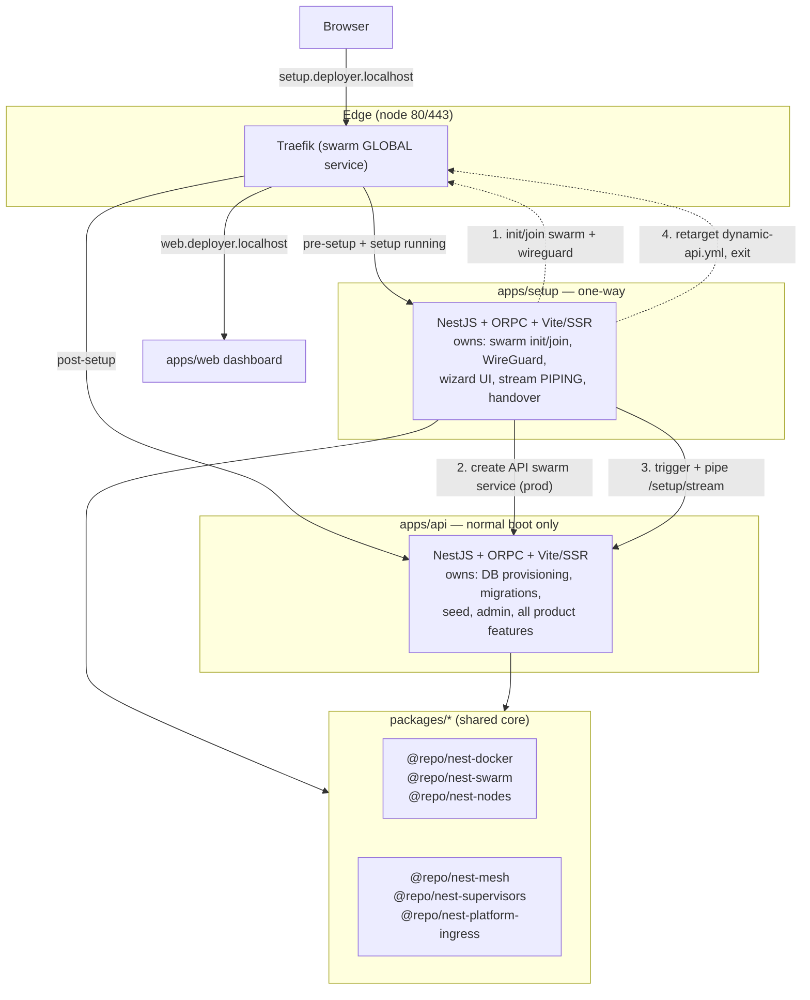
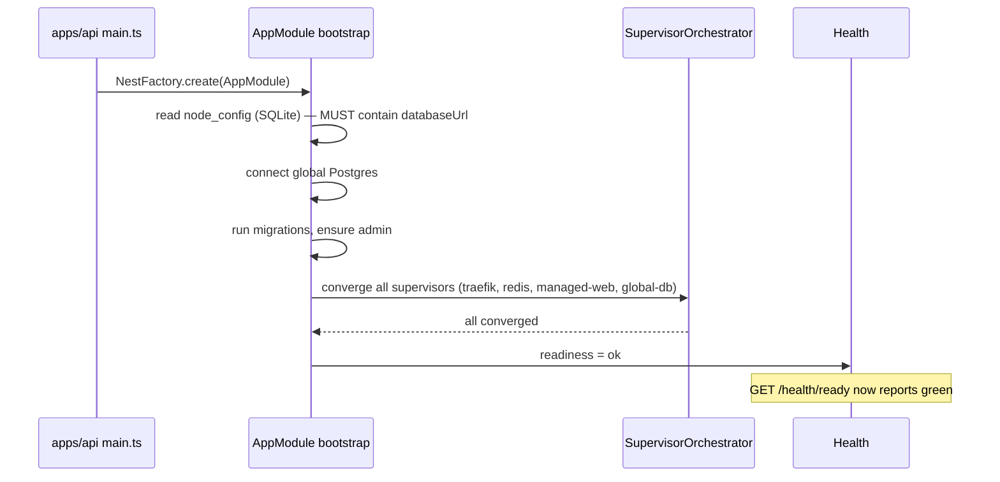
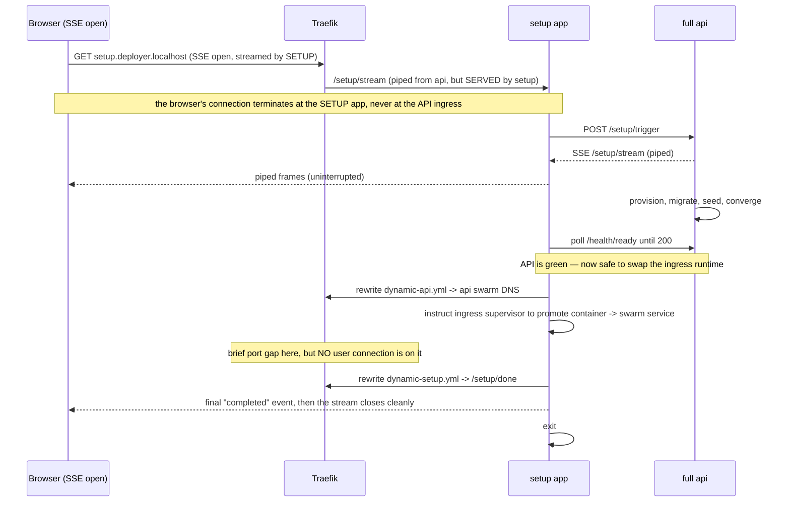
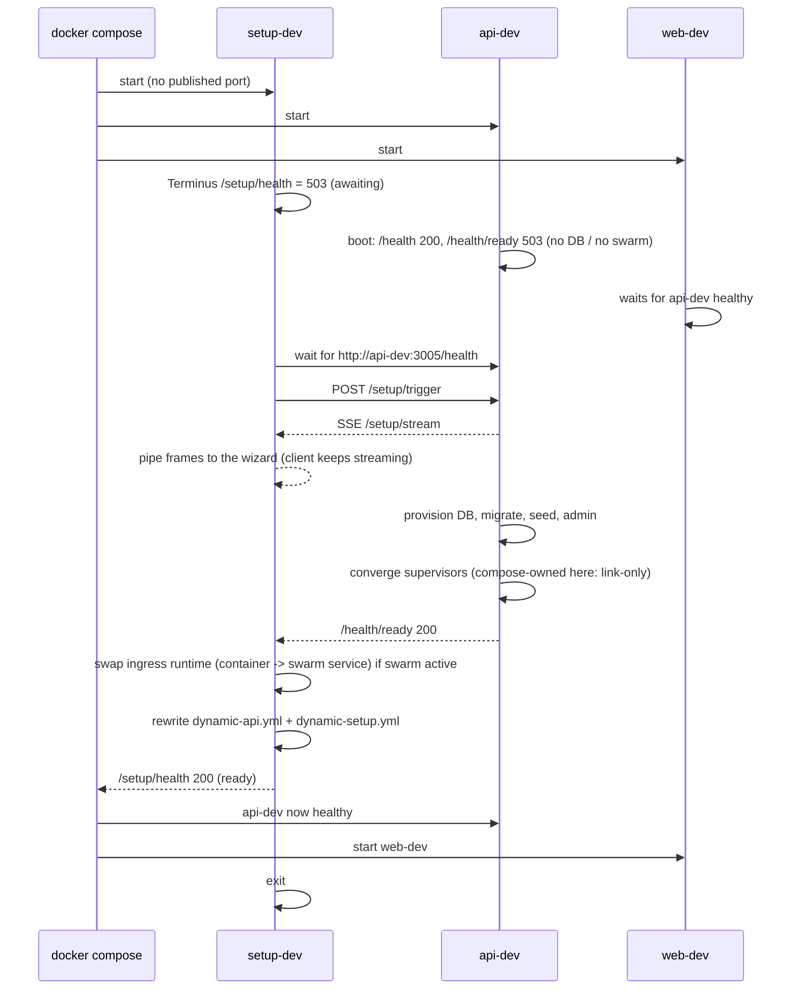
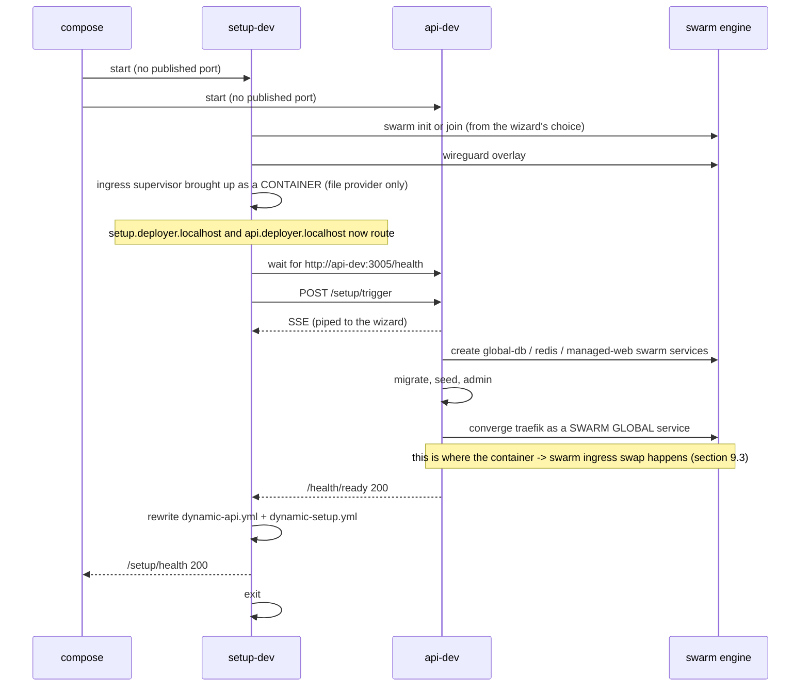
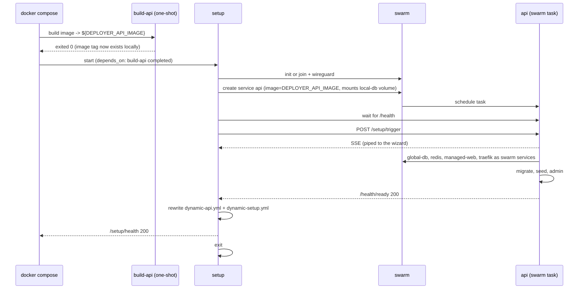

# Setup App Refactor — Plan

Status: **proposed** (no code changed yet)
Owner: platform
Scope: `apps/*`, `packages/*`, `docker/*`

---

## 1. Goal

Split the platform into **two apps with one clear handover**:

1. **`apps/setup`** — a minimal, one-way app whose only job is to *get the platform onto a
   cluster*. It runs the setup wizard, initialises or joins the swarm, configures WireGuard,
   asks the full API to provision the database, and then **hands the entry port over and exits**.
2. **`apps/api`** — the full platform. It no longer knows anything about being "pre-setup".

The handover replaces the current arrangement, where one process boots in a degraded
"maybe-setup" mode and orchestrates sub-apps to work around the fact that it cannot serve
traffic before setup finishes.

### The three outcomes this buys

| Today | After |
|---|---|
| `OrchestrationModule` boots the API in a special pre-setup mode, runs a sub-app pipeline (setup-wizard :3010, mesh-init :3011, main-app :3012), and swaps the gateway fallback at runtime | API boots **one normal way**. The sub-app pipeline is deleted. |
| Every feature module must tolerate "no global DB yet" (guards, deferred supervisors, `pending` states, lazy pools) | The API only ever starts **after** setup, so those caveats move to the setup app. |
| Compose starts the API and it decides at runtime whether to be a wizard or a server | Compose starts **setup**, and setup decides when the API becomes a service. |

### Two facts that shape everything below

- **Traefik has two incarnations** — a plain container pre-swarm, then a swarm GLOBAL
  service. The entry port is exclusively bound, so the swap has an unavoidable gap; the
  design makes that gap *irrelevant* rather than trying to make it impossible (§9.3).
- **Health is NestJS Terminus** in both apps — one endpoint aggregating multiple internal
  services, returning real 200/503 codes, which is what makes the compose gates trivial (§8).

### Non-goals

- Not changing the user-facing wizard (same steps, same shared `@repo/ui` components).
- Not changing the setup *contract* semantics (`/setup/*` keeps its shape for the client).
- Not touching the build pipeline (`turbo prune` + the existing Dockerfiles) beyond the tags needed.

---

## 2. Current state (measured)

Facts this plan is built on, gathered from the working tree:

### Apps

```
apps/api    — name: "api"        the full platform + sub-app orchestration + SSR views
apps/web    — name: "web"        Next.js dashboard
apps/doc    — name: "doc"        Fumadocs
```

`apps/api/src/`:

```
core/        357 files, ~66.9k LOC   shared infrastructure (docker, swarm, mesh, traefik, supervisors, ...)
sub-apps/    mesh-initializer/ + setup-wizard/     the pipeline that must go
views/       SSR React app (Vite, @nestjs-ssr/react) — includes the setup wizard UI
modules/     product features (health, platform, cluster, ...)
system/      control plane
cli/         CLI entry
main.ts      gateway Express + OrchestrationModule
```

`apps/api/src/sub-apps/setup-wizard/` (12 files) is the "weird sub app":

```
setup-page.controller.ts    GET /setup  (SSR wizard page)
setup-wizard.controller.ts  ORPC /setup/* implementations
setup-wizard.sub-app.module.ts   root of the sub-app (RenderModule + SetupModule)
setup-wizard.app.module.ts       root for the app context
setup-wizard.api.module.ts       mounted on the main Express server too
setup-wizard.orpc.module.ts      ORPC context factory
setup-wizard-init.module.ts      providers (InitializationService et al)
setup-wizard.service.ts          bridge that fires when setup completes
setup-wizard.bridge.ts           typed event bridge
```

`apps/api/src/core` module sizes (from the prior audit, rounded):

| Module | ~LOC | Needed before the API starts? |
|---|---|---|
| `mesh` | 15,000 | **yes** (join a remote swarm, WireGuard) |
| `traefik` | 12,500 | partly (config generation) |
| `auth` | 6,300 | **yes** (local strategy creates the admin) |
| `supervisors` | 5,700 | **yes** (traefik/redis/wireguard as swarm tasks) |
| `docker` | 5,000 | **yes** (swarm init/join, service creation) |
| `swarm` | 2,600 | **yes** |
| `setup` | 1,900 | **yes** |
| `reachability`, `platform-ingress`, `node-state`, `database/local` | ~2,100 | **yes** |

### Setup contract (unchanged by this plan)

`packages/contracts/api/modules/setup/index.ts` — prefix `/setup`:

```
GET  /setup/state                     wizard state
GET  /setup/node-status
POST /setup/probe/database
POST /setup/probe/mesh
POST /setup/remote/auth
POST /setup/trigger                   start provisioning
GET  /setup/stream                    SSE progress
GET  /setup/post-setup/hints
POST /setup/post-setup/hints/dismiss
```

### Health

- `GET /health` — Express, unauthenticated, immediate: `{ status: "ok", uptime }`. Used by Docker
  healthchecks.
- `GET /health/detailed` — ORPC, **authenticated**: `{ status, database: { status }, supervisors: [{ supervisorId, healthy, state, ... }] }`.
- `HealthService`: `isHealthy = database.status === "ok" && every(supervisor.healthy)`.

**Gap:** there is no *unauthenticated* readiness endpoint. The setup app has no session, so it
cannot poll `/health/detailed` to decide "the platform is green".

### Compose profiles

| File | API | Managed services | Notes |
|---|---|---|---|
| `docker-compose.dev.yml` | `api-dev`, publishes drizzle-studio port | compose owns redis/traefik/db | `MANAGED_*=true` |
| `docker-compose.dev-supervised.yml` | `api-dev`, **no published ports** | API supervises everything | `MANAGED_*=false`, `SETUP_AUTO=true` |
| `docker-compose.prod.yml` | `api-prod`, publishes `API_PORT` | API supervises everything | single container, `entrypoint.prod.ts` |
| `docker-stack.deploy.yml` | `api` replicas 3 | swarm services | **stale** — still has `--providers.docker.swarmMode=true`, removed as broken in Traefik v3 |

### Image & build

- API dev image is tagged `nextjs-nestjs-api-dev:latest` (`common/api/docker-compose.config.dev.yml`).
- Prod image comes from `docker/builder/api/Dockerfile.api.prod`, `CMD ["bun","--bun","--cwd=apps/api","run","prod"]`
  → `apps/api/scripts/entrypoint.prod.ts`, which spawns `start:prod` and then builds+starts the web app.
- **In-container builds are not possible in dev**: the build context is not mounted
  (`build context "docker/scanner-runner/" not found from cwd "/app/apps/api"` in the logs).
  So the setup app must **reference an existing image**, never build one.

### Why the current API is "weird"

`OrchestrationModule` + `sub-app-runner` exist because the API may be launched before setup.
That produces, across the codebase:

- a gateway that swaps its fallback target at runtime,
- supervisors with `pending` states and convergence gates,
- DB-touching modules with guards and deferred pools,
- `SETUP_AUTO` branching in the orchestrator,
- an SSR surface served from a sub-app that is later unregistered.

All of it exists to serve a phase that, after this refactor, belongs to a different app.

---

## 3. Target architecture



### The key sequencing rule

> **The setup app never serves traffic after the handover, and the API never starts before the
> handover.** One owner of the entry port at any moment.

- **Dev:** compose starts `setup`, `api`, `web`. `api` and `web` gate on a healthcheck that
  requires the setup app to report "handed over". The API is already running (compose), so setup
  only has to drive it.
- **Prod:** compose (or the operator) starts **only** `setup`. Setup initialises/joins the swarm,
  creates the API as a **swarm service** from the prebuilt image, waits for it to be green, drives
  it, then retargets Traefik and exits.

---

## 4. Responsibility split

The single most important table in this plan. "Where does this run?"

| Concern | Setup app | Full API | Shared package |
|---|---|---|---|
| Wizard UI (React, SSR, Vite) | **yes** | — | `@repo/ui` (components) |
| Wizard session state | **yes** | — | — |
| Stream SSE to the client | **yes** (pipes) | produces | — |
| Swarm `init` / `join` | **yes** | — | `@repo/nest-swarm` |
| WireGuard overlay | **yes** | — | `@repo/nest-mesh` |
| Create the API swarm service | **yes** (prod) | — | `@repo/nest-docker` |
| Traefik config generation | **yes** (bootstrap subset) | yes (full) | `@repo/nest-platform-ingress` |
| Retarget `dynamic-api.yml` (handover) | **yes** | — | `@repo/nest-platform-ingress` |
| Global Postgres provisioning | — | **yes** | `@repo/nest-docker` |
| Migrations / seed / admin user | — | **yes** | — |
| Mesh registration | — | **yes** | `@repo/nest-mesh` |
| Supervised services (traefik, redis, managed-web) | bootstraps per-node ingress + redis | converges the full set | `@repo/nest-supervisors` |
| Readiness reporting | consumes | **produces** | — |

**Rationale for the split.** Swarm bootstrap and WireGuard *must* run before the API can be
scheduled on the cluster — that is the whole point. Database provisioning, migrations, seeding and
admin creation *must* run inside the API, because they need the full Drizzle schema, the auth
stack, and the entity contracts; duplicating that in a "minimal" app would be a second
implementation of the same thing (exactly what the repo forbids). So the setup app **orchestrates**
and the API **executes**.

The user-visible consequence: the stream is *produced* by the API and *piped* by the setup app.

---

## 5. Package extraction

### 5.1 Rules

- Follow the existing convention: framework-ish NestJS packages → `packages/nest/<name>`,
  utilities → `packages/utils/<name>`, contracts → `packages/contracts/<name>`.
- Use `packages/nest/events/package.json` as the template (single `"."` export pointing at
  `./src/index.ts`, `catalog:` deps, the standard script set).
- Extract **only what both apps need**. Everything setup-only moves *into* the setup app.
- `scripts/check-di-graph.ts` already enforces "no cycles / no reverse imports" and must stay green
  after every extraction step.

### 5.2 Target packages

| New package | Extracted from | Rough size | Why shared |
|---|---|---|---|
| `@repo/nest-docker` | `core/modules/docker` | ~5.0k | swarm + container + service management; both apps drive Docker |
| `@repo/nest-swarm` | `core/modules/swarm` | ~2.6k | init/join, participation, cluster snapshot, spec mapper |
| `@repo/nest-nodes` | `core/modules/node-state` | ~0.6k | local SQLite `node_config` / `cluster_node` — the pre-setup source of truth |
| `@repo/nest-mesh` | `core/modules/mesh` | ~15k | join a remote swarm + WireGuard; needed by setup |
| `@repo/nest-supervisors` | `core/modules/supervisors` | ~5.7k | bootstrap ingress/redis as swarm services |
| `@repo/nest-platform-ingress` | `core/modules/platform-ingress` + the `traefik` config builders | ~3k–13k | hostname grammar + route config; setup bootstraps ingress |
| `@repo/nest-database-local` | `core/modules/database/local` | ~0.5k | local SQLite connection; both apps read it |
| `@repo/nest-reachability` | `core/modules/reachability` | ~0.5k | mesh URL probing used by the wizard |

Already shared and unchanged: `@repo/env`, `@repo/errors`, `@repo/logger`, `@repo/types`,
`@repo/orpc-utils`, `@repo/auth`, `@repo/contracts-*`, `@repo/ui`.

### 5.3 Extraction order (MEASURED — supersedes the earlier guess)

The original order in this plan (`nodes` first as a "leaf", then `docker`, then `swarm`) is
**unachievable**, because module-level adjacency hides cycles. A file-level analysis of
`apps/api/src/core/modules/*` gives the real picture:

```
nodes         -> [dblocal, setup, swarm]         <- NOT a leaf
docker        -> [supervisors, swarm]
swarm         -> [database, dblocal, docker, mesh, nodes, setup]
ingress       -> [database, dblocal, docker, traefik]
mesh    (102 files) -> [auth, database, docker, events, nodes, setup, swarm, sysmetrics]
supervisors   -> [database, dblocal, docker, ingress, setup]
reachability  -> [database, events, nodes, setup]
dblocal       -> [database]
```

#### Two findings that make extraction possible anyway

**1. The file-level cycles are all INTRA-module.** There are exactly 3, and each is contained
inside a single module (7 files in `mesh/…/query/`, 3 in `supervisors/*.ts`, 2 in
`mesh/…/query/`). A module moves as a unit, so these do **not** block extraction.

**2. Every cycle routes through 3 relocatable things**, not through the modules themselves:

| Blocker | What it is | Resolution |
|---|---|---|
| `@/config/env/env.service` + `env.module` | 5 target modules import it; it is app-local | **Extract `@repo/nest-env`** (done — see below) |
| `@/config/drizzle/local/schema` + `global/schema` | 5 target modules import table definitions | **Extract `@repo/nest-schema`** (schemas only, no queries) |
| `supervisors/*.ts` (the 9-file framework) | `docker` imports `base-supervisor`; `supervisors/platform/*` imports `docker` | **Extract `@repo/nest-supervisor-core`** — the framework has NO docker import, so the cycle is only with the *implementations* |
| `node-state` providers from `setup/` + `swarm/` | `NodeConfigRepository`, `ClusterNodeRepository`, `ClusterNodeInventoryRepository` | Move the 3 repositories **into** `@repo/nest-nodes`; the module's own docs already say "the module boundary is what matters, not the directory" |

#### The corrected order

Each step is independently verifiable: build + type-check + test + `DI_GATE=cycles`.

```
0. @repo/nest-env              DONE — unblocks 5 of the 8 targets
1. @repo/nest-schema           drizzle schemas (local + global), zero queries
2. @repo/nest-database-core    BaseDatabaseService + connection tokens + BaseReachability
3. @repo/nest-supervisor-core  base-supervisor, orchestrator, event bus, process-info, shared
4. @repo/nest-nodes            + the 3 repositories moved in from setup/ and swarm/
5. @repo/nest-docker           depends on nodes, supervisor-core, env
6. @repo/nest-swarm            depends on docker, nodes, env
7. @repo/nest-database-local   depends on database-core, schema, nodes
8. @repo/nest-reachability     depends on nodes, env
9. @repo/nest-mesh             depends on nodes, swarm, env
10. @repo/nest-supervisors     depends on docker, swarm, ingress, supervisor-core
11. @repo/nest-platform-ingress depends on docker, env, schema
```

Steps 1–3 are **new** (they were not in the original plan) and are what actually unblock the rest.
Step 0 is complete; the remaining steps are mechanical once 1–3 land.

#### What "done" looks like for each step

- the package builds (`bun --bun --cwd=./packages/nest/<name> run build`)
- `bun --bun run api -- type-check` and `bun --bun run setup -- type-check` are 0 errors
- `bun --bun run api -- test` shows no NEW failures
- `DI_GATE=cycles bun --bun scripts/check-di-graph.ts` passes
- the old files are deleted in the SAME change set (no bridges, no re-export shims)

### 5.4 What must NOT be extracted

Product features stay in `apps/api/modules`: `health`, `platform`, `cluster`, `project`,
`deployment`, `runners`, `providers`, `analytics`, `fleet`. They are the API's reason to exist and
the setup app must never serve them.

---

## 6. `apps/setup` — the new app

### 6.1 Shape

```
apps/setup/
  package.json            name: "setup"
  nest-cli.json
  tsconfig.json
  vite.config.ts          base: '/vite/', port 5173 (mirrors apps/api)
  scripts/
    entrypoint.ts         dev/prod-aware bootstrap
  src/
    main.ts               plain Nest bootstrap (Express, no gateway, no sub-apps)
    app.module.ts         SetupAppModule
    authz/               nothing — setup is pre-auth by definition
    modules/
      wizard/            session state, step orchestration, stream piping
      cluster/           swarm init/join + wireguard (uses @repo/nest-swarm|mesh)
      handover/          API service creation + dynamic-api.yml retarget + exit
      health/            GET /setup/health (the compose gate)
    views/               SSR Vite app: wizard only (moved from apps/api/src/views)
```

### 6.2 What moves here from the API

| From | To | Note |
|---|---|---|
| `apps/api/src/sub-apps/setup-wizard/*` (12 files) | `apps/setup/src/modules/wizard/` | controllers + ORPC module, minus the sub-app plumbing |
| `apps/api/src/views/setup/**` | `apps/setup/src/views/setup/**` | the wizard React tree (already shared from `@repo/ui`) |
| `apps/api/src/views/pages/setup.tsx` | `apps/setup/src/views/pages/setup.tsx` | |
| `apps/api/src/views/setup-adapters/**` | `apps/setup/src/views/setup-adapters/**` | API-side adapter |
| `apps/api/src/views/{layout,entry-client,entry-server,index.html,global.css}` | `apps/setup/src/views/` | the setup app gets its own Vite/SSR app |
| `apps/api/src/core/modules/setup/services/initialization.service.ts` | **stays in API** (the execution engine) — setup calls it remotely | |
| `apps/api/src/core/...` setup-only helpers | `apps/setup/src/` | anything not needed by the API |

### 6.3 Deliberate duplication policy

The setup app gets its **own** `views/` (Vite config, entry points, layout) rather than importing
the API's. Reason: the API's view entries auto-discover *all* views via
`import.meta.glob('@/**/views/**/*.tsx')`; sharing them would drag every product page into the
setup bundle. The **components** stay shared in `@repo/ui` — only the app shell is duplicated,
which is the same pattern `apps/web` already uses.

---

## 7. Full API simplification

### 7.1 Delete

| Path | Why |
|---|---|
| `apps/api/src/core/orchestrator/` (`OrchestrationModule`, `OrchestratorService`) | the sub-app pipeline; replaced by a normal bootstrap |
| `apps/api/src/core/router/` (`RouterController`, `SubAppCascadeService`) | the gateway's route graph |
| `apps/api/src/core/gateway/` (`GatewayService`, `RouteRegistry`) | the catch-all that proxies to sub-apps |
| `apps/api/src/sub-apps/setup-wizard/` | moved to `apps/setup` |
| `apps/api/src/sub-apps/mesh-initializer/` | mesh registration becomes a normal module init step |
| `apps/api/src/views/setup/**`, `views/pages/setup.tsx`, `views/setup-adapters/**` | moved to `apps/setup` |
| `apps/api/scripts/entrypoint.prod.ts`'s web-build step | the web app has its own image |

### 7.2 Keep (moved into the API's normal boot)

- [`GatewayService`](apps/api/src/core/gateway/gateway.module.ts)-equivalent behaviour is no longer
  needed: the API listens on its own port and Traefik routes to it. The `/vite` asset proxying added
  for the SSR views stays, but as a plain middleware on the API itself.
- `OrchestratorService`'s **useful** parts (DB resolution from node_config, migrations, admin
  bootstrap, supervisor convergence) become ordinary `OnApplicationBootstrap` steps in
  `app.module.ts` — no fallback swapping, no sub-app registration.

### 7.3 New normal boot order



**What "fail fast" means, precisely.** The API must keep answering *liveness* before the database
exists — in dev it is started by compose *before* setup provisions anything, so refusing to boot
would crash-loop and setup would have nothing to drive. The rule is therefore about
**readiness**, not process start:

| Situation | Liveness `/health` | Readiness `/health/ready` |
|---|---|---|
| No `databaseUrl` in `node_config` yet | `200 ok` | `starting` (not green) |
| DB set, migrations running | `200 ok` | `starting` |
| Everything green | `200 ok` | `ok` |
| Fatal misconfiguration | `200 ok` | `degraded` + `detail` |

**What is deleted is the *wizard*, not the tolerance for a missing database.** The API no longer
serves onboarding, no longer swaps a gateway fallback, and no longer runs a sub-app pipeline. What
remains is the ordinary "dependencies not ready yet" behaviour every service has: it boots, reports
not-ready, and becomes ready when its dependencies are.

---

## 8. Health & readiness — NestJS Terminus

Both apps expose health through **`@nestjs/terminus`**, as required: one endpoint that aggregates
the health of *multiple internal services*. Health JSON is not hand-rolled.

### 8.1 Why Terminus (and what it removes)

Terminus returns **`200` when every indicator is up, `503` when any is down**. That alone removes
the earlier "compose cannot match a JSON body" problem: a plain
`wget --spider http://.../health/ready` is a correct probe, because a non-2xx *is* the failure
signal. No `healthcheck.sh` grep wrapper is needed.

It also gives the aggregation shape for free:

```ts
this.health.check([
  () => this.database.isHealthy('database'),
  () => this.swarm.isHealthy('swarm'),
  () => this.supervisors.isHealthy('services'),
  () => this.mesh.isHealthy('mesh'),
]);
```

Each indicator uses `HealthIndicatorService.check(key)` and returns `.up()` / `.down({...})`, so a
failing component yields a `503` **and** names itself in the Terminus `error` payload — which is
exactly what the setup app turns into toasts.

### 8.2 Endpoints — full API

| Path | Nature | Indicators | Notes |
|---|---|---|---|
| `GET /health` | **liveness** | none | Always `200` while the process lives. Docker liveness. Must never touch the DB: in dev the API starts *before* setup provisions anything. |
| `GET /health/ready` | **readiness** | `database`, `swarm`, `services[]`, `mesh` | The gate. `200` only when all are green. **Unauthenticated.** |
| `GET /health/detailed` | detail (existing — ORPC, **authed**) | ready + memory/uptime | Unchanged; for the dashboard. |

Indicator semantics:

```ts
// database — the global Postgres
await pool.query('SELECT 1')                          // -> up
// swarm — engine active AND this node holds the role participation expects
LocalNodeState === 'active' && roleMatchesExpected    // -> up
// services — every expected platform swarm service has a running task
getHealthOfAll().every(s => s.healthy)                // -> up; .down({ failing: [...] })
// mesh — peers reachable / overlay up (single node counts as up)
peersReachable || nodeCount === 1                     // -> up
```

`services` reuses `SupervisorOrchestratorService.getHealthOfAll()`: the supervisors already probe
traefik / redis / global-db / managed-web for real (HTTP, `SELECT 1`, task state), so this is
aggregation, not new probing.

**Never expose secrets.** Any `down({...})` payload carries measurements, not credentials; URLs go
through `redactUrl`.

### 8.3 Endpoints — setup app

The setup app uses the **same Terminus wiring**, and its readiness endpoint is the compose gate.
Binary states, because that is what compose consumes:

- **`503` not ready** — `awaiting` (still driving) or `failed`.
- **`200` ready** — the full API is up, its `/health/ready` is green, **and** the ingress has been
  handed over.

```ts
this.health.check([
  () => this.apiReachability.isHealthy('api'),   // GET <api>/health/ready
  () => this.handover.isHealthy('handover'),     // ingress swapped and serving
]);
```

`GET /setup/state` (separate from health) carries the rich, human-facing picture — `phase`,
`apiUp`, `apiReady`, `detail`. Health stays binary; the wizard reads `/setup/state` for nuance, and
maps each non-green Terminus component (it names itself in the `error` payload) to a **toast**
(see §10.4).

### 8.4 Compose wiring

Because Terminus emits real HTTP status codes, both probes are one-liners:

```yaml
# full api (dev) — READINESS, so "healthy" means "the platform works"
healthcheck:
  test: wget --no-verbose --tries=1 --spider http://127.0.0.1:${API_PORT:-3005}/health/ready || exit 1
  start_period: 180s        # setup + provisioning happens before this turns green

# setup app — READINESS == handed over
healthcheck:
  test: wget --no-verbose --tries=1 --spider http://127.0.0.1:3016/setup/health || exit 1
  start_period: 30s
  interval: 10s
  timeout: 5s
  retries: 10
```

### 8.5 How compose gates — and the deadlock to avoid

A naive wiring is circular and MUST NOT be used:

```yaml
# DEADLOCK in dev: setup only reports "ready" once the API is green,
# and the API would never start because it waits for setup to be healthy.
api-dev:
  depends_on:
    setup:
      condition: service_healthy
```

In dev the API is a compose service, so the correct wiring is:

- **`api-dev` does NOT depend on `setup`.** It starts immediately. Its *liveness* answers at once;
  its **readiness** is what only goes green after setup has driven provisioning.
- **`setup` waits for the API to answer** (`SETUP_API_URL` reachable), drives it, then flips
  `/setup/health` to `ready`.
- **`web-dev` keeps `depends_on: api-dev: condition: service_healthy`** — with the API's healthcheck
  pointing at `/health/ready`, web therefore starts only once the platform is green.

That satisfies *"api and web app will wait for setup to be completed"* without a cycle: the API
becomes **healthy** only after setup completed, while still **starting** early enough for setup to
drive it.

---

### 8.6 Event-driven state — the probe does NO I/O

`/health/ready` is **polled** (compose every 15s, forever). Doing the work per request meant every
poll ran a `SELECT 1`, a `docker swarm inspect`, a full probe of **every** supervisor (each doing
its own HTTP / `SELECT 1` / task-state call) and a mesh query — to answer a question whose answer
had already been published as events.

So the I/O is **not on the request path**. `ReadinessStateService` owns it and rebuilds on change:

| Source | Drives |
|---|---|
| `AppLifecycleService.events` (RxJS) | `lifecyclePhase`, `databaseReachable`, `meshConnected` |
| `SupervisorEventBus.events$` (RxJS) | `state-changed` / `reconciled` / `health-snapshot` → supervisor snapshots |

The HTTP handler is then a pure read of `snapshot()`: **O(1), no query, no docker call, no timer on
the request path**. `GET /health/detailed` and the setup app's probe read the same cache.

**Two drivers, deliberately:**

1. **Events (primary)** — a supervisor that changes state republishes its health immediately, so the
   probe reflects reality within milliseconds. Event bursts are debounced (250ms) because converging
   five supervisors emits a dozen events in that window, and rebuilding per event would probe the
   same resources repeatedly.
2. **A slow safety-net cadence (15s)** — a resource can degrade *without its supervisor changing
   state* (a redis that dies while `converged`). Events alone cannot see that. Chained timers, not
   `setInterval`, so a slow probe can never stack passes — the pattern already used by
   `SwarmAppWiringSupervisorService`.

**A prerequisite this exposed.** `AppLifecycleService.markDatabaseProbe()` and `markMeshConnected()`
mutated metadata **silently** — they emitted no event. A silent mutation is invisible to
subscribers, which is exactly why readiness had to poll in the first place. Both now emit. Any
future lifecycle mutator that changes observable state MUST emit, or it silently forces consumers
back to polling.

**Failure isolation.** If supervisor aggregation throws, the last good snapshot is kept — one
unreachable dependency must not blank the picture, because the failing component is precisely what
the operator needs to see.

---

---

### 8.7 Package boundary — core functionality only

Both apps import from `packages/*`, so the boundary decides what is allowed to become a
cross-app contract. The rule:

> **Shared packages export CORE FUNCTIONALITY. Business rules belong in the app that owns them.**

A package may export: framework primitives (base classes, builders, pooling, transports),
generic utilities, env schemas, contracts (Zod/ORPC), and UI components. A package may **not**
export a rule that describes *this platform's* behaviour — boot sequencing, orchestration
phases, service topology, product policy.

**Why it matters here.** `apps/setup` and `apps/api` are the two consumers. A rule that only
`apps/api` follows does not belong in a package, because the package then implies a contract
that only one app honours — and `apps/setup` inherits an obligation it never agreed to.

**The test:** if exactly one app consumes it, it is business logic → move it into that app.

#### Worked example — `db-not-ready`

`@repo/nest-events` exported `isDatabaseNotReadyError` + `DatabaseNotReadyReporter`. The docs on it
described **this platform's boot sequence** ("the schema is created by migrations that run INSIDE
the boot flow (orchestrator ready-pipeline / setup wizard)"), and only `apps/api` consumed it.
That is business logic in a package. The split:

| Piece | Where | Why |
|---|---|---|
| `isTransientDatabaseError` | in the package renamed to a **storage-level** classification: SQLSTATEs and driver codes meaning "not ready". Names no platform phase, no orchestrator, no setup wizard | The event plumbing needs it for its own persistence/replay logic, and it is genuinely generic |
| `isDatabaseNotReadyError` | `apps/api/src/core/modules/database/services/db-not-ready.ts` | Describes OUR boot sequence. Delegates the classification to the package — it does not re-implement the SQLSTATE list |
| `DatabaseNotReadyReporter` | same app-local file | The once-then-debug log policy is an app logging decision |

#### Audited and deliberately LEFT in packages

Not everything platform-flavoured is a violation. These were checked and kept, with the reason:

| Package | Platform content | Verdict |
|---|---|---|
| `@repo/contracts-*` | deployment/mesh/project/swarm schemas | **Correct.** Contracts ARE the single source of truth — the plan's own goal is one location for them |
| `@repo/auth` (permissions) | `traefik` resources, project roles | **Correct.** Consumed by BOTH `apps/api` (guards) and `apps/web` (`RequirePlatformRole`, `PLATFORM_ROLES`) — a genuine cross-app contract |
| `@repo/env` | `MANAGED_TRAEFIK_*`, `MANAGED_GLOBAL_DB_*` defaults | **Correct.** The env contract must be identical for whoever starts the process or the schema drifts |
| `@repo/nest-lifecycle` | `AppLifecyclePhase` naming our phases | **Correct.** Both apps report the same phases to the same gate |

**Versioning rule:** new ORPC/Zod surface pulled from `packages/` needs a `*_CONTRACT_VERSION` bump
— see `DEPLOYER_VERSION` for the pattern.
## 9. Traefik — two states, one hostname

Traefik itself runs in **two incarnations**, exactly as the operator described:

| | State A — BOOTSTRAP | State B — SWARM |
|---|---|---|
| Runtime | plain **container** (dockerode-created) | **swarm GLOBAL service** (one task/node) |
| Started by | the ingress supervisor, pre-swarm | the ingress supervisor, post-swarm |
| Name | `deployer-traefik` | `deployer-traefik` (same) |
| Entry port | the SAME published port | the SAME published port |
| Providers | `file` only | `file` only at first, `swarm` becomes available |

**This is already implemented** in `TraefikSupervisorService` (`isSwarmOnly() === false`,
`buildBootstrapContainerSpec`, `reconcileBootstrap`, and the swap in `reconcile()`). What this
section adds is the **transition discipline** — because a naive swap drops live connections, and
the wizard's SSE stream runs through it.

### 9.1 Hostnames

| Hostname | Serves |
|---|---|
| `setup.deployer.localhost` | the setup app while setup is pending; the "setup done" page after |
| `api.deployer.localhost` | the full API (retargeted at handover) |
| `web.deployer.localhost` | the dashboard (unchanged) |
| `api.deployer.localhost/manage/web-app` | API-served console fallback (unchanged) |

### 9.2 Router rules

```yaml
# dynamic-setup.yml — written by the setup app; rewritten (not deleted) at handover
http:
  routers:
    setup:
      rule: Host(`setup.deployer.localhost`)
      service: setup-svc
      entryPoints: [web]
      priority: 3000            # wins over the api/web family for this host
  services:
    setup-svc:
      loadBalancer:
        servers:
          - url: http://<setup-container-or-service>:3016
```

At handover the same file is **rewritten** (never deleted) to point the same host at a static page
served by the API:

```yaml
services:
  setup-svc:
    loadBalancer:
      servers:
        - url: http://<api-swarm-dns>:3005/setup/done
```

**Why rewrite rather than delete:** deleting the router leaves a window where
`setup.deployer.localhost` resolves to *no route* → Traefik 404. Keeping the router and only
changing its backend means the hostname is continuously answerable. That is the same
"never let a URL change owner by disappearing" rule the entry port follows.

`GET /setup/done` is unauthenticated, tiny, and renders the page requested: **"Setup done here"**
plus a button to

- the managed web app (`web.deployer.localhost`) when `managed_web_app.enabled` and it is running;
  else
- `api.deployer.localhost/manage/web-app` (the API console fallback).

Both targets already exist in the platform today (`dynamic-web.yml` serves both the web app and the
console rule), so the button resolves exactly as the current hand-off does.

### 9.3 The transition — and the flaw it fixes

The **current implementation** does this:

```ts
await this.removeContainerIfExists(this.swarmServiceName());  // (a) port freed, ingress GONE
await this.reconcileSwarm(desiredPort);                       // (b) ...gap... create service
await this.verifySwarmConvergence(...);                       // (c) wait for a running task
```

The entry port is **exclusively bound**, so the container must release it before the service can
take it — remove-then-create is unavoidable. But between (a) and (c) there is a window of
*hundreds of milliseconds to seconds* with **nothing listening on port 80**. Any in-flight
connection is dropped, and the wizard's SSE stream — which flows through Traefik — dies mid-setup.
That is precisely the "transition should be well handled since the stream of the setup wizard logs
should still occur flawlessly" requirement.

**Fix: the client is never talking to Traefik during the swap.**

The setup wizard is served by the **setup app** (`setup.deployer.localhost` → `setup-svc`), *not*
by the API. So the ordered handover is:



Three properties make the gap harmless:

1. **The user's stream does not traverse the entry port.** It terminates at the setup app. The
   ingress swap happens *after* the last meaningful wizard event, so nothing the user is watching
   flows through port 80.
2. **The swap happens only after the API is green.** By then the stream has already delivered its
   terminal `completed`/`error` event.
3. **`setup.deployer.localhost` never disappears** (§9.2: the router is rewritten, not deleted).

**Ordering guarantees (must-hold invariants):**

| # | Invariant | Why |
|---|---|---|
| 1 | Poll `/health/ready` to `200` **before** touching the ingress | the API must be serving before the port changes hands |
| 2 | `dynamic-api.yml` retargeted **before** the container is removed | `api.<host>` is never unrouted |
| 3 | `dynamic-setup.yml` rewritten **before** setup exits | `setup.<host>` degrades to a static page, never a 404 |
| 4 | Setup exits **only** after `/setup/health` reports ready | the dashboard is never reachable on a half-built platform |
| 5 | Retry the port swap with backoff | a slow task start must not lose the entry port permanently |

**If the swap fails** (service never gets a running task, port stays bound): setup does **not**
exit and does **not** report ready. It restores the bootstrap container (the supervisor's own
reconcile is idempotent and will re-create it, since the service is absent), reports
`/setup/health → failed` with the engine error, and the wizard shows a toast. The stream stays
alive, so the operator can retry without losing the page.

**Deferred, not part of the swap:** making the gap itself zero. That would need the swarm service to
pre-bind the port before the container releases it, which the engine does not support for exclusive
host ports. The design above makes the gap *irrelevant* instead of trying to make it impossible —
simpler, and it cannot deadlock.

---

## 10. Stream piping

### 10.1 Rule

> The client always talks to the **setup app**. The setup app is a *pipe*, never a second producer.

```
client  ──GET /setup/stream──▶  setup app  ──GET /setup/stream──▶  full api
        ◀──SSE frames──────────            ◀──SSE frames──────────
```

### 10.2 Implementation

- Setup app exposes `GET /setup/stream` (same path the client already calls — **no client change**).
- It opens an upstream SSE connection to the API's `/setup/stream`, forwarding:
  - the raw event frames (they are already the wire format the client expects),
  - `Last-Event-ID` on reconnect so the API's replay still works for late subscribers,
  - a cancellation that tears the upstream down when the client disconnects.
- Same `Content-Type: text/event-stream`, same `Cache-Control: no-cache`, no buffering.
- Because the setup app is only a pipe, **it never needs the setup's business logic** — only the
  upstream URL (from `node_config` / the API service DNS name).

### 10.3 What the API keeps

`/setup/trigger` and `/setup/stream` stay on the API as **plain endpoints** — not sub-app routes.
The API is the only place with the Drizzle schema, migrations, and auth needed to execute
provisioning, so it produces the events. This is not "the weird sub app"; it is a normal feature
module mounted like any other.

### 10.4 Failure handling and re-runnable setup

- If `/health/ready` never goes green, setup does **not** exit. It sets
  `GET /setup/health → { status: "failed", phase, detail }` and the wizard becomes re-runnable.
- Component errors (a supervisor that will not converge, a mesh peer that is unreachable, a
  database that refuses connections) are surfaced **as toasts in the client** — the setup app maps
  each non-green component in `/health/ready` to one toast with its `detail`.
- Re-running setup must be safe: the swarm init is idempotent, the DB provisioner is idempotent
  (it already skips migrate/seed when tables exist), and the handover steps are re-entrant.

---

## 11. Compose & Docker changes

### 11.0 The setup container is NOT publicly exposed

**Correction to an earlier draft of this plan.** The setup app must **not** publish its port:

- it is reachable **only through Traefik** (which is on the same docker network), exactly like
  `api-dev` and `web-dev` in the supervised profile today;
- publishing `3016` on the host would expose the pre-auth wizard on every interface — an
  unnecessary attack surface for a service whose entire job is to be replaced.

So: no `ports:` on `setup`, only `networks:`. Traefik reaches it by network alias
(`setup-dev:3016`), the browser reaches it via `setup.deployer.localhost`.

```yaml
setup-dev:
  extends: { file: ./common/setup/docker-compose.config.dev.yml, service: setup }
  container_name: ${COMPOSE_PROJECT_NAME:-nextjs-nestjs}-setup-dev
  # NO ports: — internal only, served through Traefik
  networks:
    app_network_dev:
      aliases: [setup-dev, setup]        # alias is how Traefik addresses it
    deployer_platform:
      aliases: [setup-dev, setup]
```

### 11.1 Dev / dev-supervised — the API stays compose-managed

Per the requirement: *"for dev everything remain the same so api is managed by compose"*.
Only the dependency order and the readiness probe change.

```yaml
services:
  setup-dev:
    environment:
      SETUP_APP_PORT: "3016"
      SETUP_MODE: "dev"                              # dev = wait for the API; prod = start it
      SETUP_API_URL: "http://api-dev:${API_PORT:-3005}"
    # NO ports: — see section 11.0

  api-dev:
    # NO depends_on setup — see the deadlock note in section 8.5.
    # The API starts at once and reports not-ready until setup drives it.
    healthcheck:
      test: wget --no-verbose --tries=1 --spider http://127.0.0.1:${API_PORT:-3005}/health/ready || exit 1

  web-dev:
    depends_on:
      api-dev:
        condition: service_healthy     # now means "platform is green"
```

Because Terminus returns a real status code (section 8.1), the API's `service_healthy` already
encodes "setup has completed" — no body parsing anywhere.

### 11.2 Prod — the API is built locally, then started by setup on the swarm

Two services do the work, and **the setup app is given the image tag to start**:

```yaml
# docker-compose.prod.yml
services:
  # ── 1. Build-only "service": produces the API image and exits ────────────
  build-api:
    build:
      context: ../..
      dockerfile: ./docker/builder/api/Dockerfile.api.prod
    image: ${DEPLOYER_API_IMAGE:-deployer-api:local}
    # Runs once, produces the tag, exits. `up --build` builds it; setup only
    # needs the TAG, which now exists in the local engine.
    command: ["echo", "api image built: ${DEPLOYER_API_IMAGE:-deployer-api:local}"]
    restart: "no"

  # ── 2. Setup: boots the cluster and starts the API as a swarm task ───────
  setup:
    build:
      context: ../..
      dockerfile: ./docker/builder/setup/Dockerfile.setup.prod
    image: ${DEPLOYER_SETUP_IMAGE:-deployer-setup:local}
    environment:
      SETUP_MODE: "prod"
      # The tag setup hands to the swarm service. Points at the locally built
      # image by default; in a real prod deploy this is a registry reference
      # (ghcr.io/<owner>/deployer:<tag>) and nothing else changes.
      DEPLOYER_API_IMAGE: ${DEPLOYER_API_IMAGE:-deployer-api:local}
      DEPLOYER_API_REPLICAS: ${API_REPLICAS:-1}
    depends_on:
      build-api:
        condition: service_completed_successfully   # image exists before setup starts
    volumes:
      - /var/run/docker.sock:/var/run/docker.sock
      - deployer-traefik-config:/app/traefik-configs
    # NO ports: — internal only (section 11.0). Traefik owns the entry port.

  web-prod:
    depends_on:
      setup:
        condition: service_healthy     # Terminus readiness on the setup app
```

`docker compose up --build` therefore: builds the API image → builds setup → starts setup →
setup founds/joins the swarm, creates the API swarm service **using `DEPLOYER_API_IMAGE`**, waits
for it to be green, hands over, and exits.

**The one variable that changes between "local prod" and "real prod":**

| Environment | `DEPLOYER_API_IMAGE` | What setup does |
|---|---|---|
| Local prod (`compose up --build`) | `deployer-api:local` (just built) | creates a swarm service referencing the local tag — the engine already has the image |
| Real prod (later) | `ghcr.io/<owner>/deployer:<tag>` | identical code path; the engine pulls from the registry |

Neither setup nor the compose file gains a branch: setup always creates a service from
`DEPLOYER_API_IMAGE`. Only the value differs. That is deliberately the *only* difference, so the
local path is a faithful rehearsal of the real one.

### 11.3 `docker-stack.deploy.yml`

Currently stale — it still carries `--providers.docker.swarmMode=true`, which was **removed in
Traefik v3** and makes Traefik refuse to start ("incompatible deprecated install configuration
option"). Since setup now creates those services itself, this file duplicates the definitions and
has already drifted once. **Delete it.**

### 11.4 `SETUP_MODE` — the only behavioural branch

| `SETUP_MODE` | Cluster | Full API | Handover |
|---|---|---|---|
| `dev` | init/join only if the operator chose it | **wait** for `SETUP_API_URL` to answer (compose manages it) | retarget Traefik, exit |
| `prod` | always (create or join) + WireGuard | **create** as a swarm service from `DEPLOYER_API_IMAGE`, then wait | retarget Traefik, exit |

One flag, two paths, same ending.

---

## 12. Image & build strategy

**The setup app never *builds* the API. It *references* a tag that already exists.**

```ts
// setup, prod mode — one call, one source of truth for the image
await dockerService.createSwarmService({
  Name: managedApiServiceName(prefix),
  TaskTemplate: {
    ContainerSpec: {
      Image: this.env.get("DEPLOYER_API_IMAGE"),   // the ONLY input
      Env: [...],
      Mounts: [
        { Type: "volume", Source: apiLocalDbVolume, Target: "/app/data" },
      ],
    },
  },
  Mode: { Replicated: { Replicas: replicas } },
  EndpointSpec: { Mode: "vip" },
  Networks: [{ Target: platformOverlay, Aliases: [apiAlias] }],
});
```

### 12.1 Where the tag comes from

| Path | Producer | Tag |
|---|---|---|
| **Local prod** (`docker compose up --build`) | the `build-api` compose service | `deployer-api:local` (default) |
| **Real prod** (later) | CI, pushed to a registry | `ghcr.io/<owner>/deployer:<tag>` |

Setup does not care which. It receives `DEPLOYER_API_IMAGE` and schedules it. The compose
`build-api` service exists precisely so `up --build` produces the tag locally and setup can consume
it without any registry.

### 12.2 Why not build inside setup

1. **The image already exists** in the local-prod path (built by `build-api`) and in real prod
   (pulled from the registry). Building again would be wasted work and a second source of truth.
2. **An in-container build is not possible in dev** — the build context is not mounted; the logs
   already show `build context "docker/scanner-runner/" not found from cwd "/app/apps/api"`.
3. **A health-gated startup must not contain a build.** A multi-minute `turbo prune` + `bun ci`
   inside `start_period` makes the setup healthcheck meaningless.

### 12.3 SQLite sharing (the one shared piece of state)

`node_config` holds the swarm participation decision and the database URL. It lives in
`${COMPOSE_PROJECT_NAME}_api_local_db_data_dev` (dev) / `api_local_db_data_prod` (prod). The setup
app and the API swarm task **mount the same volume**, so the decision setup writes is the one the
API reads.

**Single-writer rule:** setup writes `swarmConfig` + the participation once; the API only reads it.
Two concurrent writers would corrupt the participation state.

### 12.4 Setup image

Recommendation: **its own Dockerfile** (`docker/builder/setup/Dockerfile.setup.prod`) rather than
reusing the API image with a different command. Rationale: the API runtime image contains the whole
product surface; the setup image needs only the wizard. Keeping them separate means the pre-auth
service ships strictly less code. If you prefer one image to build, that is a one-line compose
change and no code change — see open question 4.

---

## 13. Lifecycle sequences

### 13.1 Dev — standard (`docker-compose.dev.yml`)

Compose owns the managed services AND the API. Setup runs only to *drive* onboarding.



### 13.2 Dev-supervised (`docker-compose.dev-supervised.yml`) — API supervises, compose does not

This is the profile where **the API owns the platform services** (redis, traefik, global-db,
managed-web) instead of compose. Setup's role is the same; what changes is *who converges the
services* and *who owns the ingress*.

| Concern | Owner in this profile |
|---|---|
| redis | **API supervisor** → swarm service (or container pre-swarm) |
| traefik | **API supervisor** → bootstrap container, then swarm GLOBAL service |
| global Postgres | **API** (`PostgresServiceProvisioner`) → swarm service |
| drizzle-gateway | **API supervisor** |
| wireguard | **setup** (mesh overlay must exist before the API is scheduled) |
| swarm init/join | **setup** |
| the full API itself | **compose** (still a compose service in dev) |



**The stream is safe across the swap** for the reason in §9.3: the browser's SSE terminates at the
setup app (`setup.deployer.localhost` → `setup-svc`), not at the API ingress. The ingress swap
happens after the API is green, and the setup app keeps piping until the terminal event has been
delivered.

### 13.3 Prod — setup creates the API on the swarm



---

## 14. Implementation phases

Each phase ends green: `bun --bun run api -- type-check`, `bun --bun run web -- type-check`,
`bun --bun run <pkg> -- type-check`, `bun --bun run test`, `bun --bun scripts/check-di-graph.ts`.

| # | Phase | Deliverable | Verification |
|---|---|---|---|
| 0 | **Plan review** | this file agreed | — |
| 0.5 | **Fix the ingress-swap bug** (§17) | restore-on-failure + only swap when the API is green, in `TraefikSupervisorService` | a forced `reconcileSwarm` failure leaves the entry port owned by the container, not unowned |
| 1 | **Health contract** | `GET /health/ready` (components: database/swarm/services/mesh) + tests | curl shows green on a healthy platform; no auth required; no secrets |
| 2 | **Shared packages** | extract `@repo/nest-{nodes,docker,swarm,platform-ingress,mesh,supervisors,reachability,database-local}` in the §5.3 order | DI gate + type-check + full suite after **each** package |
| 3 | **`apps/setup` skeleton** | new app boots, serves `GET /setup/health`, no wizard yet | `curl :3016/setup/health` → `awaiting` |
| 4 | **Wizard moves** | wizard UI + controllers + SSR/Vite move from API to setup | setup page renders at `setup.deployer.localhost`; API no longer serves `/setup` |
| 5 | **Stream piping** | setup pipes `full-api/setup/stream` → client, with `Last-Event-ID` | wizard progress streams end-to-end; reconnect replays |
| 6 | **Cluster + WireGuard in setup** | swarm init/join, wireguard, `SETUP_MODE` dev/prod | dev: joins an existing engine; prod: founds one |
| 7 | **Handover** | API swarm service creation (prod), `dynamic-api.yml` + `dynamic-setup.yml` retarget, `GET /setup/done`, exit gated on green | entry port flips with zero 502s; `setup.deployer.localhost` shows the done page |
| 8 | **API simplification** | delete `orchestrator/`, `router/`, `gateway/`, `sub-apps/*`; fail-fast boot | API boots only with a DB URL; full suite green |
| 9 | **Compose** | dev/dev-supervised gate on setup; prod starts only setup; delete `docker-stack.deploy.yml` | `docker compose config` valid; sequences §13 reproduce |
| 10 | **Docs** | update `apps/doc/content/docs/deployment/*` (onboarding, api-centric architecture) + `apps/api/AGENTS.md` | docs match the new flow |

**Ordering rationale:** the health contract comes first because the setup app has nothing to gate on
without it. Packages come second because both apps need them. The API simplification comes *late*,
after setup can stand alone — so the platform is never in a state where neither app can boot.

---

## 15. Risks & mitigations

| Risk | Impact | Mitigation |
|---|---|---|
| **Package extraction breaks the DI graph** | high — `core` is tightly coupled (`supervisors → docker → swarm → mesh`) | extract in dependency order (§5.3), run `check-di-graph.ts` after **every** step, never leave a half-moved module |
| **Scope**: `core` is ~67k LOC; "minimal setup app" still needs most of it | the new app is not small | extract **only** what setup needs; keep product features in the API. Accept that setup is ~40–50% of core, not 10% |
| **Swarm task cannot hot-reload** | dev DX regression | solved by the requirement itself: in dev the API stays a **compose** service. Prod has no hot-reload expectation |
| **Two writers on `node_config`** | corrupt participation state | single writer rule: setup writes the decision, the API only reads. Share the volume, never write concurrently |
| **Entry-port gap during handover** | visible 502 | retarget Traefik **before** setup exits; keep both routable one step apart (§9.3) |
| **Setup app is pre-auth and exposed** | security | bind it to the setup host only; `/setup/health` exposes component status only; `/setup/*` must refuse once `setup_done` |
| **`docker-stack.deploy.yml` drift** | broken Traefik provider flags already present | delete it (§11.3) |
| **Token/cost of a 67k-LOC move** | large diff, hard review | phase 2 is the only risky phase; each package is an independently reviewable commit that must leave the tree green |

---

## 16. Decisions (settled)

These were open in an earlier draft and are now decided:

| # | Decision | Value |
|---|---|---|
| 1 | Setup app port | **3016**, verified free (used ports are 3000/3001/3005/3006/3020 + reserved 3010/3011/3012) |
| 2 | Setup port exposure | **Not published.** Internal docker network only, served exclusively through Traefik (§11.0) |
| 3 | Health mechanism | **NestJS Terminus** — `HealthCheckService.check([...])` with per-service indicators; real 200/503 status codes, so compose probes need no body parsing (§8) |
| 4 | Prod fallback button | **Confirmed**: managed web app when running, else `api.<host>/manage/web-app` |
| 5 | Prod API image | `DEPLOYER_API_IMAGE` env var; `deployer-api:local` by default, registry ref in real prod; produced by the `build-api` compose service (§11.2, §12.1) |
| 6 | Traefik transition | Two states (container → swarm GLOBAL service); the stream never traverses the swap because it terminates at the setup app (§9.3) |

### Still open

1. **Setup image: separate Dockerfile or same image, different CMD?**
   Recommended: separate (`docker/builder/setup/Dockerfile.setup.prod`) so the pre-auth service
   ships less code. This is the only remaining structural question.

2. **`SETUP_MODE=prod` and WireGuard ordering.** WireGuard must be up before the API task is
   scheduled (the API's mesh identity depends on the overlay). Current plan: setup does
   cluster → wireguard → create API service, in that order. Confirm that matches the intended
   production sequence, or whether WireGuard should be re-converged by the API after it starts.

3. **Should the swarm ingress service be created by setup or by the API?**
   Currently: the **API** converges it (its supervisor already does, and §9.3 relies on that).
   Alternative: setup creates it, so the API never touches the entry port at all. The current
   choice keeps one owner of ingress lifecycle; the alternative gives setup total control of the
   port. No strong preference — flag it if you have one.

---

## 17. Phase 0 — one prerequisite bug to fix first

While validating this plan I found a **live defect** in the handover path that this refactor will
otherwise inherit. It should be fixed **before** phase 7, as a standalone change:

**File:** `apps/api/src/core/modules/supervisors/platform/traefik-supervisor.service.ts`

```ts
// current — the entry port is dead between these two awaits
await this.removeContainerIfExists(this.swarmServiceName());
await this.reconcileSwarm(desiredPort);
```

The container must release the exclusively-bound entry port before the service can take it, so the
remove→create order is correct — but nothing guards the window, and nothing restores the container
if `reconcileSwarm` fails. Consequences:

- any in-flight request through the entry port is dropped mid-swap;
- if the swarm service never gets a running task, the entry port stays **unowned** and the platform
  becomes unreachable with no automatic recovery.

**Fix (small, self-contained):**

1. Wrap the swap so a failure re-creates the bootstrap container (restore the known-good state)
   rather than leaving the port unowned.
2. Ensure the swap is only attempted when the API is already serving (invariant 1 in §9.3), so no
   user-facing stream is in flight.
3. Keep the existing backoff, and let `verifySwarmConvergence` failure surface as DEGRADED with the
   container restored.

This is worth doing first because it is a **live** bug (the current stack can already enter it), it
is ~20 lines, and phase 7 depends on the corrected behaviour.

---

## Appendix A — Deletion inventory (exact)

```
DELETE (moved to @repo/nest-*)
  apps/api/src/core/modules/node-state/          → @repo/nest-nodes
  apps/api/src/core/modules/docker/              → @repo/nest-docker
  apps/api/src/core/modules/swarm/               → @repo/nest-swarm
  apps/api/src/core/modules/platform-ingress/    → @repo/nest-platform-ingress
  apps/api/src/core/modules/mesh/                → @repo/nest-mesh
  apps/api/src/core/modules/supervisors/         → @repo/nest-supervisors
  apps/api/src/core/modules/reachability/        → @repo/nest-reachability
  apps/api/src/core/modules/database/local/      → @repo/nest-database-local

DELETE (moved to apps/setup)
  apps/api/src/sub-apps/setup-wizard/            → apps/setup/src/modules/wizard/
  apps/api/src/views/setup/                      → apps/setup/src/views/setup/
  apps/api/src/views/pages/setup.tsx             → apps/setup/src/views/pages/
  apps/api/src/views/setup-adapters/             → apps/setup/src/views/setup-adapters/

DELETE (obsolete — no replacement)
  apps/api/src/core/orchestrator/                the sub-app pipeline
  apps/api/src/core/router/                      the route graph
  apps/api/src/core/gateway/                     the sub-app catch-all
  apps/api/src/sub-apps/mesh-initializer/        becomes a normal module init step
  docker/compose/docker-stack.deploy.yml         duplicated + stale provider flags

KEEP in apps/api
  src/modules/**            product features (health, platform, cluster, project, ...)
  src/system/**             control plane
  src/core/modules/setup/services/initialization.service.ts   the execution engine
  src/core/modules/auth/, database/global/, ...  (whatever the API still needs)
  src/views/ (minus setup)  the API's own SSR surfaces (login, manage-web-app)
```
