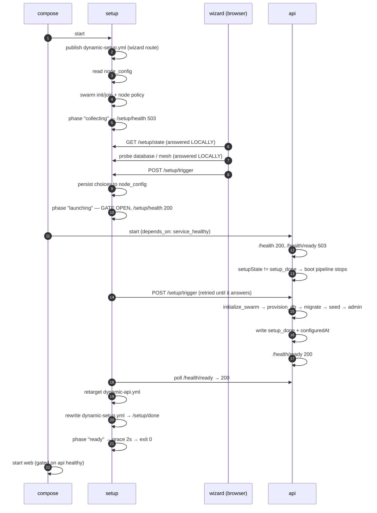

# App Startup Flow — Complete Walkthrough

> What happens, in order, from `docker compose up` to a converged platform. Every participant,
> every gate, every failure path.
>
> Companion to `apps/doc/content/docs/deployment/startup-order.mdx` (the diagrams per profile) and
> `docs/setup-app-refactor-plan.md` (the design record).

---

## 1. The three participants

| Process | Lifetime | Job |
|---|---|---|
| **`traefik`** | permanent | the only thing on the entry port (80). Routes by `Host` from files on a shared volume. |
| **`setup`** | **one-way** — starts, onboards, exits 0 | founds/joins the swarm, serves the wizard, opens the gate, watches the API, hands over, exits. |
| **`api`** | permanent | the platform. Provisions Postgres, migrates, seeds, creates the admin, converges supervisors. |

Plus `redis` (infra) and `web` (the dashboard, gated on the API being healthy).

**The one ordering rule:**

```text
setup ──healthy──▶ api ──healthy──▶ web
```

One direction. No edge points backward, so there is no cycle to reason about — and therefore no
process has to tolerate a half-built state.

---

## 2. What each participant knows

State lives in **one** place, because two processes read it:

```
node_config (SQLite, shared volume `${COMPOSE_PROJECT_NAME}_api_local_db_data_dev`)
├── nodeId, strategy
├── databaseUrl              ← written by setup (the wizard's choice)
├── databaseProvisioning     ← "local" (API owns it) | "external" (provided)
├── configuredAt             ← written by the API ONLY after provisioning succeeds
├── setupState               ← "not_started" → "setup_done"
├── swarmConfig              ← the participation decision
└── meshSharedSecret, peerServiceToken, ...
```

**Single-writer rule.** During onboarding, `setup` is the only writer; the API only reads. That is
what makes sharing the file safe without a lock — the API does not exist while setup is writing.

**Which field means what:**

| Field | Written by | Means |
|---|---|---|
| `databaseUrl` | setup | "use this database" (may be `null` = provision one) |
| `configuredAt` | **API** | "provisioning SUCCEEDED" — the honest completion marker |
| `setupState` | **API** | `setup_done` only once the platform actually works |

The distinction matters: a row with a `databaseUrl` but no `configuredAt` is an **interrupted
attempt**, not a finished install. Both apps use the same predicate (`configuredAt && databaseUrl`)
so they can never disagree about whether setup is needed.

---

## 3. First start — a fresh node

### Phase 1 — `setup` boots

1. **Binds `:3016`** (internal only — never published; Traefik reaches it by network alias).
2. **Publishes its own route.** `IngressHandoverService.onApplicationBootstrap()` writes
   `dynamic-setup.yml` pointing `setup.<host>` → `http://setup:3016`.
   *Why first:* without it, `setup.<host>` has no router until the handover, which is minutes later —
   a Traefik 404 on the only page whose purpose is to fix a broken setup.
3. **Reads `node_config`.** No row → the wizard will be shown. Row with `setupState: "setup_done"` →
   the gate opens immediately (see §4).
4. **Phase `awaiting`** → `GET /setup/health` answers **503** (the gate is closed).

### Phase 2 — the swarm

`ClusterOrchestratorService` (RxJS, `concatMap` over a retry `Subject`) calls
`SwarmBootstrapService.bootstrap()`:

- `ensureCluster({ ListenAddr: "0.0.0.0:2377", AdvertiseAddr })` — **`AdvertiseAddr` is required**;
  on a multi-address host Docker refuses to guess (`could not choose an IP address to advertise`).
  Setup resolves it with the same precedence the package uses:
  `SWARM_ADVERTISE_ADDR` → `MANAGED_WIREGUARD_IP:2377` → `127.0.0.1:2377`.
- `participation.converge()` applies the node **policy** (role, labels) — joining alone leaves the
  node unlabelled and therefore excluded by the platform's placement constraints.

The cluster must exist **before the API is scheduled**, because the API's supervisors schedule their
services onto it.

**Phase `clustering` → `collecting`.**

### Phase 3 — the wizard serves

`GET setup.deployer.localhost` → Traefik → `setup:3016` → the SSR wizard page.

The wizard makes its first calls. **These are answered LOCALLY by setup**, because the API does not
exist yet:

| Call | Answered by | Why it cannot go to the API |
|---|---|---|
| `GET /setup/state` | `WizardStateService` | a `node_config` read; the API is not up |
| `GET /setup/node-status` | `WizardStateService` | the same row |
| `POST /setup/probe/database` | `WizardStateService` / port | opens its own `pg` pool, runs `SELECT 1` |
| `POST /setup/probe/mesh` | reachability | a network probe of the peer's `/mesh/ping` |
| `POST /setup/trigger` | **the API** | it IS what starts provisioning |
| `GET /setup/stream` | **the API** | it reports API work |

> **This is the split that makes the flow possible.** Proxying `/setup/state` would mean the
> operator's first page load asks a question only a process that has not started yet could answer —
> a race the architecture guarantees to lose.

### Phase 4 — the operator submits → THE GATE OPENS

`POST /setup/trigger` arrives. Before forwarding it, the controller calls `SetupGateService.open()`:

1. **Persists** the choices into `node_config`:
   - `databaseUrl` = the operator's URL, or `MANAGED_GLOBAL_DB_URL`, or `null` (= provision one);
   - `databaseProvisioning` = `"external"` if a URL was provided, else `"local"`;
   - `setupState` stays **`not_started`** — the operator stated an intent, not a completed install.
2. **Retains** the trigger payload in memory (it carries the admin password — deliberately not
   written to the shared plaintext SQLite file).
3. **Publishes phase `launching`** → `GET /setup/health` answers **200 — THE GATE IS OPEN.**

`isReady()` returns true from `launching` **onward** (it stays true through
`provisioning`/`handover`/`ready`), because compose re-probes continuously — a dip to 503 would tear
the API back down mid-boot.

### Phase 5 — compose starts the API

`api-dev` has `depends_on: setup-dev: { condition: service_healthy }`, so compose now starts it.

**Prod is the same decision, expressed differently:** the API is not a compose service, so
`HandoverOrchestratorService` (triggered by the gate edge) calls
`ApiServiceProvisioner.ensureApi()` → `createSwarmService({ Image: DEPLOYER_API_IMAGE, Mounts:
[api_local_db_data_dev:/app/data] })`.

### Phase 6 — the API provisions itself

The API boots and `main.ts` binds the port. `/health` answers **200 immediately**; `/health/ready`
answers **503**. Then:

1. `BootstrapOrchestratorService.onApplicationBootstrap()` reads `node_config`.
   - **`setupState !== "setup_done"` → it STOPS and logs why.** On a fresh install the **wizard**
     owns the first provisioning: the operator's credentials are in the trigger, not the
     environment, so running the boot pipeline here would create an admin from `DEFAULT_ADMIN_*`
     defaults that nobody chose — and would race the wizard's own `migrate`.
2. **Setup delivers the trigger:** `HandoverOrchestratorService.deliverTrigger()` POSTs to
   `/setup/trigger`, retrying while the API boots (bounded by the same 5-minute timeout).
   *A 4xx is NOT retried* — a reachable API refusing the request cannot be fixed by resending it.
3. The API runs `LocalInitializationService`:
   `initialize_swarm → provision_database → ensure_empty → run_migrations → seed_initial_data →
   register_node → finalize`.
   - `databaseUrl === null` → it provisions its own Postgres 16 as a **swarm service**;
   - `databaseProvisioning: "external"` → it uses the provided URL and never supervises it.
4. **`register_node` writes the completion**: `setupState: "setup_done"`, `configuredAt: now`.
5. `lifecycle → READY` → **`/health/ready` answers 200.**

Progress reaches the browser as SSE: the API produces the events, setup forwards the frames
verbatim (honouring `Last-Event-ID`).

### Phase 7 — handover, then exit

Setup observes `/health/ready` → 200 and runs the ordering invariants in order:

1. `dynamic-api.yml` retargeted at the API — **before** waiting, so `api.<host>` changes BACKEND
   and never existence (a missing router is a 404).
2. `dynamic-setup.yml` **rewritten** (never deleted) → `setup.<host>` now serves the API's
   `/setup/done` page. Rewriting rather than deleting means the hostname is continuously
   answerable: an operator who bookmarked the wizard gets a page, not a Traefik 404.
3. **Phase `ready`** → 2-second grace (Traefik reload + final stream frames).
4. **Exit 0.** `restart: on-failure` means a successful exit stays exited — `unless-stopped` would
   restart it and loop onboarding forever.

Then `web` starts (gated on the API's `/health/ready`), and the platform is converged.

---

## 4. Restart — setup already done

**The same flow, minus the wizard.** One code path, not two modes:

1. **`setup` boots**, writes its route, and reads `node_config`.
2. `setupState === "setup_done"` → `SetupGateService.onApplicationBootstrap()` opens the gate
   **immediately**, and deliberately **does not re-persist** — overwriting from an empty payload
   (a restart passes none) would erase the `databaseUrl` and `swarmConfig` the API is about to read.
3. Cluster re-converges (idempotent).
4. **The API starts** and this time `setupState === "setup_done"`, so `BootstrapOrchestratorService`
   **does** run: swarm app wiring → DB probe → pending global migrations (idempotent) → default
   admin (`ADMIN_BOOTSTRAP`, default `always`).
5. There is no trigger to deliver (`triggerPayload()` is `null`), so setup goes straight to watching
   `/health/ready`.
6. Handover → rewrite the setup route → exit 0.

**Nothing is re-provisioned from scratch.** Migrations and seed are idempotent, so the API applies
only the delta.

---

## 5. Failure paths

| What fails | What happens | Why that is right |
|---|---|---|
| **Swarm init/join** | phase `failed`; `/setup/health` stays 503; the wizard shows the reason and a retry | a failed setup MUST stay reachable — it is the only surface that can fix it |
| **The API never becomes ready** | after 5 min, phase `failed`; setup does **not** exit | exiting would leave a dead container and no retry surface |
| **`/setup/trigger` returns 4xx** | handover fails immediately, no retry | a reachable API rejecting the payload cannot be fixed by resending it |
| **The API is unreachable while delivering** | retried every 2s until the deadline | the first attempts land on a container that is still booting |
| **The ingress write fails** | phase `failed`; the setup route is NOT rewritten | the wizard the operator retries from must not be replaced by a done page for a platform that is not done |
| **Setup's own first route write fails** | logged at ERROR, **non-fatal** | throwing would restart-loop a container that still cannot route; the handover retries the same write |

**The one state that never happens:** the API serving on a half-provisioned platform. It starts only
after the gate, and it reports `ready` only when every indicator is up.

---

## 6. What each primitive is used for, and why

Setup deliberately reuses the platform's primitives where they fit, and deliberately does not where
they would be a second implementation or dead weight.

| Primitive | Used by setup? | Why |
|---|---|---|
| `@repo/nest-env` (`forRoot({ schema })`) | **yes** | mechanism shared, contract per app (`setupEnvSchema` — 24 vars, none of the API's) |
| `@repo/nest-swarm` | **yes** | `SwarmClusterService`, `SwarmParticipationService` via `forRootAsync` |
| `@repo/nest-docker` | **yes** | the engine client + `createSwarmService` (prod) |
| `@repo/nest-nodes` | **yes** | `NodeConfigRepository` — reads *and writes* of the shared row |
| `@repo/nest-database-local` | **yes** | the SQLite connection, with the app supplying path + migrations |
| `@repo/nest-schema` | **yes** | the table definitions (and the migrations that create them) |
| `@repo/logger`, `@repo/errors` | **yes** | no `console.log`, no bare `Error` |
| `@repo/ui` | **yes** | the wizard components, shared with the web app — one implementation |
| oRPC **client** (`@orpc/client`, `@orpc/tanstack-query`) | **yes** | the view layer is typed end-to-end against `AppContract` |
| oRPC **server** (`ORPCModule`) | **no — deleted** | setup implements **zero** procedures. Registering a router with no procedures loads a module whose only effect is to route nothing. The contract's value here is on the CLIENT side. |
| `@repo/nest-lifecycle` | **no** | its vocabulary is "one process booting: config → DB → mesh → serving". Setup's machine answers "may the API start yet?" — a statement about *another* process. Folding them together would push the API's bootstrap vocabulary into setup's public readiness contract, which compose parses. |
| `ReadinessStateService` (event-driven aggregation) | **no** | The API needs it because it has *many* expensive dependencies (DB, swarm, 5+ supervisors, mesh) that must not be probed on the request path. Setup has **one input** and its indicator is already a cache read of `state$.value` — no I/O, nothing to aggregate. |
| `@repo/nest-events` | **no** | provisioning events are produced by the API; setup forwards the frames verbatim, which is cheaper and cannot drift |
| Supervisors | **no** | setup does not exist when most platform services are scheduled |

### 6.1 Where setup *is* event-driven

The claim "setup polls" is only half true, and the distinction matters:

| Component | Mechanism | I/O on the request path? |
|---|---|---|
| `SetupPhaseService` | `BehaviorSubject` (state) + `Subject` (edges), RxJS | none — the gate reads `state$.value` |
| `SetupReadinessIndicator` | reads `phases.current()` | **none** — a cache read, same property the API's readiness has |
| `ClusterOrchestratorService` | `Subject` + `concatMap` + `shareReplay` + `timer(0)` | n/a — one boot attempt, retryable |
| `HandoverOrchestratorService` | triggered by the gate **edge** (`onEnter("launching")`) | n/a |
| `WizardStreamService` | `takeUntil(clientGone)` | n/a |
| **`ApiReadinessWatcherService`** | **`timer(0, 2000)` → polls `/health/ready`** | n/a — it is the watcher |

**The one poll is deliberate and must stay.** Setup's readiness question is about a **different
process**, and HTTP is the only channel between them: the API's readiness is assembled from *its*
Postgres pool, *its* swarm state and *its* supervisor snapshots — none of which setup can observe
locally (it has no Postgres client and supervises nothing). Subscribing "locally" would mean
shipping the schema and auth stack into the pre-auth app, or inventing a second opinion about
someone else's health.

The API publishes readiness as an HTTP **status code**, so the status is the entire contract — no
body parsing, no way for the two sides to disagree about what "ready" means. `switchMap` cancels an
in-flight probe so a slow API cannot accumulate overlapping requests.

---

## 7. Sequence, condensed



---

## 8. Debugging: what to look at

| Symptom | Where to look | Likely cause |
|---|---|---|
| `setup.<host>` gives a Traefik 404 | `docker exec traefik cat /config/dynamic-setup.yml` | setup has not written its route yet, or the config volume is not shared |
| `/setup/state` returns 503 | setup logs | the API is down AND the path is still being proxied — it should be answered locally |
| `api-dev` never starts | `docker inspect <setup>` → health status | the gate is closed: the wizard has not been submitted |
| Setup stuck on `collecting` | the wizard page | waiting on the operator, not on a process |
| `could not choose an IP address` | setup logs | `SWARM_ADVERTISE_ADDR` not resolved |
| `/health/ready` never 200 | `api` logs → which indicator is `down` | one component is not converged; the payload names it |
| Setup exited but the platform is down | `/setup/health` was 200 | it exits only on `ready`; check `dynamic-api.yml` |
