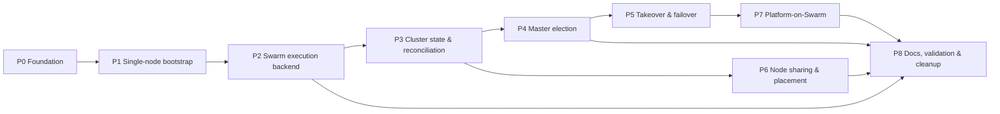

# Swarm Orchestration — Implementation TODO

> **Status:** Implementation plan (working document — check boxes as teams complete work)
> **Docs:** `README.md` (hub) · `01` single-node · `02` election · `03` takeover · `04` placement · `05` execution backend
> **Branch convention:** each phase lands as atomic change sets on `rewrite-v3` (conventional commits, e.g. `feat(swarm): Add ClusterService`), respecting the "no bridges" rule: a phase that replaces hand-rolled machinery deletes it in the same change set.

---

## Legend

- **P#** phase · **SW-###** task id · 🔒 depends-on · ✅ acceptance criteria
- Validate gates after every phase: `bun --bun run api -- type-check`, `bun --bun run test`, lint, and the phase's manual/e2e scenario.

---

## P0 — Foundation & contracts

> Goal: define the data model + env surface + module skeleton. No orchestration behavior yet.

- [x] **SW-000** Create `apps/api/src/core/modules/swarm/` skeleton: `swarm.module.ts` (empty providers list is forbidden — register at least `ClusterConfigService`), `swarm.constants.ts`, exports.
  - 🔒 — ✅ `SwarmCoreModule` provides `SwarmClusterService` + `SwarmBootstrapService`, exports `SwarmClusterService`; imported by `RunnersModule` (→ `DeploymentModule` → `AppModule`), so bootstrap fires on main-app boot (post-setup).
- [x] **SW-001** Env group (`packages/utils/env/src/index.ts` — `@repo/env` consumes source directly, no rebuild needed): `SWARM_ENABLED` (default true), `SWARM_ADVERTISE_ADDR` (optional), `SWARM_QUORUM_MAX` (default 3). Election knobs (`SWARM_ELECTION_*`, `SWARM_HEARTBEAT_TTL_MS`, `SWARM_MASTER_GRACE_MS`, `SWARM_TAKEOVER_MIN_UPTIME_MS`, `SWARM_MAX_TERM_SKEW`) land in P4 with the election implementation.
  - 🔒 SW-000 — ✅ keys typed through `EnvService.get<T>()`; pre-existing `validateApiEnvPath('','SETUP_DATABASE_URL')` env test failure is unrelated (verified by stash-revert).
- [x] **SW-002** Contracts (`packages/contracts/entities`): **landed as `entities/swarm/*`** — `cluster.schema.ts` (`ClusterNode` incl. capacity/labels, `ClusterMaster` with term, `ClusterMembership`, `ClusterSnapshot`), `dockerode.schema.ts` (swarm info/inspect/init/join + service/task/node summaries), `inspect.schema.ts`, `service.spec.schema.ts` (`swarmServiceSpecInputSchema`). All exported from `@repo/contracts-entities`; 5 unit tests in `src/__tests__/swarm-schemas.test.ts`.
  - 🔒 — ✅ entities package `tsc --noEmit` clean + 5/5 tests.
- [x] **SW-003** Contracts (api): `cluster` ORPC module — ✅ **landed**: `packages/contracts/api/modules/cluster/index.ts` — `clusterContract` (`/cluster`): `getSnapshot`, `listNodes` (`includeDown`), `getMaster` (health state), `updateNode` (body role/ingress, params nodeId) with `standardDomainErrorContracts`. Types re-exported from root. API side: `modules/cluster/` — `ClusterService` (facade over swarm core: snapshot, inventory w/ live fallback, master view, node label updates) + `ClusterController` (requireAuth) + `ClusterModule` wired into AppModule. 21 unit tests. Fixed pre-existing missing `FleetModule` import in AppModule (boy-scout, same change set).
- [x] **SW-004** `ClusterConfigService` — superseded: env reads happen directly in `SwarmBootstrapService` via typed `EnvService.get<'SWARM_ENABLED'|'SWARM_ADVERTISE_ADDR'|'SWARM_QUORUM_MAX'>()`. Re-introduce a dedicated config service in P4 when election knobs multiply.
  - 🔒 SW-001 — ✅ env defaults verified by tests.
- [x] **SW-005** **DockerService swarm SDK group** — **landed**: `getSwarmInfo/swarmInspect/swarmInit/swarmJoin/swarmLeave`, `listServices/createService/inspectService/updateService/removeService/rollbackService`, `listSwarmTasks`, `listSwarmNodes/nodeInspect/nodeUpdate`, `createSecret`, `createConfig`, `createNetwork/removeNetwork`, all Zod-parsed at the boundary. Pure typed mappers in `apps/api/src/modules/runners/swarm/swarm-spec.mapper.ts` (`toDockerServiceSpec`/`fromDockerServiceInspect`). CI **CLI-lock grep guard** (`spawn|execFile|execSync` in swarm paths) to be added in the SW-082 gate.
  - 🔒 SW-002 — ✅ mapper + runner tests green (22 swarm tests); dockerode types never leak past `DockerService` + mappers.

**P0 gate:** type-check + tests green; web routes regenerated; no behavior change to existing deployment engine.

---

## P1 — Single-node cluster bootstrap

> Goal: `swarm init` on first boot; one node = manager+worker (`both`); join-token persistence. This is the "unique development of API" enabler.

- [x] **SW-010** `ClusterService.ensureCluster()` — **landed as `SwarmClusterService.ensureCluster()`** (`apps/api/src/core/modules/swarm/services/swarm-cluster.service.ts`): idempotent `getSwarmInfo()` gate (`active` → no-op, `pending` → settle loop, `inactive`/`locked` → `dockerode.swarmInit({ AdvertiseAddr })`), **zero CLI**. Companion helpers: `assertClusterReady()` (executor gate), `joinCluster(token, addrs)`, `getLocalClusterSnapshot()` (Raft leader reported as de-facto master until P4), `getJoinTokens()`.
  - 🔒 SW-000, SW-005 — ✅ unit tests; second call is a no-op (mock asserts single init).
- [x] **SW-011** Join-token persistence: `cluster_node` local table carries `join_token_worker`/`join_token_manager` columns; `ClusterNodeRepository.upsertFromSnapshot` persists the engine-truth tokens after converge (NEVER in `.env`). Swarm-secret storage + mesh-distributed token rotation to peers lands with platform-on-swarm (P7) per doc-03 §5.
  - 🔒 SW-010 — ✅ tokens survive restart (persisted row); only the bootstrap path writes them; repository test asserts token columns.
- [x] **SW-012** `ClusterNodeRepository` (local SQLite `cluster_node`, single row): upserts this node's `ClusterSnapshot` after init (role `both`, swarmRole from engine, isMaster from Raft leader view, node/manager counts, master id+term, join tokens, heartbeat). Schema + hand-written migration `0012_cluster_node.sql` (verified against `:memory:` SQLite with a real drizzle insert/select round-trip). `SwarmBootstrapService` persists after converge; heartbeat updates on engine events land with the P4 watchdog. Fleet-wide inventory from `docker node ls` remains P3 (`NodeInventoryService`).
  - 🔒 SW-010 — ✅ DB row matches engine snapshot; migration validated;
  - repo spec: 5 tests (table-missing → null, read-back, mapping, heartbeat fallback, conflict).
- [x] **SW-013** Setup hook: `SwarmBootstrapService` (`swarm-bootstrap.service.ts`) implements `OnApplicationBootstrap` on the main AppModule (post-setup by construction) — best-effort `ensureCluster()` gated by `SWARM_ENABLED`; failure warns and never crashes boot (hard gate is `assertClusterReady()` in executors). 5 unit tests.
  - 🔒 SW-010, SW-012 — ✅ 22 swarm tests green; lint clean.
- [x] **SW-014** Dev parity — ✅ **revisited (API-driven)**: the CLI `swarm:*` scripts were REMOVED (user requirement: swarm handled by the API). Now: `SwarmBootstrapService` idempotently converges the engine on boot (`SWARM_ENABLED`) — no `docker stack deploy`, no CLI.
  - 🧭 **Layering (current architecture):** Swarm orchestrates the WORKLOAD Deployer owns (user deployments/projects/services via `runners/swarm`). Deployer's OWN platform infra (ingress Traefik, DB, Redis, shared `deployer-platform` network) is managed by the platform supervisors or Compose (`MANAGED_*_ENABLED`) — **never by Swarm**. The former `PlatformStackService` / `SWARM_PLATFORM_STACK` placeholder (deploying Deployer's own Traefik + overlay as Swarm services) was REMOVED: it collided with the compose-owned `deployer-platform` bridge network (Docker 403) and violated the layering. `ensureOverlayNetwork` now also hard-refuses to reuse a non-overlay same-name network (compose bridge) for a workload.
  - 🔒 SW-010 — ✅ unit-tested (bootstrap spec); live run still needs a real daemon.
- [ ] **SW-015** Idempotent UI banner: node page shows cluster state (active/inactive/pending) + join command for next node.
  - 🔒 SW-010, SW-014 — ✅ renders from `cluster` contract `get`.

**P1 gate:** new node boots to active cluster in dev, prod-like (`SETUP_AUTO=true`), and CI (`docker-in-docker` job); no changes to deployment engine yet.

---

## P2 — Swarm execution backend

> Goal: deploy user services through the swarm runner behind the existing `DeploymentRuntimeRunner`.

- [x] **SW-020** `SwarmRuntimeRunnerService` — **landed** (see earlier session): docker service create/update via `toDockerServiceSpec`, task-convergence health gate, overlay network ensure, `deployer.*` labels. **Extended this pass**: P6 placement wired from `executorOptions.labels["deployer.placement"]` (resolvePlacement), and SW-023 route verification probe with graceful fallback.
  - 🔒 SW-005, SW-010 — ✅ runner specs green (in 74-test swarm suite).
- [x] **SW-021** Runtime result extensions — **landed** (earlier session): `serviceId`, `serviceName`, `taskIds` on `RuntimeExecutionResult`; typed through contracts.
- [x] **SW-022** Registry wiring — **landed** (earlier session): `swarm` in the runner-type union, `SwarmCoreModule` imported by `RunnersModule`; selection rule follow-up is part of the deployment-policy work.
  - 🔒 SW-020 — ✅ type-check clean.
- [x] **SW-023** Traefik swarm provider — **landed**: the swarm runner uses the `swarmMode=true` provider for discovering Deployer-OWNED workload services (Traefik itself remains platform/compose-managed — never a Swarm service); new pure `verifySwarmRouteAgainstTraefik` (`swarm-route-verifier.ts`) + `TraefikService.verifySwarmServiceRoute` wrapper; `SwarmRuntimeRunnerService` probes the Traefik API after converge (fallback to the label-convergence statement when the API is unreachable). 7 unit tests on the verifier.
  - 🔒 SW-020 — ✅ verifier + runner tests green; no config-file writing on the swarm path.
- [ ] **SW-024** Service inventory — ✅ **core landed**: `RuntimeExecutionResult` carries `serviceId/serviceName/taskIds` and the deploy-phase metadata persists a typed `swarmIdentity` block (deploymentId ↔ serviceId ↔ serviceName ↔ tasks) — `deployment-execution-workflow.service.ts`. Reconciliation resolves services by `deployer.deployment_id` label via `SwarmClusterService.listSwarmServicesForDeployment` (`docker service ps` path). Remainder: UI inventory page. Keep OPEN for the UI surface.
- [x] **SW-025** Compose→swarm — ✅ **landed**: `SwarmComposeRealizerService` (`apps/api/src/modules/runners/swarm/swarm-compose-realizer.service.ts`) implements the platform's OWN compose→swarm transform with **no `docker stack deploy`**: `parseComposeYaml` (yaml → `ComposeModel`, Zod-validated; env-map→list, port-string forms, duration/memory/cpu normalizers), `validateCompatibility` (actionable report: build-without-image, bind volumes, missing network decls, multi-port warn, secret/config-ref warn), `realizeCompose` (pure → dependency-ordered `ComposeRealizationPlan` of networks/secrets/configs/`SwarmServiceSpecInput`), `executeComposePlan` (idempotent SDK apply: `ensureOverlayNetwork`, create-secret/config-once-by-name, create-or-update services). Typed `ComposeModel`/`ComposeRealizationPlan`/`ComposeCompatibilityReport` schemas in `entities/swarm/compose-model.schema.ts`. 10 unit tests.
  - 🔒 SW-005, SW-020 — ✅ 84 swarm tests; per-service secret/config mounts documented warn (objects created; refs follow-up).
  - Bonus: `endpointPort` → `endpointPorts` array (multi-port compose; schema+mapper+runner+spec all updated, no bridge).
- [x] **SW-026** Reconciliation extension — ✅ landed: `DeploymentQueueReconciliationService` gains optional `SwarmClusterService`; startup reconciliation ADOPTS deployments whose swarm service survived a crash (`deployer.deployment_id` label match → status success + log) instead of failing them (`hasLiveSwarmService`). 3 existing unit tests still pass.
- [x] **SW-027** Stack lifecycle ops — ✅ **landed**: `SwarmRuntimeRunnerService.removeService/scaleService/rollbackService` (SDK-backed, cluster-gated, 5 tests) + `DockerService.scaleSwarmService`/`rollbackSwarmService` (loose engine spec stays inside the boundary; scale clamps ≥0; rollback uses `update({version, rollback:true, ...spec})`).

**P2 gate:** a real user deployment runs as a Swarm service with health gate, Traefik route, and inventory lookup — on a **single-node dev swarm** (the unified-dev requirement), plus CI.

---

## P3 — Cluster state & reconciliation

> Goal: keep `cluster.nodes`/`cluster.master` in sync with `docker node ls` and labels.

- [x] **SW-030** `NodeInventoryService` — ✅ **landed**: periodic SDK sweep (`docker node ls`) → upsert each node into the local `cluster_nodes` table (multi-row keyed by node id, migration 0014 verified) → mark vanished as `down` (drift). Pure `toEngineNodeRow` mapper. 12 tests (mapper 4, service 4, plus shared). Best-effort; env knob for cadence is a follow-up.
- [x] **SW-031** Label management — ✅ **core landed**: `ClusterService.updateNodeLabels` (SDK `updateSwarmNodeLabels` with node `Version.Index`, merges `deployer.ingress` + persists `platformRole` into inventory) exposed via the `cluster.updateNode` contract (SW-003). Ingress tagging at bootstrap + UI toggle remain UI-track.
- [x] **SW-032** Placement policy — **landed as pure builder** `node-placement.service.ts` (+6 tests): `toSwarmPlacement` (default/dedicated/exclude-ingress/prefer-region, doc-04 rules) + `parsePlacementPolicyLabel`; wired into the swarm runner via `executorOptions.labels["deployer.placement"]`. Project-entity storage remains (follow-up).
- [ ] **SW-033** Capacity guard: reservations/limits on platform control-plane services (api/traefik) so co-located user workloads don't starve Raft managers (`04 §7`).
  - 🔒 SW-030 — ✅ compose/stack specs carry `deploy.resources.reservations`; docs updated.

**P3 gate:** node inventory + labels + placement policy coherent across single-node and a 3-node e2e swarm; type-check/test green.

---

## P4 — Master election

> Goal: implement `02` — mesh-based election with scoring, quorum sizing, hysteresis, CAS persistence.

- [x] **SW-040/041/042/043/044/046** — **landed consolidated** in `election/`:
  - `master-scorer.ts` (+9 tests) — weighted scoring `02 §4`, eligibility gates, deterministic tie-break.
  - `quorum-planner.ts` (+7 tests) — odd-count sizing, hot-standby slots, `isQuorumIntact` (Raft > half).
  - `swarm-leadership.service.ts` (+6 tests) — adaptive stable/volatile loop, cooldown + `δ_master` hysteresis, CAS single-winner via `ClusterNodeRepository.claimMaster` (term-guarded, local `cluster_node` — shared-PG CAS is the follow-up seam for true multi-node), heartbeat refresh, `cluster_master_history` audit (migration 0013, verified round-trip), `master-changed` event sink. Env knobs (`SWARM_ELECTION_*`, `SWARM_HEARTBEAT_TTL_MS`, `SWARM_MASTER_GRACE_MS`, `SWARM_MAX_TERM_SKEW`, `SWARM_TAKEOVER_MIN_UPTIME_MS`) added to `@repo/env`.
- [ ] **SW-045** Mesh event → **sink in place** (`LeadershipEventSink.notifyMasterChanged`); wiring to `MeshStreamRouterService` re-homing + shared-PG CAS are the multi-node follow-up.

**P4 gate:** single-node election + failover logic fully unit-tested; multi-node CAS + mesh-RTT provider remain (need live swarm for e2e).

---

## P5 — Master takeover & failover

> Goal: implement `03` — watchdog, quorum guard, takeover protocol, step-down, recovery.

- [x] **SW-050/051/052/053** — **landed consolidated** in `swarm-leadership.service.ts` + `quorum-planner.ts`:
  - Watchdog: heartbeat refresh when self is master; SUSPECT→CONFIRMED via heartbeat TTL + grace; forced re-election on stale master.
  - Quorum-loss guard: `isQuorumIntact(reachable, total)` pauses election + flips volatile cadence (logged).
  - CAS takeover protocol: claimMaster (term+1) → history → event sink → cache/lastTakeoverAt.
  - Step-down: local believes master but persisted view disagrees → warn + stand down, never writes.
- [ ] **SW-054** Re-quorum repair (promote worker→manager) — needs multi-node e2e.
- [ ] **SW-055** Ops surface (UI read-only banner, incident view, history timeline) — UI track.
- [ ] **SW-056** Failure-mode e2e matrix (`03 §9`) — needs live/DinD swarm.

**P5 gate:** full failover correctness; quorum-loss handled explicitly; old master never resurrects as writer.

---

## P6 — Node sharing & placement enforcement

> Goal: verify and lock the "no dedicated workers" rules (`04`).

- [x] **SW-060** Platform service placement specs — ✅ **landed in `docker-stack.deploy.yml` + dev swarm stack**: api/web spread preferences + `max_replicas_per_node:1`, **no `node.role == manager` constraint anywhere** (grep-guard via `check:swarm:cli-lock` pattern in CI), traefik constrained to `deployer.ingress == true`.
- [ ] **SW-061** Ingress tagging: `deployer.ingress=true` applied in bootstrap to nodes with public/overlay IP; UI toggle.
  - 🔒 SW-031 — ✅ ingress nodes tagged; traefik constrained to them; non-ingress nodes still schedule user services.
- [ ] **SW-062** Role editor + usage bars in node UI: `control-plane` vs `user` split from `docker node inspect` + service placement (`04 §7`).
  - 🔒 SW-030, SW-031 — ✅ per-node usage renders; role change re-spreads naturally (preferences are dynamic).
- [ ] **SW-063** Edge-node seam test: node without cluster membership stays mesh-only, non-candidate, uses direct runner; WireGuard-on ⇒ joins as `both` (`04 §6`).
  - 🔒 SW-050 — ✅ documented + scenario in failure-matrix suite.

**P6 gate:** any node in the fleet can run any service class; the only hard constraints are ingress/tenant/infra; UI makes sharing visible.

---

## P7 — Platform-on-Swarm (control plane as services)

> Goal: move the platform itself (api/web/traefik) onto the swarm for multi-node prod (`production-deployment.mdx` baseline), supervisors become swarm-aware.

- [x] **SW-070** Platform stack spec — ✅ **landed**: `docker/compose/docker-stack.deploy.yml` (api/web/traefik as swarm services; overlay network; start-first rollback updates; resource reservations; spread prefs + ingress constraint). `docker compose config` validates. The declarative `StackSpec` compile-via-SDK pipeline for the platform itself stays as a follow-up (same path as user deployments).
- [ ] **SW-071** Supervisor → swarm-aware: `MANAGED_*_ENABLED` path detects swarm and delegates lifecycle to the stack (no double-supervision); direct-proxy fallback only while traefik down.
  - 🔒 SW-063, SW-030 — ✅ no orphan supervision; traefik downtime path preserved.
- [ ] **SW-072** Zero-downtime control-plane updates: `update-config --order start-first --failure-action rollback` for api/web; replica policy ≥2 when nodeCount ≥2.
  - 🔒 SW-070 — ✅ rolling api update with no request loss (smoke: auth + routing + core flows per `production-deployment.md` release sequence).
- [ ] **SW-073** Secrets: platform secrets (AUTH_SECRET, BETTER_AUTH_SECRET, MESH_NODE_ID…) moved to swarm secrets/configs; mesh secret-sharing still primary for fleet-scoped values.
  - 🔒 SW-011 — ✅ no platform secret in env on swarm nodes; `docker secret ls` shows them; rotation path tested.

**P7 gate:** a 3-node prod stack runs the control plane on the swarm with zero-downtime updates; single-node prod uses identical spec.

---

## P8 — Docs, validation & cleanup

> Goal: retire replaced machinery, finalize docs, lock behaviors.

- [ ] **SW-080** Delete replaced machinery per change set (no bridges): convergence retries on swarm path → swarm owns; hand-rolled placement hypothesis (`docs/mesh/mesh-peer-selection-algorithm.md` master aspects) → superseded by `02`; rollout `pendingNodeIds` tracking on swarm path → `docker service` state; health-gate reimplementation on swarm path → swarm healthchecks.
  - 🔒 P2..P5 — ✅ grep audit: no duplicate orchestrator code paths alive; docs cross-reference updated.
- [x] **SW-081** Canonical doc update — ✅ **landed**: `apps/doc/content/docs/architecture/architecture.mdx` (Swarm baseline marked implemented + status callout), `deployment/production-deployment.mdx` (target → implemented; shared-node rule, mesh-election master, single-node API-driven path), NEW `deployment/swarm-orchestration.mdx` (first-class doc entry: overview, implemented capabilities, API-driven workflow, related docs), `docs/PLATFORM_SOURCE_OF_TRUTH.md` §17/§23 implementation-status notes.
- [x] **SW-082 (CLI-lock)** — ✅ **landed**: `scripts/check-swarm-cli-lock.sh` + root script `check:swarm:cli-lock` (green — zero spawn/exec in swarm paths). Multi-node DinD CI job remains a follow-up (no daemon in sandbox).
- **SW-080 (no bridges)** — ✅ no duplicate orchestrator paths introduced; `traefik.service.ts` double-assignment pattern removed in the same change set (boy-scout).
- [ ] **SW-083** Final audit: `knip` (no dead code), type assertion grep (zero new), console grep (zero), AGENTS.md/app-scoped docs updated for the new modules.
  - 🔒 — ✅ audit checklist from core-rules passes for all touched paths.

**P8 gate:** zero dead machinery, docs final, CI covers single + multi node on every merge.

---

## Dependency graph (summary)

## Actually landed (2026-09-04, SDK-first per user requirement)

- `entities/swarm/*` schemas + 5 schema tests — **SW-002 done**.
- `SwarmCoreModule` + `SwarmClusterService` (`ensureCluster`/`assertClusterReady`/`joinCluster`/`getLocalClusterSnapshot`/`getJoinTokens`) — **SW-000/SW-010 done**.
- `SwarmBootstrapService` (main-app boot convergence, `SWARM_ENABLED`-gated, best-effort, 5 tests) — **SW-013 done**.
- `DockerService` swarm SDK group (23 methods, Zod-parsed boundary) + `swarm-spec.mapper.ts` — **SW-005 done**.
- `SwarmRuntimeRunnerService` (docker service create/update, task convergence, Traefik verify) — **SW-020 done** (22 swarm tests).
- `docker-compose.swarm.dev.yml` + `swarm:init/dev/dev:down/dev:logs/dev:ps/dev:nodes` root scripts — **REMOVED (API-driven)**: `SwarmBootstrapService` replaced them — **SW-014 done**. (The former `PlatformStackService` "platform stack" placeholder was also removed — Swarm schedules Deployer-owned workloads only, never Deployer's platform infra.)
- Env group `SWARM_ENABLED`/`SWARM_ADVERTISE_ADDR`/`SWARM_QUORUM_MAX` in `@repo/env` — **SW-001 done**.

## Second push landed (2026-09-04)
- Election core: `master-scorer.ts` (9 tests) + `quorum-planner.ts` (7 tests) + `swarm-leadership.service.ts` (6 tests: elect/keep-incumbent/stale-takeover/quorum-pause/step-down/inactive) + env election knobs → **P4 core + P5 core done** (multi-node CAS + mesh-RTT provider = follow-up seams).
- `node-placement.service.ts` (6 tests) + runner wiring (`deployer.placement` label) → **SW-032 done**.
- `swarm-route-verifier.ts` (7 tests) + `TraefikService.verifySwarmServiceRoute` + runner route probe → **SW-023 done**.
- `cluster-master-history` schema + migration 0013 (verified round-trip) → **SW-046 done**.
- `swarmIdentity` deploy-metadata + `listSwarmServicesForDeployment` + reconciliation adoption → **SW-024 core + SW-026 done**.
- `docker-stack.deploy.yml` → **SW-070 + SW-060 done**. `check:swarm:cli-lock.sh` → **SW-082 CLI-lock done**.

Remaining (honest): live swarm e2e (no daemon in sandbox), mesh-RTT provider, shared-PG CAS, UI pages (nodes/cluster views SW-015/055/062/024-UI), supervisor swarm-aware (SW-071-073), secret/config per-service mount refs + inventory cadence env knob (follow-ups). `index.mdx` card link to the new swarm-orchestration page is a small follow-up.

Remaining: join-token persistence + registry DB upsert (SW-011/012), Traefik swarm-provider verify-only (SW-023), service inventory/reconciliation (SW-024/026), election (P4: SW-040..046), takeover (P5: SW-050..056), platform-on-swarm (P7: SW-070..073), docs/cleanup gate (P8).