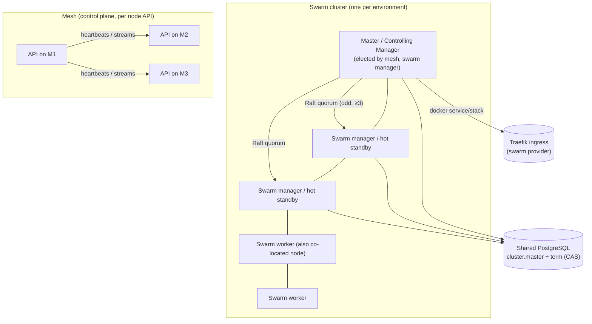

# Swarm Orchestration — Design Hub

> **Status:** Design finalized, implementation pending
> **Scope:** `apps/api/src/core/modules/swarm/**`, `apps/api/src/modules/deployment/runners/swarm/**`, mesh election, cluster state, placement
> **Canonical target:** Docker Swarm manager/worker topology (see `apps/doc/content/docs/architecture/architecture.mdx` → "Docker topology — Swarm baseline")
> **Implementation plan:** [`IMPLEMENTATION_TODO.md`](./IMPLEMENTATION_TODO.md)

---

## 1. Why this exists

The platform currently self-orchestrates container lifecycles: a queue worker, a reconciliation service, health gates, convergence retries, rollout tracking via `pendingNodeIds`/`completedNodeIds`, and a **planned-but-unimplemented** placement algorithm (see `docs/mesh/mesh-peer-selection-algorithm.md` — "Confidence: Hypothesis 🔬 … not yet implemented").

Docker Swarm provides all of that natively:

| Machinery we built by hand | Swarm equivalent |
|---|---|
| `deployment-queue-reconciliation.service.ts` | Swarm desired-state reconciliation loop |
| `enforceReadinessHealthGate` + convergence retries | Service healthchecks + `update-config` failure-action |
| Per-deployment Traefik label sync w/ retries | Traefik *Swarm provider* + Routing Mesh |
| Peer-selection placement algorithm (hypothesis) | Scheduler: constraints, resources, spread, node labels |
| Manual `pendingNodeIds` rollout tracking | `docker service update` (rolling, rollback) |
| — (missing) auto-reschedule on node death | Built-in re-scheduling on node failure |

This design documents how the platform **adopts Swarm as the execution backend** while keeping the mesh as the control plane — including the three requirements:

1. **Single-node unified mode** — a one-node fleet runs a real Swarm cluster (manager + worker on the same node) so the **same API code path** serves dev, single-node prod, and multi-node prod. See [`01-single-node-unified-mode.md`](./01-single-node-unified-mode.md).
2. **Mesh-based master election** — when multiple nodes exist, the platform elects the best Swarm master ("controlling manager") with a weighted scoring algorithm, quorum awareness, and hysteresis. See [`02-master-election-algorithm.md`](./02-master-election-algorithm.md).
3. **Shared nodes** — no node is a dedicated worker: every node runs control-plane and user workloads except where a hard constraint is justified. See [`04-node-sharing-and-placement.md`](./04-node-sharing-and-placement.md).

## 2. Terminology (single source of truth)

| Term | Definition |
|---|---|
| **Swarm cluster** | The Docker Swarm instance created by `docker swarm init`. One per environment/fleet. |
| **Swarm manager** | A node with Raft quorum membership (`docker node ls` shows `Leader`/`Reachable`). Runs the orchestrator. |
| **Swarm worker** | A node joined to the cluster via a worker join-token. Executes tasks only. |
| **Controlling manager (master)** | The single swarm manager elected by the **platform** (mesh election) that owns cluster-level orchestration decisions. "Master" in this repo = this elected node, not the Raft leader (Swarm's own Raft leader can differ transiently). |
| **Eligible node** | Mesh node that is reachable, authenticated, and has a healthy Docker engine with cluster (swarm) connectivity. |
| **Hot standby (candidate master)** | Eligible node kept **as a swarm manager** (quorum member) so it can win an election without promotion latency. |
| **Node role (platform)** | `control` \| `worker` \| `both` (default `both`) — a **placement preference**, not a hard partition. |
| **Quorum** | Odd number of swarm managers, default `min(3, nodeCount)`. |
| **Mesh election term** | Monotonic epoch stored in shared PostgreSQL (`cluster.master.term`). Larger term wins; prevents split-brain. |

## 3. Target topology

Key properties:

- **All nodes are workers AND control-plane hosts.** The swarm managers (quorum) additionally run the Raft control plane, but still schedule user workloads. There are no dedicated worker-only nodes (see `04-node-sharing-and-placement.md`).
- **Exactly one controlling manager** at a time, guarded by a CAS record + term in shared PG. Swarm's own Raft leader may differ transiently; platform writes always go through the elected master.
- **The mesh is the control plane** for the platform: node discovery, heartbeats, stream routing, secret sharing (join tokens), and election.
- **Swarm is the execution backend** for user services and (in multi-node prod) the platform services themselves.

## 4. Architecture layers

| Layer | Existing pieces | Swarm additions |
|---|---|---|
| **Control plane** | Mesh (`SystemMeshTopologyService`, peer sessions, SSE streams, reachability) | Election service, master watchdog, cluster state service |
| **Execution** | `DeploymentRuntimeRunner` (`docker`, `docker-compose`, `dockerfile`, `buildpack`) | `swarm` runner (`SwarmRuntimeRunnerService`) — **SDK-driven via dockerode** |
| **Type boundary** | `packages/contracts/entities/src/entities/docker/` (Zod inspect schemas) | NEW `entities/swarm/` — canonical Zod schemas for service spec / node / task / secret / config / overlay network / cluster volume; pure typed mappers to/from dockerode |
| **Ingress** | `TraefikService` + direct-proxy supervisor | Traefik swarm provider (`traefik.docker.swarmMode: "true"`) |
| **State** | Shared PG + local SQLite + `node_config` | `cluster` table (nodes, master, term, join tokens), `node_role` labels |
| **Bootstrap** | `setup` module, `mesh-orchestration-startup-model` | First-boot swarm init/join automation via `DockerService` (dockerode) |

> **CLI policy:** the API runtime **never** shells out to the `docker` CLI. Every swarm operation goes through the dockerode SDK (`DockerService`), which speaks the exact same Docker Engine HTTP API the CLI uses. CLI commands appear only as documented operator/emergency procedures (e.g. `--force-new-cluster` recovery), never in code.

## 5. Design principles

1. **Same API code path for every node count.** Single-node (manager==worker), 2-node, 6-node — identical bootstrap, election, runner code. No "single-node special case" branches in the API.
2. **Swarm owns placement & convergence; platform owns tenancy & business scheduling.** The queue stays but becomes a business scheduler (quota, environments, approvals, build ordering) — not a placement engine.
3. **Master is elected, not fixed.** No `MESH_NODE_ID`-based "first node is master forever" logic. Election is mesh-based, weighted, quorum-aware, hysteresis-gated.
4. **Takeover is quorum-safe.** A new master only takes over if the Raft quorum is intact; a node that lost leadership never fights back (term + CAS).
5. **No dedicated workers.** `node.role=both` by default; placement preferences over hard constraints.
6. **Replace, don't bridge.** When a Swarm capability lands, the hand-rolled equivalent is deleted in the same change set (convergence retries → Swarm; placement hypothesis → Swarm scheduler; rollout tracking → swarm service state).
7. **SDK-first orchestration, zero CLI.** All swarm control flows through the **dockerode SDK** (`dockerode ^5`, already the engine client via `DockerService`) against the Docker Engine API — the same API the `docker` CLI calls, so nothing is lost. The API runtime never shells out to the CLI; CLI usage is reserved for documented operator/emergency procedures (e.g. `--force-new-cluster` recovery), never in code.
8. **Perfect type safety at the swarm boundary.** dockerode's own types are permissive in places, so the platform never trusts them as the spec: every swarm object (service spec, node, task, secret, config, overlay network, cluster volume) gets a canonical Zod schema in `packages/contracts/entities/src/entities/swarm/`, mapped to/from dockerode's native types with pure, unit-tested mapper functions, and every engine *inspect/list* response is Zod-parsed (parse, don't validate — the same rule as the existing `entities/docker/` container inspect pattern) before entering business logic.
9. **Dev parity.** `DockerService.swarmInit` works on Docker Desktop / one host; a single-node swarm in dev exercises the exact prod code path.

## 6. Modes matrix

| Mode | Cluster size | Swarm role layout | Platform services hosted as | Use |
|---|---|---|---|---|
| `single-node` (dev) | 1 | 1 manager (also worker) | Stack or supervise (unchanged DX) | Local `bun run dev` parity |
| `single-node` (prod) | 1 | 1 manager (also worker) | Swarm stack (or supervisor fallback) | Small self-hosts |
| `multi-node` (prod) | ≥3 | 3+ managers (quorum), all schedulable | Swarm stack spread across nodes | Fleet deployments |
| `edge` (NAT, no overlay) | 1 per host (mesh members) | No swarm membership (or overlay-only) | Supervisor | Firewalled / CGNAT nodes — **out of swarm scope**, see `04-node-sharing-and-placement.md` §6 |

## 7. Document index

| Doc | Content |
|---|---|
| [`01-single-node-unified-mode.md`](./01-single-node-unified-mode.md) | Single-node swarm bootstrap, unified API dev/prod, first-boot flow |
| [`02-master-election-algorithm.md`](./02-master-election-algorithm.md) | Scoring algo, eligibility, quorum sizing, cadence, hysteresis, comparison with peer-selection |
| [`03-master-takeover-failover.md`](./03-master-takeover-failover.md) | Failure detection, quorum-loss guard, takeover protocol, split-brain prevention, recovery |
| [`04-node-sharing-and-placement.md`](./04-node-sharing-and-placement.md) | Shared nodes, role labels, constraints vs preferences, capacity, edge exceptions |
| [`05-swarm-execution-backend.md`](./05-swarm-execution-backend.md) | `swarm` runner, stacks, identity linking, Traefik swarm provider, state reconciliation |
| [`IMPLEMENTATION_TODO.md`](./IMPLEMENTATION_TODO.md) | Complete phased task list (P0–P8) with targets, dependencies, acceptance criteria |

## 8. Relationship to existing docs

- `apps/doc/content/docs/architecture/architecture.mdx` — canonical Swarm baseline (this design implements it).
- `apps/doc/content/docs/deployment/production-deployment.mdx` — target topology, replica policy, Traefik-first ingress.
- `docs/mesh/mesh-peer-selection-algorithm.md` — peer selection for mesh streams; **complementary** to master election (peers ≠ master).
- `docs/mesh/mesh-orchestration-startup-model.md` — startup gate + bootstrap; **superseded** for cluster bootstrap by `01-single-node-unified-mode.md`.
- `docs/PLATFORM_SOURCE_OF_TRUTH.md` §17 (143) and §23 (178) — requires swarm/cluster orchestration baseline; this design satisfies it.