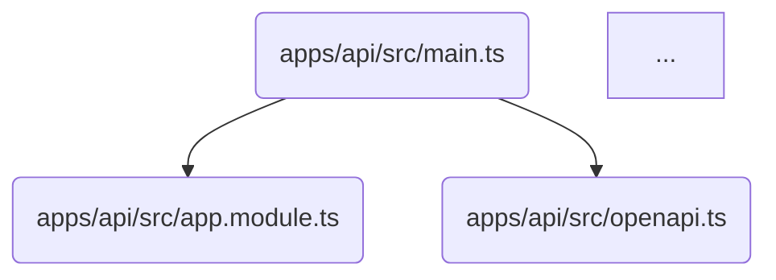

# Import Dependency Analyzer

A TypeScript-based tool to analyze JavaScript/TypeScript import dependencies in your monorepo. It detects all imports (ES6, dynamic, and CommonJS), resolves TypeScript path aliases, and generates both tree and Mermaid diagram visualizations.

## Features

- ✅ **Multi-format Support**: Analyzes `.ts`, `.tsx`, `.js`, `.jsx`, `.mts`, `.mjs`, `.cts`, `.cjs` files
- 🔍 **Smart Import Detection**: 
  - ES6 imports (`import ... from '...'`)
  - Dynamic imports (`import('...')`)
  - CommonJS (`require('...')`)
  - Re-exports (`export ... from '...'`)
- 🎯 **TypeScript Path Alias Resolution**: Automatically detects and resolves `tsconfig.json` path aliases
- 🌳 **Breadth-First Traversal**: Analyzes dependencies level-by-level for clear visualization
- 📊 **Dual Output Formats**:
  - **Tree View**: Hierarchical text-based visualization
  - **Mermaid Diagram**: Graph visualization for documentation
- 🚫 **Excludes External Packages**: Automatically skips `node_modules` dependencies
- 🎨 **Color-Coded Output**: Different icons and colors for different file types

## Installation

The tool is already included in the `@repo/bin` package. Dependencies are automatically installed with:

```bash
bun install
```

## Usage

### Basic Usage

```bash
bun run packages/bin/scripts/analyze-imports.ts --file <path-to-file>
```

### Tree View (Default)

```bash
# Analyze with unlimited depth
bun run packages/bin/scripts/analyze-imports.ts --file apps/api/src/main.ts

# Limit depth to 2 levels
bun run packages/bin/scripts/analyze-imports.ts --file apps/api/src/main.ts --depth 2

# Show detailed information (import counts, out-of-depth files)
bun run packages/bin/scripts/analyze-imports.ts --file apps/api/src/main.ts --depth 2 -v
```

### Mermaid Diagram

```bash
# Generate Mermaid diagram
bun run packages/bin/scripts/analyze-imports.ts --file apps/api/src/main.ts --depth 2 --diagram
```

## Command Line Options

| Option | Alias | Description | Default |
|--------|-------|-------------|---------|
| `--file <path>` | - | Path to the file to analyze (required) | - |
| `--depth <number>` | - | Recursion depth for following imports | `unlimited` |
| `--diagram` | `-d` | Generate Mermaid diagram instead of tree | `false` |
| `--verbose` | `-v` | Show detailed information (import counts, etc.) | `false` |
| `--help` | `-h` | Show help message | `false` |

## Output Examples

### Tree View

```
=== Import Dependency Analysis ===
File: /path/to/apps/api/src/main.ts
Depth: 2
TypeScript Config: apps/api/tsconfig.json

=== Import Tree (Breadth-First) ===
📘 apps/api/src/main.ts
  → 3 import(s)
    📘 apps/api/src/app.module.ts
    📘 apps/api/src/openapi.ts
    📘 apps/api/src/core/modules/auth/services/auth.service.ts
    📘 apps/api/src/app.module.ts
      → 8 import(s)
        📘 apps/api/src/core/modules/database/tokens/database-connection.ts
        ...

=== Statistics ===
Total files analyzed: 15
Total imports found: 52
Missing imports: 0
Unique files visited: 15
```

### Mermaid Diagram



## File Type Icons

The tool uses different icons to represent different file types:

- 📘 TypeScript files (`.ts`, `.mts`, `.cts`)
- ⚛️ React/JSX files (`.tsx`, `.jsx`)
- 📗 JavaScript files (`.js`, `.mjs`, `.cjs`)
- 📄 Other files

## Symbol Legend

When using verbose mode or encountering special cases:

- `✗` - File not found (missing import)
- `○` - File exists but outside depth limit (verbose only)
- `↻` - File already visited (circular dependency)

## How It Works

1. **File Parsing**: Uses `@typescript-eslint/typescript-estree` to parse source files into AST
2. **Import Detection**: Traverses the AST to find all import/require statements
3. **Path Resolution**: 
   - Finds nearest `tsconfig.json`
   - Resolves TypeScript path aliases (e.g., `@repo/types` → `packages/types/src`)
   - Handles relative paths
   - Tries multiple file extensions
4. **Dependency Traversal**: Uses breadth-first search to analyze dependencies level-by-level
5. **Output Generation**: Formats results as tree or Mermaid diagram

## TypeScript Path Alias Resolution

The tool automatically:
- Searches for `tsconfig.json` starting from the analyzed file's directory
- Reads `compilerOptions.paths` and `compilerOptions.baseUrl`
- Resolves path aliases with wildcard support (e.g., `@repo/*` → `packages/*/src/*`)
- Falls back to standard path resolution if no alias matches

## Use Cases

### 1. Understand Module Dependencies

```bash
bun run packages/bin/scripts/analyze-imports.ts --file apps/api/src/main.ts --depth 3
```

### 2. Generate Documentation Diagrams

```bash
bun run packages/bin/scripts/analyze-imports.ts --file apps/web/src/app/layout.tsx --diagram > docs/architecture/web-dependencies.md
```

### 3. Debug Import Issues

```bash
bun run packages/bin/scripts/analyze-imports.ts --file apps/api/src/problematic-file.ts -v
```

### 4. Audit Circular Dependencies

Look for `↻ (already visited)` symbols in the output to identify circular imports.

## Limitations

- **External Packages**: Skips `node_modules` packages (by design)
- **Dynamic Paths**: Cannot resolve computed import paths (e.g., `import(getPath())`)
- **Conditional Imports**: May not accurately represent runtime import behavior
- **Type-Only Imports**: Treats type imports the same as value imports

## Troubleshooting

### "File not found" errors

- Verify the file path is correct
- Check that the file extension is supported
- Ensure TypeScript path aliases are properly configured in `tsconfig.json`

### No imports detected

- File may have no imports (check file contents)
- Parser errors (check console for error messages)
- Unsupported syntax (try updating `@typescript-eslint/typescript-estree`)

### TypeScript config not found

- Ensure a `tsconfig.json` exists in or above the file's directory
- Check that `tsconfig.json` is valid JSON (comments will be stripped automatically)

## Related Tools

- [`check-doc-links.ts`](../../docs/bin/check-doc-links.ts) - Similar tool for analyzing Markdown documentation links
- [`generate-doc-diagram.ts`](../../docs/bin/generate-doc-diagram.ts) - Generates Mermaid diagrams for documentation structure
