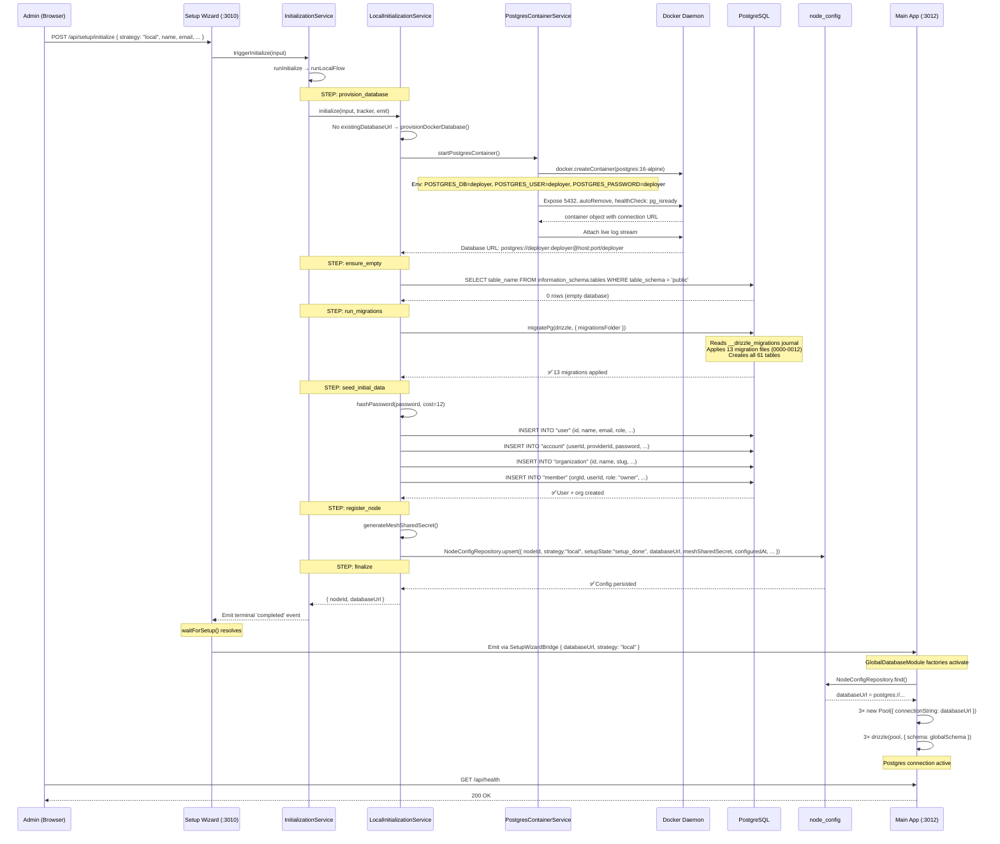
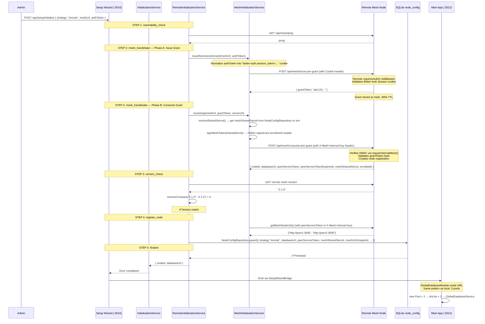
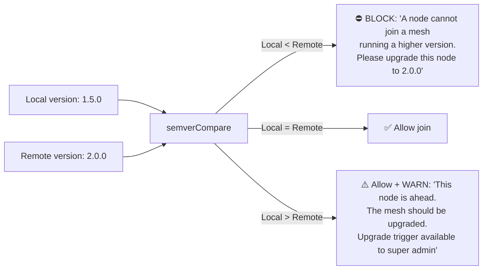
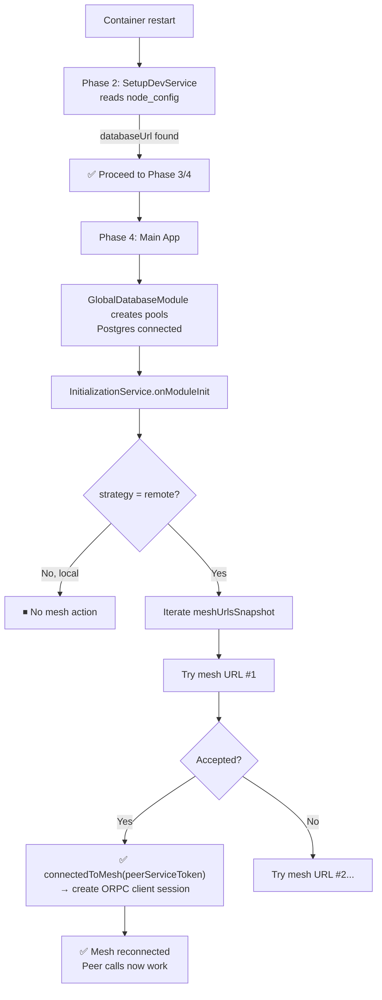
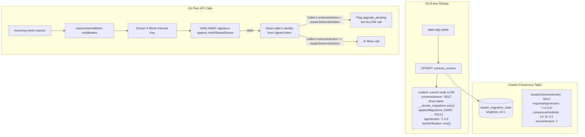
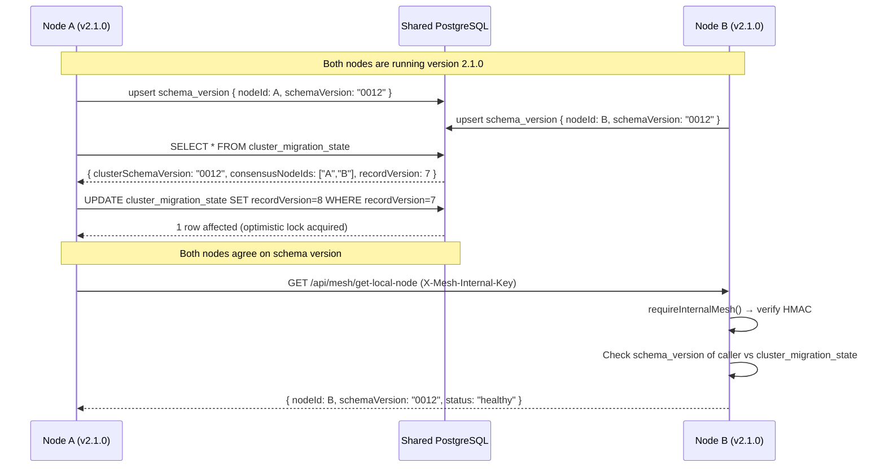
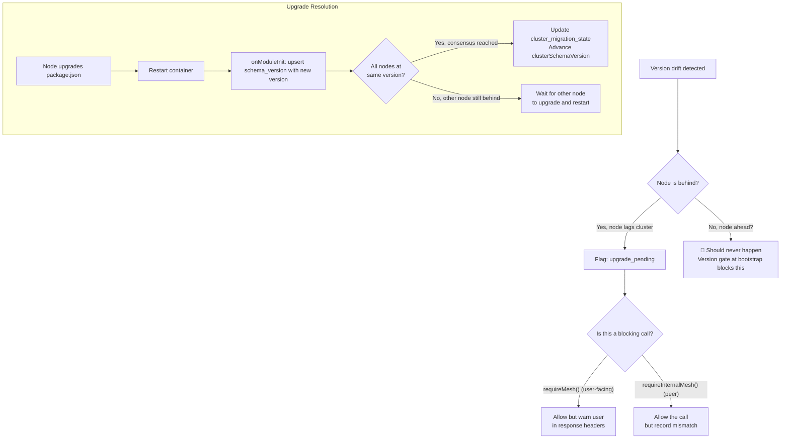
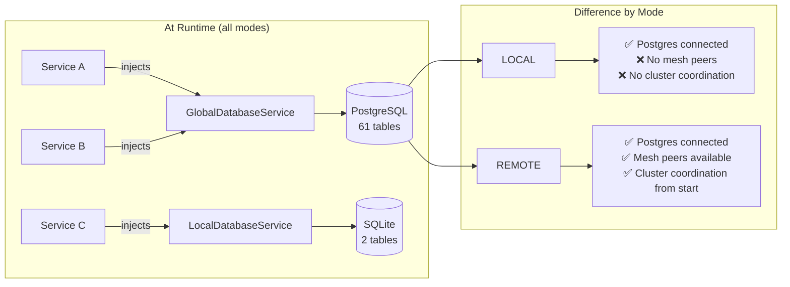
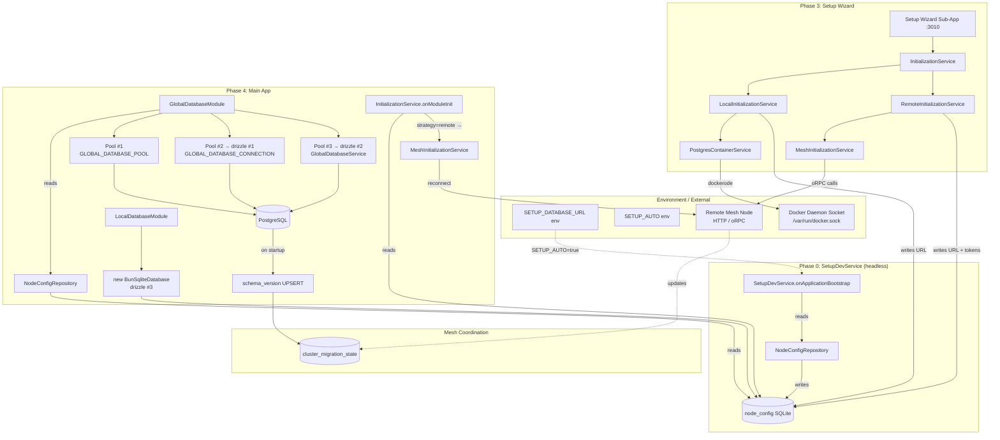
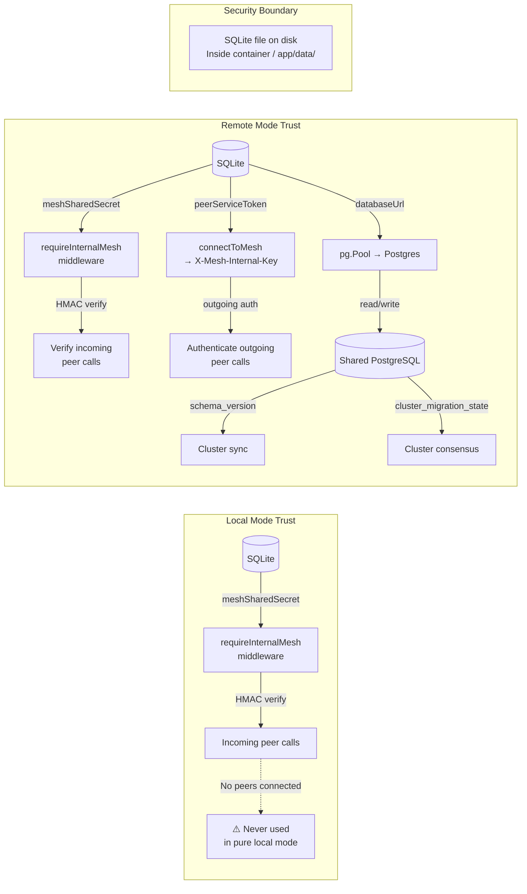

# Database Connection Flows — Local, Remote, and Mesh-Managed

## Complete Reference

---

## Part 1: The Three Connection Modes at a Glance

The database connection is governed by the `strategy` field in the local SQLite `node_config` table. There are exactly **two strategies** (`"local"` and `"remote"`), and **one additional coordination layer** (mesh-managed) that applies on top of either strategy.

| Mode | What It Means | DB URL Source | Multi-Node? |
|------|--------------|---------------|-------------|
| **Locally Managed** | The node owns its database URL | Self-provisioned (Dockerode), or CLI `setup-db`, or `SETUP_DATABASE_URL` env | No — standalone |
| **Remotely Managed** | A mesh gives the node its database URL | Received from `consumeJoinGrant()` response | Yes — joins existing cluster |
| **Mesh-Managed** (add-on) | Cluster coordination via shared Postgres | Same as host strategy | Yes — distributed consensus |

---

## Part 2: The node_config Table — Key to Everything

**File**: `apps/api/src/config/drizzle/local/schema/node-config.ts`

This single-row SQLite table (`id = 1` always) is the **runtime source of truth** for the database connection. It stores everything the node needs to reconnect after a restart:

```
node_config (SQLite, single row)
├── id = 1                             (always)
├── node_id                            (UUID, node identity)
├── strategy: "local" | "remote"       (HOW the DB URL was obtained)
├── setupState:                        (lifecycle: not_started → setup_done → upgrade_*)
├── databaseUrl                        (THE Postgres connection string — null if not configured)
├── deployerVersion                    (from package.json, for version gating)
├── meshUrlsSnapshot[]                 (known peer URLs, for reconnection order)
├── peerServiceToken                   (long-lived token for mesh reconnection — remote only)
├── peerServiceTokenExpiresAt          (expiry for the above)
├── meshSharedSecret                   (shared HMAC key for requireInternalMesh())
├── meshSharedSecretUpdatedAt
├── configuredAt                       (ISO timestamp of first setup completion)
├── scanConfig                         (JSON: per-node scanner preferences)
└── postSetupFlags                     (JSON: feature flags after setup)
```

**Critical rule**: `DATABASE_URL` is **never** read from the environment at runtime. The `SETUP_DATABASE_URL` env var is read **once** by the Phase 0 `SetupDevService`, which persists it to `node_config.databaseUrl`. After that, every component reads from SQLite.

---

## Part 3: The 4-Phase Startup Pipeline

Every API instance goes through this exact boot sequence, orchestrated by `OrchestratorService`:

```mermaid
flowchart TB
    BOOT["main.ts bootstrap()"] --> GW["Phase 1: Gateway Express Server<br/>Port :3005<br/>CORS, RouteRegistry"]
    GW --> DB_RES["Phase 2: DB URL Resolution (headless)"]
    
    subgraph "Phase 2 — SetupDevService"
        DB_RES --> SC[NestFactory.createApplicationContext<br/>SetupDevModule]
        SC --> SVC[SetupDevService.onApplicationBootstrap]
        SVC --> READ{node_config has<br/>databaseUrl?}
        READ -->|Yes| DONE[✅ Already configured]
        READ -->|No| AUTO{SETUP_AUTO?}
        AUTO -->|"true + SETUP_DATABASE_URL"| PERSIST[Persist URL from env<br/>to node_config]
        AUTO -->|"true, no URL"| EMPTY[Persist with empty URL<br/>SQLite-only mode]
        AUTO -->|No| LOG[Log: needs setup wizard]
        DONE --> CLOSE[ctx.close() — destroy context]
        PERSIST --> CLOSE
        EMPTY --> CLOSE
        LOG --> CLOSE
    end
    
    CLOSE --> DECIDE{node_config has<br/>databaseUrl?}
    
    DECIDE -->|Yes| BRIDGE["emitSetupWizardBridge()<br/>→ fire bridge event"]
    BRIDGE --> MESH_INIT["Phase 3: mesh-initializer<br/>Sub-app :3011"]
    MESH_INIT --> MAIN["Phase 4: Main App :3012<br/>225+ routes"]
    
    DECIDE -->|No| WIZARD["Phase 3: setup-wizard Sub-app :3010"]
    WIZARD --> WAIT["await initService.waitForSetup()<br/>(blocks until wizard completes)"]
    WAIT --> BRIDGE
```

### Phase 2 Detail — SetupDevService

```typescript
// apps/api/src/core/setup-dev/setup-dev.service.ts
// Runs INSIDE a lightweight NestJS ApplicationContext (NO HTTP)
// Only depends on LocalDatabaseModule (SQLite), never on GlobalDatabaseModule
class SetupDevService implements OnApplicationBootstrap {
    async onApplicationBootstrap() {
        // CASE 1: Already have databaseUrl → nothing to do
        const config = this.nodeConfigRepository.find();
        if (config?.databaseUrl?.trim()) return;

        // CASE 2: SETUP_AUTO=true + SETUP_DATABASE_URL set → persist
        if (process.env.SETUP_AUTO === "true" && process.env.SETUP_DATABASE_URL) {
            this.nodeConfigRepository.upsert({
                nodeId: randomUUID(),
                strategy: "local",
                setupState: "setup_done",
                databaseUrl: process.env.SETUP_DATABASE_URL,
                configuredAt: new Date().toISOString(),
                // ...
            });
            return;
        }

        // CASE 3: SETUP_AUTO=true, no URL → SQLite-only mode
        // CASE 4: No SETUP_AUTO → log info, wizard needed
    }
}
```

After Phase 2 completes, the NestJS context is destroyed and the gateway starts fresh. The `node_config` table now has the URL (or doesn't), and Phase 3/4 will read it.

---

## Part 4: Locally Managed Flow — Complete Lifecycle

### How It Gets the Database URL

There are **4 paths** to getting a `databaseUrl` in local mode:

| Path | Trigger | Code Path |
|------|---------|-----------|
| **Auto-provision via Docker** | Setup wizard UI, `strategy:'local'`, no `existingDatabaseUrl` | `LocalInitializationService` → `PostgresContainerService.startPostgresContainer()` |
| **Existing URL (manual)** | Setup wizard UI, `existingDatabaseUrl` provided | `LocalInitializationService.probeExistingDatabase()` — runs `SELECT 1` with 5s timeout |
| **Env var (dev)** | `SETUP_AUTO=true` + `SETUP_DATABASE_URL` env | `SetupDevService` writes to `node_config` on Phase 2 |
| **CLI command** | `bun src/cli.ts setup-db --url="postgres://..."` | `SetupDbCommand` → `NodeConfigRepository.upsert()` |

### The Full Local Auto-Provision Flow



### Runtime Behavior After Restart (Local)

When a locally-managed node restarts, it takes a much simpler path:

```mermaid
flowchart TB
    RESTART[Container restart] --> MAIN[main.ts bootstrap]
    MAIN --> GW[Gateway :3005 starts]
    GW --> P2[Phase 2: SetupDevService]
    
    P2 --> READ_SQL{node_config<br/>has databaseUrl?}
    READ_SQL -->|Yes, from previous setup| RETURN[✅ Already configured<br/>→ return immediately]
    
    RETURN --> P3[Phase 3: emit to bridge → mesh-init → main-app]
    P3 --> MAIN_APP[Phase 4: Main App :3012]
    
    MAIN_APP --> GDM[GlobalDatabaseModule factories]
    GDM --> NCR[NodeConfigRepository.find()]
    NCR -->|read| SQLITE[(SQLite: databaseUrl)]
    GDM --> POOL[Create pg.Pool × 3]
    
    POOL --> READY[✅ Database connected]
    
    MAIN_APP --> INIT[InitializationService.onModuleInit]
    INIT --> CHECK{strategy = remote?}
    CHECK -->|"local"| SKIP[⏭ Skip mesh reconnection]
    CHECK -->|"remote"| RECONNECT[Reconnect to mesh peers]
    
    READY --> SERVE[Serving requests on :3005]
```

The key point: **a local-mode restart does not re-provision the database**. It reads the persisted URL and creates pools directly. The auto-provision Docker container from the initial setup persists independently (it has `autoRemove: true`, so it lives as long as it runs).

---

## Part 5: Remotely Managed Flow — Complete Lifecycle

### How It Gets the Database URL

Remote mode has exactly **one path**: the two-step mesh bootstrap protocol.

### The Two-Step Bootstrap Protocol



### The Version Gate Detail



### Runtime After Restart (Remote)

The remote restart is different from local because it must **re-establish mesh connectivity**:

```typescript
// InitializationService.onModuleInit() — runs after GlobalDatabaseModule creates pools
async onModuleInit() {
    this.checkConfigAndEmit()  // emits completion so pools unblock
    
    const config = this.nodeConfigRepository.find()
    if (config?.configuredAt && config.strategy === 'remote' && config.meshUrlsSnapshot?.length) {
        const persistedToken = config.peerServiceToken?.trim() ?? ""
        for (const url of config.meshUrlsSnapshot) {
            try {
                // Try each known mesh URL until one accepts the token
                await this.meshInitializationService.connectToMesh(url, {
                    peerServiceToken: persistedToken.length > 0 ? persistedToken : undefined,
                })
                this.logger.log(`✅ Reconnected to mesh at ${url}`)
                break  // First success = done
            } catch (err) {
                this.logger.warn(`Failed to connect to mesh URL ${url}: ${err.message}`)
            }
        }
    }
}
```



### Why peerServiceToken Matters

Without the `peerServiceToken` (which is persisted in SQLite), the node would need to go through the entire two-step bootstrap again on every restart. With it, the node can directly reconnect using `connectToMesh()`, which sends the token as `X-Mesh-Internal-Key`:

```
connectToMesh() creates an oRPC client that:
1. Sends X-Mesh-Internal-Key: <peerServiceToken>
2. Calls GET /api/mesh/get-local-node on the remote mesh
3. Remote mesh's requireMeshPeer() middleware validates the HMAC token
4. If valid → returns { nodeId, status, ... }
5. If invalid → 401 → try next mesh URL
```

---

## Part 6: Mesh-Managed — The Coordination Layer

Mesh management is **not a separate strategy** — it's a runtime coordination layer that becomes active whenever a node has a Postgres connection AND is connected to mesh peers. The Postgres database itself becomes the coordination backbone.

### Schema Version Tracking

Every time the main app starts, it writes to two tables:



### Cluster Migration Consensus



### What Happens on Version Drift



---

## Part 7: The GlobalDatabaseModule — Runtime Connection Mechanics

This is the module that **creates the actual Postgres connections**. Understanding it is key to understanding all three modes.

### What Happens at Module Init

```mermaid
flowchart TB
    MODULE[GlobalDatabaseModule<br/>@Global()] --> NESTJS[NestJS creates module]
    NESTJS --> PROVIDERS[NestJS evaluates providers]
    
    PROVIDERS --> F1[useFactoryPool<br/>GLOBAL_DATABASE_POOL]
    PROVIDERS --> F2[useFactoryDrizzle<br/>GLOBAL_DATABASE_CONNECTION]
    PROVIDERS --> F3[useFactoryService<br/>GlobalDatabaseService]
    
    F1 -->|1st call| NCR1[NodeConfigRepository.find()]
    F2 -->|2nd call| NCR2[NodeConfigRepository.find()]
    F3 -->|3rd call| NCR3[NodeConfigRepository.find()]
    
    NCR1 -->|all read| SQLITE[(node_config<br/>databaseUrl)]
    NCR2 --> SQLITE
    NCR3 --> SQLITE
    
    F1 --> POOL1[new Pool({connectionString})]
    F2 --> POOL2[new Pool({connectionString})]
    F3 --> POOL3[new Pool({connectionString})]
    
    POOL1 -->|GLOBAL_DATABASE_POOL| UNUSED["❌ Is this actually consumed?<br/>Check needed"]
    POOL2 --> DRIZZLE2[drizzle(pool, schema)]
    POOL3 --> DRIZZLE3[drizzle(pool, schema)]
    DRIZZLE3 --> SERVICE[GlobalDatabaseService<br/>passed to all repositories]
    
    DRIZZLE2 -->|GLOBAL_DATABASE_CONNECTION| CONSUMED["✅ Consumed by repositories<br/>that inject the Drizzle handle"]
```

### The requireDatabaseUrl Gate

```typescript
function requireDatabaseUrl(nodeConfig: NodeConfigRepository): string {
    const config = nodeConfig.find()
    const url = config?.databaseUrl?.trim()
    if (!url) {
        // THROWS — module init fails, app won't start
        throw new Error('No database URL in node_config — cannot start.')
    }
    return url
}
```

This is called **3 times** during module initialization (once per factory). If the URL is missing:
- In Phase 4 (main app): the module fails to initialize, the app crashes
- In the setup wizard (Phase 3): the wizard runs its own DI without GlobalDatabaseModule, so it never hits this gate
- In the CLI: the CLI module has its own `resolveCliDatabaseUrl()` with different fallback behavior (falls back to empty string with warning rather than throwing)

### The SQLite Connection (Always Available)

While the Postgres connection depends on `node_config.databaseUrl`, the **SQLite connection is always available**:

```typescript
// LocalDatabaseModule — runs on EVERY startup, no gate
@Global()
@Module({
    providers: [
        {
            provide: LOCAL_DATABASE_CONNECTION,
            useFactory: () => {
                const dbPath = process.env.NODE_LOCAL_DB_PATH ?? "/app/data/local.db";
                // Create directory if missing
                const sqlite = new BunSqliteDatabase(dbPath);
                sqlite.run("PRAGMA journal_mode = WAL;");
                sqlite.run("PRAGMA busy_timeout = 5000;");
                // Auto-run SQLite migrations
                runSqliteMigrations(sqlite);
                return drizzleSqlite(sqlite, { schema: localSchema });
            },
        },
    ],
})
```

This is why the Phase 0 `SetupDevService` can work without Postgres — it only needs the LocalDatabaseModule, which has zero external dependencies.

---

## Part 8: How the Three Modes Affect the Running App



| Capability | Local Mode | Remote Mode |
|------------|-----------|-------------|
| Postgres reads/writes | ✅ Full access | ✅ Full access |
| SQLite reads/writes | ✅ Full access | ✅ Full access |
| Mesh peer API calls | ❌ No peers to call | ✅ Can call other nodes |
| Peer receives calls | ⚠️ Only if other nodes know its URL | ✅ Via mesh registration |
| Schema version tracking | ✅ (writes to `schema_version` on startup) | ✅ Same |
| Cluster migration consensus | ❌ No peers to form consensus | ✅ Participates |
| Resource ownership | ✅ Standalone (owns everything locally) | ✅ Distributed (via `resource_ownership_index`) |
| Auto-reconnect on restart | ✅ Reads URL from SQLite directly | ✅ Reads URL + reconnects to mesh peers |
| Survives without mesh | ✅ Fully operational standalone | ⚠️ Can't restart if all mesh peers down (no URL) |

---

## Part 9: The Complete Data Flow Diagram



---

## Part 10: Key Architectural Principles

### Principle 1: SQLite as Bootstrap Key

The local SQLite database is the **only system component that is always available** — it's created fresh on every startup if it doesn't exist. Everything else (Postgres, mesh connections) is derived from what's stored in it. This creates a clean bootstrap hierarchy:

```
SQLite (always available) → reads node_config → gets databaseUrl
                                             → gets peerServiceToken
                                             → gets meshSharedSecret
                                             → proceeds with Postgres/mesh
```

### Principle 2: DATABASE_URL Is Never Read at Runtime

The env var `DATABASE_URL` doesn't exist. There's only `SETUP_DATABASE_URL`, which is read **once** by `SetupDevService` and immediately persisted. After that, all components read from SQLite. This means:

- The app does not need env vars to be set at runtime (except for SQLite path)
- The database URL survives container restarts (it's in the SQLite volume)
- You can change the database by running `setup-db` again to update the persisted URL

### Principle 3: Circular Dependency Break

The setup wizard cannot import `GlobalDatabaseModule` (because that would require Postgres, which doesn't exist yet). The break pattern is:

```
Setup Sub-App → LocalDatabaseModule only (SQLite) → writes databaseUrl
Main App → LocalDatabaseModule + GlobalDatabaseModule → reads databaseUrl from SQLite
```

The bridge between them is static: `SetupWizardBridge` with a `sharedStates` Map keyed by bridge class name.

### Principle 4: Mode is Immutable After Setup

Once a node has `strategy:'local'` or `strategy:'remote'` in `node_config`, that strategy is **permanent for that node**. There is no code path that transitions from `local` → `remote` or vice versa without manual SQLite editing. To change strategy, you'd need to:

1. Stop the app
2. Delete or reset the SQLite `node_config` table
3. Re-run the setup wizard with the new strategy

---

## Part 11: Trust Model — Secrets in SQLite

The local SQLite database stores secrets that are critical to both modes:

| Secret | Used For | Present in Local? | Present in Remote? |
|--------|----------|------------------|-------------------|
| `databaseUrl` | Postgres connection | ✅ Yes | ✅ Yes |
| `meshSharedSecret` | HMAC signing of `X-Mesh-Internal-Key` | ✅ Yes (generated locally) | ✅ Yes (received from mesh) |
| `peerServiceToken` | Mesh reconnection without re-enrollment | ❌ No (no peers) | ✅ Yes (returned from `consumeJoinGrant`) |



In local mode, the `meshSharedSecret` is generated but effectively unused (no peers call it). In remote mode, it becomes the trust anchor for all peer-to-peer communication — both incoming (`requireInternalMesh()` middleware) and outgoing (`X-Mesh-Internal-Key` header).

---

## Part 12: Failure Modes by Strategy

| Failure Scenario | Local Mode | Remote Mode |
|-----------------|-----------|-------------|
| **Postgres goes down** | `isHealthy()` returns false, queries throw, app enters degraded state | Same — but mesh peers may notice via `cluster_nodes` health checks |
| **SQLite file deleted** | On next restart: fresh SQLite with `not_started` state → setup wizard required | Same — all secrets lost, full re-enrollment needed |
| **Mesh peer unreachable** | N/A (no peers) | On restart: `onModuleInit()` logs warning for each failed URL, but Postgres still works (URL is cached in SQLite). Mesh features unavailable. |
| **peerServiceToken expires** | N/A (no token) | On restart: reconnection to mesh fails. Postgres still works. Admin must re-run bootstrap to get new token. |
| **meshSharedSecret rotated** | Local: regenerated on next setup. No impact on running app (no peers). | Remote: all peer-to-peer calls fail with 401 until node re-bootstraps to get new secret. |
| **Docker daemon down on startup** | Only affects auto-provisioning (first setup). After URL is persisted, Docker is not needed. | N/A (no auto-provisioning in remote mode) |
| **Container IP changes** | Local: no impact (Postgres URL doesn't change after persistence) | Remote: if mesh peer URLs are IP-based, reconnection fails. DNS-based URLs are fine. |
