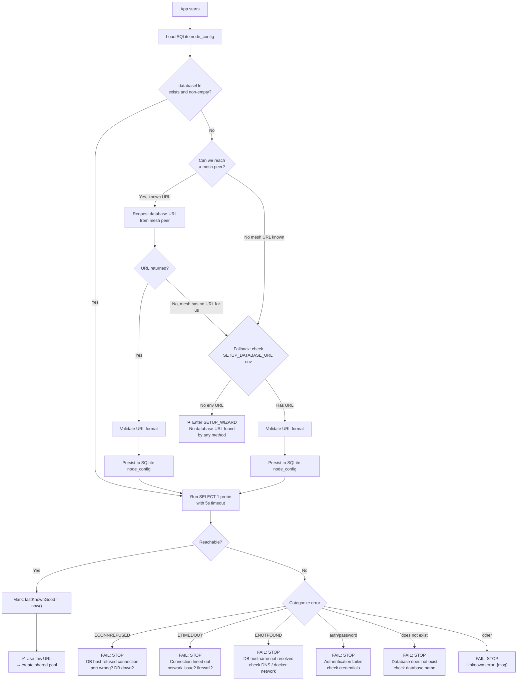
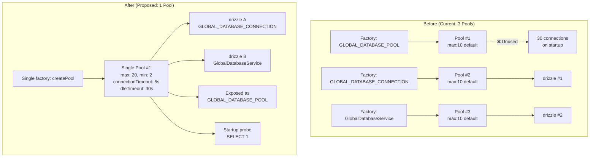
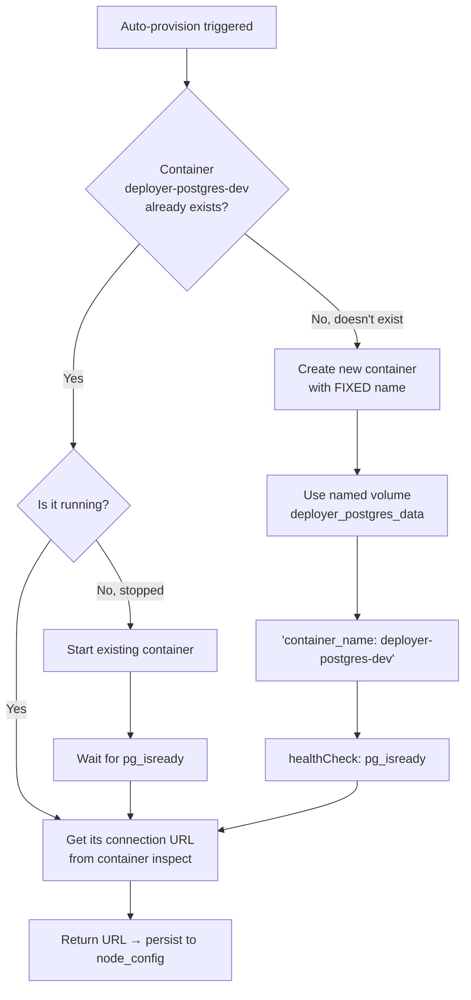
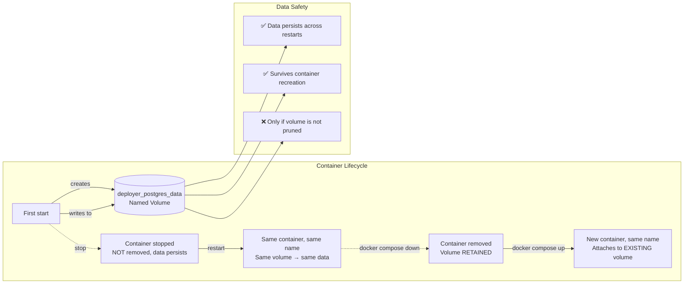
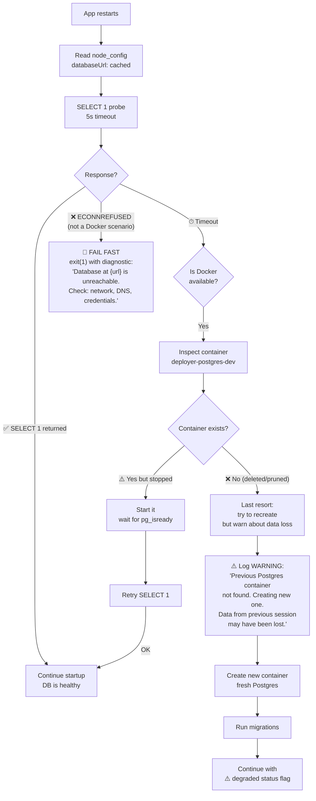

# Enhanced Database Connection Architecture — Proposal

> Based on deep analysis of the current codebase + research into best patterns for distributed NestJS/Postgres/SQLite systems. This document proposes a new architecture that is **fluent**, **fail-fast**, **resilient**, and handles **every startup scenario**.

---

## Part 1: Core Design Principles

### Principle P1: Fail Fast, Fail Loud
If the database is unreachable at startup, the app **must stop** with a clear diagnostic message. Never silently degrade at startup.

### Principle P2: Single Source of Truth for DB URL
Only one mechanism resolves the database URL at any given time. The resolution chain is:
```
Mesh peer → Local SQLite cache → Environment → Hard error
```

### Principle P3: Single Shared Pool
One `pg.Pool` instance. Not three. The pool is created once, probed, then shared across all drizzle instances and services.

### Principle P4: State Machine at Every Level
The node lifecycle is a well-defined state machine. Every state transition is explicit. Every state is observable via the health endpoint.

### Principle P5: Last Known Good
The SQLite `node_config.databaseUrl` is always the **last known good** URL. Even if the DB is currently unreachable, the URL is preserved for diagnostics and recovery.

### Principle P6: No Database Duplication
Locally managed Postgres containers are **named** and **reused** across restarts. Never create a second Postgres if one already exists.

---

## Part 2: The Node Lifecycle State Machine

```
                         ┌─────────────────────────────────────────┐
                         │                                         │
                         ▼                                         │
                   ┌──────────┐                                    │
            ┌──────│  BOOT    │◄──── (process restart)             │
            │      └────┬─────┘                                    │
            │           │                                          │
            │           ▼                                          │
            │      ┌──────────┐     ┌──────────────────┐          │
            │      │ DISCOVER │────►│  Network Error   │          │
            │      └────┬─────┘     │ → retry or fail  │          │
            │           │           └──────────────────┘          │
            │           ▼                                          │
            │      ┌──────────────────────┐                       │
            │      │  URL FOUND?          │                       │
            │      └──┬───────┬───────────┘                       │
            │         │       │                                   │
            │         ▼       ▼                                   │
            │    ┌────────┐  ┌──────────────┐                    │
            │    │  YES   │  │  NO          │                    │
            │    └───┬────┘  └──────┬───────┘                   │
            │        │              │                            │
            │        ▼              ▼                            │
            │   ┌────────┐   ┌──────────────┐                   │
            │   │  PROBE │   │  SETUP       │                   │
            │   │  DB    │   │  WIZARD      │                   │
            │   └───┬────┘   └──────┬───────┘                   │
            │        │              │                            │
            │        ▼              │                            │
            │   ┌────────┐         │                            │
            │   │  ALIVE? │         │                            │
            │   └──┬──┬──┘         │                            │
            │      │  │            │                            │
            │      ▼  ▼            │                            │
            │  ┌────┐ ┌──────────┐ │                            │
            │  │YES │ │  NO      │ │                            │
            │  └─┬──┘ │ FAIL     │ │                            │
            │    │    │ STOP     │ │                            │
            │    │    └──────────┘ │                            │
            │    ▼                 ▼                            │
            │  ┌────────┐   ┌──────────────┐                   │
            │  │  READY │   │  SETUP       │                   │
            │  │        │   │  COMPLETE    │                   │
            │  └───┬────┘   │  → probe DB  │                   │
            │      │        └──────┬───────┘                   │
            │      ▼               │                            │
            │  ┌────────┐         │                            │
            │  │  MESH  │◄────────┘                            │
            │  │  PEER  │                                      │
            │  └───┬────┘                                      │
            │      │                                           │
            │      ▼                                           │
            │  ┌────────┐     ┌──────────────────┐            │
            │  │ HEALTHY│────►│  DB DISCONNECT   │────────────┘
            │  │        │     │  → circuit open  │
            │  └────────┘     └──────────────────┘
            │
            │  (Node upgrade or config change)
            │
            └──────────────────────────────────────────────────┘
```

### State Definitions

| State | Meaning | Actions |
|-------|---------|---------|
| `BOOT` | Process starts | Initialize SQLite, load node_config from disk |
| `DISCOVER` | Resolve DB URL | Ask mesh → read SQLite cache → read env |
| `URL_FOUND` | URL resolved | Validate format, proceed to PROBE |
| `URL_NOT_FOUND` | No URL anywhere | Launch setup wizard, block further startup |
| `PROBE` | Test DB connectivity | `SELECT 1` with timeout, categorize errors |
| `ALIVE` | DB reachable | Create shared pool, proceed to READY |
| `DEAD` | DB unreachable | Log diagnostic, **exit(1)** — fail fast |
| `READY` | Pool created + probed | Start accepting traffic |
| `MESH_PEER` | Mesh connected | Join cluster, register schema_version |
| `HEALTHY` | Fully operational | All systems go |
| `DEGRADED` | DB lost mid-run | Circuit breaker open, recovery loop active |
| `SETUP_WIZARD` | First-run setup | UI wizard running on port 3010 |

### Startup Decision Matrix

| Scenario | node_config.state | SQLite has URL? | DB Reachable? | Mesh Peer Known? | Action |
|----------|------------------|-----------------|---------------|------------------|--------|
| **Fresh install** | `not_started` | No | N/A | No | → SETUP_WIZARD |
| **Restart, local** | `setup_done` | Yes | Yes | No | → PROBE → READY → HEALTHY |
| **Restart, local, DB gone** | `setup_done` | Yes | **No** | No | → FAIL → **STOP with error** |
| **Restart, remote** | `setup_done` | Yes | Yes | Yes | → PROBE → READY → MESH_PEER → HEALTHY |
| **Restart, remote, mesh down** | `setup_done` | Yes (cached) | Yes | **No** | → PROBE → READY → **warn but continue** |
| **Restart, both down** | `setup_done` | Yes (stale) | **No** | **No** | → FAIL → **STOP with error** |
| **Upgrade** | `upgrade_pending` | Yes | Yes | Yes | → PROBE → READY → MESH_PEER → run migrations |
| **Auto-provision dev** | `not_started` | No (will write) | N/A | No | → SETUP_WIZARD → auto-provision Docker → PROBE → READY |
| **SQLite lost** | N/A (file missing) | N/A | N/A | N/A | → fresh SQLite → `not_started` → SETUP_WIZARD |

---

## Part 3: Database URL Resolution Chain



### Resolution Order (Chain of Responsibility)

```typescript
async function resolveDatabaseUrl(): Promise<string | null> {
  // ── Step 1: Try local SQLite cache (fast path) ────────────────
  const cached = nodeConfig.find()?.databaseUrl?.trim()
  if (cached) {
    logger.log('📦 Found cached database URL in node_config')
    return cached  // ← Most common path: restart with existing config
  }

  // ── Step 2: Ask mesh peers (remote strategy) ──────────────────
  if (meshUrls.length > 0) {
    for (const url of meshUrls) {
      try {
        const meshUrl = await meshClient.discoverDatabaseUrl(url)
        if (meshUrl) {
          logger.log(`🌐 Discovered database URL from mesh peer: ${url}`)
          return meshUrl
        }
      } catch (err) {
        logger.warn(`Failed to query mesh peer ${url}: ${err.message}`)
      }
    }
  }

  // ── Step 3: Environment variable (first-run only) ─────────────
  if (process.env.SETUP_DATABASE_URL?.trim()) {
    logger.log('📝 Using SETUP_DATABASE_URL from environment')
    return process.env.SETUP_DATABASE_URL.trim()
  }

  // ── Step 4: Nothing found ─────────────────────────────────────
  logger.warn('⏳ No database URL found by any method — setup wizard needed')
  return null
}
```

---

## Part 4: Single Shared Pool Architecture



### Proposed Module Structure

```typescript
// global-database.module.ts — NEW version with shared pool

const SHARED_POOL: Pool | null = null  // module-scoped singleton

function createPool(databaseUrl: string): Pool {
  return new Pool({
    connectionString: databaseUrl,
    max: 20,
    min: 2,
    connectionTimeoutMillis: 5_000,   // Fail fast: no infinite wait
    idleTimeoutMillis: 30_000,         // Recycle idle connections
    maxUses: 7_500,                    // Prevent connection memory bloat
    application_name: 'deployer-api',  // Shows in pg_stat_activity
    allowExitOnIdle: true,
  })
}

async function probeDatabase(databaseUrl: string): Promise<void> {
  const probePool = new Pool({
    connectionString: databaseUrl,
    max: 1,
    connectionTimeoutMillis: 5_000,
    idleTimeoutMillis: 1_000,
    allowExitOnIdle: true,
  })
  
  try {
    const start = Date.now()
    await probePool.query('SELECT 1')
    const latency = Date.now() - start
    logger.log(`✅ Database reachable (${latency}ms)`)
  } catch (err: unknown) {
    const message = err instanceof Error ? err.message : String(err)
    const diagnostic = categorizeDatabaseError(message)
    logger.error(`❌ Database unreachable: ${diagnostic}`)
    throw new Error(diagnostic)  // ← Fail fast: module init fails, app stops
  } finally {
    await probePool.end().catch(() => undefined)
  }
}

function categorizeDatabaseError(message: string): string {
  if (message.includes('ECONNREFUSED'))
    return 'Connection refused — is the database server running? Check: host, port, and that the container is up.'
  if (message.includes('ETIMEDOUT') || message.includes('timeout'))
    return 'Connection timed out — check firewall rules and network connectivity.'
  if (message.includes('ENOTFOUND'))
    return 'Hostname could not be resolved — check DNS or docker network configuration.'
  if (message.includes('password') || message.includes('authentication'))
    return 'Authentication failed — verify username and password in the connection string.'
  if (message.includes('does not exist'))
    return 'Database does not exist — verify the database name in the connection string.'
  return `Unknown database error: ${message}`
}

@Global()
@Module({ ... })
export class GlobalDatabaseModule {
  static async forRoot(nodeConfig: NodeConfigRepository): Promise<DynamicModule> {
    const url = nodeConfig.find()?.databaseUrl?.trim()
    if (!url) {
      throw new Error('Cannot initialize GlobalDatabaseModule: no database URL in node_config')
    }
    
    // ── PROBE FIRST: fail fast if DB unreachable ───────────
    await probeDatabase(url)
    
    // ── Create shared pool ─────────────────────────────────
    const pool = createPool(url)
    
    // ── Pool error handling ────────────────────────────────
    pool.on('error', (err) => {
      logger.error(`🚨 Pool error: ${err.message}`)
      // Circuit breaker would trip here
    })
    
    return {
      module: GlobalDatabaseModule,
      providers: [
        { provide: GLOBAL_DATABASE_POOL, useValue: pool },
        { provide: GLOBAL_DATABASE_CONNECTION, useFactory: (p: Pool) => drizzle(p, { schema: globalSchema }), inject: [GLOBAL_DATABASE_POOL] },
        { provide: GlobalDatabaseService, useFactory: (p: Pool) => new GlobalDatabaseService(drizzle(p, { schema: globalSchema })), inject: [GLOBAL_DATABASE_POOL] },
      ],
      exports: [GlobalDatabaseService, GLOBAL_DATABASE_CONNECTION, GLOBAL_DATABASE_POOL],
    }
  }
}
```

---

## Part 5: Enhanced Startup State Machine

```typescript
// app-lifecycle-state.service.ts — New centralized state manager

type NodePhase =
  | 'boot'              // Process started
  | 'discovering'       // Resolving database URL
  | 'probing'           // Testing DB connectivity
  | 'ready'             // Pool created, DB reachable
  | 'joining_mesh'      // Connecting to mesh peers
  | 'healthy'           // Fully operational
  | 'degraded'          // DB was lost mid-run, recovery loop
  | 'failed'            // Fatal error — will exit
  | 'shutting_down'     // Graceful shutdown in progress

interface NodeState {
  phase: NodePhase
  databaseUrl: string | null
  databaseReachable: boolean | null
  meshConnected: boolean
  lastKnownGoodAt: string | null    // ISO timestamp
  startedAt: string                 // ISO timestamp
  error: string | null
  configStrategy: 'local' | 'remote' | null
}

@Injectable()
export class AppLifecycleStateService {
  private state: NodeState

  constructor() {
    this.state = {
      phase: 'boot',
      databaseUrl: null,
      databaseReachable: null,
      meshConnected: false,
      lastKnownGoodAt: null,
      startedAt: new Date().toISOString(),
      error: null,
      configStrategy: null,
    }
  }

  transition(phase: NodePhase, metadata?: Partial<NodeState>): void {
    const from = this.state.phase
    this.state = { ...this.state, phase, ...metadata }
    this.logger.log(`🔄 State: ${from} → ${phase}${metadata?.error ? ` ❌ ${metadata.error}` : ''}`)
    
    // If transitioning to 'failed', trigger shutdown
    if (phase === 'failed') {
      this.logger.error(`🚨 Fatal error: ${metadata?.error}`)
      process.exit(1)  // ← Fail fast
    }
  }

  getState(): Readonly<NodeState> {
    return this.state
  }
}

// OrchestratorService — Updated startup flow
async onApplicationBootstrap(): Promise<void> {
  this.lifecycle.transition('discovering')
  
  // ── Step 1: Resolve database URL ────────────────────────────
  const url = await this.resolveDatabaseUrl()
  
  if (!url) {
    this.lifecycle.transition('boot', { error: 'No database URL found' })
    // Start setup wizard instead of failing
    await this.startSetupWizard()
    return
  }
  
  // ── Step 2: Probe database ──────────────────────────────────
  this.lifecycle.transition('probing', { databaseUrl: url })
  const probeResult = await this.probeDatabase(url)
  
  if (!probeResult.reachable) {
    this.lifecycle.transition('failed', { 
      error: probeResult.error,
      databaseReachable: false,
    })
    // process.exit(1) is called inside transition('failed')
    return  // ← Never reached
  }
  
  this.lifecycle.transition('ready', { 
    databaseReachable: true,
    lastKnownGoodAt: new Date().toISOString(),
  })
  
  // ── Step 3: Create pool & start main app ────────────────────
  await this.startMainApp()
  
  // ── Step 4: Connect to mesh ─────────────────────────────────
  this.lifecycle.transition('joining_mesh')
  await this.connectToMesh()
  
  this.lifecycle.transition('healthy', { meshConnected: true })
}
```

---

## Part 6: Local Database Auto-Provisioning (Improved)

### Problem with Current Implementation

The current `PostgresContainerService.startPostgresContainer()` creates a container with `autoRemove: true` and a random UUID name. This means:
- Container name changes every time → Docker leaves orphan containers
- `autoRemove: true` → container is deleted when stopped → data lost unless using volumes
- Volume name is not explicitly set → Docker generates random volume names

### Proposed Improvement



### Implementation

```typescript
// enhanced-postgres-container.service.ts
const MANAGED_CONTAINER_NAME = 'deployer-postgres-dev'
const MANAGED_VOLUME_NAME = 'deployer_postgres_data'

async ensurePostgresRunning(): Promise<string> {
  const docker = this.dockerService.getDockerClient()
  
  // ── Step 1: Check for existing container ──────────────────
  try {
    const existing = docker.getContainer(MANAGED_CONTAINER_NAME)
    const info = await existing.inspect()
    
    if (info.State.Running) {
      // Already running — return its connection URL
      this.logger.log('♻️ Reusing existing Postgres container')
      return this.buildConnectionUrl(info)
    }
    
    // Container exists but stopped — restart it
    this.logger.log('🔄 Restarting stopped Postgres container')
    await existing.start()
    await this.waitForPostgresReady(existing)
    return this.buildConnectionUrl(info)
    
  } catch (err: unknown) {
    // Container doesn't exist — need to create it
    if (err instanceof Error && err.message.includes('no such container')) {
      this.logger.log('📦 Creating new Postgres container')
      return this.createPostgresContainer(docker)
    }
    throw err
  }
}

private async createPostgresContainer(docker: Dockerode): Promise<string> {
  // Ensure named volume exists
  const volumes = await docker.listVolumes()
  const hasVolume = volumes.Volumes?.some(v => v.Name === MANAGED_VOLUME_NAME)
  if (!hasVolume) {
    await docker.createVolume({ Name: MANAGED_VOLUME_NAME })
    this.logger.log(`📀 Created named volume: ${MANAGED_VOLUME_NAME}`)
  }
  
  // Create container with FIXED name
  const container = await docker.createContainer({
    name: MANAGED_CONTAINER_NAME,
    Image: 'postgres:16-alpine',
    Env: [
      'POSTGRES_DB=deployer',
      'POSTGRES_USER=deployer',
      'POSTGRES_PASSWORD=deployer',
    ],
    HostConfig: {
      PortBindings: { '5432/tcp': [{ HostPort: '5432' }] },
      Binds: [`${MANAGED_VOLUME_NAME}:/var/lib/postgresql/data`],
      AutoRemove: false,  // ← CRITICAL: don't delete on stop
    },
    Healthcheck: {
      Test: ['CMD-SHELL', 'pg_isready -U deployer -d deployer'],
      Interval: 1_000_000_000,
      Timeout: 5_000_000_000,
      Retries: 30,
      StartPeriod: 5_000_000_000,
    },
  })
  
  await container.start()
  await this.waitForPostgresReady(container)
  return this.buildConnectionUrl(await container.inspect())
}
```

### Volume Persistence Strategy



---

## Part 7: Health Check & Resilience

### Enhanced Health Check Endpoint

```typescript
// health.controller.ts — Returns full node state
@Get('/health')
async health(): Promise<HealthResponse> {
  const state = this.lifecycle.getState()
  
  return {
    status: state.phase === 'healthy' ? 'healthy' 
          : state.phase === 'degraded' ? 'degraded' 
          : 'starting',
    phase: state.phase,
    uptime: Math.floor((Date.now() - new Date(state.startedAt).getTime()) / 1000),
    database: {
      configured: state.databaseUrl !== null,
      reachable: state.databaseReachable,
      lastKnownGood: state.lastKnownGoodAt,
    },
    mesh: {
      connected: state.meshConnected,
      strategy: state.configStrategy,
    },
    version: DEPLOYER_VERSION,
  }
}
```

### Circuit Breaker for DB Operations

```typescript
// db-circuit-breaker.service.ts
@Injectable()
export class DatabaseCircuitBreaker {
  private state: 'closed' | 'open' | 'half-open' = 'closed'
  private failureCount = 0
  private lastFailureTime = 0
  private readonly threshold = 5
  private readonly resetTimeoutMs = 30_000
  private recoveryTimer: ReturnType<typeof setTimeout> | null = null

  constructor(
    private readonly lifecycle: AppLifecycleStateService,
    private readonly pool: Pool,
  ) {
    // Listen for pool errors
    this.pool.on('error', () => this.recordFailure())
  }

  async execute<T>(operation: string, fn: () => Promise<T>): Promise<T> {
    if (this.state === 'open') {
      const elapsed = Date.now() - this.lastFailureTime
      if (elapsed < this.resetTimeoutMs) {
        throw new ServiceUnavailableError(
          `Database unavailable (circuit open for ${Math.round((this.resetTimeoutMs - elapsed) / 1000)}s more)`
        )
      }
      this.state = 'half-open'
    }

    try {
      const result = await fn()
      this.onSuccess()
      return result
    } catch (err) {
      this.recordFailure()
      throw err
    }
  }

  private onSuccess(): void {
    if (this.state === 'half-open') {
      this.lifecycle.transition('healthy', { databaseReachable: true })
    }
    this.failureCount = 0
    this.state = 'closed'
    if (this.recoveryTimer) {
      clearTimeout(this.recoveryTimer)
      this.recoveryTimer = null
    }
  }

  private recordFailure(): void {
    this.failureCount++
    this.lastFailureTime = Date.now()

    if (this.failureCount >= this.threshold) {
      this.state = 'open'
      this.lifecycle.transition('degraded', {
        databaseReachable: false,
        error: `Circuit breaker opened after ${this.failureCount} failures`,
      })
      this.scheduleRecovery()
    }
  }

  private scheduleRecovery(): void {
    const delay = Math.min(1_000 * 2 ** Math.min(this.failureCount - this.threshold, 5), 30_000)
    this.recoveryTimer = setTimeout(async () => {
      try {
        const probePool = new Pool({
          connectionString: this.pool.config.connectionString!,
          max: 1,
          connectionTimeoutMillis: 3_000,
        })
        await probePool.query('SELECT 1')
        await probePool.end()
        this.onSuccess()
      } catch {
        this.scheduleRecovery()  // Exponential backoff
      }
    }, delay)
  }
}
```

### Pool Drain on Shutdown

```typescript
// main.ts shutdown handler — NEW with proper pool drain
async function gracefulShutdown(signal: string) {
  log.info(`${signal} received — draining connections…`)
  
  // 1. Stop accepting new requests
  server.close()
  
  // 2. Drain Postgres pool
  try {
    await pool.end()
    log.info('✅ Postgres pool drained')
  } catch (err) {
    log.error('Error draining Postgres pool', err)
  }
  
  // 3. Close SQLite
  try {
    sqlite.close()
    log.info('✅ SQLite closed')
  } catch { /* best effort */ }
  
  // 4. Force exit after timeout
  setTimeout(() => process.exit(1), 30_000).unref()
}
```

---

## Part 8: Handling DB Disappearance at Restart

When the app restarts and the database URL from `node_config` points to a database that no longer exists:



### Implementation

```typescript
// database-startup-guard.service.ts
@Injectable()
export class DatabaseStartupGuard {
  async ensureDatabaseAvailable(nodeConfig: NodeConfigRepository): Promise<void> {
    const url = nodeConfig.find()?.databaseUrl?.trim()
    if (!url) return  // No DB configured — skip guard
    
    const probeResult = await this.probe(url)
    if (probeResult.reachable) return  // ✅ All good
    
    // ── DB unreachable — try to recover if Docker is available ──
    if (await this.isDockerAvailable()) {
      const recovered = await this.tryDockerRecovery()
      if (recovered) {
        logger.warn('⚠️ Database recovered via Docker — data may have been lost')
        return
      }
    }
    
    // ── Cannot recover — fail fast ─────────────────────────────
    const diagnostic = this.buildDiagnostic(url, probeResult.error!)
    logger.error(diagnostic)
    throw new Error(diagnostic)
  }
  
  private async tryDockerRecovery(): Promise<boolean> {
    try {
      const docker = new Dockerode()
      const container = docker.getContainer('deployer-postgres-dev')
      const info = await container.inspect()
      
      if (info.State.Running) {
        // Running but not responding — something else is wrong
        return false
      }
      
      // Container exists but stopped — restart it
      logger.log('🔄 Restarting stopped Postgres container...')
      await container.start()
      await this.waitForPostgres(container)
      return true
      
    } catch (err: unknown) {
      if (err instanceof Error && err.message.includes('no such container')) {
        // Container was deleted — could recreate but data is lost
        logger.warn('❌ Postgres container not found — cannot recover automatically')
        return false
      }
      logger.error(`Docker recovery error: ${(err as Error).message}`)
      return false
    }
  }
  
  private buildDiagnostic(url: string, error: string): string {
    const redacted = url.replace(/\/\/[^:]+:[^@]+@/, '//***:***@')
    return [
      `━━━━━━━━━━━━━━━━━━━━━━━━━━━━━━━━━━━━━━━━━━━`,
      `❌ DATABASE CONNECTION FAILED`,
      `━━━━━━━━━━━━━━━━━━━━━━━━━━━━━━━━━━━━━━━━━━━`,
      `  URL: ${redacted}`,
      `  Error: ${error}`,
      ``,
      `  Possible causes:`,
      `  • Database container stopped or deleted`,
      `  • Network changed (new Docker network IP range)`,
      `  • Credentials rotated but node_config not updated`,
      `  • Host not reachable from this container`,
      ``,
      `  Actions:`,
      `  1. Check if the database is running: docker ps | grep postgres`,
      `  2. Verify network: docker network ls`,
      `  3. Run setup-db again: bun run db:setup --url="postgres://..."`,
      `  4. Or reset and re-run setup wizard`,
      `━━━━━━━━━━━━━━━━━━━━━━━━━━━━━━━━━━━━━━━━━━━`,
    ].join('\n')
  }
}
```

---

## Part 9: Proposed File Changes Summary

| File | Action | Change |
|------|--------|--------|
| `apps/api/src/core/modules/database/global/global-database.module.ts` | **Rewrite** | Single shared pool, probe before creating, fail fast |
| `apps/api/src/core/modules/database/shared/database.service.ts` | **Update** | Fix empty `catch {}`, add proper error logging |
| `apps/api/src/core/modules/database/database-connection.ts` | **Keep** | Tokens stay, but consolidate to single pool |
| `apps/api/src/core/orchestrator/orchestrator.service.ts` | **Update** | Add fail-fast probe before main-app starts |
| `apps/api/src/core/modules/docker/containers/postgres/postgres-container.service.ts` | **Rewrite** | Fixed container name, named volume, reuse existing |
| `apps/api/src/main.ts` | **Update** | Add pool drain + SQLite close on shutdown |
| `apps/api/src/core/modules/setup/services/local-initialization.service.ts` | **Update** | Use new PostgresContainerService pattern |
| `apps/api/src/core/modules/database/services/database-probe.service.ts` | **New** | Reusable DB probe with categorized errors |
| `apps/api/src/core/modules/lifecycle/app-lifecycle-state.service.ts` | **New** | Centralized state machine |
| `apps/api/src/core/modules/database/services/database-circuit-breaker.service.ts` | **New** | Circuit breaker for DB resilience |
| `apps/api/src/core/modules/database/services/database-startup-guard.service.ts` | **New** | Fail-fast guard with Docker recovery |
| `apps/api/src/core/modules/setup/repositories/node-config.repository.ts` | **Update** | Add `lastKnownGoodAt` field support |

---

## Part 10: Migration Path

The migration from current to proposed can be done incrementally:

1. **Phase 1 — Fail Fast** (1 session): Add `DatabaseStartupGuard` + probe → stop on unreachable DB. This is purely additive — doesn't change existing behavior for healthy DBs.

2. **Phase 2 — Single Pool** (1 session): Consolidate the 3 factory functions into 1 pool creation. Requires careful verification that `GLOBAL_DATABASE_POOL` is not consumed anywhere (or update consumers).

3. **Phase 3 — State Machine** (1 session): Add `AppLifecycleStateService` and wire it into the orchestrator + health endpoint. Replace ad-hoc status checks with state transitions.

4. **Phase 4 — Container Management** (1 session): Update `PostgresContainerService` to use fixed names + volumes. Add the Docker recovery path to `DatabaseStartupGuard`.

5. **Phase 5 — Circuit Breaker** (1 session): Add `DatabaseCircuitBreaker` service and integrate with pool error events.

6. **Phase 6 — Cleanup** (1 session): Remove dead code (the 2 unused pool factories, the empty catch in `isHealthy()`).
